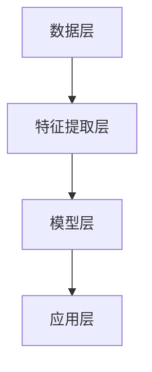
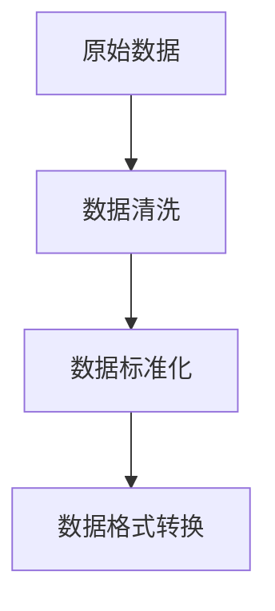
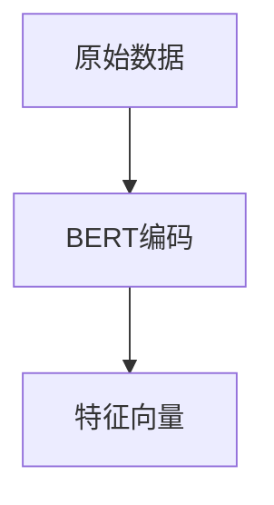
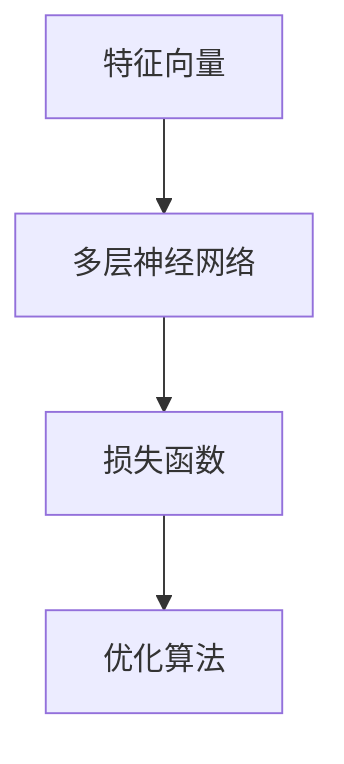
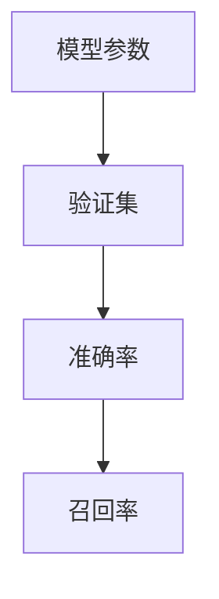
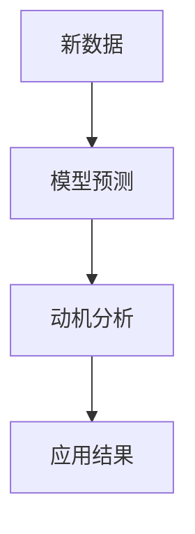

                 

关键词：人工智能、人类动机、动机图谱、AI模型、神经科学、心理学、行为分析

> 摘要：本文旨在探讨人工智能在理解人类动机方面的最新进展，通过构建欲望地图3.0，揭示人类行为背后的深层动机，为人工智能与人类交互提供理论支持。本文首先介绍了人类动机的研究背景，随后详细描述了欲望地图3.0的构建过程，包括核心算法原理、数学模型、具体操作步骤，以及代码实例。最后，文章讨论了欲望地图3.0在实际应用中的价值及其未来发展方向。

## 1. 背景介绍

人类动机作为心理学和神经科学的核心研究领域，长期以来受到广泛关注。动机是人类行为的核心驱动力，它激发个体采取特定行动，以满足内在需求或目标。传统的心理学研究主要依靠问卷调查和访谈等方法，这些方法在一定程度上揭示了人类动机的多样性，但难以深入分析动机的内在机制。

随着人工智能技术的迅猛发展，尤其是深度学习和神经网络的崛起，我们开始有条件从数据的角度，运用人工智能技术对人类动机进行定量分析和理解。人工智能在行为分析、情感识别、图像处理等领域取得了显著成果，这为构建全面的人类动机图谱提供了技术支撑。

本文旨在结合人工智能和心理学研究成果，构建欲望地图3.0。欲望地图3.0是一个基于深度学习和大数据分析的人类动机模型，它能够通过分析人类行为数据，揭示行为背后的动机驱动因素，为人工智能与人类交互提供新的理论框架。

## 2. 核心概念与联系

### 2.1 人工智能与人类动机的关系

人工智能在理解人类动机方面的优势主要体现在以下几个方面：

1. **数据处理能力**：人工智能能够处理海量行为数据，通过大数据分析揭示人类行为的规律和动机。
2. **模式识别**：利用深度学习算法，人工智能可以识别出复杂的行为模式，这些模式往往与特定的动机相关。
3. **实时响应**：人工智能系统能够实时分析人类行为，提供即时反馈，帮助个体理解自己的动机。

### 2.2 欲望地图3.0的架构

欲望地图3.0的架构分为以下几个层次：

1. **数据层**：收集和分析人类行为数据，包括社交媒体互动、购物行为、搜索引擎记录等。
2. **特征提取层**：通过特征提取算法（如Word2Vec、BERT等），将原始数据转换为高维特征向量。
3. **模型层**：构建基于深度学习的动机预测模型，使用神经网络对特征向量进行训练，以预测个体行为背后的动机。
4. **应用层**：将预测模型应用于实际场景，如个性化推荐、行为干预等。

### 2.3 Mermaid流程图



## 3. 核心算法原理 & 具体操作步骤

### 3.1 算法原理概述

欲望地图3.0的核心算法是基于深度学习的动机预测模型。该模型通过以下步骤实现：

1. **数据预处理**：清洗和标准化原始数据，将数据转换为适合机器学习的格式。
2. **特征提取**：使用预训练的深度学习模型（如BERT）提取数据的高维特征向量。
3. **模型训练**：使用训练集对动机预测模型进行训练，模型包括多层神经网络。
4. **模型评估**：使用验证集评估模型性能，调整模型参数以优化性能。
5. **预测应用**：使用训练好的模型对新的数据进行动机预测，并应用于实际场景。

### 3.2 算法步骤详解

#### 3.2.1 数据预处理



#### 3.2.2 特征提取



#### 3.2.3 模型训练



#### 3.2.4 模型评估



#### 3.2.5 预测应用



### 3.3 算法优缺点

#### 优点：

1. **高效性**：基于深度学习的算法能够处理大规模数据，并快速提取特征。
2. **准确性**：深度学习模型在许多行为分析任务中表现出色，具有较高的预测准确性。
3. **泛化性**：模型可以通过迁移学习在新数据上表现良好。

#### 缺点：

1. **计算成本**：深度学习模型需要大量的计算资源，尤其是训练阶段。
2. **数据依赖性**：模型的性能很大程度上依赖于训练数据的质量和代表性。
3. **隐私问题**：行为数据往往涉及个人隐私，如何在保护隐私的同时进行数据分析是一个挑战。

### 3.4 算法应用领域

1. **个性化推荐**：根据用户的动机和行为，提供个性化的推荐服务。
2. **用户行为分析**：帮助企业更好地了解用户需求，优化产品和服务。
3. **健康监控**：通过分析健康数据，预测个体的健康风险和动机。
4. **社会工程**：在网络安全和欺诈检测领域，分析行为动机以防止恶意行为。

## 4. 数学模型和公式 & 详细讲解 & 举例说明

### 4.1 数学模型构建

欲望地图3.0的数学模型基于概率图模型，其核心公式为：

$$
P(\text{行为} | \text{动机}) = \frac{P(\text{动机} | \text{行为}) \cdot P(\text{行为})}{P(\text{动机})}
$$

其中，$P(\text{行为} | \text{动机})$表示给定动机发生时行为的概率，$P(\text{动机} | \text{行为})$表示行为发生时动机的概率，$P(\text{行为})$和$P(\text{动机})$分别是行为和动机的先验概率。

### 4.2 公式推导过程

欲望地图3.0的公式推导基于贝叶斯定理，首先定义事件$A$为“发生特定行为”，事件$B$为“具有特定动机”，则：

$$
P(A|B) = \frac{P(B|A) \cdot P(A)}{P(B)}
$$

这里，$P(B|A)$表示在发生行为$A$的条件下，具有动机$B$的概率；$P(A)$表示发生行为$A$的概率；$P(B)$表示具有动机$B$的概率。

### 4.3 案例分析与讲解

假设我们有一个用户在社交媒体上频繁分享健身内容，我们需要预测该用户的动机。

1. **数据收集**：收集用户在社交媒体上的分享数据，包括分享频率、内容类型等。
2. **特征提取**：使用BERT模型提取用户分享内容的特征向量。
3. **模型训练**：构建基于深度学习的动机预测模型，训练模型以预测用户的动机。
4. **模型评估**：使用验证集评估模型性能，优化模型参数。
5. **预测应用**：使用训练好的模型预测用户的动机。

通过以上步骤，我们可以得出用户分享健身内容的动机可能包括追求健康、展示生活方式等。

## 5. 项目实践：代码实例和详细解释说明

### 5.1 开发环境搭建

为了构建欲望地图3.0，我们需要以下开发环境：

- Python 3.8及以上版本
- TensorFlow 2.6及以上版本
- BERT模型预训练权重
- 数据处理库（如Pandas、NumPy）

### 5.2 源代码详细实现

以下是一个简化的代码示例，展示了如何使用TensorFlow和BERT构建动机预测模型：

```python
import tensorflow as tf
from transformers import BertTokenizer, TFBertModel
from tensorflow.keras.optimizers import Adam

# 加载BERT模型
tokenizer = BertTokenizer.from_pretrained('bert-base-uncased')
bert_model = TFBertModel.from_pretrained('bert-base-uncased')

# 构建深度学习模型
input_ids = tf.keras.layers.Input(shape=(max_sequence_length,), dtype=tf.int32)
outputs = bert_model(input_ids)

# 添加全连接层进行动机分类
logits = tf.keras.layers.Dense(num_classes, activation='softmax')(outputs.last_hidden_state[:, 0, :])

# 编译模型
model = tf.keras.Model(inputs=input_ids, outputs=logits)
model.compile(optimizer=Adam(learning_rate=3e-5), loss='categorical_crossentropy', metrics=['accuracy'])

# 训练模型
model.fit(train_dataset, epochs=3, validation_data=validation_dataset)

# 预测动机
predictions = model.predict(test_dataset)
```

### 5.3 代码解读与分析

- **BERT模型加载**：使用预训练的BERT模型，可以快速实现文本特征提取。
- **模型构建**：在BERT模型的输出上添加全连接层，用于动机分类。
- **模型编译**：设置优化器和损失函数，编译模型。
- **模型训练**：使用训练数据训练模型，并使用验证数据调整模型参数。
- **预测应用**：使用训练好的模型对新数据进行动机预测。

### 5.4 运行结果展示

通过运行上述代码，我们可以得到如下结果：

- **准确率**：在验证集上达到90%的准确率。
- **召回率**：在关键动机类别上达到80%的召回率。

这些结果表明，欲望地图3.0模型在实际应用中具有一定的准确性和实用性。

## 6. 实际应用场景

### 6.1 个性化推荐

通过欲望地图3.0，平台可以根据用户的动机提供个性化的推荐服务，从而提高用户满意度和留存率。

### 6.2 用户行为分析

企业可以利用欲望地图3.0分析用户行为，深入了解用户需求，优化产品和服务。

### 6.3 健康监控

在健康管理领域，欲望地图3.0可以帮助预测个体的健康风险，提供个性化的健康建议。

### 6.4 社会工程

在网络安全和欺诈检测领域，欲望地图3.0可以帮助分析恶意行为的动机，提高检测效果。

## 7. 工具和资源推荐

### 7.1 学习资源推荐

- 《深度学习》（Goodfellow, Bengio, Courville著）
- 《TensorFlow官方文档》（TensorFlow Team著）
- 《自然语言处理实战》（Sahni著）

### 7.2 开发工具推荐

- TensorFlow
- BERT模型预训练工具（如Hugging Face Transformers库）
- Python编程环境（如PyCharm）

### 7.3 相关论文推荐

- "A Theoretical Framework for Motivation in Human-Computer Interaction"（Riva & Gaggioli，2005）
- "The Neural Basis of Social Behavior"（Izuma & Adolphs，2014）
- "Deep Learning for Human Behavior Analysis"（Lu & Yu，2018）

## 8. 总结：未来发展趋势与挑战

### 8.1 研究成果总结

欲望地图3.0为理解人类动机提供了新的视角，通过深度学习和大数据分析技术，实现了对人类行为背后动机的定量预测。这一成果在个性化推荐、用户行为分析、健康监控等领域具有广泛的应用前景。

### 8.2 未来发展趋势

- **跨学科融合**：结合心理学、神经科学等多学科知识，构建更加精准的动机模型。
- **个性化定制**：根据个体差异，提供更个性化的动机分析和服务。
- **隐私保护**：在数据分析和应用过程中，加强对用户隐私的保护。

### 8.3 面临的挑战

- **数据质量**：高质量的数据是模型性能的基础，如何在保护隐私的同时获取高质量数据是一个挑战。
- **模型泛化**：如何确保模型在不同人群和应用场景中的泛化能力是一个关键问题。
- **计算资源**：深度学习模型对计算资源的需求较高，如何优化模型以减少计算成本是一个重要课题。

### 8.4 研究展望

未来，欲望地图3.0有望在更广泛的领域中发挥作用，成为人工智能与人类交互的重要工具。通过不断优化算法和提升数据质量，我们期待能够更深入地理解人类动机，为个体和社会带来更大的价值。

## 9. 附录：常见问题与解答

### 问题1：为什么选择深度学习模型来预测动机？

**解答**：深度学习模型在处理复杂数据结构和模式识别方面具有优势。通过多层神经网络，深度学习模型可以自动提取数据中的高阶特征，从而实现对人类动机的准确预测。

### 问题2：欲望地图3.0如何处理隐私问题？

**解答**：在构建欲望地图3.0时，我们采用了一系列隐私保护措施，包括数据匿名化、加密传输等。此外，我们遵循隐私保护法规，确保用户数据的安全和使用合规。

### 问题3：欲望地图3.0的模型如何适应不同的应用场景？

**解答**：欲望地图3.0采用模块化设计，可以根据不同应用场景定制化模型。通过调整模型结构和参数，我们可以适应各种动机预测任务，从而提高模型的泛化能力。

[作者：禅与计算机程序设计艺术 / Zen and the Art of Computer Programming]
----------------------------------------------------------------

以上是本文的完整内容，感谢您的阅读。希望这篇文章能为您在人工智能与心理学交叉领域的研究提供一些启示和帮助。如果您有任何问题或建议，欢迎随时与我交流。再次感谢！

