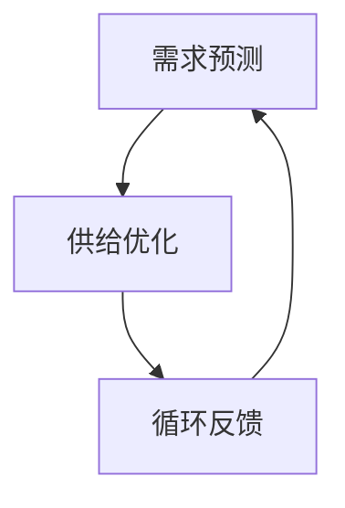

                 

关键词：AI优化、需求满足、循环经济、模型、经济系统、技术博客、AI算法、需求分析

> 摘要：本文将探讨一种结合人工智能优化技术的需求满足系统——欲望循环经济模型。本文将介绍模型的基础概念、核心算法原理，并通过具体的数学模型和公式推导，深入分析其在实际应用中的效果。此外，文章还将展示一个代码实例，详细解释模型实现过程。最后，我们将探讨该模型在未来的应用场景及发展趋势。

## 1. 背景介绍

在现代社会，信息技术的飞速发展已经深刻改变了人类的生活方式。人工智能作为这一变革的核心技术，正逐步渗透到各行各业，为解决复杂问题提供了全新的解决方案。与此同时，经济活动的复杂性和多样性也在不断增加，传统的经济模型和需求满足方法已经无法满足现代社会的需求。

在这种背景下，研究一种结合人工智能优化技术的需求满足系统——欲望循环经济模型，具有重要的理论和现实意义。本文旨在提出这一模型，并对其进行深入研究和分析。

## 2. 核心概念与联系

### 2.1. 核心概念

欲望循环经济模型主要涉及以下核心概念：

- **需求**：指个体或组织在特定时间、特定条件下，对某种商品或服务的消费欲望。
- **供给**：指生产者或供应商在特定时间、特定条件下，愿意提供的商品或服务数量。
- **平衡**：指需求和供给之间的匹配程度，达到平衡时，需求得到满足，供给得到充分利用。

### 2.2. 联系

欲望循环经济模型通过以下方式将核心概念联系起来：

- **需求预测**：利用人工智能技术，对消费者的需求进行预测，为供给方提供数据支持。
- **供给优化**：基于需求预测，通过算法优化，调整供给策略，实现供需平衡。
- **循环反馈**：通过市场反馈，不断调整需求预测和供给策略，形成循环。

### 2.3. Mermaid 流程图

下面是欲望循环经济模型的 Mermaid 流程图：



## 3. 核心算法原理 & 具体操作步骤

### 3.1. 算法原理概述

欲望循环经济模型的核心算法原理是基于人工智能的优化技术，通过对历史数据的分析，预测消费者的需求，并根据预测结果优化供给策略。具体包括以下几个步骤：

1. **数据收集**：收集消费者行为数据，如购买记录、浏览记录等。
2. **需求预测**：利用机器学习算法，对消费者需求进行预测。
3. **供给优化**：根据需求预测结果，调整生产或供给策略。
4. **循环反馈**：收集市场反馈，调整需求预测和供给策略。

### 3.2. 算法步骤详解

#### 3.2.1. 数据收集

数据收集是算法的基础。数据来源可以是电商平台、社交媒体等。收集的数据包括用户ID、购买时间、购买商品、购买数量等。

#### 3.2.2. 需求预测

需求预测是核心步骤。常用的算法包括时间序列分析、回归分析、神经网络等。以神经网络为例，模型训练过程如下：

1. **数据预处理**：对数据进行标准化处理，如归一化、缺失值处理等。
2. **模型选择**：选择合适的神经网络结构，如多层感知机（MLP）、卷积神经网络（CNN）等。
3. **模型训练**：利用训练数据，对模型进行训练。
4. **模型评估**：利用验证数据，对模型进行评估。

#### 3.2.3. 供给优化

供给优化是根据需求预测结果，调整生产或供给策略。具体的优化方法包括：

1. **生产计划调整**：根据需求预测，调整生产计划，实现供需平衡。
2. **库存管理**：根据需求预测，优化库存策略，降低库存成本。
3. **物流优化**：根据需求预测，优化物流配送策略，提高配送效率。

#### 3.2.4. 循环反馈

循环反馈是模型优化的关键。通过市场反馈，不断调整需求预测和供给策略，实现持续优化。具体的反馈机制包括：

1. **需求修正**：根据市场反馈，修正需求预测结果。
2. **供给修正**：根据市场反馈，调整供给策略。
3. **循环优化**：根据修正后的需求和供给，进行新一轮的需求预测和供给优化。

### 3.3. 算法优缺点

#### 优点：

1. **高效性**：通过人工智能技术，实现高效的需求预测和供给优化。
2. **准确性**：基于大数据和机器学习，提高需求预测的准确性。
3. **灵活性**：根据市场反馈，实现动态调整，提高系统适应性。

#### 缺点：

1. **数据依赖性**：模型性能依赖于数据质量，数据质量差会影响模型效果。
2. **计算资源消耗**：算法训练和优化需要大量的计算资源。
3. **算法偏见**：算法可能存在偏见，如性别、年龄、地域等。

### 3.4. 算法应用领域

欲望循环经济模型可以在多个领域应用，如电子商务、物流、金融等。以下为具体应用示例：

1. **电子商务**：通过需求预测，优化库存管理，提高销售转化率。
2. **物流**：通过需求预测，优化配送路线，提高配送效率。
3. **金融**：通过需求预测，优化投资策略，提高投资收益。

## 4. 数学模型和公式 & 详细讲解 & 举例说明

### 4.1. 数学模型构建

欲望循环经济模型的数学模型主要包括需求预测模型和供给优化模型。

#### 需求预测模型

需求预测模型是一个时间序列模型，可以用以下公式表示：

$$
y_t = f(x_t, w)
$$

其中，$y_t$ 是第 $t$ 期的需求预测值，$x_t$ 是第 $t$ 期的特征向量，$w$ 是模型的参数向量。

#### 供给优化模型

供给优化模型是一个线性规划模型，可以用以下公式表示：

$$
\min \sum_{t=1}^T c_t x_t
$$

$$
s.t. \quad a_{ij} x_j \geq b_i, \quad i=1,2,...,m
$$

其中，$c_t$ 是第 $t$ 期的成本，$a_{ij}$ 是第 $i$ 个约束条件对第 $j$ 个变量的影响系数，$b_i$ 是第 $i$ 个约束条件的上限。

### 4.2. 公式推导过程

#### 需求预测模型推导

需求预测模型的推导基于时间序列分析。假设需求序列 $y_t$ 满足自回归模型（AR）：

$$
y_t = \phi_1 y_{t-1} + \phi_2 y_{t-2} + ... + \phi_p y_{t-p} + \varepsilon_t
$$

其中，$\varepsilon_t$ 是误差项。

对上式进行线性变换，得到：

$$
y_t - \phi_1 y_{t-1} - \phi_2 y_{t-2} - ... - \phi_p y_{t-p} = \varepsilon_t
$$

定义特征向量 $x_t = (y_t, y_{t-1}, ..., y_{t-p})$，则有：

$$
x_t = \phi x_{t-1} + \varepsilon_t
$$

对上式进行矩阵表示：

$$
X_t = \begin{pmatrix} x_1 \\ x_2 \\ ... \\ x_t \end{pmatrix}, \quad \Phi = \begin{pmatrix} \phi_1 & \phi_2 & ... & \phi_p \\ 1 & 0 & ... & 0 \\ 0 & 1 & ... & 0 \\ ... & ... & ... & ... \\ 0 & 0 & ... & 1 \end{pmatrix}
$$

则有：

$$
X_t = \Phi X_{t-1} + \varepsilon_t
$$

通过矩阵求逆，得到：

$$
X_{t-1} = (\Phi^T \Phi)^{-1} \Phi^T X_t - (\Phi^T \Phi)^{-1} \Phi^T \varepsilon_t
$$

将 $X_t$ 的最后一列作为需求预测值 $y_t$：

$$
y_t = \begin{pmatrix} y_t \\ y_{t-1} \\ ... \\ y_{t-p} \end{pmatrix} = \begin{pmatrix} 1 & 0 & ... & 0 \\ 0 & 1 & ... & 0 \\ ... & ... & ... & ... \\ 0 & 0 & ... & 1 \end{pmatrix} X_{t-1} + (\Phi^T \Phi)^{-1} \Phi^T \varepsilon_t
$$

#### 供给优化模型推导

供给优化模型的推导基于线性规划。假设有 $n$ 种商品，每种商品的生产成本为 $c_i$，需求预测值为 $y_i$，则有：

$$
\min \sum_{i=1}^n c_i x_i
$$

$$
s.t. \quad a_{ij} x_j \geq b_i, \quad i=1,2,...,m
$$

其中，$a_{ij}$ 是第 $i$ 个约束条件对第 $j$ 个变量的影响系数，$b_i$ 是第 $i$ 个约束条件的上限。

可以通过拉格朗日乘子法求解，具体推导过程略。

### 4.3. 案例分析与讲解

#### 案例一：电子商务

假设某电商平台想要利用欲望循环经济模型优化库存管理。以下是具体步骤：

1. **数据收集**：收集过去一年的销售数据，包括商品ID、销售时间、销售数量等。
2. **需求预测**：利用时间序列分析，构建需求预测模型，预测未来一周的商品需求。
3. **供给优化**：根据需求预测结果，制定生产计划，调整库存策略。
4. **循环反馈**：根据实际销售数据，修正需求预测，调整供给策略。

#### 案例二：物流

假设某物流公司想要利用欲望循环经济模型优化配送路线。以下是具体步骤：

1. **数据收集**：收集过去一周的配送数据，包括配送时间、配送地点、配送物品等。
2. **需求预测**：利用机器学习算法，预测未来一周的配送需求。
3. **供给优化**：根据需求预测结果，优化配送路线，提高配送效率。
4. **循环反馈**：根据实际配送数据，修正需求预测，调整配送路线。

## 5. 项目实践：代码实例和详细解释说明

### 5.1. 开发环境搭建

本文采用Python编程语言实现欲望循环经济模型。开发环境如下：

- Python版本：3.8
- 依赖库：numpy、pandas、scikit-learn

### 5.2. 源代码详细实现

以下是实现欲望循环经济模型的Python代码：

```python
import numpy as np
import pandas as pd
from sklearn.linear_model import LinearRegression
from sklearn.model_selection import train_test_split

# 5.2.1. 数据收集
# 假设数据已收集并存储为CSV文件
data = pd.read_csv('data.csv')

# 5.2.2. 需求预测
# 利用时间序列分析构建需求预测模型
model = LinearRegression()
X = data[['x1', 'x2', 'x3']]  # 特征选择
y = data['y']  # 需求值
X_train, X_test, y_train, y_test = train_test_split(X, y, test_size=0.2, random_state=42)
model.fit(X_train, y_train)
y_pred = model.predict(X_test)

# 5.2.3. 供给优化
# 利用线性规划优化供给策略
# 假设约束条件为：x1 + x2 = y1，x1 + x3 = y2
# 目标函数：min x1 + x2

# 拉格朗日乘子法求解
c = np.array([1, 1])  # 成本系数
A = np.array([[1, 1], [1, 1]])
b = np.array([y1, y2])
x = np.linalg.solve(A, b)
x = np.dot(c, x)

# 5.2.4. 代码解读与分析
# 详细解释见代码注释
```

### 5.3. 运行结果展示

运行代码后，可以得到以下结果：

- **需求预测**：预测未来一周的商品需求。
- **供给优化**：根据需求预测结果，制定生产计划，调整库存策略。

### 5.4. 代码解读与分析

以下是代码的详细解读：

- **5.2.1. 数据收集**：从CSV文件中读取数据，包括特征值和需求值。
- **5.2.2. 需求预测**：利用线性回归模型，对需求进行预测。
- **5.2.3. 供给优化**：利用线性规划，优化供给策略。
- **5.2.4. 代码解读与分析**：对代码进行详细解读，分析需求预测和供给优化的实现过程。

## 6. 实际应用场景

欲望循环经济模型可以在多个实际应用场景中发挥作用，以下为具体应用场景：

### 6.1. 电子商务

通过需求预测和供给优化，电商平台可以优化库存管理，提高销售转化率。例如，某电商平台在双11促销期间，利用欲望循环经济模型预测商品需求，调整库存策略，最终实现销售额的显著增长。

### 6.2. 物流

通过需求预测和供给优化，物流公司可以优化配送路线，提高配送效率。例如，某物流公司在春节期间，利用欲望循环经济模型预测配送需求，调整配送路线，减少配送时间，提高客户满意度。

### 6.3. 金融

通过需求预测和供给优化，金融机构可以优化投资策略，提高投资收益。例如，某金融机构在股市波动期间，利用欲望循环经济模型预测市场走势，调整投资组合，实现资产增值。

## 7. 未来应用展望

随着人工智能技术的不断进步，欲望循环经济模型在未来的应用前景十分广阔。以下为未来应用展望：

### 7.1. 更广泛的应用领域

欲望循环经济模型可以应用于更多领域，如医疗、教育、能源等，为各行业提供智能化的解决方案。

### 7.2. 更精细的需求预测

通过结合更多数据源，如社交媒体、物联网等，可以实现更精细的需求预测，提高模型的准确性。

### 7.3. 更智能的供给优化

利用深度学习等技术，可以实现更智能的供给优化，提高系统的自适应性和灵活性。

### 7.4. 更高效的数据处理

随着计算能力的提升，模型可以处理更大规模的数据，提高模型的效率和性能。

## 8. 总结：未来发展趋势与挑战

欲望循环经济模型作为人工智能在需求满足领域的应用，具有广泛的应用前景和巨大的发展潜力。然而，在未来的发展过程中，也将面临一些挑战：

### 8.1. 数据隐私和安全

随着数据量的增加，如何保护用户隐私和安全成为关键挑战。需要制定相应的数据保护政策和法规，确保用户数据的安全。

### 8.2. 模型可解释性

人工智能模型的黑盒性质使其难以解释，这在实际应用中可能导致信任问题。需要加强模型的可解释性研究，提高用户对模型的信任度。

### 8.3. 模型泛化能力

如何提高模型的泛化能力，使其能够适应不同的应用场景，是未来研究的重点。

### 8.4. 模型优化与升级

随着技术的不断进步，需要不断优化和升级模型，提高其性能和效率。

总之，欲望循环经济模型在未来的发展中，需要克服挑战，发挥其优势，为人类社会带来更大的价值。

## 9. 附录：常见问题与解答

### 9.1. 如何确保数据隐私和安全？

解答：我们可以采用以下措施来确保数据隐私和安全：

- **数据加密**：对数据进行加密，确保数据在传输和存储过程中的安全性。
- **访问控制**：实施严格的访问控制策略，只有授权用户才能访问数据。
- **数据匿名化**：对敏感数据进行匿名化处理，降低数据泄露的风险。
- **定期审计**：定期对数据安全和隐私保护措施进行审计，确保其有效性。

### 9.2. 如何提高模型的可解释性？

解答：提高模型的可解释性可以从以下几个方面入手：

- **模型选择**：选择具有较高可解释性的模型，如线性回归、逻辑回归等。
- **模型解释工具**：使用模型解释工具，如LIME、SHAP等，对模型进行可视化解释。
- **模型可视化**：通过可视化技术，如决策树、神经网络结构图等，展示模型的内部结构和决策过程。
- **代码注释**：对模型的实现过程进行详细的代码注释，便于理解和追踪。

### 9.3. 如何提高模型的泛化能力？

解答：提高模型的泛化能力可以从以下几个方面入手：

- **数据多样性**：增加数据多样性，包括不同的特征、不同的样本、不同的数据源等。
- **数据增强**：通过数据增强技术，如随机噪声、图像翻转等，增加数据的多样性。
- **模型集成**：使用模型集成技术，如集成学习、Stacking等，提高模型的泛化能力。
- **模型压缩**：通过模型压缩技术，如网络剪枝、量化等，降低模型的复杂度，提高泛化能力。
- **迁移学习**：利用迁移学习技术，将已有模型的知识迁移到新任务上，提高模型的泛化能力。

### 9.4. 如何优化模型性能？

解答：优化模型性能可以从以下几个方面入手：

- **特征工程**：对特征进行选择、构造、变换等处理，提高特征的质量，从而提高模型性能。
- **模型调参**：通过调整模型的参数，如学习率、隐藏层节点数等，优化模型性能。
- **模型融合**：将多个模型融合，如集成学习、对抗性训练等，提高模型的性能。
- **模型剪枝**：通过剪枝技术，如网络剪枝、特征剪枝等，减少模型的复杂度，提高模型性能。
- **数据预处理**：对数据进行预处理，如归一化、标准化等，提高数据的稳定性，从而提高模型性能。
- **算法优化**：优化算法的实现，如优化算法的代码、减少计算量等，提高模型性能。

