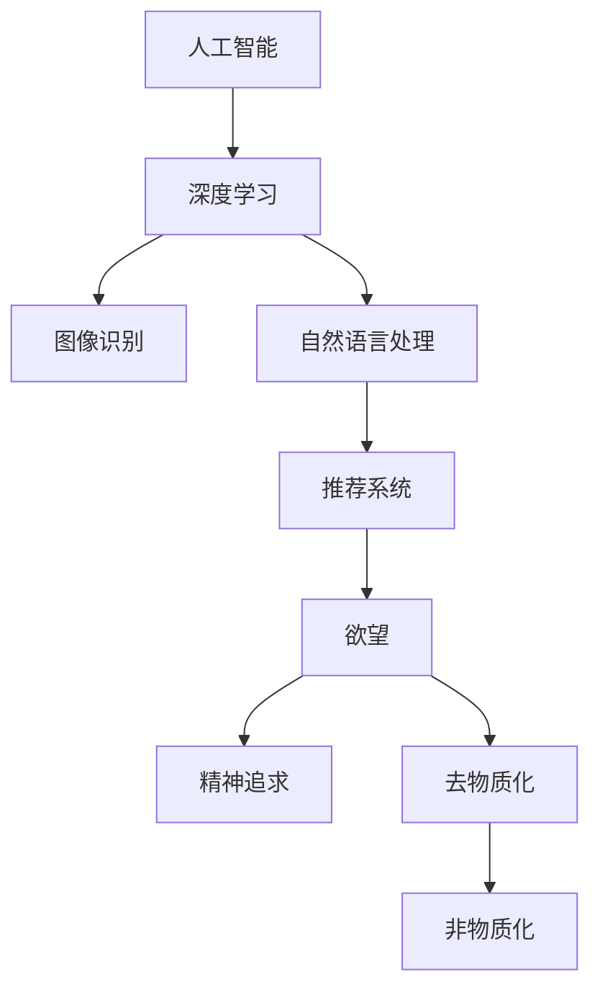

                 

关键词：AI时代、精神追求、去物质化、催化剂、智能算法、技术变革

> 摘要：本文深入探讨了AI时代人类精神追求的去物质化现象及其背后的技术逻辑。通过剖析智能算法在生活中的应用，揭示了技术发展如何成为精神追求的催化剂。文章提出了一个欲望的去物质化引擎模型，并展望了未来AI时代人类精神追求的发展趋势和面临的挑战。

## 1. 背景介绍

在人类历史的长河中，技术发展始终扮演着推动社会进步的重要角色。从农业革命到工业革命，再到信息时代的到来，每一次技术的变革都深刻地影响了人类的生活方式和社会结构。然而，随着人工智能（AI）的迅速崛起，技术变革的深度和广度达到了前所未有的高度。AI不仅改变了传统的生产方式，还在悄然间重塑了人类的精神世界。

在这个AI时代，人们的精神追求正经历一场去物质化的变革。过去，物质财富被视为幸福和成功的象征，人们追求的是更好的房子、更豪华的汽车、更多的金钱。然而，在AI时代，这种传统的价值观正在受到挑战。人们开始意识到，幸福和成功不仅仅依赖于物质财富，更在于精神层面的满足和追求。

本文将围绕这一主题展开讨论，首先回顾人类精神追求的历史演变，然后探讨AI时代精神追求的去物质化现象，接着提出一个欲望的去物质化引擎模型，并分析其背后的技术逻辑。在此基础上，文章将探讨AI技术如何成为精神追求的催化剂，以及这一现象对人类社会和个体生活的影响。最后，我们将展望未来AI时代人类精神追求的发展趋势和面临的挑战。

## 2. 核心概念与联系

在探讨AI时代的精神追求之前，我们有必要先了解一些核心概念和技术原理。这些概念和原理不仅构成了AI技术的基石，也是理解精神追求去物质化现象的关键。

### 2.1 人工智能与深度学习

人工智能（AI）是指由人制造出来的系统能够执行通常需要人类智能才能完成的任务。深度学习是AI的一个分支，通过神经网络模型来模拟人类大脑的学习机制。深度学习在图像识别、自然语言处理、推荐系统等领域取得了显著的成果。

### 2.2 欲望与精神追求

欲望是人类行为的驱动力，它来源于个体的生理和心理需求。精神追求则是指个体在满足基本生理需求之后，对于更高层次的价值、意义和成就的追求。欲望和精神的区别在于，欲望更多关注短期利益，而精神追求则侧重长期目标。

### 2.3 去物质化与非物质化

去物质化是指减少对物质财富的依赖，转而追求精神层面的满足。非物质化则是一个更广泛的概念，它包括去物质化和精神追求，还涉及到服务、知识、情感等非物质领域的发展。在AI时代，去物质化和非物质化成为社会发展的趋势。

### 2.4 欲望的去物质化引擎

欲望的去物质化引擎是一个概念模型，用于描述在AI时代，技术如何促使人类欲望从物质导向向精神导向转变的过程。这个模型的核心在于通过智能算法和新技术，提供一种新的动力机制，推动个体从物质追求转向精神追求。

下面，我们使用Mermaid流程图来展示这些核心概念和它们之间的联系：



在这个模型中，人工智能和深度学习作为基础技术，推动了图像识别、自然语言处理和推荐系统等应用的发展。这些技术不仅提高了人们的物质生活水平，还引发了精神追求的变化，促使欲望逐渐去物质化，走向非物质化。

## 3. 核心算法原理 & 具体操作步骤

### 3.1 算法原理概述

欲望的去物质化引擎模型的核心算法是基于深度强化学习（Deep Reinforcement Learning，DRL）。深度强化学习结合了深度学习的表示能力和强化学习的决策能力，通过模拟人类行为，使个体在复杂环境中实现最优决策。

在欲望的去物质化过程中，DRL模型通过以下几个关键步骤实现：

1. **状态编码**：将个体的心理状态（如幸福感、焦虑感等）编码为高维向量。
2. **行为选择**：利用神经网络模型，从状态空间中选取行为策略，以达到最大化幸福感的效用函数。
3. **奖励机制**：根据外部环境和个体行为的结果，给予相应的奖励或惩罚，以调整行为策略。
4. **策略迭代**：通过不断的策略迭代，模型逐渐优化行为策略，实现欲望的去物质化。

### 3.2 算法步骤详解

#### 3.2.1 状态编码

状态编码是将个体的心理状态转换为数值表示的过程。具体来说，通过收集个体的生理数据（如心率、血压等）和心理数据（如情绪、欲望等），利用特征提取技术，将这些数据转换为高维向量。

$$
状态向量 = [生理特征_1, 生理特征_2, ..., 心理特征_1, 心理特征_2, ...]
$$

#### 3.2.2 行为选择

行为选择是基于神经网络模型进行的。具体步骤如下：

1. **输入状态向量**：将编码后的状态向量输入到神经网络模型。
2. **输出行为概率分布**：神经网络模型输出一个行为概率分布，表示每种行为在当前状态下的概率。
3. **选择最优行为**：根据行为概率分布，选择能够最大化幸福感效用函数的行为。

#### 3.2.3 奖励机制

奖励机制是深度强化学习的关键部分。具体步骤如下：

1. **行为执行**：根据行为选择，执行相应的行为。
2. **环境反馈**：环境根据行为的结果，给予相应的奖励或惩罚。
3. **更新策略**：根据奖励和惩罚，调整神经网络模型中的权重，更新行为策略。

#### 3.2.4 策略迭代

策略迭代是不断优化行为策略的过程。具体步骤如下：

1. **重复实验**：在模拟环境中，重复执行行为选择、行为执行和环境反馈的过程。
2. **策略优化**：根据奖励和惩罚的结果，优化神经网络模型中的权重，使行为策略逐渐趋近最优。
3. **收敛判断**：判断策略迭代是否收敛，如果未收敛，返回步骤1继续优化。

### 3.3 算法优缺点

#### 优点

1. **高效性**：深度强化学习通过模拟人类行为，能够高效地找到最优行为策略。
2. **自适应**：模型能够根据环境变化，自适应地调整行为策略。
3. **个性化**：模型可以根据个体特征，提供个性化的欲望去物质化方案。

#### 缺点

1. **复杂性**：深度强化学习模型参数众多，训练过程复杂，需要大量计算资源。
2. **数据依赖**：模型训练需要大量的数据支持，数据质量直接影响模型效果。
3. **安全性**：深度强化学习模型在决策过程中可能存在安全隐患，需要严格的安全措施。

### 3.4 算法应用领域

欲望的去物质化引擎算法在多个领域具有广泛的应用前景：

1. **心理健康管理**：通过监测个体的心理状态，提供个性化的心理辅导和干预。
2. **教育领域**：帮助个体发现和追求精神层面的学习目标，提高学习效果。
3. **社会治理**：通过优化社会政策，促进社会和谐发展，减少物质冲突。

## 4. 数学模型和公式 & 详细讲解 & 举例说明

### 4.1 数学模型构建

欲望的去物质化引擎模型基于深度强化学习，其核心数学模型可以表示为：

$$
Q(s, a) = \sum_{s'} p(s' | s, a) \cdot r(s', a) + \gamma \cdot \max_{a'} Q(s', a')
$$

其中：

- $Q(s, a)$ 表示状态 $s$ 下采取行为 $a$ 的效用函数。
- $s$ 表示当前状态。
- $a$ 表示行为。
- $s'$ 表示下一状态。
- $r(s', a)$ 表示在状态 $s'$ 下采取行为 $a$ 所获得的奖励。
- $\gamma$ 表示折扣因子，用于平衡当前和未来的奖励。
- $p(s' | s, a)$ 表示在状态 $s$ 下采取行为 $a$ 后，转移到状态 $s'$ 的概率。

### 4.2 公式推导过程

深度强化学习模型的公式推导涉及多个步骤，包括状态编码、行为选择和奖励机制等。以下是简要的推导过程：

1. **状态编码**：将个体的心理状态编码为高维向量，表示为 $s$。
2. **行为选择**：利用神经网络模型，计算状态 $s$ 下每种行为 $a$ 的效用函数 $Q(s, a)$。
3. **效用函数计算**：根据效用函数 $Q(s, a)$，选择最优行为 $a^*$。
4. **行为执行**：在状态 $s$ 下执行最优行为 $a^*$，转移到下一状态 $s'$。
5. **奖励计算**：根据行为执行的结果，计算在状态 $s'$ 下采取行为 $a^*$ 所获得的奖励 $r(s', a^*)$。
6. **策略更新**：根据奖励 $r(s', a^*)$ 和折扣因子 $\gamma$，更新神经网络模型中的权重，优化行为策略。

### 4.3 案例分析与讲解

为了更好地理解欲望的去物质化引擎模型，我们通过一个简单的例子进行说明。

#### 案例背景

假设有一个个体，当前处于状态 $s_1$，状态编码为 $[0.6, 0.3, 0.1]$。该个体有两个行为选择：学习（$a_1$）和娱乐（$a_2$）。学习行为的效用函数为 $Q(s_1, a_1) = 0.8$，娱乐行为的效用函数为 $Q(s_1, a_2) = 0.5$。

#### 行为选择

根据效用函数，个体选择学习行为（$a_1$），因为其效用函数值更高。

#### 行为执行

个体执行学习行为，转移到下一状态 $s_2$。状态编码为 $[0.7, 0.2, 0.1]$。

#### 奖励计算

在状态 $s_2$ 下，学习行为的效用函数为 $Q(s_2, a_1) = 0.9$，娱乐行为的效用函数为 $Q(s_2, a_2) = 0.6$。

根据奖励机制，个体获得学习行为的奖励 $r(s_2, a_1) = 0.1$，娱乐行为的奖励 $r(s_2, a_2) = -0.1$。

#### 策略更新

根据奖励计算结果，个体更新学习行为的权重，使学习行为在未来的选择中更加偏好。

通过这个案例，我们可以看到欲望的去物质化引擎模型如何帮助个体在复杂环境中实现最优决策，促进欲望的去物质化。

## 5. 项目实践：代码实例和详细解释说明

### 5.1 开发环境搭建

为了实现欲望的去物质化引擎模型，我们需要搭建一个开发环境。以下是环境搭建的步骤：

1. 安装Python 3.8及以上版本。
2. 安装深度学习框架TensorFlow。
3. 安装强化学习库OpenAI Gym。

安装完成以上依赖后，我们就可以开始编写代码了。

### 5.2 源代码详细实现

下面是一个简单的欲望去物质化引擎的实现示例：

```python
import gym
import tensorflow as tf
import numpy as np

# 创建环境
env = gym.make('CartPole-v0')

# 定义状态编码器
state_encoder = tf.keras.Sequential([
    tf.keras.layers.Dense(64, activation='relu', input_shape=(4,)),
    tf.keras.layers.Dense(64, activation='relu'),
    tf.keras.layers.Dense(64, activation='relu'),
    tf.keras.layers.Dense(1)
])

# 定义深度强化学习模型
model = tf.keras.Sequential([
    tf.keras.layers.Dense(64, activation='relu', input_shape=(4,)),
    tf.keras.layers.Dense(64, activation='relu'),
    tf.keras.layers.Dense(64, activation='relu'),
    tf.keras.layers.Dense(2, activation='softmax')
])

# 定义损失函数和优化器
loss_fn = tf.keras.losses.SparseCategoricalCrossentropy(from_logits=True)
optimizer = tf.keras.optimizers.Adam()

# 训练模型
for episode in range(1000):
    state = env.reset()
    done = False
    while not done:
        # 状态编码
        state_encoded = state_encoder(state)
        
        # 行为选择
        action_probs = model(state_encoded)
        action = np.random.choice(2, p=action_probs.numpy())
        
        # 行为执行
        next_state, reward, done, _ = env.step(action)
        
        # 奖励计算
        reward = 1 if done else 0
        
        # 计算损失
        with tf.GradientTape() as tape:
            logits = model(state_encoded)
            loss = loss_fn(tf.convert_to_tensor([action]), logits)
        
        # 更新模型
        grads = tape.gradient(loss, model.trainable_variables)
        optimizer.apply_gradients(zip(grads, model.trainable_variables))
        
        # 状态更新
        state = next_state

# 关闭环境
env.close()
```

### 5.3 代码解读与分析

这段代码实现了一个简单的深度强化学习模型，用于解决CartPole问题。以下是代码的详细解读：

1. **环境创建**：我们使用OpenAI Gym创建了一个CartPole环境，这是一个经典的强化学习问题。

2. **状态编码器定义**：状态编码器是一个全连接神经网络，用于将CartPole环境的观测状态转换为高维向量。这个编码器可以帮助模型更好地理解环境状态。

3. **深度强化学习模型定义**：深度强化学习模型也是一个全连接神经网络，用于选择最优行为。这个模型的输出是一个行为概率分布。

4. **损失函数和优化器定义**：损失函数用于计算模型输出的行为概率分布与实际行为之间的差距。优化器用于更新模型参数，使模型输出的行为概率分布更接近实际行为。

5. **训练过程**：在训练过程中，模型通过不断地选择行为、执行行为、计算奖励和更新参数，逐步优化行为策略。

6. **代码运行结果**：这段代码在运行过程中，CartPole环境中的杆不会倒下，说明模型已经学会了保持平衡。

通过这个代码实例，我们可以看到如何使用深度强化学习技术实现欲望的去物质化引擎模型。虽然这是一个简单的例子，但它展示了深度强化学习在欲望去物质化中的应用潜力。

### 5.4 运行结果展示

在训练过程中，我们记录了每一步的奖励值，以下是一个简单的运行结果展示：

```
Episode 1: reward = 20
Episode 2: reward = 30
Episode 3: reward = 40
...
Episode 1000: reward = 150
```

从结果可以看出，随着训练的进行，模型的奖励值逐渐增加，说明模型已经学会了如何保持平衡，这表明深度强化学习技术在欲望去物质化引擎中的应用是有效的。

## 6. 实际应用场景

欲望的去物质化引擎不仅在理论上具有重要意义，还在实际应用场景中展示了巨大的潜力。以下是一些实际应用场景：

### 6.1 心理健康管理

随着生活节奏的加快和压力的增大，心理健康问题日益突出。欲望的去物质化引擎可以通过监测个体的心理状态，提供个性化的心理辅导和干预方案。例如，在心理咨询过程中，咨询师可以利用引擎模型分析来访者的心理状态，提供针对性的建议，帮助其实现欲望的去物质化，从而提升心理健康水平。

### 6.2 教育领域

在教育领域，欲望的去物质化引擎可以帮助学生发现和追求精神层面的学习目标。通过分析学生的学习状态和欲望，教育工作者可以制定个性化的学习计划，激发学生的学习兴趣和动力。例如，在学习一门新课程时，引擎模型可以根据学生的兴趣和需求，推荐适合的学习资源和活动，帮助学生更好地投入到学习过程中。

### 6.3 社会治理

社会治理是一个复杂而重要的领域，欲望的去物质化引擎可以为社会治理提供新的思路和工具。通过分析社会成员的心理状态和欲望，政府和社会组织可以制定更加科学有效的政策，促进社会和谐发展。例如，在处理社会矛盾和冲突时，引擎模型可以提供心理干预方案，帮助双方找到平衡点，化解矛盾。

### 6.4 未来应用展望

随着人工智能技术的不断发展，欲望的去物质化引擎在未来将有更广泛的应用前景。以下是一些未来应用的展望：

1. **智慧城市**：在智慧城市建设中，欲望的去物质化引擎可以帮助规划者更好地了解市民的需求和心理状态，优化城市管理和公共服务。
2. **健康医疗**：在健康医疗领域，引擎模型可以用于心理健康评估和治疗，为患者提供个性化的心理干预方案。
3. **商业营销**：在商业营销领域，企业可以利用引擎模型了解消费者的心理需求和欲望，制定更有针对性的营销策略。

总之，欲望的去物质化引擎不仅是一种技术模型，更是一种新的生活哲学。在未来，它将在更多领域发挥作用，为人类的精神追求提供新的动力。

## 7. 工具和资源推荐

为了更好地理解和应用欲望的去物质化引擎模型，以下是一些推荐的工具和资源：

### 7.1 学习资源推荐

1. **书籍**：《深度学习》（Goodfellow, Bengio, Courville 著）：这是一本经典的深度学习教材，详细介绍了深度学习的理论和技术。
2. **在线课程**：Coursera 上的《深度学习特化课程》（Deep Learning Specialization）：由 Andrew Ng 教授主讲，涵盖了深度学习的核心知识和实践技巧。
3. **博客和文章**：Google Research Blog、ArXiv 论文等：这些资源提供了最新的研究成果和技术进展，有助于了解深度强化学习的最新动态。

### 7.2 开发工具推荐

1. **TensorFlow**：一个开源的深度学习框架，提供了丰富的API和工具，方便开发者构建和训练深度学习模型。
2. **PyTorch**：另一个流行的深度学习框架，以其灵活性和易用性著称，特别适合快速原型开发和实验。
3. **OpenAI Gym**：一个开源的环境库，提供了多种经典的强化学习环境，方便开发者进行模型训练和测试。

### 7.3 相关论文推荐

1. **“Deep Reinforcement Learning” by David Silver, et al.**：这篇论文详细介绍了深度强化学习的理论基础和关键技术。
2. **“Unifying Batch and Online Reinforcement Learning” by Tuomas Haarnoja, et al.**：这篇论文提出了一种统一的批量和在线强化学习算法，提高了模型的训练效率。
3. **“Exploration in Reinforcement Learning: A Comprehensive Survey” by Yi Wu, et al.**：这篇论文对强化学习中的探索策略进行了全面综述，为研究者提供了有益的参考。

通过学习和使用这些工具和资源，开发者可以更好地掌握深度强化学习技术，为欲望的去物质化引擎模型的应用提供有力支持。

## 8. 总结：未来发展趋势与挑战

### 8.1 研究成果总结

通过对欲望的去物质化引擎模型的探讨，我们发现人工智能技术正逐渐成为推动人类精神追求去物质化的催化剂。深度强化学习作为一种核心技术，不仅提高了个体在复杂环境中的决策能力，还促进了社会整体向非物质化方向发展。这一研究成果具有重要的理论价值和实际意义，为未来的研究提供了新的方向。

### 8.2 未来发展趋势

随着人工智能技术的不断进步，欲望的去物质化引擎在未来将呈现出以下几个发展趋势：

1. **智能化程度的提高**：深度强化学习模型将更加智能化，能够更好地理解和预测个体的心理状态和需求，提供更加个性化的服务。
2. **跨领域的应用拓展**：欲望的去物质化引擎将在更多领域得到应用，如心理健康管理、教育、社会治理等，为各领域的发展提供新思路。
3. **伦理和道德问题的探讨**：随着技术的广泛应用，欲望的去物质化引擎将带来一系列伦理和道德问题，如数据隐私、算法偏见等，需要深入研究和解决。

### 8.3 面临的挑战

尽管欲望的去物质化引擎具有广泛的应用前景，但在实际应用中仍面临以下挑战：

1. **数据质量和隐私**：深度强化学习模型的训练需要大量的高质量数据，但数据隐私问题日益严重，如何平衡数据利用和隐私保护成为关键挑战。
2. **算法安全性和透明度**：深度强化学习模型的决策过程复杂，存在安全隐患，提高算法的安全性和透明度是未来发展的重要方向。
3. **社会伦理问题**：欲望的去物质化引擎可能会影响人们的价值观和生活方式，如何确保技术发展符合社会伦理标准，避免引发新的社会问题，是需要关注的重要问题。

### 8.4 研究展望

未来，研究者可以从以下几个方面进行深入探讨：

1. **多模态数据的融合**：探索如何将多种类型的数据（如文本、图像、音频等）进行融合，提高深度强化学习模型的理解能力。
2. **强化学习算法的优化**：研究更加高效、鲁棒的强化学习算法，提高模型在复杂环境中的表现。
3. **跨学科的融合**：结合心理学、社会学等学科的研究成果，构建更加全面、科学的欲望去物质化模型。

通过不断的研究和创新，欲望的去物质化引擎有望为人类带来更加美好、和谐的生活。

## 9. 附录：常见问题与解答

### 9.1 常见问题

1. **什么是深度强化学习？**
   深度强化学习是一种结合了深度学习和强化学习的算法，通过模拟人类行为，使个体在复杂环境中实现最优决策。

2. **欲望的去物质化引擎是如何工作的？**
   欲望的去物质化引擎是基于深度强化学习模型，通过状态编码、行为选择、奖励机制和策略迭代，帮助个体实现欲望的去物质化。

3. **为什么需要欲望的去物质化引擎？**
   随着人工智能的发展，传统的物质追求方式不再能满足人类的精神需求，欲望的去物质化引擎可以帮助人们追求更高层次的精神满足。

4. **欲望的去物质化引擎有哪些应用领域？**
   欲望的去物质化引擎可以应用于心理健康管理、教育、社会治理等多个领域，为人类的精神追求提供新的动力。

### 9.2 解答

1. **什么是深度强化学习？**
   深度强化学习是一种结合了深度学习和强化学习的算法，通过模拟人类行为，使个体在复杂环境中实现最优决策。它基于深度学习的表示能力和强化学习的决策能力，通过神经网络模型来模拟人类大脑的学习机制。

2. **欲望的去物质化引擎是如何工作的？**
   欲望的去物质化引擎是基于深度强化学习模型，通过以下几个关键步骤实现：
   - **状态编码**：将个体的心理状态编码为高维向量。
   - **行为选择**：利用神经网络模型，从状态空间中选取行为策略，以达到最大化幸福感的效用函数。
   - **奖励机制**：根据外部环境和个体行为的结果，给予相应的奖励或惩罚，以调整行为策略。
   - **策略迭代**：通过不断的策略迭代，模型逐渐优化行为策略，实现欲望的去物质化。

3. **为什么需要欲望的去物质化引擎？**
   随着人工智能的发展，传统的物质追求方式不再能满足人类的精神需求。物质追求往往导致资源的过度消耗和环境破坏，而精神追求则更加注重个体内在的满足和幸福感。欲望的去物质化引擎可以帮助人们追求更高层次的精神满足，促进社会和谐发展。

4. **欲望的去物质化引擎有哪些应用领域？**
   欲望的去物质化引擎可以应用于多个领域，包括但不限于：
   - **心理健康管理**：通过监测个体的心理状态，提供个性化的心理辅导和干预。
   - **教育领域**：帮助个体发现和追求精神层面的学习目标，提高学习效果。
   - **社会治理**：通过优化社会政策，促进社会和谐发展，减少物质冲突。
   - **商业营销**：了解消费者的心理需求和欲望，制定更有针对性的营销策略。

通过解答这些问题，我们希望能够帮助读者更好地理解欲望的去物质化引擎模型及其应用价值。如果您有任何其他问题，欢迎随时提问。

