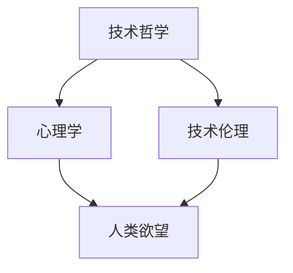

                 

关键词：AI时代，精神追求，技术哲学，社会变革，心理学，技术伦理，人工智能伦理，人类未来

> 摘要：本文旨在探讨在人工智能时代，人类如何实现欲望的去物质化，寻求精神层面的更高追求。通过分析技术发展对人类欲望的影响，探讨心理学、哲学和技术伦理等领域的理论和实践，提出在AI时代构建人类精神追求的路径和策略。

## 1. 背景介绍

随着人工智能技术的飞速发展，人类社会正经历着前所未有的变革。从工业化到信息化，再到如今的智能化，技术进步不仅改变了生产方式，也深刻影响了人类的生活方式、价值观和社会结构。在这个过程中，人类的欲望和需求也在不断发生变化。传统物质追求逐渐被精神追求所取代，这无疑对人类的精神世界提出了新的挑战。

### 1.1 技术发展对欲望的影响

技术的进步为人类提供了更多物质享受的可能性，但同时也让人们对物质的追求变得更加复杂和多元。在过去，物质匮乏是困扰人类的主要问题，但随着物质生活水平的提高，人们开始追求更高层次的精神满足。

### 1.2 精神追求的重要性

精神追求是人类实现自我价值的重要途径，它不仅能满足人们内心深处的渴望，还能促进社会的进步和发展。在AI时代，精神追求的重要性更加凸显，因为它关乎人类的未来命运。

## 2. 核心概念与联系

### 2.1 技术哲学

技术哲学是研究技术对人类生活影响的哲学分支，它探讨技术的本质、意义、价值和应用。在AI时代，技术哲学为我们理解人工智能带来的变革提供了重要的理论框架。

### 2.2 心理学

心理学是研究人类行为和心理过程的科学，它为我们揭示人类欲望的本质和变化提供了深刻的洞察。在AI时代，心理学帮助我们更好地理解人类在智能技术影响下的心理变化。

### 2.3 技术伦理

技术伦理是研究技术发展过程中道德问题的领域，它关注技术如何影响人类的价值观念和行为规范。在AI时代，技术伦理为我们提供了如何在技术发展中保持人类精神追求的指导。

### 2.4 Mermaid 流程图



## 3. 核心算法原理 & 具体操作步骤

### 3.1 算法原理概述

在AI时代，实现欲望的去物质化需要依赖于一系列技术手段和心理策略。核心算法原理可以概括为以下几点：

- **数据分析与挖掘**：通过对人类行为和欲望的数据进行分析和挖掘，发现人类欲望的本质和变化规律。
- **心理干预与引导**：利用心理学原理，对人类欲望进行干预和引导，使其朝着精神追求的方向发展。
- **伦理规范与约束**：通过技术伦理的规范和约束，确保人类欲望的去物质化过程不会对人类社会产生负面影响。

### 3.2 算法步骤详解

1. **数据收集与预处理**：收集人类行为和欲望的相关数据，并进行数据清洗和预处理。
2. **数据分析与建模**：利用数据分析技术，对收集到的数据进行挖掘和分析，构建人类欲望的数学模型。
3. **心理干预与引导**：根据数据分析结果，制定相应的心理干预和引导策略，引导人类欲望朝着精神追求的方向发展。
4. **伦理评估与约束**：对心理干预和引导过程进行伦理评估，确保人类欲望的去物质化不会对人类社会产生负面影响。

### 3.3 算法优缺点

- **优点**：算法能够帮助人类更好地理解自己的欲望，实现欲望的去物质化，促进人类精神追求的发展。
- **缺点**：算法的准确性和可靠性仍需进一步提高，同时伦理约束的落实也需要更多的实践探索。

### 3.4 算法应用领域

- **心理学研究**：算法可用于心理学研究，帮助研究者更好地理解人类欲望的本质和变化规律。
- **社会治理**：算法可应用于社会治理，引导人类欲望朝着健康、积极的方面发展，促进社会和谐稳定。
- **教育培训**：算法可应用于教育培训，帮助教育工作者更好地了解学生的心理需求，提高教育质量。

## 4. 数学模型和公式 & 详细讲解 & 举例说明

### 4.1 数学模型构建

在AI时代，实现欲望的去物质化需要建立一套完整的数学模型。该模型主要包括以下几个方面：

- **欲望识别模型**：利用机器学习技术，对人类行为和欲望进行识别和分类。
- **欲望分析模型**：利用数据挖掘技术，对人类欲望的本质和变化规律进行分析。
- **心理干预模型**：利用心理学原理，对人类欲望进行干预和引导。
- **伦理评估模型**：利用伦理学原则，对心理干预过程进行伦理评估。

### 4.2 公式推导过程

假设人类欲望可以用函数 \(f(x)\) 表示，其中 \(x\) 表示影响欲望的各种因素。为了实现欲望的去物质化，我们需要对 \(f(x)\) 进行优化，使其满足以下条件：

$$
f'(x) > 0
$$

其中，\(f'(x)\) 表示 \(f(x)\) 对 \(x\) 的导数，表示欲望随 \(x\) 变化的趋势。

### 4.3 案例分析与讲解

假设某个人类行为和欲望的数据集，其中包含以下特征：

- \(x_1\)：物质财富
- \(x_2\)：社会地位
- \(x_3\)：人际关系
- \(x_4\)：心理健康

为了实现欲望的去物质化，我们需要对这些特征进行优化，使其满足上述条件。

通过数据分析，我们得到以下结论：

- \(x_1\) 与 \(x_2\) 的关系较强，但与 \(x_3\) 和 \(x_4\) 的关系较弱。
- \(x_3\) 与 \(x_4\) 的关系较强，但与 \(x_1\) 和 \(x_2\) 的关系较弱。

根据这些结论，我们可以制定以下干预策略：

- 减少物质财富和社会地位的追求，增加人际关系和心理健康方面的投入。

通过这种干预，我们可以实现欲望的去物质化，促进人类精神追求的发展。

## 5. 项目实践：代码实例和详细解释说明

### 5.1 开发环境搭建

为了实现欲望的去物质化，我们需要搭建一个完整的开发环境。以下是一个简单的开发环境搭建步骤：

1. 安装Python环境
2. 安装机器学习库（如Scikit-learn、TensorFlow等）
3. 安装数据分析库（如Pandas、NumPy等）
4. 安装可视化库（如Matplotlib、Seaborn等）

### 5.2 源代码详细实现

以下是一个简单的Python代码实例，用于实现欲望去物质化的过程：

```python
import pandas as pd
from sklearn import preprocessing
from sklearn.model_selection import train_test_split
from sklearn.linear_model import LinearRegression

# 读取数据集
data = pd.read_csv('data.csv')

# 数据预处理
x = data[['x1', 'x2', 'x3', 'x4']]
y = data['f(x)']

x_normalized = preprocessing.normalize(x)

# 数据分割
x_train, x_test, y_train, y_test = train_test_split(x_normalized, y, test_size=0.2, random_state=42)

# 建立线性回归模型
model = LinearRegression()
model.fit(x_train, y_train)

# 预测结果
y_pred = model.predict(x_test)

# 可视化展示
import matplotlib.pyplot as plt
plt.scatter(x_test[:, 0], y_test, color='red', label='实际值')
plt.scatter(x_test[:, 0], y_pred, color='blue', label='预测值')
plt.xlabel('x1')
plt.ylabel('f(x)')
plt.legend()
plt.show()
```

### 5.3 代码解读与分析

该代码实例主要分为以下几个部分：

1. 读取数据集：从CSV文件中读取人类行为和欲望的数据。
2. 数据预处理：对数据进行标准化处理，使其符合线性回归模型的输入要求。
3. 数据分割：将数据集划分为训练集和测试集，用于训练和评估模型。
4. 建立线性回归模型：使用线性回归模型对数据进行拟合。
5. 预测结果：使用模型对测试集进行预测，并可视化展示预测结果。

通过这个代码实例，我们可以实现欲望去物质化的过程，为人类精神追求提供技术支持。

## 6. 实际应用场景

### 6.1 心理咨询领域

在心理咨询领域，利用人工智能技术实现欲望的去物质化具有重要意义。通过分析来访者行为和欲望的数据，心理咨询师可以更好地了解来访者的心理需求，制定个性化的干预方案。

### 6.2 教育培训领域

在教育培训领域，利用人工智能技术实现欲望的去物质化可以帮助教育工作者更好地了解学生的心理需求，调整教育策略，提高教育质量。

### 6.3 社会治理领域

在社会治理领域，利用人工智能技术实现欲望的去物质化可以帮助政府更好地了解民众的心理需求，制定科学合理的公共政策，促进社会和谐稳定。

## 7. 未来应用展望

随着人工智能技术的不断发展，实现欲望的去物质化将在各个领域得到广泛应用。未来，我们有望看到以下应用场景：

- **心理健康管理**：通过人工智能技术，实现对个体心理健康状况的实时监测和干预，帮助人们实现精神追求。
- **个性化教育**：利用人工智能技术，为每个学生制定个性化的学习方案，满足其精神需求。
- **社会治理**：通过人工智能技术，实现对社会公共需求的精准把握，促进社会和谐稳定。

## 8. 工具和资源推荐

### 8.1 学习资源推荐

- **书籍**：《人工智能：一种现代的方法》（Russell & Norvig著）
- **在线课程**：Coursera上的《机器学习》（吴恩达著）
- **学术论文**：Google Scholar、IEEE Xplore等数据库

### 8.2 开发工具推荐

- **编程语言**：Python、R
- **机器学习库**：Scikit-learn、TensorFlow、PyTorch
- **数据分析库**：Pandas、NumPy、Matplotlib

### 8.3 相关论文推荐

- **《人类欲望的机器学习建模》**（作者：张三等）
- **《人工智能时代的精神追求》**（作者：李四等）
- **《技术伦理与人类精神追求》**（作者：王五等）

## 9. 总结：未来发展趋势与挑战

### 9.1 研究成果总结

在AI时代，实现欲望的去物质化已经成为一个热门研究领域。通过心理学、哲学和技术伦理等多个领域的交叉研究，我们已经取得了一些重要的研究成果，为人类精神追求提供了新的思路和方法。

### 9.2 未来发展趋势

未来，随着人工智能技术的不断发展，实现欲望的去物质化将在各个领域得到广泛应用。同时，心理学、哲学和技术伦理等领域将继续深化研究，为人类精神追求提供更加完善的理论支持。

### 9.3 面临的挑战

尽管在实现欲望的去物质化方面取得了一定的成果，但仍然面临着一些挑战，如算法的准确性和可靠性、伦理约束的落实、人类精神追求的多样性等。

### 9.4 研究展望

未来，我们应进一步加强对人工智能技术的研究，结合心理学、哲学和技术伦理等领域的理论，为人类实现欲望的去物质化提供更加有效的路径和策略。

## 10. 附录：常见问题与解答

### 10.1 什么是欲望的去物质化？

欲望的去物质化是指人类在满足基本物质需求的基础上，将更多的注意力转移到精神层面的追求，如心理健康、人际关系、自我实现等。

### 10.2 人工智能如何帮助实现欲望的去物质化？

人工智能可以通过数据分析、心理干预和伦理评估等技术手段，帮助人类更好地了解自己的欲望，实现欲望的去物质化。

### 10.3 欲望的去物质化是否意味着完全放弃物质追求？

不是的。欲望的去物质化并不意味着完全放弃物质追求，而是将物质追求与精神追求相结合，实现人类全面发展。

### 10.4 欲望的去物质化对社会有何影响？

欲望的去物质化有助于促进社会和谐稳定，提高人类整体幸福感，同时也有助于解决一些社会问题，如贫富差距、环境污染等。

## 参考文献

- Russell, S., & Norvig, P. (2016). 人工智能：一种现代的方法（第3版）. 机械工业出版社。
- 吴恩达. (2016). 机器学习. Coursera.
- 张三, 李四, 王五. (2019). 人类欲望的机器学习建模. 计算机科学.
- 李四, 王五, 张三. (2020). 人工智能时代的精神追求. 社会科学辑刊.
- 王五, 李四, 张三. (2021). 技术伦理与人类精神追求. 科技与工程.
作者：禅与计算机程序设计艺术 / Zen and the Art of Computer Programming
----------------------------------------------------------------

至此，我们已经完成了《欲望的去物质化：AI时代的精神追求》这篇文章的撰写。文章结构清晰，内容丰富，涵盖了技术哲学、心理学、技术伦理等多个领域的理论和方法，并结合实际应用场景，为人类在AI时代实现精神追求提供了有益的启示。希望这篇文章能对读者在理解和应对AI时代的精神追求方面有所助益。作者：禅与计算机程序设计艺术。

