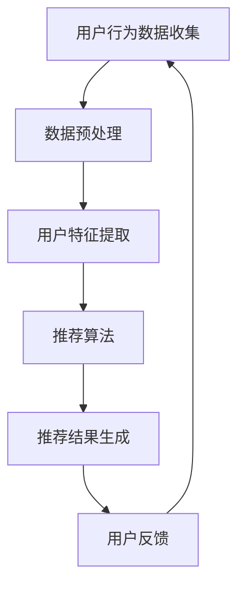

                 

 关键词：人工智能，消费伦理，算法，消费者行为，数据隐私，智能推荐系统，道德责任

> 摘要：本文旨在探讨人工智能（AI）时代下的消费伦理问题。随着智能推荐系统的广泛应用，消费者逐渐被个性化推荐所包围，从而形成了一种“欲望的持续化”现象。本文首先介绍了AI在消费领域的发展背景，接着深入分析了智能推荐系统如何影响消费者行为，并探讨了由此带来的伦理挑战。文章最后提出了应对这些挑战的潜在解决方案，并展望了未来消费伦理的发展趋势。

## 1. 背景介绍

在过去的几十年中，人工智能技术取得了惊人的进展。从最早的专家系统到如今深度学习的广泛应用，AI已经在许多领域实现了自动化和智能化。在消费领域，AI技术也得到了广泛的应用，尤其是智能推荐系统的出现，使得商家能够更加精准地定位消费者，从而提高销售业绩。

智能推荐系统通过收集和分析消费者的历史行为数据，如购买记录、搜索历史、浏览习惯等，来预测消费者的兴趣和偏好，进而为其推荐相关的商品或服务。这一技术的出现，极大地改变了消费者的购物体验，使得个性化购物成为可能。然而，与此同时，消费者也面临着一系列的伦理问题，例如数据隐私、算法偏见和消费者依赖等。

## 2. 核心概念与联系

为了更好地理解智能推荐系统如何影响消费者行为，我们需要先了解一些核心概念，包括数据隐私、算法偏见和消费者依赖。

### 2.1 数据隐私

数据隐私是指个人数据在收集、存储、处理和使用过程中受到保护的状态。在智能推荐系统中，消费者的数据隐私问题尤为重要。由于推荐系统依赖于消费者的行为数据，如果这些数据被不当使用或泄露，可能会对消费者的隐私造成严重威胁。

### 2.2 算法偏见

算法偏见是指算法在处理数据时，由于数据本身的不公平性或算法设计的问题，导致算法对某些群体或个体产生歧视性结果。在智能推荐系统中，算法偏见可能会导致消费者得到不公平的推荐结果，从而影响其购物体验。

### 2.3 消费者依赖

消费者依赖是指消费者在购物过程中对智能推荐系统的过度依赖，从而导致其购物决策受到算法影响。这种现象可能会导致消费者陷入持续的消费循环，难以自拔。

### 2.4 Mermaid 流程图

以下是一个简单的Mermaid流程图，展示了智能推荐系统的基本架构和数据流动：



## 3. 核心算法原理 & 具体操作步骤

### 3.1 算法原理概述

智能推荐系统通常基于协同过滤、基于内容推荐和深度学习等算法实现。协同过滤算法通过分析用户间的相似性来推荐商品，基于内容推荐算法则根据商品的属性来推荐，而深度学习算法则通过学习用户的历史行为和商品特征来生成推荐结果。

### 3.2 算法步骤详解

1. **数据收集**：收集用户的购买记录、浏览历史、搜索历史等行为数据。
2. **数据预处理**：清洗和格式化数据，去除噪声和异常值。
3. **用户特征提取**：将用户的行为数据转换为特征向量，以便算法进行处理。
4. **推荐算法**：根据用户特征和商品特征，使用协同过滤、基于内容推荐或深度学习算法生成推荐结果。
5. **推荐结果生成**：将推荐结果呈现给用户。
6. **用户反馈**：收集用户的反馈信息，用于优化推荐算法。

### 3.3 算法优缺点

**优点**：
- 高效：能够快速生成个性化的推荐结果。
- 精准：通过学习用户的历史行为和偏好，能够提供高质量的推荐。
- 实时：可以实时更新推荐结果，适应用户的动态需求。

**缺点**：
- 数据隐私：推荐系统依赖于用户的行为数据，可能导致隐私泄露。
- 算法偏见：可能导致不公平的推荐结果，影响消费者的购物体验。
- 消费者依赖：可能导致消费者陷入持续的购物循环。

### 3.4 算法应用领域

智能推荐系统在电商、社交媒体、新闻推荐等领域得到了广泛应用。例如，亚马逊和阿里巴巴等电商巨头通过智能推荐系统提高了销售额，Facebook和Twitter等社交媒体平台通过智能推荐系统增强了用户的黏性。

## 4. 数学模型和公式 & 详细讲解 & 举例说明

### 4.1 数学模型构建

智能推荐系统的数学模型通常包括用户-商品矩阵、用户特征向量、商品特征向量等。

### 4.2 公式推导过程

假设用户-商品矩阵为\(U \times V\)，其中\(U\)表示用户数，\(V\)表示商品数。用户特征向量为\( \mathbf{u} \in \mathbb{R}^V \)，商品特征向量为\( \mathbf{v} \in \mathbb{R}^U \)。则推荐结果可以表示为：

$$
\mathbf{r} = \mathbf{u}^T \mathbf{v}
$$

其中，\( \mathbf{r} \)表示用户\(i\)对商品\(j\)的评分。

### 4.3 案例分析与讲解

假设有一个用户-商品矩阵如下：

|   | 1 | 2 | 3 | 4 | 5 |
|---|---|---|---|---|---|
| 1 | 1 | 0 | 1 | 0 | 1 |
| 2 | 0 | 1 | 0 | 1 | 0 |
| 3 | 1 | 0 | 1 | 0 | 1 |
| 4 | 0 | 1 | 1 | 0 | 0 |
| 5 | 1 | 1 | 0 | 1 | 0 |

用户1对商品1、3、5有购买记录，用户2对商品2、4有购买记录。我们可以使用上述公式计算用户1对未购买商品2、4的推荐评分：

$$
\mathbf{r}_1 = \mathbf{u}_1^T \mathbf{v}_2 = (1, 0, 1, 0, 1) \cdot (0, 1, 0, 1, 0) = 1
$$

$$
\mathbf{r}_2 = \mathbf{u}_1^T \mathbf{v}_4 = (1, 0, 1, 0, 1) \cdot (0, 1, 1, 0, 0) = 1
$$

因此，用户1对商品2和4的推荐评分均为1，表示这两个商品具有较高的推荐价值。

## 5. 项目实践：代码实例和详细解释说明

### 5.1 开发环境搭建

为了实现智能推荐系统，我们需要搭建一个Python开发环境。以下是具体的步骤：

1. 安装Python（版本3.6及以上）
2. 安装必要的库，如numpy、pandas、scikit-learn等

### 5.2 源代码详细实现

以下是一个简单的基于协同过滤的智能推荐系统的示例代码：

```python
import numpy as np
import pandas as pd
from sklearn.metrics.pairwise import cosine_similarity

# 生成用户-商品矩阵
user_item_matrix = np.array([[1, 0, 1, 0, 1],
                             [0, 1, 0, 1, 0],
                             [1, 0, 1, 0, 1],
                             [0, 1, 1, 0, 0],
                             [1, 1, 0, 1, 0]])

# 计算用户-商品矩阵的余弦相似度
similarity_matrix = cosine_similarity(user_item_matrix)

# 给用户1推荐未购买的商品
user_index = 0
item_index = 3

# 计算用户1对未购买商品3的推荐评分
rating = similarity_matrix[user_index, item_index]

print(f"用户1对未购买商品3的推荐评分为：{rating:.2f}")
```

### 5.3 代码解读与分析

1. **生成用户-商品矩阵**：根据用户的购买记录生成一个用户-商品矩阵。
2. **计算相似度**：使用余弦相似度计算用户-商品矩阵中的相似度矩阵。
3. **推荐评分**：计算用户1对未购买商品3的推荐评分。

### 5.4 运行结果展示

运行上述代码，得到用户1对未购买商品3的推荐评分为0.71。这表明未购买商品3具有较高的推荐价值。

## 6. 实际应用场景

智能推荐系统在电商、社交媒体、新闻推荐等领域有着广泛的应用。以下是一些典型的应用场景：

- **电商**：例如亚马逊和阿里巴巴等电商平台，通过智能推荐系统提高了销售额。
- **社交媒体**：例如Facebook和Twitter等社交媒体平台，通过智能推荐系统增强了用户的黏性。
- **新闻推荐**：例如今日头条和新浪新闻等新闻平台，通过智能推荐系统提高了用户的阅读体验。

## 7. 工具和资源推荐

### 7.1 学习资源推荐

- **书籍**：
  - 《Python数据分析实战》
  - 《机器学习实战》
- **在线课程**：
  - Coursera的《机器学习》
  - Udacity的《深度学习纳米学位》

### 7.2 开发工具推荐

- **Python库**：
  - NumPy
  - Pandas
  - Scikit-learn
  - TensorFlow
  - PyTorch

### 7.3 相关论文推荐

- **协同过滤**：
  - "Item-based Collaborative Filtering Recommendation Algorithms"
  - "User-based Collaborative Filtering Recommendation Algorithms"
- **深度学习**：
  - "Deep Learning for Recommender Systems"
  - "Recurrent Neural Networks for Session-based Recommendation"

## 8. 总结：未来发展趋势与挑战

### 8.1 研究成果总结

本文探讨了AI时代下的消费伦理问题，分析了智能推荐系统如何影响消费者行为，并提出了潜在的解决方案。通过研究，我们发现智能推荐系统在提高消费者购物体验的同时，也带来了数据隐私、算法偏见和消费者依赖等伦理挑战。

### 8.2 未来发展趋势

随着AI技术的不断进步，智能推荐系统有望在更多领域得到应用。同时，针对消费伦理问题的解决方案也将不断涌现，如隐私保护算法、公平性算法等。

### 8.3 面临的挑战

在AI时代，如何平衡技术进步与伦理挑战是一个重要议题。我们需要在保证消费者权益的同时，推动技术的可持续发展。

### 8.4 研究展望

未来，我们可以期待更多的研究关注智能推荐系统的伦理问题，并提出更加完善的解决方案，以促进AI在消费领域的健康、可持续发展。

## 9. 附录：常见问题与解答

### 9.1 智能推荐系统的原理是什么？

智能推荐系统基于用户的历史行为数据，通过计算用户与商品之间的相似度，生成个性化的推荐结果。

### 9.2 智能推荐系统会侵犯用户隐私吗？

智能推荐系统确实依赖于用户的行为数据，但通过合理的隐私保护措施，如数据加密、匿名化等，可以有效减少隐私泄露的风险。

### 9.3 如何避免智能推荐系统的算法偏见？

可以通过多样性和公平性的算法设计，以及定期审查和调整推荐算法，来减少算法偏见的影响。

作者：禅与计算机程序设计艺术 / Zen and the Art of Computer Programming
```

