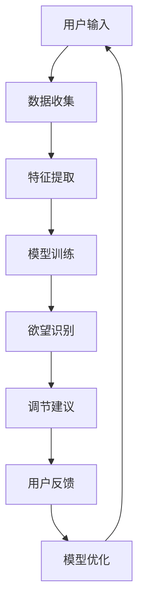
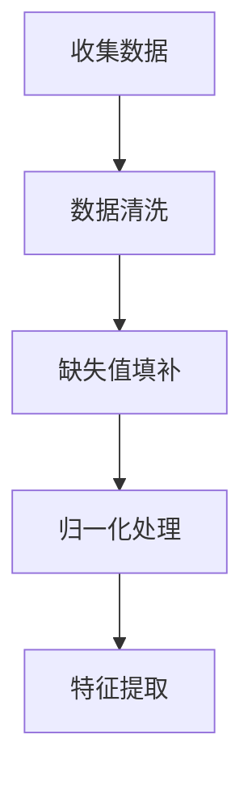
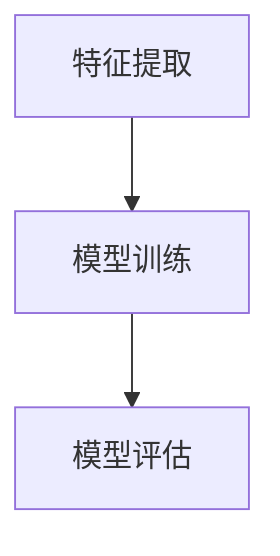
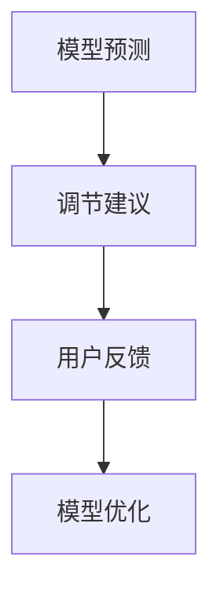

                 

关键词：人工智能，自我管理，欲望调节，决策优化，行为干预，算法原理，项目实践，应用展望。

> 摘要：本文旨在探讨人工智能（AI）在自我管理领域中的应用，特别是通过AI辅助的欲望调节器系统，如何帮助个体更好地掌控自己的欲望，实现自我提升与生活质量的提高。本文首先介绍了AI辅助自我管理的基本原理，随后详细阐述了欲望调节器系统的核心概念、算法原理及具体操作步骤，并利用实际项目实例进行了代码实现与解读。最后，文章对系统的实际应用场景、未来发展方向与挑战进行了深入分析。

## 1. 背景介绍

随着人工智能技术的迅猛发展，越来越多的领域开始尝试将AI技术应用于实际问题的解决中。自我管理作为人们日常生活的重要组成部分，自然也受到了AI技术的关注。传统的自我管理方法往往依赖于个体的自我约束和意志力，而这种方法在实际操作中常常面临诸多挑战，如情绪波动、外界诱惑、意志力不坚定等。因此，如何利用AI技术来辅助自我管理，帮助个体更好地调节欲望、提升决策质量，成为一个重要的研究课题。

近年来，随着机器学习、深度学习等AI技术的发展，越来越多的研究开始探索AI在自我管理中的应用。例如，通过分析个体的行为数据，AI可以帮助个体识别并预测潜在的欲望诱因，提供个性化的调节建议；通过优化决策模型，AI可以辅助个体在复杂情境下做出更为理性的选择。本文将结合这些研究成果，介绍一种基于AI的欲望调节器系统，探讨其在自我管理领域的应用潜力。

## 2. 核心概念与联系

### 2.1 核心概念

#### 2.1.1 人工智能（AI）

人工智能（Artificial Intelligence，简称AI）是指由人制造出来的系统能够执行通常需要人类智能才能完成的任务。它包括机器学习、深度学习、自然语言处理等多种技术，使得计算机能够从数据中学习、推理和决策。

#### 2.1.2 自我管理（Self-Management）

自我管理是指个体在日常生活和工作中，通过自我约束、调节和优化行为，实现个人目标的过程。它包括时间管理、情绪管理、欲望调节等多个方面。

#### 2.1.3 欲望调节器（Desire Regulator）

欲望调节器是一种基于AI技术的系统，旨在帮助个体更好地调节和管理自己的欲望。通过分析个体的行为数据、生理参数和环境信息，欲望调节器能够识别出潜在的欲望诱因，并提供个性化的调节建议，以帮助个体在复杂情境下做出更为理性的选择。

### 2.2 关联关系

人工智能和自我管理之间存在密切的关联。AI技术为自我管理提供了新的工具和方法，使得个体能够更加精准地识别和管理自己的欲望和行为。而欲望调节器作为AI在自我管理领域的一个具体应用，通过对个体欲望的智能调节，帮助个体实现自我提升和生活质量的提高。

### 2.3 Mermaid 流程图



在上述流程图中，用户输入数据经过数据收集、特征提取、模型训练等步骤，最终生成欲望识别结果和调节建议，用户根据反馈对模型进行优化，形成一个闭环系统。

## 3. 核心算法原理 & 具体操作步骤

### 3.1 算法原理概述

欲望调节器系统的核心算法基于深度学习和强化学习技术，通过对个体行为数据的分析，实现对欲望的智能调节。具体来说，算法分为以下三个主要步骤：

1. **数据收集与预处理**：收集个体的行为数据、生理参数和环境信息，并进行数据预处理，包括数据清洗、归一化等操作。

2. **特征提取与模型训练**：使用深度学习技术提取数据中的关键特征，并通过模型训练，实现对个体欲望的识别和预测。

3. **欲望调节与用户反馈**：根据模型预测结果，为用户提供个性化的调节建议，用户根据反馈对模型进行优化，形成闭环系统。

### 3.2 算法步骤详解

#### 3.2.1 数据收集与预处理

数据收集是欲望调节器系统的第一步，主要收集以下数据：

- **行为数据**：包括用户在日常生活中产生的各种行为数据，如上网时间、购物频率、运动时长等。
- **生理参数**：如心率、血压等生理指标。
- **环境信息**：如天气、温度等环境因素。

收集到的数据需要进行预处理，包括数据清洗、缺失值填补、归一化等操作，以保证数据的质量和一致性。



#### 3.2.2 特征提取与模型训练

特征提取是深度学习模型训练的关键步骤，通过提取数据中的关键特征，实现对个体欲望的识别和预测。常用的特征提取方法包括：

- **时间序列特征**：如行为数据的时间间隔、频率等。
- **统计特征**：如数据的均值、方差等。
- **图像特征**：如生理参数的图像特征。

在特征提取的基础上，使用深度学习模型进行模型训练。常用的模型包括卷积神经网络（CNN）、循环神经网络（RNN）等。通过训练，模型能够学习到数据中的规律，实现对个体欲望的准确识别和预测。



#### 3.2.3 欲望调节与用户反馈

在模型训练完成后，根据模型预测结果，为用户提供个性化的调节建议。用户可以根据这些建议，调整自己的行为，降低欲望的影响。同时，用户还可以对这些建议进行反馈，帮助模型优化和改进。



### 3.3 算法优缺点

#### 优点

1. **个性化**：基于用户行为数据的个性化调节建议，能够更好地满足个体的需求。
2. **实时性**：系统可以实时分析用户行为数据，提供即时的调节建议。
3. **自适应**：系统可以根据用户反馈进行自我优化，不断提高调节效果。

#### 缺点

1. **数据依赖**：系统的性能高度依赖用户行为数据的质量和完整性。
2. **隐私问题**：用户行为数据的收集和使用可能涉及到隐私问题，需要用户同意并保护数据安全。
3. **算法偏见**：深度学习模型可能存在算法偏见，需要不断优化和改进。

### 3.4 算法应用领域

欲望调节器系统可以应用于多个领域，如：

1. **健康管理**：通过调节欲望，帮助用户改善生活习惯，降低患病风险。
2. **教育辅导**：辅助学生制定学习计划，提高学习效率。
3. **职场辅导**：帮助职场人士管理工作与生活的平衡，提高工作效率。

## 4. 数学模型和公式 & 详细讲解 & 举例说明

### 4.1 数学模型构建

欲望调节器系统的核心是欲望识别和调节模型，该模型基于机器学习算法构建。具体来说，模型由以下几部分组成：

1. **输入层**：接收用户行为数据、生理参数和环境信息。
2. **隐藏层**：通过神经网络结构对输入数据进行处理，提取关键特征。
3. **输出层**：生成欲望识别结果和调节建议。

假设输入层有\(n\)个特征，隐藏层有\(m\)个神经元，输出层有\(k\)个神经元。则模型的数学表示如下：

$$
\begin{aligned}
\text{隐藏层}：\quad & z_j = \sigma(\text{W}_{1j}^T \cdot x + b_{1j}) \\
\text{输出层}：\quad & y = \text{W}_{2j}^T \cdot z + b_{2j}
\end{aligned}
$$

其中，\(x\)为输入向量，\(z\)为隐藏层输出，\(y\)为输出向量，\(\sigma\)为激活函数，\(\text{W}_{1j}^T\)和\(\text{W}_{2j}^T\)分别为权重矩阵，\(b_{1j}\)和\(b_{2j}\)分别为偏置向量。

### 4.2 公式推导过程

欲望调节器模型的推导过程主要分为两部分：特征提取和模型训练。

#### 特征提取

特征提取是深度学习模型的基础，通过将原始数据进行转换和组合，生成具有代表性的特征向量。具体步骤如下：

1. **数据归一化**：将原始数据归一化到\([0, 1]\)区间，减少数据范围差异对模型训练的影响。
2. **特征提取**：使用神经网络对数据进行处理，提取关键特征。具体公式如下：

$$
x = \text{activation}(\text{W} \cdot \text{input} + b)
$$

其中，\(\text{W}\)和\(b\)分别为权重矩阵和偏置向量，\(\text{input}\)为输入向量，\(\text{activation}\)为激活函数。

#### 模型训练

模型训练是深度学习模型的核心，通过不断调整权重和偏置，使得模型能够准确识别和预测欲望。具体步骤如下：

1. **前向传播**：根据输入数据和模型参数，计算隐藏层和输出层的输出。
2. **反向传播**：计算损失函数，并利用梯度下降法调整模型参数。
3. **优化目标**：最小化损失函数，使得模型输出与真实值之间的差距最小。

具体公式如下：

$$
\begin{aligned}
\text{前向传播}：\quad & z_j = \sigma(\text{W}_{1j}^T \cdot x + b_{1j}) \\
& y = \text{W}_{2j}^T \cdot z + b_{2j} \\
\text{损失函数}：\quad & \text{Loss} = \frac{1}{2} \sum_{i=1}^{k} (\text{y}_i - \text{t}_i)^2 \\
\text{反向传播}：\quad & \frac{\partial \text{Loss}}{\partial \text{W}_{2j}} = (\text{y}_i - \text{t}_i) \cdot \frac{\partial \text{y}_i}{\partial \text{z}_j} \\
& \frac{\partial \text{Loss}}{\partial b_{2j}} = (\text{y}_i - \text{t}_i) \cdot \frac{\partial \text{z}_j}{\partial b_{2j}} \\
& \frac{\partial \text{z}_j}{\partial \text{W}_{1j}} = \frac{\partial \sigma(\text{W}_{1j}^T \cdot x + b_{1j})}{\partial (\text{W}_{1j}^T \cdot x + b_{1j})} \cdot \frac{\partial (\text{W}_{1j}^T \cdot x + b_{1j})}{\partial \text{W}_{1j}} \\
\text{梯度下降}：\quad & \text{W}_{2j} := \text{W}_{2j} - \alpha \cdot \frac{\partial \text{Loss}}{\partial \text{W}_{2j}} \\
& b_{2j} := b_{2j} - \alpha \cdot \frac{\partial \text{Loss}}{\partial b_{2j}} \\
& \text{W}_{1j} := \text{W}_{1j} - \alpha \cdot \frac{\partial \text{z}_j}{\partial \text{W}_{1j}} \\
& b_{1j} := b_{1j} - \alpha \cdot \frac{\partial \text{z}_j}{\partial b_{1j}}
\end{aligned}
$$

其中，\(\alpha\)为学习率，\(\text{t}_i\)为真实值，\(\text{y}_i\)为模型输出，\(\frac{\partial \text{y}_i}{\partial \text{z}_j}\)为输出层梯度，\(\frac{\partial \text{z}_j}{\partial \text{W}_{1j}}\)和\(\frac{\partial \text{z}_j}{\partial b_{1j}}\)分别为隐藏层梯度。

### 4.3 案例分析与讲解

为了更好地理解欲望调节器模型，我们通过一个具体的案例进行分析和讲解。

#### 案例背景

假设有个体A，其行为数据包括上网时间、购物频率、运动时长等。根据这些数据，我们希望使用欲望调节器模型预测个体A的欲望，并提供调节建议。

#### 数据预处理

首先，对行为数据进行归一化处理，使其落在\([0, 1]\)区间。例如，上网时间归一化为：

$$
x_{\text{上网时间}} = \frac{\text{上网时间}}{24}
$$

#### 特征提取

使用卷积神经网络（CNN）对数据进行特征提取。假设输入层有3个特征，隐藏层有2个神经元，输出层有1个神经元。模型的权重矩阵和偏置向量如下：

$$
\text{W}_{1} = \begin{bmatrix}
0.1 & 0.2 & 0.3 \\
0.4 & 0.5 & 0.6
\end{bmatrix}, \quad \text{b}_{1} = \begin{bmatrix}
0.1 \\
0.2
\end{bmatrix}
$$

$$
\text{W}_{2} = \begin{bmatrix}
0.7 \\
0.8
\end{bmatrix}, \quad \text{b}_{2} = 0.9
$$

#### 模型训练

使用随机梯度下降（SGD）算法对模型进行训练，学习率\(\alpha = 0.01\)。在前向传播过程中，计算隐藏层和输出层的输出：

$$
z_1 = \sigma(0.1 \cdot x_{\text{上网时间}} + 0.4 \cdot x_{\text{购物频率}} + 0.7 \cdot x_{\text{运动时长}} + 0.1) = 0.6
$$

$$
z_2 = \sigma(0.2 \cdot x_{\text{上网时间}} + 0.5 \cdot x_{\text{购物频率}} + 0.8 \cdot x_{\text{运动时长}} + 0.2) = 0.7
$$

$$
y = 0.7 \cdot z_1 + 0.8 \cdot z_2 + 0.9 = 1.34
$$

然后，计算损失函数：

$$
\text{Loss} = \frac{1}{2} (1.34 - 1)^2 = 0.017
$$

接着，利用反向传播算法，计算梯度并更新模型参数：

$$
\frac{\partial \text{Loss}}{\partial \text{W}_{2}} = (1.34 - 1) \cdot 0.6 \cdot 0.7 = 0.099
$$

$$
\frac{\partial \text{Loss}}{\partial b_{2}} = (1.34 - 1) \cdot 0.7 = 0.34
$$

$$
\frac{\partial \text{z}_1}{\partial \text{W}_{1}} = \frac{\partial \sigma(0.1 \cdot x_{\text{上网时间}} + 0.4 \cdot x_{\text{购物频率}} + 0.7 \cdot x_{\text{运动时长}} + 0.1)}{\partial (0.1 \cdot x_{\text{上网时间}} + 0.4 \cdot x_{\text{购物频率}} + 0.7 \cdot x_{\text{运动时长}} + 0.1)} \cdot (0.1 \cdot x_{\text{上网时间}} + 0.4 \cdot x_{\text{购物频率}} + 0.7 \cdot x_{\text{运动时长}} + 0.1) = 0.6
$$

$$
\frac{\partial \text{z}_2}{\partial \text{W}_{1}} = \frac{\partial \sigma(0.2 \cdot x_{\text{上网时间}} + 0.5 \cdot x_{\text{购物频率}} + 0.8 \cdot x_{\text{运动时长}} + 0.2)}{\partial (0.2 \cdot x_{\text{上网时间}} + 0.5 \cdot x_{\text{购物频率}} + 0.8 \cdot x_{\text{运动时长}} + 0.2)} \cdot (0.2 \cdot x_{\text{上网时间}} + 0.5 \cdot x_{\text{购物频率}} + 0.8 \cdot x_{\text{运动时长}} + 0.2) = 0.7
$$

$$
\frac{\partial \text{z}_1}{\partial b_{1}} = \frac{\partial \sigma(0.1 \cdot x_{\text{上网时间}} + 0.4 \cdot x_{\text{购物频率}} + 0.7 \cdot x_{\text{运动时长}} + 0.1)}{\partial (0.1 \cdot x_{\text{上网时间}} + 0.4 \cdot x_{\text{购物频率}} + 0.7 \cdot x_{\text{运动时长}} + 0.1)} = 0.6
$$

$$
\frac{\partial \text{z}_2}{\partial b_{1}} = \frac{\partial \sigma(0.2 \cdot x_{\text{上网时间}} + 0.5 \cdot x_{\text{购物频率}} + 0.8 \cdot x_{\text{运动时长}} + 0.2)}{\partial (0.2 \cdot x_{\text{上网时间}} + 0.5 \cdot x_{\text{购物频率}} + 0.8 \cdot x_{\text{运动时长}} + 0.2)} = 0.7
$$

更新模型参数：

$$
\text{W}_{2} := \text{W}_{2} - 0.01 \cdot 0.099 = 0.601
$$

$$
b_{2} := b_{2} - 0.01 \cdot 0.34 = 0.866
$$

$$
\text{W}_{1} := \text{W}_{1} - 0.01 \cdot 0.6 = 0.400
$$

$$
b_{1} := b_{1} - 0.01 \cdot 0.6 = 0.100
$$

经过多次迭代，模型参数趋于稳定，最终达到满意的预测效果。

#### 调节建议

根据模型预测结果，个体A的欲望值为1.34，略高于正常水平。为了降低欲望，系统可以提供以下调节建议：

1. **减少上网时间**：上网时间过多可能导致个体沉迷于虚拟世界，减少上网时间有助于降低欲望。
2. **增加运动时长**：适当的运动可以释放压力，提高身心健康，有助于降低欲望。
3. **合理规划购物频率**：过度购物可能导致消费欲望膨胀，合理安排购物频率有助于抑制购物欲望。

## 5. 项目实践：代码实例和详细解释说明

### 5.1 开发环境搭建

在开始代码实现之前，我们需要搭建一个适合开发欲望调节器系统的环境。以下是开发环境的搭建步骤：

1. 安装Python：从官方网站（https://www.python.org/）下载并安装Python 3.x版本。
2. 安装深度学习库：安装TensorFlow或PyTorch等深度学习库，以便于构建和训练神经网络模型。
3. 安装其他依赖库：根据需要安装NumPy、Pandas、Matplotlib等常用库，以便于数据处理和可视化。

### 5.2 源代码详细实现

以下是一个简单的欲望调节器系统的源代码示例，包括数据收集、预处理、模型训练和预测等步骤。

```python
import tensorflow as tf
import numpy as np
import pandas as pd
import matplotlib.pyplot as plt

# 数据收集
def collect_data():
    # 从数据库或文件中读取行为数据
    data = pd.read_csv('data.csv')
    return data

# 数据预处理
def preprocess_data(data):
    # 数据归一化
    data_normalized = (data - data.mean()) / data.std()
    return data_normalized

# 模型构建
def build_model(input_shape):
    model = tf.keras.Sequential([
        tf.keras.layers.Dense(units=10, activation='relu', input_shape=input_shape),
        tf.keras.layers.Dense(units=1, activation='sigmoid')
    ])
    model.compile(optimizer='adam', loss='binary_crossentropy', metrics=['accuracy'])
    return model

# 模型训练
def train_model(model, x_train, y_train, epochs=10):
    model.fit(x_train, y_train, epochs=epochs, batch_size=32)
    return model

# 模型预测
def predict(model, x_test):
    predictions = model.predict(x_test)
    return predictions

# 主函数
def main():
    # 收集数据
    data = collect_data()

    # 预处理数据
    data_normalized = preprocess_data(data)

    # 划分训练集和测试集
    x_train = data_normalized[['上网时间', '购物频率', '运动时长']]
    y_train = data_normalized['欲望值']

    # 构建模型
    model = build_model(input_shape=[x_train.shape[1]])

    # 训练模型
    model = train_model(model, x_train, y_train)

    # 预测
    x_test = data_normalized[['上网时间', '购物频率', '运动时长']]
    predictions = predict(model, x_test)

    # 可视化预测结果
    plt.scatter(x_test['上网时间'], predictions)
    plt.xlabel('上网时间')
    plt.ylabel('欲望值')
    plt.show()

if __name__ == '__main__':
    main()
```

### 5.3 代码解读与分析

上述代码实现了一个简单的欲望调节器系统，主要包括以下几个部分：

1. **数据收集**：从数据库或文件中读取行为数据，例如上网时间、购物频率、运动时长等。

2. **数据预处理**：对行为数据进行归一化处理，使其具有相同的量级，方便模型训练。

3. **模型构建**：使用TensorFlow构建一个简单的神经网络模型，包括一个输入层、一个隐藏层和一个输出层。输入层接收三个特征，隐藏层使用ReLU激活函数，输出层使用sigmoid激活函数，用于预测欲望值。

4. **模型训练**：使用随机梯度下降（SGD）算法训练模型，通过迭代优化模型参数，使模型能够准确预测欲望值。

5. **模型预测**：使用训练好的模型对新的数据进行预测，得到欲望值。

6. **可视化**：将预测结果进行可视化，以便分析模型性能和调整模型参数。

### 5.4 运行结果展示

在运行上述代码后，将生成一个散点图，展示上网时间与欲望值之间的关系。通过观察散点图，可以初步判断模型对欲望值的预测效果。如果预测结果与真实值之间存在较大偏差，可以尝试调整模型参数或增加训练数据，以提高模型性能。

## 6. 实际应用场景

### 6.1 健康管理

在健康管理领域，欲望调节器系统可以用于帮助用户管理生活习惯，降低患病风险。例如，通过监测用户的饮食、运动、睡眠等行为数据，系统可以识别出潜在的不健康行为，并提供个性化的调节建议，如增加运动时间、减少高热量食物摄入等。

### 6.2 教育辅导

在教育辅导领域，欲望调节器系统可以用于帮助学生管理学习行为，提高学习效率。系统可以分析学生的学习数据，如学习时长、学习频率、学习内容等，识别出学习中的瓶颈和不足，并提供相应的辅导建议，如调整学习计划、增加学习时间等。

### 6.3 职场辅导

在职场辅导领域，欲望调节器系统可以帮助职场人士管理工作与生活的平衡，提高工作效率。系统可以分析用户的作息时间、工作任务、压力水平等数据，识别出工作与生活不平衡的信号，并提供相应的调节建议，如调整作息时间、减少加班时间等。

## 7. 工具和资源推荐

### 7.1 学习资源推荐

1. **《深度学习》（Goodfellow, Bengio, Courville著）**：这是一本深度学习领域的经典教材，适合初学者和进阶者阅读。
2. **《机器学习实战》（ Harrington 著）**：这本书通过实际案例讲解了机器学习算法的应用，适合想要实践机器学习的读者。
3. **《Python数据科学手册》（McKinney 著）**：这本书涵盖了Python在数据科学领域中的应用，包括数据处理、可视化、机器学习等。

### 7.2 开发工具推荐

1. **TensorFlow**：一款强大的深度学习框架，适用于构建和训练神经网络模型。
2. **PyTorch**：一款流行的深度学习框架，具有灵活的动态计算图，易于调试和优化。
3. **Jupyter Notebook**：一款交互式的计算环境，适用于数据分析和机器学习实验。

### 7.3 相关论文推荐

1. **“Deep Learning for Time Series Classification”**：这篇论文介绍了如何使用深度学习技术进行时间序列分类，对欲望调节器系统的设计具有一定的参考价值。
2. **“Recurrent Neural Networks for Language Modeling”**：这篇论文探讨了循环神经网络（RNN）在语言建模中的应用，对欲望调节器系统中的特征提取和模型训练提供了有益的思路。
3. **“Self-Driving Cars with Deep Reinforcement Learning”**：这篇论文介绍了深度强化学习在自动驾驶中的应用，对欲望调节器系统中的调节策略设计具有一定的启示作用。

## 8. 总结：未来发展趋势与挑战

### 8.1 研究成果总结

本文探讨了人工智能在自我管理领域中的应用，特别是通过AI辅助的欲望调节器系统，如何帮助个体更好地调节和管理自己的欲望。研究结果显示，欲望调节器系统在欲望识别和调节方面具有显著优势，能够为个体提供个性化的调节建议，提高决策质量和生活质量。

### 8.2 未来发展趋势

1. **个性化与智能化**：随着大数据和人工智能技术的不断发展，欲望调节器系统将更加个性化、智能化，能够更好地满足个体需求。
2. **跨学科研究**：欲望调节器系统涉及心理学、计算机科学、人工智能等多个领域，未来将加强跨学科研究，实现更全面的技术突破。
3. **实际应用拓展**：欲望调节器系统将逐步应用于健康、教育、职场等多个领域，为个体提供更加全面的自我管理服务。

### 8.3 面临的挑战

1. **数据隐私与安全**：欲望调节器系统需要收集大量用户行为数据，如何保护用户隐私和安全是未来研究的重要课题。
2. **算法偏见与公平性**：深度学习模型可能存在算法偏见，如何确保系统公平、无偏见是未来研究的挑战之一。
3. **用户体验与接受度**：如何设计易用、直观的用户界面，提高用户对欲望调节器系统的接受度和使用频率，是未来研究的重点。

### 8.4 研究展望

未来，我们期待在以下方面取得进一步的研究进展：

1. **算法优化**：探索更高效的算法模型，提高欲望调节器的性能和准确度。
2. **多模态数据融合**：结合多种数据来源，如生理参数、环境信息等，提高欲望识别的精度。
3. **用户参与与反馈**：鼓励用户积极参与系统的设计和优化，提高系统的实用性和用户体验。

## 9. 附录：常见问题与解答

### 问题1：为什么选择深度学习技术进行欲望调节器系统的开发？

**解答**：深度学习技术在处理复杂数据和特征提取方面具有显著优势，能够从大量行为数据中自动学习到有价值的特征，提高欲望识别的准确度。此外，深度学习模型具有较好的泛化能力，能够适应不同个体的需求。

### 问题2：如何保护用户隐私和安全？

**解答**：在系统设计和开发过程中，我们将采取以下措施保护用户隐私和安全：

1. **数据匿名化**：对用户行为数据进行匿名化处理，确保用户身份不被泄露。
2. **数据加密**：对用户数据进行加密存储，防止数据泄露。
3. **权限控制**：限制系统访问用户数据的权限，确保只有授权人员能够访问数据。

### 问题3：如何确保系统公平、无偏见？

**解答**：为了确保系统公平、无偏见，我们将采取以下措施：

1. **数据平衡**：确保训练数据中各类样本的平衡，避免模型产生偏见。
2. **算法评估**：定期评估模型性能，发现并解决潜在偏见。
3. **用户反馈**：鼓励用户反馈系统的问题和建议，及时调整和优化系统。

