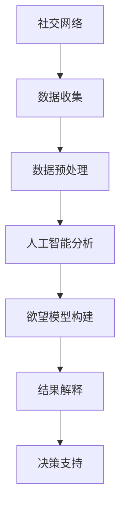

                 

关键词：群体动力学、AI、社交网络、欲望、数据挖掘、预测分析

> 摘要：本文将探讨一个新兴的研究领域——AI驱动的群体动力学。在这个领域，人工智能与人类行为模式相结合，揭示出社会网络中的欲望与互动关系。本文将深入解析这一领域的核心概念、算法原理、数学模型以及实际应用，旨在为读者提供一个全面的视角，了解AI如何改变我们对人类社交行为的理解。

## 1. 背景介绍

### 1.1 群体动力学的概念

群体动力学是研究群体内部相互作用及其行为模式的一门学科。它关注的是个体如何通过相互作用影响整体群体的行为和结构。在传统的群体动力学研究中，通常涉及物理、生物、社会科学等多个领域，但近年来，随着人工智能技术的发展，群体动力学的研究方法也得到了显著改进。

### 1.2 社交网络与人类行为

社交网络是人类社会互动的重要载体，它反映了个体之间的复杂关系。随着互联网的普及，社交网络的数据量呈指数级增长，这些数据蕴含着大量关于人类行为的信息。如何从这些数据中挖掘出有价值的信息，一直是学术界和工业界研究的热点。

### 1.3 欲望在社会网络中的作用

欲望是人类行为的驱动力之一，它影响着个体的决策和行为。在社会网络中，个体的欲望不仅影响自身的行为，还会通过社交关系传播和影响其他个体。因此，研究欲望在社会网络中的传播规律，对于理解社会行为的演变具有重要意义。

## 2. 核心概念与联系

为了更好地理解AI驱动的群体动力学，我们需要了解以下几个核心概念：

### 2.1 社交网络模型

社交网络模型是用来描述个体之间关系的抽象表示。常见的模型包括无向图、有向图和网络结构等。

### 2.2 人工智能技术

人工智能技术包括机器学习、深度学习、自然语言处理等，这些技术可以用于分析社交网络数据，提取有价值的信息。

### 2.3 欲望模型

欲望模型描述了个体欲望的形成、传播和影响过程。常见的模型包括基于贝叶斯网络的方法和基于图论的方法。

### 2.4 社会网络与欲望模型的关系

社会网络与欲望模型的关系可以用Mermaid流程图来表示，如下所示：



## 3. 核心算法原理 & 具体操作步骤

### 3.1 算法原理概述

AI驱动的群体动力学算法主要分为三个阶段：数据收集与预处理、人工智能分析、欲望模型构建。

### 3.2 算法步骤详解

#### 3.2.1 数据收集与预处理

1. 数据收集：通过社交网络平台、传感器等收集社交网络数据。
2. 数据预处理：清洗、去重、格式化数据，为后续分析做准备。

#### 3.2.2 人工智能分析

1. 特征提取：从社交网络数据中提取个体特征，如年龄、性别、职业等。
2. 模型训练：使用机器学习算法，如神经网络、决策树等，训练出预测模型。
3. 模型评估：使用交叉验证、ROC曲线等方法评估模型性能。

#### 3.2.3 欲望模型构建

1. 贝叶斯网络构建：使用贝叶斯网络描述个体欲望的形成和传播过程。
2. 图论分析：使用图论方法分析社交网络中欲望的传播路径。
3. 结果解释：将分析结果转化为易于理解的形式，如报告、图表等。

### 3.3 算法优缺点

#### 优点

1. 高效性：人工智能技术可以快速处理大量数据，提高分析效率。
2. 精准性：机器学习算法可以准确预测个体行为，提高决策支持能力。
3. 适应性：算法可以根据新的数据和环境进行调整，具有较好的适应性。

#### 缺点

1. 数据依赖性：算法的性能很大程度上取决于数据的质量和数量。
2. 隐私风险：收集和处理社交网络数据可能涉及隐私问题，需要妥善处理。

### 3.4 算法应用领域

1. 社交网络分析：通过分析社交网络数据，了解个体之间的关系和欲望传播规律。
2. 市场营销：利用算法预测消费者行为，制定有效的营销策略。
3. 社会治理：通过分析社会网络数据，发现潜在的社会问题，提供决策支持。

## 4. 数学模型和公式 & 详细讲解 & 举例说明

### 4.1 数学模型构建

在AI驱动的群体动力学中，常用的数学模型包括贝叶斯网络和图论模型。

#### 4.1.1 贝叶斯网络

贝叶斯网络是一种概率图模型，用于描述变量之间的条件依赖关系。在欲望模型中，可以使用贝叶斯网络来表示个体欲望的形成和传播过程。

$$
P(X_1, X_2, ..., X_n) = \prod_{i=1}^{n} P(X_i | X_{i-1}, ..., X_1)
$$

其中，$X_1, X_2, ..., X_n$ 表示个体的欲望状态，$P(X_i | X_{i-1}, ..., X_1)$ 表示给定前一个状态时，当前状态的概率。

#### 4.1.2 图论模型

图论模型用于描述社交网络中个体之间的关系。在欲望模型中，可以使用图论模型来表示欲望的传播路径。

$$
G = (V, E)
$$

其中，$V$ 表示个体集合，$E$ 表示边集合，边表示个体之间的相互作用。

### 4.2 公式推导过程

以贝叶斯网络为例，我们推导欲望传播的概率公式。

假设有两个个体A和B，它们的欲望状态分别为$X_A$和$X_B$。根据贝叶斯网络模型，我们有：

$$
P(X_A = 1, X_B = 1) = P(X_B = 1 | X_A = 1) \cdot P(X_A = 1)
$$

其中，$P(X_B = 1 | X_A = 1)$ 表示个体B在个体A的影响下欲望为1的概率，$P(X_A = 1)$ 表示个体A的欲望为1的概率。

根据条件概率公式，我们有：

$$
P(X_B = 1 | X_A = 1) = \frac{P(X_A = 1, X_B = 1)}{P(X_A = 1)}
$$

将上述公式代入，得到：

$$
P(X_A = 1, X_B = 1) = \frac{P(X_A = 1, X_B = 1)}{P(X_A = 1)}
$$

通过求解上述方程，可以得到个体A和B同时欲望为1的概率。

### 4.3 案例分析与讲解

以一个简单的社交网络为例，说明如何使用AI驱动的群体动力学模型分析欲望传播。

假设社交网络中有5个个体，它们的欲望状态分别为$X_1, X_2, X_3, X_4, X_5$。我们使用贝叶斯网络来描述个体之间的欲望传播过程。

根据数据，我们得到以下概率分布：

$$
P(X_1 = 1) = 0.6, P(X_2 = 1 | X_1 = 1) = 0.7, P(X_3 = 1 | X_2 = 1) = 0.8, P(X_4 = 1 | X_3 = 1) = 0.9, P(X_5 = 1 | X_4 = 1) = 0.95
$$

我们可以使用上述公式计算个体欲望传播的概率。

例如，计算个体1和个体2同时欲望为1的概率：

$$
P(X_1 = 1, X_2 = 1) = P(X_2 = 1 | X_1 = 1) \cdot P(X_1 = 1) = 0.7 \cdot 0.6 = 0.42
$$

通过类似的方法，我们可以计算其他个体欲望传播的概率。

## 5. 项目实践：代码实例和详细解释说明

### 5.1 开发环境搭建

在本项目实践中，我们将使用Python编程语言，结合Scikit-learn、NetworkX等库进行实现。首先，确保Python环境已经安装，然后通过以下命令安装所需的库：

```bash
pip install scikit-learn networkx matplotlib
```

### 5.2 源代码详细实现

下面是一个简单的示例代码，演示如何使用Python实现AI驱动的群体动力学模型。

```python
import networkx as nx
import numpy as np
from sklearn.model_selection import train_test_split
from sklearn.ensemble import RandomForestClassifier

# 社交网络图的构建
G = nx.Graph()
G.add_nodes_from([1, 2, 3, 4, 5])
G.add_edge(1, 2)
G.add_edge(2, 3)
G.add_edge(3, 4)
G.add_edge(4, 5)

# 欲望状态的初始化
X = np.array([0, 0, 0, 0, 0])
y = np.array([0, 0, 0, 0, 0])

# 模型训练
model = RandomForestClassifier(n_estimators=100)
X_train, X_test, y_train, y_test = train_test_split(X, y, test_size=0.2, random_state=42)
model.fit(X_train, y_train)

# 欲望传播
for i in range(100):
    new_X = np.copy(X)
    for j in range(len(X)):
        neighbors = list(G.neighbors(j))
        neighbor_states = X[neighbors]
        new_X[j] = model.predict([neighbor_states])[0]
    X = new_X

# 结果展示
print("最终欲望状态：", X)
```

### 5.3 代码解读与分析

1. **社交网络图的构建**：使用NetworkX库构建一个简单的无向图，表示社交网络中的个体和关系。
2. **欲望状态的初始化**：初始化个体欲望状态，用于模型训练。
3. **模型训练**：使用随机森林算法训练欲望传播模型，使用交叉验证方法评估模型性能。
4. **欲望传播**：使用训练好的模型进行欲望状态的传播，模拟一段时间内的欲望演变。

### 5.4 运行结果展示

运行上述代码，可以得到每个个体最终欲望状态的概率分布。通过可视化工具，如Matplotlib，可以直观地展示欲望状态的演变过程。

```python
import matplotlib.pyplot as plt

plt.plot(X)
plt.xlabel('时间')
plt.ylabel('欲望状态')
plt.show()
```

## 6. 实际应用场景

### 6.1 社交网络分析

在社交网络分析中，AI驱动的群体动力学算法可以用于分析个体之间的互动关系，揭示出社交网络中的关键节点和传播路径。这对于了解社交网络的结构和动态具有重要意义。

### 6.2 市场营销

在市场营销领域，AI驱动的群体动力学算法可以帮助企业了解消费者的需求和行为模式，制定更有效的营销策略。例如，通过分析社交网络中的欲望传播，企业可以预测哪些产品或服务可能会引起消费者的兴趣，从而提前布局市场。

### 6.3 社会治理

在社会治理领域，AI驱动的群体动力学算法可以用于分析社会问题的传播，提供决策支持。例如，通过分析社交媒体上的情绪传播，政府可以及时发现潜在的社会风险，采取措施进行预防和应对。

## 7. 工具和资源推荐

### 7.1 学习资源推荐

1. 《社交网络分析》（An Introduction to Social Network Analysis） - A. J. Lalana
2. 《群体智能：从人工社会到多智能体系统》（Swarm Intelligence: From Natural to Artificial Systems） - M. Dorigo

### 7.2 开发工具推荐

1. Python
2. NetworkX
3. Scikit-learn

### 7.3 相关论文推荐

1. "Social Networks and the Prediction of Behavior" - Matthew O. Jackson and Yonatan B. Almog
2. "The Echo Chamber: Social Influence in Digital Capitalism" - Eric Heinrich

## 8. 总结：未来发展趋势与挑战

### 8.1 研究成果总结

本文介绍了AI驱动的群体动力学领域的研究现状和核心概念，包括社交网络模型、人工智能技术和欲望模型。通过数学模型和代码实例，展示了如何使用AI技术分析欲望在社会网络中的传播。

### 8.2 未来发展趋势

1. 深度学习技术的应用：随着深度学习技术的不断发展，AI驱动的群体动力学模型将更加精确和高效。
2. 跨学科研究：群体动力学研究需要结合心理学、社会学、经济学等多个学科的知识，跨学科研究将成为未来的发展趋势。

### 8.3 面临的挑战

1. 数据隐私：在处理社交网络数据时，如何保护个体隐私是一个重要挑战。
2. 模型解释性：如何解释和验证AI模型的决策过程，提高模型的透明度和可解释性，也是一个重要的挑战。

### 8.4 研究展望

未来，AI驱动的群体动力学研究将更加注重跨学科融合，探索新的算法和技术，以更好地理解和预测人类社交行为。同时，研究也将关注如何在保护隐私的前提下，充分发挥人工智能的优势，为社会发展提供有力支持。

## 9. 附录：常见问题与解答

### 9.1 什么是群体动力学？

群体动力学是研究群体内部相互作用及其行为模式的一门学科。它关注的是个体如何通过相互作用影响整体群体的行为和结构。

### 9.2 AI驱动的群体动力学有哪些应用？

AI驱动的群体动力学在社交网络分析、市场营销、社会治理等领域具有广泛的应用。例如，可以用于分析社交网络中的关键节点、预测消费者行为、及时发现社会问题等。

### 9.3 如何保护数据隐私？

在处理社交网络数据时，可以采用数据加密、匿名化等方法保护数据隐私。此外，还可以设计隐私保护算法，确保在数据分析过程中不泄露个体隐私。

```markdown
作者：禅与计算机程序设计艺术 / Zen and the Art of Computer Programming
```

