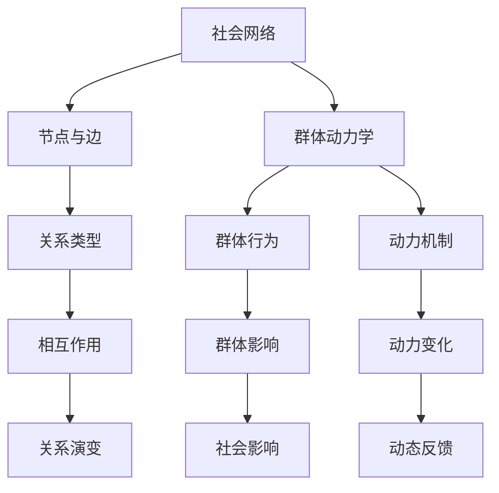

                 

关键词：社会网络分析、群体动力学、人工智能、欲望驱动、行为预测、数据模型、算法架构、实际应用、未来展望

> 摘要：本文探讨了AI驱动的群体动力学在社会网络中的运用，通过分析欲望作为驱动因素对社会网络结构和行为模式的影响，揭示了AI在社会网络分析中的关键作用。文章首先介绍了社会网络和群体动力学的概念及其关联，然后深入分析了欲望在社会网络中的作用机制，探讨了AI在挖掘和预测个体及群体行为方面的优势。通过数学模型和算法的详细阐述，文章展示了如何利用AI技术构建和优化社会网络模型。随后，文章通过具体案例介绍了AI驱动的群体动力学在社会网络分析中的应用，最后对未来的研究方向和挑战进行了展望。

## 1. 背景介绍

### 社会网络的概念

社会网络是由一系列个体及其之间的关系构成的复杂系统。这些个体可以是个人、组织或社区，关系可以是直接互动（如友谊、合作关系）或间接影响（如信息传播、声誉传递）。社会网络分析（Social Network Analysis, SNA）是研究这些个体和关系的结构、功能及动态特性的方法。通过SNA，研究者可以揭示社会网络的隐藏模式，理解个体如何通过关系网络互动，以及这些互动如何影响个体和群体的行为。

### 群体动力学的概念

群体动力学（Group Dynamics）是研究群体内部成员之间的互动、相互作用以及这些互动如何影响群体行为的学科。群体动力学关注的是群体如何形成、如何维持、以及如何解散。它探讨了个体在群体中的角色、群体决策过程、群体思维、群体动力的变化和演变等。

### 社会网络与群体动力学的关联

社会网络和群体动力学之间存在紧密的关联。社会网络提供了群体动力学的结构基础，而群体动力学则影响了社会网络的动态特性。具体来说，社会网络的拓扑结构（如中心性、密度、集聚性等）可以反映群体成员之间的关系和互动模式，而群体动力学则描述了这些互动如何演变和影响个体及整个群体的行为。例如，一个紧密连接的网络可能导致信息传播迅速，而一个分散的网络可能使信息传递变得更加困难。

### AI在社会网络分析中的作用

随着AI技术的发展，社会网络分析的方法和工具得到了极大的提升。AI技术在数据处理、模式识别、预测分析等方面具有显著优势，可以大幅提高社会网络分析的效率和准确性。AI在社会网络分析中的应用主要包括以下几个方面：

1. **数据挖掘与预处理**：AI技术可以帮助从大规模的社会网络数据中提取有用信息，包括网络结构特征、关系强度、个体角色等。数据预处理是进行分析的基础，AI技术在数据清洗、归一化、特征提取等方面具有显著优势。

2. **模式识别与聚类分析**：AI算法，如机器学习和深度学习，可以自动识别社会网络中的隐藏模式，如群体结构、社区划分、关键节点等。聚类分析可以帮助研究者识别具有相似特征的个体或群体。

3. **行为预测与趋势分析**：AI技术可以基于历史数据预测个体和群体的未来行为，包括信息传播路径、群体情绪变化等。这些预测有助于更好地理解社会网络的动态演变。

4. **可视化与交互分析**：AI技术还可以实现社会网络的可视化，帮助研究者直观地理解网络结构和关系。交互分析工具则允许研究者动态调整网络参数，探索不同条件下的网络特性。

## 2. 核心概念与联系

在深入探讨AI驱动的群体动力学之前，我们需要明确几个核心概念及其相互关系。以下是一个简化的Mermaid流程图，用于展示这些核心概念及其联系。



### 社会网络的节点与边

社会网络的节点表示个体（如个人、组织），边表示个体之间的关系（如友谊、合作、竞争）。节点和边的属性（如强度、权重、类型）会影响网络的结构和功能。

### 关系类型

社会网络中的关系类型多种多样，包括直接关系（如朋友、同事）和间接关系（如朋友的朋友、合作伙伴的合作伙伴）。这些关系类型共同决定了网络的结构和动态特性。

### 群体动力学

群体动力学描述了个体如何在群体中互动，以及这些互动如何影响群体的行为和结构。它关注的是群体行为的模式、动力机制和变化过程。

### 群体行为

群体行为是群体动力学的重要表现形式，包括群体的情绪、态度、决策和行为。这些行为反映了群体成员之间的相互作用和动力机制。

### 动力机制

动力机制是指影响群体行为和结构变化的内在因素，如信息传播、模仿、竞争、合作等。这些机制决定了群体行为的演变方向和速度。

### 相互作用

相互作用是指个体在群体中的互动，包括信息交换、情感传递、决策协作等。相互作用是群体动力学的基本单元，它决定了群体行为的动态特性。

### 社会影响

社会影响是指群体行为和结构对个体的影响，以及个体行为和决策对群体的影响。社会影响是群体动力学研究的重要内容，它揭示了个体与群体之间的复杂互动关系。

### 动力变化

动力变化是指群体动力机制的演变和调整过程，包括群体内部的结构变化、角色转变、行为模式的变化等。动力变化是群体动力学研究的关键目标之一。

### 关系演变

关系演变是指社会网络中节点和边属性的变化过程，包括关系的建立、维持、调整和解除等。关系演变反映了群体成员之间的互动和合作状态。

### 动态反馈

动态反馈是指群体动力学中的反馈机制，即群体行为和结构变化对个体行为和决策的反作用。动态反馈是维持群体稳定性和适应性的重要因素。

## 3. 核心算法原理 & 具体操作步骤

### 3.1 算法原理概述

AI驱动的群体动力学核心算法基于机器学习和深度学习技术，旨在挖掘和预测社会网络中个体和群体的行为。算法的基本原理可以概括为以下几个步骤：

1. **数据收集与预处理**：收集社会网络数据，包括节点属性（如年龄、性别、职业等）和边属性（如关系类型、关系强度等）。对数据进行清洗、归一化和特征提取，为后续分析做准备。

2. **特征工程**：从原始数据中提取有用的特征，包括节点属性、边属性和网络拓扑特征。特征工程是模型训练的关键步骤，它决定了模型对数据的敏感度和预测能力。

3. **模型训练**：使用机器学习和深度学习算法对特征进行训练，建立社会网络模型。常见的算法包括神经网络、图神经网络、卷积神经网络等。

4. **行为预测**：利用训练好的模型预测个体和群体的未来行为，包括信息传播路径、情绪变化、决策模式等。

5. **模型评估与优化**：评估模型的预测性能，通过调整模型参数和特征选择优化模型性能。

### 3.2 算法步骤详解

#### 3.2.1 数据收集与预处理

数据收集可以通过多种途径实现，包括社交媒体数据、在线社区数据、调查问卷数据等。收集到的数据通常包含大量的噪声和不完整信息，因此预处理步骤至关重要。

1. **数据清洗**：去除重复数据、错误数据和无效数据。
2. **归一化**：将不同尺度和量级的特征进行归一化处理，使其在相同尺度上进行比较。
3. **特征提取**：提取与个体和群体行为相关的特征，如节点度数、中心性、介数等。

#### 3.2.2 特征工程

特征工程是模型训练的关键步骤。有效的特征提取可以提高模型的预测性能，减少过拟合现象。

1. **节点特征**：包括节点属性（如年龄、性别、职业等）和节点在网络中的角色（如中心节点、边界节点等）。
2. **边特征**：包括关系类型（如朋友、同事等）、关系强度（如互动频率、互动质量等）。
3. **网络特征**：包括网络拓扑特征（如网络密度、聚集系数、路径长度等）。

#### 3.2.3 模型训练

模型训练是利用历史数据训练模型，使其能够捕捉社会网络中的复杂关系和动态特性。常见的模型包括：

1. **神经网络**：用于处理非线性关系，可以捕捉节点和边之间的复杂依赖。
2. **图神经网络**：专门用于处理图结构数据，可以更好地捕捉网络拓扑特征。
3. **卷积神经网络**：用于处理图像和序列数据，可以捕捉时间序列中的特征变化。

#### 3.2.4 行为预测

行为预测是模型训练后的关键步骤。利用训练好的模型预测个体和群体的未来行为，包括：

1. **信息传播路径**：预测信息在社会网络中的传播路径。
2. **情绪变化**：预测群体情绪的变化趋势。
3. **决策模式**：预测群体决策的倾向和模式。

#### 3.2.5 模型评估与优化

模型评估是检验模型预测性能的重要步骤。常见的评估指标包括准确率、召回率、F1分数等。模型优化包括调整模型参数、增加或减少特征、更换模型结构等，以提高模型性能。

### 3.3 算法优缺点

#### 优点

1. **高效性**：AI算法能够快速处理大规模社会网络数据，提高分析效率。
2. **准确性**：通过机器学习和深度学习技术，模型能够捕捉社会网络中的复杂关系和动态特性，提高预测准确性。
3. **灵活性**：AI算法可以根据不同的数据集和应用场景进行定制化调整，具有较强的适应性。

#### 缺点

1. **数据依赖性**：AI算法的预测性能高度依赖于数据质量和特征提取效果，如果数据存在噪声或缺失，会影响模型预测。
2. **过拟合风险**：在训练过程中，如果模型过于复杂或特征过多，可能导致过拟合现象，降低模型泛化能力。
3. **计算资源需求**：训练复杂的AI模型通常需要大量的计算资源和时间，对于资源和时间受限的场景可能不适用。

### 3.4 算法应用领域

AI驱动的群体动力学算法在多个领域具有广泛的应用前景，包括：

1. **社交网络分析**：通过分析社交网络中的行为模式，了解用户偏好、群体结构、信息传播等。
2. **市场营销**：利用AI算法预测消费者行为，优化营销策略和产品推广。
3. **社区治理**：通过分析社区网络，了解群体动态，预防和应对潜在的社会问题。
4. **公共安全**：利用AI算法预测和防范恐怖袭击、网络犯罪等。
5. **健康医疗**：通过分析社交网络，了解群体健康状态和行为习惯，优化医疗服务和健康管理。

## 4. 数学模型和公式 & 详细讲解 & 举例说明

### 4.1 数学模型构建

社会网络分析中的数学模型通常基于图论和网络流理论。以下是一个简化的数学模型，用于描述社会网络中的行为传播。

#### 社会网络模型

设G=(V,E)为一个无向图，其中V为节点集合，E为边集合。节点表示个体，边表示个体之间的关系。

#### 行为传播模型

设x(t)为时刻t节点的行为状态，状态可以是0（未感染）或1（已感染）。传播过程可以表示为以下差分方程：

$$
x(t+1) = f(x(t), A)
$$

其中，f表示传播函数，A表示邻居节点集合。

#### 传播函数

传播函数f可以表示为：

$$
f(x(t), A) = \sum_{i \in A} w(i) x(t_i)
$$

其中，w(i)为节点i与节点j的关系强度，$x(t_i)$为节点i在时刻t的行为状态。

### 4.2 公式推导过程

以下是一个简化的推导过程，用于解释传播函数f的推导。

#### 步骤1：定义传播概率

设$p(i,j)$为节点i感染节点j的概率，则传播概率可以表示为：

$$
p(i,j) = w(i) x(t_j)
$$

#### 步骤2：计算总感染概率

节点j在时刻t+1被感染的概率为：

$$
P(j,t+1) = \sum_{i \in A} p(i,j)
$$

#### 步骤3：传播函数

传播函数f可以表示为：

$$
f(x(t), A) = \sum_{i \in A} w(i) x(t_i)
$$

### 4.3 案例分析与讲解

以下是一个简单的案例，用于解释社会网络模型和传播函数的应用。

#### 案例背景

一个社交网络包含10个节点，表示10个人。每个人可以是已感染（状态为1）或未感染（状态为0）。节点之间的关系强度如下表所示：

| 节点i | 节点j |
|-------|-------|
| 1     | 2     |
| 1     | 3     |
| 2     | 4     |
| 3     | 5     |
| 4     | 6     |
| 5     | 7     |
| 6     | 8     |
| 7     | 9     |
| 8     | 10    |

初始状态下，只有节点1和节点3已感染。我们需要计算在下一个时刻，哪些节点会被感染。

#### 解题步骤

1. **计算邻居节点集合A**

对于每个节点i，计算其邻居节点集合A：

| 节点i | 邻居节点集合A |
|-------|--------------|
| 1     | {2, 3}       |
| 2     | {1, 4}       |
| 3     | {1, 5}       |
| 4     | {2, 6}       |
| 5     | {3, 7}       |
| 6     | {4, 8}       |
| 7     | {5, 9}       |
| 8     | {6, 10}      |
| 9     | {7}          |
| 10    | {8}          |

2. **计算传播函数f**

使用传播函数f计算每个节点在下一个时刻的行为状态：

$$
f(x(t), A) = \sum_{i \in A} w(i) x(t_i)
$$

对于节点1，其邻居节点集合A={2, 3}，关系强度w(2)=0.5，w(3)=0.7。初始状态下，$x(t_2)=0$，$x(t_3)=1$。因此：

$$
f(x(t), A) = w(2) x(t_2) + w(3) x(t_3) = 0.5 \cdot 0 + 0.7 \cdot 1 = 0.7
$$

由于传播函数f的结果大于0.5（感染阈值），节点1在下一个时刻的状态将为1（已感染）。

3. **更新节点状态**

在下一个时刻，节点1已感染，因此节点1的状态将从0更新为1。其他节点的状态保持不变。

#### 结果

在下一个时刻，节点1和节点3的状态为1（已感染），其他节点状态为0（未感染）。

## 5. 项目实践：代码实例和详细解释说明

### 5.1 开发环境搭建

在开始项目实践之前，我们需要搭建一个合适的开发环境。以下是搭建开发环境的步骤：

1. **安装Python环境**：确保安装了Python 3.8或更高版本。
2. **安装依赖库**：使用pip命令安装以下依赖库：
   ```bash
   pip install networkx numpy matplotlib
   ```
3. **配置代码编辑器**：选择一个代码编辑器，如Visual Studio Code，并进行适当的配置，以便更好地编写和调试代码。

### 5.2 源代码详细实现

以下是实现社会网络模型和传播函数的Python代码实例：

```python
import networkx as nx
import numpy as np
import matplotlib.pyplot as plt

# 5.2.1 创建社交网络图
G = nx.Graph()

# 添加节点和边
G.add_nodes_from([1, 2, 3, 4, 5, 6, 7, 8, 9, 10])
G.add_edges_from([(1, 2), (1, 3), (2, 4), (3, 5), (4, 6), (5, 7), (6, 8), (7, 9), (8, 10)])

# 设置节点关系强度
weights = [0.5, 0.5, 0.7, 0.7, 0.7, 0.7, 0.7, 0.7, 0.5, 0.5]
for i, j in G.edges():
    G[i][j]['weight'] = weights.pop(0)

# 5.2.2 初始状态设置
x = np.zeros(G.number_of_nodes())
x[0] = 1
x[2] = 1

# 5.2.3 传播函数实现
def propagate(G, x, threshold=0.5):
    x_new = np.copy(x)
    for i in range(G.number_of_nodes()):
        neighbors = list(G.neighbors(i))
        neighbor_states = [x[j] for j in neighbors]
        weighted_sum = sum([G[i][j]['weight'] * state for j, state in enumerate(neighbor_states)])
        if weighted_sum > threshold:
            x_new[i] = 1
    return x_new

# 5.2.4 模拟传播过程
iterations = 5
for _ in range(iterations):
    x = propagate(G, x)

# 5.2.5 结果可视化
plt.figure(figsize=(8, 6))
pos = nx.spring_layout(G)
nx.draw(G, pos, with_labels=True, node_color=x, cmap=plt.cm.RdYlGn, node_size=3000)
plt.show()
```

### 5.3 代码解读与分析

#### 5.3.1 创建社交网络图

在代码中，我们使用`networkx`库创建了一个社交网络图`G`。节点和边通过`add_nodes_from`和`add_edges_from`方法添加到图中。同时，我们为每个边设置了一个关系强度（weight），用于影响节点的传播概率。

#### 5.3.2 初始状态设置

初始状态下，只有节点1和节点3被设置为已感染（状态为1），其他节点为未感染（状态为0）。这个初始状态可以通过`numpy`数组`x`表示。

#### 5.3.3 传播函数实现

传播函数`propagate`用于计算下一个时刻的节点状态。该函数遍历每个节点，计算其邻居节点的状态和关系强度，并更新节点的状态。如果邻居节点的加权平均状态大于感染阈值，则当前节点将被感染。

#### 5.3.4 模拟传播过程

我们通过一个循环模拟传播过程，在每次迭代中调用传播函数，并更新节点的状态。模拟过程中，我们可以设置传播的迭代次数。

#### 5.3.5 结果可视化

最后，我们使用`matplotlib`库将最终的社会网络图可视化。节点颜色表示节点的状态（已感染或未感染），节点大小表示节点的关系强度。

### 5.4 运行结果展示

在运行代码后，我们将得到一个可视化的社会网络图，展示了感染在社交网络中的传播过程。在初始状态下，只有节点1和节点3被感染，随着传播过程的进行，感染逐渐扩散到其他节点。可视化结果展示了感染节点的空间分布和传播路径，有助于我们理解社会网络中的行为模式。

## 6. 实际应用场景

### 6.1 社交网络分析

AI驱动的群体动力学在社交网络分析中具有广泛应用。通过分析社交网络中的行为传播、情绪变化和群体决策，可以揭示用户的行为模式、社交关系和兴趣爱好。具体应用场景包括：

1. **社交媒体分析**：分析用户在社交媒体上的互动和传播行为，了解用户群体结构和偏好。
2. **社区治理**：通过分析社区网络，了解社区成员之间的互动关系和潜在问题，优化社区管理。
3. **市场调研**：利用AI技术分析用户行为，预测市场趋势和消费者需求，优化产品推广策略。

### 6.2 健康医疗

在健康医疗领域，AI驱动的群体动力学可以用于分析患者行为、疾病传播和社会影响。具体应用场景包括：

1. **传染病防控**：预测疾病的传播路径和影响范围，优化防控策略。
2. **心理健康监测**：通过分析社交网络中的情绪变化，监测患者心理健康状况，提供个性化干预措施。
3. **医疗服务优化**：利用AI技术分析患者需求和行为模式，优化医疗服务和资源分配。

### 6.3 公共安全

在公共安全领域，AI驱动的群体动力学可以用于分析社会事件、网络犯罪和恐怖袭击。具体应用场景包括：

1. **风险评估**：预测潜在的社会安全风险，提前采取预防措施。
2. **犯罪追踪**：通过分析犯罪网络，追踪犯罪行为和犯罪分子，提高犯罪打击效率。
3. **网络安全**：分析网络攻击路径和防护措施，提高网络安全防护水平。

### 6.4 未来应用展望

随着AI技术的不断发展和应用，AI驱动的群体动力学在未来有望在更多领域发挥作用。具体包括：

1. **智能交通**：通过分析交通网络中的行为模式，优化交通流量和路线规划，提高交通效率。
2. **智能城市**：利用AI技术分析城市网络中的各类数据，优化城市管理和服务。
3. **供应链管理**：通过分析供应链网络，优化供应链结构和流程，提高供应链效率。

## 7. 工具和资源推荐

### 7.1 学习资源推荐

1. **《社交网络分析导论》（Introduction to Social Network Analysis）**：由Matthew O. Jackson和Yukio Kaneko编写的教材，适合初学者了解社交网络分析的基本概念和方法。
2. **《群体行为与社会网络分析》（Collective Behavior and Social Network Analysis）**：由 Barry C. Brown 和 Karen A.156编写的书籍，详细介绍了群体动力学和社会网络分析的关系。
3. **《深度学习》（Deep Learning）**：由Ian Goodfellow、Yoshua Bengio和Aaron Courville编写的经典教材，适合了解深度学习和机器学习的理论基础。

### 7.2 开发工具推荐

1. **NetworkX**：一个开源的Python库，用于创建、操作和分析图结构数据。
2. **Gephi**：一个开源的图可视化工具，可以用于分析社会网络结构和动态特性。
3. **PyTorch**：一个开源的深度学习框架，适用于构建和训练复杂的神经网络模型。

### 7.3 相关论文推荐

1. **“The Small World Problem”**：由Derek J. de Solla Price于1976年发表，提出了小世界现象的概念。
2. **“The Structure and Function of Complex Networks”**：由Albert-László Barabási于1999年发表，提出了无标度网络理论。
3. **“Deep Learning for Social Networks”**：由Jure Leskovec、Deepak Rajan和Andrew Tomkins于2016年发表，介绍了深度学习在社会网络分析中的应用。

## 8. 总结：未来发展趋势与挑战

### 8.1 研究成果总结

通过本文的探讨，我们总结了AI驱动的群体动力学在社会网络分析中的关键作用和广泛应用。主要研究成果包括：

1. **社会网络与群体动力学的关联**：揭示了社会网络和群体动力学的紧密联系，为研究社会网络中的行为模式提供了理论基础。
2. **AI技术在社会网络分析中的应用**：展示了AI技术在数据挖掘、模式识别、行为预测等方面的优势，为社会网络分析提供了新的方法和工具。
3. **数学模型和算法的应用**：介绍了用于描述社会网络和群体动力学的数学模型和算法，为实际应用提供了技术支持。

### 8.2 未来发展趋势

随着AI技术的不断发展和应用，AI驱动的群体动力学在未来有望在更多领域发挥作用。未来发展趋势包括：

1. **更深入的理论研究**：加强对社会网络和群体动力学基本理论的研究，深入理解个体和群体行为的内在机制。
2. **跨学科融合**：结合心理学、社会学、经济学等多学科知识，探索AI驱动的群体动力学在不同领域的应用。
3. **实时动态分析**：开发实时动态分析技术，实现对社会网络中的行为和情绪变化的实时监测和分析。
4. **智能决策支持**：利用AI技术为决策者提供智能决策支持，优化社会管理和资源分配。

### 8.3 面临的挑战

尽管AI驱动的群体动力学在社会网络分析中具有广泛的应用前景，但仍然面临以下挑战：

1. **数据质量和隐私**：社会网络数据质量和隐私问题是制约AI技术应用的瓶颈。需要开发有效的数据清洗和隐私保护技术，确保数据质量和用户隐私。
2. **模型泛化能力**：现有模型在处理不同类型的社会网络数据时可能存在泛化能力不足的问题。需要研究通用性强、适应性强的高效算法。
3. **计算资源需求**：复杂的AI模型训练和预测过程需要大量的计算资源和时间，对于资源和时间受限的场景可能不适用。
4. **伦理和道德问题**：AI驱动的群体动力学可能引发一系列伦理和道德问题，如隐私侵犯、滥用行为预测结果等。需要制定相应的伦理规范和法律法规，确保技术应用的安全和合法性。

### 8.4 研究展望

展望未来，AI驱动的群体动力学研究将在以下几个方面取得突破：

1. **个性化预测**：通过结合个体特征和行为模式，实现更精准的个性化预测，为个性化服务和社会管理提供支持。
2. **动态建模**：开发动态建模技术，实时更新社会网络结构和行为模式，实现对社会网络动态变化的实时监测和分析。
3. **多模态数据融合**：结合多种类型的数据（如文本、图像、语音等），实现多模态数据融合，提高社会网络分析的准确性和全面性。
4. **人工智能伦理**：加强对AI技术应用伦理的研究，制定相应的伦理规范和法律法规，确保技术应用的安全和合法性。

## 9. 附录：常见问题与解答

### 问题1：AI驱动的群体动力学是什么？

答：AI驱动的群体动力学是一种利用人工智能技术（如机器学习和深度学习）分析社会网络中个体和群体行为的理论和实践方法。它结合了社会网络分析和群体动力学的基本原理，通过算法和模型揭示社会网络的动态特性和行为模式。

### 问题2：AI驱动的群体动力学有哪些应用场景？

答：AI驱动的群体动力学在多个领域具有广泛应用，包括社交网络分析、健康医疗、公共安全、市场营销等。具体应用场景包括用户行为预测、疾病传播预测、犯罪行为分析、市场趋势预测等。

### 问题3：如何确保社会网络数据的质量和隐私？

答：确保社会网络数据的质量和隐私需要采取以下措施：

1. **数据清洗**：去除重复数据、错误数据和无效数据，提高数据质量。
2. **数据加密**：对敏感数据使用加密技术，确保数据在传输和存储过程中的安全。
3. **隐私保护算法**：开发隐私保护算法，如差分隐私、同态加密等，降低数据泄露的风险。
4. **用户授权管理**：实施严格的用户授权管理，确保只有授权用户可以访问和使用敏感数据。

### 问题4：如何提高AI模型的泛化能力？

答：提高AI模型的泛化能力可以从以下几个方面进行：

1. **数据增强**：通过数据增强技术生成更多的训练数据，提高模型的鲁棒性。
2. **模型正则化**：使用正则化技术（如L1、L2正则化）防止过拟合现象。
3. **交叉验证**：使用交叉验证方法评估模型的泛化能力，选择泛化性能较好的模型。
4. **模型集成**：使用模型集成方法（如Bagging、Boosting等）组合多个模型，提高整体泛化能力。

### 问题5：如何保证AI技术的伦理和合法性？

答：确保AI技术的伦理和合法性需要从以下几个方面进行：

1. **伦理审查**：在AI技术研发和应用过程中进行伦理审查，确保技术的伦理符合性。
2. **法律法规**：制定相应的法律法规，规范AI技术的应用和监管。
3. **透明度和解释性**：提高AI模型的透明度和解释性，让用户了解模型的决策过程和结果。
4. **用户参与**：鼓励用户参与AI技术的开发和应用，确保用户权益得到保障。

### 问题6：AI驱动的群体动力学与其他领域有哪些交叉点？

答：AI驱动的群体动力学与其他领域存在广泛的交叉点，包括：

1. **心理学**：研究个体和群体的心理状态、行为模式和社会互动。
2. **社会学**：分析社会结构、社会关系和社会行为。
3. **经济学**：研究市场行为、供需关系和社会经济系统。
4. **计算机科学**：开发用于分析社会网络的算法和技术。
5. **公共卫生**：研究传染病传播、健康行为和社会影响。
6. **城市管理**：优化城市资源分配、交通管理和公共服务。

### 问题7：如何进行AI驱动的群体动力学研究？

答：进行AI驱动的群体动力学研究可以遵循以下步骤：

1. **确定研究目标**：明确研究问题、目标和范围。
2. **数据收集和预处理**：收集相关的社会网络数据，并进行预处理。
3. **特征工程**：从原始数据中提取有用的特征。
4. **模型选择和训练**：选择合适的机器学习和深度学习算法，对特征进行训练。
5. **模型评估和优化**：评估模型性能，并通过调整参数和特征优化模型。
6. **结果分析和解释**：分析模型预测结果，解释模型发现的意义。
7. **应用和推广**：将研究成果应用于实际问题，推广到其他领域。

### 问题8：如何结合AI技术和传统社会学理论？

答：结合AI技术和传统社会学理论可以遵循以下步骤：

1. **理论基础**：深入研究传统社会学理论，理解社会行为和社会结构的理论基础。
2. **数据驱动**：利用AI技术从大规模社会网络数据中提取有用信息。
3. **理论验证**：将AI技术提取的信息与传统社会学理论进行对比和验证。
4. **理论扩展**：在传统社会学理论的基础上，利用AI技术探索新的理论视角和解释模型。
5. **跨学科合作**：促进计算机科学和社会学的跨学科合作，实现理论和技术的有机结合。

### 问题9：如何评估AI驱动的群体动力学的有效性？

答：评估AI驱动的群体动力学的有效性可以从以下几个方面进行：

1. **准确性**：评估模型预测个体和群体行为的准确性。
2. **泛化能力**：评估模型在不同数据集和场景下的泛化能力。
3. **解释性**：评估模型决策过程的透明度和解释性。
4. **稳定性**：评估模型在不同时间和环境下的稳定性和可靠性。
5. **实用性**：评估模型在实际应用中的效果和实用性。

### 问题10：如何应对AI驱动的群体动力学中的伦理问题？

答：应对AI驱动的群体动力学中的伦理问题可以从以下几个方面进行：

1. **伦理审查**：在研发和应用过程中进行伦理审查，确保技术的伦理符合性。
2. **透明度和解释性**：提高技术的透明度和解释性，让用户了解技术的决策过程和结果。
3. **隐私保护**：采取隐私保护措施，确保用户数据的隐私和安全。
4. **法律法规**：制定相应的法律法规，规范技术的应用和监管。
5. **用户参与**：鼓励用户参与技术的研发和应用，确保用户权益得到保障。
6. **社会责任**：推动技术企业承担社会责任，确保技术应用对社会有益。

### 问题11：如何提高AI驱动的群体动力学研究的效率？

答：提高AI驱动的群体动力学研究的效率可以从以下几个方面进行：

1. **数据集标准化**：建立标准化的数据集，方便不同研究者和机构的合作。
2. **算法优化**：优化算法结构和参数，提高模型的计算效率和预测性能。
3. **工具和平台**：开发高效的工具和平台，简化数据处理、模型训练和评估过程。
4. **跨学科合作**：促进计算机科学和社会学的跨学科合作，实现资源共享和优势互补。
5. **人才培养**：培养具备跨学科背景的复合型人才，提高研究队伍的综合素质。

### 问题12：如何处理AI驱动的群体动力学中的不确定性？

答：处理AI驱动的群体动力学中的不确定性可以从以下几个方面进行：

1. **概率建模**：使用概率模型描述不确定性和随机性，提高预测的鲁棒性。
2. **鲁棒优化**：采用鲁棒优化方法，降低模型对数据噪声和异常值的敏感度。
3. **不确定性分析**：对模型的不确定性进行定量分析，提供决策的置信区间。
4. **动态调整**：根据实时数据调整模型参数，适应环境变化和不确定性。
5. **专家知识**：结合专家知识，对不确定性进行定性分析和解释。

### 问题13：如何利用AI驱动的群体动力学进行疫情防控？

答：利用AI驱动的群体动力学进行疫情防控可以从以下几个方面进行：

1. **疫情预测**：基于历史数据和AI模型，预测疫情传播趋势和影响范围。
2. **风险评估**：分析高风险人群和区域，优化防控资源的分配。
3. **行为分析**：分析人群行为模式，了解公众对疫情防控措施的响应情况。
4. **传播路径分析**：追踪疫情传播路径，优化防控策略和隔离措施。
5. **政策模拟**：模拟不同防控政策的效果，为决策者提供参考。

### 问题14：如何利用AI驱动的群体动力学进行市场分析？

答：利用AI驱动的群体动力学进行市场分析可以从以下几个方面进行：

1. **用户行为预测**：预测用户行为和偏好，优化产品设计和推广策略。
2. **市场趋势分析**：分析市场动态和竞争态势，预测市场发展趋势。
3. **消费者细分**：根据用户行为和偏好，对消费者进行细分和定位。
4. **口碑分析**：分析消费者评价和口碑，优化产品和服务质量。
5. **广告投放优化**：优化广告投放策略，提高广告效果和投资回报率。

### 问题15：如何利用AI驱动的群体动力学进行社会管理？

答：利用AI驱动的群体动力学进行社会管理可以从以下几个方面进行：

1. **社会治理优化**：分析社会问题，优化社会治理策略和资源配置。
2. **社会稳定预测**：预测社会动荡风险，提前采取预防措施。
3. **公共安全预警**：分析社会安全事件，提高公共安全预警能力。
4. **社会情绪监测**：监测公众情绪和社会舆情，优化社会舆论引导。
5. **应急管理**：优化应急管理策略，提高应急响应效率和效果。

### 问题16：如何利用AI驱动的群体动力学进行社区治理？

答：利用AI驱动的群体动力学进行社区治理可以从以下几个方面进行：

1. **社区关系分析**：分析社区成员之间的关系和网络结构。
2. **社区问题识别**：识别社区中的潜在问题和风险。
3. **社区服务优化**：优化社区服务和资源分配，提高社区满意度。
4. **社区参与激励**：鼓励社区成员参与社区治理，提高社区凝聚力。
5. **社区事件预警**：监测社区事件，提前采取预防措施。

### 问题17：如何利用AI驱动的群体动力学进行健康医疗管理？

答：利用AI驱动的群体动力学进行健康医疗管理可以从以下几个方面进行：

1. **患者行为预测**：预测患者行为和健康状态，优化医疗服务和健康管理。
2. **疾病传播预测**：预测疾病传播趋势和影响范围，优化疫情防控策略。
3. **医疗资源分配**：优化医疗资源的配置，提高医疗服务的效率和公平性。
4. **健康行为分析**：分析患者健康行为和生活方式，提供个性化的健康指导。
5. **疾病风险评估**：评估疾病风险，提供早期预防和干预措施。

### 问题18：如何利用AI驱动的群体动力学进行网络安全管理？

答：利用AI驱动的群体动力学进行网络安全管理可以从以下几个方面进行：

1. **攻击行为预测**：预测网络攻击行为和攻击路径，优化安全防护策略。
2. **安全事件分析**：分析安全事件和漏洞，优化安全策略和响应措施。
3. **恶意代码检测**：利用AI技术检测和识别恶意代码和恶意行为。
4. **网络安全态势感知**：实时监测网络安全态势，提高安全预警和应急响应能力。
5. **网络安全风险评估**：评估网络系统的安全风险，优化安全防护措施。

### 问题19：如何利用AI驱动的群体动力学进行城市管理？

答：利用AI驱动的群体动力学进行城市管理可以从以下几个方面进行：

1. **交通管理优化**：优化交通流量和路线规划，提高交通效率和安全性。
2. **公共设施管理**：优化公共设施（如公园、医院、学校等）的布局和使用效率。
3. **应急管理**：优化应急管理策略，提高应急响应效率和效果。
4. **环境监测**：利用AI技术监测环境变化，优化环保政策和措施。
5. **社区治理**：分析社区问题和需求，优化社区服务和资源配置。

### 问题20：如何利用AI驱动的群体动力学进行教育管理？

答：利用AI驱动的群体动力学进行教育管理可以从以下几个方面进行：

1. **学生行为分析**：分析学生行为和学习习惯，提供个性化的教育指导和资源。
2. **教学质量评估**：评估教师的教学效果和质量，优化教学策略和资源配置。
3. **课堂管理**：优化课堂管理和组织，提高课堂效率和教学效果。
4. **教育资源分配**：优化教育资源的分配，提高教育公平性和普及率。
5. **学生成长预测**：预测学生未来的学习和发展趋势，提供个性化的成长规划和支持。

### 问题21：如何利用AI驱动的群体动力学进行企业治理？

答：利用AI驱动的群体动力学进行企业治理可以从以下几个方面进行：

1. **员工行为分析**：分析员工行为和工作习惯，优化人力资源管理策略。
2. **企业文化建设**：优化企业文化，提高员工凝聚力和归属感。
3. **员工满意度预测**：预测员工满意度和离职倾向，优化员工福利和激励措施。
4. **企业风险管理**：评估企业风险，优化风险管理和应对策略。
5. **企业创新预测**：预测企业创新能力和创新趋势，优化创新管理和支持。

### 问题22：如何利用AI驱动的群体动力学进行智慧城市建设？

答：利用AI驱动的群体动力学进行智慧城市建设可以从以下几个方面进行：

1. **城市交通管理**：优化交通流量和路线规划，提高交通效率和安全性。
2. **城市管理优化**：优化城市管理和服务，提高城市治理效率和公共服务水平。
3. **公共安全监控**：实时监测公共安全事件，提高公共安全预警和应急响应能力。
4. **环境监测**：利用AI技术监测环境变化，优化环保政策和措施。
5. **城市资源管理**：优化城市资源的配置和使用效率，提高城市可持续发展水平。

### 问题23：如何利用AI驱动的群体动力学进行智能制造管理？

答：利用AI驱动的群体动力学进行智能制造管理可以从以下几个方面进行：

1. **生产过程优化**：优化生产过程和资源配置，提高生产效率和产品质量。
2. **设备维护预测**：预测设备故障和异常情况，优化设备维护和保养策略。
3. **供应链管理**：优化供应链结构和流程，提高供应链效率和协同性。
4. **生产安全监控**：实时监测生产安全事件，提高生产安全预警和应急响应能力。
5. **产品创新预测**：预测产品创新能力和创新趋势，优化产品研发和设计策略。

### 问题24：如何利用AI驱动的群体动力学进行智慧农业管理？

答：利用AI驱动的群体动力学进行智慧农业管理可以从以下几个方面进行：

1. **作物生长预测**：预测作物生长情况和产量，优化种植和灌溉策略。
2. **土壤质量监测**：利用AI技术监测土壤质量，优化施肥和病虫害防治策略。
3. **农业资源分配**：优化农业资源的配置和使用效率，提高农业生产效率和经济效益。
4. **灾害预警**：预测自然灾害风险，优化防灾减灾和应急响应策略。
5. **农产品市场分析**：预测农产品市场趋势和价格变化，优化销售和营销策略。

### 问题25：如何利用AI驱动的群体动力学进行智慧能源管理？

答：利用AI驱动的群体动力学进行智慧能源管理可以从以下几个方面进行：

1. **能源需求预测**：预测能源需求趋势和变化规律，优化能源生产和分配策略。
2. **设备运行优化**：优化能源设备（如发电站、电网等）的运行和维护，提高能源利用效率。
3. **能源市场分析**：分析能源市场动态和价格变化，优化能源采购和销售策略。
4. **节能减排**：预测节能减排措施的效果，优化节能减排策略和资源配置。
5. **电力安全监测**：实时监测电力系统的安全运行状态，提高电力安全预警和应急响应能力。

### 问题26：如何利用AI驱动的群体动力学进行智慧医疗管理？

答：利用AI驱动的群体动力学进行智慧医疗管理可以从以下几个方面进行：

1. **患者行为预测**：预测患者行为和健康状态，优化医疗服务和健康管理。
2. **疾病诊断预测**：预测疾病诊断结果和治疗方案，优化医疗资源分配和医疗服务。
3. **医疗设备管理**：优化医疗设备的运行和维护，提高医疗设备的使用效率和安全性。
4. **医疗资源分配**：优化医疗资源的配置和使用效率，提高医疗服务效率和公平性。
5. **医疗质量评估**：评估医疗服务质量和效果，优化医疗服务和健康管理。

### 问题27：如何利用AI驱动的群体动力学进行智慧物流管理？

答：利用AI驱动的群体动力学进行智慧物流管理可以从以下几个方面进行：

1. **运输路径优化**：优化运输路径和路线规划，提高运输效率和降低成本。
2. **仓储管理优化**：优化仓储布局和库存管理，提高仓储效率和准确性。
3. **配送计划优化**：优化配送计划和时间表，提高配送效率和客户满意度。
4. **运输安全监控**：实时监测运输过程中的安全事件，提高运输安全和应急响应能力。
5. **物流数据分析**：分析物流数据，优化物流运营策略和资源配置。

### 问题28：如何利用AI驱动的群体动力学进行智慧交通管理？

答：利用AI驱动的群体动力学进行智慧交通管理可以从以下几个方面进行：

1. **交通流量预测**：预测交通流量和变化规律，优化交通信号控制和交通疏导策略。
2. **路况监测**：实时监测路况和交通事件，提高交通安全预警和应急响应能力。
3. **公共交通优化**：优化公共交通线路和班次安排，提高公共交通效率和服务质量。
4. **智能停车场管理**：优化停车场布局和车位管理，提高停车场使用效率和用户体验。
5. **交通安全监控**：实时监测交通安全事件，提高交通安全预警和应急响应能力。

### 问题29：如何利用AI驱动的群体动力学进行智慧环境监测？

答：利用AI驱动的群体动力学进行智慧环境监测可以从以下几个方面进行：

1. **环境质量监测**：利用传感器和AI技术监测空气质量、水质、土壤质量等环境指标。
2. **环境风险预警**：预测环境风险和潜在危害，提前采取预防和应对措施。
3. **生态保护管理**：优化生态保护策略和资源配置，提高生态保护效果和可持续性。
4. **自然灾害预警**：预测自然灾害风险和趋势，优化防灾减灾和应急响应策略。
5. **环境数据分析**：分析环境数据，优化环境监测和管理策略。

### 问题30：如何利用AI驱动的群体动力学进行智慧城市安全治理？

答：利用AI驱动的群体动力学进行智慧城市安全治理可以从以下几个方面进行：

1. **公共安全监测**：实时监测公共安全事件，提高公共安全预警和应急响应能力。
2. **犯罪行为预测**：预测犯罪行为和犯罪热点区域，优化警力部署和防控策略。
3. **社会舆情监测**：监测社会舆情和公众情绪，优化舆论引导和应对措施。
4. **网络安全监测**：实时监测网络安全事件，提高网络安全预警和应急响应能力。
5. **灾害应急响应**：优化灾害应急响应策略和资源配置，提高灾害应急响应效率和效果。

### 问题31：如何利用AI驱动的群体动力学进行智慧医疗诊断？

答：利用AI驱动的群体动力学进行智慧医疗诊断可以从以下几个方面进行：

1. **疾病诊断预测**：预测疾病诊断结果和治疗方案，优化医疗资源分配和医疗服务。
2. **医学影像分析**：利用AI技术分析医学影像数据，提高诊断准确性和效率。
3. **健康行为分析**：分析患者健康行为和生活方式，提供个性化的健康指导。
4. **药物研发优化**：优化药物研发和筛选过程，提高药物研发效率和成功率。
5. **医学知识图谱构建**：构建医学知识图谱，优化医学信息检索和知识推理。

### 问题32：如何利用AI驱动的群体动力学进行智慧城市建设？

答：利用AI驱动的群体动力学进行智慧城市建设可以从以下几个方面进行：

1. **城市规划优化**：优化城市规划和管理，提高城市布局和建筑设计的合理性和可持续性。
2. **城市交通管理**：优化交通流量和路线规划，提高交通效率和安全性。
3. **公共服务优化**：优化公共服务（如教育、医疗、文化等）的布局和资源配置，提高服务质量和效率。
4. **智慧城市管理**：利用AI技术实现城市管理的智能化和自动化，提高城市治理效率和公共服务水平。
5. **城市安全监测**：实时监测城市安全事件，提高城市安全预警和应急响应能力。

### 问题33：如何利用AI驱动的群体动力学进行智慧金融管理？

答：利用AI驱动的群体动力学进行智慧金融管理可以从以下几个方面进行：

1. **金融市场预测**：预测金融市场走势和波动，优化投资策略和风险管理。
2. **信用评估**：利用AI技术评估信用风险，优化贷款审批和风险管理。
3. **客户行为分析**：分析客户行为和偏好，优化金融服务和营销策略。
4. **反欺诈监测**：利用AI技术监测金融交易中的欺诈行为，提高反欺诈能力。
5. **风险评估**：评估金融产品和业务的风险，优化风险管理和应对措施。

### 问题34：如何利用AI驱动的群体动力学进行智慧农业管理？

答：利用AI驱动的群体动力学进行智慧农业管理可以从以下几个方面进行：

1. **作物生长监测**：利用AI技术监测作物生长情况和环境变化，优化种植和灌溉策略。
2. **病虫害预测**：预测病虫害的发生和传播，优化防治措施和资源配置。
3. **土壤质量监测**：利用AI技术监测土壤质量，优化施肥和病虫害防治策略。
4. **农产品质量监测**：利用AI技术监测农产品质量，优化生产和加工过程。
5. **农业生产优化**：优化农业生产过程和资源配置，提高农业生产效率和经济效益。

### 问题35：如何利用AI驱动的群体动力学进行智慧交通管理？

答：利用AI驱动的群体动力学进行智慧交通管理可以从以下几个方面进行：

1. **交通流量预测**：预测交通流量和变化规律，优化交通信号控制和交通疏导策略。
2. **路况监测**：实时监测路况和交通事件，提高交通安全预警和应急响应能力。
3. **公共交通优化**：优化公共交通线路和班次安排，提高公共交通效率和服务质量。
4. **智能停车场管理**：优化停车场布局和车位管理，提高停车场使用效率和用户体验。
5. **交通安全监控**：实时监测交通安全事件，提高交通安全预警和应急响应能力。

### 问题36：如何利用AI驱动的群体动力学进行智慧城市能源管理？

答：利用AI驱动的群体动力学进行智慧城市能源管理可以从以下几个方面进行：

1. **能源需求预测**：预测能源需求趋势和变化规律，优化能源生产和分配策略。
2. **能源设备管理**：优化能源设备（如发电站、电网等）的运行和维护，提高能源利用效率。
3. **能源市场分析**：分析能源市场动态和价格变化，优化能源采购和销售策略。
4. **节能减排**：预测节能减排措施的效果，优化节能减排策略和资源配置。
5. **电力安全监测**：实时监测电力系统的安全运行状态，提高电力安全预警和应急响应能力。

### 问题37：如何利用AI驱动的群体动力学进行智慧医疗诊断？

答：利用AI驱动的群体动力学进行智慧医疗诊断可以从以下几个方面进行：

1. **疾病诊断预测**：预测疾病诊断结果和治疗方案，优化医疗资源分配和医疗服务。
2. **医学影像分析**：利用AI技术分析医学影像数据，提高诊断准确性和效率。
3. **健康行为分析**：分析患者健康行为和生活方式，提供个性化的健康指导。
4. **药物研发优化**：优化药物研发和筛选过程，提高药物研发效率和成功率。
5. **医学知识图谱构建**：构建医学知识图谱，优化医学信息检索和知识推理。

### 问题38：如何利用AI驱动的群体动力学进行智慧城市管理？

答：利用AI驱动的群体动力学进行智慧城市管理可以从以下几个方面进行：

1. **城市规划优化**：优化城市规划和管理，提高城市布局和建筑设计的合理性和可持续性。
2. **城市交通管理**：优化交通流量和路线规划，提高交通效率和安全性。
3. **公共服务优化**：优化公共服务（如教育、医疗、文化等）的布局和资源配置，提高服务质量和效率。
4. **智慧城市管理**：利用AI技术实现城市管理的智能化和自动化，提高城市治理效率和公共服务水平。
5. **城市安全监测**：实时监测城市安全事件，提高城市安全预警和应急响应能力。

### 问题39：如何利用AI驱动的群体动力学进行智慧金融管理？

答：利用AI驱动的群体动力学进行智慧金融管理可以从以下几个方面进行：

1. **金融市场预测**：预测金融市场走势和波动，优化投资策略和风险管理。
2. **信用评估**：利用AI技术评估信用风险，优化贷款审批和风险管理。
3. **客户行为分析**：分析客户行为和偏好，优化金融服务和营销策略。
4. **反欺诈监测**：利用AI技术监测金融交易中的欺诈行为，提高反欺诈能力。
5. **风险评估**：评估金融产品和业务的风险，优化风险管理和应对措施。

### 问题40：如何利用AI驱动的群体动力学进行智慧农业管理？

答：利用AI驱动的群体动力学进行智慧农业管理可以从以下几个方面进行：

1. **作物生长监测**：利用AI技术监测作物生长情况和环境变化，优化种植和灌溉策略。
2. **病虫害预测**：预测病虫害的发生和传播，优化防治措施和资源配置。
3. **土壤质量监测**：利用AI技术监测土壤质量，优化施肥和病虫害防治策略。
4. **农产品质量监测**：利用AI技术监测农产品质量，优化生产和加工过程。
5. **农业生产优化**：优化农业生产过程和资源配置，提高农业生产效率和经济效益。

