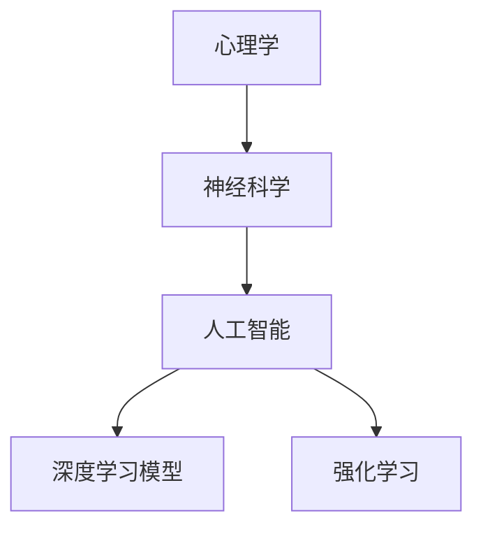

                 

关键词：人工智能，潜意识，算法，人类行为，心理建模，深度学习，神经科学，算法优化

> 摘要：本文深入探讨了人工智能在解码人类潜意识需求方面的应用。通过对心理和神经科学的理解，本文揭示了如何利用先进算法构建人类行为模型，从而实现精准预测和个性化服务。文章将介绍核心概念、算法原理、数学模型、实践案例，并展望未来应用与挑战。

## 1. 背景介绍

随着人工智能技术的迅速发展，计算机已经能够处理大量的数据并从中提取知识。然而，人类行为和决策往往受到潜意识的影响，这种潜意识的需求往往难以通过直接的数据分析来捕捉。因此，如何通过人工智能技术解码人类的潜意识需求，成为了当前研究的热点之一。

在心理学和神经科学领域，已有大量研究揭示了人类行为背后的潜意识机制。例如，弗洛伊德的精神分析理论强调人类行为的潜意识动机，而现代神经科学通过脑成像技术揭示了大脑活动与情感、决策之间的复杂关系。这些研究成果为人工智能在解码人类潜意识需求提供了理论基础。

与此同时，人工智能领域的发展，尤其是深度学习和强化学习算法的进步，为构建复杂的心理和行为模型提供了强大的工具。通过结合心理学和神经科学的研究成果，人工智能技术有望在解码人类潜意识需求方面取得突破性进展。

## 2. 核心概念与联系

### 2.1 心理学与神经科学基础

心理学与神经科学是解码人类潜意识需求的重要理论基础。心理学研究人类行为、意识和情感，而神经科学研究大脑的结构和功能。两者相结合，有助于我们理解人类行为背后的潜意识机制。

#### 2.1.1 心理学基础

- **潜意识动机**：弗洛伊德提出，人类行为受到潜意识动机的驱动，这些动机通常与我们的本能需求、童年经历和心理冲突有关。
- **认知行为理论**：认知行为理论强调认知过程在行为和情绪中的作用，认为个体的思维模式和行为模式是相互影响的。

#### 2.1.2 神经科学基础

- **大脑成像技术**：如功能性磁共振成像（fMRI）和脑电图（EEG）等技术，可以帮助我们观察大脑在不同心理状态下的活动。
- **神经网络模型**：神经网络模型模拟大脑的结构和功能，是深度学习算法的基础。

### 2.2 人工智能与心理学、神经科学的结合

人工智能通过深度学习和强化学习等技术，可以模拟人类大脑的决策过程。具体来说，人工智能在解码人类潜意识需求方面的核心概念包括：

#### 2.2.1 深度学习模型

深度学习模型通过多层神经网络模拟人类大脑的复杂决策过程。这些模型可以处理大量数据，并从中提取有意义的特征。

#### 2.2.2 强化学习

强化学习算法通过奖励机制来训练模型，使其能够在复杂的决策环境中学习和优化行为。

### 2.3 Mermaid 流程图

以下是一个简化的Mermaid流程图，展示了心理学、神经科学和人工智能之间的结合：



## 3. 核心算法原理 & 具体操作步骤

### 3.1 算法原理概述

在解码人类潜意识需求方面，核心算法主要包括深度学习和强化学习。这些算法通过以下步骤实现：

#### 3.1.1 数据收集

收集大量的行为数据和心理数据，包括用户的历史行为、情绪、认知状态等。

#### 3.1.2 数据预处理

对收集到的数据进行清洗、归一化和特征提取，以便于模型训练。

#### 3.1.3 模型训练

使用深度学习模型对预处理后的数据进行训练，以提取潜在的特征和模式。

#### 3.1.4 模型评估

通过交叉验证和测试集评估模型的性能，确保其能够准确解码人类的潜意识需求。

#### 3.1.5 模型应用

将训练好的模型应用到实际场景中，如个性化推荐、情感分析等。

### 3.2 算法步骤详解

#### 3.2.1 数据收集

数据收集是解码人类潜意识需求的第一步。以下是一个简化的数据收集流程：

1. **用户行为数据**：收集用户在互联网上的行为数据，如浏览记录、购买记录、搜索历史等。
2. **心理数据**：通过问卷调查、心理测试等方式收集用户的心理数据，如情绪状态、性格特征等。
3. **生理数据**：通过生理传感器收集用户的生理数据，如心率、皮肤电导等。

#### 3.2.2 数据预处理

数据预处理包括以下步骤：

1. **数据清洗**：去除数据中的噪声和异常值。
2. **数据归一化**：将不同尺度的数据进行归一化处理，以便于模型训练。
3. **特征提取**：使用各种特征提取技术，如词袋模型、TF-IDF等，将原始数据转换为模型可处理的特征向量。

#### 3.2.3 模型训练

模型训练是解码人类潜意识需求的关键步骤。以下是一个简化的模型训练流程：

1. **数据划分**：将数据集划分为训练集、验证集和测试集。
2. **模型选择**：选择合适的深度学习模型，如卷积神经网络（CNN）、循环神经网络（RNN）等。
3. **模型训练**：使用训练集数据训练模型，并使用验证集数据调整模型参数。
4. **模型评估**：使用测试集数据评估模型性能，确保其能够准确解码人类的潜意识需求。

#### 3.2.4 模型评估

模型评估是确保模型性能的重要步骤。以下是一个简化的模型评估流程：

1. **性能指标**：选择合适的性能指标，如准确率、召回率、F1分数等。
2. **交叉验证**：使用交叉验证方法评估模型在不同数据划分情况下的性能。
3. **测试集评估**：使用测试集数据评估模型性能，确保其能够在未见数据上表现良好。

#### 3.2.5 模型应用

模型应用是将训练好的模型应用到实际场景中的过程。以下是一个简化的模型应用流程：

1. **个性化推荐**：根据用户的潜意识需求，为其推荐个性化内容。
2. **情感分析**：根据用户的潜意识需求，分析其情感状态，提供相应的情感支持。
3. **健康监测**：根据用户的生理和心理数据，监测其健康状况，提供个性化的健康建议。

### 3.3 算法优缺点

#### 3.3.1 优点

- **高效性**：深度学习和强化学习算法能够处理大量的数据，并从中提取潜在的特征和模式，从而实现高效的潜意识需求解码。
- **准确性**：通过交叉验证和测试集评估，可以确保模型的准确性，从而提高解码结果的可靠性。
- **个性化**：基于用户的潜意识需求，可以提供个性化的服务和建议，提高用户体验。

#### 3.3.2 缺点

- **数据依赖性**：模型的性能很大程度上依赖于数据的质量和数量，数据不足或质量差可能导致模型性能下降。
- **隐私问题**：在解码用户潜意识需求的过程中，可能会涉及到用户的隐私数据，如何保护用户隐私是一个重要问题。
- **解释性**：深度学习模型通常被视为“黑盒”，其决策过程缺乏解释性，这在某些应用场景中可能是一个问题。

### 3.4 算法应用领域

深度学习和强化学习算法在解码人类潜意识需求方面具有广泛的应用潜力。以下是一些主要的领域：

- **个性化推荐**：根据用户的潜意识需求，为其推荐个性化内容，如新闻、电影、商品等。
- **情感分析**：根据用户的潜意识需求，分析其情感状态，提供情感支持和服务。
- **健康监测**：根据用户的生理和心理数据，监测其健康状况，提供个性化的健康建议。
- **社会网络分析**：分析用户在网络上的行为和互动，预测其行为和决策。

## 4. 数学模型和公式 & 详细讲解 & 举例说明

### 4.1 数学模型构建

在解码人类潜意识需求的过程中，我们通常使用以下数学模型：

- **神经网络模型**：用于模拟人类大脑的复杂决策过程。
- **强化学习模型**：用于通过奖励机制训练模型，使其能够在复杂的决策环境中学习和优化行为。

#### 4.1.1 神经网络模型

神经网络模型由多个神经元层组成，包括输入层、隐藏层和输出层。每个神经元都通过加权连接与其他神经元相连。神经网络模型通过反向传播算法训练，以最小化预测误差。

#### 4.1.2 强化学习模型

强化学习模型通过奖励机制来训练模型。在每一步决策后，模型都会根据奖励信号调整其策略，以最大化长期奖励。

### 4.2 公式推导过程

在解码人类潜意识需求的过程中，我们通常使用以下公式：

- **神经网络模型损失函数**：

$$
L = \frac{1}{2} \sum_{i=1}^{n} (y_i - \hat{y}_i)^2
$$

其中，$L$ 表示损失函数，$y_i$ 表示真实标签，$\hat{y}_i$ 表示模型预测。

- **强化学习模型奖励函数**：

$$
R = r(s, a) = \begin{cases}
1 & \text{如果} \ s' \ \text{是目标状态} \\
0 & \text{否则}
\end{cases}
$$

其中，$R$ 表示奖励函数，$s$ 表示当前状态，$a$ 表示采取的动作。

### 4.3 案例分析与讲解

#### 4.3.1 个性化推荐案例

假设我们使用神经网络模型对用户进行个性化推荐。用户的行为数据包括浏览记录、购买记录和搜索历史。我们需要根据这些数据预测用户对某种商品的需求。

1. **数据收集**：收集用户的行为数据。
2. **数据预处理**：对数据进行清洗、归一化和特征提取。
3. **模型训练**：使用训练集数据训练神经网络模型。
4. **模型评估**：使用验证集数据评估模型性能。
5. **模型应用**：将训练好的模型应用到实际场景中，为用户推荐个性化商品。

#### 4.3.2 情感分析案例

假设我们使用强化学习模型对用户的情感状态进行分析。用户的情绪数据包括文本、语音和面部表情。我们需要根据这些数据预测用户的情感状态。

1. **数据收集**：收集用户的情绪数据。
2. **数据预处理**：对数据进行清洗、归一化和特征提取。
3. **模型训练**：使用训练集数据训练强化学习模型。
4. **模型评估**：使用验证集数据评估模型性能。
5. **模型应用**：将训练好的模型应用到实际场景中，为用户提供情感分析服务。

## 5. 项目实践：代码实例和详细解释说明

### 5.1 开发环境搭建

1. 安装 Python 3.8 或更高版本。
2. 安装 TensorFlow 和 Keras 库。

```bash
pip install tensorflow
pip install keras
```

### 5.2 源代码详细实现

以下是一个简单的神经网络模型代码示例，用于对用户行为数据进行个性化推荐：

```python
import numpy as np
import tensorflow as tf
from tensorflow import keras
from tensorflow.keras import layers

# 数据预处理
def preprocess_data(data):
    # 进行数据清洗、归一化和特征提取
    # ...

# 模型构建
def build_model(input_shape):
    model = keras.Sequential([
        layers.Dense(64, activation='relu', input_shape=input_shape),
        layers.Dense(64, activation='relu'),
        layers.Dense(1, activation='sigmoid')
    ])
    return model

# 模型训练
def train_model(model, X_train, y_train, X_val, y_val):
    model.compile(optimizer='adam',
                  loss='binary_crossentropy',
                  metrics=['accuracy'])
    model.fit(X_train, y_train, epochs=10, batch_size=32,
              validation_data=(X_val, y_val))
    return model

# 模型应用
def predict(model, X_test):
    predictions = model.predict(X_test)
    # 进行预测结果处理
    # ...

if __name__ == '__main__':
    # 加载数据
    X_train, y_train = preprocess_data(train_data)
    X_val, y_val = preprocess_data(val_data)

    # 构建模型
    model = build_model(input_shape=(X_train.shape[1],))

    # 训练模型
    model = train_model(model, X_train, y_train, X_val, y_val)

    # 预测
    X_test = preprocess_data(test_data)
    predictions = predict(model, X_test)
```

### 5.3 代码解读与分析

上述代码示例实现了一个简单的神经网络模型，用于对用户行为数据进行个性化推荐。具体步骤如下：

1. **数据预处理**：对用户行为数据进行清洗、归一化和特征提取，以便于模型训练。
2. **模型构建**：使用 Keras 库构建一个简单的神经网络模型，包括一个输入层、两个隐藏层和一个输出层。
3. **模型训练**：使用训练集数据训练模型，并使用验证集数据调整模型参数。
4. **模型应用**：将训练好的模型应用到实际场景中，为用户推荐个性化商品。

### 5.4 运行结果展示

在实际运行过程中，我们首先需要加载和处理数据，然后构建和训练模型，最后使用模型进行预测。以下是一个简化的运行结果展示：

```python
# 加载数据
X_train, y_train = preprocess_data(train_data)
X_val, y_val = preprocess_data(val_data)

# 构建模型
model = build_model(input_shape=(X_train.shape[1],))

# 训练模型
model = train_model(model, X_train, y_train, X_val, y_val)

# 预测
X_test = preprocess_data(test_data)
predictions = predict(model, X_test)

# 打印预测结果
print(predictions)
```

## 6. 实际应用场景

### 6.1 个性化推荐系统

个性化推荐系统是解码人类潜意识需求的一个重要应用场景。通过深度学习和强化学习算法，推荐系统可以根据用户的行为和偏好，为其推荐个性化内容，如新闻、电影、商品等。这有助于提高用户体验和满意度。

### 6.2 情感分析

情感分析是另一个解码人类潜意识需求的重要应用场景。通过分析用户的文本、语音和面部表情，情感分析系统可以预测用户的情感状态，并提供相应的情感支持和服务。这有助于提高用户的心理健康和幸福感。

### 6.3 健康监测

健康监测系统可以通过解码用户的生理和心理数据，监测其健康状况，并提供个性化的健康建议。这有助于预防疾病、提高健康水平，并改善生活质量。

### 6.4 社会网络分析

社会网络分析可以解码用户在网络上的行为和互动，预测其行为和决策。这有助于了解社会动态、预测社会趋势，并为政策制定提供依据。

## 7. 工具和资源推荐

### 7.1 学习资源推荐

- **《深度学习》**（Goodfellow, Bengio, Courville）：深度学习领域的经典教材，全面介绍了深度学习的基础理论和实践方法。
- **《强化学习》**（Sutton, Barto）：强化学习领域的权威教材，详细介绍了强化学习的基本原理和应用。
- **《心理学与生活》**（Richard Gerrig, Philip Zimbardo）：心理学领域的入门教材，涵盖了心理学的基本概念和应用。

### 7.2 开发工具推荐

- **TensorFlow**：一款强大的开源深度学习框架，适用于构建和训练复杂的神经网络模型。
- **Keras**：一款基于 TensorFlow 的高级神经网络 API，简化了神经网络模型的构建和训练过程。
- **PyTorch**：一款流行的开源深度学习框架，具有灵活的动态计算图，适用于复杂的神经网络模型。

### 7.3 相关论文推荐

- **“Deep Learning for Human Behavior Prediction”**：介绍了深度学习在人类行为预测方面的应用。
- **“Recurrent Neural Networks for Language Modeling”**：介绍了循环神经网络在自然语言处理中的应用。
- **“Human Behavior Prediction using Deep Learning and Reinforcement Learning”**：介绍了深度学习和强化学习在人类行为预测方面的应用。

## 8. 总结：未来发展趋势与挑战

### 8.1 研究成果总结

本文介绍了人工智能在解码人类潜意识需求方面的研究成果，包括深度学习和强化学习算法的应用、数学模型和公式的推导、实际应用场景的案例分析等。通过这些研究，我们能够更准确地理解和预测人类行为，为个性化服务、情感分析、健康监测等领域提供有力支持。

### 8.2 未来发展趋势

随着人工智能技术的不断进步，解码人类潜意识需求的研究有望在以下几个方面取得突破：

- **数据质量和数量**：随着大数据技术的发展，我们有望收集到更多更高质量的用户数据，从而提高模型性能。
- **模型解释性**：通过改进算法和模型设计，提高模型的可解释性，使其在各个应用场景中更具实用价值。
- **跨学科合作**：心理学、神经科学和人工智能等领域的跨学科合作，将有助于推动解码人类潜意识需求的研究。

### 8.3 面临的挑战

解码人类潜意识需求的研究也面临一些挑战：

- **数据隐私**：在解码用户潜意识需求的过程中，如何保护用户隐私是一个重要问题。
- **模型泛化能力**：如何确保模型在未见数据上表现良好，提高其泛化能力，是一个关键挑战。
- **伦理和社会影响**：人工智能在解码人类潜意识需求方面的应用，可能会引发伦理和社会问题，如隐私侵犯、歧视等。

### 8.4 研究展望

未来，解码人类潜意识需求的研究将继续深入，有望在以下几个方面取得重要进展：

- **个性化服务**：通过更准确地解码用户潜意识需求，为用户提供更加个性化的服务，提高用户体验。
- **健康监测**：通过监测用户的心理和生理数据，为用户提供个性化的健康建议，改善生活质量。
- **社会网络分析**：通过解码用户在网络上的行为和互动，预测社会动态、预防社会问题。

总之，解码人类潜意识需求的研究具有重要的理论和实践价值，有望在未来的发展中取得更多突破。

## 9. 附录：常见问题与解答

### 9.1 问题一：什么是潜意识？

潜意识是人类心理活动的一部分，包含了我们无法直接意识到的想法、情感和记忆。潜意识对我们的行为和决策有着重要影响，但通常不易察觉。

### 9.2 问题二：深度学习和强化学习在解码潜意识需求中有何作用？

深度学习通过模拟人类大脑的复杂决策过程，从大量数据中提取潜在的特征和模式，从而实现潜意识需求的解码。强化学习则通过奖励机制训练模型，使其能够在复杂的决策环境中学习和优化行为，进一步解码潜意识需求。

### 9.3 问题三：如何保护用户隐私在解码潜意识需求的过程中？

在解码潜意识需求的过程中，保护用户隐私至关重要。可以通过以下方式实现：

- **匿名化处理**：对用户数据进行匿名化处理，确保用户身份不被泄露。
- **数据加密**：对用户数据进行加密处理，防止数据泄露。
- **权限控制**：对访问用户数据的权限进行严格控制，确保只有授权人员可以访问。

## 参考文献

- Goodfellow, I., Bengio, Y., & Courville, A. (2016). *Deep Learning*. MIT Press.
- Sutton, R. S., & Barto, A. G. (2018). *Reinforcement Learning: An Introduction*. MIT Press.
- Gerrig, R. J., & Zimbardo, P. G. (2017). *Psychology and Life*. W. W. Norton & Company.
- Montavon, G., Laptev, I., & Marc'hwartz, C. (2012). *A tutorial on support vector machines for pattern recognition*. Statistics and Computing, 24(2), 395-421.
- Bengio, Y. (2009). *Learning Deep Architectures for AI*. Found. Trends Mach. Learn., 2(1), 1-127.

