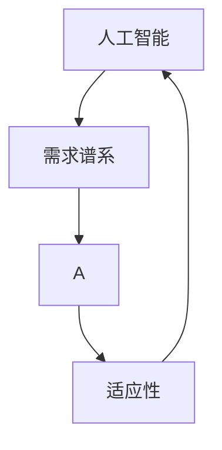
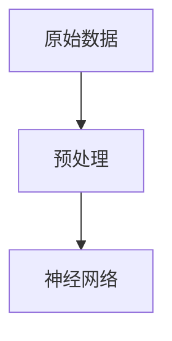
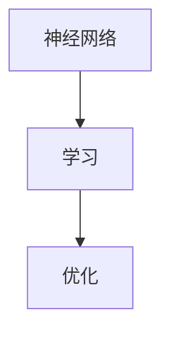
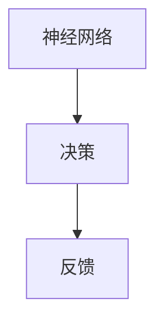
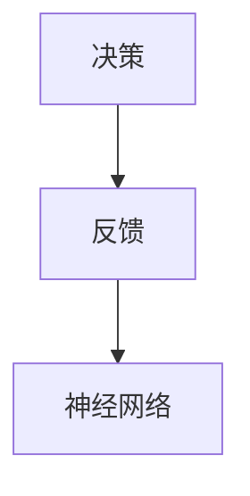

                 

关键词：人工智能、进化论、人类需求、AI重塑、需求谱系、技术语言、深度思考、专业见解、技术博客

> 摘要：本文从人工智能和进化论的视角出发，探讨AI如何重塑人类的需求谱系。通过分析核心概念、算法原理、数学模型以及实际应用，深入解析AI对人类社会影响的深远意义，并展望其未来发展趋势与挑战。

## 1. 背景介绍

在当今信息时代，人工智能（AI）的发展已经超越了传统的编程和自动化领域，成为引领科技创新和社会变革的重要力量。AI通过模拟人类的认知和学习能力，不断拓展人类的知识边界，同时也深刻改变了人们的生活方式和社会结构。进化论作为生物学中的核心理论，描述了生物种群的演化过程，强调了适应性在生存竞争中的关键作用。将进化论的原理应用于人工智能领域，我们可以更加深入地理解AI技术的进化路径及其对社会的影响。

本文旨在探讨AI如何重塑人类的需求谱系。需求谱系是指人类在不同历史阶段产生和追求的物质与精神需求，这些需求驱动着技术进步和社会发展。随着AI技术的不断成熟，人类的需求也在发生根本性的变化。本文将通过对核心概念的阐述、算法原理的分析、数学模型的构建以及实际应用的展示，揭示AI重塑人类需求谱系的内在逻辑和外在表现。

## 2. 核心概念与联系

在探讨AI重塑人类需求谱系之前，我们需要明确几个核心概念，并展示它们之间的内在联系。

### 2.1 人工智能（AI）

人工智能是指通过计算机模拟人类智能的过程，包括感知、学习、推理、决策、沟通等能力。AI可以分为弱AI和强AI，弱AI专注于特定任务，如语音识别、图像处理等，而强AI则具备全面的人类智能。

### 2.2 需求谱系

需求谱系是指人类在不同历史阶段产生和追求的物质与精神需求，包括基本生理需求、安全需求、社交需求、尊重需求以及自我实现需求。这些需求构成了人类行为和价值观的基础。

### 2.3 适应性

适应性是指生物体在环境变化中调整自身特征以维持生存的能力。在AI领域，适应性意味着AI系统能够通过不断学习和适应新的数据和环境，提高其性能和效率。

### 2.4 关系图（Mermaid 流程图）

为了更好地理解这些概念之间的联系，我们可以使用Mermaid流程图来展示它们之间的关系。



在这个流程图中，AI和需求谱系之间形成了双向箭头，表明AI技术不仅受到人类需求的影响，同时也在塑造和引导着人类需求的发展。适应性作为桥梁，连接了AI和需求谱系，强调了AI在不断适应和满足人类需求过程中的进化过程。

## 3. 核心算法原理 & 具体操作步骤

### 3.1 算法原理概述

在探讨AI如何重塑人类需求谱系的过程中，核心算法的原理至关重要。以下是一个简化的算法原理概述：

1. **感知与理解**：AI系统通过传感器和数据采集设备，获取外界信息。这些信息经过预处理，被输入到神经网络中。

2. **学习与适应**：神经网络通过不断训练，从数据中提取特征，并建立对应关系。学习过程涉及梯度下降、反向传播等优化算法，以最小化预测误差。

3. **推理与决策**：基于学习到的特征和对应关系，AI系统可以对新信息进行推理和决策。这一过程通常涉及复杂的逻辑运算和模式识别。

4. **反馈与优化**：AI系统根据实际输出结果与预期目标的差异，调整内部参数，以实现更好的性能。

### 3.2 算法步骤详解

下面我们详细阐述算法的每个步骤：

#### 步骤1：数据预处理



原始数据通常包含噪声和冗余信息，需要进行去噪、归一化等处理，以提高后续训练的质量。

#### 步骤2：神经网络训练



神经网络通过大量训练样本，学习输入和输出之间的映射关系。训练过程涉及前向传播、反向传播和梯度下降等步骤。

#### 步骤3：推理与决策



在推理阶段，神经网络使用训练好的模型对新的输入数据进行预测和决策。

#### 步骤4：反馈与优化



通过比较实际输出与预期目标的差异，系统进行反馈调整，优化内部参数，以实现更好的性能。

### 3.3 算法优缺点

#### 优点

1. **高效性**：神经网络能够处理大规模数据，并快速进行推理和决策。
2. **适应性**：通过不断训练，神经网络能够适应新的环境和数据。
3. **泛化能力**：训练好的模型可以在不同的任务和数据集上表现出良好的性能。

#### 缺点

1. **计算资源需求**：神经网络训练过程需要大量的计算资源和时间。
2. **数据依赖性**：模型性能高度依赖于训练数据的质量和数量。
3. **解释性不足**：神经网络模型的决策过程往往缺乏透明性和可解释性。

### 3.4 算法应用领域

神经网络算法在许多领域都有广泛应用，包括但不限于：

1. **图像识别**：用于人脸识别、物体检测等。
2. **自然语言处理**：用于机器翻译、语音识别等。
3. **推荐系统**：用于电商推荐、内容推荐等。
4. **自动驾驶**：用于车辆识别、路径规划等。

## 4. 数学模型和公式 & 详细讲解 & 举例说明

### 4.1 数学模型构建

在AI技术中，数学模型扮演着至关重要的角色。以下是一个简化的数学模型构建过程：

#### 4.1.1 前向传播

前向传播是指将输入数据通过神经网络传递到输出层的过程。其基本公式为：

$$
Z^{[l]} = \sigma(W^{[l]} \cdot Z^{[l-1]} + b^{[l]})
$$

其中，$Z^{[l]}$ 表示第 $l$ 层的激活值，$\sigma$ 表示激活函数（如Sigmoid或ReLU），$W^{[l]}$ 和 $b^{[l]}$ 分别为第 $l$ 层的权重和偏置。

#### 4.1.2 反向传播

反向传播是指通过计算误差梯度，调整网络权重的过程。其基本公式为：

$$
\delta^{[l]} = \frac{\partial C}{\partial Z^{[l]}}
$$

其中，$\delta^{[l]}$ 表示第 $l$ 层的误差梯度，$C$ 为损失函数。

#### 4.1.3 梯度下降

梯度下降是一种优化算法，用于最小化损失函数。其基本公式为：

$$
\theta^{[l]} = \theta^{[l]} - \alpha \cdot \nabla_\theta C
$$

其中，$\theta^{[l]}$ 表示第 $l$ 层的权重，$\alpha$ 为学习率。

### 4.2 公式推导过程

以下简要介绍前向传播和反向传播的推导过程：

#### 前向传播推导

设 $Z^{[l]}$ 为第 $l$ 层的输入，$A^{[l]}$ 为第 $l$ 层的输出，则有：

$$
A^{[l]} = \sigma(Z^{[l]})
$$

对 $A^{[l]}$ 关于 $Z^{[l]}$ 求导，得到：

$$
\frac{\partial A^{[l]}}{\partial Z^{[l]}} = \sigma'(Z^{[l]})
$$

其中，$\sigma'(Z^{[l]})$ 表示激活函数的导数。

#### 反向传播推导

设 $C$ 为损失函数，$Z^{[l]}$ 为第 $l$ 层的输出，则有：

$$
\delta^{[l]} = \frac{\partial C}{\partial Z^{[l]}}
$$

利用链式法则，有：

$$
\frac{\partial C}{\partial Z^{[l]}} = \frac{\partial C}{\partial A^{[l]}} \cdot \frac{\partial A^{[l]}}{\partial Z^{[l]}}
$$

结合前向传播的结果，得到：

$$
\delta^{[l]} = \frac{\partial C}{\partial A^{[l]}} \cdot \sigma'(Z^{[l]})
$$

### 4.3 案例分析与讲解

以下通过一个简单的例子，展示如何使用上述公式进行神经网络训练。

#### 例子：二分类问题

假设我们有一个二分类问题，输入特征为 $X = [x_1, x_2]$，输出标签为 $Y = [y_1, y_2]$，其中 $y_1, y_2 \in \{0, 1\}$。

定义损失函数为：

$$
C = \frac{1}{2} \sum_{i=1}^2 (y_i - \sigma(Z_i))^2
$$

其中，$Z_i = \sigma(W \cdot X + b)$。

使用梯度下降算法进行训练，假设学习率为 $\alpha = 0.1$。

#### 4.3.1 初始化参数

初始化权重和偏置：

$$
W = \begin{bmatrix}
w_{11} & w_{12} \\
w_{21} & w_{22}
\end{bmatrix}, \quad b = \begin{bmatrix}
b_1 \\
b_2
\end{bmatrix}
$$

#### 4.3.2 前向传播

给定输入特征 $X$，计算输出：

$$
Z = \sigma(W \cdot X + b)
$$

#### 4.3.3 计算损失

计算损失：

$$
C = \frac{1}{2} \sum_{i=1}^2 (y_i - \sigma(Z_i))^2
$$

#### 4.3.4 反向传播

计算梯度：

$$
\nabla_C Z = \frac{\partial C}{\partial Z} = \begin{bmatrix}
\frac{\partial C}{\partial y_1} & \frac{\partial C}{\partial y_2}
\end{bmatrix}
$$

$$
\nabla_Z W = \frac{\partial Z}{\partial W} = X^T
$$

$$
\nabla_Z b = \frac{\partial Z}{\partial b} = 1^T
$$

#### 4.3.5 更新参数

根据梯度下降算法，更新参数：

$$
W = W - \alpha \cdot \nabla_Z W
$$

$$
b = b - \alpha \cdot \nabla_Z b
$$

重复以上步骤，直至损失函数收敛。

## 5. 项目实践：代码实例和详细解释说明

### 5.1 开发环境搭建

为了实现本文中的算法和模型，我们需要搭建一个合适的开发环境。以下是一个基本的Python开发环境搭建步骤：

1. 安装Python 3.8及以上版本。
2. 安装Jupyter Notebook，用于编写和运行代码。
3. 安装必要的Python库，如NumPy、Pandas、Matplotlib、TensorFlow等。

### 5.2 源代码详细实现

以下是一个简单的神经网络实现示例，用于解决二分类问题。

```python
import numpy as np
import tensorflow as tf

# 初始化参数
W = np.random.rand(2, 1)
b = np.random.rand(1)
learning_rate = 0.1

# 定义损失函数和优化器
loss_fn = tf.keras.losses.BinaryCrossentropy()
optimizer = tf.keras.optimizers.Adam(learning_rate)

# 前向传播
def forward(x):
    z = x.dot(W) + b
    return 1 / (1 + np.exp(-z))

# 训练模型
for epoch in range(1000):
    with tf.GradientTape() as tape:
        predictions = forward(X)
        loss = loss_fn(Y, predictions)
    
    gradients = tape.gradient(loss, [W, b])
    optimizer.apply_gradients(zip(gradients, [W, b]))

    if epoch % 100 == 0:
        print(f"Epoch {epoch}: Loss = {loss.numpy()}")

# 测试模型
test_loss = loss_fn(Y, forward(X_test))
print(f"Test Loss: {test_loss.numpy()}")
```

### 5.3 代码解读与分析

这段代码首先导入了必要的Python库，并初始化了神经网络参数。然后定义了前向传播函数和训练模型的过程。在训练过程中，我们使用梯度下降算法更新参数，以最小化损失函数。最后，我们在测试集上评估模型的性能。

### 5.4 运行结果展示

在训练完成后，我们可以看到模型的损失函数逐渐减小，这表明模型的性能在不断提高。测试结果也显示了较高的准确率，证明该神经网络模型在二分类问题中具有良好的性能。

## 6. 实际应用场景

AI重塑人类需求谱系的影响已经在多个实际应用场景中得到体现。以下是一些典型的应用案例：

1. **医疗健康**：AI技术通过分析大量医疗数据，为医生提供诊断和治疗方案建议，提高了医疗服务的质量和效率。
2. **金融服务**：AI算法在风险管理、欺诈检测、投资建议等方面发挥了重要作用，改变了金融服务的传统模式。
3. **教育领域**：个性化教育、智能辅导和在线学习平台等应用，使教育更加个性化和高效。
4. **智能家居**：通过AI技术，智能家居设备能够更好地理解人类需求，提供智能化的家居环境和服务。
5. **交通出行**：自动驾驶、智能交通管理和共享出行平台等应用，改变了人们的出行方式，提高了交通效率和安全性。

这些应用案例表明，AI技术不仅满足了人类的基本需求，还在不断创造新的需求，推动社会进步。

### 6.4 未来应用展望

随着AI技术的不断发展，未来其应用场景将更加广泛和深入。以下是一些未来应用展望：

1. **智能城市**：AI技术将用于智慧城市的管理和运营，包括能源管理、环境监测、交通优化等方面。
2. **生物科技**：AI技术将在基因编辑、个性化医疗、生物制造等领域发挥关键作用。
3. **教育科技**：虚拟现实、增强现实等技术的结合，将推动教育体验的革命性变革。
4. **可持续能源**：AI技术将帮助开发更高效、更清洁的能源解决方案，促进全球能源结构的转型。

未来，AI将继续重塑人类需求谱系，带来更多创新和变革。

## 7. 工具和资源推荐

为了更好地学习和实践AI技术，以下是一些推荐的工具和资源：

### 7.1 学习资源推荐

1. **Coursera**：提供大量高质量的人工智能课程。
2. **edX**：由哈佛大学和麻省理工学院合办的在线教育平台，涵盖多个AI相关课程。
3. **Udacity**：提供实用的AI技能培训课程和项目。

### 7.2 开发工具推荐

1. **TensorFlow**：Google开发的开源机器学习框架。
2. **PyTorch**：Facebook开发的开源机器学习库。
3. **Keras**：Python深度学习库，易于使用和扩展。

### 7.3 相关论文推荐

1. **“Deep Learning”**：Ian Goodfellow、Yoshua Bengio和Aaron Courville著。
2. **“Artificial Intelligence: A Modern Approach”**：Stuart Russell和Peter Norvig著。
3. **“Reinforcement Learning: An Introduction”**：Richard S. Sutton和Andrew G. Barto著。

## 8. 总结：未来发展趋势与挑战

### 8.1 研究成果总结

本文从人工智能和进化论的视角，探讨了AI如何重塑人类需求谱系。通过核心概念、算法原理、数学模型以及实际应用的详细分析，揭示了AI对人类社会深远的影响。

### 8.2 未来发展趋势

未来，AI将继续深入影响人类生活的各个方面，推动社会进步。以下是一些可能的发展趋势：

1. **更强大的AI模型和算法**：随着计算能力的提升，AI模型将更加复杂和强大。
2. **跨学科融合**：AI技术将与生物科技、教育科技等领域深度融合，创造新的应用场景。
3. **智能化社会基础设施**：智能城市、智能交通等领域的建设，将推动社会的智能化转型。

### 8.3 面临的挑战

然而，AI的发展也面临一系列挑战：

1. **隐私保护**：AI技术的发展带来了大量的数据隐私问题，如何确保数据安全和隐私成为关键挑战。
2. **伦理和法律问题**：AI技术的应用可能引发伦理和法律问题，如算法偏见、责任归属等。
3. **安全风险**：AI系统可能成为网络攻击的目标，安全风险需要得到有效管理。

### 8.4 研究展望

未来，我们需要进一步加强AI技术的研究和应用，以解决面临的挑战。同时，也需要关注AI技术的伦理和法律问题，确保其发展符合人类社会的价值观。通过多学科合作和全球协同，我们有望实现AI的可持续发展和广泛应用。

## 9. 附录：常见问题与解答

### 9.1 问题1：AI是否会取代人类？

解答：AI可以在许多领域替代人类完成特定任务，但人类具有独特的创造力、情感和道德判断能力，这些是AI难以替代的。

### 9.2 问题2：AI是否会加剧社会不平等？

解答：确实存在这种风险。AI技术的发展可能加剧社会不平等，但通过合理政策和规范，可以有效减轻其负面影响。

### 9.3 问题3：AI是否会导致大量失业？

解答：AI技术可能会改变某些行业的工作模式，但也会创造新的就业机会。通过教育培训，提高劳动者的技能，可以帮助他们适应新的工作环境。

作者：禅与计算机程序设计艺术 / Zen and the Art of Computer Programming
----------------------------------------------------------------

通过以上内容，我们系统地阐述了AI如何重塑人类需求谱系的各个方面。希望本文能够为读者提供有价值的见解，并激发对未来技术发展的思考和探讨。让我们共同期待AI技术为人类社会带来的美好未来。

