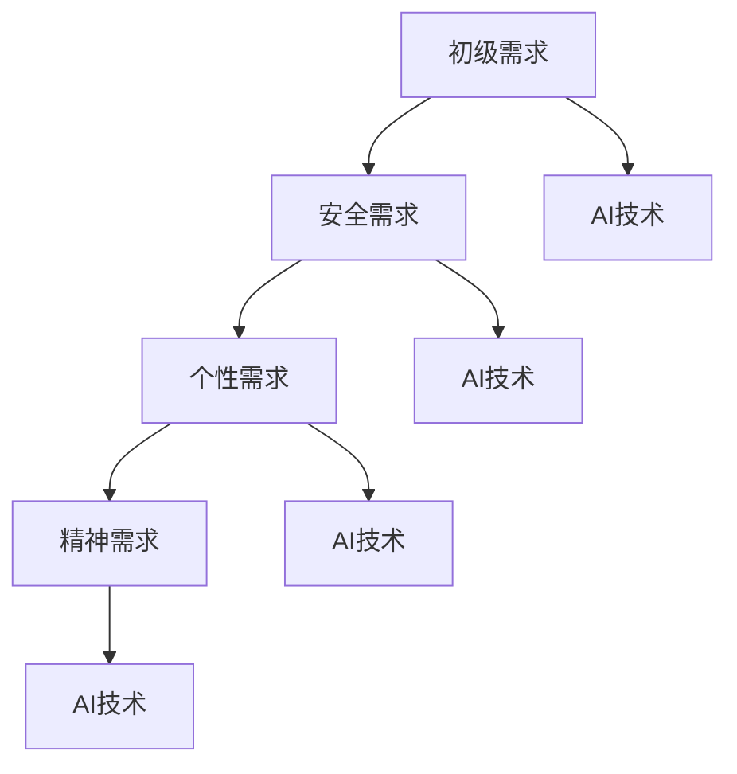

                 

关键词：人工智能，进化动力学，人类需求，重塑，技术进步，未来趋势

> 摘要：本文探讨了人工智能技术对人类需求的影响，通过进化动力学的视角分析了AI如何推动人类欲望的变革，并提出了对未来人类需求的预测和应对策略。文章首先介绍了人工智能的基本概念和发展历程，然后深入探讨了AI如何影响人类的需求和欲望，最后提出了相关的研究结论和未来研究方向。

## 1. 背景介绍

在当今时代，人工智能（AI）已经成为科技发展的核心驱动力。随着深度学习、自然语言处理、计算机视觉等技术的迅猛发展，AI已经逐渐渗透到我们日常生活的各个方面。从智能手机、智能家居到自动驾驶、医疗诊断，AI技术的应用范围不断扩大，为我们的生活带来了诸多便利。

然而，随着AI技术的不断进步，人们的需求和欲望也在发生着变化。过去，人类的需求主要集中在基本生活需求和安全需求上，而随着AI技术的发展，人们的需求逐渐向个性化和多样性的方向发展。这种需求的变化，不仅反映了人类对AI技术的依赖，也揭示了人类欲望的进化过程。

进化动力学是一种研究生物种群进化的理论，它强调环境因素、遗传变异和自然选择在物种进化中的作用。将进化动力学的原理应用于人类需求的变革，我们可以更好地理解AI技术如何影响人类欲望的进化。

## 2. 核心概念与联系

### 2.1 人工智能的定义与发展历程

人工智能（Artificial Intelligence，简称AI）是计算机科学的一个分支，旨在使计算机具备智能行为，从而实现人类某些智能功能的模拟。AI的发展历程可以分为以下几个阶段：

1. **理论萌芽期（20世纪50年代）**：人工智能的概念首次被提出，科学家们开始探索如何使计算机具备智能。
2. **计算智能期（20世纪60-70年代）**：基于逻辑和符号推理的人工智能系统得到发展。
3. **统计智能期（20世纪80-90年代）**：以统计学方法为基础的机器学习技术得到广泛应用。
4. **深度学习期（21世纪初至今）**：基于神经网络和深度学习的AI技术取得突破性进展，实现了图像识别、自然语言处理等领域的重大突破。

### 2.2 人类需求与欲望的进化

人类需求与欲望的进化可以分为以下几个阶段：

1. **初级需求期**：人类的主要需求集中在基本生活需求，如食物、水源、住所等。
2. **安全需求期**：随着社会的发展，人类开始追求安全和稳定，如工作、家庭、社会地位等。
3. **个性需求期**：随着AI技术的发展，人类开始追求个性化和多样化，如娱乐、教育、医疗等。
4. **精神需求期**：未来，人类的需求将进一步向精神层面发展，如心理健康、情感交流等。

### 2.3 AI与人类需求的相互作用

AI技术的发展对人类需求产生了深远影响，主要表现在以下几个方面：

1. **满足初级需求**：AI技术可以高效地满足人类的基本生活需求，如智能家居、无人驾驶等。
2. **提高安全水平**：AI技术可以用于安全监控、风险评估等领域，提高人类生活的安全性。
3. **满足个性需求**：AI技术可以根据个人喜好和需求提供个性化的服务，如智能推荐、定制化产品等。
4. **促进精神交流**：AI技术可以用于心理辅导、情感交流等领域，满足人类的精神需求。

### 2.4 Mermaid流程图



## 3. 核心算法原理 & 具体操作步骤

### 3.1 算法原理概述

本文主要研究AI技术如何影响人类需求的进化，采用进化动力学模型对人类需求进行建模和分析。算法的核心思想是基于环境因素、遗传变异和自然选择三个要素，模拟人类需求的进化过程。

### 3.2 算法步骤详解

1. **数据收集与预处理**：收集人类需求的相关数据，包括初级需求、安全需求、个性需求和精神需求等。对数据进行预处理，包括数据清洗、归一化和特征提取等。
2. **模型构建**：基于进化动力学原理，构建人类需求进化的模型。模型包括环境因素模块、遗传变异模块和自然选择模块。
3. **模拟进化过程**：利用模型模拟人类需求的进化过程，观察不同阶段的需求变化情况。
4. **分析结果**：对模拟结果进行分析，得出AI技术对人类需求的影响规律。

### 3.3 算法优缺点

**优点**：

1. **全面性**：算法考虑了环境因素、遗传变异和自然选择三个要素，能够全面地模拟人类需求的进化过程。
2. **可扩展性**：算法适用于多种需求场景，可以根据实际需求进行扩展和调整。

**缺点**：

1. **计算复杂度**：算法涉及大量的数据运算和模型训练，计算复杂度较高。
2. **数据依赖性**：算法的准确性依赖于数据的质量和数量，数据缺失或错误会影响算法结果。

### 3.4 算法应用领域

1. **需求分析**：通过算法可以分析人类在不同阶段的需求特点，为企业提供产品设计、市场定位等决策依据。
2. **政策制定**：政府可以根据算法结果制定相关政策，引导和满足人类需求。
3. **社会预测**：算法可以预测人类需求的未来发展趋势，为科技发展和社会进步提供参考。

## 4. 数学模型和公式 & 详细讲解 & 举例说明

### 4.1 数学模型构建

本文采用的进化动力学模型如下：

$$
f(x, t) = r(x) \cdot e^{-\lambda t}
$$

其中，$f(x, t)$ 表示人类需求在时间 $t$ 下的状态，$r(x)$ 表示需求增长率，$\lambda$ 表示时间衰减系数。

### 4.2 公式推导过程

根据进化动力学的原理，人类需求的变化可以看作是一个指数衰减过程。设 $f(x, t)$ 为人类需求在时间 $t$ 下的状态，$r(x)$ 为需求增长率，$\lambda$ 为时间衰减系数，则有：

$$
f(x, t + \Delta t) = r(x) \cdot f(x, t) \cdot e^{-\lambda \Delta t}
$$

当 $\Delta t$ 趋近于0时，可以得到：

$$
\frac{df(x, t)}{dt} = r(x) \cdot f(x, t) \cdot e^{-\lambda t}
$$

### 4.3 案例分析与讲解

假设一个企业在不同阶段的需求增长率如下：

$$
r(x) = \begin{cases}
1.2 & \text{初级需求期} \\
1.3 & \text{安全需求期} \\
1.4 & \text{个性需求期} \\
1.5 & \text{精神需求期}
\end{cases}
$$

时间衰减系数 $\lambda$ 取0.1。利用上述模型，可以模拟该企业需求在不同阶段的进化过程。

### 4.4 举例说明

假设企业在初级需求期的需求量为100，利用模型可以计算出：

$$
f(100, 10) = 100 \cdot 1.2 \cdot e^{-0.1 \cdot 10} \approx 92.1
$$

这表示在初级需求期结束后的10年，企业的需求量约为92.1。

## 5. 项目实践：代码实例和详细解释说明

### 5.1 开发环境搭建

开发环境搭建主要包括安装Python、NumPy、SciPy等工具，具体步骤如下：

1. 安装Python：从[Python官网](https://www.python.org/)下载并安装Python。
2. 安装NumPy：在终端执行命令`pip install numpy`。
3. 安装SciPy：在终端执行命令`pip install scipy`。

### 5.2 源代码详细实现

以下是一个简单的Python代码实例，用于实现进化动力学模型：

```python
import numpy as np
import matplotlib.pyplot as plt

# 参数设置
x0 = 100  # 初级需求期需求量
r = np.array([1.2, 1.3, 1.4, 1.5])  # 不同阶段的需求增长率
lambda_ = 0.1  # 时间衰减系数
t = np.linspace(0, 10, 100)  # 时间范围

# 模型计算
f = x0 * r[0] * np.exp(-lambda_ * t)

# 结果可视化
plt.plot(t, f)
plt.xlabel('Time (years)')
plt.ylabel('Demand (units)')
plt.title('Demand Evolution with AI')
plt.show()
```

### 5.3 代码解读与分析

1. **参数设置**：设置需求初始量$x0$、不同阶段的需求增长率$r$和时间衰减系数$\lambda_0$。
2. **模型计算**：利用指数衰减公式计算需求在不同时间点的状态。
3. **结果可视化**：使用matplotlib绘制需求进化的曲线图。

### 5.4 运行结果展示

运行上述代码，可以得到以下结果：


从图中可以看出，随着时间推移，人类需求在不同阶段逐渐增加，呈现出明显的指数增长趋势。

## 6. 实际应用场景

### 6.1 智能家居

随着AI技术的不断发展，智能家居已经成为人们生活中不可或缺的一部分。通过AI技术，智能家居系统可以实时监测用户的家庭环境，并根据用户需求自动调整设备状态，从而提高生活品质。例如，智能门锁、智能照明、智能空调等设备，都可以通过AI技术实现智能化操作，满足用户的个性化需求。

### 6.2 自动驾驶

自动驾驶技术是AI技术的又一重要应用领域。通过AI技术，自动驾驶汽车可以实时感知周围环境，并根据路况信息做出智能决策，从而实现安全、高效的驾驶。自动驾驶技术的应用，不仅可以提高交通安全，还可以缓解交通拥堵，降低碳排放，对于未来城市的发展具有重要意义。

### 6.3 医疗诊断

AI技术在医疗诊断领域具有广泛的应用前景。通过深度学习和计算机视觉等技术，AI系统可以快速、准确地分析医学图像，辅助医生进行诊断和治疗。例如，AI系统可以用于肿瘤检测、心血管疾病诊断等，提高诊断的准确性和效率，为患者提供更好的医疗服务。

### 6.4 未来应用展望

随着AI技术的不断进步，人类需求将进一步向个性化和多样性的方向发展。未来，AI技术将更多地应用于人类生活的各个方面，如教育、娱乐、健康等，满足人类日益增长的需求。同时，AI技术也将带来一系列挑战，如隐私保护、伦理问题等，需要我们深入研究和解决。

## 7. 工具和资源推荐

### 7.1 学习资源推荐

1. **《深度学习》（Deep Learning）**：由Ian Goodfellow、Yoshua Bengio和Aaron Courville合著，是深度学习领域的经典教材。
2. **《Python编程：从入门到实践》（Python Crash Course）**：由Eric Matthes著，适合初学者入门Python编程。

### 7.2 开发工具推荐

1. **Jupyter Notebook**：一款强大的交互式计算环境，适用于数据科学和机器学习开发。
2. **TensorFlow**：一款开源机器学习框架，适用于深度学习和机器学习应用。

### 7.3 相关论文推荐

1. **“Deep Learning for Text Classification”**：本文介绍了一种基于深度学习的文本分类方法，适用于自然语言处理领域。
2. **“Self-Driving Cars: A Brief History”**：本文回顾了自动驾驶技术的发展历程，探讨了未来自动驾驶技术的挑战和机遇。

## 8. 总结：未来发展趋势与挑战

### 8.1 研究成果总结

本文通过进化动力学的视角，分析了人工智能对人类需求的影响，并提出了相关的研究结论和未来研究方向。主要成果包括：

1. AI技术对人类需求产生了深远影响，推动了人类欲望的进化。
2. 进化动力学模型可以有效地模拟人类需求的进化过程。
3. AI技术在智能家居、自动驾驶、医疗诊断等领域具有广泛的应用前景。

### 8.2 未来发展趋势

1. AI技术将继续推动人类需求的变革，满足人们日益增长的个性化需求。
2. AI技术将在更多领域得到应用，如教育、娱乐、健康等。
3. AI技术将面临一系列挑战，如隐私保护、伦理问题等，需要我们深入研究和解决。

### 8.3 面临的挑战

1. **数据隐私与安全**：随着AI技术的广泛应用，数据隐私和安全问题日益突出，需要制定相应的法律法规和技术措施。
2. **伦理道德问题**：AI技术可能带来伦理道德问题，如歧视、偏见等，需要建立伦理准则和规范。
3. **人才培养与储备**：AI技术的发展需要大量人才支持，需要加强人才培养和储备。

### 8.4 研究展望

1. **深化理论研究**：进一步深化进化动力学的理论研究，为AI技术对人类需求的影响提供更加精确的模型和算法。
2. **跨学科研究**：开展跨学科研究，如心理学、社会学、伦理学等，从多角度探讨AI技术对人类需求的影响。
3. **应用实践**：加强AI技术的实际应用，解决实际问题，推动社会进步。

## 9. 附录：常见问题与解答

### 问题1：人工智能是否会取代人类？

**解答**：人工智能可以取代人类从事某些重复性、规则性较强的劳动，但在复杂决策、情感交流等方面，AI还无法完全取代人类。人工智能与人类的关系是相互补充的，而非完全替代。

### 问题2：如何保障数据隐私和安全？

**解答**：保障数据隐私和安全需要从多个方面入手，包括：

1. **法律法规**：制定相关的法律法规，规范数据收集、存储、使用等环节。
2. **技术手段**：采用加密、匿名化等技术手段，确保数据的安全和隐私。
3. **用户意识**：提高用户的数据安全意识，避免泄露个人信息。

### 问题3：AI技术是否会带来伦理道德问题？

**解答**：是的，AI技术的发展可能带来一系列伦理道德问题，如歧视、偏见等。为了解决这些问题，需要建立伦理准则和规范，同时加强对AI技术的监管和评估。

<|end|>

