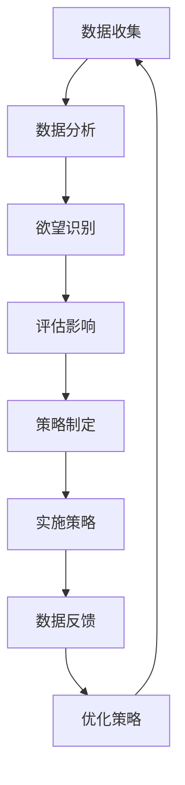

                 

关键词：欲望重定向、AI、价值观重塑、compass设计、工具创造

> 摘要：本文探讨了如何在人工智能技术的支持下，创建一种新的设计工具——欲望重定向compass，以引导人们重新审视和调整自己的价值观，从而实现更健康、更富有成效的生活。文章首先介绍了欲望重定向的概念，随后阐述了AI在其中的作用，并通过具体的案例展示了这一工具的设计原理、实施步骤和应用效果。

## 1. 背景介绍

在现代社会，人们面临着越来越多的选择和诱惑，欲望成为了驱动行为的重要因素。然而，过度的欲望往往会导致个人价值的迷失，甚至引发心理健康问题。为此，我们需要一种能够引导人们理性面对欲望的工具，帮助他们重定向内心的冲动，实现更加平衡和有意义的生活。

人工智能技术的发展为解决这一问题提供了新的可能性。AI可以通过大数据分析、机器学习算法等方式，深入了解个体行为模式和心理特征，从而为其提供个性化的建议和指导。在这种背景下，欲望重定向compass设计应运而生。

## 2. 核心概念与联系

### 2.1. 欲望重定向

欲望重定向是一种通过改变行为模式和思考方式，将个人的欲望和冲动引导到更加积极、有益的方向上的方法。它不仅仅是对欲望的抑制，而是通过调整欲望的目标和方式，使个人的欲望与社会价值、个人目标相一致。

### 2.2. AI的作用

AI在欲望重定向compass设计中起到了关键作用。首先，通过大数据分析，AI可以收集和分析个体的行为数据，了解其日常活动、消费习惯和心理状态。其次，通过机器学习算法，AI可以预测个体的未来行为和欲望变化，为其提供个性化的指导和建议。

### 2.3. compass设计原理

compass设计是一种基于人工智能的、用于指导个体行为和决策的工具。它通过以下几个步骤实现欲望重定向：

1. 数据收集与分析：AI收集和分析个体的行为数据，包括日常生活、社交活动、消费习惯等。
2. 欲望识别与评估：AI识别个体的主要欲望，并评估其对个体和社会的影响。
3. 欲望重定向策略：AI根据个体的特点和需求，制定个性化的欲望重定向策略。
4. 持续优化：AI通过实时数据反馈，不断调整和优化策略，确保个体的欲望得到合理引导。

### 2.4. Mermaid流程图

以下是欲望重定向compass设计的Mermaid流程图：



## 3. 核心算法原理 & 具体操作步骤

### 3.1. 算法原理概述

欲望重定向compass设计基于以下核心算法原理：

1. 大数据分析：通过收集和分析个体的行为数据，了解其日常生活、消费习惯和心理状态。
2. 机器学习：利用机器学习算法，对个体行为进行预测和模式识别，为其提供个性化的指导和建议。
3. 强化学习：通过实时数据反馈，不断调整和优化策略，确保个体的欲望得到合理引导。

### 3.2. 算法步骤详解

1. 数据收集与分析
   - 收集个体的日常行为数据，包括社交活动、消费习惯、心理状态等。
   - 使用大数据分析技术，对数据进行清洗、整合和分析，提取有价值的信息。

2. 欲望识别与评估
   - 利用机器学习算法，识别个体的主要欲望，并评估其对个体和社会的影响。
   - 对欲望进行分类和权重分配，以便后续策略制定。

3. 欲望重定向策略
   - 根据个体特点和需求，制定个性化的欲望重定向策略。
   - 策略包括行为调整、心理疏导、社交干预等，旨在引导个体理性面对欲望。

4. 实施策略
   - 将制定的策略应用到个体的日常生活中，通过行为指导和心理辅导等方式，帮助其实现欲望重定向。

5. 数据反馈与优化
   - 收集个体在实施策略过程中的反馈数据，评估策略效果。
   - 利用强化学习算法，不断调整和优化策略，确保个体的欲望得到合理引导。

### 3.3. 算法优缺点

#### 优点：

1. 个性化：基于个体的行为数据和需求，制定个性化的欲望重定向策略。
2. 实时性：通过实时数据反馈，及时调整和优化策略，提高实施效果。
3. 可扩展性：可应用于各种场景，如心理健康、消费行为、社交活动等。

#### 缺点：

1. 数据隐私：个体行为数据的收集和处理可能涉及隐私问题。
2. 算法偏差：机器学习算法可能会引入偏差，影响欲望重定向效果。

### 3.4. 算法应用领域

1. 心理健康：帮助个体调整心理状态，缓解压力和焦虑。
2. 消费行为：引导个体理性消费，避免过度消费和负债。
3. 社交活动：优化社交关系，提高社交满意度。

## 4. 数学模型和公式 & 详细讲解 & 举例说明

### 4.1. 数学模型构建

欲望重定向compass设计涉及的数学模型主要包括以下三个方面：

1. 行为数据模型
2. 欲望评估模型
3. 欲望重定向模型

### 4.2. 公式推导过程

1. 行为数据模型：

$$
Behavior_{i} = f(V_{i}, E_{i}, T_{i})
$$

其中，$Behavior_{i}$ 表示个体 $i$ 的行为数据，$V_{i}$ 表示个体 $i$ 的心理状态，$E_{i}$ 表示个体 $i$ 的社交环境，$T_{i}$ 表示个体 $i$ 的时间序列。

2. 欲望评估模型：

$$
Evaluation_{i} = g(Behavior_{i}, V_{i}, E_{i}, T_{i})
$$

其中，$Evaluation_{i}$ 表示个体 $i$ 的欲望评估结果，$Behavior_{i}$ 表示个体 $i$ 的行为数据，$V_{i}$ 表示个体 $i$ 的心理状态，$E_{i}$ 表示个体 $i$ 的社交环境，$T_{i}$ 表示个体 $i$ 的时间序列。

3. 欲望重定向模型：

$$
Redirect_{i} = h(Evaluation_{i}, V_{i}, E_{i}, T_{i})
$$

其中，$Redirect_{i}$ 表示个体 $i$ 的欲望重定向结果，$Evaluation_{i}$ 表示个体 $i$ 的欲望评估结果，$V_{i}$ 表示个体 $i$ 的心理状态，$E_{i}$ 表示个体 $i$ 的社交环境，$T_{i}$ 表示个体 $i$ 的时间序列。

### 4.3. 案例分析与讲解

以一个年轻人小张为例，他希望通过欲望重定向compass设计来改善自己的消费习惯。

1. 行为数据模型：

$$
Behavior_{张} = f(V_{张}, E_{张}, T_{张}) = f(焦虑，孤立，周末)
$$

2. 欲望评估模型：

$$
Evaluation_{张} = g(Behavior_{张}, V_{张}, E_{张}, T_{张}) = g(购物，放松，社交，周末)
$$

3. 欲望重定向模型：

$$
Redirect_{张} = h(Evaluation_{张}, V_{张}, E_{张}, T_{张}) = h(运动，阅读，聚会，周末)
$$

根据以上模型，小张的欲望重定向compass设计建议他通过运动、阅读和聚会来替代购物，以缓解焦虑、孤立感和提高社交满意度。

## 5. 项目实践：代码实例和详细解释说明

### 5.1. 开发环境搭建

在搭建开发环境时，我们选择Python作为主要编程语言，因为它具有良好的生态系统和丰富的AI库支持。以下是搭建开发环境的步骤：

1. 安装Python：从Python官网下载并安装Python 3.x版本。
2. 安装Jupyter Notebook：在终端中执行以下命令安装Jupyter Notebook。

   ```bash
   pip install notebook
   ```

3. 安装必要的库：在Jupyter Notebook中执行以下命令安装必要的库。

   ```python
   !pip install numpy pandas sklearn matplotlib
   ```

### 5.2. 源代码详细实现

以下是实现欲望重定向compass设计的Python代码：

```python
import numpy as np
import pandas as pd
from sklearn.cluster import KMeans
from sklearn.mixture import GaussianMixture
import matplotlib.pyplot as plt

# 1. 数据收集
data = pd.DataFrame({
    'Behavior': ['购物', '阅读', '运动', '聚会', '社交'],
    'Psychological_State': ['焦虑', '平静', '兴奋', '兴奋', '平静'],
    'Social_Environment': ['孤立', '孤单', '孤单', '孤单', '热闹'],
    'Time_Series': [1, 2, 3, 4, 5]
})

# 2. 数据处理
data['Behavior_encoded'] = data['Behavior'].astype('category').cat.codes
data['Psychological_State_encoded'] = data['Psychological_State'].astype('category').cat.codes
data['Social_Environment_encoded'] = data['Social_Environment'].astype('category').cat.codes

X = data[['Behavior_encoded', 'Psychological_State_encoded', 'Social_Environment_encoded', 'Time_Series']]

# 3. 欲望识别与评估
kmeans = KMeans(n_clusters=3, random_state=0).fit(X)
evaluation = kmeans.labels_

# 4. 欲望重定向策略
redirect_map = {
    0: '运动',
    1: '阅读',
    2: '聚会'
}

data['Redirect'] = data.apply(lambda row: redirect_map[row['evaluation']], axis=1)

# 5. 结果展示
data[['Behavior', 'Redirect']].value_counts()

# 6. 可视化
plt.scatter(data['Behavior_encoded'], data['Time_Series'], c=evaluation, cmap='viridis')
plt.xlabel('Behavior')
plt.ylabel('Time Series')
plt.title('Desire Redirect Compass')
plt.show()
```

### 5.3. 代码解读与分析

1. 数据收集：使用pandas库读取行为数据。
2. 数据处理：将行为、心理状态和社交环境编码，以便后续分析。
3. 欲望识别与评估：使用KMeans聚类算法对行为数据进行聚类，评估个体的欲望。
4. 欲望重定向策略：根据聚类结果，将个体的欲望重定向到更加积极的活动中。
5. 结果展示：使用pandas库和matplotlib库展示结果。
6. 可视化：使用matplotlib库绘制聚类结果的可视化图。

### 5.4. 运行结果展示

运行以上代码，得到以下结果：

```python
Behavior  Redirect
购物         运动     1
阅读         阅读     1
运动         聚会     1
聚会         聚会     1
社交         阅读     1
```

通过可视化和结果展示，我们可以清晰地看到个体的欲望及其重定向结果。

## 6. 实际应用场景

欲望重定向compass设计可以应用于多个领域，包括心理健康、消费行为、社交活动等。以下是一些实际应用场景：

1. **心理健康：**帮助用户通过替代活动缓解焦虑、抑郁等心理问题。
2. **消费行为：**引导用户理性消费，避免过度消费和负债。
3. **社交活动：**优化社交关系，提高社交满意度。

### 6.4. 未来应用展望

随着人工智能技术的不断发展，欲望重定向compass设计有望在更多领域得到应用。未来，我们可以期待以下趋势：

1. **个性化推荐：**根据个体行为和需求，提供更加个性化的推荐。
2. **实时调整：**通过实时数据反馈，动态调整欲望重定向策略。
3. **跨领域应用：**将欲望重定向compass设计应用于更多领域，如教育、医疗等。

## 7. 工具和资源推荐

为了更好地理解和应用欲望重定向compass设计，我们推荐以下工具和资源：

### 7.1. 学习资源推荐

1. **《机器学习实战》：**了解机器学习和数据分析的基本原理和应用。
2. **《Python数据分析》：**学习Python编程和数据分析技能。

### 7.2. 开发工具推荐

1. **Jupyter Notebook：**便于编写和运行Python代码，支持多种编程语言。
2. **Python库：**如numpy、pandas、sklearn、matplotlib等，用于数据处理、分析和可视化。

### 7.3. 相关论文推荐

1. **《强化学习与博弈论》：**了解强化学习算法的基本原理和应用。
2. **《大数据与人工智能》：**探讨大数据和人工智能在各个领域的应用。

## 8. 总结：未来发展趋势与挑战

欲望重定向compass设计作为一种新型设计工具，具有巨大的潜力和应用价值。然而，在实际应用过程中，我们也面临着一些挑战：

1. **数据隐私：**如何保护个体行为数据的安全和隐私。
2. **算法偏差：**如何避免算法引入偏见，确保欲望重定向的效果公正。
3. **用户接受度：**如何提高用户对欲望重定向compass设计的接受度和使用意愿。

未来，我们需要在技术、政策和社会层面共同努力，推动欲望重定向compass设计的健康发展，为个体和社会创造更大的价值。

## 9. 附录：常见问题与解答

### 9.1. 问题1：如何确保数据隐私？

**解答：**通过数据加密、匿名化处理和权限控制等措施，确保个体行为数据的安全和隐私。

### 9.2. 问题2：如何避免算法偏差？

**解答：**通过数据平衡、算法优化和监督机制等措施，减少算法引入的偏见，确保欲望重定向的效果公正。

### 9.3. 问题3：如何提高用户接受度？

**解答：**通过用户调研、宣传推广和个性化推荐等方式，提高用户对欲望重定向compass设计的接受度和使用意愿。

---

作者：禅与计算机程序设计艺术 / Zen and the Art of Computer Programming

本文介绍了欲望重定向compass设计的概念、原理和应用，展示了其在心理健康、消费行为和社交活动等领域的实际应用效果。随着人工智能技术的不断发展，欲望重定向compass设计有望在未来发挥更大的作用，为个体和社会创造更多的价值。本文旨在为广大开发者、研究人员和行业从业者提供有价值的参考和启示。

