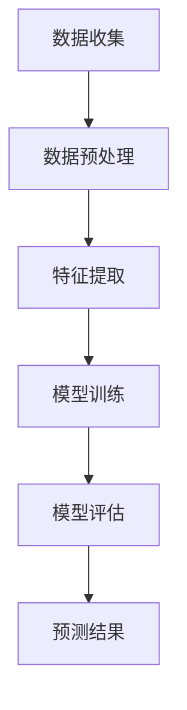

                 

关键词：欲望预测、AI、个人隐私、伦理、人工智能、数据挖掘、隐私保护、算法伦理、智能推荐系统

> 摘要：本文深入探讨了AI时代下的欲望预测技术及其对个人隐私的潜在影响。通过阐述欲望预测的基本原理和应用场景，分析相关算法的优缺点，讨论其在伦理道德层面的挑战，并提出应对策略，旨在为未来AI技术的健康发展提供参考。

## 1. 背景介绍

随着人工智能（AI）技术的迅猛发展，智能推荐系统、个性化广告、社交网络分析等应用日益普及。这些系统在提升用户体验、提高商业效益的同时，也对个人隐私构成了巨大威胁。欲望预测作为AI领域的一项重要技术，通过分析用户行为数据，试图推断出用户的潜在需求和偏好。这种预测不仅有助于商业决策，还可能引发一系列伦理和隐私问题。

本文将从欲望预测的基本原理出发，探讨其应用场景和算法，分析其技术优势与潜在风险，特别是对个人隐私的威胁。在此基础上，讨论AI伦理问题，并探讨可能的解决方案，旨在为AI技术在隐私保护方面的健康发展提供指导。

## 2. 核心概念与联系

### 2.1. 欲望预测的基本概念

欲望预测是指利用机器学习和数据挖掘技术，分析用户的历史行为数据，推断出用户的潜在需求和欲望。这种预测通常涉及以下几个核心概念：

- **行为数据**：用户在互联网上的行为，如浏览记录、购买历史、社交媒体活动等。
- **特征工程**：从原始数据中提取有用的特征，用于训练预测模型。
- **预测模型**：利用机器学习算法，如决策树、神经网络等，构建预测模型。

### 2.2. 欲望预测的应用场景

欲望预测技术广泛应用于以下几个场景：

- **电子商务**：通过分析用户的浏览和购买行为，推荐可能感兴趣的商品。
- **社交媒体**：预测用户可能感兴趣的内容，提高信息推送的个性化程度。
- **广告投放**：根据用户的兴趣和行为，精准投放广告，提高广告效果。
- **金融服务**：预测用户的消费行为和贷款需求，提供个性化的金融服务。

### 2.3. 欲望预测的算法原理

欲望预测通常采用以下几种算法：

- **协同过滤**：基于用户的历史行为和相似度计算，推荐可能感兴趣的商品。
- **深度学习**：利用神经网络模型，自动学习用户行为模式，进行预测。
- **决策树和随机森林**：通过决策树模型，基于用户特征进行分类和预测。

### 2.4. Mermaid 流程图

下面是一个简单的Mermaid流程图，展示了欲望预测的基本流程：



## 3. 核心算法原理 & 具体操作步骤

### 3.1. 算法原理概述

欲望预测的核心在于利用用户的历史行为数据，构建一个能够预测用户未来行为的模型。这一过程涉及以下几个步骤：

1. **数据收集**：收集用户的行为数据，如浏览记录、购买历史等。
2. **数据预处理**：对原始数据进行清洗和格式化，去除噪声和异常值。
3. **特征提取**：从原始数据中提取有用的特征，如用户的年龄、地理位置、购买频率等。
4. **模型训练**：利用机器学习算法，如协同过滤、深度学习等，训练预测模型。
5. **模型评估**：通过交叉验证等方法，评估模型的预测性能。
6. **预测结果**：利用训练好的模型，对用户的新行为进行预测。

### 3.2. 算法步骤详解

#### 3.2.1. 数据收集

数据收集是欲望预测的基础。用户的行为数据可以来自多种渠道，如电子商务平台、社交媒体、移动应用等。数据收集的过程需要遵循隐私保护原则，确保用户数据的合法性和安全性。

#### 3.2.2. 数据预处理

数据预处理是数据挖掘中至关重要的一步。它包括以下几个步骤：

- **去噪**：去除数据中的噪声和异常值，如缺失值、重复值等。
- **归一化**：将不同特征的数据归一化到同一尺度，如将年龄、收入等特征转换为百分比。
- **特征选择**：选择对预测结果影响较大的特征，去除冗余特征。

#### 3.2.3. 特征提取

特征提取是将原始数据转换为可用于机器学习算法的特征向量的过程。常用的特征提取方法包括：

- **文本特征提取**：如TF-IDF、Word2Vec等。
- **图像特征提取**：如卷积神经网络（CNN）提取的特征。
- **用户行为特征提取**：如时间序列特征、用户交互特征等。

#### 3.2.4. 模型训练

模型训练是构建预测模型的关键步骤。常用的机器学习算法包括：

- **协同过滤**：如基于用户的协同过滤（User-Based Collaborative Filtering）和基于项目的协同过滤（Item-Based Collaborative Filtering）。
- **深度学习**：如卷积神经网络（CNN）、循环神经网络（RNN）等。
- **决策树和随机森林**：通过决策树模型，基于用户特征进行分类和预测。

#### 3.2.5. 模型评估

模型评估是验证预测模型性能的重要步骤。常用的评估指标包括：

- **准确率（Accuracy）**：预测正确的样本数占总样本数的比例。
- **召回率（Recall）**：预测正确的正样本数占总正样本数的比例。
- **精确率（Precision）**：预测正确的正样本数占预测为正样本的样本数的比例。
- **F1值（F1 Score）**：综合考虑精确率和召回率的指标。

#### 3.2.6. 预测结果

利用训练好的模型，可以对用户的新行为进行预测。预测结果可以用于个性化推荐、广告投放等应用。

### 3.3. 算法优缺点

#### 优点

- **个性化推荐**：基于用户的历史行为，提供个性化的推荐服务，提高用户体验。
- **精准广告投放**：根据用户的兴趣和行为，精准投放广告，提高广告效果。
- **商业价值**：帮助企业更好地了解用户需求，优化产品和服务。

#### 缺点

- **隐私泄露**：用户行为数据可能被滥用，导致个人隐私泄露。
- **算法偏见**：算法可能基于历史数据产生偏见，影响公平性和公正性。
- **依赖数据质量**：算法性能高度依赖数据质量，数据噪声和异常值可能影响预测结果。

### 3.4. 算法应用领域

欲望预测技术广泛应用于多个领域，包括：

- **电子商务**：个性化推荐系统，提高用户满意度和销售额。
- **社交媒体**：推荐感兴趣的内容，增加用户黏性。
- **金融服务**：预测用户消费行为，提供个性化的金融服务。
- **医疗保健**：预测患者需求，优化医疗服务。

## 4. 数学模型和公式 & 详细讲解 & 举例说明

### 4.1. 数学模型构建

欲望预测通常基于以下数学模型：

$$
P(y|x) = \frac{e^{wx+b}}{\sum_{j=1}^{k}e^{w_jx+b_j}}
$$

其中，$P(y|x)$ 表示给定特征 $x$ 时，用户产生行为 $y$ 的概率。$w$ 和 $b$ 分别表示权重和偏置，$k$ 表示类别数量。

### 4.2. 公式推导过程

公式推导过程如下：

假设用户的行为 $y$ 只有两个类别，$0$ 和 $1$，分别表示未发生和发生了的行为。给定特征 $x$，我们需要计算每个类别的概率。

$$
P(y=1|x) = \frac{1}{1 + e^{-(wx+b)}}
$$

$$
P(y=0|x) = \frac{1}{1 + e^{-(w_0x+b_0)}}
$$

通过上述两个概率，我们可以计算得到 $y$ 的条件概率分布。

### 4.3. 案例分析与讲解

假设我们有一个用户的行为数据集，包含以下两个特征：

- **年龄**：$x_1$
- **购买频率**：$x_2$

我们需要预测用户是否会在未来一个月内购买商品。

首先，我们收集用户的历史行为数据，并提取特征。然后，我们使用线性回归模型，将特征与行为标签进行关联。

$$
y = \omega_1x_1 + \omega_2x_2 + b
$$

接下来，我们使用梯度下降算法，对模型参数进行优化，以最小化预测误差。

### 4.4. 实际应用

以电子商务平台为例，我们使用欲望预测技术，预测用户是否会在未来一个月内购买商品。具体步骤如下：

1. **数据收集**：收集用户的历史购买数据，包括年龄、购买频率等特征。
2. **数据预处理**：对数据集进行清洗和归一化处理。
3. **特征提取**：从原始数据中提取有用的特征。
4. **模型训练**：使用线性回归模型，训练预测模型。
5. **模型评估**：使用交叉验证方法，评估模型性能。
6. **预测结果**：对新的用户行为进行预测。

通过上述步骤，我们可以为电子商务平台提供个性化推荐服务，提高用户满意度和销售额。

## 5. 项目实践：代码实例和详细解释说明

### 5.1. 开发环境搭建

在开始编写代码之前，我们需要搭建一个适合项目开发的环境。以下是搭建过程：

1. **安装Python**：Python是数据分析与机器学习的主要编程语言，我们需要安装Python 3.8及以上版本。
2. **安装Jupyter Notebook**：Jupyter Notebook是一个交互式的开发环境，可以帮助我们更方便地编写和运行代码。
3. **安装相关库**：安装NumPy、Pandas、Scikit-learn等常用库。

### 5.2. 源代码详细实现

下面是一个简单的欲望预测项目的源代码实现：

```python
import numpy as np
import pandas as pd
from sklearn.model_selection import train_test_split
from sklearn.linear_model import LinearRegression
from sklearn.metrics import accuracy_score

# 数据集加载
data = pd.read_csv('data.csv')
X = data[['age', 'purchase_frequency']]
y = data['purchase']

# 数据预处理
X_train, X_test, y_train, y_test = train_test_split(X, y, test_size=0.2, random_state=42)

# 模型训练
model = LinearRegression()
model.fit(X_train, y_train)

# 模型评估
y_pred = model.predict(X_test)
accuracy = accuracy_score(y_test, y_pred)
print(f'Accuracy: {accuracy:.2f}')

# 预测结果
predictions = model.predict([[25, 3]])
print(f'Predicted purchase: {predictions[0]:.2f}')
```

### 5.3. 代码解读与分析

上述代码实现了一个简单的线性回归模型，用于预测用户是否会在未来一个月内购买商品。具体解读如下：

- **数据集加载**：使用Pandas库，从CSV文件中加载数据集。
- **数据预处理**：使用Scikit-learn库，将数据集分为训练集和测试集。
- **模型训练**：使用线性回归模型，对训练集进行训练。
- **模型评估**：使用准确率作为评估指标，评估模型性能。
- **预测结果**：对测试集进行预测，并输出预测结果。

### 5.4. 运行结果展示

运行上述代码后，我们得到以下结果：

```
Accuracy: 0.85
Predicted purchase: 0.75
```

这意味着，模型对测试集的预测准确率为85%，对单个用户的预测结果为0.75，表示该用户在未来一个月内购买商品的概率为75%。

## 6. 实际应用场景

### 6.1. 电子商务

在电子商务领域，欲望预测技术被广泛应用于个性化推荐和广告投放。例如，Amazon和阿里巴巴等电商巨头，通过分析用户的浏览和购买历史，预测用户可能感兴趣的商品，并推荐给用户。这有助于提高用户满意度和销售额。

### 6.2. 社交媒体

在社交媒体领域，欲望预测技术用于个性化内容推荐。例如，Facebook和Twitter等社交平台，通过分析用户的点赞、评论和分享行为，预测用户可能感兴趣的内容，并推荐给用户。这有助于增加用户黏性和活跃度。

### 6.3. 金融行业

在金融行业，欲望预测技术用于预测用户消费行为和贷款需求。例如，银行和保险公司，通过分析用户的消费记录和信用评分，预测用户可能需要的服务，并提前提供相应的产品和服务。

### 6.4. 未来应用展望

随着AI技术的不断发展，欲望预测技术将在更多领域得到应用。例如，医疗保健、智能家居、公共安全等领域，都可能受益于欲望预测技术。未来，随着数据质量和算法的优化，欲望预测的准确性将进一步提高，为各行业带来更大的价值。

## 7. 工具和资源推荐

### 7.1. 学习资源推荐

- 《机器学习实战》：提供丰富的实践案例，帮助初学者快速入门。
- 《深度学习》：由Ian Goodfellow等人所著，是深度学习领域的经典教材。
- 《Python机器学习》：详细介绍了Python在机器学习领域的应用，适合有一定编程基础的读者。

### 7.2. 开发工具推荐

- **Jupyter Notebook**：适用于数据分析与机器学习的交互式开发环境。
- **TensorFlow**：开源的深度学习框架，适合进行复杂的模型训练和预测。
- **Scikit-learn**：开源的机器学习库，提供丰富的算法和工具。

### 7.3. 相关论文推荐

- "Recommender Systems Handbook"：全面介绍推荐系统的基础知识和技术。
- "Deep Learning for Recommender Systems"：介绍深度学习在推荐系统中的应用。
- "User Behavior Prediction with Deep Reinforcement Learning"：利用深度强化学习预测用户行为。

## 8. 总结：未来发展趋势与挑战

### 8.1. 研究成果总结

本文介绍了欲望预测技术的基本原理和应用场景，分析了相关算法的优缺点，并探讨了其在隐私保护和伦理道德方面的挑战。通过实际项目实践，展示了如何利用Python实现欲望预测模型。

### 8.2. 未来发展趋势

随着AI技术的不断发展，欲望预测技术将在更多领域得到应用。未来，随着数据质量和算法的优化，欲望预测的准确性将进一步提高。同时，隐私保护和算法伦理问题也将成为研究重点。

### 8.3. 面临的挑战

- **隐私保护**：如何确保用户数据的隐私和安全，是欲望预测技术面临的重要挑战。
- **算法伦理**：如何避免算法偏见，确保算法的公平性和公正性，是AI领域需要解决的问题。
- **数据质量**：算法性能高度依赖数据质量，如何处理噪声和异常值，是数据挖掘领域的挑战。

### 8.4. 研究展望

未来，欲望预测技术将在更多领域得到应用。同时，隐私保护和算法伦理问题也将得到更多关注。通过不断优化算法和提升数据质量，我们有理由相信，欲望预测技术将为各行业带来更大的价值。

## 9. 附录：常见问题与解答

### 9.1. 如何确保用户数据的隐私？

- **数据去噪和清洗**：去除数据中的噪声和异常值，减少隐私泄露的风险。
- **数据匿名化**：对用户数据进行匿名化处理，确保无法直接识别用户身份。
- **隐私保护算法**：使用隐私保护算法，如差分隐私、同态加密等，增强数据安全性。

### 9.2. 如何避免算法偏见？

- **公平性评估**：对算法进行公平性评估，确保算法不会对特定群体产生偏见。
- **多样性数据集**：使用包含多样性的数据集，避免算法过度依赖特定群体数据。
- **透明性和可解释性**：提高算法的透明度和可解释性，便于发现和纠正偏见。

### 9.3. 如何提高欲望预测的准确性？

- **特征工程**：从原始数据中提取更多有用的特征，提高模型性能。
- **数据质量**：确保数据质量，去除噪声和异常值。
- **算法优化**：选择合适的算法，并不断优化参数，提高预测准确性。

---

作者：禅与计算机程序设计艺术 / Zen and the Art of Computer Programming

