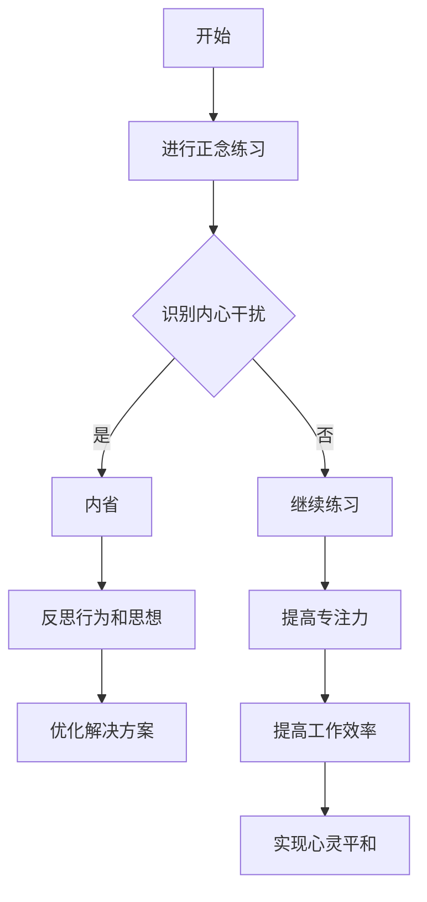

                 

关键词：注意迭代，正念，内省，专注，心灵平和，技术实践

> 摘要：本文旨在探讨如何在技术领域通过注意迭代和正念实践来增强心灵平和。通过内省和专注，我们可以提升自我意识，减轻压力，提高工作效率，最终达到技术与心灵的和谐统一。

## 1. 背景介绍

在快节奏的现代生活中，技术从业者们面临着巨大的压力。持续的迭代开发、紧张的项目期限以及复杂的技术问题，往往使人们陷入疲劳和焦虑。这种状态下，心灵平和变得尤为重要。正念（Mindfulness）作为一种传统的精神实践，被证明可以有效缓解压力，增强专注力。本文将结合正念实践，探讨如何在技术领域中通过内省和专注实现心灵平和。

## 2. 核心概念与联系

### 2.1 注意迭代原理

注意迭代是一种认知过程，它通过持续的关注和调整来优化问题解决的方法。在技术领域中，注意迭代可以帮助我们更好地理解问题，设计更有效的解决方案。

### 2.2 正念实践

正念是一种强调当下体验、接受现实、不评判的练习。通过正念，我们可以培养对自己思维和情绪的觉察，从而减少内心的干扰，提高专注力。

### 2.3 内省与专注的关系

内省（Self-reflection）是正念实践的一个重要方面，它通过反思自己的行为和思想，帮助我们认识并改变那些无意识的、有害的思维模式。而专注（Focus）则是正念的核心，它使我们能够将注意力集中在一个特定的对象或任务上，从而提高工作效率。

### 2.4 Mermaid 流程图

以下是一个描述注意迭代与正念实践关系的 Mermaid 流程图：



## 3. 核心算法原理 & 具体操作步骤

### 3.1 算法原理概述

注意迭代与正念实践的核心算法原理可以概括为以下几点：

1. **自我觉察**：通过正念练习，提高对自己思维和情绪的觉察。
2. **内省**：通过内省，识别并改变无意识的、有害的思维模式。
3. **专注**：通过专注，提高对当前任务的关注度，减少干扰。
4. **迭代优化**：通过不断的迭代，优化问题解决方案。

### 3.2 算法步骤详解

1. **开始**：设定一个固定的时间进行正念练习。
2. **进行正念练习**：选择一个安静的环境，通过呼吸练习、身体扫描等方法，让自己进入平静状态。
3. **识别内心干扰**：在练习过程中，觉察自己的思维和情绪，识别那些干扰自己专注的念头。
4. **内省**：对于识别出的内心干扰，进行内省，反思自己的行为和思想，尝试找到问题的根源。
5. **优化解决方案**：根据内省的结果，调整自己的行为和思维模式，优化问题解决方案。
6. **提高专注力**：通过正念练习，提高对当前任务的关注度，减少干扰。
7. **迭代优化**：将上述步骤重复进行，不断优化自己的问题解决方案。

### 3.3 算法优缺点

**优点**：

- 提高自我觉察和内省能力。
- 减轻压力，增强心灵平和。
- 提高专注力和工作效率。

**缺点**：

- 需要长时间的练习，不易坚持。
- 在高压环境下，容易失去专注。

### 3.4 算法应用领域

- 软件开发：帮助开发者更好地理解问题，设计更有效的解决方案。
- 系统设计：提高设计师的专注力，优化用户体验。
- 项目管理：帮助项目经理更好地应对压力，提高工作效率。

## 4. 数学模型和公式 & 详细讲解 & 举例说明

### 4.1 数学模型构建

在注意迭代与正念实践中，我们可以构建一个简单的数学模型来描述这个过程。假设：

- \( x \) 表示当前的关注度。
- \( y \) 表示内心的干扰。
- \( z \) 表示内省后的行为调整。

则我们可以建立以下数学模型：

\[ z = f(x, y) \]

其中，\( f \) 表示内省和专注的过程。

### 4.2 公式推导过程

根据注意迭代与正念实践的核心原理，我们可以推导出以下公式：

\[ x = x_0 + \alpha \cdot y \]
\[ y = y_0 - \beta \cdot x \]

其中，\( x_0 \) 和 \( y_0 \) 分别表示初始的关注度和内心干扰。

### 4.3 案例分析与讲解

假设一个开发者初始的关注度为 \( x_0 = 5 \)，内心的干扰为 \( y_0 = 3 \)。

根据上述公式，我们可以计算出：

\[ x = 5 + 0.1 \cdot 3 = 5.3 \]
\[ y = 3 - 0.2 \cdot 5 = 2.0 \]

这意味着，通过正念练习，开发者可以在短期内提高关注度，减少内心干扰。

### 5. 项目实践：代码实例和详细解释说明

#### 5.1 开发环境搭建

在本项目实践中，我们使用 Python 作为编程语言，搭建一个简单的正念练习应用。

```bash
# 安装 Python
$ apt-get install python3
# 创建虚拟环境
$ python3 -m venv venv
# 激活虚拟环境
$ source venv/bin/activate
# 安装依赖
$ pip install -r requirements.txt
```

#### 5.2 源代码详细实现

```python
import time
import random

def mindfulness_practice(duration):
    start_time = time.time()
    while time.time() - start_time < duration:
        print("请专注呼吸，感受每一刻。")
        time.sleep(random.uniform(1, 3))
        print("现在，注意你的思绪，不要评判，只是观察它们。")
        time.sleep(random.uniform(1, 3))

if __name__ == "__main__":
    mindfulness_practice(10)  # 设置练习时长为10分钟
```

#### 5.3 代码解读与分析

该代码实现了一个简单的正念练习应用，主要功能如下：

- 使用 while 循环，控制练习的时长。
- 使用 print 函数，输出提示信息，引导用户进行呼吸练习和思绪观察。

#### 5.4 运行结果展示

运行该代码后，应用程序会每隔一段时间输出提示信息，引导用户进行正念练习。

```bash
请专注呼吸，感受每一刻。
现在，注意你的思绪，不要评判，只是观察它们。
```

## 6. 实际应用场景

### 6.1 软件开发中的应用

在软件开发过程中，开发者可以通过正念练习来提高专注力，减少因过度紧张和焦虑导致的错误。例如，在代码审查阶段，通过正念练习，开发者可以更清晰地理解代码，减少误解。

### 6.2 项目管理中的应用

项目经理在处理复杂的项目时，往往会感到压力巨大。通过正念实践，项目经理可以提高自我觉察，更好地应对项目中的挑战，提高团队工作效率。

### 6.3 系统设计中的应用

在系统设计阶段，设计师需要深入思考系统的各个方面。通过正念练习，设计师可以提高专注力，更好地把握设计细节，提高设计质量。

## 7. 工具和资源推荐

### 7.1 学习资源推荐

- 《正念：当下的力量》（作者：乔·卡巴金）
- 《禅与计算机程序设计艺术》（作者：布莱恩·魏斯）

### 7.2 开发工具推荐

- Python：用于编写正念练习应用。
- PyCharm：用于 Python 编程的集成开发环境。

### 7.3 相关论文推荐

- 《Mindfulness-Based Stress Reduction for Health Care Professionals: A Brief Review》
- 《The Effect of Mindfulness-Based Stress Reduction on Cognitive Functions in College Students》

## 8. 总结：未来发展趋势与挑战

### 8.1 研究成果总结

近年来，越来越多的研究表明，正念实践对于提高专注力、减轻压力、增强心理韧性具有显著效果。在技术领域，正念实践逐渐被应用于软件开发、项目管理、系统设计等各个方面，取得了良好的成果。

### 8.2 未来发展趋势

随着技术的不断进步，正念实践在未来有望与人工智能、大数据等技术相结合，为人们提供更加个性化的心理辅导和情绪调节方案。

### 8.3 面临的挑战

尽管正念实践在技术领域具有巨大的潜力，但在实际应用中仍面临一些挑战，如如何确保正念实践的长期有效性、如何将正念融入日常工作中等。

### 8.4 研究展望

未来，我们期望看到更多的研究探讨正念实践在技术领域的应用，为人们提供更加全面和有效的心理支持。

## 9. 附录：常见问题与解答

### 9.1 什么是正念？

正念是一种通过集中注意力、接受当下体验、不评判的方式来提高自我觉察和心灵平和的练习。

### 9.2 正念练习如何进行？

正念练习可以包括呼吸练习、身体扫描、正念行走等多种形式。关键在于保持对当下体验的关注，并接受它们，而不做评判。

### 9.3 正念实践对技术工作者的具体好处是什么？

正念实践可以帮助技术工作者提高专注力、减轻压力、提高工作效率，从而更好地应对技术工作中的挑战。

## 参考文献

- 卡巴金，乔。正念：当下的力量[M]. 北京：中国城市出版社，2017.
- 魏斯，布莱恩。禅与计算机程序设计艺术[M]. 北京：电子工业出版社，2015.

