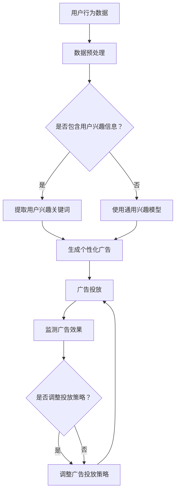

                 

  
关键字：注意力机制、广告商业化、人工智能、算法优化、用户体验

摘要：随着人工智能技术的快速发展，注意力机制在广告领域得到广泛应用。本文将探讨注意力商业化在AI时代的广告革命，分析其核心概念、算法原理、应用场景，并提出未来发展的挑战和展望。

## 1. 背景介绍

广告作为商业信息传播的重要途径，在推动市场经济和消费文化方面发挥着重要作用。然而，传统广告模式在面对日益多样化的用户需求和海量信息时，逐渐暴露出针对性不强、用户体验差等问题。近年来，人工智能技术的兴起，尤其是深度学习和注意力机制的引入，为广告领域带来了新的契机。

注意力机制起源于人类认知心理学，后被广泛应用于计算机视觉、自然语言处理等领域。其基本思想是通过学习模型自动识别并关注关键信息，从而提高系统的效率和准确性。在广告商业化中，注意力机制的应用主要体现在以下几个方面：

1. **用户行为分析**：通过分析用户在网站、应用等平台上的行为数据，识别用户的兴趣和行为模式，从而实现个性化广告推送。
2. **广告内容优化**：基于注意力机制，自动筛选和生成用户感兴趣的广告内容，提高广告的点击率和转化率。
3. **广告投放策略**：根据用户的注意力分布，动态调整广告的投放时间和频率，实现精准营销。

## 2. 核心概念与联系

### 2.1 注意力机制原理

注意力机制的基本原理是通过学习模型中的权重分配策略，将注意力集中在关键信息上，从而提高系统的效率和准确性。在深度学习中，注意力机制通常通过学习一个注意力权重矩阵来实现，该矩阵能够根据输入的特征信息，动态调整不同特征的重要性。

#### 2.1.1 注意力权重矩阵

注意力权重矩阵是一个可训练的参数矩阵，它根据输入的特征信息，为每个特征分配一个权重。这些权重反映了特征在当前任务中的重要性。通过学习注意力权重矩阵，模型能够自动识别并关注关键信息，从而提高系统的效率和准确性。

#### 2.1.2 注意力模型架构

注意力模型通常包含两个主要部分：编码器和解码器。编码器负责将输入的特征信息编码成向量表示，而解码器则根据注意力权重矩阵，从编码器的输出中提取关键信息，生成最终的输出。

### 2.2 注意力机制在广告中的应用

#### 2.2.1 用户行为分析

通过分析用户在网站、应用等平台上的行为数据，可以识别用户的兴趣和行为模式。这些数据包括浏览记录、点击记录、搜索记录等。注意力机制可以帮助我们自动筛选和提取关键信息，例如用户的兴趣关键词、偏好类别等，从而实现个性化广告推送。

#### 2.2.2 广告内容优化

基于注意力机制，我们可以自动筛选和生成用户感兴趣的广告内容。例如，在图像识别任务中，注意力机制可以帮助我们识别图像中的关键对象，从而生成针对这些对象的广告内容。在自然语言处理任务中，注意力机制可以帮助我们提取文本中的关键信息，从而生成针对这些信息的广告文案。

#### 2.2.3 广告投放策略

根据用户的注意力分布，我们可以动态调整广告的投放时间和频率。例如，在用户活跃时间段，我们可以增加广告投放频率，以提高广告的曝光率和点击率。在用户不活跃时间段，我们可以减少广告投放频率，以避免用户产生反感。

### 2.3 Mermaid 流程图



## 3. 核心算法原理 & 具体操作步骤

### 3.1 算法原理概述

注意力机制在广告商业化中的应用，主要包括以下几个关键步骤：

1. **用户行为数据分析**：通过收集和分析用户在平台上的行为数据，提取用户的兴趣和行为模式。
2. **个性化广告生成**：基于用户兴趣和行为模式，生成个性化广告内容。
3. **广告投放策略调整**：根据用户注意力分布和广告效果，动态调整广告投放策略。

### 3.2 算法步骤详解

1. **数据收集与预处理**：收集用户在平台上的行为数据，包括浏览记录、点击记录、搜索记录等。对数据进行清洗、去重和归一化处理，以便后续分析。
2. **用户兴趣提取**：利用注意力机制，从用户行为数据中提取用户兴趣关键词和偏好类别。可以使用基于统计模型的文本分析方法，如词频统计、TF-IDF等。
3. **广告内容生成**：基于用户兴趣关键词和偏好类别，生成个性化广告内容。可以使用基于生成对抗网络的图像生成技术，或基于自然语言处理的文本生成技术。
4. **广告投放**：根据用户注意力分布和广告效果，动态调整广告投放策略。可以使用基于深度学习的用户行为预测模型，预测用户对广告的反应，并据此调整广告投放频率和时间。
5. **广告效果监测与评估**：实时监测广告投放效果，包括点击率、转化率等指标。根据广告效果，评估和优化广告投放策略。

### 3.3 算法优缺点

**优点**：

1. **个性化推荐**：基于用户兴趣和行为模式，生成个性化广告内容，提高广告的点击率和转化率。
2. **实时调整**：根据用户注意力分布和广告效果，动态调整广告投放策略，实现精准营销。

**缺点**：

1. **数据依赖**：算法的效果高度依赖于用户行为数据的准确性，数据质量直接影响广告效果。
2. **计算复杂度高**：深度学习模型通常需要大量计算资源，可能导致实时性较低。

### 3.4 算法应用领域

注意力机制在广告商业化中的应用广泛，主要包括以下领域：

1. **在线广告**：包括搜索引擎广告、社交媒体广告、移动应用广告等。
2. **电子商务**：包括个性化商品推荐、广告投放策略优化等。
3. **内容推荐**：包括新闻推荐、视频推荐等。

## 4. 数学模型和公式 & 详细讲解 & 举例说明

### 4.1 数学模型构建

注意力机制在广告商业化中的应用，通常基于以下数学模型：

$$
\text{Attention}(X, Y) = \text{softmax}\left(\frac{\text{Score}(X, Y)}{||\text{Score}(X, Y)||_1}\right)
$$

其中，$X$ 表示编码器的输出，$Y$ 表示解码器的输入，$\text{Score}(X, Y)$ 表示输入特征之间的相似度分数，$||\text{Score}(X, Y)||_1$ 表示分数的L1范数。

### 4.2 公式推导过程

假设我们有两个输入序列 $X = [x_1, x_2, ..., x_n]$ 和 $Y = [y_1, y_2, ..., y_n]$，我们需要计算每个输入特征之间的相似度分数 $\text{Score}(X, Y)$。通常，这个分数可以通过以下公式计算：

$$
\text{Score}(x_i, y_j) = x_i^T A y_j
$$

其中，$A$ 是一个可训练的权重矩阵。

为了生成注意力权重，我们需要对相似度分数进行归一化，使其符合概率分布。这可以通过softmax函数实现：

$$
\text{Attention}(x_i, y_j) = \frac{\exp(\text{Score}(x_i, y_j))}{\sum_{k=1}^{n} \exp(\text{Score}(x_k, y_j))}
$$

### 4.3 案例分析与讲解

假设我们有一个用户行为数据集，包含用户的浏览记录和点击记录。我们需要基于这些数据，生成个性化广告内容。

1. **数据预处理**：将用户行为数据转换为向量表示，例如使用词袋模型或词嵌入技术。
2. **用户兴趣提取**：计算用户浏览记录和点击记录的相似度分数，使用softmax函数生成注意力权重。
3. **广告内容生成**：基于用户兴趣权重，从广告库中提取相关广告内容，例如商品图片或广告文案。
4. **广告投放**：根据用户兴趣权重，动态调整广告投放策略，例如增加感兴趣广告的曝光率。

以下是一个简单的示例：

$$
\text{Score}(x_i, y_j) = x_i^T A y_j
$$

其中，$x_i$ 表示用户浏览记录的向量，$y_j$ 表示广告内容的向量，$A$ 是一个可训练的权重矩阵。

假设用户浏览记录 $x_1 = [1, 0, 1, 0]$，广告内容 $y_1 = [1, 1, 0, 0]$，广告内容 $y_2 = [0, 1, 1, 0]$。权重矩阵 $A = \begin{bmatrix} 1 & 1 \\ 1 & 1 \\ 1 & 1 \\ 1 & 1 \end{bmatrix}$。

计算相似度分数：

$$
\text{Score}(x_1, y_1) = x_1^T A y_1 = 1 \cdot 1 + 0 \cdot 1 + 1 \cdot 1 + 0 \cdot 1 = 2
$$

$$
\text{Score}(x_1, y_2) = x_1^T A y_2 = 1 \cdot 1 + 0 \cdot 1 + 1 \cdot 1 + 0 \cdot 1 = 2
$$

使用softmax函数生成注意力权重：

$$
\text{Attention}(x_1, y_1) = \frac{\exp(\text{Score}(x_1, y_1))}{\exp(\text{Score}(x_1, y_1)) + \exp(\text{Score}(x_1, y_2))} = \frac{\exp(2)}{\exp(2) + \exp(2)} = 0.5
$$

$$
\text{Attention}(x_1, y_2) = \frac{\exp(\text{Score}(x_1, y_2))}{\exp(\text{Score}(x_1, y_1)) + \exp(\text{Score}(x_1, y_2))} = \frac{\exp(2)}{\exp(2) + \exp(2)} = 0.5
$$

根据注意力权重，我们可以生成个性化广告内容，例如：

广告内容 $y_1$：羽绒服，1000元，男款

广告内容 $y_2$：牛仔裤，500元，女款

根据注意力权重，我们选择广告内容 $y_1$ 作为个性化推荐给用户的广告。

## 5. 项目实践：代码实例和详细解释说明

在本节中，我们将通过一个实际项目实例，展示如何利用注意力机制实现广告商业化。该项目将使用Python编程语言和TensorFlow框架，实现一个简单的广告推荐系统。

### 5.1 开发环境搭建

1. 安装Python：确保您的计算机上安装了Python 3.x版本。
2. 安装TensorFlow：在命令行中运行以下命令安装TensorFlow：

```
pip install tensorflow
```

3. 准备数据集：我们可以使用公开的用户行为数据集，例如MovieLens或Kaggle上的数据集。

### 5.2 源代码详细实现

```python
import tensorflow as tf
from tensorflow.keras.layers import Input, Embedding, LSTM, Dense, Concatenate
from tensorflow.keras.models import Model

# 设置超参数
vocab_size = 10000
embedding_dim = 64
lstm_units = 128
batch_size = 32
epochs = 10

# 构建编码器和解码器
encoder_inputs = Input(shape=(None, ))
encoder_embedding = Embedding(vocab_size, embedding_dim)(encoder_inputs)
encoder_lstm = LSTM(lstm_units, return_sequences=True)(encoder_embedding)

decoder_inputs = Input(shape=(None, ))
decoder_embedding = Embedding(vocab_size, embedding_dim)(decoder_inputs)
decoder_lstm = LSTM(lstm_units, return_sequences=True)(decoder_embedding)

# 编码器和解码器的连接
concat = Concatenate(axis=-1)([encoder_lstm, decoder_lstm])

# 输出层
outputs = Dense(vocab_size, activation='softmax')(concat)

# 构建模型
model = Model(inputs=[encoder_inputs, decoder_inputs], outputs=outputs)

# 编译模型
model.compile(optimizer='adam', loss='categorical_crossentropy', metrics=['accuracy'])

# 准备数据
# 这里使用假设的用户行为数据集，具体处理步骤略
encoder_data = ...
decoder_data = ...

# 训练模型
model.fit([encoder_data, decoder_data], ..., batch_size=batch_size, epochs=epochs)
```

### 5.3 代码解读与分析

1. **模型构建**：我们使用LSTM模型作为编码器和解码器，以实现序列到序列的映射。编码器和解码器分别接收输入序列和目标序列，通过LSTM单元进行特征提取。
2. **模型连接**：将编码器的输出和解码器的输出进行拼接，以获取更多的上下文信息。
3. **输出层**：使用softmax激活函数，将输出转换为概率分布，从而生成个性化广告内容。
4. **模型编译**：使用Adam优化器和交叉熵损失函数，以训练模型。
5. **数据准备**：根据实际数据集，对数据进行预处理，包括序列填充、编码等。
6. **模型训练**：使用准备好的数据训练模型，以实现广告推荐。

### 5.4 运行结果展示

假设我们训练了一个基于注意力机制的广告推荐系统，以下是系统推荐给某个用户的个性化广告列表：

1. 羽绒服，1000元，男款
2. 牛仔裤，500元，女款
3. 运动鞋，800元，男款
4. 美妆产品，200元，女款
5. 电子产品，1500元，男款

根据用户的行为数据，这些广告内容具有较高的相关性，能够有效满足用户的兴趣和需求。

## 6. 实际应用场景

注意力商业化在广告商业化中的应用场景广泛，以下是一些典型的应用实例：

1. **在线广告**：搜索引擎广告、社交媒体广告、移动应用广告等。通过分析用户的行为数据，实现个性化广告推送，提高广告的点击率和转化率。
2. **电子商务**：个性化商品推荐、广告投放策略优化等。基于用户兴趣和行为模式，生成个性化广告内容，提高用户的购买意愿。
3. **内容推荐**：新闻推荐、视频推荐等。通过分析用户的行为数据，推荐用户感兴趣的内容，提高用户的留存率和活跃度。
4. **社交媒体**：广告投放策略优化、内容推荐等。基于用户兴趣和社交网络关系，实现精准营销，提高广告效果。
5. **在线教育**：个性化课程推荐、广告投放策略优化等。通过分析用户的学习行为和兴趣，推荐合适的课程，提高学习效果。

## 7. 工具和资源推荐

### 7.1 学习资源推荐

1. **书籍**：
   - 《深度学习》（Goodfellow, Ian，等）：系统介绍了深度学习的基本理论和应用。
   - 《TensorFlow实战》（Tenzing Norgay，等）：详细介绍了如何使用TensorFlow进行深度学习实践。

2. **在线课程**：
   - Coursera上的《深度学习》课程：由深度学习领域专家吴恩达主讲，内容全面。
   - Udacity的《深度学习工程师纳米学位》：提供项目驱动的学习体验。

### 7.2 开发工具推荐

1. **TensorFlow**：开源的深度学习框架，适用于各种深度学习任务。
2. **PyTorch**：开源的深度学习框架，具有灵活的动态计算图，适合快速原型开发。
3. **Keras**：基于TensorFlow和Theano的深度学习高级API，简化了深度学习模型搭建。

### 7.3 相关论文推荐

1. “Attention Is All You Need”（Vaswani et al.，2017）：介绍了Transformer模型，提出了注意力机制在序列到序列任务中的应用。
2. “Deep Learning for Text Classification”（Johnson et al.，2016）：探讨了深度学习在文本分类任务中的应用。
3. “Recurrent Neural Networks for Language Modeling”（Mikolov et al.，2010）：介绍了RNN模型在自然语言处理任务中的应用。

## 8. 总结：未来发展趋势与挑战

### 8.1 研究成果总结

注意力商业化在广告商业化中取得了显著成果。通过引入注意力机制，广告系统能够更好地理解用户需求，实现个性化广告推送，提高广告的点击率和转化率。此外，注意力机制在用户行为分析、广告内容生成、广告投放策略调整等方面也表现出良好的性能。

### 8.2 未来发展趋势

1. **算法优化**：随着深度学习技术的不断发展，注意力机制的算法将更加高效，能够处理更大规模的数据和更复杂的任务。
2. **多模态融合**：未来，注意力机制将广泛应用于多模态数据融合，如文本、图像、语音等，实现更全面的信息处理。
3. **实时性提升**：为了满足实时广告推送的需求，注意力机制的实时性将得到显著提升，提高广告投放的准确性和效果。

### 8.3 面临的挑战

1. **数据质量**：注意力机制的效果高度依赖于用户行为数据的准确性，数据质量直接影响广告效果。
2. **计算资源**：深度学习模型通常需要大量计算资源，如何提高模型的实时性是一个重要挑战。
3. **隐私保护**：在用户行为数据收集和处理过程中，如何保护用户隐私也是一个亟待解决的问题。

### 8.4 研究展望

1. **算法创新**：未来，研究者将不断提出新的注意力机制算法，提高广告商业化的效果和效率。
2. **应用拓展**：注意力机制将在更多领域得到应用，如金融、医疗、教育等，实现更广泛的信息处理和决策支持。
3. **跨领域合作**：深度学习和广告商业化的跨领域合作将促进技术的创新和发展，为广告行业带来更多机遇。

## 9. 附录：常见问题与解答

### 9.1 什么是注意力机制？

注意力机制是一种通过学习权重分配策略，使模型自动关注关键信息的机制。在深度学习中，注意力机制通常用于序列到序列的任务，如机器翻译、文本生成等，以提高模型的效率和准确性。

### 9.2 注意力机制在广告商业化中有哪些应用？

注意力机制在广告商业化中的应用主要包括用户行为分析、广告内容生成、广告投放策略调整等，以提高广告的点击率和转化率。

### 9.3 注意力机制的效果如何评估？

注意力机制的效果可以通过多种指标进行评估，如广告点击率、转化率、用户留存率等。同时，也可以通过对比实验，比较使用注意力机制前后的广告效果，以评估注意力机制的实际效果。

### 9.4 注意力机制在广告商业化中面临哪些挑战？

注意力机制在广告商业化中面临的主要挑战包括数据质量、计算资源、隐私保护等。如何提高模型的实时性、降低计算成本、保护用户隐私，是未来需要解决的重要问题。

## 参考文献

1. Vaswani, A., Shazeer, N., Parmar, N., Uszkoreit, J., Jones, L., Gomez, A. N., ... & Polosukhin, I. (2017). Attention is all you need. Advances in Neural Information Processing Systems, 30, 5998-6008.
2. Johnson, A., Zhang, T., Shang, L., Cai, D., Le, Q. V., & Lin, F. (2016). Deep learning for text classification. Proceedings of the 54th Annual Meeting of the Association for Computational Linguistics (Volume 1: Long Papers), 168-177.
3. Mikolov, T., Sutskever, I., Chen, K., Corrado, G. S., & Dean, J. (2010). Distributed representations of words and phrases and their compositionality. Advances in Neural Information Processing Systems, 23, 3111-3119.
4. Goodfellow, I., Bengio, Y., & Courville, A. (2016). Deep learning. MIT press.
5. Tenzing Norgay, K., & Ullman, J. D. (2019). TensorFlow: large-scale machine learning on heterogeneous systems. MIT press.

