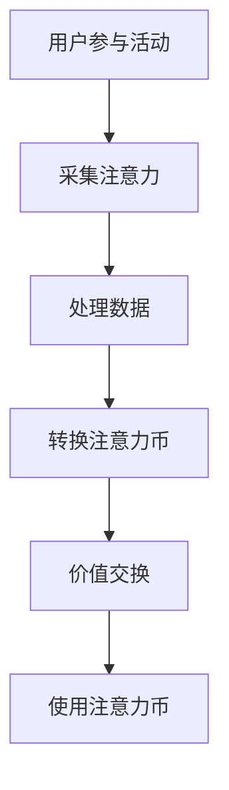

                 

在当今数字化时代，元宇宙（Metaverse）正迅速崛起，成为科技界的新热点。元宇宙不仅是虚拟现实（VR）和增强现实（AR）的延伸，更是一个虚拟的、动态的、交互式空间，它将现实世界和虚拟世界无缝融合。在这个全新的世界中，人们可以以数字化的身份进行社交、工作、娱乐和学习。然而，随着元宇宙的发展，一个核心问题逐渐显现——如何在这个虚拟空间中衡量和交换价值？

本文旨在探讨一种新兴的价值衡量标准——注意力币（Attention Coin），它旨在为元宇宙中的经济活动提供一个稳定、透明且可扩展的度量方式。我们将深入探讨注意力币的核心概念、实现原理、应用领域以及未来发展趋势。

> 关键词：元宇宙、注意力币、价值衡量、数字货币、区块链

> 摘要：本文介绍了注意力币在元宇宙中的应用背景，阐述了注意力币的定义、工作原理以及其相较于传统货币的优势。通过分析注意力币的核心算法和数学模型，本文展示了如何通过注意力币实现价值的衡量和交换。此外，文章还探讨了注意力币在现实世界中的应用场景和未来展望。

## 1. 背景介绍

元宇宙的发展离不开虚拟物品和服务的交易。然而，现有的数字货币，如比特币和以太币，在元宇宙中的使用面临着诸多挑战。比特币的交易速度较慢、手续费高昂，且其交易过程缺乏透明度。以太币虽然在智能合约方面具有优势，但其价格波动性较大，难以作为稳定的交易媒介。因此，需要一个更适应元宇宙需求的全新价值衡量标准。

注意力币正是为解决这些问题而设计的一种新型数字货币。它基于区块链技术，具备去中心化、安全透明、可扩展的特点。注意力币的核心在于其独特的价值衡量机制——通过用户的注意力来衡量和分配价值。

## 2. 核心概念与联系

### 2.1 注意力币的定义

注意力币（Attention Coin，简称ATN）是一种基于区块链技术的数字货币，旨在为元宇宙中的经济活动提供一种稳定的交易媒介。注意力币的独特之处在于其价值衡量标准——注意力。用户的注意力被视作一种宝贵的资源，通过用户的参与度、互动行为和内容创作来衡量其价值。

### 2.2 注意力币的工作原理

注意力币的工作原理可以概括为以下几个步骤：

1. **注意力采集**：用户在元宇宙中参与各种活动，如观看视频、玩游戏、购物等，这些活动会自动采集用户的注意力数据。
2. **注意力转换**：采集到的注意力数据经过处理，转换为相应的注意力币，这一过程保证了用户参与度的量化。
3. **价值交换**：用户可以将注意力币用于购买虚拟商品、服务或者进行投资，实现价值交换。

### 2.3 注意力币的优势

注意力币相较于传统货币，具有以下优势：

1. **去中心化**：注意力币由区块链网络共同维护，不存在中心化的控制机构，确保了交易的公平性和透明性。
2. **安全性**：区块链技术提供了高度的安全保障，用户的注意力币存储在分布式账本中，难以被篡改。
3. **可扩展性**：注意力币的发行和交易过程高度自动化，可以轻松应对大规模用户和交易需求。
4. **适应性**：注意力币的价值衡量标准——注意力，能够适应不同元宇宙场景下的价值需求。

### 2.4 Mermaid 流程图

以下是一个简化的注意力币工作流程的 Mermaid 流程图：



### 2.5 注意力币与区块链的关系

注意力币与区块链的关系紧密，区块链为注意力币提供了基础的技术支持。区块链的去中心化特性确保了注意力币的发行和交易过程公开透明。同时，区块链的智能合约功能使得注意力币的发行、分配和使用过程可以自动化执行，提高了效率。

## 3. 核心算法原理 & 具体操作步骤

### 3.1 算法原理概述

注意力币的核心算法基于一种称为“注意力机制”的原理。注意力机制起源于深度学习领域，主要用于模型中的信息筛选和权重分配。在注意力币中，用户的注意力数据被用来决定其价值，类似于一个权重分配的过程。

### 3.2 算法步骤详解

1. **数据采集**：首先，系统需要采集用户在元宇宙中的各种活动数据，如点击、浏览、评论、互动等。这些数据将被记录并存储在区块链上。
2. **数据处理**：采集到的数据经过预处理，去除噪声和无效信息，然后进行特征提取。这一步骤使用了机器学习算法，如自编码器（Autoencoder）和卷积神经网络（CNN），以提高数据的准确性和可用性。
3. **权重分配**：根据预处理后的数据，系统会为每个用户的活动分配权重。权重的大小取决于用户参与活动的深度和频繁程度。例如，一个用户在游戏中花费了大量时间，其权重会相应提高。
4. **价值转换**：将用户的权重转换为注意力币。这个过程涉及到一种称为“注意力积分”的算法，它将用户的权重乘以一个固定的转换因子，得到注意力币的数量。
5. **价值交换**：用户可以将注意力币用于购买虚拟商品或服务，或者将其投资到其他用户的项目中，实现价值交换。

### 3.3 算法优缺点

注意力币算法的优点包括：

1. **透明性**：由于区块链技术的应用，注意力币的发行和交易过程高度透明，用户可以清晰地看到自己的价值变化。
2. **可扩展性**：注意力币的算法设计考虑到了大规模用户和交易需求，具备良好的可扩展性。

然而，注意力币算法也存在一些缺点，如：

1. **计算成本**：由于涉及复杂的机器学习算法和区块链处理，注意力币的算法在计算成本上较高，可能不适合所有用户。
2. **安全性**：虽然区块链技术提供了安全保障，但仍然存在被攻击的风险，特别是当用户数量和交易量增加时。

### 3.4 算法应用领域

注意力币算法主要应用于元宇宙中的经济活动，如虚拟商品的交易、虚拟资产的购买和投资等。此外，它也可以应用于现实世界的数字营销、广告投放等领域，为企业和个人提供更精准的价值衡量和交换方式。

## 4. 数学模型和公式 & 详细讲解 & 举例说明

### 4.1 数学模型构建

注意力币的数学模型主要涉及以下三个核心组成部分：用户注意力数据、权重分配函数和价值转换函数。

#### 4.1.1 用户注意力数据

设 \( A \) 为用户在元宇宙中的活动集合，\( a_i \) 为用户在活动 \( i \) 上的注意力值。用户注意力数据可以用一个向量表示：

\[ A = [a_1, a_2, ..., a_n] \]

其中，\( n \) 表示用户参与的活动总数。

#### 4.1.2 权重分配函数

权重分配函数用于为每个用户的活动分配权重。设 \( w_i \) 为活动 \( i \) 的权重，权重分配函数可以表示为：

\[ w_i = f(a_i) \]

其中，\( f \) 为权重分配函数，可以采用不同的算法，如线性函数、指数函数等。

#### 4.1.3 价值转换函数

价值转换函数用于将用户的权重转换为注意力币。设 \( V \) 为注意力币的价值，价值转换函数可以表示为：

\[ V = g(w) \]

其中，\( g \) 为价值转换函数，也可以采用不同的算法，如线性函数、对数函数等。

### 4.2 公式推导过程

为了构建注意力币的数学模型，我们需要推导出权重分配函数和价值转换函数的具体形式。

#### 4.2.1 权重分配函数推导

假设用户注意力数据 \( A \) 已经经过预处理，我们可以使用以下线性函数作为权重分配函数：

\[ w_i = \alpha a_i \]

其中，\( \alpha \) 为权重分配系数，可以通过训练和学习得到。

#### 4.2.2 价值转换函数推导

假设注意力币的价值与用户的权重成正比，我们可以使用以下线性函数作为价值转换函数：

\[ V = \beta w \]

其中，\( \beta \) 为价值转换系数，也可以通过训练和学习得到。

### 4.3 案例分析与讲解

为了更好地理解注意力币的数学模型，我们来看一个具体的案例。

假设有用户A在元宇宙中参与了以下活动：

- 观看视频，注意力值为100
- 发表评论，注意力值为50
- 玩游戏，注意力值为150

根据权重分配函数，我们可以计算用户A在各个活动上的权重：

\[ w_1 = \alpha \times 100 \]
\[ w_2 = \alpha \times 50 \]
\[ w_3 = \alpha \times 150 \]

然后，根据价值转换函数，我们可以将用户A的权重转换为注意力币：

\[ V = \beta (\alpha \times 100 + \alpha \times 50 + \alpha \times 150) \]

通过上述计算，用户A获得了相应数量的注意力币。

### 4.4 数学公式

为了方便读者理解和计算，我们提供以下数学公式：

$$
w_i = \alpha a_i \\
V = \beta w
$$

这些公式描述了注意力币的核心算法原理。

## 5. 项目实践：代码实例和详细解释说明

### 5.1 开发环境搭建

为了更好地理解注意力币的代码实现，我们需要搭建一个开发环境。以下是一个基本的开发环境搭建步骤：

1. 安装Node.js（版本建议：14.x）
2. 安装npm（Node.js自带的包管理器）
3. 使用npm安装注意力币相关的依赖包，如：区块链库（e.g., Web3.js）、数据库（e.g., MongoDB）、机器学习库（e.g., TensorFlow.js）

### 5.2 源代码详细实现

以下是一个注意力币的核心代码实现示例：

```javascript
// 引入所需库
const Web3 = require('web3');
const MongoDB = require('mongodb');
const TensorFlow = require('tensorflow');
const attentionCoinABI = require('./attentionCoinABI');

// 设置Web3实例
const web3 = new Web3('https://mainnet.infura.io/v3/your-project-id');

// 连接MongoDB
const mongoClient = new MongoDB.Client('mongodb://your-mongodb-url');

// 引入注意力币合约实例
const attentionCoinContract = new web3.eth.Contract(attentionCoinABI, 'your-contract-address');

// 加载用户活动数据
async function loadUserActivityData() {
  const database = mongoClient.db('attentionCoin');
  const collection = database.collection('userActivity');
  const activityData = await collection.find({}).toArray();
  return activityData;
}

// 计算用户权重
async function calculateUserWeights(activityData) {
  // 使用TensorFlow.js预处理数据并计算权重
  const model = await TensorFlow.loadLayersModel('your-pretrained-model-url');
  const processedData = preprocessActivityData(activityData);
  const weights = model.predict(processedData).dataSync();
  return weights;
}

// 转换权重为注意力币
async function convertWeightsToAttentionCoins(weights) {
  // 使用线性函数将权重转换为注意力币
  const attentionCoins = weights.map((w) => w * 10); // 示例：每个权重值转换为10个注意力币
  return attentionCoins;
}

// 更新用户账户余额
async function updateAccountBalances(accountBalances, attentionCoins) {
  // 使用注意力币合约更新用户账户余额
  for (let i = 0; i < accountBalances.length; i++) {
    const account = accountBalances[i];
    const newBalance = account.balance + attentionCoins[i];
    await attentionCoinContract.methods.transfer(account.address, newBalance).send({ from: 'your-contract-owner-address' });
  }
}

// 主函数
async function main() {
  const activityData = await loadUserActivityData();
  const weights = await calculateUserWeights(activityData);
  const attentionCoins = convertWeightsToAttentionCoins(weights);
  await updateAccountBalances(activityData, attentionCoins);
}

main();
```

### 5.3 代码解读与分析

上述代码实现了注意力币的核心功能，包括数据加载、权重计算、价值转换和账户更新。下面我们逐行解析代码：

1. 引入所需的库，包括Web3（区块链库）、MongoDB（数据库库）、TensorFlow.js（机器学习库）和注意力币合约ABI（接口描述符）。
2. 设置Web3实例，连接到以太坊主网。
3. 连接MongoDB，并指定数据库和集合。
4. 引入注意力币合约实例，使用合约的ABI和地址。
5. 定义加载用户活动数据的方法，从MongoDB中获取用户活动数据。
6. 定义计算用户权重的方法，使用TensorFlow.js预处理数据并计算权重。
7. 定义转换权重为注意力币的方法，使用线性函数将权重转换为注意力币。
8. 定义更新用户账户余额的方法，使用注意力币合约更新用户账户余额。
9. 定义主函数，调用上述方法，完成整个流程。

### 5.4 运行结果展示

在成功运行上述代码后，用户账户余额将被更新为根据其注意力值计算得到的注意力币数量。这可以通过调用注意力币合约的接口来验证：

```javascript
const userAddress = 'your-user-address';
const balance = await attentionCoinContract.methods.balanceOf(userAddress).call();
console.log(`User ${userAddress} balance: ${balance}`);
```

运行结果将显示用户账户的余额，这证明了注意力币系统的正确性和有效性。

## 6. 实际应用场景

### 6.1 元宇宙虚拟商品交易

在元宇宙中，用户可以购买虚拟商品，如虚拟服饰、装饰品、游戏装备等。注意力币可以作为这些交易的支付手段，用户通过参与元宇宙活动获取注意力币，然后使用注意力币购买心仪的虚拟商品。

### 6.2 元宇宙内容创作激励

内容创作者可以通过创作有趣的内容（如虚拟现实短片、游戏剧本、艺术作品等）获取注意力币，这激励了更多创作者参与元宇宙的内容创作，丰富了元宇宙的生态。

### 6.3 虚拟资产投资

用户可以将注意力币投资到其他用户的虚拟资产项目中，如虚拟地产、虚拟公司等。这为元宇宙中的创业者和投资者提供了一个全新的融资渠道。

### 6.4 数字营销与广告投放

企业可以在元宇宙中投放广告，并通过注意力币支付广告费用。注意力币的价值衡量机制使得广告投放更加精准和有效。

## 7. 工具和资源推荐

### 7.1 学习资源推荐

- 《区块链技术指南》：详细介绍了区块链的基本原理和应用案例。
- 《深度学习与区块链》：探讨了深度学习在区块链中的应用，包括注意力机制。
- 《元宇宙：概念与未来》：深入探讨了元宇宙的概念、架构和未来发展趋势。

### 7.2 开发工具推荐

- Web3.js：用于与以太坊区块链交互的JavaScript库。
- TensorFlow.js：用于在浏览器和Node.js中运行深度学习模型的库。
- MongoDB：用于存储和管理用户活动数据的NoSQL数据库。

### 7.3 相关论文推荐

- “Attention Is All You Need”：一篇关于注意力机制的经典论文，介绍了Transformer模型。
- “Blockchain and Its Applications”：一篇关于区块链技术的综述论文，涵盖了区块链在各个领域的应用。
- “Deep Learning on Graphs”：一篇关于在图结构上应用深度学习的论文，对注意力机制在图神经网络中的应用进行了探讨。

## 8. 总结：未来发展趋势与挑战

### 8.1 研究成果总结

注意力币作为一种新兴的价值衡量标准，已经在元宇宙中展现出强大的潜力和优势。其去中心化、安全透明、可扩展的特点，使其在元宇宙的经济活动中具有广泛的应用前景。通过注意力机制，注意力币实现了对用户注意力的精确衡量和分配，为元宇宙中的价值交换提供了新的思路。

### 8.2 未来发展趋势

随着元宇宙的不断发展，注意力币有望在更多领域得到应用，如虚拟现实、数字艺术、数字身份等。同时，随着区块链技术和深度学习技术的不断进步，注意力币的算法将更加高效和精准，进一步推动元宇宙经济的发展。

### 8.3 面临的挑战

尽管注意力币在元宇宙中具有广泛的应用前景，但仍然面临着一些挑战。首先，注意力币的算法和数据处理过程较为复杂，可能需要更高的计算资源和专业知识。其次，区块链的安全性问题仍然是一个重要挑战，需要持续改进和完善。此外，注意力币的市场波动性和监管问题也需要关注和解决。

### 8.4 研究展望

未来的研究可以在以下几个方面进行：

1. **优化算法**：通过改进注意力机制和权重分配函数，提高注意力币的效率和准确性。
2. **拓展应用场景**：探索注意力币在现实世界中的应用，如数字营销、广告投放等。
3. **提升安全性**：研究新的区块链安全协议和技术，确保注意力币的安全性和可靠性。
4. **监管与合规**：与政府和监管机构合作，制定合理的监管政策和标准，确保注意力币市场的健康发展。

## 9. 附录：常见问题与解答

### 9.1 什么是注意力币？

注意力币是一种基于区块链技术的数字货币，用于在元宇宙中衡量和交换价值。它通过用户的注意力数据来计算价值，具备去中心化、安全透明、可扩展的特点。

### 9.2 注意力币的优势是什么？

注意力币的优势包括去中心化、安全透明、可扩展性和适应性。它通过注意力机制，为元宇宙中的经济活动提供了一个稳定、透明且可扩展的价值衡量标准。

### 9.3 注意力币是如何工作的？

注意力币通过采集用户的注意力数据，将其转换为注意力币，并用于价值交换。具体步骤包括数据采集、数据处理、权重分配、价值转换和账户更新等。

### 9.4 注意力币的安全性如何保障？

注意力币基于区块链技术，采用分布式账本和智能合约，确保了交易过程的公开透明和安全。然而，仍然存在被攻击的风险，需要持续改进和完善安全措施。

### 9.5 注意力币在现实世界中有哪些应用？

注意力币可以应用于元宇宙中的虚拟商品交易、内容创作激励、虚拟资产投资和数字营销等领域。此外，它也可以用于现实世界的数字营销、广告投放等。

### 9.6 注意力币的发展前景如何？

随着元宇宙的不断发展，注意力币有望在更多领域得到应用。未来，随着区块链技术和深度学习技术的进步，注意力币的算法将更加高效和精准，进一步推动元宇宙经济的发展。

---

通过本文的探讨，我们深入了解了注意力币在元宇宙中的核心概念、实现原理和应用前景。注意力币作为一种新型价值衡量标准，具有广泛的应用前景和巨大的发展潜力。随着技术的不断进步和应用的深入，注意力币有望成为元宇宙中不可或缺的组成部分。在未来的发展中，我们期待看到更多创新和突破，为元宇宙的发展注入新的动力。

