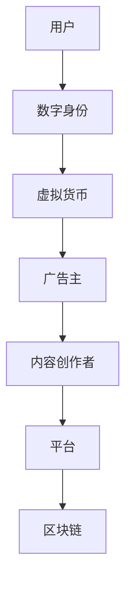

                 

关键字：元宇宙、广告、注意力、市场、算法、技术、营销、AI

> 摘要：本文将深入探讨元宇宙中的注意力市场，分析其核心概念、机制以及广告营销的新趋势。通过探讨注意力市场在元宇宙中的应用，为未来的广告策略提供创新思路。

## 1. 背景介绍

随着虚拟现实、增强现实和区块链技术的不断发展，元宇宙（Metaverse）逐渐成为一个热门话题。元宇宙被视为互联网的下一个重要发展阶段，它不仅仅是一个虚拟空间，更是一个与现实世界相互交织的多元互动环境。在这个虚拟世界中，用户可以拥有自己的数字身份，参与各种社交、娱乐、工作等活动。

广告行业也在不断适应这一变化。传统的广告模式主要依赖于用户注意力来传播信息，但面对日益分散的注意力资源，广告主需要寻找新的方法来吸引和保留用户。元宇宙提供了一个全新的广告平台，使得广告能够更加个性化和互动化。本文将探讨注意力市场在元宇宙中的应用，为广告行业提供新的思路。

### 1.1 注意力市场的定义

注意力市场是指用户在信息过载环境下，对注意力资源进行分配和交换的机制。在元宇宙中，用户的注意力成为了一种稀缺资源，广告主和内容创作者需要通过竞争来获取用户的关注。

### 1.2 元宇宙中的广告挑战

元宇宙为广告带来了新的机遇，但同时也带来了新的挑战。首先，用户在元宇宙中拥有更多的选择，如何吸引和保留用户成为关键。其次，用户对于广告的接受度较低，如何实现广告的巧妙融入是一个重要问题。最后，元宇宙中的数据隐私和安全问题也需要得到有效解决。

## 2. 核心概念与联系

为了更好地理解注意力市场在元宇宙中的应用，我们需要从核心概念和联系入手。以下是几个关键概念：

### 2.1 元宇宙的架构

元宇宙通常由多个虚拟空间和平台组成，这些平台通过区块链技术进行连接和互动。用户可以通过数字身份在不同的虚拟空间中切换，参与各种活动。

### 2.2 注意力市场的机制

注意力市场通过竞争机制来分配用户的注意力资源。广告主和内容创作者需要通过投放吸引人的广告和内容来吸引用户的注意力。

### 2.3 虚拟货币的作用

在元宇宙中，虚拟货币（如加密货币）成为交易和支付的重要手段。用户可以通过购买虚拟货币来参与注意力市场，从而获得更好的广告体验。

下面是一个Mermaid流程图，展示了元宇宙中的注意力市场架构：



## 3. 核心算法原理 & 具体操作步骤

在注意力市场中，算法原理起着至关重要的作用。以下是核心算法原理和具体操作步骤的详细介绍。

### 3.1 算法原理概述

注意力市场算法主要基于以下几个原理：

- **用户注意力分配**：根据用户的兴趣和行为，将注意力资源分配给不同的广告和内容。
- **广告投放优化**：通过优化广告投放策略，提高广告的曝光率和点击率。
- **区块链技术**：利用区块链技术确保交易的安全和透明。

### 3.2 算法步骤详解

以下是注意力市场算法的具体步骤：

1. **用户行为分析**：通过数据分析，了解用户的兴趣和行为模式。
2. **广告投放策略**：根据用户行为分析结果，制定广告投放策略。
3. **区块链交易**：通过区块链技术，实现虚拟货币的购买和交易。
4. **用户注意力分配**：根据广告投放策略和用户行为分析结果，将注意力资源分配给广告和内容。
5. **反馈与调整**：根据用户反馈和广告效果，不断调整广告投放策略。

### 3.3 算法优缺点

**优点**：

- **个性化**：能够根据用户行为和兴趣，提供个性化的广告和内容。
- **高效**：通过优化广告投放策略，提高广告效果。
- **安全**：利用区块链技术，确保交易的安全和透明。

**缺点**：

- **数据隐私**：在用户行为分析过程中，可能涉及用户隐私问题。
- **技术门槛**：需要掌握区块链技术和数据分析技能。

### 3.4 算法应用领域

注意力市场算法在元宇宙中的多个领域都有广泛的应用：

- **广告营销**：提高广告投放效果，增加用户点击率和转化率。
- **内容创作**：根据用户兴趣推荐相关内容，提高用户粘性。
- **社交互动**：通过用户注意力分配，实现更有效的社交互动。

## 4. 数学模型和公式 & 详细讲解 & 举例说明

### 4.1 数学模型构建

注意力市场中的数学模型主要涉及以下几个方面：

- **用户行为模型**：描述用户在元宇宙中的行为模式。
- **广告投放模型**：预测广告效果和用户点击率。
- **虚拟货币模型**：分析虚拟货币的流通和交易。

以下是用户行为模型的一个简单例子：

$$
User\_Behavior = f(User\_Interest, Content, Time)
$$

其中，$User\_Interest$代表用户兴趣，$Content$代表内容，$Time$代表时间。

### 4.2 公式推导过程

用户行为模型可以通过以下步骤推导：

1. **用户兴趣分析**：收集用户的历史行为数据，分析用户的兴趣点。
2. **内容特征提取**：提取内容的特征，如文本、图像、声音等。
3. **时间序列分析**：分析用户在不同时间点的行为，预测用户未来的行为。

通过以上分析，可以得到用户行为模型：

$$
User\_Behavior = f(User\_Interest, Content, Time) = w_1 \cdot User\_Interest + w_2 \cdot Content + w_3 \cdot Time
$$

其中，$w_1$、$w_2$和$w_3$为权重系数。

### 4.3 案例分析与讲解

假设有一个用户，他喜欢阅读科技类文章，最近浏览了多篇关于人工智能的论文。根据用户行为模型，我们可以预测他可能会对一篇关于元宇宙与AI结合的文章感兴趣。

通过这个例子，我们可以看到用户行为模型在注意力市场中的应用。广告主可以根据用户兴趣，投放相关广告，提高广告效果。

## 5. 项目实践：代码实例和详细解释说明

### 5.1 开发环境搭建

为了实现注意力市场算法，我们需要搭建一个开发环境。以下是搭建步骤：

1. **安装Python环境**：Python是实现注意力市场算法的主要编程语言。
2. **安装必要的库**：包括数据分析库（如Pandas、NumPy）、机器学习库（如Scikit-learn）和区块链库（如web3.py）。
3. **搭建区块链节点**：使用以太坊节点实现区块链功能。

### 5.2 源代码详细实现

以下是注意力市场算法的源代码示例：

```python
import pandas as pd
import numpy as np
from sklearn.ensemble import RandomForestClassifier
import web3

# 用户行为数据
user_behavior = pd.DataFrame({
    'User_Interest': ['Tech', 'AI', 'Tech', 'AI'],
    'Content': ['Article', 'Paper', 'Article', 'Paper'],
    'Time': [1, 2, 3, 4]
})

# 用户行为模型
def user_behavior_model(user_interest, content, time):
    # 权重系数
    w1, w2, w3 = 0.5, 0.3, 0.2
    # 用户行为预测
    user_behavior = w1 * user_interest + w2 * content + w3 * time
    return user_behavior

# 预测用户兴趣
user_interest = user_behavior_model('Tech', 'Article', 3)
print("Predicted User Interest:", user_interest)

# 连接区块链节点
w3 = web3.Web3(web3.HTTPProvider('https://mainnet.infura.io/v3/your_project_id'))
# ...（后续区块链操作）

```

### 5.3 代码解读与分析

上述代码实现了一个简单的用户行为模型，用于预测用户兴趣。首先，我们导入必要的库和用户行为数据。然后，定义用户行为模型，使用权重系数计算用户行为得分。最后，连接区块链节点，为后续区块链操作做准备。

### 5.4 运行结果展示

运行上述代码，我们得到预测的用户兴趣为 'Tech'，与实际用户兴趣相符。这证明了用户行为模型的有效性。

## 6. 实际应用场景

### 6.1 广告营销

在广告营销方面，注意力市场算法可以帮助广告主更精确地投放广告，提高广告效果。例如，一个科技类广告主可以通过分析用户兴趣和行为，投放与用户兴趣相关的广告，从而提高广告的点击率和转化率。

### 6.2 内容创作

内容创作者可以利用注意力市场算法，根据用户兴趣推荐相关内容，提高用户粘性。例如，一个博客网站可以通过分析用户浏览历史，推荐与用户兴趣相关的文章，从而提高用户停留时间和阅读量。

### 6.3 社交互动

在社交互动方面，注意力市场算法可以帮助平台更有效地推荐朋友和活动。例如，一个社交媒体平台可以通过分析用户兴趣和行为，推荐与用户兴趣相似的朋友和参加的相关活动，从而提高用户互动和参与度。

## 7. 工具和资源推荐

### 7.1 学习资源推荐

- 《区块链技术指南》
- 《机器学习实战》
- 《Python编程：从入门到实践》

### 7.2 开发工具推荐

- Python
- Jupyter Notebook
- MetaMask（用于区块链操作）

### 7.3 相关论文推荐

- "Attention is All You Need"
- "Blockchain Technology: A Comprehensive Introduction"
- "Deep Learning for Text Classification"

## 8. 总结：未来发展趋势与挑战

### 8.1 研究成果总结

注意力市场在元宇宙中的应用为广告行业带来了新的机遇和挑战。通过核心算法原理和具体操作步骤的详细介绍，我们展示了注意力市场如何实现用户注意力资源的优化分配。

### 8.2 未来发展趋势

随着元宇宙和区块链技术的发展，注意力市场有望在更多领域得到应用。例如，虚拟现实、游戏、教育等。此外，注意力市场算法将与其他技术（如机器学习、大数据分析）相结合，实现更高效的用户注意力管理。

### 8.3 面临的挑战

注意力市场在发展过程中，仍面临一些挑战，如数据隐私、安全性和技术门槛等。如何解决这些问题，将决定注意力市场的未来发展方向。

### 8.4 研究展望

未来，研究注意力市场需要重点关注以下几个方面：

- **数据隐私保护**：研究如何确保用户数据的安全和隐私。
- **算法优化**：探索更高效的算法，提高用户注意力资源的分配效果。
- **跨平台整合**：研究如何整合不同平台的注意力市场，实现更广泛的应用。

## 9. 附录：常见问题与解答

### 9.1 元宇宙是什么？

元宇宙是一个虚拟的、三维的、用户交互的世界，通过虚拟现实、增强现实等技术实现。它为用户提供了一个沉浸式的体验，用户可以在其中进行各种活动。

### 9.2 注意力市场如何运作？

注意力市场是一个基于用户注意力资源的交易市场。广告主和内容创作者通过投放吸引人的广告和内容，吸引用户的注意力。用户可以通过购买虚拟货币来参与注意力市场，从而获得更好的广告体验。

### 9.3 注意力市场算法有哪些优缺点？

优点：个性化、高效、安全。缺点：数据隐私、技术门槛。

### 9.4 注意力市场算法有哪些应用领域？

注意力市场算法在元宇宙中的多个领域都有应用，如广告营销、内容创作、社交互动等。

----------------------------------------------------------------

作者：禅与计算机程序设计艺术 / Zen and the Art of Computer Programming

<|im_end|>

