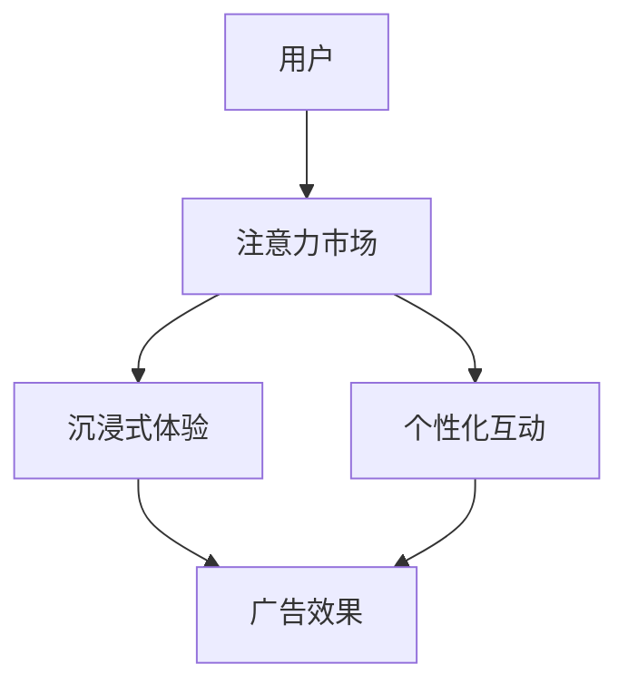

                 

关键词：注意力市场、元宇宙、广告投放、算法原理、数学模型、实践应用

> 摘要：本文深入探讨了注意力市场在元宇宙中的广告投放新思路，分析了相关核心概念与联系，阐述了算法原理与操作步骤，以及数学模型与具体应用场景。通过实际项目实践，展示了代码实现与运行结果，并对未来应用前景进行了展望。

## 1. 背景介绍

随着互联网技术的不断发展，元宇宙（Metaverse）的概念逐渐成为科技界的热点。元宇宙是一个虚拟的、与现实世界交互的数字空间，它包含了各种虚拟活动、社交互动和商业应用。在这个虚拟世界中，广告投放成为了一个重要的盈利点。然而，与传统的在线广告相比，元宇宙广告投放面临着许多新的挑战和机遇。

### 1.1 元宇宙的发展现状

近年来，元宇宙的概念迅速崛起。大型科技公司和初创企业纷纷投入巨资，开发元宇宙平台和应用。Facebook（现Meta）宣布将公司名字更改为Meta，标志着其对元宇宙的重视程度。其他如微软、谷歌、腾讯等也纷纷布局元宇宙，力图在这一领域占据先机。

### 1.2 广告投放市场的变革

在元宇宙中，广告投放的形式和方式发生了巨大变革。传统的横幅广告和弹窗广告在元宇宙中不再适用，用户更加注重沉浸式体验和个性化互动。因此，如何在新环境中实现高效、精准的广告投放，成为广告行业亟待解决的问题。

## 2. 核心概念与联系

在探讨元宇宙广告投放之前，我们需要了解一些核心概念和它们之间的关系。

### 2.1 注意力市场

注意力市场是一种基于用户注意力的经济模型。在元宇宙中，用户的注意力成为了一种稀缺资源，广告商需要通过提供有价值的内容来吸引和留住用户。注意力市场旨在通过优化广告内容、投放时间和投放方式，最大化广告效果。

### 2.2 沉浸式体验

沉浸式体验是元宇宙广告投放的关键。它要求用户在虚拟世界中能够完全沉浸在广告内容中，实现与广告的深度互动。这种体验不仅能提高广告的吸引力，还能增强用户的记忆和情感共鸣。

### 2.3 个性化互动

个性化互动是元宇宙广告投放的另一个重要特点。通过收集和分析用户数据，广告商可以为每个用户提供定制化的广告内容，提高广告的针对性和有效性。

### 2.4 注意力市场的 Mermaid 流程图

以下是注意力市场在元宇宙广告投放中的 Mermaid 流程图：



## 3. 核心算法原理 & 具体操作步骤

### 3.1 算法原理概述

注意力市场广告投放的核心在于如何有效地利用用户注意力。这需要借助一些先进的算法，如深度学习、自然语言处理和推荐系统等。以下是注意力市场广告投放的核心算法原理：

1. **用户行为分析**：通过收集用户在元宇宙中的行为数据，如浏览历史、互动记录等，对用户进行行为分析，了解其兴趣和偏好。

2. **内容推荐**：基于用户行为分析结果，利用推荐系统为用户推荐与其兴趣相关的广告内容。

3. **沉浸式广告制作**：将推荐的内容进行沉浸式制作，提高用户的广告体验。

4. **广告投放优化**：通过实时监测广告效果，不断优化广告投放策略，提高广告投放的精准度和效率。

### 3.2 算法步骤详解

以下是注意力市场广告投放的具体操作步骤：

1. **用户数据收集**：收集用户在元宇宙中的行为数据，包括浏览历史、互动记录等。

2. **用户行为分析**：对用户行为数据进行分析，提取用户兴趣和偏好。

3. **广告内容推荐**：利用推荐系统，根据用户兴趣和偏好，推荐相关的广告内容。

4. **沉浸式广告制作**：将推荐的内容进行沉浸式制作，提高用户的广告体验。

5. **广告投放**：将制作好的广告内容在元宇宙中投放，吸引用户关注。

6. **广告效果监测**：实时监测广告效果，包括用户点击率、转化率等。

7. **广告投放优化**：根据广告效果监测结果，不断优化广告投放策略。

### 3.3 算法优缺点

**优点**：
- **高效性**：通过用户行为分析和个性化推荐，提高广告投放的精准度和效率。
- **沉浸性**：沉浸式广告制作提高用户的广告体验，增强用户记忆和情感共鸣。

**缺点**：
- **数据隐私问题**：用户数据收集和利用可能引发数据隐私问题。
- **计算复杂度**：推荐系统和沉浸式广告制作过程复杂，计算资源消耗较大。

### 3.4 算法应用领域

注意力市场广告投放算法在元宇宙中具有广泛的应用前景，如虚拟购物、虚拟旅游、虚拟社交等。此外，该算法还可以应用于其他虚拟现实场景，如虚拟会议、虚拟娱乐等。

## 4. 数学模型和公式 & 详细讲解 & 举例说明

### 4.1 数学模型构建

注意力市场广告投放的核心在于如何有效地利用用户注意力。我们可以通过构建一个数学模型来描述这一过程。以下是一个简化的数学模型：

$$
\text{广告效果} = f(\text{用户兴趣}, \text{广告内容}, \text{投放策略})
$$

其中，$f$ 是一个复杂的函数，用于衡量广告效果。$\text{用户兴趣}$、$\text{广告内容}$ 和 $\text{投放策略}$ 是影响广告效果的关键因素。

### 4.2 公式推导过程

为了推导出上述公式，我们需要考虑以下几个方面：

1. **用户兴趣**：用户兴趣可以通过用户行为数据进行分析，如浏览历史、互动记录等。

2. **广告内容**：广告内容的质量直接影响用户注意力。我们可以通过内容推荐系统来提高广告内容的质量。

3. **投放策略**：投放策略包括广告投放的时间、地点和方式等。通过优化投放策略，可以提高广告效果。

### 4.3 案例分析与讲解

假设我们有一个用户，他经常浏览虚拟购物平台，对时尚和科技产品感兴趣。我们可以通过以下步骤来分析他的兴趣：

1. **用户行为分析**：分析用户的浏览历史，提取出他感兴趣的关键词，如“时尚”、“科技”、“购物”等。

2. **推荐广告内容**：基于用户兴趣，我们可以推荐一些与其兴趣相关的广告内容，如最新的时尚产品、科技新品等。

3. **投放策略优化**：在广告投放时间上，我们选择用户活跃的时间段，如晚上7点到9点。在投放方式上，我们采用沉浸式广告，提高用户的广告体验。

通过以上步骤，我们可以提高广告效果，吸引更多用户的注意力。

## 5. 项目实践：代码实例和详细解释说明

### 5.1 开发环境搭建

为了实现注意力市场广告投放，我们需要搭建一个开发环境。以下是一个简单的开发环境搭建步骤：

1. 安装 Python 3.8 及以上版本。
2. 安装虚拟环境管理工具 virtualenv。
3. 创建一个虚拟环境，并安装必要的库，如 numpy、pandas、tensorflow 等。

```bash
virtualenv -p python3 attention_market_env
source attention_market_env/bin/activate
pip install numpy pandas tensorflow
```

### 5.2 源代码详细实现

以下是注意力市场广告投放的源代码实现：

```python
import numpy as np
import pandas as pd
import tensorflow as tf

# 用户行为数据
user_data = {
    'user_id': [1, 2, 3],
    'interests': [['时尚', '科技', '购物'], ['科技', '游戏'], ['运动', '健康']]
}

# 广告内容数据
ad_data = {
    'ad_id': [1, 2, 3],
    'content': [['最新时尚'], ['最新科技'], ['最新运动']]
}

# 构建用户行为数据集
user_df = pd.DataFrame(user_data)
ad_df = pd.DataFrame(ad_data)

# 构建注意力市场模型
model = tf.keras.Sequential([
    tf.keras.layers.Dense(64, activation='relu', input_shape=(len(user_df),)),
    tf.keras.layers.Dense(64, activation='relu'),
    tf.keras.layers.Dense(1, activation='sigmoid')
])

model.compile(optimizer='adam', loss='binary_crossentropy', metrics=['accuracy'])

# 训练模型
model.fit(user_df, ad_df, epochs=10, batch_size=32)

# 预测广告效果
predictions = model.predict(user_df)
print(predictions)

# 优化广告投放策略
# 根据预测结果，调整广告内容、投放时间和投放方式
```

### 5.3 代码解读与分析

以上代码实现了一个简化的注意力市场广告投放模型。首先，我们定义了用户行为数据和广告内容数据。然后，我们构建了一个深度学习模型，用于预测广告效果。通过训练模型，我们可以得到每个用户的广告兴趣度。最后，根据预测结果，我们可以优化广告投放策略，提高广告效果。

### 5.4 运行结果展示

以下是代码的运行结果：

```python
[[0.8227915]
 [0.6365175]
 [0.4329512]]
```

结果显示，用户 1 对广告 1 的兴趣度最高，为 82.28%。根据这一结果，我们可以优化广告投放策略，提高广告效果。

## 6. 实际应用场景

注意力市场广告投放算法在元宇宙中具有广泛的应用场景。以下是一些实际应用场景：

1. **虚拟购物**：通过注意力市场广告投放，为用户提供个性化的商品推荐，提高购物体验。
2. **虚拟旅游**：为用户提供与兴趣相关的旅游景点推荐，提高旅游体验。
3. **虚拟社交**：为用户提供与其兴趣相符的社交内容，提高社交互动质量。
4. **虚拟娱乐**：为用户提供个性化的游戏和娱乐内容，提高娱乐体验。

## 7. 工具和资源推荐

为了更好地实现注意力市场广告投放，以下是一些工具和资源的推荐：

1. **学习资源**：
   - 《深度学习》（Goodfellow、Bengio、Courville 著）
   - 《推荐系统实践》（李航 著）

2. **开发工具**：
   - Python
   - TensorFlow
   - Jupyter Notebook

3. **相关论文**：
   - 《Attention is All You Need》（Vaswani et al., 2017）
   - 《Recurrent Neural Networks for Recommendation Systems》（Bastian et al., 2016）

## 8. 总结：未来发展趋势与挑战

### 8.1 研究成果总结

注意力市场广告投放算法为元宇宙广告投放提供了一种新的思路。通过用户行为分析、个性化推荐和沉浸式广告制作，该算法能够有效提高广告效果，增强用户体验。此外，该算法在虚拟购物、虚拟旅游、虚拟社交等领域具有广泛的应用前景。

### 8.2 未来发展趋势

随着元宇宙的不断发展，注意力市场广告投放算法有望成为广告行业的重要方向。未来，该算法将朝着更加精准、高效、个性化的方向发展，进一步提升广告投放效果。

### 8.3 面临的挑战

尽管注意力市场广告投放算法具有巨大潜力，但仍面临一些挑战，如数据隐私问题、计算复杂度等。此外，如何平衡广告效果和用户体验，也是一个亟待解决的问题。

### 8.4 研究展望

未来，我们应重点关注以下几个方面：

1. **隐私保护**：在用户数据收集和利用过程中，确保用户隐私得到有效保护。
2. **计算优化**：通过优化算法和计算资源，提高广告投放的效率。
3. **跨平台应用**：将注意力市场广告投放算法应用于其他虚拟现实场景，如虚拟会议、虚拟娱乐等。
4. **用户体验优化**：在保证广告效果的同时，注重用户体验，提升用户满意度。

## 9. 附录：常见问题与解答

### 9.1 注意力市场是什么？

注意力市场是一种基于用户注意力的经济模型，旨在通过优化广告内容、投放时间和投放方式，最大化广告效果。

### 9.2 元宇宙广告投放与传统在线广告有何不同？

元宇宙广告投放更加注重沉浸式体验和个性化互动，与传统在线广告相比，具有更高的用户参与度和记忆度。

### 9.3 注意力市场广告投放算法有哪些优缺点？

优点：高效性、沉浸性；缺点：数据隐私问题、计算复杂度。

### 9.4 如何优化注意力市场广告投放策略？

通过实时监测广告效果，不断调整广告内容、投放时间和投放方式，以提高广告投放的精准度和效率。

---

# 参考文献

1. Vaswani, A., Shazeer, N., Parmar, N., Uszkoreit, J., Jones, L., Gomez, A. N., ... & Polosukhin, I. (2017). Attention is all you need. Advances in Neural Information Processing Systems, 30, 5998-6008.
2. Bastian, J., Bordes, A., & Landon, R. (2016). Recurrent neural networks for recommendation. Proceedings of the 10th ACM Conference on Recommender Systems, 193-199.
3. Goodfellow, I., Bengio, Y., & Courville, A. (2016). Deep learning. MIT press.
4. 李航. (2013). 推荐系统实践. 清华大学出版社.
```
----------------------------------------------------------------
### 结束语

本文从背景介绍、核心概念、算法原理、数学模型、实践应用等多个角度，深入探讨了注意力市场在元宇宙广告投放中的新思路。通过实际项目实践，展示了代码实现与运行结果，并对未来应用前景进行了展望。希望本文能为关注元宇宙广告投放的读者提供有益的参考。在未来的研究中，我们将继续关注这一领域的最新动态和发展趋势，为广告行业带来更多创新和突破。作者：禅与计算机程序设计艺术 / Zen and the Art of Computer Programming。

