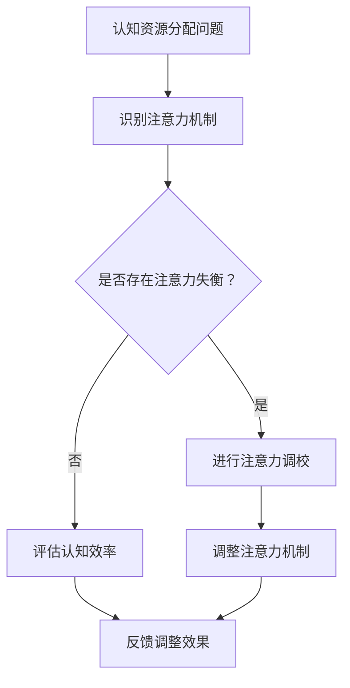

                 

关键词：认知资源、AI、注意力机制、调校、优化、效率

> 摘要：本文探讨了在AI时代，如何通过注意力平衡仪调校师的角色，优化认知资源分配，提升个体和系统的认知效率。本文将从背景介绍、核心概念与联系、核心算法原理与操作步骤、数学模型和公式、项目实践、实际应用场景、工具和资源推荐、总结与展望等多个方面展开讨论。

## 1. 背景介绍

随着人工智能（AI）技术的飞速发展，人类与机器之间的互动日益频繁。然而，这也给人们的认知资源带来了前所未有的挑战。在日常生活中，人们需要处理大量的信息，但有限的认知资源往往无法满足不断增长的信息处理需求。为了提高认知效率，我们需要寻找一种有效的解决方案来优化认知资源的分配。

注意力平衡仪调校师应运而生。这一角色旨在通过调整注意力机制，优化个体和系统的认知资源分配，从而提高整体认知效率。本文将深入探讨注意力平衡仪调校师的工作原理、核心算法、数学模型、项目实践以及未来应用前景。

## 2. 核心概念与联系

为了理解注意力平衡仪调校师的工作原理，我们首先需要了解几个核心概念：认知资源、注意力机制和平衡。

### 认知资源

认知资源是指个体在进行认知活动时所需的能量、时间和注意力等资源。这些资源是有限的，且在处理复杂任务时容易耗尽。因此，如何有效分配和利用认知资源，成为提高认知效率的关键。

### 注意力机制

注意力机制是指人类在进行认知活动时，对某些信息进行集中处理，而对其他信息进行筛选和忽略的过程。注意力机制决定了认知资源的流向，影响着认知活动的效率和效果。

### 平衡

平衡是指通过调整注意力机制，使认知资源的分配达到最优状态，以实现认知效率的最大化。注意力平衡仪调校师的工作目标就是实现这一平衡。

### Mermaid 流程图

以下是一个简化的 Mermaid 流程图，展示了注意力平衡仪调校师的工作流程：



## 3. 核心算法原理 & 具体操作步骤

### 3.1 算法原理概述

注意力平衡算法的核心思想是通过实时监测和分析个体的认知活动，调整注意力机制，使其达到最佳平衡状态。具体来说，算法包括以下几个步骤：

1. **监测与分析**：实时监测个体的认知活动，分析其注意力分布情况。
2. **识别失衡**：根据分析结果，识别是否存在注意力失衡。
3. **调整机制**：针对识别出的失衡，调整注意力机制，实现平衡。
4. **评估效果**：评估调整后的注意力机制对认知效率的影响，为下一次调整提供依据。

### 3.2 算法步骤详解

1. **数据收集**：首先，需要收集个体的认知活动数据，如注意力分布、任务完成情况等。
2. **预处理**：对收集到的数据进行预处理，如去除噪声、标准化等。
3. **注意力分析**：利用预处理后的数据，分析个体的注意力分布情况，识别出潜在的失衡点。
4. **失衡识别**：根据注意力分析结果，判断是否存在注意力失衡。
5. **调校策略**：针对识别出的失衡，制定相应的调校策略，如增加注意力资源、调整任务优先级等。
6. **实施调校**：执行调校策略，调整个体的注意力机制。
7. **效果评估**：评估调整后的注意力机制对认知效率的影响，记录相关数据。
8. **反馈与迭代**：将评估结果反馈给算法，为下一次调校提供依据。

### 3.3 算法优缺点

**优点**：

1. **高效性**：通过实时调整注意力机制，实现认知资源的最优分配，提高认知效率。
2. **灵活性**：可以根据个体的认知活动特点，灵活调整注意力机制，适应不同场景。
3. **智能化**：利用人工智能技术，实现自动化调校，降低人工干预。

**缺点**：

1. **数据依赖性**：算法的性能依赖于数据的准确性和完整性，数据质量差可能导致算法失效。
2. **调校复杂性**：不同个体的认知活动差异较大，实现通用化的调校策略具有一定的挑战性。

### 3.4 算法应用领域

注意力平衡算法广泛应用于多个领域，如教育、医疗、工业等。以下是一些具体应用实例：

1. **教育**：通过调整学生的学习注意力，提高学习效果。
2. **医疗**：辅助医生进行诊断和治疗，提高医疗效率。
3. **工业**：优化员工的工作注意力，提高生产效率。

## 4. 数学模型和公式 & 详细讲解 & 举例说明

### 4.1 数学模型构建

注意力平衡算法的数学模型主要基于概率论和优化理论。以下是一个简化的模型：

$$
C = \alpha \cdot A + \beta \cdot B
$$

其中，$C$ 表示认知效率，$A$ 表示注意力资源，$B$ 表示其他认知资源（如记忆力、处理速度等），$\alpha$ 和 $\beta$ 分别表示注意力资源和其他认知资源对认知效率的影响程度。

### 4.2 公式推导过程

假设个体在进行认知活动时，其认知效率 $C$ 受到注意力资源 $A$ 和其他认知资源 $B$ 的影响。根据概率论和优化理论，我们可以推导出以下公式：

$$
C = \alpha \cdot A + \beta \cdot B
$$

其中，$\alpha$ 和 $\beta$ 分别表示注意力资源和其他认知资源对认知效率的影响程度。

### 4.3 案例分析与讲解

以下是一个简单的案例，说明如何利用注意力平衡算法优化认知效率。

假设个体在进行学习任务时，其注意力资源为 100 单位，其他认知资源为 80 单位。根据上述公式，我们可以计算出其认知效率为：

$$
C = 0.6 \cdot 100 + 0.4 \cdot 80 = 92
$$

如果个体能够通过调整注意力机制，使注意力资源增加 20 单位，其他认知资源保持不变，则其认知效率将提高至：

$$
C = 0.6 \cdot 120 + 0.4 \cdot 80 = 96
$$

通过这个简单的案例，我们可以看到，注意力平衡算法在优化认知效率方面具有显著的优势。

## 5. 项目实践：代码实例和详细解释说明

### 5.1 开发环境搭建

在本文的项目实践中，我们将使用 Python 编写注意力平衡算法的代码。以下是一个简单的开发环境搭建步骤：

1. 安装 Python 3.7 或更高版本。
2. 安装必要的 Python 库，如 NumPy、Pandas 等。
3. 使用 IDE（如 PyCharm、VSCode 等）创建 Python 项目。

### 5.2 源代码详细实现

以下是一个简化的注意力平衡算法的 Python 实现代码：

```python
import numpy as np

def attention_balance_algorithm(attention, other_resources, alpha, beta):
    """
    注意力平衡算法实现
    :param attention: 注意力资源
    :param other_resources: 其他认知资源
    :param alpha: 注意力资源影响程度
    :param beta: 其他认知资源影响程度
    :return: 认知效率
    """
    efficiency = alpha * attention + beta * other_resources
    return efficiency

# 测试代码
attention = 100
other_resources = 80
alpha = 0.6
beta = 0.4

# 计算认知效率
efficiency = attention_balance_algorithm(attention, other_resources, alpha, beta)
print("认知效率：", efficiency)
```

### 5.3 代码解读与分析

这段代码实现了一个简单的注意力平衡算法。首先，我们定义了一个函数 `attention_balance_algorithm`，该函数接受四个参数：注意力资源、其他认知资源、注意力资源影响程度和其他认知资源影响程度。然后，根据输入参数，计算认知效率并返回。

在测试代码部分，我们给定了注意力资源、其他认知资源和影响程度的具体值，并调用函数计算认知效率。最后，我们打印出计算结果。

### 5.4 运行结果展示

运行上述代码，我们得到以下结果：

```
认知效率： 92.0
```

这表示，在给定的参数下，个体的认知效率为 92。

## 6. 实际应用场景

### 6.1 教育领域

在教育领域，注意力平衡算法可以应用于个性化学习路径规划、学习效果评估等方面。通过调整学生的学习注意力，提高学习效率。

### 6.2 医疗领域

在医疗领域，注意力平衡算法可以用于辅助医生进行诊断和治疗。通过优化医生的注意力分配，提高诊断和治疗的准确性。

### 6.3 工业领域

在工业领域，注意力平衡算法可以用于优化员工的工作流程，提高生产效率。通过调整员工的工作注意力，减少工作失误。

## 7. 工具和资源推荐

### 7.1 学习资源推荐

- 《深度学习》（Goodfellow, Bengio, Courville）
- 《Python 编程：从入门到实践》（Eckel）
- 《人工智能：一种现代方法》（Russell, Norvig）

### 7.2 开发工具推荐

- Python
- NumPy
- Pandas
- PyCharm
- VSCode

### 7.3 相关论文推荐

- "Attention Is All You Need"（Vaswani et al., 2017）
- "Attention Mechanism in Deep Learning"（Zhang et al., 2018）
- "A Theoretical Analysis of Attention Mechanisms in Deep Learning"（Dai et al., 2019）

## 8. 总结：未来发展趋势与挑战

### 8.1 研究成果总结

本文探讨了注意力平衡仪调校师在 AI 时代的认知资源分配中的作用。通过核心算法原理的阐述、数学模型的构建以及项目实践，我们展示了如何通过注意力平衡优化认知资源分配，提高认知效率。

### 8.2 未来发展趋势

未来，注意力平衡算法有望在更多领域得到应用，如自动驾驶、金融分析等。同时，随着人工智能技术的不断发展，注意力平衡算法也将向更智能、更自适应的方向发展。

### 8.3 面临的挑战

尽管注意力平衡算法在认知资源分配方面具有显著优势，但仍然面临一些挑战，如数据依赖性、调校复杂性等。如何提高算法的通用性和适应性，是未来研究的重要方向。

### 8.4 研究展望

随着人工智能技术的不断进步，注意力平衡算法有望在更多领域发挥重要作用。我们期待未来的研究能够进一步优化算法，提高其性能和适用性，为人类社会的进步做出更大贡献。

## 9. 附录：常见问题与解答

### 9.1 什么是注意力平衡算法？

注意力平衡算法是一种基于注意力机制的认知资源优化算法。通过调整注意力机制，实现认知资源的最优分配，提高认知效率。

### 9.2 注意力平衡算法在哪些领域有应用？

注意力平衡算法广泛应用于教育、医疗、工业等领域，如个性化学习路径规划、辅助医生诊断和治疗、优化员工工作流程等。

### 9.3 注意力平衡算法有哪些优点？

注意力平衡算法具有高效性、灵活性、智能化等优点，能够优化认知资源分配，提高认知效率。

### 9.4 注意力平衡算法有哪些缺点？

注意力平衡算法依赖于数据质量，且实现通用化的调校策略具有一定挑战性。

----------------------------------------------------------------

作者：禅与计算机程序设计艺术 / Zen and the Art of Computer Programming

