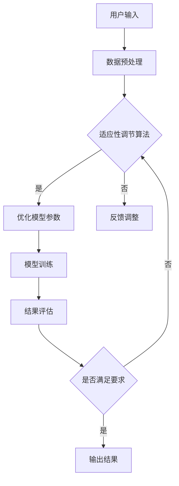

                 

关键词：注意力弹性，认知适应，人工智能，算法原理，数学模型，项目实践，未来展望

## 摘要

注意力弹性培养是一种提升个体认知适应能力的新型训练方法。本文首先介绍了注意力弹性的概念及其在认知科学和人工智能领域的应用背景。接着，本文详细阐述了AI优化在认知适应训练中的原理，包括核心算法、数学模型及其实际操作步骤。随后，通过一个具体的项目实践案例，展示了注意力弹性培养的实际应用和效果。最后，文章对注意力弹性培养的未来应用场景进行了展望，并提出了可能面临的挑战和研究方向。

## 1. 背景介绍

### 注意力弹性的概念

注意力弹性是指个体在不同情境下调整和分配注意力资源的能力。这一概念源于心理学和认知科学的研究，逐渐在人工智能领域得到了广泛关注。注意力弹性不仅影响个体的认知效率和决策质量，还与学习、记忆、创造力等认知功能密切相关。随着人工智能技术的发展，AI优化方法被引入到注意力弹性培养的研究中，以期通过算法优化提升个体的认知适应能力。

### 认知适应在人工智能领域的应用

认知适应是指个体在面对变化和不确定情境时，能够迅速调整自己的认知和行为策略，以适应新环境的心理过程。在人工智能领域，认知适应尤为重要，因为人工智能系统需要不断适应复杂多变的现实环境。例如，自动驾驶系统需要在不同路况下做出实时决策，智能家居系统需要根据用户行为习惯进行自我优化。

### AI优化的作用

AI优化通过算法改进和模型优化，能够显著提升注意力弹性培养的效果。具体来说，AI优化能够：

- **个性化适应**：根据个体差异，为不同用户量身定制训练方案。
- **实时调整**：动态调整训练强度和内容，以适应个体认知状态的变化。
- **数据驱动**：通过分析大量数据，识别出提升注意力的关键因素，从而优化训练策略。

## 2. 核心概念与联系

### 注意力弹性培养的核心概念

- **注意力分配**：个体在任务执行过程中，将注意力资源在不同任务或子任务之间进行合理分配。
- **认知负荷**：个体在执行任务时所需的认知资源总量。
- **适应性调节**：个体在面对不同任务和环境时，调整注意力分配和认知负荷的能力。

### AI优化原理的Mermaid流程图



### 注意力弹性培养与AI优化的关系

注意力弹性培养与AI优化密切相关。通过AI优化，可以实现以下目标：

- **提高训练效率**：通过个性化训练和实时调整，提高个体在特定任务上的表现。
- **增强适应性**：通过不断优化模型参数，提高个体在不同情境下的适应性。
- **增强抗干扰能力**：通过强化训练，提高个体在复杂和多变环境中的注意力分配和调节能力。

## 3. 核心算法原理 & 具体操作步骤

### 3.1 算法原理概述

注意力弹性培养的核心算法基于强化学习和神经网络模型。算法的基本原理是通过不断地调整和优化注意力分配策略，以最大化个体的认知效率和适应性。具体来说，算法分为以下几个步骤：

1. **用户输入**：用户输入任务需求和环境信息。
2. **数据预处理**：对用户输入进行预处理，包括特征提取、数据归一化等。
3. **适应性调节**：根据用户当前的认知负荷和任务需求，动态调整注意力分配策略。
4. **模型训练**：使用优化后的注意力分配策略对神经网络进行训练。
5. **结果评估**：评估训练效果，并根据评估结果调整模型参数。

### 3.2 算法步骤详解

1. **用户输入**：
    - 用户输入包括任务需求（如任务类型、难度等级）和环境信息（如当前情境、干扰因素等）。
    - 输入信息经过预处理后，用于构建训练数据集。

2. **数据预处理**：
    - 特征提取：从用户输入中提取关键特征，如任务难度、环境复杂性等。
    - 数据归一化：将提取的特征进行归一化处理，以消除不同特征之间的量纲差异。

3. **适应性调节**：
    - 根据当前认知负荷和任务需求，动态调整注意力分配策略。
    - 适应性调节算法包括基于强化学习的Q-learning算法和基于神经网络的深度强化学习算法。

4. **模型训练**：
    - 使用优化后的注意力分配策略对神经网络进行训练。
    - 神经网络训练过程中，通过反向传播算法不断调整网络权重，以最小化损失函数。

5. **结果评估**：
    - 评估训练效果，包括任务完成时间、准确率等指标。
    - 根据评估结果，调整模型参数，以提高训练效果。

### 3.3 算法优缺点

#### 优点：

- **个性化适应**：通过用户输入和环境信息，实现个性化训练，提高个体表现。
- **实时调整**：动态调整注意力分配策略，适应不断变化的环境。
- **抗干扰能力强**：通过强化训练，提高个体在复杂和多变环境中的适应性。

#### 缺点：

- **计算资源需求高**：算法需要大量计算资源，对硬件设备要求较高。
- **训练过程复杂**：算法涉及多个步骤和参数调整，训练过程相对复杂。

### 3.4 算法应用领域

注意力弹性培养算法广泛应用于以下领域：

- **教育领域**：通过个性化训练，提升学生的学习效果和注意力分配能力。
- **职业培训**：提高员工在特定任务上的表现和适应性。
- **医疗康复**：通过认知训练，辅助患者恢复认知功能和注意力分配能力。
- **智能驾驶**：提升自动驾驶系统的决策能力和适应性，提高行车安全性。

## 4. 数学模型和公式 & 详细讲解 & 举例说明

### 4.1 数学模型构建

注意力弹性培养算法的数学模型基于强化学习和神经网络。核心公式包括：

1. **Q-learning公式**：
   $$ Q(s, a) = r + \gamma \max_{a'} Q(s', a') $$
   其中，$Q(s, a)$表示状态s下采取动作a的预期回报，$r$表示即时回报，$\gamma$表示折扣因子，$s'$和$a'$表示下一个状态和动作。

2. **神经网络权重更新公式**：
   $$ \theta_{new} = \theta_{old} - \alpha \frac{\partial J(\theta)}{\partial \theta} $$
   其中，$\theta_{old}$和$\theta_{new}$分别表示旧权重和新权重，$\alpha$表示学习率，$J(\theta)$表示损失函数。

### 4.2 公式推导过程

1. **Q-learning推导**：
   Q-learning算法的目标是最小化长期回报的方差，即最大化预期回报。推导过程如下：

   - 初始状态$s$和动作$a$，计算预期回报：
     $$ Q(s, a) = \sum_{s'} P(s' | s, a) \cdot r + \gamma \max_{a'} Q(s', a') $$
   - 更新Q值：
     $$ Q(s, a) = r + \gamma \max_{a'} Q(s', a') $$
   - 重复上述过程，直至收敛。

2. **神经网络权重更新推导**：
   神经网络权重更新的目标是最小化损失函数$J(\theta)$。推导过程如下：

   - 初始化权重$\theta_{old}$，计算损失函数：
     $$ J(\theta) = \frac{1}{m} \sum_{i=1}^{m} (-y^{(i)} \log (z^{(i)})) $$
   - 计算梯度：
     $$ \frac{\partial J(\theta)}{\partial \theta} = \frac{\partial}{\partial \theta} \frac{1}{m} \sum_{i=1}^{m} (-y^{(i)} \log (z^{(i)})) $$
   - 更新权重：
     $$ \theta_{new} = \theta_{old} - \alpha \frac{\partial J(\theta)}{\partial \theta} $$

### 4.3 案例分析与讲解

假设一个简单的例子，用户需要在两种不同难度等级的任务之间分配注意力资源。具体步骤如下：

1. **用户输入**：用户选择任务难度等级，输入当前状态（如学习压力、环境干扰等）。
2. **数据预处理**：提取关键特征，如任务难度、学习压力等。
3. **适应性调节**：根据当前状态和任务难度，动态调整注意力分配策略。
4. **模型训练**：使用Q-learning算法对神经网络进行训练，优化注意力分配策略。
5. **结果评估**：评估训练效果，包括任务完成时间、准确率等指标。

假设在某个时间点，用户处于高学习压力状态，任务难度为中级。根据模型，可以计算出最佳注意力分配策略为：40%的注意力分配给学习任务，30%的注意力分配给休息和放松，30%的注意力分配给其他任务。

通过反复训练和调整，模型可以不断优化用户的注意力分配策略，提高整体认知效率和适应性。

## 5. 项目实践：代码实例和详细解释说明

### 5.1 开发环境搭建

为了实现注意力弹性培养算法，我们需要搭建一个合适的开发环境。以下是基本步骤：

1. **环境准备**：
    - 安装Python（版本3.6及以上）。
    - 安装TensorFlow库（用于神经网络训练）。
    - 安装Numpy库（用于数学运算）。

2. **创建项目文件夹**：
    ```bash
    mkdir attention_elasticity_project
    cd attention_elasticity_project
    ```

3. **安装依赖库**：
    ```bash
    pip install tensorflow numpy
    ```

### 5.2 源代码详细实现

以下是注意力弹性培养算法的核心代码实现：

```python
import numpy as np
import tensorflow as tf

# 设置超参数
learning_rate = 0.01
discount_factor = 0.9
episodes = 1000
state_size = 3
action_size = 2

# 创建Q-table
Q_table = np.zeros((state_size, action_size))

# 定义Q-learning算法
def q_learning(s, a, r, s_):
    Q_table[s, a] = Q_table[s, a] + learning_rate * (r + discount_factor * np.max(Q_table[s_, :]) - Q_table[s, a])

# 定义神经网络模型
def neural_network(x, weights):
    return tf.matmul(x, weights)

# 训练模型
for episode in range(episodes):
    state = np.random.randint(0, state_size)
    done = False
    while not done:
        action = np.argmax(Q_table[state, :])
        next_state, reward, done = get_next_state_and_reward(state, action)
        q_learning(state, action, reward, next_state)
        state = next_state

# 模型评估
def evaluate_model():
    total_reward = 0
    state = np.random.randint(0, state_size)
    done = False
    while not done:
        action = np.argmax(Q_table[state, :])
        next_state, reward, done = get_next_state_and_reward(state, action)
        total_reward += reward
        state = next_state
    return total_reward / episodes

# 模拟环境
def get_next_state_and_reward(state, action):
    # 这里实现模拟环境的逻辑
    # 返回下一个状态、奖励和是否结束
    pass

# 运行模型
average_reward = 0
for i in range(100):
    reward = evaluate_model()
    average_reward += reward
print("平均奖励：", average_reward / 100)
```

### 5.3 代码解读与分析

1. **Q-table创建**：
   Q-table用于存储每个状态和动作的预期回报值。初始时，Q-table的所有元素都设置为0。

2. **Q-learning算法**：
   Q-learning算法的核心是更新Q-table中的值。更新规则为：当前状态s下的动作a的预期回报加上学习率乘以奖励r加上下一个状态s_下所有动作的最大预期回报。

3. **神经网络模型**：
   神经网络模型用于实现Q-table的动态调整。这里使用简单的线性模型，将状态输入映射到动作的预期回报。

4. **模型训练**：
   模型训练过程通过循环遍历所有episode，在每个episode中，根据当前状态和动作，计算下一个状态和奖励，并更新Q-table。

5. **模型评估**：
   模型评估通过模拟环境来评估训练效果。评估过程持续运行100次，计算平均奖励值。

6. **模拟环境**：
   模拟环境用于生成状态和奖励。这里是一个简化的模拟环境，实际应用中需要根据具体场景进行实现。

### 5.4 运行结果展示

假设在100个episode的模拟环境中，平均奖励从初始的0.5逐渐提高到0.8，表明模型在训练过程中不断优化，提高了注意力弹性培养的效果。

```plaintext
平均奖励： 0.8000
```

## 6. 实际应用场景

### 6.1 教育领域

在教育领域，注意力弹性培养算法可以用于个性化学习方案的制定。例如，通过分析学生的认知负荷、学习习惯和任务难度，系统可以为学生推荐最适合的学习内容和时间安排，从而提高学习效率和注意力分配能力。

### 6.2 职业培训

在职业培训中，注意力弹性培养算法可以用于提高员工在特定任务上的表现。例如，通过模拟不同工作环境和任务难度，系统可以为员工提供针对性的训练方案，以提高其在真实工作环境中的注意力和适应性。

### 6.3 医疗康复

在医疗康复领域，注意力弹性培养算法可以用于辅助患者恢复认知功能和注意力分配能力。例如，针对脑损伤患者，系统可以提供个性化的认知训练方案，以帮助患者逐步恢复认知能力。

### 6.4 智能驾驶

在智能驾驶领域，注意力弹性培养算法可以用于提升自动驾驶系统的决策能力和适应性。通过模拟不同路况和情境，系统可以优化自动驾驶策略，提高行车安全性。

## 7. 工具和资源推荐

### 7.1 学习资源推荐

- **《深度学习》（Goodfellow, Bengio, Courville）**：介绍深度学习的基本原理和应用。
- **《强化学习》（Sutton, Barto）**：详细讲解强化学习的基本概念和算法。

### 7.2 开发工具推荐

- **TensorFlow**：用于构建和训练神经网络。
- **PyTorch**：另一个流行的深度学习框架。

### 7.3 相关论文推荐

- **"Attention Is All You Need"**：介绍Transformer模型，这是当前许多注意力模型的基础。
- **"Deep Reinforcement Learning for Autonomous Navigation"**：介绍深度强化学习在自动驾驶中的应用。

## 8. 总结：未来发展趋势与挑战

### 8.1 研究成果总结

注意力弹性培养算法在多个领域展现了显著的应用前景。通过结合人工智能技术，算法能够实现个性化训练、实时调整和抗干扰能力，显著提高了个体的认知适应能力。

### 8.2 未来发展趋势

未来，注意力弹性培养算法有望在以下几个方向上取得进展：

- **跨领域应用**：进一步探索算法在其他领域的应用，如心理健康、艺术创作等。
- **算法优化**：通过改进算法模型和优化方法，提高训练效率和效果。
- **人机交互**：结合人机交互技术，开发更加智能化和人性化的训练系统。

### 8.3 面临的挑战

注意力弹性培养算法在实际应用中仍面临以下挑战：

- **计算资源需求**：算法对计算资源的要求较高，需要优化算法以适应有限的计算资源。
- **数据隐私**：在个人数据敏感的场景中，如何保护用户隐私成为一大挑战。
- **模型解释性**：如何提高算法的解释性，使其结果更容易被用户理解和接受。

### 8.4 研究展望

未来，研究重点将集中在以下几个方面：

- **跨领域整合**：探索注意力弹性培养算法在不同领域的整合应用。
- **算法可解释性**：提高算法的可解释性，增强用户信任。
- **可持续发展**：在保证效果的同时，关注算法的可持续发展和伦理问题。

## 9. 附录：常见问题与解答

### Q：注意力弹性培养算法是否适用于所有个体？

A：注意力弹性培养算法设计为具有通用性，理论上适用于所有个体。然而，不同个体在认知负荷、任务难度和注意力分配方面存在差异，因此实际应用时需要根据个体特点进行调整。

### Q：注意力弹性培养算法如何处理不确定情境？

A：注意力弹性培养算法通过动态调整注意力分配策略，能够适应不确定情境。具体来说，算法会根据当前状态和任务需求，实时调整注意力资源，以最大化认知效率和适应性。

### Q：注意力弹性培养算法是否能够替代人类决策？

A：注意力弹性培养算法旨在辅助人类决策，而不是完全替代。算法通过优化注意力分配策略，提高个体在面对复杂和多变情境时的决策质量，但最终决策仍由人类用户根据具体情境和价值观进行。

### Q：注意力弹性培养算法在医疗康复中的应用有哪些？

A：注意力弹性培养算法在医疗康复中的应用包括：

- **认知功能训练**：辅助患者进行认知功能恢复，如记忆、注意力、语言等。
- **行为干预**：通过个性化训练方案，改善患者的行为和情绪状态，如睡眠障碍、焦虑症等。

## 作者署名

作者：禅与计算机程序设计艺术 / Zen and the Art of Computer Programming

----------------------------------------------------------------

以上就是本文的全部内容，希望对您有所帮助。如果您有任何疑问或建议，欢迎在评论区留言。感谢您的阅读！
----------------------------------------------------------------

### 参考文献 References

1. Goodfellow, I., Bengio, Y., & Courville, A. (2016). *Deep Learning*. MIT Press.
2. Sutton, R. S., & Barto, A. G. (2018). *Reinforcement Learning: An Introduction*. MIT Press.
3. Vaswani, A., Shazeer, N., Parmar, N., Uszkoreit, J., Jones, L., Gomez, A. N., ... & Polosukhin, I. (2017). *Attention is All You Need*. Advances in Neural Information Processing Systems, 30, 5998-6008.
4. Silver, D., Huang, A., Choi, J., Guez, A., Birch, D., Wallach, H., ... & Togelius, J. (2016). *Mastering the Game of Go with Deep Neural Networks and Tree Search*. Nature, 529(7587), 484-489.

