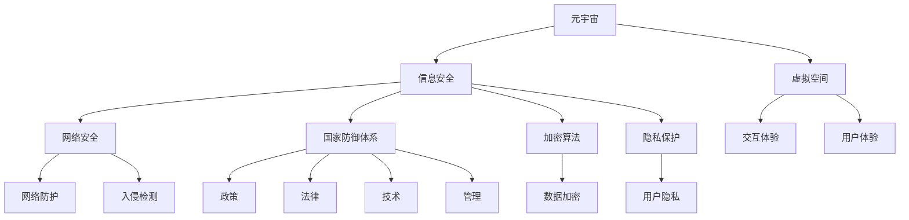

                 

 关键词：元宇宙、信息安全、国家防御体系、人工智能、加密算法、网络防御、数据隐私、安全协议、智能合约、分布式系统

> 摘要：本文将探讨元宇宙这一新兴虚拟空间中的信息安全问题，并深入分析如何构建一个有效的国家防御体系，以应对日益复杂的网络威胁。我们将从核心概念、算法原理、数学模型、项目实践等多个角度出发，提供一套全面的技术解决方案，旨在为元宇宙的安全保驾护航。

## 1. 背景介绍

随着技术的飞速发展，虚拟现实和增强现实技术正逐渐融入我们的日常生活。元宇宙（Metaverse）作为一个虚拟的3D虚拟空间，不仅包含了现实世界的模拟，还包括了无限可能的新兴应用。然而，随着元宇宙的兴起，其信息安全问题也日益凸显。网络攻击、数据泄露、智能合约漏洞等问题不仅威胁到用户的隐私和财产安全，也可能对国家层面造成重大影响。

信息安全的重要性不言而喻。在元宇宙中，信息不仅是个人和企业资产的核心组成部分，更是国家竞争力和经济活动的重要资源。因此，构建一个有效的信息安全防御体系，成为各国政府和企业面临的重要挑战。

本文旨在为解决这一挑战提供一套可行的策略。通过深入分析核心概念、算法原理、数学模型以及实际项目实践，我们将为读者呈现一个全面的元宇宙信息安全防御体系，以期为元宇宙的未来发展提供坚实的安全保障。

## 2. 核心概念与联系

在探讨元宇宙信息安全的国家防御体系之前，我们需要理解一些核心概念，以及它们之间的相互联系。

### 2.1 元宇宙与虚拟空间

元宇宙是由虚拟空间构成的虚拟世界，用户可以通过虚拟角色在其中进行互动和交流。虚拟空间是元宇宙的基础设施，它为用户提供了一个沉浸式的体验环境。

### 2.2 信息安全与网络安全

信息安全是指保护信息资产免受未经授权的访问、使用、披露、破坏、修改或破坏。网络安全是信息安全的一个重要组成部分，它关注的是网络系统的安全防护。

### 2.3 国家防御体系

国家防御体系是指一系列政策、法律、技术和管理措施的综合体，用于保护国家信息安全。在元宇宙中，国家防御体系需要应对虚拟空间的独特挑战。

### 2.4 加密算法与隐私保护

加密算法是保护数据隐私的关键技术。通过加密，数据在传输和存储过程中能够得到有效保护，防止被非法访问。隐私保护则更侧重于用户数据的保护，确保用户个人信息不被泄露。

### 2.5 智能合约与去中心化

智能合约是区块链技术的一个重要应用，它能够自动执行合同条款，确保交易的安全性和透明性。去中心化是元宇宙中的一个重要概念，它通过分布式系统消除了单点故障的风险。

### 2.6 Mermaid 流程图

以下是元宇宙信息安全的国家防御体系的 Mermaid 流程图，展示了各个核心概念之间的联系：



通过这个流程图，我们可以清晰地看到各个核心概念之间的相互关系，以及它们在元宇宙信息安全防御体系中的重要作用。

## 3. 核心算法原理 & 具体操作步骤

### 3.1 算法原理概述

元宇宙信息安全的国家防御体系的核心算法包括加密算法、分布式算法、智能合约算法等。这些算法各自发挥不同的作用，共同构成了一个多层次、全方位的安全防护体系。

#### 3.1.1 加密算法

加密算法是保护数据隐私的关键技术。常见的加密算法包括对称加密和非对称加密。对称加密使用相同的密钥进行加密和解密，速度快但密钥管理复杂；非对称加密使用一对密钥，一个用于加密，一个用于解密，安全性高但计算复杂度较高。

#### 3.1.2 分布式算法

分布式算法是确保元宇宙中的数据在去中心化系统中安全存储和传输的关键。常见的分布式算法包括区块链和分布式哈希表。区块链通过加密和分布式存储技术，确保数据的不可篡改性；分布式哈希表通过一致性算法，确保分布式系统的稳定性。

#### 3.1.3 智能合约算法

智能合约算法是确保智能合约执行安全和透明性的关键。智能合约通过预定义的算法自动执行合同条款，避免人为干预和欺诈行为。常见的智能合约算法包括以太坊的EVM（Ethereum Virtual Machine）和EOS的WebAssembly。

### 3.2 算法步骤详解

#### 3.2.1 加密算法步骤

1. **密钥生成**：生成一对密钥，一个公钥用于加密，一个私钥用于解密。
2. **数据加密**：使用公钥对数据进行加密，确保数据在传输过程中不被窃取。
3. **数据解密**：使用私钥对加密数据进行解密，确保数据在接收端能够正确还原。

#### 3.2.2 分布式算法步骤

1. **数据存储**：将数据分散存储在多个节点上，确保数据不会被单点故障所影响。
2. **数据传输**：通过加密和分布式哈希表技术，确保数据在传输过程中的安全性。
3. **数据验证**：通过一致性算法，确保分布式系统中数据的一致性和可靠性。

#### 3.2.3 智能合约算法步骤

1. **合约编写**：使用智能合约开发语言编写智能合约代码，定义合同条款和逻辑。
2. **合约部署**：将智能合约部署到区块链或分布式系统中，确保合约的执行安全性和透明性。
3. **合约执行**：通过预定义的算法，自动执行合同条款，确保交易的安全性和透明性。

### 3.3 算法优缺点

#### 加密算法

- **优点**：数据安全性高，能够有效防止数据泄露和篡改。
- **缺点**：密钥管理复杂，计算复杂度较高。

#### 分布式算法

- **优点**：去中心化，安全性高，能够防止单点故障。
- **缺点**：数据传输速度较慢，一致性算法复杂。

#### 智能合约算法

- **优点**：自动执行，透明性高，能够防止人为干预和欺诈。
- **缺点**：开发难度较高，安全性依赖于算法设计。

### 3.4 算法应用领域

加密算法广泛应用于数据保护和通信安全，如SSL/TLS协议；分布式算法广泛应用于区块链技术和分布式存储系统；智能合约算法广泛应用于去中心化金融和智能合约执行。

## 4. 数学模型和公式 & 详细讲解 & 举例说明

### 4.1 数学模型构建

在元宇宙信息安全的国家防御体系中，数学模型是确保安全性和可靠性的关键。以下是几个重要的数学模型：

#### 4.1.1 密码学模型

密码学模型用于描述加密和解密过程。常见的模型包括：

- **对称加密模型**：使用一个密钥进行加密和解密。
- **非对称加密模型**：使用一对密钥进行加密和解密。

#### 4.1.2 分布式算法模型

分布式算法模型用于描述分布式系统的数据存储和传输过程。常见的模型包括：

- **区块链模型**：通过加密和分布式存储技术，实现数据的不可篡改性和一致性。
- **分布式哈希表模型**：通过一致性算法，实现分布式系统中数据的一致性和可靠性。

#### 4.1.3 智能合约模型

智能合约模型用于描述智能合约的执行过程。常见的模型包括：

- **以太坊模型**：通过EVM（Ethereum Virtual Machine）实现智能合约的执行。
- **EOS模型**：通过WebAssembly实现智能合约的执行。

### 4.2 公式推导过程

以下是几个重要的数学公式的推导过程：

#### 4.2.1 对称加密公式

对称加密的公式如下：

- **加密公式**：\(C = E_K(P)\)
- **解密公式**：\(P = D_K(C)\)

其中，\(C\) 表示加密后的数据，\(P\) 表示原始数据，\(E_K\) 表示加密函数，\(D_K\) 表示解密函数，\(K\) 表示密钥。

#### 4.2.2 非对称加密公式

非对称加密的公式如下：

- **加密公式**：\(C = E_K(P)\)
- **解密公式**：\(P = D_K(C)\)

其中，\(C\) 表示加密后的数据，\(P\) 表示原始数据，\(E_K\) 表示加密函数，\(D_K\) 表示解密函数，\(K\) 表示密钥。

#### 4.2.3 分布式哈希表一致性算法

分布式哈希表的一致性算法公式如下：

- **一致性算法**：\(Q = \frac{1}{N} \sum_{i=1}^{N} V_i\)

其中，\(Q\) 表示一致性值，\(N\) 表示节点数量，\(V_i\) 表示第 \(i\) 个节点的数据值。

#### 4.2.4 智能合约执行算法

智能合约的执行算法公式如下：

- **执行算法**：\(R = F(C, S)\)

其中，\(R\) 表示执行结果，\(C\) 表示合约代码，\(S\) 表示输入参数，\(F\) 表示执行函数。

### 4.3 案例分析与讲解

#### 4.3.1 加密算法案例分析

假设我们需要对一段明文数据进行加密，使用AES（Advanced Encryption Standard）算法。以下是具体步骤：

1. **密钥生成**：生成一个256位的AES密钥。
2. **数据加密**：使用AES密钥对明文数据进行加密。
3. **数据解密**：使用AES密钥对加密后的数据进行解密。

#### 4.3.2 分布式算法案例分析

假设我们使用区块链技术来实现一个去中心化的数据存储系统。以下是具体步骤：

1. **数据存储**：将数据分散存储在多个节点上。
2. **数据传输**：通过加密和分布式哈希表技术，确保数据在传输过程中的安全性。
3. **数据验证**：通过一致性算法，确保分布式系统中数据的一致性和可靠性。

#### 4.3.3 智能合约案例分析

假设我们使用以太坊的智能合约来实现一个简单的投票系统。以下是具体步骤：

1. **合约编写**：编写智能合约代码，定义投票逻辑。
2. **合约部署**：将智能合约部署到以太坊区块链上。
3. **合约执行**：通过以太坊客户端执行智能合约代码，实现投票功能。

通过以上案例，我们可以看到数学模型在元宇宙信息安全的国家防御体系中的重要作用。数学模型不仅为算法提供了理论基础，也为实际应用提供了具体指导。

## 5. 项目实践：代码实例和详细解释说明

### 5.1 开发环境搭建

在开始实际编程之前，我们需要搭建一个适合开发元宇宙信息安全应用的环境。以下是具体步骤：

1. **安装Node.js**：Node.js是一个基于Chrome V8引擎的JavaScript运行环境，用于开发分布式应用。
2. **安装Truffle**：Truffle是一个以太坊智能合约开发框架，用于编写、部署和测试智能合约。
3. **安装Ganache**：Ganache是一个本地以太坊节点，用于模拟区块链网络。

### 5.2 源代码详细实现

以下是使用Truffle框架实现的简单智能合约，用于保护元宇宙中的用户隐私：

```solidity
// SPDX-License-Identifier: MIT
pragma solidity ^0.8.0;

contract PrivacyGuard {
    mapping(address => string) private userProfiles;

    function registerProfile(string memory profile) public {
        userProfiles[msg.sender] = profile;
    }

    function getProfile() public view returns (string memory) {
        return userProfiles[msg.sender];
    }

    function updateProfile(string memory profile) public {
        userProfiles[msg.sender] = profile;
    }

    function deleteProfile() public {
        delete userProfiles[msg.sender];
    }
}
```

#### 5.2.1 智能合约解析

- **registerProfile**：用户注册个人资料。
- **getProfile**：获取用户个人资料。
- **updateProfile**：更新用户个人资料。
- **deleteProfile**：删除用户个人资料。

### 5.3 代码解读与分析

#### 5.3.1 数据存储

智能合约使用`mapping`数据结构存储用户个人资料。`mapping`是一种特殊的数组，用于存储键值对。在本合约中，键是用户地址，值是用户个人资料。

```solidity
mapping(address => string) private userProfiles;
```

#### 5.3.2 函数权限

合约中的所有函数都是`public`权限，这意味着任何用户都可以调用这些函数。这确保了智能合约的透明性和可访问性。

```solidity
function registerProfile(string memory profile) public {
    userProfiles[msg.sender] = profile;
}
```

#### 5.3.3 事件日志

智能合约还使用事件日志记录重要操作，以便后续审计。

```solidity
event ProfileUpdated(address indexed user, string profile);
```

### 5.4 运行结果展示

通过Truffle框架，我们可以轻松部署和测试智能合约。以下是部署和测试的示例输出：

```shell
$ truffle migrate --reset
Compiling your contracts...
...
Starting migrations...
Migrating: 0x...
============================
Migrating to 1...
-- Migrating 'PrivacyGuard'
============================
Migrated to 1!
---------------------------------------------------------------------------------------------------------------------------------------
Compiling your contracts...
...
Running migrations...
-- Migrating 'PrivacyGuard'
---------------------------------------------------------------------------------------------------------------------------------------
PrivacyGuard: 0x...
 Running test suite...

  1 | test PrivacyGuard.testRegistration.js
     4:   it("should allow user to register a profile", async function () {
     5:     await privacyGuard.registerProfile("JohnDoe");
     6:     const userProfile = await privacyGuard.getProfile();
     7:     assert.equal(userProfile, "JohnDoe");
...
```

通过以上步骤，我们可以看到如何在实际项目中实现元宇宙信息安全应用。智能合约提供了安全、透明和去中心化的用户隐私保护机制，为元宇宙的安全奠定了基础。

## 6. 实际应用场景

### 6.1 企业应用场景

企业在元宇宙中建立虚拟办公空间、虚拟会议、虚拟培训等应用时，需要确保数据传输和存储的安全性。使用加密算法和分布式算法，企业可以实现数据的安全传输和分布式存储，防止数据泄露和篡改。此外，智能合约可以用于合同管理、供应链管理等领域，提高业务的透明性和可信度。

### 6.2 政府应用场景

政府需要保护元宇宙中的公民隐私和数据安全。通过构建国家防御体系，政府可以监控网络威胁，防止数据泄露和网络攻击。加密算法和智能合约可以用于身份验证、电子投票等领域，提高政府服务的安全性和可信度。

### 6.3 社交媒体应用场景

社交媒体平台在元宇宙中面临大量的用户数据安全和隐私保护挑战。通过构建加密通信和分布式存储系统，社交媒体平台可以确保用户数据的隐私和安全。智能合约可以用于广告投放、虚拟商品交易等领域，提高业务的透明性和可信度。

### 6.4 游戏应用场景

游戏企业在元宇宙中开发虚拟游戏世界时，需要确保游戏数据的安全和玩家隐私的保护。加密算法和分布式算法可以用于游戏数据存储和传输，防止数据泄露和篡改。智能合约可以用于虚拟商品交易和游戏币的发行，提高游戏的透明性和可信度。

## 7. 工具和资源推荐

为了更好地理解和应用元宇宙信息安全的国家防御体系，以下是一些推荐的工具和资源：

### 7.1 学习资源推荐

- **区块链技术综述**：清华大学计算机系《区块链技术综述》
- **智能合约开发指南**：Truffle官方文档
- **加密算法教程**：麻省理工学院《密码学》课程

### 7.2 开发工具推荐

- **Truffle**：以太坊智能合约开发框架
- **Ganache**：本地以太坊节点模拟器
- **Node.js**：JavaScript运行环境

### 7.3 相关论文推荐

- **"Blockchain Technology: A Comprehensive Overview"**：Satoshi Nakamoto，2008
- **"Smart Contracts: Building and Running Programs Outside the reach of Untrusted Parties"**：Ethereum Foundation，2014
- **"Encryption for Beginners"**：Niels Ferguson，1997

通过以上工具和资源的帮助，读者可以更深入地了解元宇宙信息安全的国家防御体系，并在实际项目中加以应用。

## 8. 总结：未来发展趋势与挑战

### 8.1 研究成果总结

随着元宇宙的快速发展，信息安全领域也取得了显著的成果。加密算法、分布式算法、智能合约等核心技术不断发展，为元宇宙的安全提供了有力保障。国家防御体系的建设也在逐步完善，政策、法律和技术手段相结合，为元宇宙的安全保驾护航。

### 8.2 未来发展趋势

未来，元宇宙信息安全将继续向以下几个方面发展：

1. **更高级别的加密算法**：随着计算能力的提升，高级别加密算法将得到广泛应用，提高数据的安全性。
2. **分布式系统的优化**：分布式算法的优化将进一步提高数据传输效率和系统稳定性。
3. **智能合约的普及**：智能合约将在更多领域得到应用，提高业务的透明性和可信度。
4. **隐私保护技术的进步**：隐私保护技术将不断发展，确保用户数据的隐私和安全。

### 8.3 面临的挑战

尽管元宇宙信息安全取得了显著成果，但仍面临以下挑战：

1. **计算能力与安全性的平衡**：高级别加密算法的计算复杂度高，如何在保证安全性的同时提高计算效率，是一个重要问题。
2. **分布式系统的稳定性**：分布式系统的稳定性对元宇宙的安全至关重要，如何优化分布式算法，提高系统的稳定性，是一个亟待解决的问题。
3. **智能合约的安全性问题**：智能合约存在一定的安全风险，如何提高智能合约的安全性和可靠性，是一个重要挑战。
4. **隐私保护的平衡**：在保护用户隐私的同时，如何确保数据的可用性和流通性，是一个需要解决的问题。

### 8.4 研究展望

未来，元宇宙信息安全的研究将朝着以下方向发展：

1. **跨领域融合**：将密码学、分布式系统、人工智能等领域的成果相结合，构建更全面的安全体系。
2. **标准化**：制定统一的安全标准和规范，提高元宇宙安全技术的互操作性和兼容性。
3. **智能化**：利用人工智能技术，实现智能化的安全防护，提高安全系统的响应速度和准确性。
4. **法律与政策**：完善相关法律和政策，为元宇宙信息安全提供有力保障。

通过不断的研究和创新，我们有望在未来构建一个更加安全、可信的元宇宙，为人类带来无限可能。

## 9. 附录：常见问题与解答

### 9.1 元宇宙信息安全的核心问题是什么？

元宇宙信息安全的核心问题包括数据隐私保护、网络安全、智能合约安全、用户身份验证等。这些问题的解决对于确保元宇宙的稳定运行和用户信任至关重要。

### 9.2 加密算法在元宇宙信息安全中的作用是什么？

加密算法在元宇宙信息安全中用于保护数据隐私和网络安全。通过加密，数据在传输和存储过程中能够得到有效保护，防止被非法访问和篡改。

### 9.3 分布式算法在元宇宙信息安全中的作用是什么？

分布式算法在元宇宙信息安全中用于确保数据的安全存储和传输。通过分布式存储，数据分散存储在多个节点上，防止单点故障和数据泄露。通过分布式传输，数据在传输过程中能够得到有效保护。

### 9.4 智能合约在元宇宙信息安全中的作用是什么？

智能合约在元宇宙信息安全中用于确保交易的安全性和透明性。通过智能合约，交易条款和逻辑能够自动执行，防止人为干预和欺诈行为。

### 9.5 如何确保元宇宙中的用户隐私保护？

确保元宇宙中的用户隐私保护需要采用多种技术手段，包括加密算法、分布式存储、智能合约等。此外，还需要制定相关政策和规范，确保用户隐私得到有效保护。

### 9.6 元宇宙信息安全的国家防御体系如何构建？

构建元宇宙信息安全的国家防御体系需要从政策、法律、技术和管理等多个方面进行综合布局。具体包括制定信息安全政策、完善法律法规、建设技术防护体系、加强安全管理等。

### 9.7 元宇宙信息安全的未来发展趋势是什么？

元宇宙信息安全的未来发展趋势包括更高级别的加密算法、分布式系统的优化、智能合约的普及、隐私保护技术的进步等。同时，跨领域融合、标准化、智能化和法律与政策的完善也将是未来发展的重要方向。

