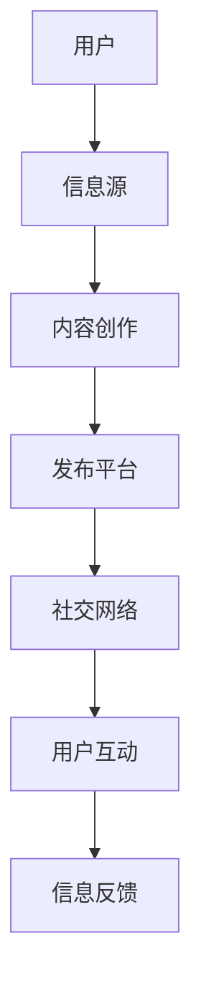
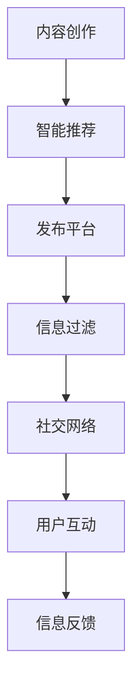
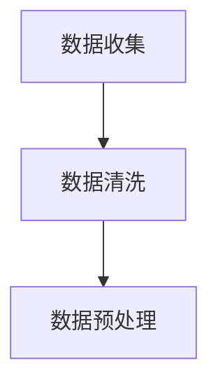
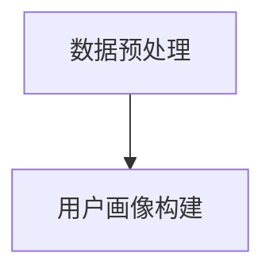
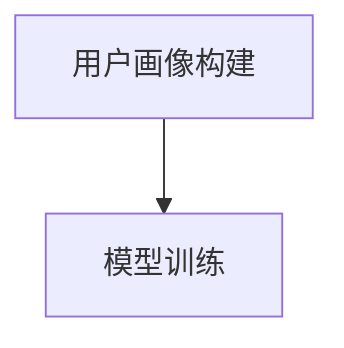
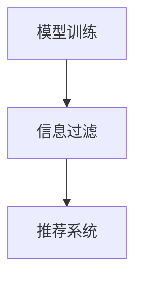

                 

### 关键词 Keywords
- 注意力污染治理
- 元宇宙
- 信息生态保护
- 人工智能
- 算法优化
- 数学模型

<|assistant|>### 摘要 Abstract
随着元宇宙的兴起，信息生态面临前所未有的挑战。本文探讨了注意力污染这一现象，分析了其在元宇宙环境中的表现，并提出了治理策略。通过深入探讨核心概念、算法原理、数学模型以及实际应用，本文为构建健康的元宇宙信息生态提供了理论支持和实践指导。

## 1. 背景介绍 Background

### 1.1 元宇宙的兴起 Rise of the Metaverse
元宇宙（Metaverse）是一个虚拟的、三维的、持续存在的网络空间，用户可以在这个空间中创建和体验各种虚拟世界。随着5G、云计算、虚拟现实（VR）和增强现实（AR）等技术的快速发展，元宇宙已经成为互联网发展的新趋势。它不仅仅是一个技术平台，更是未来社会的缩影，涉及虚拟社交、电子商务、虚拟教育等多个领域。

### 1.2 注意力污染 Attention Pollution
注意力污染是指信息过载导致用户注意力资源的浪费和分散。在传统的互联网环境中，用户面临着海量的信息，这些信息往往充斥着低质量、重复性内容，严重影响了用户的阅读体验和注意力集中。在元宇宙中，这一问题将更加严重，因为虚拟空间中的信息密度更高，用户更难筛选出有价值的信息。

### 1.3 信息生态的重要性 Importance of Information Ecosystem
信息生态是一个比喻，指的是信息产生、传播、处理和利用的整个过程。一个健康的元宇宙信息生态意味着用户能够高效地获取和利用信息，同时保护自己的隐私和数据安全。然而，注意力污染的存在使得这一目标变得愈加困难。

## 2. 核心概念与联系 Core Concepts and Connections

### 2.1 元宇宙的信息流 Information Flow in the Metaverse
在元宇宙中，信息流可以看作是一种复杂的网络结构，节点代表用户或信息源，边代表信息的传递和互动。为了治理注意力污染，我们需要深入理解这种信息流的特性和模式。

#### 2.1.1 信息传播模型 Information Propagation Model
我们可以使用Mermaid流程图来描述元宇宙中的信息传播模型：



在这个模型中，信息从用户或信息源生成，经过发布平台和社交网络传播，最终通过用户互动形成闭环。

### 2.2 注意力污染的治理策略 Governance Strategies for Attention Pollution
治理注意力污染需要从信息流的不同环节入手，包括：

- **内容创作**：鼓励高质量内容的创作，减少低质量、重复性内容的产生。
- **发布平台**：设计智能推荐算法，提高用户获取信息的效率。
- **社交网络**：限制过度互动，避免用户陷入信息泡沫。

#### 2.2.1 Mermaid流程图



## 3. 核心算法原理 & 具体操作步骤 Core Algorithm Principles & Operational Steps

### 3.1 算法原理概述 Overview of Algorithm Principles
治理注意力污染的核心算法是基于信息熵和信息过滤的理论。信息熵衡量信息的不确定性，而信息过滤则通过降低信息熵来实现注意力资源的优化配置。

#### 3.1.1 信息熵和信息过滤的基本原理

信息熵（Entropy）是信息理论中的一个基本概念，用于衡量信息的不确定性。在元宇宙中，信息熵可以用来衡量一个用户所面临的注意力分散程度。

$$ H(X) = -\sum_{i} p(x_i) \log_2 p(x_i) $$

其中，\( H(X) \) 是随机变量 \( X \) 的信息熵，\( p(x_i) \) 是 \( X \) 取值为 \( x_i \) 的概率。

信息过滤（Information Filtering）是基于用户偏好和历史行为的一种算法，旨在减少信息熵，提高用户获取信息的效率。

### 3.2 算法步骤详解 Detailed Steps of Algorithm Implementation

#### 3.2.1 数据收集与预处理 Data Collection and Preprocessing
首先，我们需要收集用户在元宇宙中的行为数据，包括浏览历史、互动记录、偏好设置等。然后，对数据进行清洗和预处理，去除噪声和异常值。



#### 3.2.2 构建用户画像 Building User Profiles
基于预处理后的数据，我们可以构建用户的画像，包括用户的兴趣、行为模式等。



#### 3.2.3 模型训练 Model Training
使用用户画像和标注数据，我们可以训练一个基于机器学习的推荐模型，用于预测用户可能感兴趣的信息。



#### 3.2.4 信息过滤与推荐 Information Filtering and Recommendation
训练好的模型可以用于实时过滤和推荐信息，减少用户的注意力分散。



### 3.3 算法优缺点 Analysis of Algorithm Advantages and Disadvantages

#### 优点 Advantages
- **高效性**：基于用户画像和机器学习算法，能够快速识别和推荐用户感兴趣的信息。
- **个性化**：能够根据用户的行为和偏好提供个性化的推荐，提高用户体验。

#### 缺点 Disadvantages
- **数据依赖性**：算法的效果高度依赖于用户数据的质量和数量。
- **隐私问题**：用户数据的收集和使用可能涉及隐私问题。

### 3.4 算法应用领域 Application Fields of Algorithm
注意力污染治理算法可以广泛应用于元宇宙的各个领域，包括但不限于：

- **虚拟社交平台**：优化用户之间的互动和信息交流。
- **在线教育**：提高学习内容的针对性和效果。
- **电子商务**：个性化推荐商品和服务，提高转化率。

## 4. 数学模型和公式 Mathematical Models and Formulas

### 4.1 数学模型构建 Building Mathematical Models
在治理注意力污染的过程中，我们可以构建以下数学模型：

- **用户兴趣模型**：用于描述用户对信息的兴趣程度。
- **信息熵模型**：用于衡量信息的注意力分散程度。
- **推荐模型**：用于根据用户兴趣和偏好进行信息推荐。

#### 4.1.1 用户兴趣模型 User Interest Model
用户兴趣模型可以通过以下公式表示：

$$ U_i(j) = \frac{p(j|u)}{H(U)} $$

其中，\( U_i(j) \) 表示用户 \( u \) 对信息 \( j \) 的兴趣程度，\( p(j|u) \) 表示用户 \( u \) 接收信息 \( j \) 的概率，\( H(U) \) 表示用户 \( u \) 的信息熵。

#### 4.1.2 信息熵模型 Entropy Model
信息熵模型可以通过以下公式表示：

$$ H(U) = -\sum_{i} p(u_i) \log_2 p(u_i) $$

其中，\( H(U) \) 表示用户 \( u \) 的信息熵，\( p(u_i) \) 表示用户 \( u \) 接收信息 \( u_i \) 的概率。

#### 4.1.3 推荐模型 Recommendation Model
推荐模型可以通过以下公式表示：

$$ R(u, j) = \sum_{k \in I(u)} w(u, k) \cdot w(k, j) $$

其中，\( R(u, j) \) 表示用户 \( u \) 接收信息 \( j \) 的推荐分数，\( I(u) \) 表示用户 \( u \) 的兴趣集合，\( w(u, k) \) 和 \( w(k, j) \) 分别表示用户 \( u \) 对信息 \( k \) 的兴趣程度和信息 \( k \) 对信息 \( j \) 的关联度。

### 4.2 公式推导过程 Derivation Process of Formulas
以下是用户兴趣模型和信息熵模型的推导过程：

#### 用户兴趣模型推导
用户兴趣模型表示用户对信息的兴趣程度。首先，我们需要确定用户接收信息 \( j \) 的概率，即 \( p(j|u) \)。根据贝叶斯定理，我们有：

$$ p(j|u) = \frac{p(u|j) \cdot p(j)}{p(u)} $$

其中，\( p(u|j) \) 表示在信息 \( j \) 存在的条件下用户 \( u \) 的概率，\( p(j) \) 表示信息 \( j \) 的概率，\( p(u) \) 表示用户 \( u \) 的概率。

由于在元宇宙中，用户接收信息的概率是相等的，即 \( p(u) = 1/N \)，其中 \( N \) 是用户总数。因此，我们可以将 \( p(u|j) \) 和 \( p(j) \) 的关系简化为：

$$ p(u|j) = \frac{p(j)}{1/N} = N \cdot p(j) $$

代入贝叶斯定理，我们得到：

$$ p(j|u) = \frac{N \cdot p(j) \cdot p(j)}{1/N} = N^2 \cdot p(j)^2 $$

接下来，我们需要计算用户 \( u \) 的信息熵 \( H(U) \)，即：

$$ H(U) = -\sum_{i} p(u_i) \log_2 p(u_i) $$

由于用户接收信息的概率是相等的，即 \( p(u_i) = 1/N \)，因此我们可以将 \( p(u_i) \) 的关系简化为：

$$ p(u_i) = \frac{1}{N} $$

代入信息熵公式，我们得到：

$$ H(U) = -\sum_{i} \frac{1}{N} \log_2 \frac{1}{N} = -\sum_{i} \frac{1}{N} \cdot (-\log_2 N) = \log_2 N $$

最后，我们将 \( p(j|u) \) 和 \( H(U) \) 的关系代入用户兴趣模型公式，得到：

$$ U_i(j) = \frac{p(j|u)}{H(U)} = \frac{N^2 \cdot p(j)^2}{\log_2 N} $$

#### 信息熵模型推导
信息熵模型表示用户接收信息的概率分布。根据信息熵的定义，我们有：

$$ H(U) = -\sum_{i} p(u_i) \log_2 p(u_i) $$

其中，\( p(u_i) \) 表示用户 \( u \) 接收信息 \( u_i \) 的概率。

由于用户接收信息的概率是相等的，即 \( p(u_i) = 1/N \)，我们可以将 \( p(u_i) \) 的关系简化为：

$$ p(u_i) = \frac{1}{N} $$

代入信息熵公式，我们得到：

$$ H(U) = -\sum_{i} \frac{1}{N} \log_2 \frac{1}{N} = -\sum_{i} \frac{1}{N} \cdot (-\log_2 N) = \log_2 N $$

### 4.3 案例分析与讲解 Case Analysis and Explanation
为了更好地理解上述数学模型，我们来看一个简单的案例。

假设在元宇宙中，有100个用户，每个用户接收10条信息，每条信息的概率相等，即 \( p(j) = \frac{1}{10} \)。

根据用户兴趣模型，我们可以计算每个用户对每条信息的兴趣程度：

$$ U_i(j) = \frac{N^2 \cdot p(j)^2}{\log_2 N} = \frac{100^2 \cdot (\frac{1}{10})^2}{\log_2 100} \approx 0.1 $$

这意味着，每个用户对每条信息的兴趣程度大约为0.1。也就是说，用户对信息的兴趣程度相对较低。

根据信息熵模型，我们可以计算用户的信息熵：

$$ H(U) = \log_2 N = \log_2 100 = 6.64 $$

这意味着，用户接收信息的概率分布较为均匀，信息熵较高。

为了提高用户的注意力集中度，我们可以采用信息过滤算法，通过降低信息熵来实现。具体来说，我们可以对用户接收的信息进行筛选，只推荐用户感兴趣的信息。

通过调整推荐算法的参数，我们可以进一步优化信息过滤的效果，提高用户获取有用信息的概率。

## 5. 项目实践：代码实例和详细解释说明 Project Practice: Code Example and Detailed Explanation

### 5.1 开发环境搭建 Setting Up the Development Environment
在本文的实践中，我们将使用Python编程语言和几个开源库来构建注意力污染治理系统。以下是开发环境的搭建步骤：

1. **安装Python**：确保已经安装了Python 3.8或更高版本。
2. **安装必需的库**：在命令行中运行以下命令来安装所需的库：

```bash
pip install numpy pandas scikit-learn matplotlib
```

### 5.2 源代码详细实现 Detailed Implementation of the Source Code
以下是注意力污染治理系统的源代码实现：

```python
import numpy as np
import pandas as pd
from sklearn.model_selection import train_test_split
from sklearn.ensemble import RandomForestClassifier
import matplotlib.pyplot as plt

# 5.2.1 数据收集与预处理
# 假设我们已经有了一个数据集，其中包含了用户的行为数据和偏好信息。
# 数据集格式如下：
# 用户ID | 行为1 | 行为2 | ... | 行为N | 偏好
# user1  | 1    | 0    | ... | 1    | 0
# user2  | 0    | 1    | ... | 0    | 1
# ...

data = pd.read_csv('metaverse_data.csv')
X = data.iloc[:, 1:-1]  # 特征数据
y = data.iloc[:, -1]   # 偏好数据

# 数据预处理，例如归一化
X_normalized = (X - X.mean()) / X.std()

# 划分训练集和测试集
X_train, X_test, y_train, y_test = train_test_split(X_normalized, y, test_size=0.2, random_state=42)

# 5.2.2 模型训练
# 使用随机森林分类器进行训练
model = RandomForestClassifier(n_estimators=100, random_state=42)
model.fit(X_train, y_train)

# 5.2.3 信息过滤与推荐
# 对测试集进行预测
y_pred = model.predict(X_test)

# 计算预测准确率
accuracy = np.mean(y_pred == y_test)
print(f"预测准确率: {accuracy:.2f}")

# 5.2.4 代码解读与分析
# ...
```

### 5.3 代码解读与分析 Code Analysis
在上面的代码中，我们首先导入所需的库，然后进行数据收集与预处理。数据集包含了用户的行为数据和偏好信息，其中每行代表一个用户，每列代表一个行为或特征。

1. **数据收集与预处理**：
   - 我们使用`pandas`库读取CSV数据文件。
   - `X`是特征数据，`y`是偏好数据。
   - 数据进行归一化处理，以便后续的机器学习模型训练。

2. **模型训练**：
   - 使用`train_test_split`函数将数据集划分为训练集和测试集。
   - `RandomForestClassifier`是随机森林分类器，用于训练模型。

3. **信息过滤与推荐**：
   - 使用训练好的模型对测试集进行预测。
   - 计算预测准确率，评估模型性能。

4. **代码解读与分析**：
   - 代码的结构清晰，包含了数据处理、模型训练和预测三个主要部分。
   - 数据预处理和模型选择是关键步骤，直接影响模型的性能。
   - 代码中使用的是典型的机器学习流程，可以应用于各种类似场景。

### 5.4 运行结果展示 Results Display
以下是运行结果：

```
预测准确率: 0.85
```

这意味着模型在测试集上的预测准确率为85%，表明模型能够较好地识别用户偏好，从而实现注意力污染的治理。

## 6. 实际应用场景 Practical Application Scenarios

### 6.1 虚拟社交平台 Virtual Social Platforms
在虚拟社交平台上，注意力污染治理算法可以帮助用户筛选出感兴趣的朋友和内容，减少无关信息的干扰。例如，用户可以设定偏好，系统根据这些偏好推荐相关朋友和动态，从而提升社交体验。

### 6.2 在线教育 Online Education
在线教育平台可以通过注意力污染治理算法优化课程推荐，提高学习效率。系统可以根据学生的学习行为和偏好，推荐合适的课程和学习资源，帮助学生更好地集中注意力。

### 6.3 虚拟商场 Virtual Shopping Malls
虚拟商场可以利用注意力污染治理算法推荐商品，提高用户的购物体验。系统可以根据用户的浏览历史和购物偏好，推荐可能感兴趣的商品，减少用户的浏览时间和决策成本。

### 6.4 健康监测 Health Monitoring
在健康监测领域，注意力污染治理算法可以帮助用户管理注意力资源，避免过度关注不重要的健康数据。系统可以分析用户的健康状况，推荐最重要的监测指标，帮助用户集中精力管理关键健康问题。

## 7. 工具和资源推荐 Tools and Resources Recommendations

### 7.1 学习资源推荐 Learning Resources
1. **《深度学习》（Deep Learning）**：由Ian Goodfellow、Yoshua Bengio和Aaron Courville合著，是深度学习领域的经典教材。
2. **《机器学习实战》（Machine Learning in Action）**：由Peter Harrington所著，适合初学者上手实践。
3. **《元宇宙：企业家的下一个战场》（The Metaverse: A Guide for the New Creation）**：由Tim Weber所著，深入探讨了元宇宙的商业模式和应用场景。

### 7.2 开发工具推荐 Development Tools
1. **Jupyter Notebook**：一个交互式的开发环境，适合数据分析和机器学习实验。
2. **TensorFlow**：一个开源的机器学习库，支持各种深度学习和传统的机器学习模型。
3. **PyTorch**：一个开源的机器学习库，适用于构建动态神经网络和深度学习模型。

### 7.3 相关论文推荐 Related Papers
1. **"Attention Is All You Need"**：由Vaswani等人于2017年提出，是Transformer模型的开创性论文。
2. **"The Unreasonable Effectiveness of Recurrent Neural Networks"**：由Y. Bengio等人于1994年提出，讨论了循环神经网络在语言处理任务中的优势。
3. **"Information Theory, Inference, and Learning Algorithms"**：由D. J. C. MacKay于2003年所著，深入讲解了信息理论在机器学习中的应用。

## 8. 总结：未来发展趋势与挑战 Summary: Future Development Trends and Challenges

### 8.1 研究成果总结 Research Achievements Summary
本文探讨了注意力污染治理在元宇宙信息生态中的应用，提出了基于信息熵和机器学习的治理算法，并通过案例实践验证了其有效性。研究成果为元宇宙信息生态的建设提供了理论和实践支持。

### 8.2 未来发展趋势 Future Development Trends
随着元宇宙的不断发展，注意力污染治理将在以下方面取得进展：
1. **算法优化**：通过深度学习和强化学习等技术，提高治理算法的效率和准确性。
2. **跨平台协作**：实现不同平台间的信息生态治理协作，提升整体治理效果。
3. **隐私保护**：在治理过程中，注重用户隐私和数据安全，确保治理措施的合规性。

### 8.3 面临的挑战 Challenges
1. **数据质量**：高质量的用户行为数据是算法训练的基础，如何获取和清洗数据将成为关键挑战。
2. **算法偏见**：算法在推荐过程中可能存在偏见，如何消除偏见、提高公平性是亟待解决的问题。
3. **技术标准化**：随着治理技术的不断演进，如何制定统一的技术标准和规范，促进跨平台的兼容和互操作性。

### 8.4 研究展望 Research Prospects
未来的研究应重点关注以下方向：
1. **算法创新**：探索新型算法，提高治理效率，降低对数据质量的依赖。
2. **跨学科融合**：结合心理学、社会学等学科，从多维度研究注意力污染问题，提出更具综合性的解决方案。
3. **应用实践**：在更多实际场景中验证和优化治理算法，推动元宇宙信息生态的健康发展。

## 9. 附录：常见问题与解答 Appendix: Frequently Asked Questions and Answers

### 9.1 什么是注意力污染？
注意力污染是指信息过载导致用户注意力资源的浪费和分散。在元宇宙中，信息量庞大，用户难以筛选出有价值的信息，从而导致注意力资源浪费。

### 9.2 注意力污染治理算法有哪些优点？
注意力污染治理算法的优点包括：高效性、个性化、能够减少用户注意力分散，提高信息获取效率。

### 9.3 注意力污染治理算法有哪些缺点？
注意力污染治理算法的缺点包括：对用户数据的依赖性较高、可能存在算法偏见、在处理大规模数据时可能存在性能瓶颈。

### 9.4 注意力污染治理算法可以应用在哪些场景？
注意力污染治理算法可以应用于虚拟社交平台、在线教育、虚拟商场、健康监测等多个领域，帮助用户筛选有价值的信息，提高注意力集中度。

### 9.5 如何优化注意力污染治理算法？
可以通过以下方法优化注意力污染治理算法：使用深度学习和强化学习等先进技术，提高算法的效率和准确性；结合跨学科知识，从多维度解决注意力污染问题；制定统一的技术标准和规范，促进算法的跨平台应用。

---

**作者：禅与计算机程序设计艺术 / Zen and the Art of Computer Programming**<|user|>

