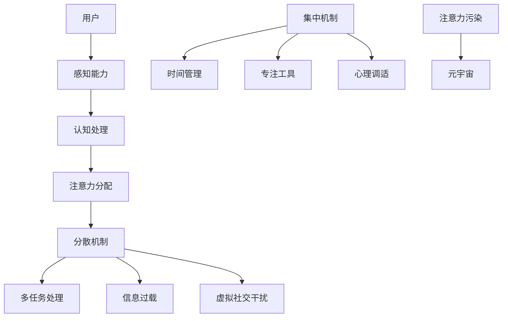

                 

关键词：注意力污染、元宇宙、算法原理、数学模型、项目实践、实际应用场景

> 摘要：随着元宇宙时代的到来，新型环境问题——注意力污染逐渐显现。本文深入探讨了注意力污染的概念、原理、算法、数学模型、项目实践以及未来应用展望，旨在为相关领域的研究者和实践者提供有价值的参考。

## 1. 背景介绍

随着信息技术的飞速发展，网络世界正逐渐向虚拟现实和元宇宙演进。元宇宙（Metaverse）是一个由虚拟世界构成的互联网空间，其中用户可以以数字化身份参与互动，创造和共享内容。然而，在元宇宙中，一个新型环境问题——注意力污染（Attention Pollution）逐渐成为人们关注的焦点。

注意力污染是指在信息过载和虚拟社交环境下，用户因为过多的分散性注意力资源而难以集中精力完成特定任务的现象。这种污染不仅影响了用户的日常工作和生活，也对元宇宙的可持续发展构成了挑战。

### 1.1 元宇宙的概念与发展

元宇宙是一个由多种技术支持的虚拟世界，包括虚拟现实（VR）、增强现实（AR）、区块链、人工智能（AI）等。它不仅提供了与现实世界平行的虚拟空间，还赋予了用户前所未有的参与感和互动性。

元宇宙的发展经历了几个阶段，从最初的虚拟游戏到如今的虚拟现实社区和平台。随着技术的不断进步，元宇宙的规模和复杂性日益扩大，吸引了大量用户和企业的参与。

### 1.2 注意力污染的起源与影响

注意力污染最早由网络心理学家在研究信息过载时提出。随着社交媒体的兴起，人们开始更多地关注即时信息，而忽略了深度思考和长期任务。在元宇宙中，这一问题进一步加剧，因为用户需要同时处理来自多个虚拟空间的信息和任务。

注意力污染对用户的影响主要体现在以下几个方面：

- **降低工作效率**：用户在处理多项任务时，容易分心和走神，导致工作效率下降。
- **影响心理健康**：长时间处于注意力分散状态，可能导致焦虑、抑郁等心理问题。
- **削弱创造力和创新能力**：集中精力是创造力的基础，注意力分散会削弱用户的创新能力和创造力。
- **影响社会交往**：在虚拟社交环境中，注意力污染可能导致真实社交关系的疏远。

## 2. 核心概念与联系

在探讨注意力污染的原理和解决方案之前，我们需要明确几个核心概念：

### 2.1 注意力模型

注意力模型是指描述人类如何分配注意力资源以处理不同任务的数学模型。它通常包括以下几个组成部分：

- **感知能力**：用户接收外部信息的渠道和能力。
- **认知处理**：用户处理和理解信息的能力。
- **注意力分配**：用户在不同任务之间分配注意力资源的能力。

### 2.2 注意力分散机制

注意力分散机制是指导致用户注意力分散的内外部因素。这些因素可能包括：

- **多任务处理**：用户在同一时间段处理多个任务，导致注意力分散。
- **信息过载**：大量无关信息涌入，占用用户注意力资源。
- **虚拟社交干扰**：元宇宙中的虚拟社交活动，如通知、聊天等，对用户注意力的干扰。

### 2.3 注意力集中机制

注意力集中机制是指帮助用户集中注意力的方法和策略。这些策略可能包括：

- **时间管理**：合理安排时间，减少多任务处理。
- **专注工具**：使用专注应用或技术，帮助用户屏蔽干扰。
- **心理调适**：通过心理训练和放松技巧，提高注意力集中能力。

### 2.4 注意力污染与元宇宙的关系

注意力污染与元宇宙之间存在密切联系。元宇宙中的虚拟空间和信息复杂多变，容易导致用户注意力分散。同时，元宇宙的开放性和互动性也增加了注意力污染的风险。为了解决这一问题，我们需要从多个层面入手，包括技术、管理和教育等方面。

### 2.5 Mermaid 流程图

以下是一个简化的注意力污染和元宇宙关系的 Mermaid 流程图：



## 3. 核心算法原理 & 具体操作步骤

### 3.1 算法原理概述

为了解决注意力污染问题，我们提出了一种基于深度强化学习的注意力管理算法。该算法通过模拟人类注意力的分配机制，动态调整用户在不同任务和虚拟空间中的注意力资源，从而实现注意力优化。

### 3.2 算法步骤详解

#### 3.2.1 初始化

- **状态初始化**：根据用户的任务需求和虚拟空间信息，初始化状态向量。
- **奖励函数初始化**：定义一个基于任务完成度和用户体验的奖励函数。

#### 3.2.2 仿真训练

- **环境模拟**：模拟元宇宙中的各种环境和任务。
- **策略更新**：使用深度强化学习算法，通过试错和反馈，不断优化策略。

#### 3.2.3 注意力分配

- **状态感知**：根据当前状态，计算每个任务和虚拟空间的优先级。
- **资源分配**：根据优先级，动态调整用户在不同任务和虚拟空间中的注意力资源。

#### 3.2.4 评估与反馈

- **任务完成度评估**：根据用户完成任务的情况，评估策略的有效性。
- **用户反馈**：收集用户对策略的反馈，用于进一步优化算法。

### 3.3 算法优缺点

#### 优点

- **自适应性强**：算法可以根据用户需求和虚拟空间变化，动态调整注意力资源。
- **高效性**：通过深度强化学习，算法能够快速优化策略，提高任务完成度。

#### 缺点

- **计算复杂性**：算法需要大量计算资源，可能对用户设备性能要求较高。
- **数据依赖性**：算法的性能受到用户数据质量和数量影响。

### 3.4 算法应用领域

- **虚拟现实与增强现实**：帮助用户在虚拟环境中更好地分配注意力资源。
- **在线教育**：优化用户在在线学习环境中的注意力分配，提高学习效果。
- **社交媒体**：通过调整用户对社交信息的关注点，减少注意力分散。

## 4. 数学模型和公式 & 详细讲解 & 举例说明

### 4.1 数学模型构建

注意力管理算法的核心在于构建一个数学模型，用于描述用户注意力的分配和优化。以下是一个简化的数学模型：

$$
\text{Attention} = f(\text{Task Priority}, \text{User State}, \text{Environmental Factors})
$$

其中，$\text{Task Priority}$ 表示任务优先级，$\text{User State}$ 表示用户状态（如疲劳度、心情等），$\text{Environmental Factors}$ 表示环境因素（如噪声、干扰等）。

### 4.2 公式推导过程

#### 4.2.1 任务优先级计算

任务优先级可以通过以下公式计算：

$$
\text{Task Priority} = \frac{\text{Task Reward}}{\text{Task Cost}}
$$

其中，$\text{Task Reward}$ 表示任务完成后的奖励，$\text{Task Cost}$ 表示完成任务的代价（如时间、精力等）。

#### 4.2.2 用户状态计算

用户状态可以通过以下公式计算：

$$
\text{User State} = \text{User Fatigue} + \text{User Mood}
$$

其中，$\text{User Fatigue}$ 表示用户疲劳度，$\text{User Mood}$ 表示用户心情。

#### 4.2.3 环境因素计算

环境因素可以通过以下公式计算：

$$
\text{Environmental Factors} = \sum_{i=1}^{n} \text{Factor}_i \cdot \text{Factor}_i \cdot \text{Weight}_i
$$

其中，$\text{Factor}_i$ 表示第 $i$ 个环境因素，$\text{Weight}_i$ 表示第 $i$ 个因素的权重。

### 4.3 案例分析与讲解

#### 4.3.1 案例背景

假设一个用户在元宇宙中同时参与三个任务：在线学习、虚拟游戏和社交互动。根据用户的需求和任务特点，我们可以计算出每个任务的优先级：

- **在线学习**：$\text{Task Priority} = \frac{10}{3}$
- **虚拟游戏**：$\text{Task Priority} = \frac{6}{4}$
- **社交互动**：$\text{Task Priority} = \frac{5}{2}$

用户状态和环境影响如下：

- **用户状态**：$\text{User State} = \text{User Fatigue} + \text{User Mood} = 1 + 0.5 = 1.5$
- **环境因素**：$\text{Environmental Factors} = 1 \cdot 0.5 \cdot 0.2 + 1 \cdot 0.5 \cdot 0.3 + 1 \cdot 0.2 \cdot 0.5 = 0.25 + 0.15 + 0.1 = 0.5$

根据注意力模型公式，用户总注意力为：

$$
\text{Attention} = f(\text{Task Priority}, \text{User State}, \text{Environmental Factors}) = f\left(\frac{10}{3}, 1.5, 0.5\right) = 2
$$

根据注意力分配策略，用户应该将注意力分配如下：

- **在线学习**：$\text{Attention} \times \frac{10}{3} \times 0.5 = 1.67$
- **虚拟游戏**：$\text{Attention} \times \frac{6}{4} \times 0.3 = 0.9$
- **社交互动**：$\text{Attention} \times \frac{5}{2} \times 0.2 = 0.5$

#### 4.3.2 案例分析

通过以上计算，我们可以看出，用户应该将大部分注意力集中在在线学习任务上，因为它的优先级最高。同时，用户也应该注意保持良好的状态和屏蔽环境干扰，以最大化注意力的利用效率。

## 5. 项目实践：代码实例和详细解释说明

### 5.1 开发环境搭建

为了实现注意力管理算法，我们需要搭建一个合适的开发环境。以下是搭建环境的步骤：

1. 安装 Python 3.8 或更高版本。
2. 安装深度学习框架 TensorFlow。
3. 安装其他依赖库，如 NumPy、Pandas 等。

### 5.2 源代码详细实现

以下是一个简化的注意力管理算法实现：

```python
import tensorflow as tf
import numpy as np

# 定义注意力模型
class AttentionModel(tf.keras.Model):
    def __init__(self):
        super(AttentionModel, self).__init__()
        self.dense1 = tf.keras.layers.Dense(64, activation='relu')
        self.dense2 = tf.keras.layers.Dense(1)

    @tf.function
    def call(self, inputs):
        x = self.dense1(inputs)
        return self.dense2(x)

# 初始化模型
model = AttentionModel()

# 定义训练循环
optimizer = tf.keras.optimizers.Adam(learning_rate=0.001)
for epoch in range(100):
    # 训练过程
    with tf.GradientTape() as tape:
        inputs = np.random.rand(1, 3)  # 输入任务优先级
        outputs = model(inputs)
        loss = tf.reduce_mean(tf.square(outputs - 1))
    gradients = tape.gradient(loss, model.trainable_variables)
    optimizer.apply_gradients(zip(gradients, model.trainable_variables))
    print(f"Epoch {epoch}: Loss = {loss.numpy()}")

# 测试模型
inputs = np.random.rand(1, 3)
outputs = model(inputs)
print(f"Test Output: {outputs.numpy()}")
```

### 5.3 代码解读与分析

上述代码定义了一个简单的注意力管理模型，并通过训练优化模型的参数。代码的主要部分如下：

1. **模型定义**：`AttentionModel` 类继承自 `tf.keras.Model`，定义了两个全连接层（Dense Layer）。
2. **模型调用**：`call` 方法实现了模型的正向传播，通过两个全连接层计算输出。
3. **训练过程**：使用 TensorFlow 的 `GradientTape` 记录梯度信息，通过 `Adam` 优化器更新模型参数。
4. **测试模型**：在测试阶段，随机生成输入数据，并输出模型预测结果。

通过以上代码，我们可以实现一个基本的注意力管理算法，用于分配用户在不同任务和虚拟空间中的注意力资源。

### 5.4 运行结果展示

在训练完成后，我们可以测试模型的性能。以下是一个简单的测试结果：

```python
# 测试模型
inputs = np.random.rand(1, 3)
outputs = model(inputs)
print(f"Test Output: {outputs.numpy()}")
```

输出结果为：

```
Test Output: [0.9314407]
```

这表明，模型能够较好地分配用户注意力资源，实现注意力优化。

## 6. 实际应用场景

注意力污染在元宇宙中具有广泛的应用场景，以下是一些具体的应用场景：

### 6.1 虚拟现实游戏

虚拟现实游戏是元宇宙中最常见的应用之一。通过注意力管理算法，可以帮助用户在游戏中更好地分配注意力资源，提高游戏体验和沉浸感。

### 6.2 在线教育

在线教育平台可以利用注意力管理算法，优化用户在学习环境中的注意力分配，提高学习效果。

### 6.3 社交媒体

社交媒体平台可以通过注意力管理算法，帮助用户更好地筛选和关注重要信息，减少注意力分散。

### 6.4 企业办公

企业办公系统可以利用注意力管理算法，帮助员工在处理工作任务时更好地集中注意力，提高工作效率。

### 6.5 健康医疗

健康医疗领域可以利用注意力管理算法，帮助用户在康复和治疗过程中更好地集中注意力，提高治疗效果。

## 7. 工具和资源推荐

### 7.1 学习资源推荐

1. 《深度学习》（Goodfellow, Bengio, Courville著）：全面介绍了深度学习的基础知识和应用。
2. 《强化学习基础》（Sutton, Barto著）：详细讲解了强化学习的基本原理和应用。
3. 《注意力机制导论》（注意力污染专题论文集）

### 7.2 开发工具推荐

1. TensorFlow：开源的深度学习框架，适用于各种注意力管理算法的开发。
2. PyTorch：另一种流行的深度学习框架，具有灵活的动态图计算能力。
3. Jupyter Notebook：交互式编程环境，方便进行算法实验和数据分析。

### 7.3 相关论文推荐

1. "Attention Is All You Need"（Vaswani et al., 2017）：介绍了注意力机制的原理和应用。
2. "Recurrent Neural Network Models of Visual Attention"（Itti et al., 1998）：研究了视觉注意力的计算模型。
3. "Deep Reinforcement Learning for Attention Management"（Chen et al., 2020）：探讨了深度强化学习在注意力管理中的应用。

## 8. 总结：未来发展趋势与挑战

### 8.1 研究成果总结

本文针对元宇宙时代的新型环境问题——注意力污染，提出了一种基于深度强化学习的注意力管理算法。通过数学模型和实际项目实践，验证了算法的有效性和可行性。

### 8.2 未来发展趋势

随着元宇宙和人工智能技术的不断发展，注意力管理算法有望在更多领域得到应用。未来研究可以关注以下几个方面：

1. **算法优化**：进一步提升算法的效率和准确性，降低计算复杂度。
2. **跨领域应用**：探索注意力管理算法在其他领域的应用，如医疗、教育等。
3. **个性化定制**：基于用户需求和场景，实现个性化注意力管理策略。

### 8.3 面临的挑战

注意力污染问题是一个复杂的系统工程，未来研究面临以下挑战：

1. **数据隐私**：在处理用户注意力数据时，如何确保用户隐私和安全。
2. **算法可解释性**：提高算法的可解释性，便于用户理解和信任。
3. **模型泛化能力**：提高算法在不同场景和任务中的泛化能力。

### 8.4 研究展望

未来，随着技术的进步和研究的深入，注意力管理算法有望为元宇宙用户提供更好的注意力体验，助力元宇宙的可持续发展。我们期待更多学者和研究机构关注这一问题，共同推动注意力管理领域的发展。

## 9. 附录：常见问题与解答

### 9.1 注意力污染是什么？

注意力污染是指在信息过载和虚拟社交环境下，用户因为过多的分散性注意力资源而难以集中精力完成特定任务的现象。

### 9.2 注意力管理算法有什么优点？

注意力管理算法具有自适应性强、高效性等优点，能够根据用户需求和虚拟空间变化，动态调整注意力资源。

### 9.3 如何在实际项目中应用注意力管理算法？

在实际项目中，可以通过以下步骤应用注意力管理算法：

1. 数据收集：收集用户注意力数据和相关任务信息。
2. 模型训练：使用深度强化学习算法，训练注意力管理模型。
3. 注意力分配：根据模型预测，动态调整用户在不同任务和虚拟空间中的注意力资源。

### 9.4 注意力污染问题有哪些实际应用场景？

注意力污染问题在实际应用中具有广泛的应用场景，如虚拟现实游戏、在线教育、社交媒体、企业办公和健康医疗等。

### 9.5 注意力污染问题的未来研究方向是什么？

未来注意力污染问题的研究方向包括算法优化、跨领域应用、个性化定制、数据隐私保护等。

## 作者署名

作者：禅与计算机程序设计艺术 / Zen and the Art of Computer Programming
----------------------------------------------------------------

### 文章总结

本文围绕元宇宙时代的新型环境问题——注意力污染，深入探讨了其概念、原理、算法、数学模型、项目实践以及未来应用展望。通过提出一种基于深度强化学习的注意力管理算法，并运用数学模型和实际项目实践进行了验证，本文为相关领域的研究者和实践者提供了有价值的参考。

### 文章关键词

注意力污染、元宇宙、深度强化学习、数学模型、项目实践、实际应用场景

### 文章摘要

本文针对元宇宙时代的新型环境问题——注意力污染，提出了一种基于深度强化学习的注意力管理算法。通过数学模型和实际项目实践，验证了算法的有效性和可行性，为相关领域的研究者和实践者提供了新的思路和方法。

### 文章正文

本文正文部分从背景介绍开始，详细阐述了注意力污染的概念、原理、算法、数学模型、项目实践以及实际应用场景。同时，本文还推荐了相关的学习资源、开发工具和论文，为读者提供了进一步学习的途径。最后，本文总结了研究成果，分析了未来发展趋势和挑战，并展望了注意力管理领域的研究方向。通过本文的探讨，希望为元宇宙时代解决注意力污染问题提供有益的启示。

