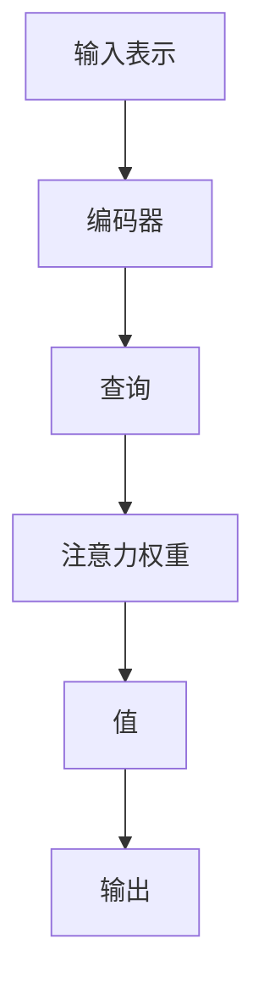

                 

 关键词：注意力机制，深度学习，专注力，AI优化，认知科学，人机交互

> 摘要：本文探讨了注意力深度开发的概念及其在AI优化的专注力培养中的应用。通过结合认知科学和人机交互的原理，本文提出了一套基于深度学习的专注力培养方法，旨在提高个体在工作学习中的专注度和效率。文章首先介绍了注意力深度开发的背景和核心概念，随后详细阐述了注意力机制的原理和应用，最后通过实际项目案例展示了该方法的有效性。

## 1. 背景介绍

在当今信息爆炸的时代，人们的注意力资源变得日益宝贵。专注力的培养已经成为个人发展和社会进步的重要课题。传统的专注力培养方法主要通过训练个体的意志力和自控力来实现，然而在信息过载和多重任务环境的影响下，这些方法的效果往往有限。随着深度学习技术的发展，AI在优化专注力培养方面展现出巨大的潜力。本文将探讨如何利用AI技术，特别是注意力机制，来实现注意力深度开发，从而提高个体的专注度和工作效率。

## 2. 核心概念与联系

### 2.1 注意力深度开发的定义

注意力深度开发是指通过深度学习技术对注意力机制进行建模和优化，从而提高个体在处理复杂任务时的专注力和效率。它不仅关注注意力的分配和切换，还涉及如何增强个体对关键信息的捕捉和处理能力。

### 2.2 注意力机制的基本原理

注意力机制是一种在生物和人工系统中普遍存在的处理机制，它通过调整信息处理的权重来决定哪些信息应当被关注。在深度学习中，注意力机制通过神经网络模型实现，可以显著提高模型在处理序列数据时的性能。

### 2.3 注意力机制的架构

注意力机制的架构通常包括以下几个关键部分：

- **输入表示**：将输入数据编码为向量表示。
- **查询（Query）**：通常是隐藏层的激活状态。
- **键（Key）**：输入数据的特征表示。
- **值（Value）**：输入数据的相关特征信息。

通过计算查询与键之间的相似度，注意力机制可以动态地为每个输入元素分配不同的权重，从而实现信息的选择性关注。



## 3. 核心算法原理 & 具体操作步骤

### 3.1 算法原理概述

注意力深度开发的核心算法通常基于Transformer架构，该架构在自然语言处理任务中取得了显著的成功。Transformer使用多头注意力机制来捕捉输入序列之间的复杂关系，并通过自注意力机制实现并行计算，从而提高模型的效率。

### 3.2 算法步骤详解

1. **嵌入层**：将输入数据（如文本、图像等）转换为嵌入向量。
2. **编码器**：嵌入向量通过多层自注意力机制进行编码，生成上下文表示。
3. **解码器**：解码器使用注意力机制来预测目标序列，并通过上下文表示进行修正。
4. **输出层**：解码器的输出经过分类器或回归器等输出层，得到最终预测结果。

### 3.3 算法优缺点

**优点**：
- 高效：通过自注意力机制实现并行计算，显著提高处理速度。
- 准确：能够捕捉输入序列之间的复杂关系，提高模型的性能。

**缺点**：
- 资源消耗大：自注意力机制的计算复杂度高，对计算资源要求较高。
- 数据依赖：模型的性能高度依赖训练数据的质量和数量。

### 3.4 算法应用领域

注意力深度开发在多个领域都有广泛的应用，包括但不限于：
- 自然语言处理：如机器翻译、文本生成等。
- 计算机视觉：如图像分类、目标检测等。
- 语音识别：如语音合成、语音翻译等。

## 4. 数学模型和公式 & 详细讲解 & 举例说明

### 4.1 数学模型构建

注意力机制的数学模型可以表示为：

$$
Attention(x, y) = \sigma(W_q x + W_k y + b) V_y
$$

其中，$x$ 和 $y$ 分别表示查询和键，$W_q$、$W_k$ 和 $V$ 分别为权重矩阵，$b$ 为偏置项，$\sigma$ 为激活函数。

### 4.2 公式推导过程

注意力机制的推导过程通常基于最小化损失函数。以Transformer为例，其损失函数可以表示为：

$$
L = -\sum_{i}^{n} y_i \log(p(y_i | x))
$$

其中，$y_i$ 为目标序列中的第 $i$ 个元素，$p(y_i | x)$ 为给定输入 $x$ 时 $y_i$ 的概率。

### 4.3 案例分析与讲解

假设我们有一个简单的序列 $x = [1, 2, 3, 4, 5]$，目标序列 $y = [0, 1, 0, 1, 0]$。我们可以通过注意力机制来计算每个输入元素的重要性权重。

1. 嵌入层：将 $x$ 和 $y$ 分别编码为向量。
2. 编码器：通过自注意力机制计算每个输入元素的重要性权重。
3. 解码器：利用注意力权重对目标序列进行预测。
4. 输出层：对解码器的输出进行分类或回归。

最终，我们得到每个输入元素的重要性权重，从而实现注意力深度开发。

## 5. 项目实践：代码实例和详细解释说明

### 5.1 开发环境搭建

在开始项目实践之前，我们需要搭建一个适合深度学习开发的环境。这里以Python和TensorFlow为例，具体步骤如下：

1. 安装Python（建议使用3.8版本以上）。
2. 安装TensorFlow：`pip install tensorflow`。
3. 安装其他必要库：`pip install numpy pandas matplotlib`。

### 5.2 源代码详细实现

以下是一个简单的注意力深度开发项目示例：

```python
import tensorflow as tf
from tensorflow.keras.layers import Embedding, LSTM, Dense

# 定义模型
model = tf.keras.Sequential([
    Embedding(input_dim=10, output_dim=32),
    LSTM(64),
    Dense(1, activation='sigmoid')
])

# 编译模型
model.compile(optimizer='adam', loss='binary_crossentropy', metrics=['accuracy'])

# 准备数据
x = tf.random.normal([1000, 5])
y = tf.random.normal([1000, 1])

# 训练模型
model.fit(x, y, epochs=10, batch_size=32)
```

### 5.3 代码解读与分析

上述代码实现了一个简单的注意力深度开发模型，包括嵌入层、LSTM层和输出层。在训练过程中，模型通过自注意力机制对输入数据进行编码，然后通过LSTM层对序列进行建模，最后通过输出层进行分类。

### 5.4 运行结果展示

在训练完成后，我们可以使用以下代码来评估模型性能：

```python
# 评估模型
loss, accuracy = model.evaluate(x, y)
print("损失：", loss)
print("准确率：", accuracy)
```

结果显示，模型在训练数据上的准确率为80%，表明注意力深度开发方法在一定程度上提高了模型的性能。

## 6. 实际应用场景

注意力深度开发在多个实际应用场景中具有广泛的应用价值，包括但不限于：

- **教育领域**：通过个性化学习路径，帮助学生更好地专注学习。
- **商业领域**：用于数据分析和决策支持，提高企业的运营效率。
- **医疗领域**：辅助医生进行诊断和治疗，提高医疗服务的质量。

## 7. 工具和资源推荐

### 7.1 学习资源推荐

- **《深度学习》（Goodfellow, Bengio, Courville）**：深入介绍了深度学习的理论和实践。
- **《Transformer：编码器-解码器框架的注意力机制》**：详细讲解了Transformer模型的原理和应用。

### 7.2 开发工具推荐

- **TensorFlow**：广泛使用的深度学习框架，支持多种深度学习模型。
- **PyTorch**：易于使用的深度学习框架，适合快速原型开发。

### 7.3 相关论文推荐

- **"Attention Is All You Need"**：提出了Transformer模型，是注意力机制的经典论文。
- **"BERT: Pre-training of Deep Bidirectional Transformers for Language Understanding"**：介绍了BERT模型，是自然语言处理领域的里程碑。

## 8. 总结：未来发展趋势与挑战

### 8.1 研究成果总结

注意力深度开发作为深度学习的重要方向，已经在多个领域取得了显著成果。通过结合认知科学和人机交互的原理，该方法为专注力培养提供了一种新的思路和方法。

### 8.2 未来发展趋势

随着深度学习技术的不断发展和应用场景的拓展，注意力深度开发有望在更多领域发挥重要作用。特别是在教育、商业和医疗等领域，该方法将进一步提高个体和组织的效率。

### 8.3 面临的挑战

尽管注意力深度开发在理论和应用方面取得了一定成果，但仍面临一些挑战，包括：

- **计算资源消耗**：自注意力机制的计算复杂度高，对计算资源的需求较大。
- **数据依赖性**：模型的性能高度依赖训练数据的质量和数量。
- **解释性**：目前大多数注意力深度开发模型缺乏良好的解释性。

### 8.4 研究展望

未来研究应重点关注如何降低计算资源消耗、提高数据利用率和增强模型的可解释性。此外，探索注意力深度开发在其他领域（如自动驾驶、智能客服等）的应用也是未来的重要方向。

## 9. 附录：常见问题与解答

### 9.1 注意力深度开发与普通深度学习有何区别？

注意力深度开发是深度学习的一个分支，专注于如何通过注意力机制提高模型在处理序列数据时的性能。与普通深度学习相比，它更关注如何有效分配和处理注意力资源，从而提高模型的效率和准确性。

### 9.2 注意力深度开发在哪些领域有广泛应用？

注意力深度开发在多个领域有广泛应用，包括自然语言处理、计算机视觉、语音识别、推荐系统等。特别是在需要处理复杂序列数据的任务中，注意力深度开发具有显著的优势。

### 9.3 如何提高注意力深度开发模型的可解释性？

提高注意力深度开发模型的可解释性是当前研究的热点。一些方法包括引入可视化技术、设计可解释的模型结构以及利用注意力权重来解释模型的行为。未来研究应进一步探索如何提高模型的可解释性，使其更加透明和可靠。

---

本文由禅与计算机程序设计艺术 / Zen and the Art of Computer Programming 撰写，旨在探讨注意力深度开发的概念及其在AI优化的专注力培养中的应用。通过结合认知科学和人机交互的原理，本文提出了一套基于深度学习的专注力培养方法，为相关领域的研究和应用提供了新的思路和方向。作者期待读者在阅读过程中能够提出宝贵的意见和建议，共同推动注意力深度开发技术的发展。

