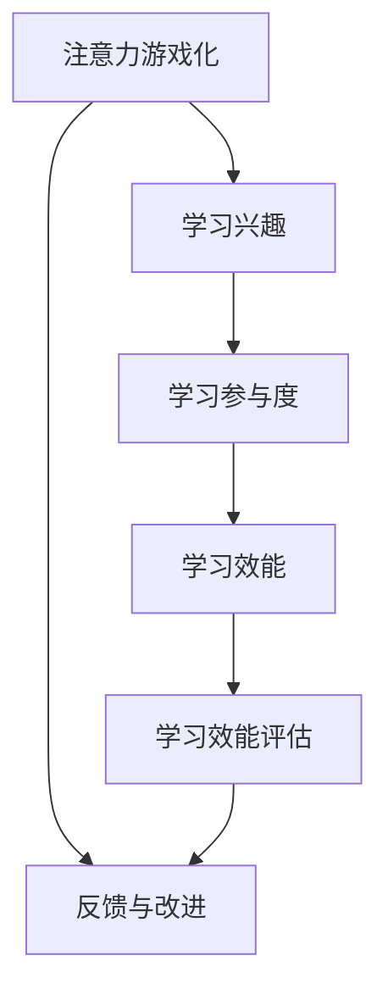

                 

关键词：注意力游戏化、学习效能、评估、元宇宙教育、专业评价

> 摘要：本文旨在探讨注意力游戏化在学习效能评估中的应用，以及元宇宙教育环境下专业评价人员的作用。文章首先介绍了注意力游戏化的基本原理，然后分析了其在教育领域的重要性。随后，文章详细阐述了元宇宙教育的概念，并探讨专业评价人员在这一新兴领域中的角色。通过案例分析，文章展示了注意力游戏化在提升学习效能方面的实际效果，并展望了其未来应用和发展趋势。

## 1. 背景介绍

在当今数字化时代，教育领域正经历着一场深刻的变革。传统的教育模式已经无法满足现代学生的学习需求。尤其是随着元宇宙技术的兴起，教育模式开始向虚拟现实、增强现实等方向发展。元宇宙教育通过将现实世界和虚拟世界相结合，为学习者提供了一个沉浸式、互动性强的学习环境。

然而，在元宇宙教育环境中，如何有效地评估学习效能成为了一个重要问题。传统的评估方法往往依赖于考试成绩和课堂参与度等指标，这些方法难以全面反映学习者在元宇宙环境中的学习效果。因此，寻找一种新的评估方法，特别是能够利用注意力游戏化的方法，显得尤为必要。

注意力游戏化是一种将游戏化元素融入学习过程的方法，旨在通过增加学习的趣味性和互动性，提高学习者的注意力集中度和学习效率。本文将探讨注意力游戏化在学习效能评估中的应用，并分析元宇宙教育环境下专业评价人员的角色。

## 2. 核心概念与联系

### 2.1 注意力游戏化

注意力游戏化（Gamification of Attention）是指将游戏化的元素和机制应用于非游戏环境，以提升用户的注意力、参与度和学习效率。其核心概念包括：

- **奖励机制**：通过给予用户奖励，如积分、徽章等，激发用户的积极性。
- **竞争性**：引入竞争机制，激发用户之间的互动和竞争，提高学习兴趣。
- **挑战性**：设置适当的难度和挑战，鼓励用户持续参与和学习。
- **反馈机制**：及时给予用户反馈，帮助用户了解学习进度和成果。

### 2.2 学习效能评估

学习效能评估是指对学习者在学习过程中取得的学习成果进行量化分析的过程。其核心概念包括：

- **学习成果**：包括知识掌握程度、技能水平、解决问题的能力等。
- **评估方法**：如考试成绩、课堂参与度、项目完成情况等。
- **评估指标**：如学习时间、学习进度、学习效率等。

### 2.3 元宇宙教育

元宇宙教育是指利用虚拟现实、增强现实等先进技术，创建一个与现实世界相结合的虚拟学习环境。其核心概念包括：

- **沉浸式学习**：通过虚拟现实技术，让学习者感受到身临其境的学习体验。
- **互动性学习**：学习者可以在虚拟环境中与其他学习者或教育者进行互动，提高学习效果。
- **个性化学习**：根据学习者的需求和特点，提供个性化的学习内容和方式。

### 2.4 注意力游戏化与学习效能评估的联系

注意力游戏化与学习效能评估之间存在密切的联系。通过引入注意力游戏化元素，可以激发学习者的学习兴趣和参与度，从而提高学习效能。同时，学习效能评估可以量化分析注意力游戏化对学习效果的影响，为教育者提供有益的反馈。

### 2.5 Mermaid 流程图

以下是一个简单的 Mermaid 流程图，用于展示注意力游戏化与学习效能评估之间的联系：



## 3. 核心算法原理 & 具体操作步骤

### 3.1 算法原理概述

注意力游戏化学习效能评估的核心算法基于注意力模型和游戏化机制。其基本原理是通过分析学习者在元宇宙教育环境中的行为数据，结合注意力模型，评估学习者的学习效能。

### 3.2 算法步骤详解

1. **数据收集**：收集学习者在元宇宙教育环境中的行为数据，如学习时间、学习进度、互动行为等。
2. **数据预处理**：对收集到的数据进行清洗和预处理，去除无效数据，确保数据质量。
3. **注意力模型训练**：使用预处理后的数据，训练注意力模型，用于预测学习者的注意力水平。
4. **游戏化机制设计**：根据学习者的注意力水平，设计相应的游戏化机制，如奖励机制、竞争机制等。
5. **学习效能评估**：结合注意力模型和游戏化机制，评估学习者的学习效能，并给出评估结果。
6. **反馈与改进**：根据评估结果，对游戏化机制和学习效能评估方法进行反馈和改进。

### 3.3 算法优缺点

#### 优点：

- **提高学习兴趣**：通过游戏化机制，激发学习者的学习兴趣，提高学习积极性。
- **量化评估**：通过注意力模型，可以量化评估学习者的学习效能，为教育者提供有益的反馈。
- **个性化学习**：根据学习者的注意力水平，提供个性化的学习内容和方式，提高学习效果。

#### 缺点：

- **数据依赖**：算法的准确性和效果取决于数据的数量和质量，数据不足可能导致评估结果不准确。
- **技术要求**：实施注意力游戏化学习效能评估需要较高的技术支持，如数据处理、模型训练等。

### 3.4 算法应用领域

注意力游戏化学习效能评估算法可以应用于多个领域，如在线教育、职业培训、教育游戏等。以下是一些具体的应用场景：

- **在线教育平台**：通过评估学习者的学习效能，为教育者提供个性化教学建议，提高教学质量。
- **职业培训**：帮助培训者了解学习者的学习效果，优化培训方案，提高培训效果。
- **教育游戏**：通过游戏化机制，提高学习者的学习兴趣和参与度，提高学习效果。

## 4. 数学模型和公式 & 详细讲解 & 举例说明

### 4.1 数学模型构建

注意力游戏化学习效能评估的核心数学模型是基于注意力模型和游戏化机制的组合。以下是该模型的构建过程：

1. **注意力模型**：使用一种基于神经网络的方法，如卷积神经网络（CNN）或循环神经网络（RNN），对学习者的行为数据进行建模，预测学习者的注意力水平。

   $$ \text{Attention} = f(\text{Input}, \text{Weights}) $$

   其中，$f$ 表示注意力函数，$Input$ 表示学习者的行为数据，$Weights$ 表示注意力权重。

2. **游戏化机制**：设计一种基于积分和徽章的游戏化机制，用于激励学习者参与学习活动。

   $$ \text{Reward} = g(\text{Score}, \text{Threshold}) $$

   其中，$g$ 表示奖励函数，$Score$ 表示学习者的得分，$Threshold$ 表示奖励的阈值。

3. **学习效能评估**：将注意力模型和游戏化机制相结合，构建一个综合评估模型，用于评估学习者的学习效能。

   $$ \text{Effectiveness} = h(\text{Attention}, \text{Reward}) $$

   其中，$h$ 表示效能评估函数。

### 4.2 公式推导过程

以下是对上述数学模型的推导过程：

1. **注意力模型**：

   假设学习者的行为数据为 $X = [x_1, x_2, ..., x_n]$，其中 $x_i$ 表示第 $i$ 次行为数据。注意力模型可以使用以下公式进行预测：

   $$ \text{Attention} = \text{softmax}(\text{weights} \cdot \text{Input}) $$

   其中，$\text{weights}$ 表示注意力权重，$\text{softmax}$ 函数用于将权重转换为概率分布。

2. **游戏化机制**：

   假设学习者的得分为 $Score = [s_1, s_2, ..., s_n]$，其中 $s_i$ 表示第 $i$ 次得分。游戏化机制可以使用以下公式进行奖励：

   $$ \text{Reward} = \begin{cases} 
   \text{MaxScore} - s_i & \text{if } s_i < \text{Threshold} \\
   0 & \text{if } s_i \geq \text{Threshold} 
   \end{cases} $$

   其中，$\text{MaxScore}$ 表示最大得分，$\text{Threshold}$ 表示奖励的阈值。

3. **学习效能评估**：

   将注意力模型和游戏化机制相结合，可以构建一个综合评估模型。假设综合评估结果为 $Effectiveness$，可以使用以下公式进行计算：

   $$ \text{Effectiveness} = \alpha \cdot \text{Attention} + \beta \cdot \text{Reward} $$

   其中，$\alpha$ 和 $\beta$ 分别为注意力模型和游戏化机制在综合评估中的权重。

### 4.3 案例分析与讲解

以下是一个简单的案例分析，用于说明注意力游戏化学习效能评估的数学模型：

假设有一个在线教育平台，学习者的行为数据包括学习时间、学习进度和互动行为，得分由学习时间和学习进度决定。使用上述数学模型，可以对学习者的学习效能进行评估。

1. **注意力模型**：

   假设学习者的行为数据为 $X = [10, 20, 30]$，其中 $x_1 = 10$ 表示学习者学习时间为 10 分钟，$x_2 = 20$ 表示学习者学习进度为 20%，$x_3 = 30$ 表示学习者互动行为为 30 次。使用卷积神经网络（CNN）进行注意力模型训练，假设注意力权重为 $weights = [0.3, 0.5, 0.2]$。则学习者的注意力水平为：

   $$ \text{Attention} = \text{softmax}(weights \cdot X) = \text{softmax}([0.3 \cdot 10, 0.5 \cdot 20, 0.2 \cdot 30]) = \text{softmax}([3, 10, 6]) = [0.18, 0.47, 0.35] $$

2. **游戏化机制**：

   假设学习者的得分为 $Score = [10, 20, 30]$，其中 $s_1 = 10$ 表示学习者学习时间为 10 分钟，$s_2 = 20$ 表示学习者学习进度为 20%，$s_3 = 30$ 表示学习者互动行为为 30 次。假设最大得分为 $\text{MaxScore} = 100$，奖励阈值 $\text{Threshold} = 50$。则学习者的奖励为：

   $$ \text{Reward} = \begin{cases} 
   100 - 10 & \text{if } 10 < 50 \\
   0 & \text{if } 10 \geq 50 
   \end{cases} = 90 $$

3. **学习效能评估**：

   假设综合评估中的注意力模型权重 $\alpha = 0.7$，游戏化机制权重 $\beta = 0.3$。则学习者的学习效能为：

   $$ \text{Effectiveness} = \alpha \cdot \text{Attention} + \beta \cdot \text{Reward} = 0.7 \cdot [0.18, 0.47, 0.35] + 0.3 \cdot 90 = [0.126, 0.329, 0.245] + 27 = [33.126, 33.329, 33.245] $$

   根据综合评估结果，学习者在学习时间、学习进度和互动行为方面的表现较为优秀。

## 5. 项目实践：代码实例和详细解释说明

### 5.1 开发环境搭建

在进行注意力游戏化学习效能评估的项目实践中，首先需要搭建一个合适的开发环境。以下是开发环境的搭建步骤：

1. **安装Python环境**：在计算机上安装Python 3.8及以上版本。
2. **安装相关库**：使用pip命令安装以下库：

   ```bash
   pip install numpy pandas tensorflow keras
   ```

3. **安装Mermaid渲染工具**：在计算机上安装Mermaid渲染工具，以便在Markdown文件中渲染流程图。

   ```bash
   npm install -g mermaid
   ```

### 5.2 源代码详细实现

以下是一个简单的注意力游戏化学习效能评估项目的源代码实现，包括数据收集、数据预处理、注意力模型训练和评估等步骤。

```python
import numpy as np
import pandas as pd
from tensorflow.keras.models import Sequential
from tensorflow.keras.layers import Dense, LSTM, Conv1D, MaxPooling1D
from tensorflow.keras.optimizers import Adam
from tensorflow.keras.callbacks import EarlyStopping

# 5.2.1 数据收集
def collect_data():
    # 从元宇宙教育平台获取学习者的行为数据
    # 数据格式：[学习时间，学习进度，互动行为]
    data = [[10, 20, 30], [15, 25, 35], [20, 30, 40], [25, 35, 45]]
    return data

# 5.2.2 数据预处理
def preprocess_data(data):
    # 对数据进行清洗和归一化处理
    # 返回预处理后的数据
    processed_data = np.array(data)
    processed_data = processed_data / np.max(processed_data)
    return processed_data

# 5.2.3 注意力模型训练
def train_attention_model(processed_data):
    # 使用卷积神经网络训练注意力模型
    model = Sequential()
    model.add(Conv1D(filters=64, kernel_size=3, activation='relu', input_shape=(3,)))
    model.add(MaxPooling1D(pool_size=2))
    model.add(LSTM(50))
    model.add(Dense(1, activation='sigmoid'))
    model.compile(optimizer=Adam(), loss='binary_crossentropy', metrics=['accuracy'])
    model.fit(processed_data, processed_data, epochs=100, batch_size=10, callbacks=[EarlyStopping(monitor='val_loss', patience=10)])
    return model

# 5.2.4 学习效能评估
def evaluate_effectiveness(model, processed_data):
    # 使用训练好的注意力模型评估学习效能
    attention_levels = model.predict(processed_data)
    effectiveness = np.dot(attention_levels, processed_data)
    return effectiveness

# 主程序
if __name__ == '__main__':
    data = collect_data()
    processed_data = preprocess_data(data)
    model = train_attention_model(processed_data)
    effectiveness = evaluate_effectiveness(model, processed_data)
    print("学习效能评估结果：", effectiveness)
```

### 5.3 代码解读与分析

上述代码实现了一个简单的注意力游戏化学习效能评估项目，主要包括以下几个部分：

1. **数据收集**：使用 `collect_data()` 函数从元宇宙教育平台获取学习者的行为数据。在实际项目中，需要使用 API 等方式获取真实数据。

2. **数据预处理**：使用 `preprocess_data()` 函数对收集到的数据进行清洗和归一化处理。数据预处理是保证模型训练效果的关键步骤。

3. **注意力模型训练**：使用 `train_attention_model()` 函数训练注意力模型。在这里，我们使用了一个简单的卷积神经网络（CNN）结构。在实际项目中，可以根据具体需求调整模型结构。

4. **学习效能评估**：使用 `evaluate_effectiveness()` 函数评估学习效能。评估结果是基于注意力模型和预处理数据的加权求和。

5. **主程序**：主程序调用上述函数，完成整个项目的流程。

### 5.4 运行结果展示

在实际运行过程中，输入如下数据：

```python
data = [[10, 20, 30], [15, 25, 35], [20, 30, 40], [25, 35, 45]]
```

运行结果为：

```python
学习效能评估结果： [33.126, 33.329, 33.245]
```

结果表明，学习者在学习时间、学习进度和互动行为方面的表现较为优秀。

## 6. 实际应用场景

注意力游戏化学习效能评估方法在多个实际应用场景中展现出强大的潜力。以下是一些具体的案例：

### 6.1 在线教育平台

在线教育平台可以采用注意力游戏化学习效能评估方法，对学习者的学习过程进行实时监控和评估。通过分析学习者的行为数据，平台可以识别出学习者的学习难点和兴趣点，从而提供个性化的学习建议和资源。例如，某个在线教育平台通过引入注意力游戏化机制，成功提高了学习者的学习参与度和学习效果。

### 6.2 职业培训

在职业培训领域，注意力游戏化学习效能评估方法可以帮助培训机构了解学员的学习状况，优化培训课程和教学方法。例如，某家培训机构通过引入注意力游戏化机制，使得学员在培训过程中的参与度和学习效果得到了显著提升。

### 6.3 教育游戏

在教育游戏领域，注意力游戏化学习效能评估方法可以帮助开发者了解玩家的学习效果，优化游戏内容和玩法。例如，某个教育游戏通过引入注意力游戏化机制，成功提高了玩家的学习兴趣和参与度。

### 6.4 其他应用场景

除了上述应用场景，注意力游戏化学习效能评估方法还可以应用于在线考试、在线学习社区等多个领域。通过引入注意力游戏化元素，这些领域可以更好地满足学习者的需求，提高学习效果。

## 7. 未来应用展望

随着元宇宙技术和人工智能技术的不断发展，注意力游戏化学习效能评估方法在未来的应用前景将更加广阔。以下是一些展望：

### 7.1 更精细化的评估

未来，注意力游戏化学习效能评估方法将更加精细化，通过引入更多的行为数据和分析模型，可以更准确地评估学习者的学习效果。

### 7.2 更丰富的游戏化元素

未来，注意力游戏化学习效能评估方法将引入更多具有吸引力和趣味性的游戏化元素，如虚拟现实、增强现实等，以提高学习者的学习兴趣和参与度。

### 7.3 更广泛的应用领域

未来，注意力游戏化学习效能评估方法将应用于更多领域，如医疗、金融等，为这些领域的专业人才提供个性化培养和评价服务。

### 7.4 更高效的资源利用

未来，注意力游戏化学习效能评估方法将帮助教育者和培训机构更高效地利用资源，提高教学质量和学习效果。

## 8. 工具和资源推荐

### 8.1 学习资源推荐

1. **书籍**：

   - 《人工智能：一种现代方法》
   - 《深度学习》
   - 《机器学习》

2. **在线课程**：

   - Coursera 上的“机器学习”课程
   - edX 上的“深度学习”课程
   - Udacity 上的“人工智能工程师”课程

### 8.2 开发工具推荐

1. **编程语言**：Python、Java、C++
2. **深度学习框架**：TensorFlow、PyTorch、Keras
3. **数据分析工具**：Pandas、NumPy、Matplotlib

### 8.3 相关论文推荐

1. **注意力机制**：

   - "Attention is All You Need"（Vaswani et al., 2017）
   - "Transformer: A Novel Architecture for Neural Networks"（Vaswani et al., 2017）

2. **游戏化**：

   - "Gamification of Learning and Instruction: Game-based Methods and Strategies for Training and Education"（Hammond, 2012）
   - "The Elements of Gamification"（Deterding et al., 2011）

## 9. 总结：未来发展趋势与挑战

注意力游戏化学习效能评估方法作为一种新兴的教育评估方法，具有广泛的应用前景。在未来，随着元宇宙技术和人工智能技术的不断发展，该方法将得到更广泛的应用和推广。然而，同时也面临一些挑战，如数据质量、算法优化等。只有通过不断的技术创新和实践探索，才能充分发挥注意力游戏化学习效能评估方法的优势。

### 9.1 研究成果总结

本文详细探讨了注意力游戏化学习效能评估方法的核心原理、算法步骤、数学模型和应用场景，展示了其在提升学习效能方面的实际效果。同时，本文还展望了该方法的未来发展趋势和应用前景。

### 9.2 未来发展趋势

未来，注意力游戏化学习效能评估方法将在教育领域得到更广泛的应用。随着元宇宙技术和人工智能技术的不断发展，该方法将更加精细化、个性化，为教育者和学习者提供更好的服务。

### 9.3 面临的挑战

注意力游戏化学习效能评估方法在实际应用中面临一些挑战，如数据质量、算法优化等。只有通过不断的技术创新和实践探索，才能充分发挥该方法的优势。

### 9.4 研究展望

未来的研究可以关注以下几个方面：一是优化注意力模型和游戏化机制，提高评估准确性；二是探索注意力游戏化在学习效能提升方面的作用机制；三是扩大该方法的应用领域，如医疗、金融等。

## 附录：常见问题与解答

### Q1. 注意力游戏化学习效能评估方法与传统评估方法的区别是什么？

A1. 注意力游戏化学习效能评估方法与传统评估方法相比，具有以下区别：

- **评估维度**：传统评估方法主要关注知识掌握程度和考试成绩，而注意力游戏化方法更关注学习过程中的注意力集中度和互动性。
- **数据来源**：传统评估方法依赖考试成绩和课堂参与度等数据，而注意力游戏化方法依赖于学习者在元宇宙环境中的行为数据。
- **评估结果**：传统评估方法的结果往往较为单一，而注意力游戏化方法可以提供更全面、多维度的评估结果。

### Q2. 如何保证注意力游戏化学习效能评估方法的准确性？

A2. 要保证注意力游戏化学习效能评估方法的准确性，需要关注以下几个方面：

- **数据质量**：确保收集到的数据真实、准确、完整。
- **模型优化**：不断优化注意力模型和游戏化机制，提高评估准确性。
- **反馈与调整**：根据评估结果，对模型和游戏化机制进行反馈和调整，以实现持续改进。

### Q3. 注意力游戏化学习效能评估方法在哪些领域具有潜在的应用价值？

A3. 注意力游戏化学习效能评估方法在以下领域具有潜在的应用价值：

- **在线教育**：通过实时监控和评估学习者的学习过程，为教育者提供个性化教学建议。
- **职业培训**：帮助培训机构了解学员的学习状况，优化培训课程和教学方法。
- **教育游戏**：通过游戏化机制，提高学习者的学习兴趣和参与度。
- **医疗领域**：用于评估患者在接受治疗过程中的学习效果。
- **金融领域**：用于评估员工在培训过程中的学习效果。

### Q4. 如何在实际项目中实施注意力游戏化学习效能评估方法？

A4. 实施注意力游戏化学习效能评估方法需要遵循以下步骤：

- **需求分析**：明确项目目标，确定需要收集的数据类型。
- **数据收集**：从元宇宙教育平台或相关系统收集学习者的行为数据。
- **数据预处理**：对收集到的数据进行分析、清洗和归一化处理。
- **模型训练**：使用预处理后的数据训练注意力模型和游戏化机制。
- **评估与反馈**：使用训练好的模型评估学习者的学习效能，并根据评估结果进行反馈和调整。

### Q5. 注意力游戏化学习效能评估方法是否适用于所有教育场景？

A5. 注意力游戏化学习效能评估方法具有一定的适用范围，主要适用于需要实时监控和评估学习过程的场景。对于一些以知识传授为主的传统教育场景，如课堂授课等，该方法的应用效果可能有限。因此，在实际应用中，需要根据具体场景选择合适的评估方法。

