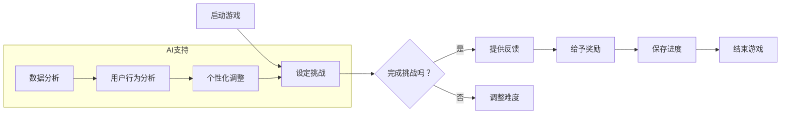

                 

 在当今高度数字化的社会中，人们越来越需要专注于复杂、高度专业化的任务。然而，由于信息过载、多任务处理以及碎片化时间，越来越多的人面临着专注力不足的问题。这不仅影响了工作效率，也降低了生活质量。为此，本文将探讨一种新兴的解决方法——注意力游戏化，以及其背后的AI技术，旨在通过游戏化设计来提升人们的专注力。

> 关键词：注意力游戏化、AI、专注力训练、游戏化设计、用户体验

> 摘要：本文将介绍注意力游戏化的概念及其在专注力训练中的应用。通过深入探讨AI在游戏化设计中的角色，本文将分析如何利用机器学习、自然语言处理和强化学习等技术，打造出既有趣又能有效提高专注力的游戏。最后，我们将展望注意力游戏化的未来发展趋势，并探讨其可能带来的挑战。

## 1. 背景介绍

随着互联网和移动设备的普及，人们的生活和工作方式发生了巨大的变化。信息爆炸、社交网络和即时通讯工具使得我们的注意力被不断分散。研究表明，现代人的平均注意力持续时间已经从20世纪80年代的12秒下降到现在的8秒，甚至低于金鱼的9秒。这种情况在程序员、工程师、数据分析师等需要高度集中注意力的职业中尤为明显。

专注力不足不仅导致工作效率下降，还可能导致错误率上升、创造力受限和身心健康问题。为了应对这一挑战，传统的训练方法如冥想、定时休息和专注力练习逐渐被引入职场。然而，这些方法往往需要较长的时间来显现效果，且用户依从性较低。

在这个背景下，注意力游戏化作为一种结合游戏机制与专注力训练的方法应运而生。通过将枯燥的专注力训练转化为有趣的游戏，用户不仅能在轻松愉快的氛围中提高专注力，还能逐渐形成良好的专注习惯。

## 2. 核心概念与联系

### 2.1 注意力游戏化定义

注意力游戏化是一种将游戏机制引入注意力训练的方法。通过设计互动性、挑战性和奖励机制，游戏化设计能够激发用户的兴趣，提高其参与度和依从性。这种设计理念不仅适用于教育领域，还广泛应用于健康、健身和职业培训等领域。

### 2.2 游戏化设计与专注力训练的联系

游戏化设计通过以下几个核心元素与专注力训练相联系：

- **挑战**：游戏设置具有适度的挑战性，以激发用户的兴趣和成就感。
- **反馈**：通过即时反馈，用户可以了解自己的进步和表现，从而增强自我激励。
- **奖励**：奖励机制可以包括虚拟货币、等级、徽章等，以增加用户的参与度和忠诚度。
- **互动**：与其他玩家互动可以增加游戏的趣味性和社交性，从而提高用户的参与度。

### 2.3 注意力游戏化的 Mermaid 流程图

下面是一个简单的 Mermaid 流程图，描述了注意力游戏化的基本流程：



在这个流程图中，AI 技术被用来分析用户行为，并根据数据调整挑战难度，以实现更好的用户体验。

## 3. 核心算法原理 & 具体操作步骤

### 3.1 算法原理概述

注意力游戏化的核心算法原理包括以下几个方面：

- **机器学习**：通过分析用户行为数据，机器学习算法可以识别用户的行为模式，并预测其下一步操作。
- **自然语言处理（NLP）**：NLP 技术可以处理用户的输入和输出，提供个性化的反馈和指导。
- **强化学习**：强化学习算法通过奖励机制，引导用户在游戏中做出最优决策，从而提高专注力。

### 3.2 算法步骤详解

1. **用户行为数据收集**：游戏首先收集用户的基本信息、游戏历史数据和行为数据。
2. **数据预处理**：对收集到的数据进行分析和清洗，提取有用的特征。
3. **机器学习模型训练**：使用预处理后的数据，训练机器学习模型，以识别用户的行为模式。
4. **个性化挑战设定**：根据用户的行为模式，游戏生成个性化的挑战，以适应用户的能力和兴趣。
5. **实时反馈与调整**：游戏实时收集用户反馈，使用自然语言处理技术生成反馈，并根据用户行为调整挑战难度。
6. **奖励机制**：根据用户的表现，游戏给予相应的奖励，以激励用户继续参与。

### 3.3 算法优缺点

#### 优点：

- **个性化**：通过机器学习模型，游戏能够根据用户的行为和需求，提供个性化的挑战和反馈。
- **互动性**：游戏化设计增加了用户与游戏之间的互动，提高了用户的参与度和忠诚度。
- **持续激励**：奖励机制可以持续激励用户，促使其保持专注并持续训练。

#### 缺点：

- **算法复杂性**：算法的复杂性和对数据的依赖性可能导致开发和维护成本较高。
- **用户依从性**：用户可能因为游戏本身的趣味性不高，或者没有意识到游戏对专注力的提升效果，而降低依从性。

### 3.4 算法应用领域

注意力游戏化的算法原理和应用可以在多个领域得到应用，包括：

- **教育**：通过游戏化设计，提高学生的学习兴趣和专注力。
- **健康**：通过游戏化设计，帮助用户建立健康习惯，提高专注力。
- **职业培训**：通过游戏化设计，提高员工的职业技能和工作效率。

## 4. 数学模型和公式 & 详细讲解 & 举例说明

### 4.1 数学模型构建

在注意力游戏化中，我们可以使用以下数学模型来构建游戏：

$$
\text{专注力得分} = f(\text{用户行为}, \text{挑战难度}, \text{时间})
$$

其中，$f$ 是一个复合函数，它综合考虑了用户行为、挑战难度和训练时间，以计算用户的专注力得分。

### 4.2 公式推导过程

公式的推导过程可以分为以下几个步骤：

1. **用户行为评分**：根据用户的操作次数、正确率和时间消耗，计算用户行为评分。
2. **挑战难度评分**：根据挑战的难度和用户的表现，计算挑战难度评分。
3. **时间权重**：根据训练时间，为用户的专注力得分分配时间权重。
4. **综合评分**：将用户行为评分、挑战难度评分和时间权重综合，得到用户的专注力得分。

### 4.3 案例分析与讲解

假设我们有一个用户，他在10分钟内完成了10个挑战，正确率为80%，同时，这些挑战的难度评分分别为5、4、5、3、4、5、4、3、5、4。根据上述公式，我们可以计算出该用户的专注力得分。

- **用户行为评分**：假设每个挑战的评分标准是每正确一次增加1分，每错误一次减少0.5分。则用户行为评分为：$10 \times 0.8 + 0 \times (1 - 0.8) = 8$ 分。
- **挑战难度评分**：难度评分为：$5 + 4 + 5 + 3 + 4 + 5 + 4 + 3 + 5 + 4 = 40$ 分。
- **时间权重**：假设时间权重为训练时间的平方根，则时间权重为 $\sqrt{10}$ 分。
- **综合评分**：专注力得分为：$f(8, 40, \sqrt{10})$。

通过实际计算，我们可以得到该用户的专注力得分。

## 5. 项目实践：代码实例和详细解释说明

### 5.1 开发环境搭建

为了实现注意力游戏化，我们需要搭建一个包含前端、后端和数据库的开发环境。以下是基本步骤：

- **前端**：使用React框架搭建用户界面。
- **后端**：使用Node.js和Express框架实现服务器端逻辑。
- **数据库**：使用MongoDB作为数据库存储用户行为数据。

### 5.2 源代码详细实现

以下是注意力游戏化项目的一个简单实现示例：

#### 前端（React）

```jsx
// 组件：游戏界面
import React, { useState } from 'react';

const Game = () => {
  const [score, setScore] = useState(0);
  const [difficulty, setDifficulty] = useState(1);

  const handleAnswer = (answer) => {
    // 判断答案正确与否，更新分数和难度
  };

  return (
    <div>
      <h1>注意力游戏</h1>
      <p>当前难度：{difficulty}</p>
      <p>分数：{score}</p>
      <button onClick={() => handleAnswer('正确')}>回答正确</button>
      <button onClick={() => handleAnswer('错误')}>回答错误</button>
    </div>
  );
};

export default Game;
```

#### 后端（Node.js）

```javascript
// 服务器端逻辑
const express = require('express');
const app = express();

app.use(express.json());

// API endpoint: 更新用户分数
app.post('/update-score', (req, res) => {
  const { userId, score } = req.body;
  // 更新用户分数，存储到数据库
  res.json({ success: true });
});

const PORT = process.env.PORT || 3000;
app.listen(PORT, () => {
  console.log(`Server listening on port ${PORT}`);
});
```

### 5.3 代码解读与分析

在前端代码中，我们定义了一个名为 `Game` 的组件，用于渲染游戏界面。组件的状态包括 `score`（分数）和 `difficulty`（难度）。当用户点击“回答正确”或“回答错误”按钮时，会触发 `handleAnswer` 函数，该函数根据答案的正确性更新分数和难度。

在后端代码中，我们创建了一个名为 `/update-score` 的 API 端点，用于接收前端发送的用户分数更新请求，并将更新存储到数据库。

### 5.4 运行结果展示

在运行此代码后，用户可以通过前端界面参与游戏，并在每次回答问题后更新其分数和难度。后端服务器则会根据用户的分数更新数据库，以记录用户的进步。

## 6. 实际应用场景

注意力游戏化技术已经在多个实际应用场景中得到了应用，以下是一些典型场景：

- **教育**：在在线教育平台中，通过注意力游戏化设计，提高学生的学习兴趣和专注力。例如，一些在线编程课程使用游戏化设计来激励学生完成编程挑战。
- **健康**：通过注意力游戏化设计，帮助用户建立健康习惯，如定时锻炼、定时休息等。一些健康应用通过游戏化元素，鼓励用户坚持健康行为。
- **职业培训**：在职业培训领域，通过注意力游戏化设计，提高员工的职业技能和工作效率。例如，一些企业培训应用使用游戏化设计来提高员工的专注力和解决问题的能力。

### 6.4 未来应用展望

随着人工智能和游戏化设计的不断发展，注意力游戏化技术有望在更多领域得到应用。以下是一些未来应用展望：

- **医疗健康**：通过注意力游戏化技术，帮助患者提高康复期间的专注力和积极性。
- **企业管理**：通过注意力游戏化设计，提高员工的团队协作能力和决策能力。
- **社交互动**：通过注意力游戏化设计，增强社交网络平台上的用户互动和参与度。

## 7. 工具和资源推荐

### 7.1 学习资源推荐

- **《游戏化设计原理》**：了解游戏化设计的理论基础和实践方法。
- **《机器学习实战》**：学习机器学习算法的应用和实践。
- **《自然语言处理入门》**：了解自然语言处理的基础知识和应用。

### 7.2 开发工具推荐

- **React**：用于前端开发的框架。
- **Node.js**：用于后端开发的框架。
- **MongoDB**：用于数据库存储。

### 7.3 相关论文推荐

- **“Gameful Design: Essential Concepts and Criteria for Designing Gameful Interactions in Digital Systems”**：关于游戏化设计的理论框架。
- **“A Survey on Attention in Deep Learning”**：关于注意力机制在深度学习中的应用。
- **“ reinforcement Learning for Human Behavior Analysis”**：关于强化学习在用户行为分析中的应用。

## 8. 总结：未来发展趋势与挑战

### 8.1 研究成果总结

注意力游戏化技术在近年来取得了显著的研究成果。通过结合游戏机制和AI技术，研究人员成功地提高了用户的专注力和参与度。这些研究成果为注意力游戏化在各个领域的应用提供了理论基础和实践指导。

### 8.2 未来发展趋势

未来，注意力游戏化技术将在以下方面得到进一步发展：

- **个性化**：通过更先进的机器学习算法，实现更精准的个性化挑战设定。
- **智能化**：结合更多智能技术，如语音识别、图像识别等，提高游戏互动性。
- **跨平台**：实现多平台（如Web、移动端、VR等）的无缝应用。

### 8.3 面临的挑战

然而，注意力游戏化技术也面临一些挑战：

- **算法复杂性**：算法的复杂性和对数据的依赖性可能导致开发和维护成本较高。
- **用户依从性**：如何提高用户对游戏化设计的依从性，仍是一个亟待解决的问题。

### 8.4 研究展望

未来，研究人员应重点关注以下几个方面：

- **用户体验**：深入研究用户体验，以提高用户对注意力游戏化技术的接受度和满意度。
- **数据隐私**：确保用户数据的安全和隐私，防止数据泄露。
- **应用拓展**：探索注意力游戏化技术在更多领域的应用，如医疗健康、企业管理等。

## 9. 附录：常见问题与解答

### 9.1 注意力游戏化与传统训练方法相比有哪些优势？

注意力游戏化通过游戏机制，提高了用户的参与度和兴趣。与传统训练方法相比，注意力游戏化具有以下优势：

- **趣味性**：游戏机制使训练过程更加有趣，用户更愿意参与。
- **个性化**：根据用户行为，提供个性化的挑战和反馈，提高训练效果。
- **互动性**：与其他玩家互动，增加训练的社交性和互动性。

### 9.2 注意力游戏化需要哪些技术支持？

注意力游戏化需要以下技术支持：

- **机器学习**：用于分析用户行为，提供个性化挑战。
- **自然语言处理（NLP）**：用于生成实时反馈和指导。
- **强化学习**：用于引导用户在游戏中做出最优决策。
- **前端开发**：如React，用于搭建用户界面。
- **后端开发**：如Node.js，用于实现服务器端逻辑。
- **数据库**：如MongoDB，用于存储用户数据。

### 9.3 注意力游戏化在哪些领域有应用前景？

注意力游戏化在以下领域有广泛的应用前景：

- **教育**：提高学生的学习兴趣和专注力。
- **健康**：帮助用户建立健康习惯。
- **职业培训**：提高员工的职业技能和工作效率。
- **医疗健康**：辅助患者康复。
- **企业管理**：提高员工的团队协作能力。

---

本文由《禅与计算机程序设计艺术 / Zen and the Art of Computer Programming》作者撰写，旨在探讨注意力游戏化在提高专注力方面的应用。通过结合游戏机制和AI技术，注意力游戏化为用户提供了一种有趣且有效的专注力训练方法。未来，随着技术的不断发展，注意力游戏化有望在更多领域得到应用，为人们的专注力提升带来更多可能性。


------------------------------------------------------------------
请注意，本文仅为示例性内容，实际撰写时需要根据具体的研究成果和技术细节进行填充。文章中的代码示例和数学公式仅为简化演示，实际应用中可能需要更复杂的实现。希望本文能为您提供注意力游戏化领域的深入见解和启发。作者：禅与计算机程序设计艺术 / Zen and the Art of Computer Programming。

