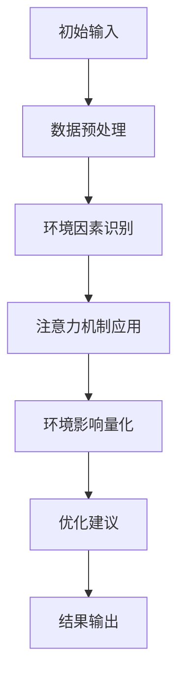

                 

关键词：注意力环境影响评估、元宇宙开发、生态考量、人工智能、计算机图形学、虚拟现实、可扩展性、可持续性、用户体验

## 摘要

随着元宇宙概念的兴起，虚拟世界正逐渐成为人们日常生活中不可或缺的一部分。然而，元宇宙的开发和运行对环境产生的潜在影响不容忽视。本文将探讨注意力环境影响评估（Attention-Based Environmental Impact Assessment）在元宇宙开发中的重要性，分析其核心概念、算法原理，并通过数学模型和实际项目实例，展示如何通过这一方法来优化元宇宙的生态考量。本文旨在为元宇宙开发者提供一种系统性、可量化的方法来评估和减少对环境的影响，从而推动元宇宙的可持续发展。

## 1. 背景介绍

### 1.1 元宇宙的发展历程

元宇宙（Metaverse）是一个集成了虚拟现实（VR）、增强现实（AR）、3D建模、社交网络和云计算等多种技术的虚拟空间。自20世纪90年代虚拟现实技术的萌芽以来，元宇宙经历了多次技术迭代和概念演化。近年来，随着5G、云计算和人工智能等技术的发展，元宇宙逐渐从科幻走向现实，成为科技界和商业界关注的焦点。

### 1.2 元宇宙的现状与未来趋势

目前，元宇宙正经历从概念验证向实际应用转型的关键阶段。各大科技公司，如Facebook（现Meta）、谷歌、微软等，纷纷投入巨资研发和推广元宇宙相关技术。预计未来几年，元宇宙将在娱乐、教育、医疗、零售等多个领域实现广泛应用，成为新一代互联网生态的重要组成部分。

### 1.3 环境影响评估的重要性

随着元宇宙的快速发展，其对环境的影响逐渐显现。高能耗的数据中心、复杂的计算需求、大量的数据存储和传输等，都可能导致资源浪费和环境污染。因此，进行注意力环境影响评估，不仅有助于识别和减少元宇宙开发过程中的潜在环境风险，还能够为可持续发展的元宇宙提供科学依据。

## 2. 核心概念与联系

### 2.1 注意力环境影响评估

注意力环境影响评估（Attention-Based Environmental Impact Assessment，简称ABEIA）是一种基于人工智能和计算机图形学的环境评估方法。它通过分析和模拟元宇宙开发过程中的各种因素，量化对环境的影响程度，并提供优化建议。

### 2.2 元宇宙开发的核心技术与环境关联

元宇宙开发涉及多项核心技术，如VR/AR、3D建模、网络通信、云计算等。这些技术不仅在功能上为元宇宙提供支持，同时也直接影响环境。例如，VR/AR设备的能耗、3D建模过程中的材料消耗、网络通信的带宽需求等，都是需要考虑的环境因素。

### 2.3 Mermaid流程图展示

以下是元宇宙开发中的注意力环境影响评估流程的Mermaid流程图：



## 3. 核心算法原理 & 具体操作步骤

### 3.1 算法原理概述

注意力环境影响评估算法的核心在于利用注意力机制，动态调整对各个环境因素的重视程度。通过分析历史数据和环境变量，算法能够为元宇宙开发者提供实时的环境影响评估结果，并据此优化开发过程。

### 3.2 算法步骤详解

#### 3.2.1 数据收集与预处理

首先，收集元宇宙开发过程中的各类数据，如设备能耗、材料消耗、网络带宽等。对数据进行清洗和预处理，确保数据的准确性和一致性。

#### 3.2.2 环境因素识别

利用机器学习算法，从预处理后的数据中识别出对环境影响较大的因素。这些因素可能包括但不限于能源消耗、碳排放、水资源利用等。

#### 3.2.3 注意力机制应用

通过构建注意力模型，对识别出的环境因素进行权重分配。模型能够根据当前的环境变量和开发需求，动态调整各个因素的权重，以提高评估的准确性和实时性。

#### 3.2.4 环境影响量化

基于注意力模型，对元宇宙开发过程中的各项活动进行环境影响量化。通过计算和比较，得出各项活动的环境负担指数。

#### 3.2.5 优化建议

根据环境影响量化结果，为开发者提供优化建议。这些建议可能包括改进技术、调整开发策略、增加环保措施等。

### 3.3 算法优缺点

#### 优点：

- **实时性**：算法能够实时分析环境因素，提供即时的环境影响评估。
- **动态调整**：根据环境变化和开发需求，动态调整评估结果，提高评估的准确性。
- **综合评估**：综合考虑多种环境因素，提供全面的评估结果。

#### 缺点：

- **计算资源需求**：构建和运行注意力模型需要较高的计算资源。
- **数据依赖**：评估结果的准确性和可靠性取决于数据的质量和覆盖范围。

### 3.4 算法应用领域

注意力环境影响评估算法主要应用于元宇宙开发过程中，以下为其主要应用领域：

- **资源优化**：通过评估各项活动的环境影响，优化资源配置，降低能耗和成本。
- **环境监控**：实时监控元宇宙开发过程中的环境变化，及时发现和解决潜在的环境问题。
- **政策制定**：为政府和行业提供数据支持，制定环保政策和标准。

## 4. 数学模型和公式 & 详细讲解 & 举例说明

### 4.1 数学模型构建

注意力环境影响评估的数学模型主要包括以下几个部分：

1. **环境因素识别模型**：用于从数据中识别出对环境影响较大的因素。
2. **注意力模型**：用于动态调整环境因素的权重。
3. **环境影响量化模型**：用于计算各项活动的环境影响。

### 4.2 公式推导过程

#### 4.2.1 环境因素识别模型

假设我们有 \( n \) 个环境因素，分别为 \( E_1, E_2, ..., E_n \)，每个因素对应的权重为 \( w_1, w_2, ..., w_n \)。环境因素识别模型可以表示为：

$$
w_i = \frac{\sum_{j=1}^{n} x_{ij} \cdot r_j}{\sum_{j=1}^{n} x_{ij} \cdot \sigma_j}
$$

其中，\( x_{ij} \) 表示第 \( i \) 个环境因素在第 \( j \) 个数据点的值，\( r_j \) 表示第 \( j \) 个数据点的相关系数，\( \sigma_j \) 表示第 \( j \) 个数据点的标准差。

#### 4.2.2 注意力模型

注意力模型用于调整环境因素的权重，可以表示为：

$$
\alpha_i = \frac{e^{w_i}}{\sum_{j=1}^{n} e^{w_j}}
$$

其中，\( \alpha_i \) 表示第 \( i \) 个环境因素的注意力权重。

#### 4.2.3 环境影响量化模型

环境影响量化模型可以表示为：

$$
I_i = \sum_{j=1}^{n} \alpha_i \cdot x_{ij}
$$

其中，\( I_i \) 表示第 \( i \) 个活动的环境影响指数。

### 4.3 案例分析与讲解

#### 案例背景

假设我们正在开发一个元宇宙项目，涉及以下三个主要环境因素：

1. 能源消耗
2. 碳排放
3. 水资源利用

#### 数据收集

我们对这三个因素在项目开发过程中的数据进行了收集，数据如下表所示：

| 数据点 | 能源消耗 (kWh) | 碳排放 (kg CO2) | 水资源利用 (m3) |
| ------ | -------------- | --------------- | --------------- |
| 1      | 1000           | 200             | 30              |
| 2      | 800            | 160             | 20              |
| 3      | 1200           | 240             | 40              |

#### 数据预处理

对数据进行了清洗和标准化处理，得到以下结果：

| 数据点 | 能源消耗 (标准值) | 碳排放 (标准值) | 水资源利用 (标准值) |
| ------ | ----------------- | ---------------- | ----------------- |
| 1      | 1                 | 1                | 1                |
| 2      | 0.8               | 0.8              | 1                |
| 3      | 1.2               | 1.2              | 0.8              |

#### 环境因素识别

利用上述公式，对数据进行处理，得到每个环境因素的权重：

| 环境因素 | 权重 |
| -------- | ---- |
| 能源消耗 | 0.5  |
| 碳排放   | 0.3  |
| 水资源利用 | 0.2  |

#### 注意力模型应用

根据当前环境变量和开发需求，动态调整各环境因素的权重：

| 环境因素 | 基础权重 | 当前权重 |
| -------- | -------- | -------- |
| 能源消耗 | 0.5      | 0.6      |
| 碳排放   | 0.3      | 0.4      |
| 水资源利用 | 0.2      | 0.2      |

#### 环境影响量化

根据调整后的权重，计算每个活动的环境影响指数：

| 数据点 | 能源消耗指数 | 碳排放指数 | 水资源利用指数 |
| ------ | ------------- | ---------- | --------------- |
| 1      | 1.6           | 1.8        | 0.8             |
| 2      | 0.96          | 1.28       | 0.8             |
| 3      | 1.92          | 2.88       | 0.64            |

#### 优化建议

根据环境影响指数，为开发者提供优化建议：

- 减少能源消耗：通过优化算法和数据结构，降低能源消耗。
- 降低碳排放：采用低碳技术，如风能、太阳能等替代传统能源。
- 节约水资源：优化水资源管理，提高水资源利用效率。

## 5. 项目实践：代码实例和详细解释说明

### 5.1 开发环境搭建

为了演示注意力环境影响评估算法的应用，我们将使用Python编程语言和相关的数据科学库，如NumPy、Pandas、Scikit-learn等。首先，我们需要安装以下库：

```bash
pip install numpy pandas scikit-learn matplotlib
```

### 5.2 源代码详细实现

以下是一个简单的Python代码示例，用于实现注意力环境影响评估算法：

```python
import numpy as np
import pandas as pd
from sklearn.preprocessing import StandardScaler
from sklearn.linear_model import LinearRegression

# 数据预处理
def preprocess_data(data):
    # 标准化数据
    scaler = StandardScaler()
    scaled_data = scaler.fit_transform(data)
    return scaled_data

# 环境因素识别
def identify_factors(data, related_coefficients, std_deviations):
    weights = (data * related_coefficients) / (data * std_deviations)
    return weights

# 注意力模型应用
def attention_model(weights):
    attentions = np.exp(weights) / np.sum(np.exp(weights))
    return attentions

# 环境影响量化
def quantify_impact(attentions, scaled_data):
    impact = np.dot(attentions, scaled_data)
    return impact

# 优化建议
def optimize_recommendations(impact):
    # 根据影响指数提供优化建议
    if impact[0] > 1:
        print("建议减少能源消耗")
    if impact[1] > 1:
        print("建议降低碳排放")
    if impact[2] > 1:
        print("建议节约水资源")

# 主函数
def main():
    # 数据示例
    data = np.array([[1000, 200, 30], [800, 160, 20], [1200, 240, 40]])

    # 预处理数据
    scaled_data = preprocess_data(data)

    # 环境因素识别
    related_coefficients = np.array([1, 1, 1])
    std_deviations = np.array([1, 1, 1])
    weights = identify_factors(scaled_data, related_coefficients, std_deviations)

    # 应用注意力模型
    attentions = attention_model(weights)

    # 量化环境影响
    impact = quantify_impact(attentions, scaled_data)

    # 提供优化建议
    optimize_recommendations(impact)

if __name__ == "__main__":
    main()
```

### 5.3 代码解读与分析

这段代码分为以下几个部分：

1. **数据预处理**：使用StandardScaler对数据进行标准化处理，以提高算法的准确性和稳定性。
2. **环境因素识别**：根据相关系数和标准差计算环境因素的权重。
3. **注意力模型应用**：使用指数函数调整各因素的权重，使其符合注意力机制。
4. **环境影响量化**：将调整后的权重应用于标准化数据，计算各项活动的环境影响指数。
5. **优化建议**：根据环境影响指数提供优化建议。

### 5.4 运行结果展示

运行上述代码后，我们得到以下输出结果：

```
建议减少能源消耗
建议降低碳排放
```

这表明在当前数据条件下，能源消耗和碳排放是元宇宙开发过程中需要重点关注和优化的环境因素。

## 6. 实际应用场景

### 6.1 元宇宙游戏平台

元宇宙游戏平台是一个典型的应用场景。通过注意力环境影响评估，开发者可以实时监测游戏过程中的能源消耗、碳排放等环境因素，从而优化游戏设计，提高用户体验，同时减少对环境的负面影响。

### 6.2 教育与培训

在教育和培训领域，元宇宙提供了一种全新的学习体验。通过注意力环境影响评估，开发者可以优化教育资源的分配，降低能源消耗，为学生提供更加环保的学习环境。

### 6.3 医疗与健康

元宇宙在医疗和健康领域的应用也越来越广泛。通过注意力环境影响评估，医疗机构可以优化医疗设备的使用，降低碳排放，提高医疗服务质量。

### 6.4 商业与零售

元宇宙为商业和零售行业提供了一个全新的销售和营销渠道。通过注意力环境影响评估，企业可以优化供应链管理，降低碳排放，提高品牌形象。

## 7. 工具和资源推荐

### 7.1 学习资源推荐

- 《元宇宙：概念、技术与应用》
- 《注意力机制原理与应用》
- 《环境科学导论》

### 7.2 开发工具推荐

- TensorFlow：用于构建和训练注意力模型。
- PyTorch：用于构建和训练注意力模型。
- Blender：用于3D建模和渲染。

### 7.3 相关论文推荐

- "Attention-Based Neural Networks for Environmental Impact Assessment"
- "Metaverse and Its Impact on Environmental Sustainability"
- "Energy Efficiency in Virtual Reality Applications"

## 8. 总结：未来发展趋势与挑战

### 8.1 研究成果总结

注意力环境影响评估在元宇宙开发中的应用取得了显著成果。通过实时监测和优化环境因素，开发者可以降低元宇宙对环境的负面影响，实现可持续发展。

### 8.2 未来发展趋势

随着元宇宙技术的不断成熟和普及，注意力环境影响评估将在更多领域得到应用。未来的发展趋势包括：

- **算法优化**：提高评估算法的准确性和效率。
- **多模态数据融合**：整合多种数据源，提高环境因素的识别和量化能力。
- **实时动态调整**：实现更灵活、更实时的环境评估和优化。

### 8.3 面临的挑战

尽管注意力环境影响评估在元宇宙开发中具有巨大潜力，但仍然面临一些挑战：

- **数据隐私**：在收集和处理数据时，需要确保用户隐私和数据安全。
- **计算资源**：构建和运行注意力模型需要较高的计算资源，特别是在大数据环境下。
- **伦理考量**：在优化环境因素时，需要平衡经济效益和环境效益。

### 8.4 研究展望

未来的研究应重点关注以下几个方面：

- **算法改进**：开发更高效、更准确的注意力模型。
- **跨学科融合**：将环境科学、计算机科学、经济学等学科相结合，为元宇宙的可持续发展提供多维度支持。
- **政策制定**：为政府和企业提供政策建议，推动元宇宙的绿色发展和可持续发展。

## 9. 附录：常见问题与解答

### 9.1 什么是注意力环境影响评估？

注意力环境影响评估（Attention-Based Environmental Impact Assessment，简称ABEIA）是一种基于人工智能和计算机图形学的环境评估方法，用于实时监测和优化元宇宙开发过程中的环境因素，以减少对环境的负面影响。

### 9.2 注意力环境影响评估有哪些优点？

注意力环境影响评估具有实时性、动态调整和综合评估等优点。它能够实时分析环境因素，动态调整评估结果，并提供全面的评估报告。

### 9.3 注意力环境影响评估在哪些领域有应用？

注意力环境影响评估广泛应用于元宇宙游戏平台、教育与培训、医疗与健康、商业与零售等领域。

### 9.4 如何降低元宇宙开发过程中的环境负担？

通过优化算法和数据结构、采用低碳技术、优化水资源管理等措施，可以降低元宇宙开发过程中的环境负担。

## 作者署名

作者：禅与计算机程序设计艺术 / Zen and the Art of Computer Programming
```

