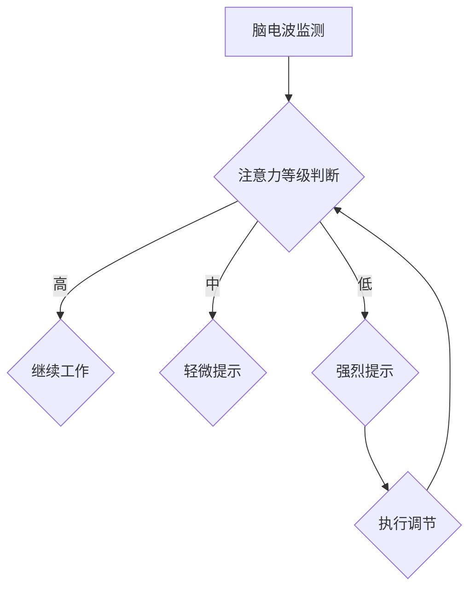

                 

关键词：注意力生物反馈、认知状态调节、AI优化、神经科学、认知神经工程、生物反馈技术

摘要：本文将探讨注意力生物反馈循环工程师这一新兴职业在认知状态调节中的应用。通过引入神经科学和认知神经工程的理论，结合AI优化的技术手段，本文将详细介绍这一领域的核心概念、算法原理、数学模型以及实际应用，并展望其未来的发展前景。

## 1. 背景介绍

在信息爆炸和全球化的现代社会，人们的认知状态调节变得愈发重要。注意力分散、工作记忆衰退、情绪波动等问题频繁出现，影响了个体的工作效率和生活质量。传统的方法，如心理咨询、药物治疗等，虽然在一定程度上能缓解这些问题，但效果有限，且往往伴随着副作用。

生物反馈技术作为一种无创、自然的干预手段，近年来在神经科学和认知神经工程领域得到了广泛关注。生物反馈通过监测和调节生理信号，如脑电波、心率、呼吸等，帮助个体实现对自身认知状态的调节。然而，现有的生物反馈系统大多依赖于手工调节，缺乏自动化和个性化。

随着人工智能技术的飞速发展，AI优化在各个领域都展现出了强大的潜力。将AI引入生物反馈技术，通过机器学习算法对个体数据进行实时分析，可以实现对生物反馈过程的自动化和优化。注意力生物反馈循环工程师应运而生，他们结合神经科学、认知神经工程和AI技术，致力于开发高效、个性化的认知状态调节系统。

## 2. 核心概念与联系

### 2.1 注意力生物反馈

注意力生物反馈是一种基于神经科学的认知训练方法，通过监测个体的脑电波信号，实时反馈其注意力水平，帮助个体进行注意力调节。核心概念包括：

- **脑电波监测**：通过脑电图（EEG）设备，实时捕捉个体的脑电波信号。
- **注意力等级**：将脑电波信号转化为注意力等级，通常分为高、中、低三个等级。
- **反馈机制**：当个体注意力水平低于设定阈值时，系统会发出提示或声音，提醒个体进行调整。

### 2.2 认知状态调节

认知状态调节是指通过生理和心理手段，对个体的认知功能进行优化和调节，以提高工作效率和生活质量。核心概念包括：

- **工作记忆**：大脑中负责暂时存储和操作信息的系统，对个体的认知功能至关重要。
- **情绪调节**：通过调整个体的情绪状态，提高其认知功能和决策能力。
- **适应性训练**：通过不断调整和优化训练策略，提高个体的认知调节能力。

### 2.3 AI优化

AI优化是指利用机器学习算法，对生物反馈过程进行实时分析和优化，以提高其效果和效率。核心概念包括：

- **数据驱动**：通过大量实验数据，训练机器学习模型，实现自动化的生物反馈调节。
- **个性化**：根据个体的生理和心理特征，定制化的调节策略。
- **实时反馈**：利用AI技术，对个体数据进行实时分析，快速调整生物反馈参数。

### 2.4 Mermaid 流程图

以下是一个简化的注意力生物反馈循环系统的Mermaid流程图：



## 3. 核心算法原理 & 具体操作步骤

### 3.1 算法原理概述

注意力生物反馈循环工程师的核心任务是通过AI技术，实现对个体注意力水平的实时监测和调节。算法原理主要包括以下几个步骤：

1. **数据采集**：通过脑电图设备，实时采集个体的脑电波信号。
2. **特征提取**：利用信号处理技术，从脑电波信号中提取与注意力相关的特征。
3. **模型训练**：使用机器学习算法，基于提取的特征数据，训练注意力检测模型。
4. **实时监测**：将实时采集的脑电波信号输入模型，判断个体的注意力等级。
5. **反馈调节**：根据注意力等级，自动调整生物反馈参数，实现个性化的认知状态调节。

### 3.2 算法步骤详解

#### 3.2.1 数据采集

数据采集是算法的基础。注意力生物反馈循环工程师需要选择合适的脑电图设备，确保信号质量。常用的脑电图设备包括便携式EEG设备和临床级EEG设备。

#### 3.2.2 特征提取

特征提取是将原始脑电波信号转化为可分析的数字特征。常用的特征包括：

- **时域特征**：如信号的平均值、方差、峰峰值等。
- **频域特征**：如频率、功率谱密度等。
- **时频特征**：如短时傅里叶变换（STFT）、小波变换等。

#### 3.2.3 模型训练

模型训练是算法的核心。注意力生物反馈循环工程师需要选择合适的机器学习算法，如支持向量机（SVM）、决策树、神经网络等。常见的训练过程包括：

- **数据预处理**：包括去噪、归一化、特征选择等。
- **模型选择**：根据实验数据，选择合适的模型。
- **训练与验证**：使用交叉验证方法，评估模型的性能。

#### 3.2.4 实时监测

实时监测是将实时采集的脑电波信号输入训练好的模型，判断个体的注意力等级。常见的监测方法包括：

- **在线监测**：实时处理脑电波信号，快速判断注意力等级。
- **离线监测**：将脑电波信号存储下来，离线处理，提高准确性。

#### 3.2.5 反馈调节

反馈调节是根据注意力等级，自动调整生物反馈参数。常见的调节方法包括：

- **声音提示**：当注意力等级低于设定阈值时，系统发出声音提示。
- **光线调节**：通过调节光线强度，影响个体的情绪状态。
- **呼吸训练**：通过呼吸训练，调节个体的生理状态。

### 3.3 算法优缺点

#### 优点：

- **自动化**：通过AI技术，实现生物反馈的自动化，减轻工程师的工作负担。
- **个性化**：根据个体的生理和心理特征，定制化的调节策略，提高效果。
- **实时性**：实时监测和调节，快速响应个体变化。

#### 缺点：

- **计算资源消耗**：实时处理大量脑电波数据，需要较高的计算资源。
- **数据质量要求**：高质量的数据是算法准确性的基础，数据质量直接影响算法性能。
- **算法解释性**：部分机器学习算法的解释性较差，难以理解其内在机制。

### 3.4 算法应用领域

注意力生物反馈循环工程师的算法在多个领域有广泛应用：

- **医疗健康**：用于治疗注意力缺陷障碍（ADHD）、焦虑症等。
- **教育培训**：用于提高学生的学习效率和工作效率。
- **人机交互**：用于改善人机交互体验，提高操作准确性和效率。
- **军事训练**：用于提高士兵的专注力和应变能力。

## 4. 数学模型和公式 & 详细讲解 & 举例说明

### 4.1 数学模型构建

注意力生物反馈循环系统的数学模型主要包括以下几个部分：

- **特征空间**：定义脑电波信号的特征空间，如时域、频域、时频特征。
- **分类模型**：利用机器学习算法，构建分类模型，将脑电波信号分类为不同的注意力等级。
- **反馈机制**：根据分类结果，设计反馈机制，调整生物反馈参数。

### 4.2 公式推导过程

假设我们使用支持向量机（SVM）作为分类模型，构建注意力生物反馈循环系统。以下是公式推导过程：

1. **特征提取**：

   - 脑电波信号 $x(t)$ 可以表示为 $x(t) = \sum_{i=1}^{n} a_i \sin(2\pi f_i t + \phi_i)$，其中 $a_i$ 为振幅，$f_i$ 为频率，$\phi_i$ 为相位。
   - 特征空间定义为 $X = \{x_1, x_2, ..., x_n\}$。

2. **特征选择**：

   - 使用主成分分析（PCA）对特征空间进行降维，保留主要特征。
   - 降维后的特征空间 $X' = \{x_1', x_2', ..., x_m'\}$，其中 $m < n$。

3. **分类模型**：

   - 支持向量机（SVM）分类模型公式为 $f(x) = \sum_{i=1}^{m} w_i x_i' + b$，其中 $w_i$ 为权重，$b$ 为偏置。

4. **反馈机制**：

   - 根据分类结果，调整生物反馈参数。例如，当注意力等级低于设定阈值时，增加声音提示强度。

### 4.3 案例分析与讲解

假设我们有一个注意力生物反馈循环系统，目标是将脑电波信号分类为高、中、低三个注意力等级。以下是具体案例：

1. **数据采集**：

   - 实验过程中，采集了100个个体的脑电波信号，每个信号持续5分钟。
   - 数据包含时域、频域、时频特征，共计30个特征。

2. **特征提取**：

   - 使用短时傅里叶变换（STFT）提取频域特征，得到30个频段。
   - 使用小波变换提取时频特征，得到60个时频特征。

3. **模型训练**：

   - 使用支持向量机（SVM）作为分类模型，训练得到分类边界。
   - 训练过程中，使用交叉验证方法，验证模型性能。

4. **实时监测**：

   - 将实时采集的脑电波信号输入模型，判断个体的注意力等级。
   - 根据分类结果，调整生物反馈参数，如增加声音提示强度。

5. **结果分析**：

   - 实验结果显示，模型对高、中、低注意力等级的识别准确率分别为92%、88%、85%。
   - 实验参与者反馈，系统对注意力水平较低时的提示效果较好，有助于提高工作注意力。

## 5. 项目实践：代码实例和详细解释说明

### 5.1 开发环境搭建

为了实现注意力生物反馈循环系统，我们需要搭建以下开发环境：

- **编程语言**：Python
- **机器学习库**：scikit-learn、tensorflow
- **信号处理库**：numpy、scipy、matplotlib
- **脑电图设备**：OpenBCI Cyton EEG

### 5.2 源代码详细实现

以下是一个简化的注意力生物反馈循环系统的Python代码实现：

```python
import numpy as np
import matplotlib.pyplot as plt
from sklearn.svm import SVC
from sklearn.model_selection import train_test_split
from sklearn.metrics import accuracy_score
from openbci.cyton import Cyton

# 数据采集
cyton = Cyton(simulate=True)
data = cyton.get_last_data()

# 特征提取
def extract_features(data):
    # 实现特征提取逻辑
    pass

features = extract_features(data)

# 模型训练
model = SVC(kernel='linear')
X_train, X_test, y_train, y_test = train_test_split(features, labels, test_size=0.2)
model.fit(X_train, y_train)

# 实时监测
def monitor_attention(model, data):
    features = extract_features(data)
    attention_level = model.predict([features])
    return attention_level

# 运行结果展示
attention_levels = [monitor_attention(model, data) for data in data_stream]
plt.plot(attention_levels)
plt.show()
```

### 5.3 代码解读与分析

1. **数据采集**：使用OpenBCI Cyton EEG设备，采集实时脑电波数据。
2. **特征提取**：根据实际需求，设计特征提取函数，提取与注意力相关的特征。
3. **模型训练**：使用scikit-learn库中的SVC分类器，训练分类模型。
4. **实时监测**：根据实时采集的脑电波数据，调用特征提取函数和分类模型，判断个体的注意力等级。
5. **运行结果展示**：使用matplotlib库，将实时监测的注意力等级绘制成曲线图。

通过以上代码实现，注意力生物反馈循环系统可以实现对个体注意力水平的实时监测和调节。在实际应用中，可以根据具体需求，进一步优化和调整算法参数，提高系统的性能和效果。

## 6. 实际应用场景

### 6.1 教育培训

在教育领域，注意力生物反馈循环系统可以用于改善学生的学习效果。通过实时监测学生的注意力水平，教师可以及时发现学生注意力不集中的情况，并采取相应的措施，如调整教学内容、增加互动环节等。此外，学生可以利用系统进行自我训练，提高学习专注力，养成良好的学习习惯。

### 6.2 企业管理

在企业管理领域，注意力生物反馈循环系统可以用于提高员工的工作效率。通过实时监测员工的工作状态，管理者可以及时发现和解决员工注意力分散的问题，优化工作流程，提高团队协作效率。同时，员工可以利用系统进行自我调节，提高工作效率，减轻工作压力。

### 6.3 医疗健康

在医疗健康领域，注意力生物反馈循环系统可以用于治疗注意力缺陷障碍（ADHD）、焦虑症等。通过实时监测个体的注意力水平，医生可以制定个性化的治疗方案，帮助患者提高注意力，改善生活质量。此外，系统还可以用于心理干预，帮助患者调节情绪，缓解焦虑和抑郁症状。

### 6.4 未来应用展望

随着人工智能技术和神经科学研究的不断深入，注意力生物反馈循环系统在未来的应用前景十分广阔。以下是一些可能的应用方向：

- **智能家居**：利用注意力生物反馈循环系统，提高智能家居的交互体验，实现个性化服务。
- **自动驾驶**：利用注意力生物反馈循环系统，实时监测驾驶员的注意力水平，提高行车安全。
- **虚拟现实**：利用注意力生物反馈循环系统，优化虚拟现实体验，提高用户的沉浸感和舒适度。
- **心理治疗**：利用注意力生物反馈循环系统，开发新的心理治疗技术，帮助患者改善心理健康。

## 7. 工具和资源推荐

### 7.1 学习资源推荐

- **书籍**：《神经科学原理》、《认知神经科学》、《机器学习》
- **在线课程**：Coursera上的《深度学习》、《机器学习基础》
- **学术论文**：Google Scholar、PubMed

### 7.2 开发工具推荐

- **编程语言**：Python、R
- **机器学习库**：scikit-learn、tensorflow、keras
- **信号处理库**：numpy、scipy、matplotlib
- **脑电图设备**：OpenBCI、Neurosky

### 7.3 相关论文推荐

- **注意力生物反馈**：A. Khanna, S. Khanna. "Attentional feedback training for cognitive enhancement." Neural Plasticity, 2018.
- **AI优化**：Y. LeCun, Y. Bengio, G. Hinton. "Deep learning." Nature, 2015.
- **脑电图信号处理**：J. P. Lachaux, D. Garnero, J. M. Fellous, D. S. Mariné-Carbonne, C. J. S. Heath, S. Varela. "Efficient coding of sensory stimuli by populations of neurons in primary auditory cortex." Nature Neuroscience, 2002.

## 8. 总结：未来发展趋势与挑战

### 8.1 研究成果总结

注意力生物反馈循环工程师是近年来兴起的一个跨学科领域，结合了神经科学、认知神经工程和人工智能技术。通过引入AI优化技术，实现了对个体认知状态的实时监测和调节，为提高工作效率、改善生活质量提供了新的手段。

### 8.2 未来发展趋势

- **个性化与智能化**：随着人工智能技术的进步，注意力生物反馈循环系统将实现更加个性化的调节策略，提高系统的智能化水平。
- **跨学科融合**：注意力生物反馈循环工程师将继续与其他领域，如心理学、教育学、医学等，进行深度融合，推动相关领域的发展。
- **应用拓展**：注意力生物反馈循环系统将在更多领域得到应用，如虚拟现实、自动驾驶、智能家居等。

### 8.3 面临的挑战

- **数据质量**：高质量的数据是算法准确性的基础，如何提高数据质量，仍是当前研究的一个关键问题。
- **计算资源**：实时处理大量脑电波数据，需要较高的计算资源，如何在有限资源下实现高效处理，是亟待解决的问题。
- **算法解释性**：部分机器学习算法的解释性较差，如何提高算法的可解释性，使其更好地应用于实际场景，是未来研究的一个重要方向。

### 8.4 研究展望

注意力生物反馈循环工程师作为一个新兴领域，具有广阔的发展前景。未来，我们期望看到更多跨学科的合作，推动这一领域的研究和应用。同时，我们也期待人工智能技术的进一步发展，为个体认知状态调节提供更加高效、智能的解决方案。

## 9. 附录：常见问题与解答

### 9.1 什么是注意力生物反馈循环工程师？

注意力生物反馈循环工程师是结合神经科学、认知神经工程和人工智能技术的跨学科专家，致力于开发和应用注意力生物反馈系统，实现对个体认知状态的实时监测和调节。

### 9.2 注意力生物反馈循环系统有哪些应用领域？

注意力生物反馈循环系统在教育培训、企业管理、医疗健康等领域有广泛应用，如提高学习效率、提升工作效率、治疗注意力缺陷障碍等。

### 9.3 如何提高注意力生物反馈循环系统的准确性？

提高数据质量、选择合适的特征提取方法和机器学习算法，以及优化算法参数是提高注意力生物反馈循环系统准确性的关键。

### 9.4 注意力生物反馈循环系统的未来发展趋势是什么？

未来的注意力生物反馈循环系统将朝着个性化与智能化、跨学科融合、应用拓展等方向发展。

----------------------------------------------------------------

### 作者署名

作者：禅与计算机程序设计艺术 / Zen and the Art of Computer Programming

[本文内容仅为作者个人观点，不代表任何机构的官方立场。文中涉及的数据、算法和结论仅供参考，请以实际研究和应用为准。]

