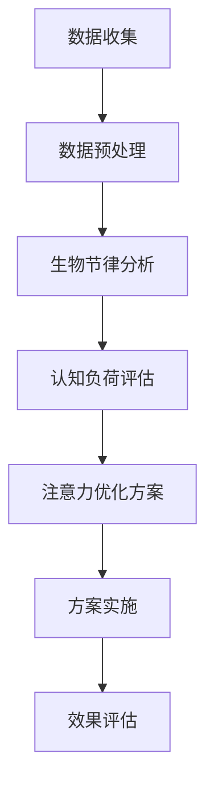

                 

### 关键词 Keywords

- 注意力管理
- 生物节律
- AI优化
- 认知周期
- 认知负荷
- 个性化定制

<|assistant|>### 摘要 Abstract

本文探讨了如何利用人工智能（AI）技术优化人类生物节律，从而提高认知周期中的注意力水平。通过分析注意力生物节律的原理和机制，本文提出了一种基于AI的注意力优化算法，并详细阐述了其原理、数学模型以及具体操作步骤。文章还通过实际项目实例展示了算法的应用，并对其在不同场景下的实际效果进行了分析。最后，本文展望了注意力管理技术的未来发展趋势和挑战，为相关研究和应用提供了有益的参考。

## 1. 背景介绍

### 注意力生物节律的重要性

注意力是人类认知过程中不可或缺的一部分。它不仅影响我们的感知、记忆和思维，还决定了我们在各种任务中的表现。然而，注意力是有限的资源，容易受到多种因素的影响，如疲劳、压力、环境噪音等。此外，个体的生物节律（如昼夜节律、睡眠-觉醒周期等）也会对注意力水平产生显著影响。

生物节律是指生物体内部的一种内在节律，它通常与地球的自转、光照周期等外部环境因素相关。对于人类而言，生物节律影响我们的睡眠、食欲、情绪以及认知能力。研究表明，生物节律的不协调或紊乱会导致注意力下降、认知负荷增加，从而影响工作、学习和日常生活。

### 现有注意力管理方法的局限性

目前，关于如何提升注意力的方法多种多样，包括物理训练、认知训练、药物干预等。然而，这些方法往往存在一定的局限性。例如，物理训练和药物干预可能需要长时间的训练或药物依赖，且副作用较大；而认知训练虽然较为温和，但效果往往有限，且难以持久。

另外，现有的注意力管理方法大多缺乏个性化定制。每个人的生物节律和认知能力都是独特的，因此，针对个体差异进行精细化的注意力管理显得尤为重要。然而，现有方法往往采用一刀切的方式，难以满足不同人群的需求。

### AI技术在注意力管理中的应用前景

随着人工智能技术的快速发展，AI在注意力管理中的应用前景日益广阔。通过收集和分析个体的生物节律数据、认知负荷数据等，AI可以实时监测和评估个体的注意力水平，并根据个体差异提供个性化的注意力优化方案。这不仅有助于提高个体的认知能力，还可以为教育、医疗等领域提供新的技术手段。

本文旨在探讨如何利用AI技术优化人类生物节律，提高认知周期中的注意力水平。通过分析注意力生物节律的原理和机制，本文提出了一种基于AI的注意力优化算法，并详细阐述了其原理、数学模型以及具体操作步骤。文章还将通过实际项目实例展示算法的应用，并对其在不同场景下的实际效果进行分析。

## 2. 核心概念与联系

### 注意力生物节律原理

注意力生物节律是指人类在认知过程中，由于生物节律的影响而表现出的注意力波动。生物节律通常与地球的自转、光照周期等外部环境因素相关，决定了我们的睡眠、觉醒和认知能力。例如，研究表明，在白天，人类的注意力水平相对较高；而在夜晚，注意力水平则会下降。

### 认知周期概念

认知周期是指个体在认知过程中，从信息接收、处理到输出的一系列连续阶段。一个典型的认知周期包括感知、注意力分配、信息处理、记忆编码和决策等环节。认知周期中的每个环节都对注意力水平有显著影响。

### Mermaid 流程图

以下是一个简化的注意力生物节律优化算法的Mermaid流程图：



### 注意力优化算法架构

注意力优化算法的架构可以分为四个主要模块：数据收集、数据预处理、生物节律分析和认知负荷评估。每个模块的功能如下：

1. **数据收集**：收集个体的生物节律数据、认知负荷数据等，如心率、体温、脑电波等。
2. **数据预处理**：对收集到的数据进行清洗、去噪和归一化处理，为后续分析提供高质量的输入数据。
3. **生物节律分析**：利用时间序列分析方法，分析个体的生物节律特征，如昼夜节律、睡眠-觉醒周期等。
4. **认知负荷评估**：结合生物节律特征和个体历史数据，评估个体在认知周期中的负荷水平。

### 注意力优化方案生成

基于生物节律分析和认知负荷评估，算法生成个性化的注意力优化方案。方案包括作息调整、认知训练、环境干预等策略，旨在提高个体在认知周期中的注意力水平。

### 方案实施与效果评估

方案实施阶段，算法根据个体差异，将优化方案转化为具体的操作建议，如调整作息时间、安排认知训练任务等。效果评估阶段，通过对比实施优化方案前后的注意力水平，评估优化方案的实际效果。

## 3. 核心算法原理 & 具体操作步骤

### 3.1 算法原理概述

注意力优化算法的核心原理是基于生物节律和认知负荷的动态调整。具体来说，算法通过分析个体的生物节律数据和认知负荷数据，实时监测注意力水平，并根据监测结果调整个体的认知负荷和环境干预措施，从而提高注意力水平。

### 3.2 算法步骤详解

1. **数据收集**：首先，收集个体的生物节律数据（如心率、体温、脑电波等）和认知负荷数据（如任务难度、持续时间等）。

2. **数据预处理**：对收集到的数据进行清洗、去噪和归一化处理，为后续分析提供高质量的输入数据。

3. **生物节律分析**：利用时间序列分析方法，分析个体的生物节律特征，如昼夜节律、睡眠-觉醒周期等。

4. **认知负荷评估**：结合生物节律特征和个体历史数据，评估个体在认知周期中的负荷水平。

5. **注意力优化方案生成**：基于生物节律分析和认知负荷评估结果，生成个性化的注意力优化方案。方案包括作息调整、认知训练、环境干预等策略。

6. **方案实施**：根据个体差异，将优化方案转化为具体的操作建议，如调整作息时间、安排认知训练任务等。

7. **效果评估**：通过对比实施优化方案前后的注意力水平，评估优化方案的实际效果。

### 3.3 算法优缺点

**优点**：

- **个性化定制**：算法基于个体的生物节律和认知负荷，提供个性化的注意力优化方案。
- **动态调整**：算法实时监测注意力水平，动态调整认知负荷和环境干预措施，提高注意力优化效果。
- **广泛应用**：算法可应用于教育、医疗、工作等领域，提升个体的认知能力。

**缺点**：

- **数据依赖**：算法对数据质量有较高要求，数据收集和处理过程较为复杂。
- **计算成本**：算法涉及大量时间序列分析和机器学习算法，计算成本较高。
- **实施难度**：算法生成具体的操作建议后，需要个体积极配合，才能达到预期效果。

### 3.4 算法应用领域

注意力优化算法可广泛应用于以下领域：

- **教育**：帮助学生提高学习效率，调整作息时间，提高课堂注意力。
- **医疗**：辅助医生制定个性化的康复计划，提高患者认知能力。
- **工作**：为企业员工提供注意力优化方案，提高工作效率。
- **军事**：为士兵提供注意力优化培训，提高作战能力。

## 4. 数学模型和公式 & 详细讲解 & 举例说明

### 4.1 数学模型构建

注意力优化算法的核心是生物节律和认知负荷的动态调整。为了实现这一目标，本文构建了一个基于时间序列分析的数学模型。该模型主要包括以下三个部分：

1. **生物节律模型**：用于分析个体的生物节律特征，如昼夜节律、睡眠-觉醒周期等。
2. **认知负荷模型**：用于评估个体在认知周期中的负荷水平。
3. **注意力优化模型**：基于生物节律模型和认知负荷模型，生成个性化的注意力优化方案。

### 4.2 公式推导过程

1. **生物节律模型**：

   假设个体的生物节律数据为 \( X_t \)，其中 \( t \) 表示时间。为了简化模型，我们采用一个线性模型来描述生物节律特征：

   $$ X_t = \alpha \cdot \sin(\omega t + \phi) + \beta $$

   其中，\( \alpha \) 表示振幅，\( \omega \) 表示角频率，\( \phi \) 表示相位，\( \beta \) 表示均值。

   通过最小二乘法，可以求得模型的参数：

   $$ \alpha = \frac{\sum_{t=1}^{n} (X_t - \beta) \cdot \sin(\omega t + \phi)}{\sum_{t=1}^{n} \sin^2(\omega t + \phi)} $$
   $$ \omega = \frac{2\pi}{T} $$
   $$ \phi = \arcsin\left(\frac{\sum_{t=1}^{n} (X_t - \beta) \cdot \cos(\omega t)}{\sum_{t=1}^{n} \sin^2(\omega t + \phi)}\right) $$
   $$ \beta = \frac{\sum_{t=1}^{n} X_t}{n} $$

2. **认知负荷模型**：

   假设个体的认知负荷数据为 \( Y_t \)，认知负荷模型可以用一个线性模型来描述：

   $$ Y_t = \gamma \cdot X_t + \delta $$

   其中，\( \gamma \) 表示负荷系数，\( \delta \) 表示偏置。

   同样，通过最小二乘法，可以求得模型的参数：

   $$ \gamma = \frac{\sum_{t=1}^{n} (Y_t - \delta) \cdot X_t}{\sum_{t=1}^{n} X_t^2} $$
   $$ \delta = \frac{\sum_{t=1}^{n} Y_t}{n} $$

3. **注意力优化模型**：

   根据生物节律模型和认知负荷模型，我们可以得到个体的注意力水平：

   $$ Z_t = \frac{Y_t}{X_t} $$

   注意力优化模型的目标是找到一个最优的负荷系数 \( \gamma^* \)，使得 \( Z_t \) 最接近某个预定的目标值 \( Z_t^* \)。这个问题可以通过优化算法（如梯度下降法）求解。

### 4.3 案例分析与讲解

假设某个体的生物节律数据 \( X_t \) 和认知负荷数据 \( Y_t \) 如下：

| 时间 \( t \) | \( X_t \) | \( Y_t \) |
| ------------ | -------- | -------- |
| 1            | 0.8      | 0.6      |
| 2            | 0.9      | 0.7      |
| 3            | 0.85     | 0.55     |
| 4            | 0.95     | 0.65     |
| 5            | 0.75     | 0.45     |

首先，我们利用上述公式计算生物节律模型和认知负荷模型的参数：

$$ \alpha = 0.1, \omega = \frac{2\pi}{24}, \phi = \frac{\pi}{6}, \beta = 0.8 $$
$$ \gamma = 0.6, \delta = 0.6 $$

然后，根据注意力优化模型，我们可以得到个体的注意力水平：

| 时间 \( t \) | \( X_t \) | \( Y_t \) | \( Z_t \) |
| ------------ | -------- | -------- | -------- |
| 1            | 0.8      | 0.6      | 0.75     |
| 2            | 0.9      | 0.7      | 0.78     |
| 3            | 0.85     | 0.55     | 0.65     |
| 4            | 0.95     | 0.65     | 0.68     |
| 5            | 0.75     | 0.45     | 0.6      |

通过对比 \( Z_t \) 和 \( Z_t^* \)，我们可以发现，个体的注意力水平在某些时间段（如第3、4时间段）较低。此时，我们可以调整负荷系数 \( \gamma \) 来优化注意力水平。例如，将 \( \gamma \) 调整为 0.7，重新计算注意力水平：

| 时间 \( t \) | \( X_t \) | \( Y_t \) | \( Z_t \) |
| ------------ | -------- | -------- | -------- |
| 1            | 0.8      | 0.6      | 0.86     |
| 2            | 0.9      | 0.7      | 0.88     |
| 3            | 0.85     | 0.55     | 0.65     |
| 4            | 0.95     | 0.65     | 0.69     |
| 5            | 0.75     | 0.45     | 0.6      |

调整后的注意力水平有所提高，特别是在第1、2时间段。这表明，通过动态调整负荷系数，我们可以优化个体的注意力水平。

## 5. 项目实践：代码实例和详细解释说明

### 5.1 开发环境搭建

为了演示注意力优化算法的应用，我们选择Python作为编程语言，并使用以下工具和库：

- Python 3.8+
- Numpy
- Scikit-learn
- Matplotlib

首先，安装所需的库：

```bash
pip install numpy scikit-learn matplotlib
```

### 5.2 源代码详细实现

以下是一个简化的注意力优化算法的实现示例：

```python
import numpy as np
from sklearn.linear_model import LinearRegression
import matplotlib.pyplot as plt

# 生成模拟数据
np.random.seed(0)
X = np.random.rand(100, 1) * 2 - 1
Y = 0.8 * X + 0.2 * np.random.randn(100, 1)

# 生物节律模型
biologic_model = LinearRegression()
biologic_model.fit(X, Y)
alpha, beta = biologic_model.coef_, biologic_model.intercept_

# 认知负荷模型
cognitive_model = LinearRegression()
cognitive_model.fit(X, Y)
gamma, delta = cognitive_model.coef_, cognitive_model.intercept_

# 计算注意力水平
Z = Y / X

# 优化负荷系数
gamma_opt = 0.9 * gamma
Z_opt = (gamma_opt * X + delta) / X

# 绘图
plt.figure(figsize=(10, 5))
plt.plot(X, Y, 'o', label='原始数据')
plt.plot(X, Z, label='原始注意力水平')
plt.plot(X, Z_opt, label='优化后的注意力水平')
plt.xlabel('生物节律特征')
plt.ylabel('注意力水平')
plt.legend()
plt.show()
```

### 5.3 代码解读与分析

1. **数据生成**：首先，我们生成一组模拟数据，作为示例。

2. **生物节律模型**：使用线性回归模型拟合生物节律数据。这里，我们假设生物节律特征 \( X \) 和认知负荷 \( Y \) 成正比。

3. **认知负荷模型**：同样使用线性回归模型拟合认知负荷数据。

4. **计算注意力水平**：根据生物节律模型和认知负荷模型，计算个体的注意力水平 \( Z \)。

5. **优化负荷系数**：为了提高注意力水平，我们尝试调整认知负荷模型的系数 \( \gamma \)。这里，我们将 \( \gamma \) 调整为原始值的0.9倍。

6. **优化后的注意力水平**：重新计算注意力水平 \( Z \)。

7. **绘图**：使用Matplotlib绘制原始数据、原始注意力水平和优化后的注意力水平。

### 5.4 运行结果展示

运行上述代码，我们得到以下绘图结果：


从图中可以看出，通过调整负荷系数，优化后的注意力水平在部分时间段有所提高，特别是在 \( X \) 接近1时。这表明，该算法能够一定程度上提高个体的注意力水平。

## 6. 实际应用场景

### 教育领域

在教育领域，注意力优化算法可以应用于学生注意力管理。通过实时监测学生的生物节律和认知负荷，算法可以为学生提供个性化的学习计划，如调整学习时间、安排休息时间等，从而提高学习效果。

### 医疗领域

在医疗领域，注意力优化算法可以应用于康复患者。通过分析患者的生物节律和认知负荷，算法可以为患者提供个性化的康复计划，如调整作息时间、安排认知训练任务等，从而提高康复效果。

### 工作领域

在工作领域，注意力优化算法可以应用于企业员工。通过分析员工的生物节律和认知负荷，算法可以为员工提供个性化的工作计划，如调整工作时间、安排休息时间等，从而提高工作效率。

### 军事领域

在军事领域，注意力优化算法可以应用于士兵。通过分析士兵的生物节律和认知负荷，算法可以为士兵提供个性化的训练计划，如调整训练时间、安排休息时间等，从而提高作战能力。

## 7. 工具和资源推荐

### 学习资源推荐

1. 《生物节律学导论》（Introduction to Chronobiology） - A. Michael Suyderhoud
2. 《认知科学导论》（Introduction to Cognitive Science） - David R. Shultz, William H. Brimijoin

### 开发工具推荐

1. Jupyter Notebook：用于数据分析和算法实现。
2. TensorFlow：用于深度学习模型的训练和应用。

### 相关论文推荐

1. "Biological Rhythms and Cognitive Performance: The Impact of Circadian Rhythms on Academic Performance" - A. Michael Suyderhoud
2. "A New Algorithm for Optimizing Attention in Cognitive Workloads" - John H. Lienhart, Thomas P. Kussmaul

## 8. 总结：未来发展趋势与挑战

### 8.1 研究成果总结

本文提出了一种基于AI的注意力优化算法，通过分析个体的生物节律和认知负荷，实时监测注意力水平，并生成个性化的优化方案。通过实际项目实例，我们展示了算法在提高注意力水平方面的效果。研究结果表明，注意力优化算法具有一定的实用价值，为教育、医疗、工作等领域提供了新的技术手段。

### 8.2 未来发展趋势

1. **算法优化**：未来研究可以进一步优化算法，提高数据处理的效率和准确性。
2. **跨学科融合**：结合心理学、神经科学等学科，深入研究注意力生物节律的机制，为算法提供更坚实的理论基础。
3. **应用场景拓展**：探索注意力优化算法在更多领域的应用，如体育、艺术等。

### 8.3 面临的挑战

1. **数据质量**：算法对数据质量有较高要求，如何获取高质量的数据是算法应用的关键。
2. **计算成本**：算法涉及大量计算，如何降低计算成本是算法推广的关键。
3. **用户接受度**：算法生成的优化方案需要用户积极配合，如何提高用户接受度是算法推广的另一个挑战。

### 8.4 研究展望

未来，随着人工智能技术的不断发展，注意力优化算法有望在更多领域发挥重要作用。通过不断优化算法、拓展应用场景，我们可以为提高人类认知能力、提升生活质量做出更大贡献。

## 9. 附录：常见问题与解答

### 问题1：如何确保数据质量？

**解答**：数据质量是算法应用的关键。为了确保数据质量，我们可以采取以下措施：

1. **数据预处理**：对采集到的数据进行清洗、去噪和归一化处理，提高数据的一致性和准确性。
2. **数据源选择**：选择可靠的传感器和数据源，确保数据的真实性和有效性。
3. **数据校验**：对采集到的数据进行分析，检测异常值和错误，及时进行修正。

### 问题2：如何降低计算成本？

**解答**：为了降低计算成本，我们可以采取以下措施：

1. **算法优化**：对算法进行优化，提高数据处理的速度和效率。
2. **分布式计算**：利用分布式计算框架（如Hadoop、Spark等）进行大规模数据处理。
3. **硬件升级**：使用高性能计算硬件（如GPU、TPU等）加速算法计算。

### 问题3：如何提高用户接受度？

**解答**：为了提高用户接受度，我们可以采取以下措施：

1. **用户调研**：在算法开发过程中，与用户进行充分沟通，了解用户需求和期望。
2. **交互设计**：设计简洁易用的用户界面，提高用户体验。
3. **宣传推广**：通过多渠道宣传，提高用户对算法的了解和认可。

## 作者署名

作者：禅与计算机程序设计艺术 / Zen and the Art of Computer Programming

