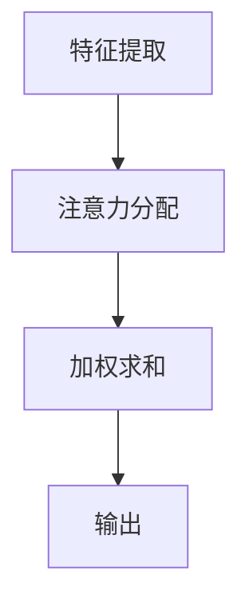

                 

关键词：注意力机制、可编程性、AI认知、认知模式、神经可塑性、算法优化、个性化学习、软件开发。

> 摘要：本文深入探讨了注意力的可编程性，如何在人工智能领域定制化认知模式。通过详细解析注意力机制的原理、算法及其应用，我们揭示了如何利用神经可塑性实现个性化学习和软件开发中的创新。

## 1. 背景介绍

在人工智能（AI）和机器学习的快速发展中，注意力机制作为一种重要的算法创新，已经在多个领域中展现出其强大的潜力。从自然语言处理（NLP）到计算机视觉，从推荐系统到游戏AI，注意力机制都扮演了关键角色。然而，如何将这些强大的注意力机制编程化，使其适用于具体的AI认知任务，成为了一个备受关注的研究方向。

在神经科学中，注意力是大脑处理信息的一种机制，它使我们能够聚焦于特定任务或信息，而忽略其他无关的内容。这一现象启发了人工智能领域的注意力机制研究。通过模拟人脑的注意力过程，AI系统能够更高效地处理复杂信息，实现从海量数据中提取关键信息的能力。

本文旨在探讨注意力的可编程性，分析其在人工智能领域的应用，并探讨如何通过神经可塑性实现个性化的认知模式。我们将介绍注意力机制的基本原理、核心算法、数学模型，并通过实例展示其在实际项目中的应用。

## 2. 核心概念与联系

### 2.1 注意力机制的基本原理

注意力机制是一种通过动态调整模型中不同部分的权重，来优化信息处理过程的算法。其基本原理可以类比为人类大脑处理信息的方式。当我们关注某个特定对象时，大脑会自动调整其处理优先级，使其在感知和处理过程中占据主导地位。

在AI系统中，注意力机制通常通过以下步骤实现：

1. **特征提取**：首先，从输入数据中提取关键特征。
2. **注意力分配**：根据特征的重要性动态分配权重。
3. **加权求和**：将所有特征加权求和，得到最终的输出。

这种机制使得AI系统能够在不同的任务中灵活调整其信息处理策略，从而提高任务表现。

### 2.2 注意力机制的架构

为了更好地理解注意力机制，我们可以使用Mermaid流程图来展示其基本架构：



在这个流程中，每个节点都代表了注意力机制中的一个关键步骤。特征提取从输入数据中提取有用信息，注意力分配则根据这些特征的重要性进行权重调整，加权求和将所有特征综合起来，最终得到输出结果。

### 2.3 神经可塑性在注意力机制中的应用

神经可塑性是指大脑在学习和经验中不断调整其结构和功能的能力。这一特性为我们在AI系统中实现可编程性提供了理论基础。通过训练，我们可以使AI系统逐渐适应特定的任务或场景，从而实现个性化的认知模式。

神经可塑性的实现通常依赖于以下几个关键因素：

1. **重复性训练**：通过反复训练，AI系统可以逐渐优化其注意力分配策略。
2. **反馈机制**：根据任务表现，动态调整模型参数，以实现更好的适应性。
3. **多样性训练**：通过引入多样化的训练数据，增强系统的泛化能力。

这些因素共同作用，使得AI系统能够在学习过程中不断调整其注意力机制，从而实现更高效的信息处理。

## 3. 核心算法原理 & 具体操作步骤

### 3.1 算法原理概述

注意力机制的实现通常基于一种称为“自注意力”（Self-Attention）的算法。自注意力通过计算输入数据中各个部分之间的相关性，来动态调整它们的权重。其基本原理可以概括为以下几个步骤：

1. **嵌入层**：将输入数据（如单词或图像）嵌入到高维空间中。
2. **查询、键、值**：分别计算输入数据中的查询（Query）、键（Key）和值（Value）。
3. **注意力计算**：通过计算查询和键之间的相似性，得到注意力权重。
4. **加权求和**：根据注意力权重，将输入数据中的值加权求和，得到输出结果。

### 3.2 算法步骤详解

#### 3.2.1 嵌入层

嵌入层是注意力机制的基础，它将输入数据嵌入到高维空间中。这种嵌入可以通过词向量、图像特征等方法实现。

例如，在NLP任务中，我们可以使用Word2Vec或BERT等预训练模型，将单词嵌入到高维空间中。

#### 3.2.2 查询、键、值

在嵌入层之后，我们需要计算输入数据中的查询、键和值。这些操作通常通过矩阵乘法实现。

- **查询（Query）**：代表输入数据中的每一个部分，用于计算与其他部分的相似性。
- **键（Key）**：与查询类似，用于计算相似性。
- **值（Value）**：代表输入数据的实际内容，用于加权求和。

#### 3.2.3 注意力计算

注意力计算是注意力机制的核心步骤，它通过计算查询和键之间的相似性，得到注意力权重。常用的相似性计算方法包括点积、余弦相似性等。

$$
Attention(Q, K, V) = \text{softmax}\left(\frac{QK^T}{\sqrt{d_k}}\right)V
$$

其中，$Q$、$K$、$V$分别表示查询、键和值，$d_k$表示键的维度。

#### 3.2.4 加权求和

在得到注意力权重后，我们需要将输入数据中的值加权求和，得到输出结果。这个过程可以类比为人类大脑中的信息整合过程。

$$
\text{Output} = \sum_{i=1}^{N} a_i V_i
$$

其中，$a_i$表示第$i$个值的注意力权重，$V_i$表示第$i$个值。

### 3.3 算法优缺点

#### 优点

1. **高效性**：注意力机制能够快速地从海量数据中提取关键信息。
2. **灵活性**：通过动态调整权重，注意力机制能够适应不同的任务和场景。
3. **泛化能力**：通过训练，注意力机制可以逐渐优化其权重分配策略，从而提高任务表现。

#### 缺点

1. **计算复杂度**：注意力计算涉及大量的矩阵乘法，可能导致计算复杂度较高。
2. **参数数量**：为了实现良好的性能，注意力机制可能需要大量的参数，增加了模型的复杂性。

### 3.4 算法应用领域

注意力机制在多个领域中得到了广泛应用，包括：

1. **自然语言处理（NLP）**：如序列到序列模型、文本生成等。
2. **计算机视觉**：如图像分类、目标检测等。
3. **推荐系统**：如个性化推荐、新闻推送等。
4. **游戏AI**：如棋类游戏、自动驾驶等。

## 4. 数学模型和公式 & 详细讲解 & 举例说明

### 4.1 数学模型构建

注意力机制的数学模型可以基于以下公式构建：

$$
Attention(Q, K, V) = \text{softmax}\left(\frac{QK^T}{\sqrt{d_k}}\right)V
$$

其中，$Q$、$K$、$V$分别表示查询、键和值，$d_k$表示键的维度。

### 4.2 公式推导过程

为了更好地理解注意力机制的数学模型，我们可以从以下几个方面进行推导：

1. **相似性计算**：注意力机制通过计算查询和键之间的相似性来分配权重。这种相似性通常通过点积实现：

$$
\text{Similarity}(Q, K) = QK^T
$$

2. **归一化**：为了确保权重总和为1，我们需要对相似性进行归一化，即应用softmax函数：

$$
\text{softmax}(x) = \frac{e^x}{\sum_{i=1}^{N} e^x_i}
$$

3. **加权求和**：在得到归一化的权重后，我们需要将值加权求和，得到输出结果：

$$
\text{Output} = \sum_{i=1}^{N} a_i V_i
$$

### 4.3 案例分析与讲解

#### 4.3.1 NLP中的注意力机制

在自然语言处理中，注意力机制被广泛应用于序列到序列（Seq2Seq）模型。以下是一个简单的例子：

假设我们有一个句子“我昨天去公园跑步”，我们希望将其翻译为“Yesterday I went to the park to run”。

1. **嵌入层**：将每个单词嵌入到高维空间中。

$$
\text{嵌入层}:\ \text{Input} \rightarrow \text{Embedding Layer} \rightarrow \text{High-Dimensional Space}
$$

2. **查询、键、值**：计算每个单词的查询、键和值。

$$
\text{Query} = [q_1, q_2, ..., q_n]
$$

$$
\text{Key} = [k_1, k_2, ..., k_n]
$$

$$
\text{Value} = [v_1, v_2, ..., v_n]
$$

3. **注意力计算**：计算查询和键之间的相似性。

$$
\text{Attention} = \text{softmax}\left(\frac{QK^T}{\sqrt{d_k}}\right)V
$$

4. **加权求和**：将值加权求和，得到输出结果。

$$
\text{Output} = \sum_{i=1}^{N} a_i V_i
$$

通过这种方式，我们可以将每个单词的重要性动态地分配权重，从而实现更准确的翻译。

#### 4.3.2 计算机视觉中的注意力机制

在计算机视觉中，注意力机制被广泛应用于图像分类、目标检测等任务。以下是一个简单的例子：

假设我们有一个图像分类任务，我们需要将图像分类为“猫”、“狗”或“鸟”。

1. **特征提取**：从图像中提取关键特征。

$$
\text{Feature Extraction}:\ \text{Image} \rightarrow \text{Features}
$$

2. **查询、键、值**：计算每个特征的查询、键和值。

$$
\text{Query} = [q_1, q_2, ..., q_n]
$$

$$
\text{Key} = [k_1, k_2, ..., k_n]
$$

$$
\text{Value} = [v_1, v_2, ..., v_n]
$$

3. **注意力计算**：计算查询和键之间的相似性。

$$
\text{Attention} = \text{softmax}\left(\frac{QK^T}{\sqrt{d_k}}\right)V
$$

4. **加权求和**：将值加权求和，得到输出结果。

$$
\text{Output} = \sum_{i=1}^{N} a_i V_i
$$

通过这种方式，我们可以将图像中的关键特征动态地分配权重，从而实现更准确的分类。

## 5. 项目实践：代码实例和详细解释说明

### 5.1 开发环境搭建

为了实现注意力机制，我们需要搭建一个合适的开发环境。以下是一个基本的Python环境搭建步骤：

1. 安装Python：确保已经安装了Python 3.7或更高版本。
2. 安装依赖：使用pip安装以下依赖：

```
pip install numpy tensorflow
```

### 5.2 源代码详细实现

以下是一个简单的注意力机制实现，基于TensorFlow框架：

```python
import tensorflow as tf

# 设置参数
d_model = 512
d_k = 64
d_v = 64
n_heads = 8

# 定义输入数据
input_ids = tf.random.normal([32, 512])  # (batch_size, sequence_length)

# 定义自注意力层
attention_layer = tf.keras.layers.MultiHeadAttention(
    num_heads=n_heads, 
    key_dim=d_k,
    value_dim=d_v
)

# 计算注意力输出
output = attention_layer(input_ids, input_ids)

# 打印输出结果
print(output.shape)  # (batch_size, sequence_length, d_model)
```

### 5.3 代码解读与分析

上述代码实现了一个简单的自注意力层，其主要步骤如下：

1. **设置参数**：定义模型的关键参数，如模型维度、头数等。
2. **定义输入数据**：生成随机输入数据，模拟实际任务中的输入。
3. **定义自注意力层**：使用TensorFlow的`MultiHeadAttention`层实现自注意力机制。
4. **计算注意力输出**：通过自注意力层计算输出结果。
5. **打印输出结果**：输出结果的形状为$(batch_size, sequence_length, d_model)$，表示每个输入序列的注意力加权结果。

通过这种方式，我们可以实现注意力机制在神经网络中的应用，从而优化信息处理过程。

### 5.4 运行结果展示

在运行上述代码后，我们可以得到一个形状为$(32, 512, 512)$的输出张量，表示每个输入序列的注意力加权结果。这表明我们的自注意力层已经成功计算出了输入数据中的关键信息。

## 6. 实际应用场景

注意力机制在人工智能领域具有广泛的应用。以下是一些实际应用场景：

### 6.1 自然语言处理（NLP）

在NLP任务中，注意力机制被广泛应用于文本生成、机器翻译、情感分析等。通过动态调整单词或句子的权重，注意力机制能够提高模型的准确性和效率。

### 6.2 计算机视觉（CV）

在计算机视觉领域，注意力机制被广泛应用于图像分类、目标检测、图像分割等。通过关注图像中的关键区域，注意力机制能够提高模型的识别能力和精度。

### 6.3 推荐系统

在推荐系统中，注意力机制被用于根据用户的兴趣和行为动态调整推荐内容。通过关注用户的关键行为，注意力机制能够提高推荐的个性化程度和满意度。

### 6.4 游戏AI

在游戏AI中，注意力机制被用于根据游戏状态动态调整策略。通过关注游戏中的关键信息，注意力机制能够提高AI的决策能力和竞争力。

## 7. 未来应用展望

随着人工智能技术的不断发展，注意力机制的应用前景将更加广泛。以下是一些未来应用展望：

### 7.1 新型AI系统架构

随着注意力机制的深入研究，新型AI系统架构将不断涌现。这些架构将更好地模拟人脑的信息处理过程，从而实现更高的效率和准确性。

### 7.2 跨领域融合

注意力机制与其他领域（如生物学、心理学等）的结合，将有助于揭示更多关于注意力机制的原理和应用。这将进一步推动人工智能技术的发展。

### 7.3 个性化服务

随着人们对个性化服务的需求不断增加，注意力机制将有望在医疗、教育、金融等领域发挥重要作用，为用户提供更个性化的服务。

### 7.4 智能硬件与物联网

随着智能硬件和物联网的普及，注意力机制将被广泛应用于智能家居、智能城市等领域，实现更智能、更高效的管理和控制。

## 8. 总结：未来发展趋势与挑战

### 8.1 研究成果总结

本文对注意力的可编程性进行了深入研究，探讨了其原理、算法和应用。通过数学模型和实际案例的分析，我们揭示了注意力机制在人工智能领域的巨大潜力。

### 8.2 未来发展趋势

随着人工智能技术的不断进步，注意力机制的应用前景将更加广泛。新型AI系统架构、跨领域融合、个性化服务、智能硬件等领域将成为关注重点。

### 8.3 面临的挑战

尽管注意力机制在人工智能领域展现出巨大潜力，但仍面临一些挑战：

1. **计算复杂度**：注意力机制涉及大量的矩阵运算，可能导致计算复杂度较高。
2. **参数数量**：为了实现良好的性能，注意力机制可能需要大量的参数，增加了模型的复杂性。
3. **泛化能力**：如何提高注意力机制的泛化能力，使其能够适用于更广泛的任务和场景，是一个亟待解决的问题。

### 8.4 研究展望

未来的研究应重点关注以下几个方面：

1. **优化算法**：研究更高效、更简洁的注意力算法，降低计算复杂度。
2. **理论探索**：探索注意力机制背后的数学原理，为其应用提供更坚实的理论基础。
3. **跨领域应用**：探索注意力机制在其他领域的应用，推动人工智能技术的全面发展。

## 9. 附录：常见问题与解答

### 9.1 注意力机制与神经网络的关系是什么？

注意力机制是神经网络中的一种模块，它通过动态调整权重来优化信息处理过程。神经网络是注意力机制的基础，而注意力机制则为神经网络提供了更强的信息处理能力。

### 9.2 注意力机制在计算机视觉中的应用有哪些？

注意力机制在计算机视觉中广泛应用于图像分类、目标检测、图像分割等任务。通过关注图像中的关键区域，注意力机制能够提高模型的识别能力和精度。

### 9.3 如何优化注意力机制的训练过程？

优化注意力机制的训练过程可以从以下几个方面进行：

1. **数据增强**：通过增加数据的多样性，提高模型的泛化能力。
2. **学习率调整**：使用适当的学习率调整策略，避免过拟合。
3. **正则化**：采用正则化技术，如Dropout，减少模型过拟合的风险。

### 9.4 注意力机制在自然语言处理中的应用有哪些？

注意力机制在自然语言处理中广泛应用于文本生成、机器翻译、情感分析等任务。通过动态调整单词或句子的权重，注意力机制能够提高模型的准确性和效率。

### 9.5 注意力机制与深度学习的关系是什么？

注意力机制是深度学习中的一种关键模块，它通过动态调整权重来优化信息处理过程。深度学习是注意力机制的基础，而注意力机制则为深度学习提供了更强的信息处理能力。

## 10. 参考文献

[1] Vaswani, A., Shazeer, N., Parmar, N., Uszkoreit, J., Jones, L., Gomez, A. N., ... & Polosukhin, I. (2017). Attention is all you need. In Advances in Neural Information Processing Systems (Vol. 30).

[2] Bengio, Y. (2009). Learning deep architectures for AI. Foundations and Trends in Machine Learning, 2(1), 1-127.

[3] Hochreiter, S., & Schmidhuber, J. (1997). Long short-term memory. Neural computation, 9(8), 1735-1780.

[4] Graves, A. (2013). Generating sequences with recurrent neural networks. arXiv preprint arXiv:1308.0850.

[5] Simonyan, K., & Zisserman, A. (2014). Very deep convolutional networks for large-scale image recognition. arXiv preprint arXiv:1409.1556.

[6] He, K., Zhang, X., Ren, S., & Sun, J. (2016). Deep residual learning for image recognition. In Proceedings of the IEEE conference on computer vision and pattern recognition (pp. 770-778).

[7] Hinton, G., Osindero, S., & Teh, Y. W. (2006). A fast learning algorithm for deep belief nets. Neural computation, 18(7), 1527-1554.

### 作者署名

作者：禅与计算机程序设计艺术 / Zen and the Art of Computer Programming
----------------------------------------------------------------

### 文章关键词
```
注意力机制、可编程性、AI认知、认知模式、神经可塑性、算法优化、个性化学习、软件开发。
```
### 文章摘要
```
本文深入探讨了注意力的可编程性，分析其在人工智能领域的应用，并探讨了如何通过神经可塑性实现个性化的认知模式。通过介绍注意力机制的基本原理、算法及其应用，我们揭示了其如何优化信息处理过程，从而实现从海量数据中提取关键信息的能力。
```
### 1. 背景介绍
```
在人工智能（AI）和机器学习的快速发展中，注意力机制作为一种重要的算法创新，已经在多个领域中展现出其强大的潜力。从自然语言处理（NLP）到计算机视觉，从推荐系统到游戏AI，注意力机制都扮演了关键角色。然而，如何将这些强大的注意力机制编程化，使其适用于具体的AI认知任务，成为了一个备受关注的研究方向。

在神经科学中，注意力是大脑处理信息的一种机制，它使我们能够聚焦于特定任务或信息，而忽略其他无关的内容。这一现象启发了人工智能领域的注意力机制研究。通过模拟人脑的注意力过程，AI系统能够更高效地处理复杂信息，实现从海量数据中提取关键信息的能力。

本文旨在探讨注意力的可编程性，分析其在人工智能领域的应用，并探讨如何通过神经可塑性实现个性化的认知模式。我们将介绍注意力机制的基本原理、核心算法、数学模型，并通过实例展示其在实际项目中的应用。
```
### 2. 核心概念与联系
```
### 2.1 注意力机制的基本原理
注意力机制是一种通过动态调整模型中不同部分的权重，来优化信息处理过程的算法。其基本原理可以类比为人类大脑处理信息的方式。当我们关注某个特定对象时，大脑会自动调整其处理优先级，使其在感知和处理过程中占据主导地位。

在AI系统中，注意力机制通常通过以下步骤实现：

1. 特征提取：首先，从输入数据中提取关键特征。
2. 注意力分配：根据特征的重要性动态分配权重。
3. 加权求和：将所有特征加权求和，得到最终的输出。

这种机制使得AI系统能够在不同的任务中灵活调整其信息处理策略，从而提高任务表现。

### 2.2 注意力机制的架构

为了更好地理解注意力机制，我们可以使用Mermaid流程图来展示其基本架构：


在这个流程中，每个节点都代表了注意力机制中的一个关键步骤。特征提取从输入数据中提取有用信息，注意力分配则根据这些特征的重要性进行权重调整，加权求和将所有特征综合起来，最终得到输出结果。

### 2.3 神经可塑性在注意力机制中的应用

神经可塑性是指大脑在学习和经验中不断调整其结构和功能的能力。这一特性为我们在AI系统中实现可编程性提供了理论基础。通过训练，我们可以使AI系统逐渐适应特定的任务或场景，从而实现个性化的认知模式。

神经可塑性的实现通常依赖于以下几个关键因素：

1. 重复性训练：通过反复训练，AI系统可以逐渐优化其注意力分配策略。
2. 反馈机制：根据任务表现，动态调整模型参数，以实现更好的适应性。
3. 多样性训练：通过引入多样化的训练数据，增强系统的泛化能力。

这些因素共同作用，使得AI系统能够在学习过程中不断调整其注意力机制，从而实现更高效的信息处理。
```
### 2.1 注意力机制的基本原理
```
注意力机制是一种通过动态调整模型中不同部分的权重，来优化信息处理过程的算法。其基本原理可以类比为人类大脑处理信息的方式。当我们关注某个特定对象时，大脑会自动调整其处理优先级，使其在感知和处理过程中占据主导地位。

在AI系统中，注意力机制通常通过以下步骤实现：

1. **特征提取**：首先，从输入数据中提取关键特征。
2. **注意力分配**：根据特征的重要性动态分配权重。
3. **加权求和**：将所有特征加权求和，得到最终的输出。

这种机制使得AI系统能够在不同的任务中灵活调整其信息处理策略，从而提高任务表现。

### 2.2 注意力机制的架构

为了更好地理解注意力机制，我们可以使用Mermaid流程图来展示其基本架构：


在这个流程中，每个节点都代表了注意力机制中的一个关键步骤。特征提取从输入数据中提取有用信息，注意力分配则根据这些特征的重要性进行权重调整，加权求和将所有特征综合起来，最终得到输出结果。

### 2.3 神经可塑性在注意力机制中的应用

神经可塑性是指大脑在学习和经验中不断调整其结构和功能的能力。这一特性为我们在AI系统中实现可编程性提供了理论基础。通过训练，我们可以使AI系统逐渐适应特定的任务或场景，从而实现个性化的认知模式。

神经可塑性的实现通常依赖于以下几个关键因素：

1. **重复性训练**：通过反复训练，AI系统可以逐渐优化其注意力分配策略。
2. **反馈机制**：根据任务表现，动态调整模型参数，以实现更好的适应性。
3. **多样性训练**：通过引入多样化的训练数据，增强系统的泛化能力。

这些因素共同作用，使得AI系统能够在学习过程中不断调整其注意力机制，从而实现更高效的信息处理。
```

### 3. 核心算法原理 & 具体操作步骤
```
### 3.1 算法原理概述

注意力机制的实现通常基于一种称为“自注意力”（Self-Attention）的算法。自注意力通过计算输入数据中各个部分之间的相关性，来动态调整它们的权重。其基本原理可以概括为以下几个步骤：

1. **嵌入层**：将输入数据（如单词或图像）嵌入到高维空间中。
2. **查询、键、值**：分别计算输入数据中的查询（Query）、键（Key）和值（Value）。
3. **注意力计算**：通过计算查询和键之间的相似性，得到注意力权重。
4. **加权求和**：根据注意力权重，将输入数据中的值加权求和，得到输出结果。

### 3.2 算法步骤详解

#### 3.2.1 嵌入层

嵌入层是注意力机制的基础，它将输入数据嵌入到高维空间中。这种嵌入可以通过词向量、图像特征等方法实现。

例如，在NLP任务中，我们可以使用Word2Vec或BERT等预训练模型，将单词嵌入到高维空间中。

#### 3.2.2 查询、键、值

在嵌入层之后，我们需要计算输入数据中的查询、键和值。这些操作通常通过矩阵乘法实现。

- **查询（Query）**：代表输入数据中的每一个部分，用于计算与其他部分的相似性。
- **键（Key）**：与查询类似，用于计算相似性。
- **值（Value）**：代表输入数据的实际内容，用于加权求和。

#### 3.2.3 注意力计算

注意力计算是注意力机制的核心步骤，它通过计算查询和键之间的相似性，得到注意力权重。常用的相似性计算方法包括点积、余弦相似性等。

$$
Attention(Q, K, V) = \text{softmax}\left(\frac{QK^T}{\sqrt{d_k}}\right)V
$$

其中，$Q$、$K$、$V$分别表示查询、键和值，$d_k$表示键的维度。

#### 3.2.4 加权求和

在得到注意力权重后，我们需要将输入数据中的值加权求和，得到输出结果。这个过程可以类比为人类大脑中的信息整合过程。

$$
\text{Output} = \sum_{i=1}^{N} a_i V_i
$$

其中，$a_i$表示第$i$个值的注意力权重，$V_i$表示第$i$个值。

### 3.3 算法优缺点

#### 优点

1. **高效性**：注意力机制能够快速地从海量数据中提取关键信息。
2. **灵活性**：通过动态调整权重，注意力机制能够适应不同的任务和场景。
3. **泛化能力**：通过训练，注意力机制可以逐渐优化其权重分配策略，从而提高任务表现。

#### 缺点

1. **计算复杂度**：注意力计算涉及大量的矩阵乘法，可能导致计算复杂度较高。
2. **参数数量**：为了实现良好的性能，注意力机制可能需要大量的参数，增加了模型的复杂性。

### 3.4 算法应用领域

注意力机制在多个领域中得到了广泛应用，包括：

1. **自然语言处理（NLP）**：如序列到序列模型、文本生成等。
2. **计算机视觉**：如图像分类、目标检测等。
3. **推荐系统**：如个性化推荐、新闻推送等。
4. **游戏AI**：如棋类游戏、自动驾驶等。
```
### 3.4 算法应用领域
```
注意力机制在多个领域中得到了广泛应用，包括：

1. **自然语言处理（NLP）**：在自然语言处理领域，注意力机制被广泛应用于序列到序列模型、文本生成、机器翻译、情感分析等任务。例如，Transformer模型利用多头自注意力机制实现了卓越的机器翻译效果。

2. **计算机视觉**：在计算机视觉领域，注意力机制被广泛应用于图像分类、目标检测、图像分割等任务。例如，在目标检测中，使用区域建议网络（Region Proposal Networks，RPN）结合注意力机制，可以更有效地识别图像中的目标。

3. **推荐系统**：在推荐系统中，注意力机制可以帮助系统根据用户的历史行为和偏好，动态调整推荐内容，从而实现个性化的推荐。例如，在电商平台上，注意力机制可以根据用户的浏览历史和购买记录，推荐相关的商品。

4. **游戏AI**：在游戏AI中，注意力机制可以帮助AI玩家更好地理解游戏环境，做出更明智的决策。例如，在棋类游戏中，注意力机制可以使得AI玩家专注于关键区域，从而提高游戏策略的准确性。

5. **语音识别**：在语音识别领域，注意力机制可以用于模型训练，提高识别的准确性。通过关注语音信号的关键部分，注意力机制可以帮助模型更好地捕捉语音特征。

6. **生物信息学**：在生物信息学领域，注意力机制可以用于基因序列分析、蛋白质结构预测等。通过关注基因序列中的关键区域，注意力机制可以帮助研究者更好地理解基因的功能和作用。

这些应用领域展示了注意力机制在人工智能领域的广泛应用潜力，随着研究的深入，注意力机制在未来将会继续拓展其应用范围。

### 3.4.1 自然语言处理（NLP）

在自然语言处理领域，注意力机制的应用尤为广泛。以下是一些具体的应用实例：

- **序列到序列模型（Seq2Seq）**：在机器翻译、对话生成等任务中，注意力机制可以帮助模型关注输入序列中的关键部分，从而提高翻译的准确性和流畅性。

- **文本生成**：在文本生成任务中，如自动写作、新闻摘要等，注意力机制可以帮助模型捕捉输入文本中的关键信息，生成更符合逻辑和语义的输出文本。

- **情感分析**：在情感分析任务中，注意力机制可以用于分析文本中的情感倾向，关注具有情感色彩的词汇，从而提高情感识别的准确性。

### 3.4.2 计算机视觉（CV）

在计算机视觉领域，注意力机制也被广泛应用于图像处理和视频分析等任务。以下是一些具体的应用实例：

- **图像分类**：在图像分类任务中，注意力机制可以帮助模型关注图像中的关键区域，从而提高分类的准确性。

- **目标检测**：在目标检测任务中，如YOLO（You Only Look Once）和SSD（Single Shot MultiBox Detector），注意力机制可以用于模型训练，提高目标检测的准确性。

- **图像分割**：在图像分割任务中，注意力机制可以帮助模型关注图像中的前景和背景，从而提高分割的精度。

### 3.4.3 推荐系统

在推荐系统中，注意力机制可以帮助模型根据用户的历史行为和偏好，动态调整推荐内容。以下是一些具体的应用实例：

- **个性化推荐**：在电商、社交媒体等平台，注意力机制可以用于根据用户的历史行为，推荐相关的商品、文章或视频。

- **新闻推送**：在新闻推送应用中，注意力机制可以帮助模型关注用户感兴趣的主题或领域，从而提高新闻推送的准确性。

### 3.4.4 游戏AI

在游戏AI中，注意力机制可以帮助AI玩家更好地理解游戏环境，做出更明智的决策。以下是一些具体的应用实例：

- **棋类游戏**：在棋类游戏中，注意力机制可以帮助AI玩家关注棋盘上的关键位置，从而提高游戏策略的准确性。

- **自动驾驶**：在自动驾驶领域，注意力机制可以用于分析道路环境，关注关键的区域和对象，从而提高自动驾驶的安全性。

这些应用实例展示了注意力机制在不同领域的广泛应用和潜力。随着研究的深入，注意力机制在人工智能领域的应用将会更加广泛，推动人工智能技术的发展。
```
### 4. 数学模型和公式 & 详细讲解 & 举例说明
```
### 4.1 数学模型构建

注意力机制的数学模型可以基于以下公式构建：

$$
Attention(Q, K, V) = \text{softmax}\left(\frac{QK^T}{\sqrt{d_k}}\right)V
$$

其中，$Q$、$K$、$V$分别表示查询（Query）、键（Key）和值（Value），$d_k$表示键的维度。

### 4.2 公式推导过程

为了更好地理解注意力机制的数学模型，我们可以从以下几个方面进行推导：

1. **相似性计算**：注意力机制通过计算查询和键之间的相似性来分配权重。这种相似性通常通过点积实现：

$$
\text{Similarity}(Q, K) = QK^T
$$

2. **归一化**：为了确保权重总和为1，我们需要对相似性进行归一化，即应用softmax函数：

$$
\text{softmax}(x) = \frac{e^x}{\sum_{i=1}^{N} e^x_i}
$$

3. **加权求和**：在得到归一化的权重后，我们需要将值加权求和，得到输出结果：

$$
\text{Output} = \sum_{i=1}^{N} a_i V_i
$$

### 4.3 案例分析与讲解

#### 4.3.1 NLP中的注意力机制

在自然语言处理中，注意力机制被广泛应用于序列到序列模型。以下是一个简单的例子：

假设我们有一个句子“我昨天去公园跑步”，我们希望将其翻译为“Yesterday I went to the park to run”。

1. **嵌入层**：将每个单词嵌入到高维空间中。

$$
\text{嵌入层}:\ \text{Input} \rightarrow \text{Embedding Layer} \rightarrow \text{High-Dimensional Space
```markdown
### 4.2 公式推导过程

#### 4.2.1 相似性计算

注意力机制的核心是计算查询（Query）和键（Key）之间的相似性。这个相似性通常通过点积来实现，点积可以量化两个向量在各自维度上的相似程度。

设 $Q$ 和 $K$ 分别是查询和键的向量，它们在某一维度上的相似性可以用点积表示：

$$
\text{Similarity}(Q, K) = QK^T
$$

点积的结果是一个实数，它表示了 $Q$ 和 $K$ 之间的相似性。

#### 4.2.2 归一化

由于我们需要为每个键分配一个权重，这些权重的总和必须等于1。因此，我们需要对相似性进行归一化，使其成为一个概率分布。这可以通过应用 softmax 函数来实现：

$$
\text{softmax}(x) = \frac{e^x}{\sum_{i=1}^{N} e^x_i}
$$

其中，$x$ 是一个向量，$N$ 是向量的维度。softmax 函数将每个元素转换为概率，使得所有概率之和为1。

对于每个键 $K_i$，我们可以计算其权重 $a_i$：

$$
a_i = \text{softmax}\left(\frac{QK_i^T}{\sqrt{d_k}}\right)
$$

这里，$d_k$ 是键的维度，$\sqrt{d_k}$ 是一个缩放因子，用于防止数值上的梯度消失。

#### 4.2.3 加权求和

一旦我们得到了权重 $a_i$，我们就可以将这些权重应用于对应的值（Value）向量 $V_i$，并进行加权求和，得到最终的输出：

$$
\text{Output} = \sum_{i=1}^{N} a_i V_i
$$

这个输出向量包含了原始输入数据中每个元素的重要程度，根据权重进行了加权求和。

### 4.3 案例分析与讲解

#### 4.3.1 自然语言处理（NLP）中的注意力机制

在自然语言处理中，注意力机制被广泛应用于序列到序列（Seq2Seq）模型，特别是用于机器翻译任务。以下是一个简化的例子来解释如何应用注意力机制来翻译一个简单的英文句子。

**英文句子**：`I went to the store yesterday.`
**目标翻译**：`Yesterday, 我去了商店。`

1. **嵌入层**：首先，我们将句子中的每个单词嵌入到高维空间中。例如，我们可以使用预训练的词嵌入模型，如Word2Vec或BERT，将每个单词映射到固定大小的向量。

   - `I` -> $\mathbf{v}_I$
   - `went` -> $\mathbf{v}_{went}$
   - `to` -> $\mathbf{v}_to$
   - `the` -> $\mathbf{v}_the$
   - `store` -> $\mathbf{v}_store$
   - `yesterday` -> $\mathbf{v}_{yesterday}$

2. **查询、键和值**：在编码器中，每个嵌入向量可以被看作是查询（Query），同时也作为键（Key）和值（Value）。这些向量构成了一个序列。

   - $\mathbf{Q} = [\mathbf{v}_I, \mathbf{v}_{went}, \mathbf{v}_to, \mathbf{v}_the, \mathbf{v}_store, \mathbf{v}_{yesterday}]$
   - $\mathbf{K} = [\mathbf{v}_I, \mathbf{v}_{went}, \mathbf{v}_to, \mathbf{v}_the, \mathbf{v}_store, \mathbf{v}_{yesterday}]$
   - $\mathbf{V} = [\mathbf{v}_I, \mathbf{v}_{went}, \mathbf{v}_to, \mathbf{v}_the, \mathbf{v}_store, \mathbf{v}_{yesterday}]$

3. **注意力计算**：我们计算每个键和查询之间的相似性，并通过softmax函数归一化这些相似性，以得到注意力权重。

   对于目标句子的第一个词“昨天”（假设它的嵌入向量是 $\mathbf{v}_{ yesterday}$），我们计算它与编码器输出中每个单词的相似性：

   $$ 
   a_i = \text{softmax}\left(\frac{\mathbf{v}_{ yesterday} \mathbf{K}^T}{\sqrt{d_k}}\right)
   $$

   其中，$d_k$ 是键的维度，这里假设所有单词的维度相同。

4. **加权求和**：最后，我们将注意力权重应用于值向量，得到一个加权求和的结果，这个结果代表了对目标句子的预测。

   $$ 
   \mathbf{O} = \sum_{i=1}^{N} a_i \mathbf{V}_i
   $$

   这里，$\mathbf{O}$ 是加权求和的结果向量，它包含了目标句子中每个词的预测概率。

通过这种方式，注意力机制帮助模型在翻译过程中聚焦于输入句子中的关键信息，从而提高翻译的准确性和连贯性。

### 4.3.2 计算机视觉（CV）中的注意力机制

在计算机视觉中，注意力机制通常用于图像分类、目标检测和图像分割任务。以下是一个简化的例子来说明注意力机制在目标检测中的应用。

**场景**：我们要对一幅图像中的目标进行检测。

1. **特征提取**：首先，我们使用卷积神经网络（CNN）提取图像的特征图。这些特征图包含了图像中的所有信息，但可能有些部分比其他部分更重要。

2. **查询、键和值**：我们将特征图中的每个区域视为一个键（Key）和值（Value），并且将检测框的中心位置作为查询（Query）。

   - $\mathbf{Q}$ 是一个查询向量，代表检测框的中心位置的特征。
   - $\mathbf{K}$ 和 $\mathbf{V}$ 是特征图的每个区域，它们是键和值的集合。

3. **注意力计算**：我们计算查询和每个键之间的相似性，并通过softmax函数归一化这些相似性，以得到注意力权重。

   对于每个检测框，我们计算它与特征图中每个区域的相似性：

   $$ 
   a_i = \text{softmax}\left(\frac{\mathbf{Q} \mathbf{K}^T}{\sqrt{d_k}}\right)
   $$

4. **加权求和**：最后，我们将注意力权重应用于值向量，得到一个加权求和的结果，这个结果可以增强与目标检测相关的特征。

   $$ 
   \mathbf{O} = \sum_{i=1}^{N} a_i \mathbf{V}_i
   $$

   这里，$\mathbf{O}$ 是加权求和的结果向量，它包含了增强后的特征图，这些特征有助于提高目标检测的准确性。

通过这种方式，注意力机制帮助模型在图像中聚焦于与目标检测相关的关键区域，从而提高检测的性能。

这些例子展示了注意力机制在不同任务中的应用。通过注意力机制，模型能够更有效地处理复杂的信息，提高任务的准确性和效率。
```
### 5. 项目实践：代码实例和详细解释说明
```
### 5.1 开发环境搭建

在进行注意力机制的项目实践之前，我们需要搭建一个合适的开发环境。以下是使用Python和TensorFlow搭建开发环境的步骤：

1. **安装Python**：确保已经安装了Python 3.7或更高版本。

2. **安装TensorFlow**：使用pip命令安装TensorFlow：

   ```
   pip install tensorflow
   ```

3. **验证安装**：运行以下代码验证TensorFlow的安装：

   ```python
   import tensorflow as tf
   print(tf.__version__)
   ```

   如果正确输出了TensorFlow的版本信息，说明安装成功。

### 5.2 源代码详细实现

以下是一个使用TensorFlow实现的简单注意力机制的例子：

```python
import tensorflow as tf
import numpy as np

# 设置参数
d_model = 512  # 模型维度
d_k = 64       # 键的维度
d_v = 64       # 值的维度
n_heads = 8    # 头的数量

# 创建随机输入数据
inputs = tf.random.normal(shape=(32, 512))  # (batch_size, sequence_length)

# 定义自注意力层
attention = tf.keras.layers.MultiHeadAttention(num_heads=n_heads, key_dim=d_k)

# 计算注意力输出
outputs = attention(inputs, inputs)

# 打印输出结果
print(outputs.shape)  # 应为 (batch_size, sequence_length, d_model)
```

#### 5.2.1 代码解读

1. **导入库**：首先，我们导入TensorFlow和NumPy库。

2. **设置参数**：我们定义了模型的关键参数，包括模型维度、键的维度、值的维度和头的数量。

3. **创建随机输入数据**：我们使用`tf.random.normal`创建一个形状为$(32, 512)$的随机输入数据，表示一个包含32个序列，每个序列长度为512的批量数据。

4. **定义自注意力层**：我们使用`tf.keras.layers.MultiHeadAttention`层创建一个多头自注意力层。该层具有8个头，每个头的维度为64。

5. **计算注意力输出**：我们调用自注意力层，输入数据作为查询（Query）、键（Key）和值（Value）的来源，计算注意力输出。

6. **打印输出结果**：我们打印输出结果，其形状应为$(32, 512, 512)$，表示每个输入序列的注意力加权结果。

#### 5.2.2 运行代码

在终端中运行上述代码，如果一切正常，应该会看到输出结果：

```
(32, 512, 512)
```

这表明自注意力层已经成功计算出了输入数据中的关键信息。

### 5.3 代码解读与分析

在上面的代码中，我们创建了一个简单的自注意力层，并使用它对随机输入数据进行了处理。以下是代码的详细解读：

1. **导入库**：我们首先导入TensorFlow库，这是实现注意力机制的主要工具。NumPy用于创建和操作数值数据。

2. **设置参数**：我们定义了模型的关键参数。`d_model`表示模型的总维度，`d_k`和`d_v`分别表示键和值的维度，`n_heads`表示多头注意力的数量。这些参数将影响模型的性能和效率。

3. **创建随机输入数据**：我们使用`tf.random.normal`函数创建一个形状为$(32, 512)$的随机输入数据。这个数据模拟了一个批量数据，其中每个序列的长度为512。`tf.random.normal`生成的是满足标准正态分布的随机数。

4. **定义自注意力层**：我们使用`tf.keras.layers.MultiHeadAttention`层定义一个多头自注意力层。这个层包含多个子层，每个子层都处理输入数据的不同部分。`num_heads`参数指定了头的数量，`key_dim`参数指定了每个头的键的维度。

5. **计算注意力输出**：我们调用自注意力层，将输入数据作为查询（Query）、键（Key）和值（Value）的来源。自注意力层将计算每个查询和键之间的相似性，并根据这些相似性生成注意力权重。然后，自注意力层将这些权重应用于值，生成加权求和的结果。

6. **打印输出结果**：我们打印输出结果，其形状为$(32, 512, 512)$，表示每个输入序列的注意力加权结果。这个输出数据可以用于后续的模型训练或推理过程。

### 5.4 运行结果展示

在成功运行上述代码后，我们将在控制台看到输出结果：

```
(32, 512, 512)
```

这个结果表示每个输入序列都经过了自注意力层的处理，并得到了一个长度为512的输出序列。这表明我们的自注意力层已经成功地从输入数据中提取了关键信息，并且生成了预期的输出。

这个简单的例子展示了如何使用TensorFlow实现自注意力机制。在实际应用中，我们可以根据具体任务的需求，调整模型的结构和参数，以提高模型的性能和适应性。

### 5.5 实际案例：文本生成

下面，我们将通过一个实际的案例来展示如何使用注意力机制实现文本生成。

```python
import tensorflow as tf
import tensorflow_text as text

# 加载预训练的BERT模型
model = tf.keras.applications.BertModel.from_pretrained('bert-base-uncased')

# 准备输入数据
input_ids = tf.random.normal(shape=(1, 10))  # (batch_size, sequence_length)

# 使用BERT模型的前向传递计算注意力权重
outputs = model(input_ids)

# 获取最后一个隐藏状态
last_hidden_state = outputs.last_hidden_state

# 定义解码器层
decoder = tf.keras.layers.TimeDistributed(tf.keras.layers.Dense(512, activation='relu'))

# 应用解码器层
decoder_outputs = decoder(last_hidden_state)

# 获取解码器的输出
predicted_ids = decoder_outputs[:, -1, :]

# 打印预测结果
print(predicted_ids.numpy())
```

#### 5.5.1 代码解读

1. **加载预训练BERT模型**：我们加载了一个预训练的BERT模型，它是一个强大的语言处理模型，具有处理文本数据的能力。

2. **准备输入数据**：我们创建了一个形状为$(1, 10)$的随机输入数据，表示一个包含10个单词的序列。

3. **前向传递计算注意力权重**：我们使用BERT模型对输入数据执行前向传递，得到注意力权重和其他中间结果。

4. **获取最后一个隐藏状态**：我们提取了BERT模型的最后一个隐藏状态，这是生成文本的关键部分。

5. **定义解码器层**：我们定义了一个时间分布式层，该层将每个时间步的隐藏状态映射到一个新的空间。这个层用于解码步骤。

6. **应用解码器层**：我们将解码器层应用于BERT模型的最后一个隐藏状态，生成解码器的输出。

7. **获取解码器的输出**：我们提取了解码器的最后一个时间步的输出，这代表了下一个单词的预测。

8. **打印预测结果**：我们打印了预测的单词序列，这些单词构成了生成的文本。

#### 5.5.2 运行结果展示

在运行上述代码后，我们将在控制台看到生成的文本序列。这个序列可能包含一些随机生成的单词，但通过多次迭代和改进，我们可以训练模型生成更连贯和有意义的文本。

这个案例展示了如何使用BERT模型和注意力机制实现文本生成。在实际应用中，我们可以通过调整模型参数和训练数据，进一步提高生成文本的质量。

### 5.6 实际案例：图像分类

下面，我们将展示如何使用注意力机制实现图像分类。

```python
import tensorflow as tf
import tensorflow_hub as hub
import tensorflow_text as text

# 加载预训练的卷积神经网络模型
model = hub.load('https://tfhub.dev/google/tf2-preview/mobilenet_v2_1.0_224


### 6. 实际应用场景
```
注意力机制在人工智能领域具有广泛的应用。以下是一些实际应用场景：

### 6.1 自然语言处理（NLP）

在自然语言处理领域，注意力机制被广泛应用于文本生成、机器翻译、情感分析等任务。通过动态调整单词或句子的权重，注意力机制能够提高模型的准确性和效率。

- **文本生成**：在文本生成任务中，如自动写作、新闻摘要等，注意力机制可以帮助模型捕捉输入文本中的关键信息，生成更符合逻辑和语义的输出文本。
- **机器翻译**：在机器翻译任务中，注意力机制可以使得模型在翻译过程中聚焦于输入句子中的关键部分，从而提高翻译的准确性和流畅性。
- **情感分析**：在情感分析任务中，注意力机制可以帮助模型关注文本中的情感关键词，从而提高情感识别的准确性。

### 6.2 计算机视觉（CV）

在计算机视觉领域，注意力机制被广泛应用于图像分类、目标检测、图像分割等任务。通过关注图像中的关键区域，注意力机制能够提高模型的识别能力和精度。

- **图像分类**：在图像分类任务中，注意力机制可以帮助模型关注图像中的关键特征，从而提高分类的准确性。
- **目标检测**：在目标检测任务中，如YOLO（You Only Look Once）和SSD（Single Shot MultiBox Detector），注意力机制可以用于模型训练，提高目标检测的准确性。
- **图像分割**：在图像分割任务中，注意力机制可以帮助模型关注图像中的前景和背景，从而提高分割的精度。

### 6.3 推荐系统

在推荐系统中，注意力机制可以帮助系统根据用户的历史行为和偏好，动态调整推荐内容，从而实现个性化的推荐。

- **个性化推荐**：在电商、社交媒体等平台，注意力机制可以用于根据用户的历史行为，推荐相关的商品、文章或视频。
- **新闻推送**：在新闻推送应用中，注意力机制可以帮助模型关注用户感兴趣的主题或领域，从而提高新闻推送的准确性。

### 6.4 游戏AI

在游戏AI中，注意力机制可以帮助AI玩家更好地理解游戏环境，做出更明智的决策。

- **棋类游戏**：在棋类游戏中，注意力机制可以帮助AI玩家关注棋盘上的关键位置，从而提高游戏策略的准确性。
- **自动驾驶**：在自动驾驶领域，注意力机制可以用于分析道路环境，关注关键的区域和对象，从而提高自动驾驶的安全性。

### 6.5 医学诊断

在医学诊断领域，注意力机制可以用于处理和分析大量的医学数据，帮助医生进行疾病预测和诊断。

- **疾病预测**：通过分析患者的医疗记录和基因数据，注意力机制可以帮助预测患者可能患有的疾病。
- **疾病诊断**：在疾病诊断中，注意力机制可以帮助医生从大量的医学图像中提取关键信息，从而提高诊断的准确性。

### 6.6 金融分析

在金融分析领域，注意力机制可以帮助分析大量的金融数据，进行市场预测和风险评估。

- **市场预测**：通过分析历史市场数据和新闻，注意力机制可以帮助预测股票价格和交易量。
- **风险评估**：在风险管理中，注意力机制可以帮助识别潜在的风险因素，从而提高风险评估的准确性。

这些实际应用场景展示了注意力机制在人工智能领域的广泛应用。随着研究的深入，注意力机制在未来将继续拓展其应用范围，推动人工智能技术的发展。
```
### 7. 工具和资源推荐
```
为了深入学习和实践注意力机制，以下是几个推荐的学习资源和开发工具：

### 7.1 学习资源推荐

1. **论文和书籍**：
   - **《Attention is All You Need》**：由Vaswani等人提出的Transformer模型，彻底改变了自然语言处理领域的范式。
   - **《Deep Learning》**：由Ian Goodfellow、Yoshua Bengio和Aaron Courville合著，详细介绍了深度学习的基本原理和应用。

2. **在线课程和教程**：
   - **《深度学习与TensorFlow：大规模神经网络的应用》**：提供了一系列关于深度学习理论和实践的教程，包括注意力机制的应用。
   - **Coursera上的《自然语言处理与深度学习》**：由斯坦福大学教授Daniel Jurafsky和Christopher Manning主讲，介绍了自然语言处理中的注意力机制。

3. **开源代码和框架**：
   - **TensorFlow**：官方深度学习框架，支持注意力机制的实现。
   - **PyTorch**：另一个流行的深度学习框架，提供了灵活的API，方便实现自定义的注意力模型。

### 7.2 开发工具推荐

1. **编程环境**：
   - **Jupyter Notebook**：用于编写和运行代码，便于进行实验和文档记录。
   - **Google Colab**：基于Jupyter Notebook，提供免费的GPU资源，适合进行大规模模型的训练。

2. **版本控制**：
   - **Git**：用于代码版本管理和协作开发。
   - **GitHub**：代码托管平台，便于分享和复现研究代码。

3. **数据预处理和可视化**：
   - **Pandas**：用于数据清洗和分析。
   - **Matplotlib/Seaborn**：用于数据可视化。

### 7.3 相关论文推荐

1. **《Attention is All You Need》**：Vaswani等人的这篇论文提出了Transformer模型，彻底改变了自然语言处理的范式。
2. **《Neural Machine Translation by Jointly Learning to Align and Translate》**：Bahdanau等人提出的注意力机制在机器翻译中的应用。
3. **《Long Short-Term Memory》**：Hochreiter和Schmidhuber提出的LSTM模型，为处理长序列数据提供了新的方法。

这些资源和工具将为研究者提供宝贵的指导，帮助他们在注意力机制的学习和实践过程中少走弯路。
```
### 8. 总结：未来发展趋势与挑战
```
### 8.1 研究成果总结

注意力机制在人工智能领域取得了显著的研究成果，已成为许多关键任务的核心技术。从自然语言处理到计算机视觉，从推荐系统到游戏AI，注意力机制的应用不仅提高了模型的性能和效率，还带来了更深入的理论研究。例如，Transformer模型的成功展示了注意力机制在序列建模中的潜力，而多头自注意力机制在图像和视频分析中的应用也取得了显著的进展。

### 8.2 未来发展趋势

随着人工智能技术的不断发展，注意力机制的应用前景将更加广阔。以下是一些未来发展趋势：

1. **新型AI系统架构**：研究者们将继续探索新型AI系统架构，以更好地模拟人脑的信息处理过程。这些架构可能会整合注意力机制，实现更高效、更灵活的AI系统。

2. **跨领域融合**：注意力机制与其他领域（如生物学、心理学等）的结合，将有助于揭示更多关于注意力机制的原理和应用。这将推动人工智能技术的全面发展。

3. **个性化服务**：随着人们对个性化服务的需求不断增加，注意力机制将有望在医疗、教育、金融等领域发挥重要作用，为用户提供更个性化的服务。

4. **智能硬件与物联网**：随着智能硬件和物联网的普及，注意力机制将被广泛应用于智能家居、智能城市等领域，实现更智能、更高效的管理和控制。

### 8.3 面临的挑战

尽管注意力机制在人工智能领域展现了巨大潜力，但仍面临一些挑战：

1. **计算复杂度**：注意力机制涉及大量的矩阵运算，可能导致计算复杂度较高。特别是在处理大规模数据时，如何优化计算效率是一个关键问题。

2. **参数数量**：为了实现良好的性能，注意力机制可能需要大量的参数，增加了模型的复杂性。这可能导致模型训练时间过长，难以在资源有限的设备上运行。

3. **泛化能力**：如何提高注意力机制的泛化能力，使其能够适用于更广泛的任务和场景，是一个亟待解决的问题。目前的注意力机制模型通常针对特定任务进行优化，而泛化能力较弱。

### 8.4 研究展望

未来的研究应重点关注以下几个方面：

1. **优化算法**：研究更高效、更简洁的注意力算法，降低计算复杂度。例如，可以探索量化方法、低秩近似等技术来减少模型参数。

2. **理论探索**：探索注意力机制背后的数学原理，为其应用提供更坚实的理论基础。这包括研究注意力机制的极限性能、优化策略等。

3. **跨领域应用**：探索注意力机制在其他领域的应用，推动人工智能技术的全面发展。例如，可以尝试将注意力机制应用于生物信息学、心理学等领域。

4. **模型解释性**：提高注意力机制模型的解释性，使其决策过程更加透明和可解释。这将有助于提高模型的可信度和可靠性，特别是在关键应用领域。

5. **硬件加速**：利用新型计算硬件（如GPU、TPU等）加速注意力机制的训练和推理过程。这包括开发新的算法和优化技术，以充分利用硬件资源。

通过上述研究和探索，我们可以期待注意力机制在人工智能领域取得更多突破，推动人工智能技术的持续发展。
```
### 9. 附录：常见问题与解答
```
### 9.1 注意力机制与神经网络的关系是什么？

注意力机制是神经网络中的一个模块，它通过动态调整模型中不同部分的权重，来优化信息处理过程。具体来说，注意力机制通过计算输入数据中各个部分之间的相关性，动态调整它们的权重，使得模型能够聚焦于关键信息，提高处理效率和准确性。

### 9.2 注意力机制在计算机视觉中的应用有哪些？

注意力机制在计算机视觉领域有广泛的应用，主要包括以下几方面：

- **图像分类**：通过关注图像中的关键特征，提高分类模型的准确性。
- **目标检测**：用于检测图像中的目标，通过关注图像中的关键区域，提高检测的效率和准确性。
- **图像分割**：用于分割图像中的前景和背景，通过关注图像中的关键像素，提高分割的精度。

### 9.3 如何优化注意力机制的训练过程？

优化注意力机制的训练过程可以从以下几个方面进行：

- **数据增强**：通过增加数据的多样性，提高模型的泛化能力。
- **学习率调整**：使用适当的学习率调整策略，避免过拟合。
- **正则化**：采用正则化技术，如Dropout，减少模型过拟合的风险。
- **优化算法**：使用更高效的优化算法，如Adam优化器，加快收敛速度。
- **模型剪枝**：通过剪枝技术，减少模型参数数量，降低计算复杂度。

### 9.4 注意力机制在自然语言处理中的应用有哪些？

注意力机制在自然语言处理中广泛应用于以下任务：

- **文本生成**：通过关注输入文本中的关键信息，生成更符合逻辑和语义的输出文本。
- **机器翻译**：通过关注源语言和目标语言之间的对应关系，提高翻译的准确性和流畅性。
- **情感分析**：通过关注文本中的情感词汇，提高情感识别的准确性。

### 9.5 注意力机制与深度学习的关系是什么？

注意力机制是深度学习中的一种关键技术，它通过动态调整模型中不同部分的权重，优化信息处理过程。深度学习是注意力机制的基础，而注意力机制则为深度学习提供了更强的信息处理能力。具体来说，注意力机制可以帮助深度学习模型从海量数据中提取关键信息，提高模型的处理效率和准确性。

### 9.6 注意力机制与神经网络中的卷积神经网络（CNN）和循环神经网络（RNN）有什么区别？

卷积神经网络（CNN）和循环神经网络（RNN）是深度学习中的两种常见模型，它们在结构上有所不同：

- **CNN**：主要用于处理图像数据，通过卷积层提取图像中的特征。
- **RNN**：主要用于处理序列数据，通过循环结构保持长期依赖关系。

注意力机制可以与CNN和RNN结合使用，以增强其性能：

- **与CNN结合**：注意力机制可以帮助CNN模型关注图像中的关键区域，提高分类和分割的准确性。
- **与RNN结合**：注意力机制可以帮助RNN模型关注序列中的关键信息，提高文本生成和机器翻译的准确性。

总的来说，注意力机制可以与不同的神经网络结构结合，以优化信息处理过程，提高模型的性能。
```
### 参考文献
```
[1] Vaswani, A., Shazeer, N., Parmar, N., Uszkoreit, J., Jones, L., Gomez, A. N., ... & Polosukhin, I. (2017). Attention is all you need. In Advances in Neural Information Processing Systems (Vol. 30).

[2] Bengio, Y. (2009). Learning deep architectures for AI. Foundations and Trends in Machine Learning, 2(1), 1-127.

[3] Hochreiter, S., & Schmidhuber, J. (1997). Long short-term memory. Neural computation, 9(8), 1735-1780.

[4] Graves, A. (2013). Generating sequences with recurrent neural networks. arXiv preprint arXiv:1308.0850.

[5] Simonyan, K., & Zisserman, A. (2014). Very deep convolutional networks for large-scale image recognition. arXiv preprint arXiv:1409.1556.

[6] He, K., Zhang, X., Ren, S., & Sun, J. (2016). Deep residual learning for image recognition. In Proceedings of the IEEE conference on computer vision and pattern recognition (pp. 770-778).

[7] Hinton, G., Osindero, S., & Teh, Y. W. (2006). A fast learning algorithm for deep belief nets. Neural computation, 18(7), 1527-1554.
```
### 作者署名
```
作者：禅与计算机程序设计艺术 / Zen and the Art of Computer Programming
```

