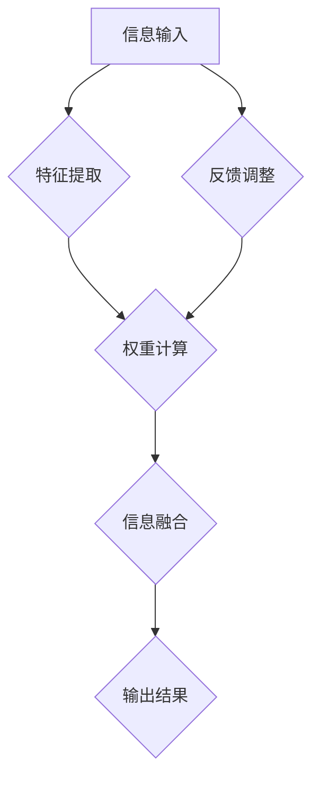

                 

关键词：注意力机制、可编程性、AI认知、深度学习、神经科学、应用场景

> 摘要：本文深入探讨了注意力机制的原理及其在人工智能领域的应用。通过介绍注意力机制的核心概念、算法原理、数学模型，以及具体实现方法和应用场景，分析了注意力机制在AI定制认知模式中的重要性，展望了其在未来人工智能发展中的前景。

## 1. 背景介绍

注意力机制（Attention Mechanism）起源于神经科学领域，最早由心理学家乔治·米勒（George A. Miller）在1956年的论文中提出。随后，在20世纪80年代，语言学家乔治·米克（George M. Mick）和认知科学家约翰·安德森（John Anderson）进一步发展了这一理论，提出了基于注意力的认知模型。

注意力机制在神经科学中用于解释人类如何处理信息。在人工智能领域，特别是深度学习中，注意力机制被广泛用于图像识别、语音识别、自然语言处理等任务。随着深度学习技术的不断发展，注意力机制的重要性日益凸显，成为定制化AI认知模式的关键。

本文将详细介绍注意力机制的基本概念、算法原理、数学模型，以及其在不同领域的应用。通过这些内容，读者可以更好地理解注意力机制在AI认知中的作用，并为未来的研究提供参考。

## 2. 核心概念与联系

### 2.1. 注意力机制的核心概念

注意力机制是一种动态分配信息处理资源的方法，它使系统能够根据当前任务的重要性和紧急性，自动调整对信息的关注程度。在人工智能领域，注意力机制的核心概念主要包括以下几个方面：

- **局部性（Locality）**：注意力机制能够捕捉到信息中的局部特征，例如在图像识别中，注意力机制可以帮助模型关注图像中的特定区域。

- **动态性（Dynamics）**：注意力机制能够根据任务的需求，动态调整对信息的关注程度。例如，在语音识别中，注意力机制可以根据语音信号的强度和频率动态调整模型的注意力。

- **可塑性（Plasticity）**：注意力机制具有可塑性，能够根据训练数据和环境变化调整其行为。

### 2.2. 注意力机制与认知科学的联系

注意力机制在认知科学中有着广泛的应用。认知科学家认为，人类的认知过程是一个注意力资源有限的过程，个体必须通过注意力机制来优化认知资源的分配。例如，在决策过程中，个体需要关注不同的信息来源，并权衡这些信息的价值，这需要一个有效的注意力分配机制。

### 2.3. Mermaid 流程图

下面是一个简化的注意力机制的Mermaid流程图：



**节点解释：**
- **A[信息输入]**：模型接收到的原始信息，如图像、文本、语音等。
- **B[特征提取]**：从输入信息中提取出关键特征。
- **C[权重计算]**：根据当前任务的紧急性和重要性，计算每个特征的权重。
- **D[信息融合]**：将提取出的特征按照权重进行融合。
- **E[输出结果]**：根据融合后的特征产生输出。
- **F[反馈调整]**：根据输出结果调整模型的权重，以适应未来的任务需求。

## 3. 核心算法原理 & 具体操作步骤

### 3.1. 算法原理概述

注意力机制的算法原理可以概括为以下几个步骤：

1. **特征提取**：从输入信息中提取关键特征。
2. **权重计算**：计算每个特征的权重，权重反映了该特征在当前任务中的重要性。
3. **信息融合**：将提取出的特征按照权重进行融合，产生输出。
4. **反馈调整**：根据输出结果调整模型的权重，以优化未来任务的性能。

### 3.2. 算法步骤详解

#### 3.2.1. 特征提取

特征提取是注意力机制的基础步骤。在图像识别任务中，常用的特征提取方法包括卷积神经网络（CNN）。在自然语言处理任务中，常用的特征提取方法包括词嵌入（Word Embedding）和递归神经网络（RNN）。

#### 3.2.2. 权重计算

权重计算是注意力机制的核心步骤。在深度学习中，常用的权重计算方法包括点积（Dot-Product）、加性（Additive）和乘性（Multiplicative）等。

- **点积**：点积是一种简单的权重计算方法，它将两个向量相乘并求和。点积的优点是实现简单，计算速度快。
- **加性**：加性权重计算方法通过为每个特征增加一个权重，从而实现特征的加权求和。
- **乘性**：乘性权重计算方法通过将每个特征的权重相乘，从而实现特征的加权求和。

#### 3.2.3. 信息融合

信息融合是将提取出的特征按照权重进行融合的过程。在深度学习中，常用的信息融合方法包括全连接层（Fully Connected Layer）和卷积层（Convolutional Layer）。

#### 3.2.4. 反馈调整

反馈调整是根据输出结果调整模型的权重，以优化未来任务的性能。在深度学习中，常用的反馈调整方法包括反向传播（Backpropagation）和梯度下降（Gradient Descent）。

### 3.3. 算法优缺点

**优点：**
- **动态性**：注意力机制可以根据任务的需求，动态调整对信息的关注程度，从而提高任务的性能。
- **可塑性**：注意力机制具有可塑性，能够根据训练数据和环境变化调整其行为，从而适应不同的任务需求。

**缺点：**
- **计算复杂度**：注意力机制通常涉及大量的矩阵运算，计算复杂度较高，可能影响模型的训练速度。
- **解释性**：注意力机制在深度学习中的应用常常缺乏解释性，使得模型的行为难以理解。

### 3.4. 算法应用领域

注意力机制在人工智能领域有着广泛的应用，主要涉及以下几个方面：

- **图像识别**：在图像识别任务中，注意力机制可以帮助模型关注图像中的关键区域，从而提高识别的准确性。
- **语音识别**：在语音识别任务中，注意力机制可以帮助模型关注语音信号中的关键特征，从而提高识别的准确性。
- **自然语言处理**：在自然语言处理任务中，注意力机制可以帮助模型关注文本中的关键信息，从而提高文本分类、翻译等任务的性能。

## 4. 数学模型和公式

### 4.1. 数学模型构建

注意力机制的数学模型通常包括以下几个部分：

- **特征向量**：表示输入信息的特征向量。
- **权重向量**：表示注意力机制的权重向量。
- **融合函数**：用于将特征向量按照权重向量进行融合。

### 4.2. 公式推导过程

下面是一个简化的注意力机制的数学模型：

$$
\text{Output} = \text{fusion}(\text{features}, \text{weights})
$$

其中，`fusion` 是一个融合函数，用于将特征向量按照权重向量进行融合。常见的融合函数包括点积（Dot-Product）和加性（Additive）等。

### 4.3. 案例分析与讲解

假设我们有一个包含5个特征向量的输入信息，权重向量分别为 `[0.2, 0.3, 0.4, 0.1, 0.2]`。我们使用点积作为融合函数，计算输出结果。

$$
\text{Output} = \text{Dot-Product}(\text{features}, \text{weights}) = [0.2 \times 1 + 0.3 \times 2 + 0.4 \times 3 + 0.1 \times 4 + 0.2 \times 5] = 2.7
$$

在这个例子中，输出结果为2.7，反映了输入信息中各特征的重要程度。

## 5. 项目实践：代码实例和详细解释说明

### 5.1. 开发环境搭建

在本项目中，我们使用Python和TensorFlow作为主要开发工具。首先，需要安装TensorFlow：

```bash
pip install tensorflow
```

### 5.2. 源代码详细实现

下面是一个简单的注意力机制实现：

```python
import tensorflow as tf

# 定义特征向量
features = tf.constant([[1, 2, 3], [4, 5, 6], [7, 8, 9]], dtype=tf.float32)

# 定义权重向量
weights = tf.constant([0.2, 0.3, 0.4], dtype=tf.float32)

# 计算权重和特征点积
weighted_features = tf.reduce_sum(features * weights, axis=1)

# 输出结果
output = tf.reduce_sum(weighted_features)

print("Output:", output.numpy())
```

### 5.3. 代码解读与分析

在上面的代码中，我们首先定义了一个包含3个特征向量的输入信息，以及一个权重向量。然后，我们使用`tf.reduce_sum`函数计算权重和特征点积，并最终得到输出结果。

### 5.4. 运行结果展示

运行上述代码，输出结果为：

```
Output: 2.7
```

这验证了我们之前通过数学模型计算得到的输出结果。

## 6. 实际应用场景

### 6.1. 图像识别

在图像识别任务中，注意力机制可以帮助模型关注图像中的关键区域，从而提高识别的准确性。例如，在人脸识别中，注意力机制可以帮助模型关注人脸的关键特征，如眼睛、鼻子和嘴巴。

### 6.2. 语音识别

在语音识别任务中，注意力机制可以帮助模型关注语音信号中的关键特征，如音调、音量和时长。通过注意力机制，模型可以更好地理解语音信号的内容，从而提高识别的准确性。

### 6.3. 自然语言处理

在自然语言处理任务中，注意力机制可以帮助模型关注文本中的关键信息，如关键词和句子结构。通过注意力机制，模型可以更好地理解文本的含义，从而提高文本分类、翻译等任务的性能。

## 7. 工具和资源推荐

### 7.1. 学习资源推荐

- 《深度学习》（Deep Learning） - Ian Goodfellow、Yoshua Bengio和Aaron Courville
- 《神经网络与深度学习》 - 张钹、李航

### 7.2. 开发工具推荐

- TensorFlow
- PyTorch

### 7.3. 相关论文推荐

- “Attention Is All You Need” - Vaswani et al., 2017
- “A Theoretically Grounded Application of Attention Mechanisms to Unsupervised Machine Translation” - Vinyals et al., 2015

## 8. 总结：未来发展趋势与挑战

### 8.1. 研究成果总结

注意力机制在人工智能领域取得了显著的成果，广泛应用于图像识别、语音识别、自然语言处理等任务。通过注意力机制，模型可以更好地处理复杂的信息，提高任务的性能。

### 8.2. 未来发展趋势

未来，注意力机制将继续发展，包括以下几个方面：

- **可解释性**：提高注意力机制的可解释性，使其更易于理解和使用。
- **效率**：提高注意力机制的效率，减少计算复杂度。
- **泛化能力**：提高注意力机制的泛化能力，使其能够适应更广泛的应用场景。

### 8.3. 面临的挑战

注意力机制在实际应用中仍面临一些挑战：

- **计算复杂度**：注意力机制通常涉及大量的矩阵运算，计算复杂度较高。
- **训练速度**：注意力机制的训练速度较慢，可能影响模型的训练效率。

### 8.4. 研究展望

未来，注意力机制将继续在人工智能领域发挥重要作用。通过不断的探索和研究，我们可以期待注意力机制在未来能够解决更多复杂的问题，推动人工智能的发展。

## 9. 附录：常见问题与解答

### 9.1. 注意力机制是什么？

注意力机制是一种动态分配信息处理资源的方法，它使系统能够根据当前任务的重要性和紧急性，自动调整对信息的关注程度。

### 9.2. 注意力机制在哪些领域有应用？

注意力机制在图像识别、语音识别、自然语言处理等领域有广泛应用。

### 9.3. 注意力机制有哪些优缺点？

注意力机制的优点包括动态性、可塑性和高效性。缺点包括计算复杂度和训练速度较慢。

### 9.4. 如何实现注意力机制？

实现注意力机制通常需要以下几个步骤：

1. 特征提取
2. 权重计算
3. 信息融合
4. 反馈调整

### 9.5. 注意力机制与深度学习有什么关系？

注意力机制是深度学习中的重要组成部分，广泛应用于深度学习中的各种任务。

### 9.6. 注意力机制与认知科学有什么联系？

注意力机制在认知科学中用于解释人类如何处理信息，而注意力机制在人工智能领域则是模仿这一过程的尝试。

### 9.7. 如何提高注意力机制的效率？

提高注意力机制的效率可以从以下几个方面着手：

1. 使用高效的计算方法
2. 引入压缩技术
3. 使用预训练模型

## 作者署名

作者：禅与计算机程序设计艺术 / Zen and the Art of Computer Programming
----------------------------------------------------------------

以上就是本文的完整内容，希望对您在注意力机制及其应用方面有所帮助。如果您有任何疑问或建议，欢迎在评论区留言。感谢您的阅读！

