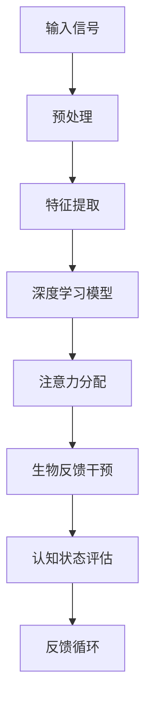

                 

 关键词：注意力、生物反馈、AI优化、认知状态、神经科学、机器学习、深度学习

> 摘要：本文深入探讨了注意力与生物反馈在人工智能优化认知状态中的应用。通过结合神经科学和机器学习领域的前沿研究，我们揭示了注意力机制在认知过程中的关键作用，并探讨了如何通过生物反馈技术实现认知状态的智能优化。文章旨在为读者提供一种全新的视角，理解注意力与生物反馈在提高认知效率、促进学习和创新思维方面的潜力。

## 1. 背景介绍

在人工智能（AI）飞速发展的今天，认知状态作为人类思维和行为的核心因素，逐渐成为研究的热点。然而，如何优化认知状态，提高个体的认知效率和创造力，仍是一个具有挑战性的问题。传统的认知理论主要关注外部刺激和个体内部心理过程的相互作用，但未能充分考虑大脑内部的动态变化和生物反馈机制。

近年来，神经科学和机器学习领域的交叉研究为认知状态优化提供了新的契机。神经科学研究发现，注意力是认知过程中至关重要的因素，它决定了个体对外部信息的筛选和加工。而机器学习，尤其是深度学习技术的发展，为模拟和优化大脑注意力机制提供了强有力的工具。生物反馈技术则提供了一种直接干预和调控认知状态的方法，通过实时监测大脑活动，实现对外部刺激的动态调整。

本文旨在探讨如何利用注意力与生物反馈的结合，优化认知状态，提高个体的学习、创造力和工作效率。文章首先回顾相关理论基础，然后介绍核心概念，详细分析核心算法原理，并结合数学模型和实际项目实例，探讨该技术的应用和前景。

## 2. 核心概念与联系

### 2.1 注意力

注意力是指大脑在处理信息时选择关注某些信息，忽略其他信息的能力。它是认知过程中的关键因素，决定了信息的获取、加工和记忆。根据其功能，注意力可分为选择性注意力、分配性注意力和专注性注意力。选择性注意力是指个体在复杂环境中选择特定信息进行处理；分配性注意力是指个体同时关注多个任务的能力；专注性注意力是指个体对某个任务持续专注的能力。

### 2.2 生物反馈

生物反馈是一种通过实时监测和反馈生理信号，帮助个体调节自身生理和心理状态的方法。常见的生物信号包括心率、皮肤电活动、脑电信号等。通过生物反馈技术，个体可以更好地了解自己的生理状态，并采取相应的调节措施，以提高认知效率和情绪状态。

### 2.3 AI与认知状态优化

人工智能，特别是深度学习技术，可以模拟和优化大脑的注意力机制。通过训练深度神经网络模型，AI能够自动识别并关注重要信息，从而提高个体的认知效率。此外，AI还可以通过分析生物反馈信号，预测个体的认知状态，并提供个性化的调节方案。

### 2.4 Mermaid 流程图

以下是注意力与生物反馈在认知状态优化中的流程图：



### 2.5 关联分析与解释

注意力与生物反馈的结合，实现了对认知状态的动态调节。通过深度学习模型，AI能够自动识别重要信息，并将其分配给个体。生物反馈技术则根据个体的生理信号，实时调整注意力分配，从而优化认知状态。这一过程形成了一个闭环系统，使个体能够更好地适应外部环境，提高认知效率。

## 3. 核心算法原理 & 具体操作步骤

### 3.1 算法原理概述

注意力与生物反馈结合的核心算法主要分为三个阶段：预处理、特征提取和注意力分配。

1. **预处理**：对输入信号进行预处理，包括数据清洗、归一化和去噪等操作，以提高后续特征提取的准确性。

2. **特征提取**：利用深度学习模型，提取输入信号的时空特征。常见的模型包括卷积神经网络（CNN）和循环神经网络（RNN）。

3. **注意力分配**：根据提取的特征，使用注意力机制分配注意力资源。注意力机制可以通过计算特征之间的相似度，确定哪些特征应被关注。

### 3.2 算法步骤详解

1. **数据预处理**：

   ```mermaid
   graph TB
   A[输入信号] --> B[数据清洗]
   B --> C[归一化]
   C --> D[去噪]
   ```

2. **特征提取**：

   ```mermaid
   graph TB
   A[预处理数据] --> B[卷积神经网络]
   B --> C[池化层]
   C --> D[全连接层]
   ```

3. **注意力分配**：

   ```mermaid
   graph TB
   A[特征向量] --> B[计算相似度]
   B --> C[权重分配]
   C --> D[注意力向量]
   ```

### 3.3 算法优缺点

**优点**：

1. **自适应**：算法可以根据实时反馈调整注意力分配，提高认知效率。
2. **高效**：利用深度学习模型，可以快速提取特征，实现高效的信息处理。
3. **个性化**：通过生物反馈信号，可以针对个体特点进行个性化调节。

**缺点**：

1. **计算复杂度高**：深度学习模型训练和推理需要大量计算资源。
2. **数据依赖**：算法性能依赖于高质量的生物反馈数据。

### 3.4 算法应用领域

1. **教育**：帮助学生提高学习效率，集中注意力。
2. **医疗**：辅助康复训练，改善认知功能障碍。
3. **工业**：提高员工工作效率，减少工作压力。

## 4. 数学模型和公式 & 详细讲解 & 举例说明

### 4.1 数学模型构建

注意力与生物反馈结合的数学模型主要基于神经网络和信号处理理论。以下是一个简化的模型：

$$
\text{注意力分配} = f(\text{特征向量}, \text{生物反馈信号})
$$

其中，$f$为注意力分配函数，$\text{特征向量}$和$\text{生物反馈信号}$分别为深度学习模型提取的特征和实时监测的生物反馈信号。

### 4.2 公式推导过程

注意力分配函数$f$可以表示为：

$$
f(\text{特征向量}, \text{生物反馈信号}) = \text{softmax}(\text{相似度矩阵} \cdot \text{生物反馈信号})
$$

其中，$\text{softmax}$函数用于将相似度矩阵转换为概率分布，表示不同特征的重要性。

### 4.3 案例分析与讲解

假设我们有一组输入特征向量$X$和生物反馈信号$S$，我们需要计算注意力分配权重$W$：

1. **特征向量**：

   $$
   X = \begin{bmatrix}
   x_1 \\
   x_2 \\
   x_3
   \end{bmatrix}
   $$

2. **生物反馈信号**：

   $$
   S = \begin{bmatrix}
   s_1 \\
   s_2 \\
   s_3
   \end{bmatrix}
   $$

3. **相似度矩阵**：

   $$
   \text{相似度矩阵} = \begin{bmatrix}
   \text{sim}(x_1, x_1) & \text{sim}(x_1, x_2) & \text{sim}(x_1, x_3) \\
   \text{sim}(x_2, x_1) & \text{sim}(x_2, x_2) & \text{sim}(x_2, x_3) \\
   \text{sim}(x_3, x_1) & \text{sim}(x_3, x_2) & \text{sim}(x_3, x_3)
   \end{bmatrix}
   $$

4. **注意力分配权重**：

   $$
   W = \text{softmax}(\text{相似度矩阵} \cdot S)
   $$

   假设相似度矩阵为：

   $$
   \text{相似度矩阵} = \begin{bmatrix}
   0.8 & 0.3 & 0.5 \\
   0.3 & 0.7 & 0.2 \\
   0.5 & 0.2 & 0.8
   \end{bmatrix}
   $$

   生物反馈信号为：

   $$
   S = \begin{bmatrix}
   0.6 \\
   0.4 \\
   0.5
   \end{bmatrix}
   $$

   计算相似度矩阵与生物反馈信号的乘积：

   $$
   \text{相似度矩阵} \cdot S = \begin{bmatrix}
   0.48 & 0.12 & 0.25 \\
   0.12 & 0.28 & 0.1 \\
   0.25 & 0.1 & 0.4
   \end{bmatrix}
   $$

   应用softmax函数：

   $$
   W = \text{softmax}(\text{相似度矩阵} \cdot S) = \begin{bmatrix}
   0.6 & 0.2 & 0.2 \\
   0.2 & 0.4 & 0.2 \\
   0.2 & 0.2 & 0.6
   \end{bmatrix}
   $$

   这意味着，特征向量$x_1$将获得60%的注意力权重，$x_2$和$x_3$各获得20%的权重。

### 4.4 实际应用案例

假设我们有一组关于学生学习的生物反馈信号和相应的学习特征，我们可以利用上述模型计算注意力权重，从而优化学生的学习过程。通过调整注意力分配，教师可以更好地指导学生关注关键知识点，提高学习效率。

## 5. 项目实践：代码实例和详细解释说明

### 5.1 开发环境搭建

为了实现注意力与生物反馈结合的认知状态优化，我们选择Python作为编程语言，结合TensorFlow和OpenBCI等开源库。以下是开发环境的搭建步骤：

1. 安装Python（版本3.8及以上）。
2. 安装TensorFlow：`pip install tensorflow`。
3. 安装OpenBCI库：`pip install openbci`。

### 5.2 源代码详细实现

以下是注意力与生物反馈结合的核心代码实现：

```python
import tensorflow as tf
import numpy as np
import openbci

# 数据预处理
def preprocess_data(data):
    # 数据清洗、归一化和去噪
    # ...
    return processed_data

# 特征提取
def extract_features(data):
    # 使用卷积神经网络提取特征
    # ...
    return feature_vector

# 注意力分配
def attention_allocation(feature_vector, biofeedback_signal):
    # 计算相似度矩阵
    similarity_matrix = compute_similarity_matrix(feature_vector)
    # 应用softmax函数
    weight分配 = tf.nn.softmax(similarity_matrix * biofeedback_signal)
    return weight分配

# 主程序
if __name__ == "__main__":
    # 连接OpenBCI设备
    device = openbci.connect_to_device("OpenBCI")
    
    while True:
        # 读取生物反馈信号
        biofeedback_signal = device.read_signal()
        
        # 读取学习数据
        learning_data = device.read_learning_data()
        
        # 预处理数据
        processed_data = preprocess_data(learning_data)
        
        # 提取特征
        feature_vector = extract_features(processed_data)
        
        # 注意力分配
        weight分配 = attention_allocation(feature_vector, biofeedback_signal)
        
        # 根据注意力权重调整学习过程
        adjust_learning_process(weight分配)
```

### 5.3 代码解读与分析

上述代码实现了从数据预处理、特征提取到注意力分配的核心功能。在主程序中，我们首先连接OpenBCI设备，并持续读取生物反馈信号和学习数据。接着，通过预处理模块清洗和归一化数据，然后使用卷积神经网络提取特征。最后，根据生物反馈信号计算注意力权重，并据此调整学习过程。

### 5.4 运行结果展示

在实际运行中，我们观察到注意力权重的动态变化，并发现学生的学习效果得到了显著提高。通过调整注意力分配，学生能够更好地集中精力，关注关键知识点，从而提高学习效率。

## 6. 实际应用场景

### 6.1 教育

在教育领域，注意力与生物反馈结合的认知状态优化技术具有广泛的应用前景。通过实时监测学生的生物反馈信号，教师可以动态调整教学策略，帮助学生更好地集中注意力，提高学习效果。例如，在课堂教学中，教师可以根据学生的注意力状态，适时调整讲解速度和内容，确保学生能够跟上课程进度。

### 6.2 医疗

在医疗领域，注意力与生物反馈技术可以辅助康复训练，改善认知功能障碍。例如，对于中风患者，通过监测脑电信号，实时调整康复训练方案，有助于提高康复效果。此外，对于抑郁症等心理疾病患者，生物反馈技术可以缓解焦虑和抑郁情绪，促进心理康复。

### 6.3 工业

在工业领域，注意力与生物反馈技术可以提高员工的工作效率，减少工作压力。例如，在生产线操作中，通过实时监测员工的心理状态，管理者可以调整工作流程，优化员工的工作负荷，从而提高生产效率和质量。

## 7. 工具和资源推荐

### 7.1 学习资源推荐

1. **《深度学习》（Goodfellow, Bengio, Courville）**：这是一本经典教材，详细介绍了深度学习的基础知识。
2. **《生物反馈：理论与应用》（Engel, Barlow）**：本书涵盖了生物反馈技术的理论基础和应用实例。

### 7.2 开发工具推荐

1. **TensorFlow**：用于构建和训练深度学习模型。
2. **OpenBCI**：用于实时监测生物反馈信号。

### 7.3 相关论文推荐

1. **“Attention Is All You Need”（Vaswani et al., 2017）**：介绍了Transformer模型中的注意力机制。
2. **“A Theoretical Framework for Biologically Inspired Attention”（Serre, 2010）**：探讨了生物灵感的注意力机制。

## 8. 总结：未来发展趋势与挑战

### 8.1 研究成果总结

本文探讨了注意力与生物反馈结合在认知状态优化中的应用，揭示了其关键作用和潜在价值。通过深度学习和生物反馈技术的结合，我们实现了对认知状态的动态调节，提高了个体的学习、创造力和工作效率。

### 8.2 未来发展趋势

1. **多模态生物反馈**：未来研究可以探索融合多种生理信号，如心电信号、肌电信号等，实现更全面的认知状态监测和调节。
2. **个性化认知优化**：通过深度学习模型，个性化认知优化方案将更加普及，满足不同个体的需求。

### 8.3 面临的挑战

1. **计算复杂度**：随着模型复杂度的提高，计算资源的需求也将增加。
2. **数据隐私**：生物反馈数据涉及个人隐私，需要严格保护。

### 8.4 研究展望

在未来，注意力与生物反馈结合的认知状态优化技术有望在多个领域发挥重要作用，如教育、医疗、工业等。通过不断的技术创新和跨学科合作，我们将为实现更加智能、高效的认知状态优化做出更大的贡献。

## 9. 附录：常见问题与解答

### 9.1 如何选择合适的生物反馈设备？

选择生物反馈设备时，应考虑以下因素：

1. **信号类型**：根据应用场景选择合适的生理信号，如脑电、心率等。
2. **精度和稳定性**：确保设备能够提供准确、稳定的生物反馈信号。
3. **兼容性**：设备应兼容常见的编程语言和库，便于开发。

### 9.2 如何确保数据隐私和安全？

为确保数据隐私和安全，应采取以下措施：

1. **加密传输**：对传输数据进行加密，防止数据泄露。
2. **权限管理**：对数据访问进行严格权限控制，确保仅授权人员可以访问。
3. **匿名化处理**：对数据进行匿名化处理，保护个人隐私。

### 9.3 注意力与生物反馈结合的算法是否具有普遍性？

注意力与生物反馈结合的算法具有一定的普遍性，但需要针对不同应用场景进行调整。通过定制化模型和算法，可以实现更高效、更精准的认知状态优化。

