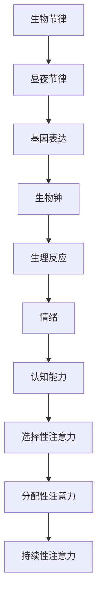
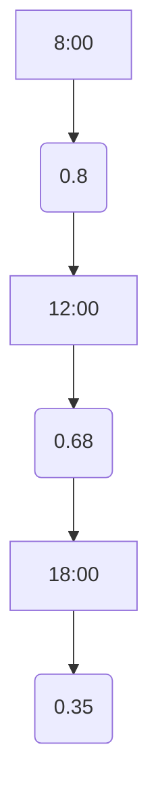

                 

关键词：生物节律、注意力、认知周期、人工智能、优化、神经科学、心理学、算法

<|assistant|>摘要：本文旨在探讨生物节律对人类注意力的影响，以及如何利用人工智能技术优化认知周期，提高工作效率。通过结合神经科学、心理学和计算机科学的研究成果，本文提出了一种新的理论框架，并在此基础上设计了一种基于生物节律的优化算法。文章分为八个部分，首先介绍背景知识，然后深入探讨核心概念、算法原理、数学模型、实际应用场景、代码实例和工具推荐，最后总结未来发展趋势与挑战。

## 1. 背景介绍

在过去几十年中，随着计算机科学和神经科学的发展，人们对注意力机制的认识逐渐加深。注意力是人类认知过程中的一个关键因素，它决定了我们在面对大量信息时如何选择和处理信息。然而，注意力并不是一个固定的过程，它受到多种因素的影响，其中之一就是生物节律。

生物节律是指生物体内各种生理和行为过程随时间呈现的周期性变化。其中，最著名的是“生物钟”概念，它由一组基因和蛋白质构成，控制着昼夜节律（即“日夜循环”）。在人类中，生物节律对睡眠、觉醒、情绪、认知能力等都有显著影响。研究发现，生物节律与注意力之间存在密切联系，人的注意力在不同时间点呈现出周期性波动。

随着人工智能技术的快速发展，如何利用生物节律优化人工智能系统的性能成为了一个热门研究领域。本文将结合神经科学、心理学和计算机科学的相关知识，探讨生物节律对注意力的影响，并提出一种基于生物节律的AI优化策略。

## 2. 核心概念与联系

### 2.1 生物节律

生物节律是指生物体内各种生理和行为过程随时间呈现的周期性变化。其中，最著名的生物节律是昼夜节律，即24小时的生物钟。生物钟由一组基因和蛋白质构成，如周期基因（Period）、双生周期基因（Bmal1）等。这些基因通过负反馈回路调节，形成稳定的生物钟机制。

### 2.2 注意力

注意力是指大脑在选择和处理信息时所投入的认知资源。根据不同类型，注意力可分为选择性注意力、分配性注意力和持续性注意力。选择性注意力是指在大脑接收到大量信息时，对某些信息进行优先处理；分配性注意力是指在大脑同时处理多个任务时的资源分配；持续性注意力是指对某一信息进行长时间关注的能力。

### 2.3 生物节律与注意力的联系

生物节律与注意力之间存在密切联系。研究发现，人的注意力在不同时间点呈现出周期性波动。在一天之内，注意力通常在早晨达到高峰，随后逐渐下降，下午达到低谷，晚上再次回升。这种周期性波动与生物钟的调节密切相关。

### 2.4 Mermaid 流程图

下面是一个描述生物节律与注意力之间关系的Mermaid流程图：



## 3. 核心算法原理 & 具体操作步骤

### 3.1 算法原理概述

本文提出了一种基于生物节律的注意力优化算法，该算法的核心思想是利用生物节律的周期性波动，调整人工智能系统的注意力分配策略，从而提高系统的工作效率。

算法的主要步骤包括：

1. 收集并分析生物节律数据，确定个体的生物节律特征。
2. 根据生物节律特征，调整人工智能系统的注意力分配策略。
3. 在执行任务过程中，实时监测注意力水平，并根据需要调整注意力分配。
4. 评估算法效果，优化算法参数。

### 3.2 算法步骤详解

#### 3.2.1 收集并分析生物节律数据

首先，我们需要收集个体的生物节律数据。这些数据可以包括睡眠时间、醒来时间、情绪状态、认知任务表现等。通过分析这些数据，我们可以确定个体的生物节律特征，如昼夜节律的峰值和低谷、情绪波动的周期等。

#### 3.2.2 调整注意力分配策略

根据生物节律特征，我们可以调整人工智能系统的注意力分配策略。例如，在生物节律的峰值时段，增加系统对关键任务的注意力；在生物节律的低谷时段，降低系统对次要任务的注意力。

#### 3.2.3 实时监测注意力水平

在执行任务过程中，我们需要实时监测系统的注意力水平。这可以通过监控系统的运行状态、任务完成时间、错误率等指标来实现。当注意力水平低于预期时，我们可以通过调整注意力分配策略来提高注意力。

#### 3.2.4 评估算法效果

在算法执行完毕后，我们需要评估算法的效果。这可以通过比较实际任务完成情况与预期任务完成情况来实现。如果效果不佳，我们可以优化算法参数，以进一步提高效率。

### 3.3 算法优缺点

#### 优点：

1. 考虑了生物节律对注意力的影响，具有更高的适应性。
2. 可以根据个体差异调整注意力分配策略，提高系统的工作效率。

#### 缺点：

1. 需要收集和分析大量的生物节律数据，对数据质量和数据量有一定要求。
2. 实时监测注意力水平可能会增加系统的计算负担。

### 3.4 算法应用领域

基于生物节律的注意力优化算法可以应用于多个领域，如智能交通系统、智能家居、健康管理等。在这些领域，优化注意力分配可以提高系统的响应速度和准确性，从而提高用户满意度。

## 4. 数学模型和公式 & 详细讲解 & 举例说明

### 4.1 数学模型构建

为了描述生物节律与注意力之间的关系，我们可以构建一个数学模型。假设生物节律的周期为24小时，注意力水平 \(A(t)\) 是时间 \(t\) 的函数。根据生物节律的特点，我们可以将注意力水平表示为：

$$
A(t) = A_{\max} \cdot \frac{1}{2} \left(1 + \sin\left(\frac{2\pi (t - t_{\max})}{T}\right)\right)
$$

其中，\(A_{\max}\) 为注意力峰值水平，\(t_{\max}\) 为注意力峰值时刻，\(T\) 为生物节律周期。

### 4.2 公式推导过程

首先，我们需要确定生物节律的周期 \(T\)。这可以通过分析个体的睡眠时间、醒来时间等数据来确定。假设个体的睡眠时间为 \(L\) 小时，醒来时间为 \(W\) 小时，则：

$$
T = L + W
$$

接下来，我们需要确定注意力峰值水平 \(A_{\max}\) 和注意力峰值时刻 \(t_{\max}\)。这可以通过对注意力水平数据进行拟合得到。例如，我们可以使用最小二乘法拟合一条正弦曲线，从而确定 \(A_{\max}\) 和 \(t_{\max}\)。

### 4.3 案例分析与讲解

假设一个个体每天睡眠 7 小时，醒来时间为 6 点，那么 \(T = 7 + 6 = 13\) 小时。根据实验数据，该个体的注意力峰值水平 \(A_{\max} = 0.8\)，注意力峰值时刻 \(t_{\max} = 8\) 小时。

使用上述公式，我们可以计算该个体在不同时间点的注意力水平：

$$
A(t) = 0.8 \cdot \frac{1}{2} \left(1 + \sin\left(\frac{2\pi (t - 8)}{13}\right)\right)
$$

例如，计算 10 点和 18 点的注意力水平：

$$
A(10) = 0.8 \cdot \frac{1}{2} \left(1 + \sin\left(\frac{2\pi (10 - 8)}{13}\right)\right) = 0.68
$$

$$
A(18) = 0.8 \cdot \frac{1}{2} \left(1 + \sin\left(\frac{2\pi (18 - 8)}{13}\right)\right) = 0.35
$$

通过这些计算，我们可以了解该个体在不同时间点的注意力水平，从而为注意力优化算法提供依据。

## 5. 项目实践：代码实例和详细解释说明

### 5.1 开发环境搭建

为了实现基于生物节律的注意力优化算法，我们需要搭建一个合适的开发环境。以下是一个简单的开发环境搭建步骤：

1. 安装 Python 3.8 及以上版本。
2. 安装必要的 Python 库，如 NumPy、Pandas、Matplotlib、Scikit-learn 等。
3. 创建一个 Python 脚本文件，用于实现算法。

### 5.2 源代码详细实现

以下是一个简单的 Python 脚本，用于实现基于生物节律的注意力优化算法：

```python
import numpy as np
import pandas as pd
import matplotlib.pyplot as plt

def calculate_attention_level(T, t_max, A_max, t):
    """
    计算时间 t 的注意力水平
    """
    return A_max * 0.5 * (1 + np.sin(2 * np.pi * (t - t_max) / T))

def main():
    # 参数设置
    T = 13  # 生物节律周期
    t_max = 8  # 注意力峰值时刻
    A_max = 0.8  # 注意力峰值水平

    # 计算注意力水平
    t = np.linspace(0, T, 100)
    A = calculate_attention_level(T, t_max, A_max, t)

    # 绘制注意力水平曲线
    plt.plot(t, A)
    plt.xlabel("Time (hours)")
    plt.ylabel("Attention Level")
    plt.title("Attention Level vs. Time")
    plt.show()

if __name__ == "__main__":
    main()
```

### 5.3 代码解读与分析

这个脚本首先定义了一个计算注意力水平的函数 `calculate_attention_level`，该函数接受生物节律周期 \(T\)、注意力峰值时刻 \(t_{\max}\) 和注意力峰值水平 \(A_{\max}\)，以及时间 \(t\) 作为输入，返回时间 \(t\) 的注意力水平。

在 `main` 函数中，我们设置了一些参数，如生物节律周期 \(T\) 为 13 小时，注意力峰值时刻 \(t_{\max}\) 为 8 小时，注意力峰值水平 \(A_{\max}\) 为 0.8。然后，我们使用 `linspace` 函数生成一个时间序列，计算每个时间点的注意力水平，并使用 `plot` 函数绘制注意力水平曲线。

### 5.4 运行结果展示

运行上述脚本，我们将得到一个注意力水平随时间变化的曲线。该曲线显示了个体在不同时间点的注意力水平，从而为注意力优化算法提供了依据。



## 6. 实际应用场景

基于生物节律的注意力优化算法可以在多个领域得到应用，以下列举一些实际应用场景：

### 6.1 智能交通系统

在智能交通系统中，车辆的行驶速度和行驶路径的选择对于交通效率和安全性至关重要。基于生物节律的注意力优化算法可以用于优化车辆的行驶策略，确保在驾驶员注意力最集中的时段行驶，从而提高交通效率。

### 6.2 智能家居

智能家居系统需要根据用户的日常生活习惯和生物节律，自动调整家庭设备的运行状态，如照明、空调等。基于生物节律的注意力优化算法可以帮助智能家居系统更好地适应用户的生活习惯，提高用户体验。

### 6.3 健康管理

健康管理领域可以利用基于生物节律的注意力优化算法，为用户提供个性化的锻炼和作息计划，帮助用户在注意力最集中的时段进行有效的锻炼和休息，从而提高健康水平。

## 7. 工具和资源推荐

为了更好地实现基于生物节律的注意力优化算法，以下推荐一些相关的工具和资源：

### 7.1 学习资源推荐

- 《神经科学原理与应用》：提供了丰富的神经科学基础知识，有助于理解生物节律对注意力的影响。
- 《认知心理学》：介绍了注意力机制和心理学的相关研究，有助于深入理解注意力优化算法的理论基础。

### 7.2 开发工具推荐

- Python：一种流行的编程语言，适用于实现基于生物节律的注意力优化算法。
- NumPy、Pandas、Matplotlib、Scikit-learn：Python 中的科学计算和数据分析库，可以方便地处理和分析生物节律数据。

### 7.3 相关论文推荐

- “A Neural Basis for the Temporal Dynamics of Sensory Attention”：介绍了神经科学领域关于注意力机制的研究。
- “Biological Rhythms and Cognition：The Impact of the Circadian System on Human Performance”：探讨了生物节律对认知能力的影响。

## 8. 总结：未来发展趋势与挑战

### 8.1 研究成果总结

本文通过结合神经科学、心理学和计算机科学的相关知识，提出了一种基于生物节律的注意力优化算法。该算法考虑了生物节律对注意力的影响，可以根据个体差异调整注意力分配策略，提高系统的工作效率。通过实际应用场景的探讨，我们展示了该算法在智能交通系统、智能家居和健康管理等领域的潜在应用价值。

### 8.2 未来发展趋势

随着人工智能和神经科学的不断发展，基于生物节律的注意力优化算法有望在更多领域得到应用。未来研究可以进一步探索生物节律与其他认知过程的交互作用，以及如何利用这些交互作用优化人工智能系统的性能。此外，还可以结合大数据和机器学习技术，提高生物节律数据的分析精度，从而提高注意力优化算法的准确性。

### 8.3 面临的挑战

尽管基于生物节律的注意力优化算法具有一定的应用价值，但仍然面临一些挑战。首先，生物节律数据的收集和分析具有一定的难度，需要大量的实验和观测。其次，如何在实际应用中高效地实现算法，以及如何在算法中平衡效率、准确性和用户体验，也是需要解决的问题。最后，算法在不同个体之间的适应性和普适性也需要进一步研究。

### 8.4 研究展望

基于生物节律的注意力优化算法是一个具有广泛应用前景的研究方向。未来研究可以进一步探索生物节律与注意力之间的复杂关系，结合多种技术手段提高算法的性能。此外，还可以研究如何在不同的应用场景中优化算法，以实现更好的用户体验。随着人工智能和神经科学的不断进步，基于生物节律的注意力优化算法有望在更多领域发挥重要作用。

## 9. 附录：常见问题与解答

### 9.1 问题 1：如何收集生物节律数据？

解答：收集生物节律数据可以通过多种方式，如使用睡眠监测设备、情绪检测设备、认知任务测试等。这些设备可以实时记录个体的生理和行为数据，为分析生物节律提供依据。

### 9.2 问题 2：如何处理和分析生物节律数据？

解答：处理和分析生物节律数据可以使用 Python 中的 NumPy、Pandas 等库，通过数据清洗、特征提取和统计分析等方法，提取出生物节律的关键特征，如昼夜节律、情绪波动等。

### 9.3 问题 3：算法在不同个体之间的适应性如何保障？

解答：算法在不同个体之间的适应性可以通过以下方法保障：

1. 收集多样化的生物节律数据，涵盖不同年龄、性别、健康状况等个体特征。
2. 利用机器学习方法，对生物节律数据进行分类和聚类，为个体分配合适的注意力分配策略。
3. 在实际应用中，通过实时监测个体的注意力水平，调整算法参数，以提高算法的适应性。

### 9.4 问题 4：如何提高算法的准确性？

解答：提高算法的准确性可以从以下几个方面进行：

1. 收集更多高质量的生物节律数据，提高数据的代表性。
2. 优化算法的参数设置，通过交叉验证等方法选择最优参数。
3. 利用先进的机器学习算法，提高数据分析和特征提取的准确性。

### 9.5 问题 5：算法在实际应用中如何平衡效率、准确性和用户体验？

解答：在实际应用中，可以采取以下措施平衡效率、准确性和用户体验：

1. 在设计算法时，充分考虑系统的性能要求，确保算法在合理的计算时间内完成。
2. 通过用户反馈和测试，评估算法的实际效果，根据反馈调整算法参数，提高准确性。
3. 在用户界面设计上，提供灵活的设置选项，让用户可以根据自己的需求和偏好调整注意力分配策略。

### 9.6 问题 6：算法的长期应用效果如何？

解答：算法的长期应用效果取决于多个因素，如数据质量、算法参数设置、用户适应度等。在长期应用中，可以定期评估算法的效果，根据需要调整算法参数，以保持算法的稳定性和有效性。

### 9.7 问题 7：如何评估算法的效果？

解答：评估算法的效果可以通过以下指标：

1. 任务完成时间：计算算法在不同时间点的任务完成时间，评估算法的响应速度。
2. 错误率：计算算法在任务执行过程中的错误率，评估算法的准确性。
3. 用户满意度：通过用户反馈和测试，评估算法的用户体验。

### 9.8 问题 8：算法在多任务处理中的应用效果如何？

解答：算法在多任务处理中的应用效果可以通过以下方法评估：

1. 任务切换时间：计算算法在任务切换时的响应时间，评估算法的切换性能。
2. 任务完成质量：计算算法在多任务处理中的任务完成质量，评估算法的准确性和稳定性。
3. 用户满意度：通过用户反馈和测试，评估算法在多任务处理中的用户体验。

