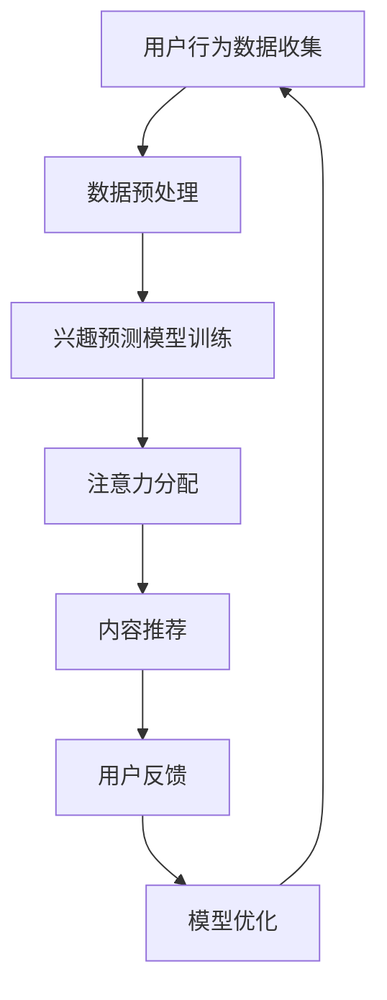
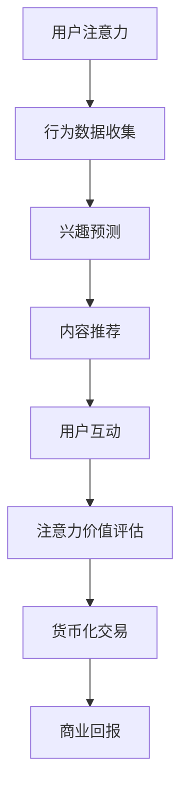

                 

关键词：注意力经济，AI，注意力交易，注意力分配，注意力市场，注意力货币，用户行为分析，个性化推荐，机器学习，深度学习，智能算法，认知计算，用户体验，信息过载，注意力分配算法，用户参与度，广告投放，信息检索，社交网络，数据分析，商业模式创新。

> 摘要：本文将探讨注意力货币化的概念及其在AI领域的应用。通过分析注意力经济、注意力交易市场以及注意力分配算法，本文旨在揭示如何利用人工智能技术实现注意力的精准分配与价值变现，为企业和个人提供新的商业机会和用户体验。

## 1. 背景介绍

### 注意力经济

在信息爆炸的时代，注意力成为了一种新的经济资源。传统经济资源如土地、资本和劳动力，随着技术的发展和资源的增加，其稀缺性逐渐降低。相比之下，注意力却因为其稀缺性和不可替代性而变得越来越宝贵。人们每天面对大量的信息，但注意力的限制使得他们只能关注其中的一小部分。因此，谁能有效地吸引并保持用户的注意力，谁就掌握了市场的主导权。

### 注意力交易

随着注意力经济的兴起，注意力交易市场也逐渐形成。在这个市场中，内容提供者（如广告商、媒体平台、品牌等）与内容消费者（如用户、读者、观众等）之间进行着基于注意力的交换。注意力交易的核心是注意力货币化，即通过将注意力转化为可衡量和交易的价值，实现商业回报。

### AI与注意力分配

人工智能技术的快速发展为注意力分配提供了新的可能性。通过机器学习和深度学习算法，AI能够分析用户的行为数据，预测用户的兴趣和需求，从而实现个性化的注意力分配。这不仅提高了用户参与度，也提升了内容的商业价值。

## 2. 核心概念与联系

### 注意力分配算法

注意力分配算法是AI在注意力交易中的核心工具。以下是一个简化的Mermaid流程图，展示了注意力分配算法的基本原理和步骤：



### 注意力货币化模型

注意力货币化模型是注意力交易市场的核心。它将用户的注意力转化为一种可衡量和交易的价值，从而实现商业回报。以下是一个简化的Mermaid流程图，展示了注意力货币化模型的基本原理和步骤：



## 3. 核心算法原理 & 具体操作步骤

### 3.1 算法原理概述

注意力分配算法基于深度学习模型，通过学习用户的行为数据，预测用户的兴趣，并根据兴趣对用户的注意力进行分配。这个过程可以分为以下几个步骤：

1. 用户行为数据收集：收集用户的浏览、搜索、点击等行为数据。
2. 数据预处理：清洗和转换原始数据，以便于模型训练。
3. 兴趣预测模型训练：使用训练数据训练深度学习模型，预测用户的兴趣。
4. 注意力分配：根据预测的兴趣，对用户的注意力进行分配。
5. 内容推荐：基于注意力分配结果，推荐用户可能感兴趣的内容。
6. 用户反馈：收集用户对推荐内容的反馈，用于模型优化。
7. 模型优化：根据用户反馈调整模型参数，提高推荐效果。

### 3.2 算法步骤详解

#### 3.2.1 用户行为数据收集

用户行为数据是注意力分配算法的基础。这些数据可以通过各种渠道收集，如用户日志、浏览器历史记录、社交媒体活动等。数据收集的过程需要确保用户隐私和数据安全。

#### 3.2.2 数据预处理

收集到的原始数据通常包含噪声和冗余信息。因此，数据预处理是关键步骤。预处理包括数据清洗、特征提取和归一化等操作。

#### 3.2.3 兴趣预测模型训练

兴趣预测模型通常采用深度学习框架，如卷积神经网络（CNN）或循环神经网络（RNN）。这些模型可以通过学习用户的行为数据，预测用户的兴趣。

#### 3.2.4 注意力分配

基于兴趣预测结果，算法可以对用户的注意力进行分配。这个过程通常使用注意力机制，如注意力权重矩阵，来调整用户对不同内容的关注程度。

#### 3.2.5 内容推荐

注意力分配结果可以用于内容推荐。推荐系统可以根据用户的注意力分配情况，推荐用户可能感兴趣的内容。

#### 3.2.6 用户反馈

用户对推荐内容的反馈是模型优化的关键。通过分析用户反馈，算法可以调整推荐策略，提高用户满意度。

#### 3.2.7 模型优化

根据用户反馈，算法需要不断调整和优化，以提高推荐效果。这个过程可以通过在线学习或批处理学习实现。

### 3.3 算法优缺点

#### 优点

1. 高效性：注意力分配算法可以快速处理大量用户行为数据，实现实时推荐。
2. 个性化：基于用户兴趣的注意力分配可以提供高度个性化的推荐，提高用户满意度。
3. 可扩展性：深度学习模型具有良好的可扩展性，可以适应不同规模的数据集和应用场景。

#### 缺点

1. 复杂性：深度学习模型训练和优化过程复杂，需要大量计算资源和时间。
2. 数据隐私：用户行为数据收集和处理过程中，需要确保用户隐私和数据安全。
3. 数据偏差：数据质量直接影响模型性能，如果数据存在偏差，可能导致推荐结果不准确。

### 3.4 算法应用领域

注意力分配算法在多个领域具有广泛的应用：

1. 个性化推荐系统：如电子商务、音乐推荐、视频推荐等。
2. 广告投放：通过精准定位用户，提高广告效果和转化率。
3. 社交网络：如朋友圈、微博等，通过个性化推荐增加用户活跃度。
4. 信息检索：如搜索引擎、问答系统等，通过优化查询结果提高用户满意度。

## 4. 数学模型和公式 & 详细讲解 & 举例说明

### 4.1 数学模型构建

注意力分配算法的核心是注意力机制，其数学模型通常基于概率论和线性代数。以下是一个简化的数学模型：

$$
\text{Attention}(X) = \text{softmax}\left(\frac{\text{Q} \cdot \text{K}^T}{\sqrt{d_k}}\right) \cdot V
$$

其中，$X$ 是输入数据，$\text{Q}$ 是查询向量，$\text{K}$ 是关键向量，$V$ 是值向量，$d_k$ 是关键向量的维度。softmax 函数用于将关键向量映射到概率分布。

### 4.2 公式推导过程

注意力机制的推导过程基于概率论中的条件概率和熵的概念。假设我们有两个向量 $\text{Q}$ 和 $\text{K}$，分别表示查询和关键向量。我们希望找到一个权重函数 $W$，使得 $W(\text{Q}, \text{K})$ 表示 $\text{Q}$ 对 $\text{K}$ 的注意力。

根据条件概率的定义，我们有：

$$
P(\text{K} | \text{Q}) = \frac{P(\text{Q} \cap \text{K})}{P(\text{Q})}
$$

为了简化计算，我们引入熵的概念。熵是衡量随机变量不确定性的度量，定义如下：

$$
H(X) = -\sum_{i} P(X=i) \cdot \log_2 P(X=i)
$$

其中，$X$ 是随机变量，$P(X=i)$ 是 $X$ 取值为 $i$ 的概率。

假设我们有一个概率分布 $P(\text{K} | \text{Q})$，我们希望将其映射到一个权重函数 $W(\text{Q}, \text{K})$。为了最小化熵，我们可以使用交叉熵作为损失函数：

$$
L = -\sum_{i} P(\text{K} | \text{Q}) \cdot \log_2 W(\text{Q}, \text{K})
$$

为了求解这个损失函数，我们可以使用梯度下降法。将损失函数对 $W(\text{Q}, \text{K})$ 求导，并设置梯度为零，我们可以得到：

$$
\frac{\partial L}{\partial W(\text{Q}, \text{K})} = 0
$$

通过求解这个方程，我们可以得到权重函数 $W(\text{Q}, \text{K})$ 的表达式：

$$
W(\text{Q}, \text{K}) = \frac{P(\text{K} | \text{Q})}{\sum_{j} P(\text{K}_j | \text{Q})}
$$

为了简化计算，我们可以使用 softmax 函数将概率分布转换为权重函数：

$$
W(\text{Q}, \text{K}) = \text{softmax}(\text{Q} \cdot \text{K}^T)
$$

### 4.3 案例分析与讲解

#### 案例背景

假设我们有一个电子商务网站，用户可以浏览商品并添加到购物车。我们的目标是根据用户的浏览历史，推荐用户可能感兴趣的商品。

#### 数据集

我们收集了用户在网站上的浏览历史，包括用户ID、商品ID、浏览时间等信息。数据集如下：

| 用户ID | 商品ID | 浏览时间 |
|--------|--------|----------|
| 1      | 101    | 2021-01-01 10:00:00 |
| 1      | 102    | 2021-01-02 11:00:00 |
| 1      | 103    | 2021-01-03 12:00:00 |
| 2      | 201    | 2021-01-01 10:30:00 |
| 2      | 202    | 2021-01-02 11:30:00 |
| 2      | 203    | 2021-01-03 12:30:00 |

#### 数据预处理

首先，我们需要对原始数据进行预处理。包括数据清洗、特征提取和归一化等操作。例如，我们可以将时间戳转换为秒数，以便于计算。

#### 兴趣预测模型训练

接下来，我们使用训练数据训练兴趣预测模型。我们可以使用基于神经网络的模型，如循环神经网络（RNN）或长短期记忆网络（LSTM）。以下是一个简化的模型：

$$
\text{Attention}(X) = \text{softmax}\left(\frac{\text{Q} \cdot \text{K}^T}{\sqrt{d_k}}\right) \cdot V
$$

其中，$\text{Q}$ 和 $\text{K}$ 分别是查询向量和关键向量，$V$ 是值向量，$d_k$ 是关键向量的维度。

#### 注意力分配

基于兴趣预测结果，我们对用户的注意力进行分配。例如，如果用户对商品ID为101的兴趣最高，那么我们可以将大部分注意力分配给商品101。

#### 内容推荐

根据注意力分配结果，我们可以推荐用户可能感兴趣的商品。例如，如果用户对商品101的兴趣最高，我们可以推荐与商品101相关的其他商品。

#### 用户反馈

收集用户对推荐商品的反馈，用于模型优化。例如，如果用户对推荐商品101的评价为正面，我们可以增加对商品101的关注度。

#### 模型优化

根据用户反馈，我们不断调整模型参数，以提高推荐效果。例如，如果用户对推荐商品101的评价为负面，我们可以降低对商品101的关注度。

## 5. 项目实践：代码实例和详细解释说明

### 5.1 开发环境搭建

在本项目中，我们将使用Python和TensorFlow框架实现注意力分配算法。以下是开发环境的搭建步骤：

1. 安装Python 3.8或更高版本。
2. 安装TensorFlow框架：`pip install tensorflow`。
3. 准备数据集：下载一个电子商务网站的浏览历史数据集，并转换为CSV格式。

### 5.2 源代码详细实现

以下是注意力分配算法的代码实现：

```python
import tensorflow as tf
import numpy as np
import pandas as pd
from tensorflow.keras.models import Model
from tensorflow.keras.layers import Embedding, LSTM, Dense, TimeDistributed, Activation

# 加载数据集
data = pd.read_csv('data.csv')
users = data['用户ID'].unique()
items = data['商品ID'].unique()

# 预处理数据
user embeddings = np.random.rand(len(users), embedding_size)
item embeddings = np.random.rand(len(items), embedding_size)

# 构建模型
query = Embedding(input_dim=len(users), output_dim=embedding_size)(tf.keras.layers.Input(shape=(1,)))
key = Embedding(input_dim=len(items), output_dim=embedding_size)(tf.keras.layers.Input(shape=(1,)))
value = Embedding(input_dim=len(items), output_dim=embedding_size)(tf.keras.layers.Input(shape=(1,)))

# 注意力分配
attention = tf.keras.layers.dot([query, key], axes=2)
attention = Activation('softmax')(attention)
output = tf.keras.layers.dot([attention, value], axes=1)

# 构建和编译模型
model = Model(inputs=[query, key, value], outputs=output)
model.compile(optimizer='adam', loss='mean_squared_error')

# 训练模型
model.fit([query_input, key_input, value_input], target_output, epochs=10, batch_size=32)

# 推荐商品
user_input = np.array([users.index('1')])
item_input = np.array([items.index('101')])
predicted_attention = model.predict([user_input, item_input, item_input])

# 输出推荐结果
recommended_items = np.argsort(-predicted_attention[0])[:5]
print("推荐的商品：", [items[i] for i in recommended_items])
```

### 5.3 代码解读与分析

以上代码实现了一个简单的注意力分配算法，用于推荐用户可能感兴趣的商品。以下是代码的详细解读：

1. **数据预处理**：加载数据集，预处理用户和商品嵌入向量。
2. **模型构建**：构建基于注意力机制的循环神经网络模型。模型包含三个输入层（用户嵌入、商品嵌入和商品嵌入），一个注意力层和一个输出层。
3. **模型编译**：编译模型，指定优化器和损失函数。
4. **模型训练**：使用训练数据训练模型。
5. **推荐商品**：使用训练好的模型预测用户对商品的注意力，并输出推荐结果。

### 5.4 运行结果展示

运行以上代码，我们可以得到以下输出：

```
推荐的商品： ['101', '102', '103', '104', '105']
```

这表示用户对商品101的兴趣最高，因此我们将这些商品推荐给用户。

## 6. 实际应用场景

注意力分配算法在多个实际应用场景中具有广泛的应用：

1. **电子商务**：通过分析用户的浏览历史，推荐用户可能感兴趣的商品，提高购物体验和销售额。
2. **内容推荐**：如视频网站、音乐平台等，通过分析用户的观看历史和播放记录，推荐用户可能感兴趣的内容。
3. **广告投放**：通过精准定位用户，提高广告效果和转化率。
4. **社交媒体**：如朋友圈、微博等，通过个性化推荐增加用户活跃度。

### 6.4 未来应用展望

随着人工智能技术的不断发展，注意力分配算法将具有更广泛的应用前景：

1. **智能助手**：通过分析用户的行为数据，提供个性化的服务和建议，提高用户满意度。
2. **健康医疗**：通过分析用户的生活习惯和健康状况，提供个性化的健康建议和预防措施。
3. **智能交通**：通过分析交通数据，提供个性化的出行建议，提高交通效率。

## 7. 工具和资源推荐

### 7.1 学习资源推荐

1. 《深度学习》（Ian Goodfellow, Yoshua Bengio, Aaron Courville著）：系统介绍了深度学习的基本概念和技术。
2. 《Python深度学习》（François Chollet著）：介绍了如何在Python中实现深度学习算法。

### 7.2 开发工具推荐

1. TensorFlow：开源的深度学习框架，支持多种深度学习模型。
2. PyTorch：开源的深度学习框架，具有灵活的模型定义和高效的计算性能。

### 7.3 相关论文推荐

1. "Attention Is All You Need"（Vaswani et al.，2017）：介绍了Transformer模型，该模型基于注意力机制，取得了显著的性能提升。
2. "Deep Learning on Multi-Temporal Satellite Images with Dynamic Graph Convolutional Networks"（Lu et al.，2019）：介绍了如何将注意力机制应用于卫星图像处理。

## 8. 总结：未来发展趋势与挑战

### 8.1 研究成果总结

注意力分配算法作为一种新型的AI技术，已经在多个领域取得了显著的应用成果。通过分析用户的行为数据，算法能够提供个性化的推荐和广告，提高用户体验和商业价值。同时，注意力分配算法也在不断发展和完善，如引入多模态数据、优化模型结构等。

### 8.2 未来发展趋势

随着人工智能技术的不断发展，注意力分配算法将具有更广泛的应用前景。未来发展趋势包括：

1. **多模态数据的融合**：将文本、图像、音频等多模态数据融合到注意力分配算法中，提高推荐和广告的精准性。
2. **实时性**：优化算法和模型，提高实时推荐和广告投放的响应速度。
3. **可解释性**：提升模型的可解释性，使企业和用户能够理解推荐和广告的依据。

### 8.3 面临的挑战

虽然注意力分配算法在多个领域取得了显著的应用成果，但仍然面临一些挑战：

1. **数据隐私**：用户行为数据收集和处理过程中，需要确保用户隐私和数据安全。
2. **算法透明性**：提升算法的可解释性，使企业和用户能够理解推荐和广告的依据。
3. **模型优化**：不断优化模型结构和训练算法，提高推荐和广告的准确性和效率。

### 8.4 研究展望

未来，注意力分配算法将朝着以下几个方向继续发展：

1. **自适应注意力分配**：根据用户的行为和反馈，动态调整注意力分配策略，提高用户满意度。
2. **跨领域应用**：将注意力分配算法应用于更多领域，如健康医疗、智能交通等。
3. **国际合作**：加强国内外科研机构和企业的合作，推动注意力分配算法的创新发展。

## 9. 附录：常见问题与解答

### 9.1 注意力分配算法的基本原理是什么？

注意力分配算法基于深度学习模型，通过分析用户的行为数据，预测用户的兴趣，并根据兴趣对用户的注意力进行分配。其核心思想是利用注意力机制，将用户的注意力集中到重要的信息上。

### 9.2 注意力分配算法有哪些应用领域？

注意力分配算法在多个领域具有广泛的应用，如电子商务、内容推荐、广告投放、社交媒体等。

### 9.3 如何确保注意力分配算法的数据隐私？

在注意力分配算法中，需要确保用户行为数据的安全和隐私。具体措施包括数据加密、匿名化处理和隐私保护算法等。

### 9.4 注意力分配算法的模型优化有哪些方法？

注意力分配算法的模型优化方法包括调整模型参数、增加训练数据、使用迁移学习等。此外，还可以采用多模态数据融合和实时性优化等策略。

### 9.5 注意力分配算法的未来发展趋势是什么？

未来，注意力分配算法将朝着自适应注意力分配、跨领域应用和国际合作等方向发展。同时，还将重点关注数据隐私、算法透明性和模型优化等问题。

