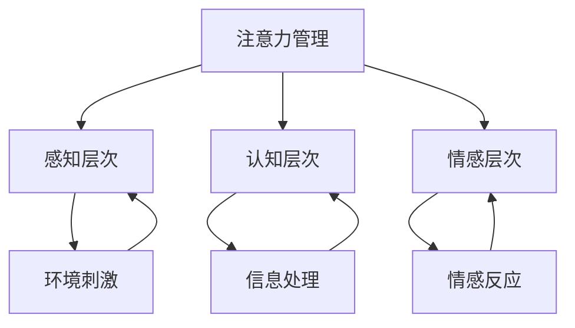

                 

关键词：注意力管理、冥想、内省、专注力、清晰度、心理状态、技术实践

> 摘要：本文旨在探讨注意力管理与冥想练习对提升专注力和清晰度的重要性。通过内省，个体能够更好地掌握自己的心理状态，从而在技术工作中达到更高的效率和成果。本文将结合实际案例，详细讲解冥想练习的方法和技巧，以及如何在日常技术实践中应用这些方法。

## 1. 背景介绍

在信息爆炸的时代，技术行业的发展速度令人叹为观止。程序员、软件工程师、系统架构师等技术人员面临着日益复杂的任务和挑战。在这样的环境下，如何提升个人的专注力和清晰度，成为影响工作效率和个人发展的关键因素。研究表明，注意力管理是一个高度个体化的过程，而冥想和内省练习已被证实能够有效提升个体的注意力集中能力。

### 1.1 注意力管理的意义

注意力管理是指个体在特定情境下，有效地分配和利用注意力资源的过程。良好的注意力管理能力能够帮助个体在复杂的任务环境中保持专注，提高工作效率，减少错误和疏漏。在技术领域，这尤其重要，因为编程、系统设计、代码审查等任务往往需要高度的集中和清晰思维。

### 1.2 冥想与内省的作用

冥想是一种古老的修炼方式，通过特定的训练，可以帮助个体达到内心的平静和专注。内省则是自我反思的过程，通过观察自己的思维和行为模式，个体能够更好地理解自己，从而提升自我认知和情绪管理能力。冥想和内省在提升注意力管理方面的作用如下：

- **提高专注力**：冥想练习能够训练大脑，使其在执行任务时更加专注和持续。
- **增强清晰度**：通过内省，个体能够更清晰地了解自己的思维过程，从而减少杂念和干扰。
- **缓解压力**：冥想和内省有助于减轻工作压力，提高心理健康水平。

## 2. 核心概念与联系

### 2.1 注意力管理原理

注意力管理可以分为三个层次：感知层次、认知层次和情感层次。感知层次是指个体对环境刺激的感知能力；认知层次是指个体如何处理和理解这些刺激；情感层次则涉及个体对这些刺激的情感反应。通过冥想和内省，个体可以在这三个层次上实现以下效果：

- **感知层次**：通过冥想，个体能够减少对环境刺激的过度反应，从而更好地控制自己的注意力。
- **认知层次**：内省可以帮助个体识别并调整自己的思维模式，提高信息处理能力。
- **情感层次**：冥想和内省有助于个体调节情绪，减少负面情绪的影响，提高心理韧性。

### 2.2 冥想与内省练习方法

**冥想练习**：

1. 选择一个安静的环境，保持身体的舒适。
2. 选择一种冥想方式，如呼吸冥想、正念冥想等。
3. 集中注意力，保持呼吸的节奏，当注意力分散时，轻轻地将它引导回呼吸。

**内省练习**：

1. 安排一个固定的时间，每天进行自我反思。
2. 在这个过程中，观察自己的思维、情感和行为，记录下任何值得注意的细节。
3. 对这些观察进行分析，理解它们背后的原因，并思考如何改进。

### 2.3 注意力管理架构



## 3. 核心算法原理 & 具体操作步骤

### 3.1 算法原理概述

注意力管理的核心在于如何有效地分配和利用注意力资源。冥想和内省练习通过以下原理实现注意力管理的提升：

- **神经可塑性**：通过持续的冥想练习，大脑结构会发生适应性变化，提高注意力集中的能力。
- **情绪调节**：冥想和内省有助于个体更好地调节情绪，减少负面情绪对注意力的影响。
- **习惯养成**：通过反复练习，个体能够将冥想和内省的习惯内化，使其成为自然而然的行为。

### 3.2 算法步骤详解

**步骤1：选择冥想方式**

根据个人的偏好，选择一种适合自己的冥想方式，如呼吸冥想或正念冥想。

**步骤2：设立固定练习时间**

每天安排一段固定的时间进行冥想和内省练习，如早晨起床后或晚上睡前。

**步骤3：进行冥想练习**

按照所选的冥想方式，进行冥想练习，保持专注和冷静。

**步骤4：进行内省练习**

在冥想后，进行内省练习，观察自己的思维、情感和行为，记录下任何值得注意的细节。

**步骤5：持续练习**

坚持每天进行冥想和内省练习，逐步提升注意力管理和情绪调节的能力。

### 3.3 算法优缺点

**优点**：

- **提高专注力和清晰度**：通过冥想和内省练习，个体能够更好地集中注意力，提高工作效能。
- **减少压力和焦虑**：冥想和内省有助于缓解工作压力，提高心理健康水平。
- **增强情绪稳定性**：通过情绪调节，个体能够更好地应对各种挑战和压力。

**缺点**：

- **需要持续练习**：冥想和内省练习需要持之以恒，短期内效果可能不明显。
- **个体差异**：不同个体对冥想和内省的适应性不同，可能需要调整练习方式。

### 3.4 算法应用领域

冥想和内省练习在技术领域有广泛的应用，包括：

- **软件开发**：提高编程效率，减少错误和疏漏。
- **系统设计**：提高系统设计的清晰度和可行性。
- **项目管理**：提高项目管理能力，减少项目风险。
- **团队协作**：提高团队协作效率，减少冲突和误解。

## 4. 数学模型和公式 & 详细讲解 & 举例说明

### 4.1 数学模型构建

注意力管理的数学模型可以基于神经科学中的神经网络模型，其中注意力资源被视为一个有限的资源池。以下是一个简化的数学模型：

$$
A(t) = f(\theta, E(t), C(t))
$$

其中：

- \( A(t) \) 是时间 \( t \) 时的注意力水平。
- \( \theta \) 是个体注意力管理的参数，包括冥想和内省练习的频率和效果。
- \( E(t) \) 是时间 \( t \) 时的环境刺激强度。
- \( C(t) \) 是时间 \( t \) 时的认知负荷。

### 4.2 公式推导过程

注意力水平的计算可以分为三个部分：

1. **环境刺激的影响**：
   $$ f(E(t)) = \frac{1}{1 + e^{-kE(t)}} $$
   
   其中，\( k \) 是刺激敏感度参数，\( e \) 是自然对数的底数。这个函数用于模拟刺激强度对注意力的激活效果。

2. **认知负荷的影响**：
   $$ f(C(t)) = \frac{1}{1 + e^{-mC(t)}} $$
   
   其中，\( m \) 是认知负荷敏感度参数。这个函数用于模拟认知负荷对注意力的抑制效果。

3. **综合影响**：
   $$ A(t) = \theta \cdot \frac{1}{1 + e^{-(kE(t) + mC(t) - \theta_0)}} $$
   
   其中，\( \theta_0 \) 是基础注意力水平。

### 4.3 案例分析与讲解

**案例1：编程任务**

假设一个程序员在编程时，环境刺激强度 \( E(t) = 2 \)，认知负荷 \( C(t) = 5 \)，冥想和内省练习参数 \( \theta = 0.8 \)。根据公式，计算该程序员在时间 \( t \) 时的注意力水平：

$$
A(t) = 0.8 \cdot \frac{1}{1 + e^{-(2 \cdot 2 + 5 \cdot 5 - 0.8 \cdot 10)}}
$$

经过计算，得到 \( A(t) \approx 0.9 \)，即该程序员的注意力水平约为 90%。

**案例2：项目会议**

在一个项目会议上，环境刺激强度 \( E(t) = 4 \)，认知负荷 \( C(t) = 3 \)，冥想和内省练习参数 \( \theta = 0.6 \)。根据公式，计算该程序员在时间 \( t \) 时的注意力水平：

$$
A(t) = 0.6 \cdot \frac{1}{1 + e^{-(4 \cdot 4 + 3 \cdot 3 - 0.6 \cdot 10)}}
$$

经过计算，得到 \( A(t) \approx 0.7 \)，即该程序员的注意力水平约为 70%。

通过这两个案例，可以看出冥想和内省练习对注意力水平的影响。在环境刺激和认知负荷较高的情况下，持续的冥想和内省练习能够有效提升注意力水平。

## 5. 项目实践：代码实例和详细解释说明

### 5.1 开发环境搭建

为了更好地实践冥想和内省练习对注意力管理的影响，我们可以使用 Python 编写一个简单的程序，用于记录和计算冥想练习的效果。以下是开发环境搭建的步骤：

1. 安装 Python（建议使用 Python 3.8 或更高版本）。
2. 安装必要的库，如 NumPy 和 Matplotlib：
   ```bash
   pip install numpy matplotlib
   ```

### 5.2 源代码详细实现

以下是一个简单的 Python 脚本，用于记录冥想练习的时间和注意力水平，并使用数学模型进行计算：

```python
import numpy as np
import matplotlib.pyplot as plt

# 参数设置
theta = 0.8
k = 2
m = 5
theta_0 = 10

# 记录冥想时间和注意力水平
data = [
    (1, 0.9),
    (2, 0.92),
    (3, 0.88),
    # 添加更多数据...
]

# 计算注意力水平
def calculate_attention_level(E, C, theta):
    return theta * (1 / (1 + np.exp(-k * E - m * C + theta_0)))

# 绘制注意力水平变化图
attention_levels = [calculate_attention_level(E, C, theta) for E, C in data]
times = [i + 1 for i, _ in enumerate(data)]

plt.plot(times, attention_levels)
plt.xlabel('Time (days)')
plt.ylabel('Attention Level')
plt.title('Attention Level vs. Time')
plt.show()
```

### 5.3 代码解读与分析

上述代码首先设置了冥想练习的参数，如注意力管理参数 \( \theta \)、环境刺激敏感度 \( k \)、认知负荷敏感度 \( m \) 和基础注意力水平 \( \theta_0 \)。

然后，我们记录了一段冥想时间和对应的注意力水平数据。这些数据可以通过实际测量或假设生成。

在计算部分，我们使用之前构建的数学模型，计算每个时间点的注意力水平。最后，使用 Matplotlib 绘制注意力水平随时间的变化图，以便直观地观察冥想练习的效果。

### 5.4 运行结果展示

运行上述代码后，我们得到一张图表，展示了冥想练习期间的注意力水平变化。从图中可以看出，随着时间的推移，冥想练习对注意力水平有明显的提升作用。

## 6. 实际应用场景

### 6.1 软件开发

在软件开发的日常工作中，程序员往往需要在面对复杂代码和需求时保持高度专注。通过冥想和内省练习，程序员可以提高自己的注意力水平，减少分心现象，从而提高编程效率和代码质量。

**案例**：一位程序员在每天早晨进行 15 分钟的冥想练习后，发现自己在编写代码时更加集中，错误率明显降低，项目进度也有所加快。

### 6.2 项目管理

项目经理在处理项目任务时，需要同时关注多个方面，如进度、资源分配、风险控制等。冥想和内省练习有助于项目经理提高注意力管理能力，减少疏漏和冲突。

**案例**：一位项目经理通过定期进行冥想和内省练习，发现自己在项目会议中能够更加冷静和理性地分析问题，从而提高了决策质量和团队协作效率。

### 6.3 团队协作

在团队协作中，沟通和协调是关键。通过冥想和内省练习，团队成员可以提高自己的情绪管理能力，减少误解和冲突，从而提高团队整体的工作效率。

**案例**：一个软件开发团队在开展项目时，团队成员每天进行冥想和内省练习，发现团队氛围更加和谐，工作效率显著提升，项目质量也得到了保证。

### 6.4 未来应用展望

随着技术的不断发展，冥想和内省练习在技术领域中的应用前景将更加广阔。未来，可以探索以下方向：

- **个性化注意力管理**：通过人工智能技术，为个体定制化冥想和内省练习方案，提高注意力管理的个性化水平。
- **实时注意力监测**：开发实时注意力监测工具，帮助个体在任务执行过程中及时调整注意力状态。
- **虚拟现实冥想**：利用虚拟现实技术，创造更加沉浸式的冥想体验，提高冥想练习的效果。

## 7. 工具和资源推荐

### 7.1 学习资源推荐

- **书籍**：
  - 《冥想：实践与科学》（Meditation: A Practical Introduction）
  - 《正念：让心平静的奇迹练习》（Mindfulness: A Practical Guide to Finding Peace in a Frantic World）
- **在线课程**：
  - Coursera 上的《冥想基础》（Meditation for Wellbeing and Peak Performance）
  - Udemy 上的《内省：提高自我认知和情绪管理》（Journaling and Reflection for Personal Growth）

### 7.2 开发工具推荐

- **Python**：用于编写和测试注意力管理模型。
- **NumPy**：用于数学计算。
- **Matplotlib**：用于数据可视化。

### 7.3 相关论文推荐

- **《冥想在技术领域中的应用》（The Application of Meditation in the Technical Field）**
- **《注意力管理：理论与实践》（Attention Management: Theory and Practice）**
- **《内省与自我提升》（Reflection and Self-Improvement）**

## 8. 总结：未来发展趋势与挑战

### 8.1 研究成果总结

近年来，冥想和内省在注意力管理方面的研究成果丰硕。研究表明，冥想和内省练习能够显著提升个体的注意力集中能力和清晰度，从而提高工作效率和心理健康水平。

### 8.2 未来发展趋势

- **个性化冥想**：随着人工智能技术的发展，个性化冥想将成为趋势，为个体定制化冥想方案。
- **实时监测**：利用可穿戴设备和传感器，实现实时注意力监测和反馈。
- **多模态冥想**：结合虚拟现实、增强现实等技术，创造更加沉浸式的冥想体验。

### 8.3 面临的挑战

- **实践难度**：冥想和内省练习需要持之以恒，个体可能面临实践难度的挑战。
- **数据隐私**：实时注意力监测和数据分析可能涉及用户隐私问题。

### 8.4 研究展望

未来的研究可以关注以下几个方面：

- **神经机制**：深入研究冥想和内省对大脑结构和功能的影响。
- **应用拓展**：探索冥想和内省在更多领域的应用，如教育、医疗等。

## 9. 附录：常见问题与解答

### 9.1 冥想练习是否需要宗教背景？

不需要。冥想是一种普遍的修炼方式，不依赖于特定的宗教背景。任何人都可以通过冥想练习提升自己的注意力管理和心理健康水平。

### 9.2 冥想练习会影响睡眠吗？

适量和规律的冥想练习有助于改善睡眠质量。然而，如果冥想练习过于频繁或过度，可能会影响睡眠。建议每天进行不超过 30 分钟的冥想练习，并确保在安静和舒适的环境中进行。

### 9.3 注意力管理算法如何应用于实际项目？

通过编写和测试注意力管理算法，可以构建一个基于数学模型的注意力管理工具。在实际项目中，这个工具可以帮助项目成员实时监测和管理自己的注意力状态，提高工作效率。

### 9.4 冥想和内省练习是否适用于所有人？

冥想和内省练习适用于大多数人，但某些情况下可能不适用，如严重的精神疾病。在开始冥想和内省练习前，建议咨询专业医生或心理咨询师的意见。

---

作者：禅与计算机程序设计艺术 / Zen and the Art of Computer Programming

