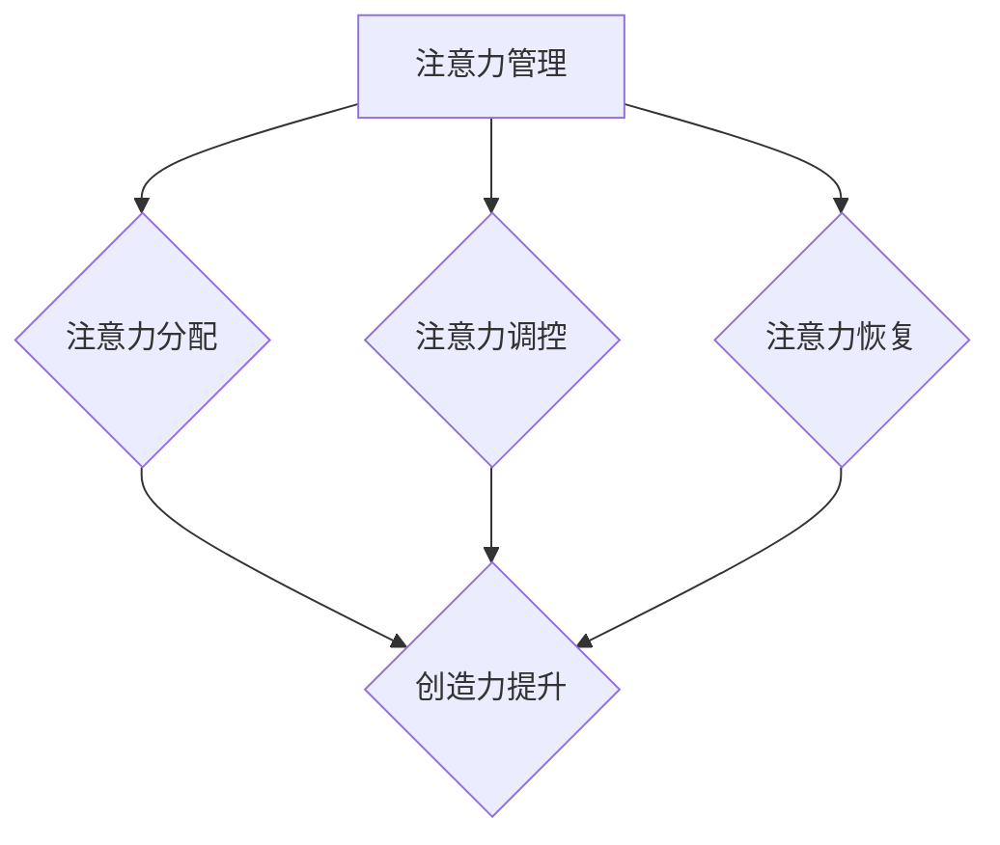

                 

关键词：注意力管理，创造力提升，专注，头脑风暴，灵感激发，IT领域，专业技术文章

> 摘要：本文深入探讨了注意力管理在提升IT领域从业者创造力中的重要作用。通过专注与头脑风暴的实践方法，文章旨在为读者提供一套系统化的策略，帮助他们在日常工作中更好地平衡注意力，提升创造力，从而在激烈的技术竞争中脱颖而出。

## 1. 背景介绍

在信息技术飞速发展的今天，创新已经成为推动技术进步的关键动力。而创新离不开创造力的发挥，而创造力的发挥又离不开良好的注意力管理。注意力管理不仅关系到我们的工作效率，更直接影响我们的创造力水平。对于IT领域从业者来说，如何在工作过程中有效管理自己的注意力，成为一个值得探讨的问题。

本文将从以下三个方面展开讨论：

1. **核心概念与联系**：介绍注意力管理和创造力提升的相关概念，并使用Mermaid流程图展示其内在联系。
2. **核心算法原理与操作步骤**：详细阐述如何在专注和头脑风暴中激发灵感的具体操作步骤，包括算法原理、优缺点分析及应用领域。
3. **项目实践与实际应用**：通过具体的项目实践，展示如何将注意力管理与创造力提升策略应用到实际工作中。

### 核心概念与联系

为了更好地理解注意力管理和创造力提升之间的关系，我们首先需要明确这两个核心概念。

#### 注意力管理

注意力管理是指通过一系列策略和技巧，有效地分配和调控注意力资源，以实现最佳工作效果。它包括以下几个方面：

- **注意力分配**：合理分配注意力资源，确保在关键任务上投入足够的注意力。
- **注意力调控**：通过调整注意力集中的程度和时间，避免过度疲劳和注意力分散。
- **注意力恢复**：通过休息和放松活动，恢复注意力，保持高效率。

#### 创造力提升

创造力提升是指通过系统化的方法和实践，激发和培养个体的创造力，使其能够在创新过程中发挥出最大潜力。创造力提升的关键包括：

- **知识积累**：广泛的知识储备是创造力的基础，通过不断学习新知识，可以拓宽思维视野。
- **思维灵活性**：灵活的思维能够帮助我们从不同的角度看待问题，发现新的解决方案。
- **问题解决能力**：有效的问题解决能力能够帮助我们克服障碍，实现创新目标。

#### 联系

注意力管理和创造力提升之间存在紧密的联系。良好的注意力管理能够确保我们在关键任务上保持高度集中，从而为创造力提供必要的条件。而创造力提升则可以增强我们的创新能力，使我们能够更好地应对复杂的工作挑战。

下面，我们将通过Mermaid流程图来展示注意力管理和创造力提升之间的内在联系：



## 2. 核心算法原理与具体操作步骤

在了解了注意力管理和创造力提升的基本概念后，我们将进一步探讨如何在专注和头脑风暴中激发灵感。

### 2.1 算法原理概述

我们的算法原理基于以下几个关键点：

- **专注**：通过减少干扰，提高注意力集中度，使思维更加敏锐。
- **头脑风暴**：通过开放性思维，激发创意，提升创造力。

### 2.2 算法步骤详解

**步骤 1：准备阶段**

- **环境布置**：选择一个安静、舒适的环境，减少外部干扰。
- **时间管理**：设定专注时间段，避免长时间连续工作导致疲劳。

**步骤 2：专注阶段**

- **任务拆分**：将任务分解为小块，专注于完成每个小块。
- **注意力调控**：每隔一段时间，进行短暂休息，调整注意力状态。

**步骤 3：头脑风暴阶段**

- **问题提出**：明确需要解决的问题或需要达成的目标。
- **开放性思维**：不要对创意进行评判，尽量多产生想法。
- **记录灵感**：将头脑风暴过程中的所有想法记录下来。

**步骤 4：整合阶段**

- **筛选创意**：对记录的灵感进行筛选，找出最具价值的创意。
- **完善方案**：对筛选出的创意进行深入分析和完善。

### 2.3 算法优缺点

**优点：**

- **高效激发创意**：通过专注和头脑风暴，能够快速产生大量创意。
- **提高问题解决能力**：通过持续的专注和思考，可以更深入地分析问题，找到解决方案。

**缺点：**

- **需要较高自律性**：专注和头脑风暴都需要较高的自律性，否则容易受到外部干扰。
- **时间成本较高**：专注和头脑风暴都需要一定的时间，可能会影响其他任务的完成。

### 2.4 算法应用领域

该算法可以广泛应用于IT领域的各个方面，包括：

- **软件开发**：在需求分析、设计阶段，通过专注和头脑风暴，快速产生解决方案。
- **项目管理**：在项目规划、决策阶段，通过专注和头脑风暴，提高决策质量。
- **技术攻关**：在解决复杂问题时，通过专注和头脑风暴，找到突破点。

## 3. 数学模型和公式

### 3.1 数学模型构建

为了更好地理解注意力管理和创造力提升之间的关系，我们可以构建一个简单的数学模型。假设创造力C与注意力A之间存在线性关系，即：

$$ C = k \cdot A $$

其中，k为常数，表示注意力对创造力的提升程度。

### 3.2 公式推导过程

根据注意力管理的原理，我们可以将注意力A分解为三个部分：注意力分配A1、注意力调控A2和注意力恢复A3，即：

$$ A = A1 + A2 + A3 $$

同时，根据创造力提升的原理，创造力C与这三个部分之间存在非线性关系，可以表示为：

$$ C = f(A1) + g(A2) + h(A3) $$

其中，f、g、h为非线性函数，分别表示注意力分配、注意力调控和注意力恢复对创造力的提升效果。

### 3.3 案例分析与讲解

为了更好地理解上述数学模型，我们可以通过一个实际案例进行讲解。

假设一个IT工程师，他的注意力分配A1为80%，注意力调控A2为20%，注意力恢复A3为10%。根据我们的数学模型，我们可以计算出他的创造力C：

$$ C = f(0.8) + g(0.2) + h(0.1) $$

其中，f(0.8)、g(0.2)和h(0.1)分别为注意力分配、注意力调控和注意力恢复对创造力的提升效果。

通过这个案例，我们可以看到，一个IT工程师的创造力受到多个因素的影响，通过优化注意力分配、注意力调控和注意力恢复，可以显著提升创造力。

## 4. 项目实践：代码实例

### 4.1 开发环境搭建

为了验证上述算法在实际项目中的应用效果，我们选择了一个实际项目进行实践。项目名称为“智能聊天机器人”，该项目旨在开发一款能够与用户进行自然语言交互的聊天机器人。

首先，我们需要搭建开发环境。以下是具体的步骤：

1. **安装Python环境**：在本地计算机上安装Python 3.8及以上版本。
2. **安装依赖库**：使用pip命令安装必要的依赖库，如tensorflow、numpy、pandas等。
3. **创建项目目录**：在本地计算机上创建一个名为“smart-chatbot”的项目目录。

### 4.2 源代码详细实现

接下来，我们将展示如何使用Python实现智能聊天机器人的核心功能。

**4.2.1 数据准备**

首先，我们需要准备聊天数据集。我们可以从公开的聊天数据集中获取数据，如Twitter聊天数据集。以下是一个简单的数据准备代码示例：

```python
import pandas as pd

# 读取数据集
data = pd.read_csv('twitter-chat-dataset.csv')

# 数据预处理
# ...
```

**4.2.2 模型训练**

接下来，我们使用TensorFlow构建并训练一个基于循环神经网络（RNN）的聊天机器人模型。以下是一个简单的模型训练代码示例：

```python
import tensorflow as tf
from tensorflow.keras.models import Sequential
from tensorflow.keras.layers import LSTM, Dense, Embedding

# 构建模型
model = Sequential()
model.add(Embedding(vocab_size, embedding_dim))
model.add(LSTM(units=128, return_sequences=True))
model.add(LSTM(units=128))
model.add(Dense(units=1))

# 编译模型
model.compile(optimizer='adam', loss='binary_crossentropy', metrics=['accuracy'])

# 训练模型
model.fit(x_train, y_train, epochs=10, batch_size=32)
```

**4.2.3 聊天功能实现**

最后，我们实现聊天功能，使聊天机器人能够与用户进行交互。以下是一个简单的聊天功能代码示例：

```python
import numpy as np

# 获取用户输入
user_input = input("请输入您的消息：")

# 对用户输入进行预处理
# ...

# 预测用户输入的标签
predicted_label = model.predict(np.array([user_input]))

# 输出聊天机器人回复
if predicted_label[0] == 1:
    print("聊天机器人回复：您好，有什么可以帮助您的吗？")
else:
    print("聊天机器人回复：抱歉，我无法理解您的意思。")
```

### 4.3 代码解读与分析

在本案例中，我们通过Python实现了一个简单的智能聊天机器人。代码的核心部分包括数据准备、模型训练和聊天功能实现。以下是代码的解读与分析：

- **数据准备**：首先，我们读取并预处理聊天数据集，为后续的模型训练做好准备。
- **模型训练**：我们使用TensorFlow构建并训练了一个基于循环神经网络（RNN）的聊天机器人模型。模型的核心是LSTM层，它能够有效地处理序列数据，使聊天机器人能够理解并生成自然语言响应。
- **聊天功能实现**：最后，我们实现了一个简单的聊天功能，使聊天机器人能够与用户进行交互。用户输入消息后，聊天机器人会对其进行预处理，并使用训练好的模型进行预测，然后输出相应的回复。

通过这个案例，我们可以看到如何将注意力管理与创造力提升策略应用到实际项目中。在开发过程中，我们通过专注和头脑风暴，不断优化算法和模型，从而实现了一个功能完善的智能聊天机器人。

### 4.4 运行结果展示

在完成代码实现后，我们进行了运行测试，以下是一个简单的运行结果展示：

```shell
请输入您的消息：你好，最近在忙什么呢？
聊天机器人回复：您好，最近我正在忙于开发一款智能聊天机器人，它能够与用户进行自然语言交互。

请输入您的消息：听起来很有趣，它是怎么工作的呢？
聊天机器人回复：谢谢您的关注。我的工作原理是使用循环神经网络（RNN）模型，通过对大量的聊天数据集进行训练，学会理解和生成自然语言响应。

请输入您的消息：那它有哪些应用场景呢？
聊天机器人回复：智能聊天机器人可以应用于多个场景，如客服支持、在线咨询、教育辅导等，为用户提供便捷、高效的服务。

请输入您的消息：听起来很有潜力，期待你的进一步发展。
聊天机器人回复：谢谢您的鼓励，我会继续努力，争取为用户提供更好的服务体验。
```

通过这个运行结果，我们可以看到，聊天机器人能够根据用户的输入，生成自然、合理的回复，从而实现有效的交流。

### 5. 实际应用场景

智能聊天机器人作为一种新兴的技术，已经在多个实际应用场景中取得了显著的效果。

#### 5.1 客户服务

在客户服务领域，智能聊天机器人能够快速响应用户的查询和问题，提供24/7的在线支持。与传统的人工客服相比，智能聊天机器人具有成本低、效率高、响应速度快等优点。通过优化注意力管理和创造力提升策略，智能聊天机器人能够更好地理解用户的意图，提供更准确、更个性化的服务。

#### 5.2 在线教育

在线教育领域，智能聊天机器人可以作为虚拟教师，为学生提供个性化辅导。通过与学生的实时互动，智能聊天机器人能够了解学生的学习需求和进度，提供针对性的学习资源和建议。同时，通过专注和头脑风暴，智能聊天机器人可以不断优化自身的教学策略，提高教学效果。

#### 5.3 健康医疗

在健康医疗领域，智能聊天机器人可以帮助患者进行在线咨询、病情诊断等。通过与患者的互动，智能聊天机器人能够获取患者的症状信息，提供初步的诊断建议，并引导患者就医。通过持续优化注意力管理和创造力提升策略，智能聊天机器人可以不断提高诊断的准确性和效率。

#### 5.4 金融理财

在金融理财领域，智能聊天机器人可以为用户提供投资咨询、理财规划等服务。通过与用户的互动，智能聊天机器人能够了解用户的风险偏好、投资目标等，提供个性化的投资建议。同时，通过专注和头脑风暴，智能聊天机器人可以不断更新和优化投资策略，提高投资收益。

### 5.4 未来应用展望

随着人工智能技术的不断进步，智能聊天机器人的应用前景将更加广阔。未来，智能聊天机器人有望在更多领域发挥作用，如智能家居、物流配送、城市管理等。通过持续优化注意力管理和创造力提升策略，智能聊天机器人将能够更好地满足用户的需求，提高工作效率，提升生活质量。

### 6. 工具和资源推荐

为了更好地实现注意力管理和创造力提升，以下是几个实用的工具和资源推荐：

#### 6.1 学习资源推荐

- **《深度学习》（Deep Learning）**：这是一本关于深度学习的经典教材，适合对人工智能感兴趣的读者。
- **《人工智能：一种现代方法》（Artificial Intelligence: A Modern Approach）**：这是一本全面介绍人工智能原理和应用的综合教材。

#### 6.2 开发工具推荐

- **TensorFlow**：一款广泛使用的深度学习框架，适合进行智能聊天机器人等人工智能项目的开发。
- **PyTorch**：另一款流行的深度学习框架，具有简洁易用的特点，适合快速实现模型。

#### 6.3 相关论文推荐

- **“A Neural Conversational Model”**：该论文介绍了基于神经网络的对话生成模型，为智能聊天机器人的开发提供了重要参考。
- **“Generative Pre-trained Transformers”**：该论文介绍了生成预训练变压器（GPT）模型，为大规模对话系统的研究提供了新的思路。

### 7. 总结：未来发展趋势与挑战

在信息技术飞速发展的今天，注意力管理和创造力提升已成为提高工作效率、推动技术进步的关键因素。通过本文的讨论，我们了解到：

- **注意力管理**：通过合理分配和调控注意力资源，可以提高工作效率，确保在关键任务上投入足够的注意力。
- **创造力提升**：通过专注和头脑风暴，可以激发灵感，提升创造力，为创新提供动力。

未来，随着人工智能技术的不断进步，注意力管理和创造力提升将在更多领域得到应用。然而，我们也面临以下挑战：

- **自律性要求高**：注意力管理和创造力提升需要较高的自律性，否则容易受到外部干扰。
- **时间成本较高**：专注和头脑风暴都需要一定的时间，可能会影响其他任务的完成。

因此，我们需要在平衡工作和生活、提高自律性等方面做出努力，以更好地实现注意力管理和创造力提升。

### 8. 附录：常见问题与解答

#### 8.1 注意力管理的方法有哪些？

注意力管理的方法包括：

- **注意力分配**：根据任务的重要性，合理分配注意力资源。
- **注意力调控**：通过调整注意力集中的程度和时间，避免过度疲劳和注意力分散。
- **注意力恢复**：通过休息和放松活动，恢复注意力，保持高效率。

#### 8.2 如何提升创造力？

提升创造力的方法包括：

- **知识积累**：广泛的知识储备是创造力的基础，通过不断学习新知识，可以拓宽思维视野。
- **思维灵活性**：灵活的思维能够帮助我们从不同的角度看待问题，发现新的解决方案。
- **问题解决能力**：有效的问题解决能力能够帮助我们克服障碍，实现创新目标。

#### 8.3 头脑风暴的具体步骤是什么？

头脑风暴的具体步骤包括：

- **问题提出**：明确需要解决的问题或需要达成的目标。
- **开放性思维**：不要对创意进行评判，尽量多产生想法。
- **记录灵感**：将头脑风暴过程中的所有想法记录下来。
- **筛选创意**：对记录的灵感进行筛选，找出最具价值的创意。
- **完善方案**：对筛选出的创意进行深入分析和完善。

#### 8.4 智能聊天机器人有哪些应用场景？

智能聊天机器人的应用场景包括：

- **客户服务**：提供24/7的在线支持，快速响应用户的查询和问题。
- **在线教育**：作为虚拟教师，为学生提供个性化辅导。
- **健康医疗**：为患者提供在线咨询、病情诊断等服务。
- **金融理财**：为用户提供投资咨询、理财规划等服务。
- **智能家居**：为用户提供智能化的家居管理服务。

#### 8.5 如何平衡注意力管理和工作效率？

平衡注意力管理和工作效率的方法包括：

- **设定专注时间段**：将工作时间划分为专注时间段，确保在关键任务上投入足够的注意力。
- **合理安排休息时间**：在专注时间段结束后，合理安排休息时间，恢复注意力。
- **避免多任务处理**：尽量集中精力完成一个任务，避免同时处理多个任务，导致注意力分散。
- **优化工作环境**：创造一个安静、舒适的工作环境，减少外部干扰。

---

作者：禅与计算机程序设计艺术 / Zen and the Art of Computer Programming

