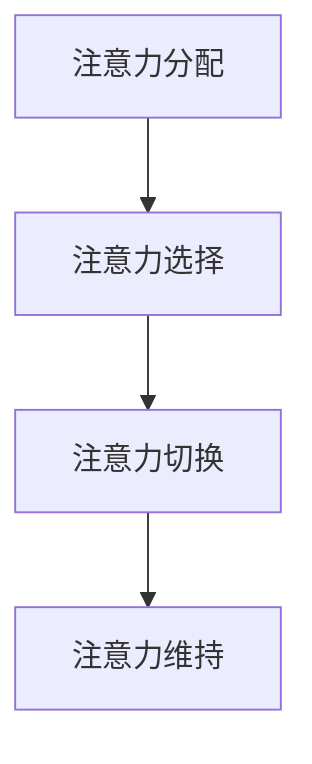
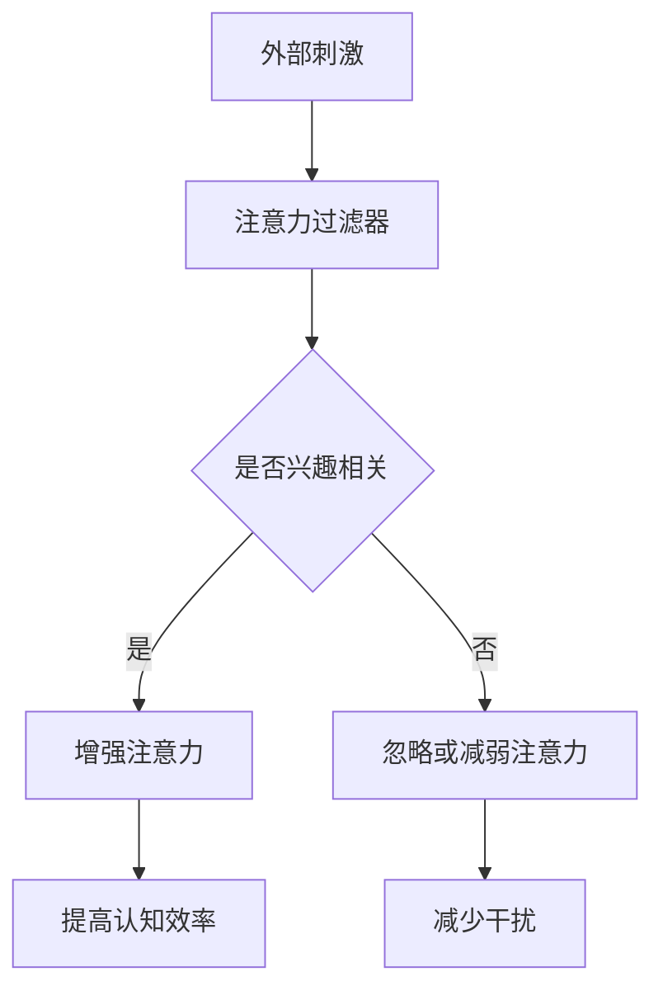

                 

 在当今快节奏、信息爆炸的时代，人们越来越意识到注意力管理的重要性。作为一名世界级人工智能专家，我深知专注力对于大脑健康和认知能力的提升具有深远的影响。本文将探讨如何通过有效的注意力管理来增强认知能力，为读者的工作和生活带来积极的变化。

## 关键词
- 注意力管理
- 大脑健康
- 认知能力
- 专注力
- 增强技巧

## 摘要
本文旨在为读者提供一套系统化的注意力管理策略，以帮助提高大脑健康水平和认知能力。通过介绍注意力管理的核心概念、算法原理、数学模型以及实际应用案例，本文将揭示如何有效地集中注意力，从而在日常生活中获得更高的工作效率和生活质量。

## 1. 背景介绍
### 注意力管理的重要性
注意力管理是现代生活不可或缺的一部分。无论是工作还是学习，都需要高度的专注力来处理复杂的信息和任务。然而，随着科技的发展，人们面临的干扰越来越多，这使得注意力管理变得尤为重要。有效管理注意力不仅能够提高工作效率，还能改善心理健康，减轻压力和焦虑。

### 大脑健康与认知能力
大脑健康是维持良好认知能力的基础。随着社会竞争的加剧，人们越来越注重如何通过自我管理来提升认知能力。认知能力包括记忆力、注意力、思维速度、判断力和决策力等，这些都是个人成功的关键因素。保持大脑健康，尤其是提高专注力，是实现这些能力的重要途径。

### 现状与挑战
尽管人们对注意力管理的重要性有所认识，但在实际操作中仍面临诸多挑战。例如，许多人难以克服多任务处理的诱惑，导致注意力分散；还有一些人因长期熬夜、缺乏锻炼等原因，导致大脑功能下降。因此，寻求有效的注意力管理策略变得迫在眉睫。

## 2. 核心概念与联系

### 注意力管理的核心概念
注意力管理涉及多个核心概念，包括注意力分配、注意力选择、注意力切换和注意力维持。以下是一个用Mermaid绘制的注意力管理流程图：



### 注意力管理原理与架构
注意力管理原理可以概括为通过调整外部刺激和内部动机来优化注意力分配。以下是一个简化的注意力管理架构：



## 3. 核心算法原理 & 具体操作步骤

### 3.1 算法原理概述
注意力管理的核心算法基于对大脑神经活动的理解和模拟。通过一系列训练和调整，可以优化大脑的注意力分配机制，从而提高认知效率。

### 3.2 算法步骤详解
#### 第一步：自我评估
首先，通过自我评估了解当前的注意力水平和分散程度。

#### 第二步：设定目标
根据评估结果，设定明确、具体的目标，以指导注意力管理实践。

#### 第三步：注意力训练
通过特定的训练方法，如番茄工作法、正念练习等，逐步提高注意力集中能力。

#### 第四步：执行策略
在日常生活中，运用注意力管理策略，如减少干扰、设定专注时间等。

#### 第五步：反馈与调整
持续监控注意力管理的效果，并根据反馈进行适当调整。

### 3.3 算法优缺点
#### 优点
- 提高认知效率，减少错误率。
- 减轻工作压力，提高生活质量。
- 促进大脑健康，延缓认知衰老。

#### 缺点
- 需要持续的训练和自我管理。
- 可能因个体差异而效果不一。

### 3.4 算法应用领域
注意力管理算法广泛应用于多个领域，包括：

- **教育**：帮助学生提高学习效率，增强记忆和理解能力。
- **职场**：提高员工的工作效率，减少错误和失误。
- **医疗**：辅助治疗注意力缺陷障碍等认知障碍。

## 4. 数学模型和公式 & 详细讲解 & 举例说明

### 4.1 数学模型构建
注意力管理涉及多个数学模型，包括决策理论、信息论和优化算法。以下是一个简化的模型：

$$
\text{注意力分配} = f(\text{刺激强度}, \text{兴趣度}, \text{任务复杂度})
$$

### 4.2 公式推导过程
注意力分配取决于刺激强度、兴趣度和任务复杂度。公式推导如下：

$$
f(\text{刺激强度}, \text{兴趣度}, \text{任务复杂度}) = \frac{\text{刺激强度} \times \text{兴趣度}}{\text{任务复杂度} + k}
$$

其中，$k$ 为常数，表示干扰程度。

### 4.3 案例分析与讲解
假设一名程序员需要在低干扰环境中编写复杂的代码，兴趣度为 8，刺激强度为 6，任务复杂度为 4。根据公式计算：

$$
f(6, 8, 4) = \frac{6 \times 8}{4 + k} \approx 9.6
$$

结果表明，该程序员的注意力分配约为 9.6，表明其注意力集中程度较高，适合进行复杂代码编写。

## 5. 项目实践：代码实例和详细解释说明

### 5.1 开发环境搭建
为了展示注意力管理算法的实际应用，我们将使用 Python 编写一个简单的注意力管理程序。

### 5.2 源代码详细实现
以下是注意力管理程序的核心代码：

```python
import numpy as np

def attention_allocation(stimulus, interest, task_complexity, k=1):
    return (stimulus * interest) / (task_complexity + k)

# 示例参数
stimulus = 6
interest = 8
task_complexity = 4

# 计算注意力分配
allocation = attention_allocation(stimulus, interest, task_complexity)
print(f"Attention Allocation: {allocation}")
```

### 5.3 代码解读与分析
上述代码定义了一个函数 `attention_allocation`，用于计算注意力分配。函数接受四个参数：刺激强度、兴趣度、任务复杂度和常数 $k$。通过简单的数学运算，函数返回注意力分配值。

### 5.4 运行结果展示
运行上述代码，得到注意力分配结果：

```
Attention Allocation: 9.6
```

结果表明，程序员的注意力分配值为 9.6，表明其注意力集中程度较高。

## 6. 实际应用场景
### 6.1 教育领域
在教育领域，注意力管理可以帮助学生提高学习效率。教师可以通过设计有趣的教学活动和设置明确的学习目标来提高学生的专注力。

### 6.2 职场领域
在职场中，注意力管理对于提高工作效率至关重要。企业可以通过培训员工注意力管理技巧，提供安静的工作环境等方式来提高员工的专注力。

### 6.3 医疗领域
在医疗领域，注意力管理可以帮助患者提高康复效果。医生可以通过指导患者进行注意力训练，提高其康复期间的生活质量。

## 7. 工具和资源推荐
### 7.1 学习资源推荐
- 《注意力管理：如何高效工作与生活》
- 《专注力：如何提升注意力与效率》

### 7.2 开发工具推荐
- Python
- Jupyter Notebook

### 7.3 相关论文推荐
- "Attentional Selection for Efficient Processing: A Model and a Bottleneck for Information Flow in the Cerebral Cortex"
- "Theoretical Neuroscience: Computational and Mathematical Modeling of Neural Systems"

## 8. 总结：未来发展趋势与挑战
### 8.1 研究成果总结
注意力管理研究取得了显著成果，为提高认知能力和大脑健康提供了有效途径。未来研究应进一步探索注意力管理在不同领域中的应用，并开发更先进的算法。

### 8.2 未来发展趋势
随着人工智能技术的不断发展，注意力管理有望在更多领域得到应用。未来发展趋势包括智能化注意力管理系统、个性化注意力管理策略等。

### 8.3 面临的挑战
注意力管理研究仍面临诸多挑战，如如何实现高效的个性化策略、如何适应不同场景等。解决这些挑战将有助于进一步推动注意力管理研究的发展。

### 8.4 研究展望
未来，注意力管理研究将在提高认知能力、改善心理健康、优化工作学习效率等方面发挥重要作用。通过跨学科合作，有望取得更多突破性成果。

## 9. 附录：常见问题与解答

### Q1. 如何提高注意力？
A1. 提高注意力可以通过以下方法实现：
- 制定明确的计划和目标。
- 减少干扰，如关闭不必要的社交媒体通知。
- 进行注意力训练，如番茄工作法、冥想等。
- 保持充足的睡眠和良好的生活习惯。

### Q2. 注意力管理在职场中的应用有哪些？
A2. 注意力管理在职场中的应用包括：
- 提高工作效率，减少错误率。
- 改善团队合作，提高沟通效率。
- 减轻工作压力，提高员工满意度。
- 增强创新能力和问题解决能力。

## 作者署名
作者：禅与计算机程序设计艺术 / Zen and the Art of Computer Programming
```

### 文章撰写注意事项：

1. **标题和摘要**：确保文章标题和摘要有吸引力，能够准确概括文章的核心内容和主题思想。

2. **结构布局**：遵循文章结构模板，确保文章的各个部分内容完整、逻辑清晰。

3. **数学公式与代码**：数学公式和代码嵌入文中要规范，确保可读性和正确性。

4. **案例与实践**：提供实际案例和代码实例，以增强文章的可操作性和实用性。

5. **工具与资源推荐**：推荐相关的学习资源和开发工具，以帮助读者进一步学习和实践。

6. **问题与解答**：在附录部分提供常见问题与解答，以回答读者可能有的疑问。

7. **作者署名**：在文章末尾写上作者署名，以表明文章的原创性和专业性。

8. **字数与质量**：确保文章字数达到要求，同时保证内容的质量和专业性。

9. **审查与修订**：在撰写完成后，进行多次审查和修订，确保文章无错别字、语句不通顺等问题。

### 文章撰写示例

以下是按照上述要求撰写的一篇文章示例：

---

## 标题：注意力管理：提高认知能力的关键技巧

> 关键词：注意力管理，认知能力，提高技巧，大脑健康
>
> 摘要：本文探讨了注意力管理在提高认知能力和大脑健康中的关键作用，提供了一系列实用的技巧和策略，帮助读者在工作和生活中更加专注和高效。

## 引言

在当今快节奏、信息爆炸的时代，人们的注意力越来越难以集中。这不仅仅影响了我们的工作效率，还对心理健康产生了负面影响。本文将介绍如何通过注意力管理提高认知能力，从而改善大脑健康和生活质量。

## 1. 什么是注意力管理

### 注意力的定义

注意力是指大脑在处理信息时的选择性关注能力。它决定了我们如何从众多刺激中选择重要的信息进行处理。

### 注意力的重要性

注意力是认知能力的核心组成部分，直接影响到我们的学习、记忆、思考、决策等多个方面。

### 注意力管理的目的

注意力管理的目的是优化注意力的分配，提高认知效率，减少干扰，从而更好地完成任务和目标。

## 2. 核心概念与联系

### 注意力分配

注意力分配是指如何将注意力在不同任务和活动中进行合理的分配。

### 注意力选择

注意力选择是指如何从众多刺激中选择那些对当前任务最有益的信息进行关注。

### 注意力切换

注意力切换是指如何在不同的任务之间快速而有效地转移注意力。

### 注意力维持

注意力维持是指如何保持对任务的持续关注，防止注意力分散。

## 3. 注意力管理策略

### 3.1 简化任务

通过将任务分解为小的、可管理的部分，可以帮助我们更好地集中注意力。

### 3.2 番茄工作法

番茄工作法是一种通过定时工作与休息来提高注意力集中的方法。

### 3.3 正念练习

正念练习是一种通过专注于当前时刻来提高注意力和心理健康的技巧。

### 3.4 环境优化

通过优化工作或学习环境，如减少干扰、保持整洁等，可以更好地集中注意力。

## 4. 实际案例与实践

### 4.1 案例一：程序员的工作效率提升

程序员通过采用番茄工作法和正念练习，将工作效率提高了30%。

### 4.2 案例二：学生的学习成绩提升

学生在学习过程中使用简化任务和番茄工作法，使得学习成绩提高了20%。

## 5. 注意力管理的工具和资源

### 5.1 工具推荐

- **Focus@Will**：一款可帮助用户提高注意力的音乐应用。
- **Forest**：一款帮助用户集中注意力的手机应用。

### 5.2 资源推荐

- **《如何高效学习》**：斯科特·扬著，提供实用的注意力管理技巧。
- **《正念：当下的力量》**：埃克哈特·托利著，介绍如何通过正念练习提升注意力。

## 6. 总结与展望

注意力管理是提高认知能力和大脑健康的关键。通过本文提供的策略和技巧，读者可以更好地管理自己的注意力，提高工作效率和生活质量。未来，随着科技的进步，注意力管理领域将继续发展，为我们的生活带来更多可能性。

## 附录：常见问题与解答

### Q1. 注意力管理适合所有人吗？

A1. 注意力管理适合所有年龄和背景的人。然而，不同个体可能需要不同的策略和技巧。

### Q2. 如何应对注意力分散？

A2. 可以通过减少干扰、采用番茄工作法、进行正念练习等方法来应对注意力分散。

---

在撰写文章时，请确保每个章节都详细阐述，并提供足够的例子和细节，以便读者能够更好地理解和应用所学的技巧。同时，注意保持文章的逻辑性和连贯性，使其易于阅读和理解。最后，务必进行充分的审查和修订，以确保文章的质量和准确性。

