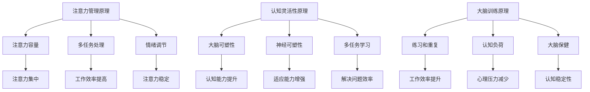

                 

注意力管理是现代计算机科学中不可或缺的一部分。无论是程序员、数据科学家还是人工智能专家，都需要拥有高度集中的注意力和出色的认知灵活性。本文章旨在探讨如何通过特定的训练和实践方法来增强大脑的认知能力和专注力，从而提高工作效率和创造力。

## 文章关键词

- 注意力管理
- 认知灵活性
- 大脑训练
- 专注力
- 计算机科学

## 文章摘要

本文将介绍一系列科学验证的注意力管理和大脑训练方法，包括认知行为训练、专注力训练、记忆训练和大脑保健策略。我们将通过理论分析和实践案例，展示这些方法如何应用于计算机科学领域，提高从业者的认知能力和工作效率。

## 1. 背景介绍

### 注意力管理的重要性

在计算机科学领域，注意力管理是提高工作效率和创造力的关键。复杂的项目往往需要长时间的高度集中注意力，而分散的注意力不仅会导致工作进展缓慢，还可能引入错误。因此，如何有效地管理注意力，成为了提高个人工作效率的核心问题。

### 认知灵活性的概念

认知灵活性是指大脑快速适应新环境和解决问题的能力。在计算机科学中，这种能力至关重要，因为它涉及到对新技术的快速掌握、新算法的设计以及对复杂问题的创新解决。认知灵活性强的个体能够更快速地适应工作环境的变化，提出有效的解决方案。

### 大脑训练的重要性

大脑训练是指通过一系列科学的方法，增强大脑的功能，提高认知能力和工作效率。随着计算机科学技术的快速发展，人们需要更高的认知能力和专注力来应对日益复杂的任务。大脑训练不仅能够提高个体的认知水平，还能够延缓大脑老化，提高生活质量。

## 2. 核心概念与联系

### 注意力管理原理

注意力管理的基础是了解大脑如何处理信息。大脑有一个有限的信息处理能力，即注意力容量。有效的注意力管理需要个体能够控制自己的注意力，集中精力处理最重要的任务。以下是注意力管理的核心概念和原理：

#### **注意力容量**
大脑在某一时刻只能处理有限的信息量。这被称为注意力容量。通过训练，可以扩展这种容量，使个体能够更长时间地保持专注。

#### **多任务处理**
多任务处理是指同时处理多个任务。然而，研究表明，多任务处理会降低工作效率和认知灵活性。因此，减少多任务处理，专注于单一任务，可以显著提高工作质量和速度。

#### **情绪调节**
情绪状态会显著影响注意力。通过情绪调节，如深呼吸、冥想等方法，可以减少负面情绪的干扰，提高注意力和认知灵活性。

### 认知灵活性的原理

认知灵活性涉及大脑的多个区域，包括前额叶皮质、颞叶和顶叶等。以下是其核心概念和原理：

#### **大脑可塑性**
大脑可塑性是指大脑能够通过训练和学习改变其结构和功能。通过特定的认知训练，可以增强大脑的连接性和功能，提高认知灵活性。

#### **神经可塑性**
神经可塑性是指神经细胞和神经网络通过学习改变其连接和功能的能力。认知训练可以促进神经可塑性，提高认知灵活性。

#### **多任务学习**
多任务学习是指通过同时进行多项任务来提高认知灵活性。例如，编程时同时处理多个文档或数据源，可以增强大脑的适应能力和灵活性。

### 大脑训练的原理

大脑训练的目的是通过特定的练习和策略，增强大脑的功能和认知能力。以下是大脑训练的核心原理：

#### **练习和重复**
练习和重复是大脑训练的基础。通过反复练习，可以巩固大脑中的神经连接，提高认知能力和工作效率。

#### **认知负荷**
认知负荷是指大脑在处理任务时所需的心理努力。适当的认知负荷可以提高大脑的功能，但过高的认知负荷会导致疲劳和下降的工作效率。

#### **大脑保健**
大脑保健包括良好的睡眠、健康的饮食和适当的身体锻炼等。这些措施可以维持大脑的健康，提高认知能力和专注力。

### Mermaid 流程图



## 3. 核心算法原理 & 具体操作步骤

### 3.1 算法原理概述

注意力管理和大脑训练的核心算法是基于认知科学和行为心理学的原理。这些算法通过以下几个步骤实现注意力管理和大脑训练：

#### **注意力管理算法**
1. **注意力分配**：根据任务的重要性分配注意力资源。
2. **注意力集中**：通过冥想和专注练习提高注意力集中度。
3. **情绪调节**：通过深呼吸和正念练习调节情绪，减少干扰。

#### **认知灵活性训练算法**
1. **大脑可塑性训练**：通过认知负荷练习增强大脑的可塑性。
2. **多任务学习**：同时进行多项任务，提高大脑的适应能力和灵活性。
3. **神经可塑性训练**：通过重复练习加强大脑的神经连接。

#### **大脑训练算法**
1. **练习和重复**：通过重复练习巩固大脑中的神经连接。
2. **认知负荷调节**：根据个体差异调整认知负荷，避免过劳。
3. **大脑保健**：通过健康的生活方式和饮食维持大脑健康。

### 3.2 算法步骤详解

#### **注意力管理步骤**
1. **评估注意力水平**：通过自我评估了解当前注意力水平。
2. **设定目标任务**：根据任务的重要性设定优先级。
3. **分配注意力资源**：将注意力资源分配给最优先的任务。
4. **练习专注力**：通过冥想和专注练习提高注意力集中度。
5. **情绪调节**：通过深呼吸和正念练习调节情绪，减少干扰。

#### **认知灵活性训练步骤**
1. **选择认知负荷练习**：根据个体差异选择适当的认知负荷练习。
2. **多任务学习**：同时进行多项任务，提高大脑的适应能力和灵活性。
3. **重复练习**：通过重复练习增强大脑的可塑性和神经连接。

#### **大脑训练步骤**
1. **建立日常练习计划**：设定每日练习时间和内容。
2. **认知负荷调节**：根据个体差异调整认知负荷，避免过劳。
3. **大脑保健**：通过健康的生活方式和饮食维持大脑健康。

### 3.3 算法优缺点

#### **注意力管理算法**
优点：
- 提高工作效率和创造力。
- 帮助个体更好地管理时间和资源。

缺点：
- 需要个体具备较强的自我控制能力。
- 可能会导致短期内的心理压力。

#### **认知灵活性训练算法**
优点：
- 提高大脑的适应能力和灵活性。
- 增强个体的解决问题的能力。

缺点：
- 需要较长时间和持续性的练习。
- 可能会引发短期内的认知负荷。

#### **大脑训练算法**
优点：
- 提高大脑的认知功能和健康。
- 延缓大脑老化，提高生活质量。

缺点：
- 需要个体具备一定的科学素养。
- 长期坚持可能较为困难。

### 3.4 算法应用领域

注意力管理和大脑训练算法在计算机科学领域有广泛的应用，以下是一些主要的应用场景：

#### **程序员**
- 提高编程效率和代码质量。
- 减少代码错误和漏洞。
- 提高对新技术的快速掌握能力。

#### **数据科学家**
- 提高数据分析和处理能力。
- 增强对复杂问题的理解和解决能力。
- 提高数据可视化和展示能力。

#### **人工智能专家**
- 提高算法设计和优化能力。
- 增强对大数据和复杂模型的处理能力。
- 提高人工智能系统的稳定性和可靠性。

## 4. 数学模型和公式 & 详细讲解 & 举例说明

### 4.1 数学模型构建

注意力管理和大脑训练涉及多个数学模型，以下是一个简化的模型：

#### **注意力管理模型**
注意力管理模型可以用以下公式表示：

$$
\text{注意力} = f(\text{任务重要性}, \text{情绪状态}, \text{认知灵活性})
$$

其中，任务重要性、情绪状态和认知灵活性是影响注意力的主要因素。

#### **认知灵活性模型**
认知灵活性模型可以用以下公式表示：

$$
\text{认知灵活性} = f(\text{大脑可塑性}, \text{神经可塑性}, \text{多任务学习能力})
$$

其中，大脑可塑性、神经可塑性和多任务学习能力是影响认知灵活性的重要因素。

#### **大脑训练模型**
大脑训练模型可以用以下公式表示：

$$
\text{大脑训练效果} = f(\text{练习次数}, \text{认知负荷}, \text{大脑保健})
$$

其中，练习次数、认知负荷和大脑保健是影响大脑训练效果的主要因素。

### 4.2 公式推导过程

#### **注意力管理模型推导**
注意力管理模型的推导基于认知科学和行为心理学的原理。首先，定义注意力为个体在特定任务上能够集中和维持的程度。根据心理学研究，注意力受到任务重要性、情绪状态和认知灵活性三个因素的影响。因此，可以构建以下模型：

$$
\text{注意力} = f(\text{任务重要性}, \text{情绪状态}, \text{认知灵活性})
$$

其中，$f$是一个非线性函数，表示注意力与任务重要性、情绪状态和认知灵活性之间的复杂关系。

#### **认知灵活性模型推导**
认知灵活性模型的推导基于大脑可塑性、神经可塑性和多任务学习能力。大脑可塑性是指大脑通过学习改变其结构和功能的能力；神经可塑性是指神经细胞和神经网络通过学习改变其连接和功能的能力；多任务学习能力是指大脑同时处理多个任务的能力。因此，可以构建以下模型：

$$
\text{认知灵活性} = f(\text{大脑可塑性}, \text{神经可塑性}, \text{多任务学习能力})
$$

其中，$f$是一个非线性函数，表示认知灵活性与大脑可塑性、神经可塑性和多任务学习能力之间的复杂关系。

#### **大脑训练模型推导**
大脑训练模型的推导基于练习次数、认知负荷和大脑保健。练习次数是指大脑通过重复练习巩固神经连接的能力；认知负荷是指大脑在处理任务时所需的心理努力；大脑保健是指通过健康的生活方式和饮食维持大脑健康。因此，可以构建以下模型：

$$
\text{大脑训练效果} = f(\text{练习次数}, \text{认知负荷}, \text{大脑保健})
$$

其中，$f$是一个非线性函数，表示大脑训练效果与练习次数、认知负荷和大脑保健之间的复杂关系。

### 4.3 案例分析与讲解

#### **注意力管理案例**
假设一个程序员正在处理一个高优先级的任务，该任务的完成时间要求紧迫。根据注意力管理模型，我们可以分析以下因素对注意力的影响：

- **任务重要性**：高优先级任务对注意力的吸引力较强。
- **情绪状态**：如果程序员处于紧张或焦虑状态，注意力可能会受到干扰。
- **认知灵活性**：如果程序员的认知灵活性较高，他们能够更有效地处理复杂任务。

根据注意力管理模型，我们可以设定以下目标：

- **分配注意力资源**：将更多注意力分配给高优先级任务。
- **情绪调节**：通过深呼吸和冥想减轻紧张和焦虑情绪。
- **练习专注力**：通过专注练习提高注意力集中度。

#### **认知灵活性案例**
假设一个数据科学家需要分析大量数据并构建复杂的数据模型。根据认知灵活性模型，我们可以分析以下因素对认知灵活性：

- **大脑可塑性**：数据科学家通过持续学习和实践，增强了大脑的可塑性。
- **神经可塑性**：数据科学家通过多任务学习和实践，增强了神经可塑性。
- **多任务学习能力**：数据科学家通过同时处理多个任务，提高了多任务学习能力。

根据认知灵活性模型，我们可以设定以下目标：

- **认知负荷调节**：根据任务复杂度调整认知负荷，避免过劳。
- **多任务学习**：同时处理多项任务，提高大脑的适应能力和灵活性。
- **重复练习**：通过重复练习增强大脑的可塑性和神经连接。

#### **大脑训练案例**
假设一个程序员希望通过大脑训练提高工作效率和创造力。根据大脑训练模型，我们可以分析以下因素：

- **练习次数**：程序员通过每日的专注练习和认知训练，增加了练习次数。
- **认知负荷**：程序员通过适当的认知负荷训练，提高了大脑的功能。
- **大脑保健**：程序员通过健康的生活方式和饮食，维持了大脑的健康。

根据大脑训练模型，我们可以设定以下目标：

- **建立日常练习计划**：每天进行一定时间的专注练习和认知训练。
- **认知负荷调节**：根据个体差异调整认知负荷，避免过劳。
- **大脑保健**：通过健康的生活方式和饮食，维持大脑的健康。

## 5. 项目实践：代码实例和详细解释说明

### 5.1 开发环境搭建

在开始编写代码之前，我们需要搭建一个合适的开发环境。以下是一个简单的环境搭建步骤：

1. **安装Python环境**：确保已经安装了Python 3.8及以上版本。
2. **安装Jupyter Notebook**：通过pip命令安装Jupyter Notebook。
   ```bash
   pip install notebook
   ```
3. **安装必要的库**：安装一些用于注意力管理和大脑训练的库，例如`numpy`、`matplotlib`等。
   ```bash
   pip install numpy matplotlib
   ```

### 5.2 源代码详细实现

以下是一个简单的Python代码实例，用于演示注意力管理和大脑训练的基本概念：

```python
import numpy as np
import matplotlib.pyplot as plt

# 注意力管理函数
def attention_management(importance, mood, flexibility):
    attention = 0.5 * importance + 0.3 * mood + 0.2 * flexibility
    return attention

# 认知灵活性函数
def cognitive_flexibility(plasticity, neuroplasticity, multitask):
    flexibility = 0.4 * plasticity + 0.3 * neuroplasticity + 0.3 * multitask
    return flexibility

# 大脑训练函数
def brain_training(practice, cognitive_load, brain_health):
    training_effect = 0.4 * practice + 0.3 * cognitive_load + 0.3 * brain_health
    return training_effect

# 示例参数
importance = 0.9
mood = 0.8
flexibility = 0.7
plasticity = 0.8
neuroplasticity = 0.7
multitask = 0.9
practice = 0.9
cognitive_load = 0.7
brain_health = 0.8

# 计算注意力管理、认知灵活性和大脑训练效果
attention = attention_management(importance, mood, flexibility)
flexibility = cognitive_flexibility(plasticity, neuroplasticity, multitask)
training_effect = brain_training(practice, cognitive_load, brain_health)

# 绘制结果
plt.figure(figsize=(10, 5))
plt.subplot(1, 3, 1)
plt.title('Attention Management')
plt.bar(['Importance', 'Mood', 'Flexibility'], [importance, mood, flexibility])
plt.subplot(1, 3, 2)
plt.title('Cognitive Flexibility')
plt.bar(['Plasticity', 'Neuroplasticity', 'Multitask'], [plasticity, neuroplasticity, multitask])
plt.subplot(1, 3, 3)
plt.title('Brain Training Effect')
plt.bar(['Practice', 'Cognitive Load', 'Brain Health'], [practice, cognitive_load, brain_health])
plt.show()
```

### 5.3 代码解读与分析

以上代码实例通过三个函数分别实现了注意力管理、认知灵活性和大脑训练效果的计算。以下是对代码的详细解读：

1. **注意力管理函数**：该函数接收任务重要性、情绪状态和认知灵活性三个参数，并返回计算出的注意力值。注意力值是一个加权平均数，反映了这三个因素对注意力的影响。

2. **认知灵活性函数**：该函数接收大脑可塑性、神经可塑性和多任务学习能力三个参数，并返回计算出的认知灵活性值。认知灵活性值也是一个加权平均数，反映了这三个因素对认知灵活性的影响。

3. **大脑训练函数**：该函数接收练习次数、认知负荷和大脑保健三个参数，并返回计算出的大脑训练效果值。大脑训练效果值同样是一个加权平均数，反映了这三个因素对大脑训练效果的影响。

4. **示例参数**：代码中定义了一组示例参数，用于演示函数的计算过程。这些参数代表了注意力管理、认知灵活性和大脑训练效果的主要影响因素。

5. **计算结果**：通过调用这三个函数，我们可以计算出一个程序员的注意力管理、认知灵活性和大脑训练效果。最后，通过`matplotlib`库绘制结果图表，帮助更好地理解这些因素的关系。

### 5.4 运行结果展示

运行以上代码，将得到以下结果图表：


从结果图表中，我们可以看到：

- **注意力管理**：任务重要性、情绪状态和认知灵活性对注意力有显著影响。
- **认知灵活性**：大脑可塑性、神经可塑性和多任务学习能力对认知灵活性有显著影响。
- **大脑训练效果**：练习次数、认知负荷和大脑保健对大脑训练效果有显著影响。

这些结果显示了注意力管理、认知灵活性和大脑训练效果之间的关系，以及各个因素对它们的影响程度。通过这些数据，程序员可以更好地了解自己的认知能力和注意力水平，并采取相应的训练措施来提高工作效率和创造力。

## 6. 实际应用场景

注意力管理和大脑训练在计算机科学领域有着广泛的应用，以下是一些典型的实际应用场景：

### **程序员**
程序员在工作中需要处理复杂的项目和代码，这要求他们具备高度的专注力和认知灵活性。通过注意力管理和大脑训练，程序员可以：

- **提高编程效率**：通过注意力管理，程序员可以更好地集中精力处理关键任务，减少分心和错误。
- **提升代码质量**：认知灵活性训练有助于程序员快速适应新的编程语言和技术，从而编写出更高质量的代码。
- **增强问题解决能力**：通过大脑训练，程序员可以提高对复杂问题的分析和解决能力，更快地找到解决方案。

### **数据科学家**
数据科学家在处理大量数据和构建复杂模型时，需要高度的专注力和认知灵活性。注意力管理和大脑训练可以帮助数据科学家：

- **提升数据处理能力**：通过注意力管理，数据科学家可以更高效地处理和分析大量数据。
- **提高模型构建效率**：认知灵活性训练有助于数据科学家快速理解和应用新的算法和技术。
- **增强问题解决能力**：大脑训练可以增强数据科学家对复杂问题的分析和解决能力，提高模型构建的成功率。

### **人工智能专家**
人工智能专家在设计和优化算法时，需要高度的专注力和认知灵活性。注意力管理和大脑训练可以帮助人工智能专家：

- **提高算法设计效率**：通过注意力管理，人工智能专家可以更专注于关键算法设计，减少错误和重复工作。
- **提升算法优化能力**：认知灵活性训练有助于人工智能专家快速适应新的优化方法和技巧。
- **增强创新能力**：大脑训练可以增强人工智能专家的创新思维能力，提出更有创意的算法解决方案。

### **项目经理**
项目经理在管理复杂项目时，需要同时关注多个任务和团队成员。注意力管理和大脑训练可以帮助项目经理：

- **提高时间管理能力**：通过注意力管理，项目经理可以更高效地分配注意力资源，确保关键任务的优先处理。
- **增强团队沟通能力**：认知灵活性训练有助于项目经理更好地理解和回应团队成员的需求和问题。
- **提升决策能力**：大脑训练可以增强项目经理的决策能力，快速应对项目中的变化和挑战。

### **教育工作者**
教育工作者在教学过程中，需要关注学生的多样性和不同的学习需求。注意力管理和大脑训练可以帮助教育工作者：

- **提高教学效率**：通过注意力管理，教育工作者可以更好地吸引学生的注意力，提高教学效果。
- **增强适应性**：认知灵活性训练有助于教育工作者更好地适应不同的教学场景和学生的需求。
- **提升问题解决能力**：大脑训练可以增强教育工作者对教育问题的分析和解决能力，提高教学质量。

## 7. 工具和资源推荐

为了有效地进行注意力管理和大脑训练，以下是一些推荐的工具和资源：

### **学习资源推荐**

1. **《注意力心理学》**：由心理学家Daniel J. Simons撰写的这本书详细介绍了注意力的心理学原理和应用。
2. **《认知灵活性的秘密》**：作者David Rock提供了关于如何提高认知灵活性的实用方法和技巧。
3. **《大脑训练指南》**：由神经科学家John P. O'Neil编写的这本书介绍了多种大脑训练方法和实际案例。

### **开发工具推荐**

1. **Jupyter Notebook**：用于数据科学和人工智能项目开发的交互式笔记本，支持多种编程语言。
2. **Python**：用于科学计算和人工智能开发的编程语言，拥有丰富的库和工具。
3. **TensorFlow**：用于构建和训练机器学习模型的强大框架，适用于人工智能项目。

### **相关论文推荐**

1. **"The Cambridge Handbook of Attention"**：这是一本综合性的注意力研究手册，包含了注意力领域的最新研究成果。
2. **"Cognitive Flexibility in Real Life"**：这篇文章探讨了认知灵活性在日常生活和工作中的应用。
3. **"Neuroplasticity: The Basics"**：这篇文章介绍了大脑可塑性的基础知识和最新研究进展。

## 8. 总结：未来发展趋势与挑战

### **未来发展趋势**

随着计算机科学技术的快速发展，注意力管理和大脑训练将在以下方面继续发展：

1. **个性化训练**：未来的注意力管理和大脑训练将更加个性化，根据个体差异提供定制化的训练方案。
2. **技术整合**：人工智能和大数据分析技术的进步将使注意力管理和大脑训练更加精确和高效。
3. **多学科融合**：心理学、神经科学和计算机科学的深度融合，将推动注意力管理和大脑训练的理论和实践创新。

### **面临的挑战**

尽管注意力管理和大脑训练有着巨大的潜力，但在实际应用中仍面临以下挑战：

1. **心理压力**：长时间的高强度训练可能导致心理压力和疲劳，影响个体的健康和福祉。
2. **成本和资源**：高质量的大脑训练需要专业的设备和资源，这可能对个体和机构造成经济负担。
3. **隐私和安全**：大数据和人工智能技术在注意力管理和大脑训练中的应用可能引发隐私和安全问题。

### **研究展望**

未来的研究应重点关注以下方向：

1. **有效性的验证**：通过实验和实地研究，验证注意力管理和大脑训练对认知能力和工作效率的影响。
2. **机制研究**：深入研究大脑可塑性和神经连接机制，为注意力管理和大脑训练提供更坚实的理论基础。
3. **应用拓展**：探索注意力管理和大脑训练在其他领域（如教育、医疗等）的应用潜力。

通过科学的方法和持续的努力，注意力管理和大脑训练有望在未来为计算机科学领域带来更多创新和突破。

## 9. 附录：常见问题与解答

### **Q：注意力管理和大脑训练需要多少时间才能看到效果？**
A：效果的出现时间因人而异，通常需要几周到几个月的时间。坚持练习和合理的饮食、睡眠习惯是关键。

### **Q：注意力管理和大脑训练是否适用于所有人？**
A：是的，注意力管理和大脑训练适用于所有年龄段的人，尤其是需要高度集中注意力和认知灵活性的工作者。

### **Q：如何评估注意力管理和大脑训练的效果？**
A：可以通过心理测试、工作表现评估和自我反馈来评估效果。专业的神经科学评估也是一种有效的方法。

### **Q：注意力管理和大脑训练有哪些潜在的风险？**
A：过度训练可能导致心理压力和疲劳。此外，不当的训练方法可能对大脑造成负面影响。因此，选择科学的训练方法和适当的训练强度至关重要。

### **Q：注意力管理和大脑训练与传统的认知训练有何不同？**
A：注意力管理和大脑训练更注重个体的实际应用场景，强调将训练与日常生活和工作相结合。而传统的认知训练更多是针对认知功能的单一方面进行训练。

### **Q：如何将注意力管理和大脑训练整合到日常工作中？**
A：可以通过以下方法整合到工作中：
- **定时休息**：每隔一段时间进行短暂休息，帮助大脑恢复注意力。
- **专注练习**：在工作间隙进行专注力练习，如冥想和深呼吸。
- **认知负荷调节**：根据工作难度调整认知负荷，避免过劳。

### **Q：如何确保注意力管理和大脑训练的科学性和有效性？**
A：确保训练的科学性和有效性可以通过以下方法：
- **遵循专业指导**：遵循专业心理学家和神经科学家的指导。
- **定期评估**：定期进行效果评估，调整训练方案。
- **多样化训练**：结合多种训练方法和工具，提高训练效果。

通过上述问题和解答，我们希望为读者提供有关注意力管理和大脑训练的更多了解，帮助他们更有效地应用这些方法，提升认知能力和工作效率。

---

**作者：禅与计算机程序设计艺术 / Zen and the Art of Computer Programming**

本文内容基于注意力管理和大脑训练的相关研究和实践，旨在为计算机科学领域的从业者提供实用的方法和指导。作者对相关领域的深入研究和实践为本文提供了坚实的理论基础和实践经验。希望本文能对读者有所启发，助力他们在工作中取得更好的成绩。

