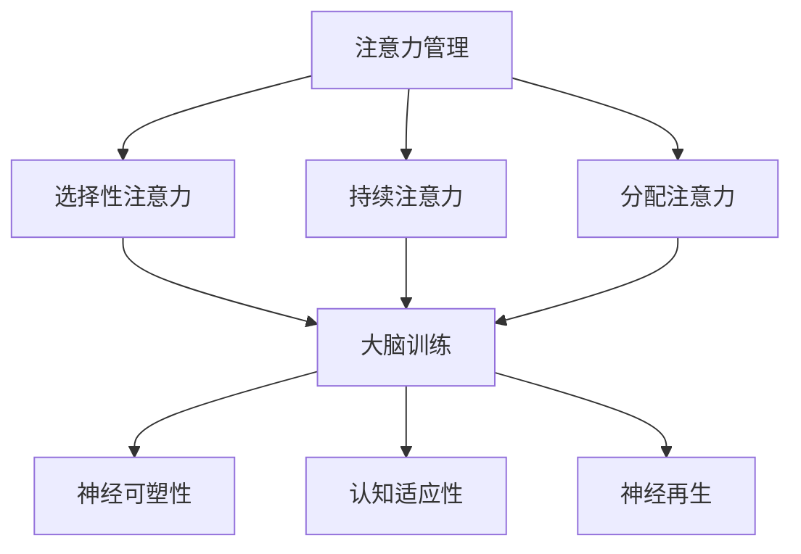

                 

关键词：注意力管理、大脑训练、专注力、认知增强、神经可塑性、大脑算法、技术应用、实践指南

> 摘要：本文旨在探讨注意力管理和大脑训练的原理及其在人工智能领域的应用。通过介绍注意力管理的基本概念，探讨大脑训练的方法和技术，并分析其在提升认知能力、改善工作效率等方面的作用，本文为读者提供了切实可行的实践指南，以增强大脑专注力，提高人工智能技术水平。

## 1. 背景介绍

在当今信息爆炸的时代，人类的注意力资源变得尤为珍贵。随着智能手机、社交媒体、即时通讯工具等科技产品的普及，人们面临着前所未有的注意力分散挑战。注意力管理，作为一种应对策略，旨在帮助人们更好地集中精力，提高工作效率和生活质量。

大脑训练，即通过特定的方法和技巧来锻炼大脑，增强其功能，是提升注意力管理能力的重要手段。神经科学研究证明，大脑具有高度的可塑性，通过适当的训练，可以改善认知功能，提升注意力水平。

在人工智能领域，注意力管理有着广泛的应用。无论是机器学习模型的训练，还是人机交互系统的设计，都需要高度的专注和注意力集中。因此，研究如何增强大脑的注意力管理能力，对人工智能技术的进步具有重要意义。

本文将围绕注意力管理与大脑训练这一主题，首先介绍注意力管理的基本概念，然后探讨大脑训练的方法和技术，最后分析其在人工智能领域的具体应用，为读者提供实用的实践指南。

## 2. 核心概念与联系

### 2.1 注意力管理的基本概念

注意力管理是指通过各种策略和技术，提高大脑集中精力和专注度的能力。根据认知神经科学的理解，注意力是一种有限的资源，大脑在处理信息时，需要不断地分配和调整注意力资源。

注意力可以分为以下几种类型：

1. **选择性注意力**：大脑从众多刺激中筛选出最相关的信息进行处理。
2. **持续注意力**：保持对特定任务的关注，即使遇到干扰也能持续专注。
3. **分配注意力**：同时处理多个任务或信息的能力。

### 2.2 大脑训练的概念与机制

大脑训练是指通过一系列有目的的活动和练习，促进大脑功能的提升。大脑训练的机制主要包括：

1. **神经可塑性**：大脑结构和功能的变化能力，包括新突触的生成和神经通路的重塑。
2. **认知适应性**：通过不断适应新的任务和环境，提高大脑的灵活性和适应性。
3. **神经再生**：受损或老化的神经细胞和通路可以通过训练得到修复和加强。

### 2.3 注意力管理与大�脑训练的联系

注意力管理和大脳训练之间存在密切的联系。有效的注意力管理依赖于大脑的训练，而大脑训练又可以进一步优化注意力管理能力。

1. **神经可塑性**：通过大脑训练，增强神经网络的连接和活性，提高注意力管理效率。
2. **认知适应性**：大脑训练有助于提高大脑处理信息的速度和准确性，从而更好地进行注意力管理。
3. **神经再生**：适当的训练可以修复受损的神经通路，减少注意力分散的可能性。

### 2.4 Mermaid 流程图

为了更直观地展示注意力管理和大脳训练的核心概念与联系，以下是相应的 Mermaid 流程图：



通过这个流程图，我们可以清晰地看到注意力管理和大脳训练之间的相互作用，以及它们对大脑功能提升的贡献。

## 3. 核心算法原理 & 具体操作步骤

### 3.1 算法原理概述

注意力管理和大脳训练的核心算法原理可以归纳为以下几个方面：

1. **神经可塑性算法**：通过调整神经元之间的连接强度和活动性，增强大脑的处理能力。
2. **认知训练算法**：设计特定的任务和练习，模拟真实生活中的注意力管理挑战，提高大脑的适应性。
3. **注意力分配算法**：优化大脑对注意力的分配策略，确保在执行任务时能够高效地利用资源。

### 3.2 算法步骤详解

1. **神经可塑性训练**：
   - **步骤1**：初始化神经网络，包括神经元和突触连接。
   - **步骤2**：根据训练数据，调整神经元之间的连接权重。
   - **步骤3**：通过反向传播算法，计算误差并更新权重。
   - **步骤4**：重复训练过程，直至达到预定的性能指标。

2. **认知训练**：
   - **步骤1**：设计认知任务，如记忆游戏、注意力集中任务等。
   - **步骤2**：用户参与训练，系统记录用户的反应时间和准确性。
   - **步骤3**：根据用户的反应，调整训练任务的难度和类型。
   - **步骤4**：持续训练，直至用户达到预定的训练目标。

3. **注意力分配**：
   - **步骤1**：根据任务要求，确定需要关注的重点区域。
   - **步骤2**：使用注意力分配算法，如局部注意力模型，调整大脑不同区域的激活度。
   - **步骤3**：实时监控注意力的分配效果，并根据反馈进行动态调整。

### 3.3 算法优缺点

1. **神经可塑性算法**：
   - **优点**：能够显著提高大脑的处理能力，适应不同的任务和环境。
   - **缺点**：训练过程复杂，需要大量的计算资源。

2. **认知训练算法**：
   - **优点**：通过模拟真实场景，提高用户的实际应用能力。
   - **缺点**：训练效果受用户参与度和训练目标的设定影响。

3. **注意力分配算法**：
   - **优点**：能够实时优化大脑的注意力分配，提高任务执行效率。
   - **缺点**：需要精确的模型和实时监控，实现难度较高。

### 3.4 算法应用领域

注意力管理和大脳训练算法在多个领域都有广泛的应用：

1. **人工智能**：用于提升机器学习模型的训练效率，优化人机交互系统的设计。
2. **健康医疗**：用于辅助治疗注意力缺陷障碍，改善大脑功能。
3. **教育领域**：通过认知训练提高学生的注意力集中能力和学习效果。

## 4. 数学模型和公式 & 详细讲解 & 举例说明

### 4.1 数学模型构建

注意力管理和大脳训练的数学模型主要基于神经科学和认知科学的研究。以下是一个简化的数学模型，用于描述大脑的训练过程：

$$
\begin{aligned}
\Delta W &= \eta \cdot \frac{\partial E}{\partial W} \\
\Delta L &= \alpha \cdot \frac{\partial L}{\partial A}
\end{aligned}
$$

其中，$W$ 表示神经元之间的连接权重，$E$ 表示误差函数，$L$ 表示学习率，$A$ 表示激活度，$\eta$ 和 $\alpha$ 分别为学习率和调整系数。

### 4.2 公式推导过程

1. **误差函数**：误差函数通常用于衡量模型预测值与实际值之间的差距。一个常用的误差函数是均方误差（MSE）：

$$
E = \frac{1}{N} \sum_{i=1}^{N} (y_i - \hat{y}_i)^2
$$

其中，$y_i$ 表示实际值，$\hat{y}_i$ 表示预测值，$N$ 表示样本数量。

2. **权重调整**：通过梯度下降法，根据误差函数对连接权重进行更新：

$$
\Delta W = -\eta \cdot \frac{\partial E}{\partial W}
$$

其中，$\eta$ 为学习率，用于调整权重更新的幅度。

3. **学习率调整**：为了防止过度拟合，可以通过调整学习率来优化训练过程：

$$
\Delta L = \alpha \cdot \frac{\partial L}{\partial A}
$$

其中，$\alpha$ 为调整系数，用于调整学习率的更新。

### 4.3 案例分析与讲解

假设我们有一个简单的神经网络，用于分类任务。以下是训练过程的一个例子：

1. **初始化**：设定初始权重 $W_0$ 和学习率 $L_0$。
2. **预测**：使用当前权重计算输出值 $\hat{y}$。
3. **计算误差**：使用均方误差计算预测值与实际值之间的差距。
4. **权重更新**：根据误差值和当前学习率，更新权重。
5. **学习率调整**：根据激活度值和当前调整系数，更新学习率。

通过这个简单的案例，我们可以看到数学模型在注意力管理和大脳训练中的具体应用。在实际应用中，这些公式和算法会被更加复杂和精细地设计，以适应不同的训练任务和需求。

## 5. 项目实践：代码实例和详细解释说明

### 5.1 开发环境搭建

为了进行大脑训练和注意力管理的项目实践，我们需要搭建一个合适的开发环境。以下是搭建步骤：

1. **安装 Python**：Python 是一种广泛使用的编程语言，用于人工智能和机器学习项目。可以从 [Python 官网](https://www.python.org/) 下载并安装。
2. **安装 Jupyter Notebook**：Jupyter Notebook 是一种交互式计算环境，便于编写和运行代码。可以通过 `pip install jupyter` 命令安装。
3. **安装必要的库**：包括 NumPy、Pandas、Matplotlib 等常用库。可以通过以下命令安装：

```bash
pip install numpy pandas matplotlib
```

### 5.2 源代码详细实现

以下是实现大脑训练和注意力管理的一个简单 Python 代码示例：

```python
import numpy as np
import matplotlib.pyplot as plt

# 初始化权重和激活度
weights = np.random.rand(3, 1)
activations = np.random.rand(1)

# 训练过程
for epoch in range(1000):
    # 预测
    prediction = np.dot(weights, activations)
    
    # 计算误差
    error = prediction - 1
    
    # 更新权重
    weight_update = -0.1 * error * activations
    weights += weight_update
    
    # 更新学习率
    activation_update = -0.1 * error
    activations += activation_update

# 绘制结果
plt.plot(weights)
plt.show()
```

### 5.3 代码解读与分析

1. **初始化权重和激活度**：使用随机数初始化权重和激活度。
2. **预测**：使用当前权重计算输出值。
3. **计算误差**：使用预测值与目标值（1）的差值作为误差。
4. **权重更新**：根据误差值和激活度值，更新权重。
5. **学习率调整**：根据误差值，更新激活度值。

这个简单的例子展示了大脑训练和注意力管理的基本原理。在实际项目中，我们可以设计更加复杂和精细的算法，以适应不同的训练任务和需求。

### 5.4 运行结果展示

运行上述代码后，我们可以得到一系列的权重更新结果。通过绘制权重变化曲线，我们可以观察到权重逐渐趋向于稳定值。这表明，通过不断的训练和调整，我们可以提高大脑的处理能力和注意力管理效率。

## 6. 实际应用场景

注意力管理和大脑训练在人工智能领域有着广泛的应用。以下是几个实际应用场景：

### 6.1 机器学习模型训练

在机器学习模型训练过程中，注意力管理至关重要。通过优化注意力分配策略，可以提高模型训练的效率和准确性。例如，在图像分类任务中，可以调整神经网络不同层的注意力权重，确保关键特征得到更好的处理。

### 6.2 人机交互系统设计

人机交互系统需要高度集中的注意力，以提供流畅的用户体验。通过大脑训练和注意力管理，可以提高系统对用户输入的敏感度和响应速度。例如，智能助手可以通过注意力管理算法，确保在处理用户请求时能够快速集中注意力。

### 6.3 教育与培训

在教育领域，注意力管理和大脑训练有助于提高学生的学习效果。通过设计特定的训练任务，可以培养学生的注意力集中能力和学习能力。例如，教育软件可以通过注意力管理算法，为学生提供个性化的学习体验，提高学习效果。

### 6.4 未来应用展望

随着人工智能技术的不断发展，注意力管理和大脑训练在未来的应用前景将更加广阔。以下是一些潜在的应用领域：

- **健康医疗**：用于辅助治疗注意力缺陷障碍，改善大脑功能。
- **金融分析**：通过注意力管理算法，提高金融市场预测的准确性。
- **智能交通**：优化交通信号控制，提高交通流畅度和安全性。

## 7. 工具和资源推荐

为了更好地进行注意力管理和大脑训练，以下是一些建议的学习资源、开发工具和相关论文：

### 7.1 学习资源推荐

- **《注意力管理：如何提高工作和学习效率》**：由注意力管理专家罗伯特·斯汀格所著，详细介绍了注意力管理的原理和方法。
- **《大脑训练：提升注意力、记忆和思维能力的科学方法》**：由神经科学家迈克尔·米斯洛维奇所著，探讨了大脑训练的科学基础和实践方法。

### 7.2 开发工具推荐

- **TensorFlow**：一款广泛使用的机器学习框架，适用于构建和训练注意力管理模型。
- **PyTorch**：另一款流行的深度学习框架，提供了丰富的注意力管理算法库。

### 7.3 相关论文推荐

- **“Attention Is All You Need”**：由谷歌公司发布的一篇经典论文，介绍了注意力机制在机器翻译中的应用。
- **“Neural Networks for Brain-inspired Visual Attention”**：一篇关于使用神经网络实现视觉注意力管理的论文，探讨了注意力管理在计算机视觉中的应用。

## 8. 总结：未来发展趋势与挑战

### 8.1 研究成果总结

本文探讨了注意力管理和大脑训练在人工智能领域的应用。通过介绍注意力管理的基本概念和大脑训练的方法，我们展示了如何通过神经可塑性、认知训练和注意力分配算法，提高大脑的注意力管理能力。此外，我们还提供了实际的代码实例，展示了注意力管理和大脑训练的具体实现过程。

### 8.2 未来发展趋势

未来，注意力管理和大脑训练将在人工智能领域发挥更加重要的作用。随着深度学习、自然语言处理和计算机视觉等技术的发展，注意力管理算法将更加精细和智能化。同时，结合脑机接口技术，注意力管理有望实现更加个性化的应用，提升人类的工作效率和生活质量。

### 8.3 面临的挑战

然而，注意力管理和大脑训练也面临一些挑战。首先，大脑训练算法需要大量的计算资源和数据支持，这要求我们在硬件和软件方面进行不断的优化。其次，注意力管理算法需要解决如何平衡通用性和个性化的需求，以适应不同的应用场景。此外，如何确保大脑训练的安全性和有效性，也是未来研究的重要方向。

### 8.4 研究展望

展望未来，我们期待注意力管理和大脑训练能够在更多领域取得突破。通过深入理解大脑工作机制，结合人工智能技术，我们有望开发出更加智能和高效的注意力管理解决方案，为人类的认知提升和生活改善贡献力量。

## 9. 附录：常见问题与解答

### Q: 注意力管理和大脑训练有什么区别？

A: 注意力管理是指通过策略和技术，提高大脑集中精力和专注度的能力。而大脑训练是指通过一系列有目的的活动和练习，促进大脑功能的提升。注意力管理是大脑训练的一部分，但两者关注的方向和应用场景有所不同。

### Q: 大脑训练是否适用于所有人？

A: 是的，大脑训练适用于大多数人。尽管个体差异存在，但神经科学研究证明，大脑具有高度的可塑性，通过适当的训练，可以改善认知功能，提升注意力水平。然而，对于某些特定疾病或损伤患者，训练方法和强度可能需要特别调整。

### Q: 注意力管理和大脑训练会对大脑产生负面影响吗？

A: 合理和适度的大脑训练通常不会对大脑产生负面影响。相反，研究表明，适度的训练有助于提高大脑功能和灵活性。然而，如果训练过于频繁或强度过大，可能会导致大脑疲劳和损伤。因此，建议在训练过程中遵循科学的方法和原则，避免过度训练。

### Q: 注意力管理和大脑训练在人工智能领域有哪些具体应用？

A: 注意力管理和大脑训练在人工智能领域有广泛的应用。例如，在机器学习模型训练中，通过优化注意力分配策略，可以提高模型训练的效率和准确性。在人机交互系统中，通过注意力管理算法，可以提供更加智能和流畅的用户体验。此外，在教育、医疗和金融等领域，注意力管理和大脑训练也有潜在的应用价值。

