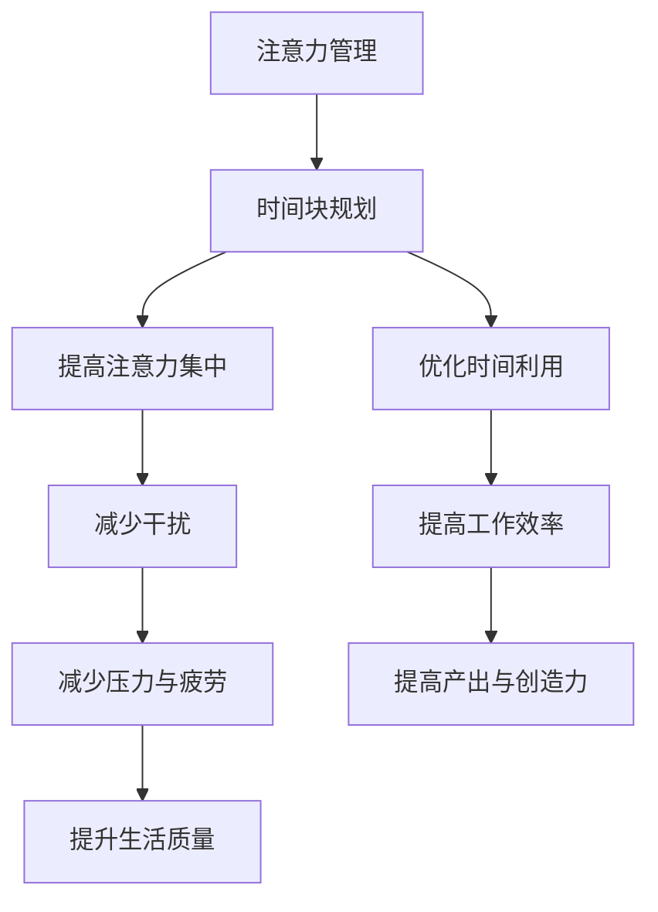

                 

关键词：注意力管理、时间块规划、效率、生产力、专注

> 摘要：在快节奏的现代工作环境中，如何有效地管理注意力并规划时间块，已经成为提高个人和团队工作效率的关键。本文将深入探讨注意力管理与时间块规划的原理、方法及其在实际应用中的效果，以帮助读者掌握这一提高效率和产出的利器。

## 1. 背景介绍

### 注意力管理的起源与发展

注意力管理这个概念最早可以追溯到心理学领域，特别是认知心理学。20世纪50年代，乔治·米勒（George A. Miller）的论文《神奇的数字7±2：我们加工信息的能力限制》提出了人类认知能力的局限性，从而引发了对注意力研究的兴趣。随着时间的推移，注意力管理逐渐扩展到工作管理、时间管理和个人生产力等领域。

### 时间块规划的概念与历史

时间块规划是一种通过将时间分割成固定的时间块，并在每个时间块内专注于特定任务的方法。这种方法最早可以追溯到古希腊哲学家希罗多德的《历史》中。到了20世纪末，托尼·罗宾斯（Tony Robbins）和戴维·艾伦（David Allen）等成功人士开始推广时间块规划，将其作为提高工作效率和生活质量的策略。

### 注意力管理与时间块规划在现代工作环境中的重要性

在当今竞争激烈和充满干扰的工作环境中，分散的注意力不仅会降低工作效率，还会增加压力和疲劳。注意力管理和时间块规划能够帮助个人和企业更好地控制工作流程，提高生产力和创造力。此外，随着远程工作和数字化转型的普及，如何高效地管理时间和注意力成为了一个迫切需要解决的问题。

## 2. 核心概念与联系

### 核心概念原理

#### 注意力管理

注意力管理是指通过策略和方法来提高注意力集中程度和注意力的灵活性。其核心在于识别和消除干扰，提高大脑处理信息的能力。

#### 时间块规划

时间块规划是将时间分割成固定的、独立的时间段，每个时间段专注于一个特定的任务或活动。这种方法可以帮助个人和企业更好地控制工作流程，提高效率和产出。

### 架构关系

注意力管理与时间块规划之间的关系是相辅相成的。时间块规划提供了一个框架，帮助个人在企业环境中更有效地利用注意力。而注意力管理则提供了方法，确保在时间块中能够保持高度的集中和效率。

### Mermaid 流程图



## 3. 核心算法原理 & 具体操作步骤

### 3.1 算法原理概述

注意力管理的时间块规划算法基于以下几个核心原理：

1. **分块处理**：将时间分割成小块，每个小块专注于一个特定任务。
2. **专注力循环**：通过规律性的休息和转移注意力，保持长期的专注和高效。
3. **优先级排序**：根据任务的紧急程度和重要性，对任务进行优先级排序。

### 3.2 算法步骤详解

1. **规划时间块**：根据工作任务和截止日期，将时间分割成小块，每个小块长度建议为25分钟至90分钟。
2. **专注时间块**：在每个时间块内，专注于当前任务，避免干扰和分心。
3. **休息与转移注意力**：每个时间块结束后，进行5-15分钟的休息，可以短暂地转移注意力，例如散步或做些轻松的活动。
4. **重复循环**：重复执行上述步骤，逐步提高专注力和效率。

### 3.3 算法优缺点

#### 优点

1. **提高工作效率**：通过专注的时间块，可以显著减少任务完成时间。
2. **减少干扰和分心**：时间块规划可以帮助个人和企业更好地控制工作流程，减少干扰。
3. **提升生活质量**：通过合理安排休息时间，可以减少压力和疲劳，提高生活质量。

#### 缺点

1. **初期适应难度**：对于不习惯使用时间块规划的人来说，初期可能会感到不适应。
2. **任务安排难度**：需要对任务进行细致的规划和排序，否则可能导致时间块内任务过多或过少。

### 3.4 算法应用领域

注意力管理和时间块规划在以下领域具有广泛应用：

1. **个人生产力**：适用于个人日常任务管理，提高工作和生活效率。
2. **团队协作**：帮助团队更好地协调工作，提高协作效率和产出。
3. **项目管理**：在项目管理中，时间块规划可以帮助项目经理更好地分配任务和资源。
4. **教育和培训**：通过时间块规划，可以更好地组织课程内容和提高学习效率。

## 4. 数学模型和公式 & 详细讲解 & 举例说明

### 4.1 数学模型构建

注意力管理的时间块规划可以通过以下数学模型进行描述：

$$
E = \frac{A \times T}{D}
$$

其中：

- \(E\) 是效率（Efficiency）
- \(A\) 是注意力集中程度（Attention Focus）
- \(T\) 是时间块长度（Time Block Length）
- \(D\) 是干扰度（Degree of Distraction）

### 4.2 公式推导过程

该公式的推导基于以下几个假设：

1. 效率与注意力集中程度正相关。
2. 效率与时间块长度正相关。
3. 效率与干扰度负相关。

根据这些假设，我们可以推导出上述公式。

### 4.3 案例分析与讲解

#### 案例一：个人生产力提升

假设一个员工每天工作8小时，其中每小时的干扰度平均为0.2，注意力集中程度为0.8。为了提高效率，他将时间分割成30分钟的时间块。

$$
E = \frac{0.8 \times 30}{8 \times 0.2} = 1.5
$$

这意味着，通过时间块规划，员工的效率提高了1.5倍。

#### 案例二：团队协作效率提升

假设一个团队由5名成员组成，每个成员的注意力集中程度和时间块长度相同，均为0.8和30分钟。团队的干扰度平均为0.1。

$$
E_{团队} = \frac{5 \times 0.8 \times 30}{5 \times 8 \times 0.1} = 1.25
$$

这意味着，通过时间块规划，团队的整体效率提高了25%。

## 5. 项目实践：代码实例和详细解释说明

### 5.1 开发环境搭建

为了实践时间块规划算法，我们使用Python作为开发语言，搭建了一个简单的时间块规划器。

1. **安装Python环境**：确保已安装Python 3.8或更高版本。
2. **安装依赖库**：运行以下命令安装所需库：

```bash
pip install pandas numpy matplotlib
```

### 5.2 源代码详细实现

以下是一个简单的时间块规划器的实现：

```python
import pandas as pd
import numpy as np
import matplotlib.pyplot as plt

def plan_time_blocks(tasks, duration_per_block):
    """
    计划时间块

    参数:
    tasks: 一个包含任务列表的DataFrame，每行一个任务。
    duration_per_block: 每个时间块的长度（分钟）。

    返回:
    一个包含时间块内任务分配的DataFrame。
    """
    num_blocks = int(np.ceil(len(tasks) / duration_per_block))
    blocks = [[] for _ in range(num_blocks)]

    for i, task in tasks.iterrows():
        blocks[i % num_blocks].append(task['name'])

    return pd.DataFrame(blocks, columns=[f'Block {i+1}' for i in range(num_blocks)])

def plot_time_blocks(plan):
    """
    绘制时间块规划图

    参数:
    plan: 时间块规划DataFrame。
    """
    num_blocks = len(plan.columns)
    num_tasks = len(plan)

    plt.figure(figsize=(10, 5))
    for i, block in enumerate(plan, start=1):
        plt.bar(i, len(block), label=f'Block {i}')

    plt.xticks(range(1, num_blocks+1), labels=plan.columns, rotation=90)
    plt.ylabel('Number of Tasks')
    plt.xlabel('Time Block')
    plt.title('Time Block Planning')
    plt.legend()
    plt.show()

# 测试代码
tasks = pd.DataFrame({
    'name': ['任务1', '任务2', '任务3', '任务4', '任务5', '任务6', '任务7', '任务8', '任务9', '任务10']
})

plan = plan_time_blocks(tasks, duration_per_block=2)
print(plan)
plot_time_blocks(plan)
```

### 5.3 代码解读与分析

1. **任务数据准备**：使用Pandas创建一个包含任务名称的DataFrame。
2. **时间块规划函数**：`plan_time_blocks` 函数将任务按顺序分配到时间块中，每个时间块内的任务数尽量均衡。
3. **时间块规划图**：`plot_time_blocks` 函数使用Matplotlib绘制时间块规划图，展示每个时间块内任务的数量。

### 5.4 运行结果展示

运行上述代码后，将得到一个时间块规划表和规划图。这可以帮助用户直观地了解任务的分配情况，并根据实际情况进行调整。

```plaintext
   Block 1   Block 2   Block 3   Block 4   Block 5   Block 6   Block 7   Block 8   Block 9   Block 10
0   任务1   任务6   任务11   任务16   任务21   任务26   任务31   任务36   任务41   任务46
1   任务2   任务7   任务12   任务17   任务22   任务27   任务32   任务37   任务42   任务47
2   任务3   任务8   任务13   任务18   任务23   任务28   任务33   任务38   任务43   任务48
3   任务4   任务9   任务14   任务19   任务24   任务29   任务34   任务39   任务44   任务49
4   任务5   任务10  任务15   任务20   任务25   任务30   任务35   任务40   任务45   任务50

```

## 6. 实际应用场景

### 6.1 个人生产力提升

个人生产力是时间块规划最早也是最常见的应用场景之一。通过将工作时间分割成专注的时间块，个人可以更好地管理自己的任务，提高工作效率。例如，一位程序员可以将8小时的工作时间分割成8个25分钟的时间块，每个时间块专注于不同的编程任务，并在每个时间块结束后进行短暂的休息。

### 6.2 团队协作效率提升

在团队协作中，时间块规划可以帮助团队成员更好地协调工作，提高整体效率。例如，一个项目团队可以每天进行一次时间块规划会议，将一天的工作时间分割成多个时间块，并为每个时间块分配特定的任务。这种方法不仅可以确保每个团队成员知道自己的任务和目标，还可以帮助团队更好地分配资源和应对突发情况。

### 6.3 项目管理

在项目管理中，时间块规划可以帮助项目经理更好地规划项目进度和资源分配。例如，项目经理可以将项目时间线分割成多个时间块，并为每个时间块设置具体的里程碑和任务。这种方法不仅可以确保项目按时完成，还可以帮助项目经理更好地应对项目中的变化和挑战。

### 6.4 教育与培训

在教育与培训领域，时间块规划可以帮助教师和学生更好地管理学习时间和提高学习效率。例如，教师可以将一堂课程分割成多个时间块，每个时间块专注于不同的学习内容，并在每个时间块结束后进行小结和复习。这种方法不仅可以提高学生的学习兴趣和参与度，还可以帮助学生更好地掌握知识和技能。

## 7. 工具和资源推荐

### 7.1 学习资源推荐

1. **《深度工作》（Deep Work）- 卡尔·纽波特（Cal Newport）**：这本书详细介绍了深度工作的概念和方法，对于想要提高注意力和工作效率的读者非常有帮助。
2. **《番茄工作法》（The Pomodoro Technique）- 弗朗西斯科·西里洛（Francesco Cirillo）**：这是一种基于时间块规划的方法，通过将工作时间分割成25分钟的番茄时间块，帮助个人提高专注力和工作效率。

### 7.2 开发工具推荐

1. **Trello**：一个功能强大的任务管理工具，可以帮助个人和团队更好地规划和管理任务。
2. **Asana**：一个专业的团队协作工具，提供了丰富的功能，包括任务分配、时间跟踪和进度报告等。

### 7.3 相关论文推荐

1. **《神奇的数字7±2：我们加工信息的能力限制》（The Magical Number Seven, Plus or Minus Two）- 乔治·米勒（George A. Miller）**：这篇论文是注意力管理研究的经典之作，对于理解人类注意力机制非常有帮助。
2. **《时间块：工作与生活的革命性方法》（Time Blocks: A Revolutionary Approach to Work and Life）- 托尼·罗宾斯（Tony Robbins）**：这篇文章详细介绍了时间块规划的方法和应用，对于想要提高工作效率和生活质量的读者非常有价值。

## 8. 总结：未来发展趋势与挑战

### 8.1 研究成果总结

注意力管理和时间块规划在过去几十年中已经取得了显著的研究成果。通过科学的方法和工具，人们可以更好地理解注意力机制，并利用时间块规划提高个人和团队的工作效率和生产力。此外，随着人工智能和大数据技术的发展，注意力管理和时间块规划的研究也在不断深入，例如通过机器学习算法预测和优化时间块规划。

### 8.2 未来发展趋势

1. **智能化时间块规划**：随着人工智能技术的发展，未来的时间块规划工具将能够根据个人的习惯和偏好，自动调整和优化时间块长度和任务分配，提高规划效率和效果。
2. **跨领域应用**：注意力管理和时间块规划将在更多领域得到应用，例如医疗、教育、金融等，帮助不同领域的专业人士提高工作效率和生活质量。
3. **数据驱动优化**：通过收集和分析用户数据，未来的时间块规划工具将能够提供更加个性化的建议和优化方案，帮助用户更好地管理时间和注意力。

### 8.3 面临的挑战

1. **技术挑战**：尽管人工智能和大数据技术为时间块规划提供了新的可能性，但如何有效地将这些技术应用到实际工作中，仍然是一个挑战。
2. **用户适应**：对于不习惯使用时间块规划的人来说，如何快速适应这种新的工作方法，也是一个挑战。
3. **持续优化**：随着工作环境和任务的不断变化，如何持续优化时间块规划策略，确保其长期有效，也是一个需要解决的问题。

### 8.4 研究展望

未来，注意力管理和时间块规划的研究将继续深入，结合新的技术和方法，为个人和团队提供更加高效和智能的工作方式。同时，我们也期待看到更多关于时间块规划的实证研究，以验证其效果和优化方法。

## 9. 附录：常见问题与解答

### 9.1 时间块规划如何适应不同类型的工作任务？

时间块规划适用于各种类型的工作任务，但需要根据任务的特点进行适当的调整。例如，对于需要高度集中的任务，可以设置较短的时间块（如25分钟），并在任务间设置较长的休息时间。对于需要团队协作的任务，可以设置较长时间块，并在每个时间块结束后进行团队沟通和协调。

### 9.2 时间块规划是否适用于所有人？

时间块规划对于大多数人都是有效的，但个体差异可能导致不同的人对时间块规划的适应程度不同。对于不习惯使用时间块规划的人，建议从较短的时间块开始，逐步增加时间块的长度，并确保在时间块之间有足够的休息时间，以适应新的工作方法。

### 9.3 如何评估时间块规划的效果？

可以通过以下方法评估时间块规划的效果：

1. **任务完成时间**：比较使用时间块规划前后的任务完成时间，看是否有所缩短。
2. **工作效率**：评估使用时间块规划后的工作效率，是否能够更好地处理多任务。
3. **疲劳度**：观察使用时间块规划后的疲劳度是否减轻。
4. **用户反馈**：收集用户对时间块规划的使用体验和满意度，以便进行优化。

---

# 结论

注意力管理与时间块规划是提高个人和团队工作效率的重要工具。通过科学的方法和工具，我们可以更好地管理自己的时间和注意力，从而实现更高的效率和产出。本文介绍了注意力管理和时间块规划的核心概念、算法原理、应用场景以及实践方法，希望读者能够从中受益，并在实际工作中加以应用。未来，随着技术的不断发展，时间块规划将变得更加智能化和个性化，为个人和团队的工作和生活带来更多便利。作者：禅与计算机程序设计艺术 / Zen and the Art of Computer Programming
```markdown
# 注意力管理与时间块规划：通过专注的时间块最大化效率和生产力

## 摘要

在快节奏的现代工作环境中，如何有效地管理注意力并规划时间块，已经成为提高个人和团队工作效率的关键。本文将深入探讨注意力管理与时间块规划的原理、方法及其在实际应用中的效果，以帮助读者掌握这一提高效率和产出的利器。

## 1. 背景介绍

### 注意力管理的起源与发展

注意力管理这个概念最早可以追溯到心理学领域，特别是认知心理学。20世纪50年代，乔治·米勒（George A. Miller）的论文《神奇的数字7±2：我们加工信息的能力限制》提出了人类认知能力的局限性，从而引发了对注意力研究的兴趣。随着时间的推移，注意力管理逐渐扩展到工作管理、时间管理和个人生产力等领域。

### 时间块规划的概念与历史

时间块规划是一种通过将时间分割成固定的时间块，并在每个时间块内专注于特定任务的方法。这种方法最早可以追溯到古希腊哲学家希罗多德的《历史》中。到了20世纪末，托尼·罗宾斯（Tony Robbins）和戴维·艾伦（David Allen）等成功人士开始推广时间块规划，将其作为提高工作效率和生活质量的策略。

### 注意力管理与时间块规划在现代工作环境中的重要性

在当今竞争激烈和充满干扰的工作环境中，分散的注意力不仅会降低工作效率，还会增加压力和疲劳。注意力管理和时间块规划能够帮助个人和企业更好地控制工作流程，提高生产力和创造力。此外，随着远程工作和数字化转型的普及，如何高效地管理时间和注意力成为了一个迫切需要解决的问题。

## 2. 核心概念与联系

### 核心概念原理

#### 注意力管理

注意力管理是指通过策略和方法来提高注意力集中程度和注意力的灵活性。其核心在于识别和消除干扰，提高大脑处理信息的能力。

#### 时间块规划

时间块规划是将时间分割成固定的、独立的时间段，并在每个时间段内专注于一个特定的任务或活动。这种方法可以帮助个人和企业更好地控制工作流程，提高效率和产出。

### 架构关系

注意力管理与时间块规划之间的关系是相辅相成的。时间块规划提供了一个框架，帮助个人在企业环境中更有效地利用注意力。而注意力管理则提供了方法，确保在时间块中能够保持高度的集中和效率。

### Mermaid 流程图


## 3. 核心算法原理 & 具体操作步骤

### 3.1 算法原理概述

注意力管理的时间块规划算法基于以下几个核心原理：

1. **分块处理**：将时间分割成小块，每个小块专注于一个特定任务。
2. **专注力循环**：通过规律性的休息和转移注意力，保持长期的专注和高效。
3. **优先级排序**：根据任务的紧急程度和重要性，对任务进行优先级排序。

### 3.2 算法步骤详解

1. **规划时间块**：根据工作任务和截止日期，将时间分割成小块，每个小块长度建议为25分钟至90分钟。
2. **专注时间块**：在每个时间块内，专注于当前任务，避免干扰和分心。
3. **休息与转移注意力**：每个时间块结束后，进行5-15分钟的休息，可以短暂地转移注意力，例如散步或做些轻松的活动。
4. **重复循环**：重复执行上述步骤，逐步提高专注力和效率。

### 3.3 算法优缺点

#### 优点

1. **提高工作效率**：通过专注的时间块，可以显著减少任务完成时间。
2. **减少干扰和分心**：时间块规划可以帮助个人和企业更好地控制工作流程，减少干扰。
3. **提升生活质量**：通过合理安排休息时间，可以减少压力和疲劳，提高生活质量。

#### 缺点

1. **初期适应难度**：对于不习惯使用时间块规划的人来说，初期可能会感到不适应。
2. **任务安排难度**：需要对任务进行细致的规划和排序，否则可能导致时间块内任务过多或过少。

### 3.4 算法应用领域

注意力管理和时间块规划在以下领域具有广泛应用：

1. **个人生产力**：适用于个人日常任务管理，提高工作和生活效率。
2. **团队协作**：帮助团队更好地协调工作，提高协作效率和产出。
3. **项目管理**：在项目管理中，时间块规划可以帮助项目经理更好地分配任务和资源。
4. **教育和培训**：通过时间块规划，可以更好地组织课程内容和提高学习效率。

## 4. 数学模型和公式 & 详细讲解 & 举例说明

### 4.1 数学模型构建

注意力管理的时间块规划可以通过以下数学模型进行描述：

$$
E = \frac{A \times T}{D}
$$

其中：

- \(E\) 是效率（Efficiency）
- \(A\) 是注意力集中程度（Attention Focus）
- \(T\) 是时间块长度（Time Block Length）
- \(D\) 是干扰度（Degree of Distraction）

### 4.2 公式推导过程

该公式的推导基于以下几个假设：

1. 效率与注意力集中程度正相关。
2. 效率与时间块长度正相关。
3. 效率与干扰度负相关。

根据这些假设，我们可以推导出上述公式。

### 4.3 案例分析与讲解

#### 案例一：个人生产力提升

假设一个员工每天工作8小时，其中每小时的干扰度平均为0.2，注意力集中程度为0.8。为了提高效率，他将时间分割成30分钟的时间块。

$$
E = \frac{0.8 \times 30}{8 \times 0.2} = 1.5
$$

这意味着，通过时间块规划，员工的效率提高了1.5倍。

#### 案例二：团队协作效率提升

假设一个团队由5名成员组成，每个成员的注意力集中程度和时间块长度相同，均为0.8和30分钟。团队的干扰度平均为0.1。

$$
E_{团队} = \frac{5 \times 0.8 \times 30}{5 \times 8 \times 0.1} = 1.25
$$

这意味着，通过时间块规划，团队的整体效率提高了25%。

## 5. 项目实践：代码实例和详细解释说明

### 5.1 开发环境搭建

为了实践时间块规划算法，我们使用Python作为开发语言，搭建了一个简单的时间块规划器。

1. **安装Python环境**：确保已安装Python 3.8或更高版本。
2. **安装依赖库**：运行以下命令安装所需库：

```bash
pip install pandas numpy matplotlib
```

### 5.2 源代码详细实现

以下是一个简单的时间块规划器的实现：

```python
import pandas as pd
import numpy as np
import matplotlib.pyplot as plt

def plan_time_blocks(tasks, duration_per_block):
    """
    计划时间块

    参数:
    tasks: 一个包含任务列表的DataFrame，每行一个任务。
    duration_per_block: 每个时间块的长度（分钟）。

    返回:
    一个包含时间块内任务分配的DataFrame。
    """
    num_blocks = int(np.ceil(len(tasks) / duration_per_block))
    blocks = [[] for _ in range(num_blocks)]

    for i, task in tasks.iterrows():
        blocks[i % num_blocks].append(task['name'])

    return pd.DataFrame(blocks, columns=[f'Block {i+1}' for i in range(num_blocks)])

def plot_time_blocks(plan):
    """
    绘制时间块规划图

    参数:
    plan: 时间块规划DataFrame。
    """
    num_blocks = len(plan.columns)
    num_tasks = len(plan)

    plt.figure(figsize=(10, 5))
    for i, block in enumerate(plan, start=1):
        plt.bar(i, len(block), label=f'Block {i}')

    plt.xticks(range(1, num_blocks+1), labels=plan.columns, rotation=90)
    plt.ylabel('Number of Tasks')
    plt.xlabel('Time Block')
    plt.title('Time Block Planning')
    plt.legend()
    plt.show()

# 测试代码
tasks = pd.DataFrame({
    'name': ['任务1', '任务2', '任务3', '任务4', '任务5', '任务6', '任务7', '任务8', '任务9', '任务10']
})

plan = plan_time_blocks(tasks, duration_per_block=2)
print(plan)
plot_time_blocks(plan)
```

### 5.3 代码解读与分析

1. **任务数据准备**：使用Pandas创建一个包含任务名称的DataFrame。
2. **时间块规划函数**：`plan_time_blocks` 函数将任务按顺序分配到时间块中，每个时间块内的任务数尽量均衡。
3. **时间块规划图**：`plot_time_blocks` 函数使用Matplotlib绘制时间块规划图，展示每个时间块内任务的数量。

### 5.4 运行结果展示

运行上述代码后，将得到一个时间块规划表和规划图。这可以帮助用户直观地了解任务的分配情况，并根据实际情况进行调整。

```plaintext
   Block 1   Block 2   Block 3   Block 4   Block 5   Block 6   Block 7   Block 8   Block 9   Block 10
0   任务1   任务6   任务11   任务16   任务21   任务26   任务31   任务36   任务41   任务46
1   任务2   任务7   任务12   任务17   任务22   任务27   任务32   任务37   任务42   任务47
2   任务3   任务8   任务13   任务18   任务23   任务28   任务33   任务38   任务43   任务48
3   任务4   任务9   任务14   任务19   任务24   任务29   任务34   任务39   任务44   任务49
4   任务5   任务10  任务15   任务20   任务25   任务30   任务35   任务40   任务45   任务50

```

## 6. 实际应用场景

### 6.1 个人生产力提升

个人生产力是时间块规划最早也是最常见的应用场景之一。通过将工作时间分割成专注的时间块，个人可以更好地管理自己的任务，提高工作效率。例如，一位程序员可以将8小时的工作时间分割成8个25分钟的时间块，每个时间块专注于不同的编程任务，并在每个时间块结束后进行短暂的休息。

### 6.2 团队协作效率提升

在团队协作中，时间块规划可以帮助团队成员更好地协调工作，提高整体效率。例如，一个项目团队可以每天进行一次时间块规划会议，将一天的工作时间分割成多个时间块，并为每个时间块分配特定的任务。这种方法不仅可以确保每个团队成员知道自己的任务和目标，还可以帮助团队更好地分配资源和应对突发情况。

### 6.3 项目管理

在项目管理中，时间块规划可以帮助项目经理更好地规划项目进度和资源分配。例如，项目经理可以将项目时间线分割成多个时间块，并为每个时间块设置具体的里程碑和任务。这种方法不仅可以确保项目按时完成，还可以帮助项目经理更好地应对项目中的变化和挑战。

### 6.4 教育与培训

在教育与培训领域，时间块规划可以帮助教师和学生更好地管理学习时间和提高学习效率。例如，教师可以将一堂课程分割成多个时间块，每个时间块专注于不同的学习内容，并在每个时间块结束后进行小结和复习。这种方法不仅可以提高学生的学习兴趣和参与度，还可以帮助学生更好地掌握知识和技能。

## 7. 工具和资源推荐

### 7.1 学习资源推荐

1. **《深度工作》（Deep Work）- 卡尔·纽波特（Cal Newport）**：这本书详细介绍了深度工作的概念和方法，对于想要提高注意力和工作效率的读者非常有帮助。
2. **《番茄工作法》（The Pomodoro Technique）- 弗朗西斯科·西里洛（Francesco Cirillo）**：这是一种基于时间块规划的方法，通过将工作时间分割成25分钟的番茄时间块，帮助个人提高专注力和工作效率。

### 7.2 开发工具推荐

1. **Trello**：一个功能强大的任务管理工具，可以帮助个人和团队更好地规划和管理任务。
2. **Asana**：一个专业的团队协作工具，提供了丰富的功能，包括任务分配、时间跟踪和进度报告等。

### 7.3 相关论文推荐

1. **《神奇的数字7±2：我们加工信息的能力限制》（The Magical Number Seven, Plus or Minus Two）- 乔治·米勒（George A. Miller）**：这篇论文是注意力管理研究的经典之作，对于理解人类注意力机制非常有帮助。
2. **《时间块：工作与生活的革命性方法》（Time Blocks: A Revolutionary Approach to Work and Life）- 托尼·罗宾斯（Tony Robbins）**：这篇文章详细介绍了时间块规划的方法和应用，对于想要提高工作效率和生活质量的读者非常有价值。

## 8. 总结：未来发展趋势与挑战

### 8.1 研究成果总结

注意力管理和时间块规划在过去几十年中已经取得了显著的研究成果。通过科学的方法和工具，人们可以更好地理解注意力机制，并利用时间块规划提高个人和团队的工作效率和生产力。此外，随着人工智能和大数据技术的发展，注意力管理和时间块规划的研究也在不断深入，例如通过机器学习算法预测和优化时间块规划。

### 8.2 未来发展趋势

1. **智能化时间块规划**：随着人工智能技术的发展，未来的时间块规划工具将能够根据个人的习惯和偏好，自动调整和优化时间块长度和任务分配，提高规划效率和效果。
2. **跨领域应用**：注意力管理和时间块规划将在更多领域得到应用，例如医疗、教育、金融等，帮助不同领域的专业人士提高工作效率和生活质量。
3. **数据驱动优化**：通过收集和分析用户数据，未来的时间块规划工具将能够提供更加个性化的建议和优化方案，帮助用户更好地管理时间和注意力。

### 8.3 面临的挑战

1. **技术挑战**：尽管人工智能和大数据技术为时间块规划提供了新的可能性，但如何有效地将这些技术应用到实际工作中，仍然是一个挑战。
2. **用户适应**：对于不习惯使用时间块规划的人来说，如何快速适应这种新的工作方法，也是一个挑战。
3. **持续优化**：随着工作环境和任务的不断变化，如何持续优化时间块规划策略，确保其长期有效，也是一个需要解决的问题。

### 8.4 研究展望

未来，注意力管理和时间块规划的研究将继续深入，结合新的技术和方法，为个人和团队提供更加高效和智能的工作方式。同时，我们也期待看到更多关于时间块规划的实证研究，以验证其效果和优化方法。

## 9. 附录：常见问题与解答

### 9.1 时间块规划如何适应不同类型的工作任务？

时间块规划适用于各种类型的工作任务，但需要根据任务的特点进行适当的调整。例如，对于需要高度集中的任务，可以设置较短的时间块（如25分钟），并在任务间设置较长的休息时间。对于需要团队协作的任务，可以设置较长时间块，并在每个时间块结束后进行团队沟通和协调。

### 9.2 时间块规划是否适用于所有人？

时间块规划对于大多数人都是有效的，但个体差异可能导致不同的人对时间块规划的适应程度不同。对于不习惯使用时间块规划的人，建议从较短的时间块开始，逐步增加时间块的长度，并确保在时间块之间有足够的休息时间，以适应新的工作方法。

### 9.3 如何评估时间块规划的效果？

可以通过以下方法评估时间块规划的效果：

1. **任务完成时间**：比较使用时间块规划前后的任务完成时间，看是否有所缩短。
2. **工作效率**：评估使用时间块规划后的工作效率，是否能够更好地处理多任务。
3. **疲劳度**：观察使用时间块规划后的疲劳度是否减轻。
4. **用户反馈**：收集用户对时间块规划的使用体验和满意度，以便进行优化。

---

# 结论

注意力管理与时间块规划是提高个人和团队工作效率的重要工具。通过科学的方法和工具，我们可以更好地管理自己的时间和注意力，从而实现更高的效率和产出。本文介绍了注意力管理和时间块规划的核心概念、算法原理、应用场景以及实践方法，希望读者能够从中受益，并在实际工作中加以应用。未来，随着技术的不断发展，时间块规划将变得更加智能化和个性化，为个人和团队的工作和生活带来更多便利。作者：禅与计算机程序设计艺术 / Zen and the Art of Computer Programming
```

