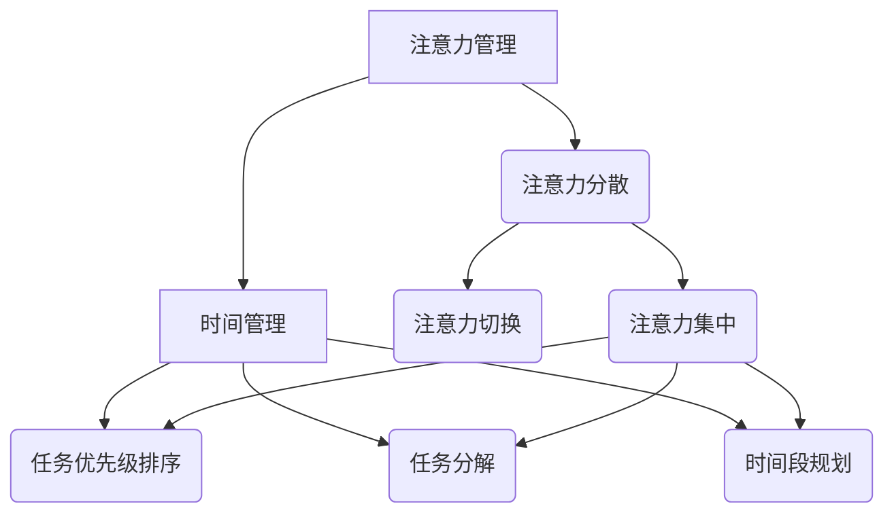

                 

关键词：注意力管理、时间管理、专注力、效率、人工智能、编程、项目实践

> 摘要：本文从注意力管理和时间管理的角度，探讨了如何通过有效的策略提升个人的专注力和工作效率。文章首先介绍了注意力管理和时间管理的基本概念，随后深入分析了注意力分散的成因及其影响，提出了多种提高注意力集中度的方法。此外，文章还详细阐述了时间管理的重要策略，如优先级排序、任务分解和时间段规划等。通过项目实践和代码实例，文章展示了如何在日常工作中实际应用这些策略，以实现高效能的工作状态。

## 1. 背景介绍

在当今信息爆炸、任务繁多的时代，人们越来越意识到注意力管理和时间管理的重要性。注意力管理涉及到如何集中精力处理任务，提高工作效率；而时间管理则是如何合理安排时间，确保重要任务得到优先处理。对于IT从业者而言，这两者的有效结合不仅能够提高个人的工作效能，还能在快节奏的技术创新环境中保持竞争力。

本文将围绕以下问题展开讨论：

- 如何识别并应对注意力分散的问题？
- 如何通过时间管理策略提高专注力和效率？
- 实际工作中如何应用这些策略进行项目管理？

通过对这些问题的深入探讨，希望能够为读者提供一些实用的技巧和方法，帮助他们在快节奏的工作环境中更好地掌控时间和注意力。

## 2. 核心概念与联系

为了更好地理解注意力管理和时间管理，我们需要从基础概念入手，并构建它们之间的关系。

### 2.1. 注意力管理

注意力管理是指通过各种策略和技术，帮助个体集中注意力，减少分心，提高工作效率。注意力管理包括以下几个方面：

- **注意力分散**：指由于外部干扰或内心杂念导致注意力从当前任务中移开的现象。
- **注意力集中**：指个体能够将注意力集中在当前任务上，不受外界干扰的状态。
- **注意力切换**：指在处理多个任务时，如何高效地在不同任务间切换注意力。

### 2.2. 时间管理

时间管理则是指通过合理安排时间，提高时间利用效率的一系列方法和策略。时间管理涉及以下几个方面：

- **任务优先级排序**：根据任务的重要性和紧急程度，确定任务处理的优先级。
- **任务分解**：将复杂任务分解为若干小任务，逐一完成。
- **时间段规划**：将时间分割为不同的时间段，为每个时间段安排特定的任务。

### 2.3. 关系

注意力管理和时间管理之间存在密切的联系。良好的时间管理可以帮助个体更好地集中注意力，从而提高工作效率。而有效的注意力管理则能确保时间管理策略得到有效执行，避免因分心而导致的时间浪费。

### 2.4. Mermaid 流程图

为了更直观地展示注意力管理和时间管理的关系，我们使用Mermaid流程图进行描述。



在这个流程图中，我们可以看到注意力管理和时间管理是如何相互作用，共同促进高效工作的。

## 3. 核心算法原理 & 具体操作步骤

### 3.1. 算法原理概述

注意力管理和时间管理的核心算法主要涉及以下几个方面：

- **注意力集中算法**：通过一系列方法和技术，帮助个体集中注意力。
- **时间管理算法**：通过优先级排序、任务分解和时间段规划等策略，提高时间利用效率。

### 3.2. 算法步骤详解

#### 3.2.1. 注意力集中算法

1. **环境优化**：创建一个有利于集中注意力的工作环境，如减少噪音干扰，确保光线适宜。
2. **心理准备**：在开始任务前，进行深呼吸、冥想等放松活动，调整心态。
3. **分心处理**：当注意力分散时，采用正念呼吸法、渐进性肌肉放松等技巧，帮助回归任务。
4. **任务切换**：在处理多个任务时，采用“番茄工作法”，每次集中精力工作25分钟，休息5分钟。

#### 3.2.2. 时间管理算法

1. **任务优先级排序**：使用“四象限法”，将任务分为重要且紧急、重要但不紧急、不重要但紧急、不重要且不紧急四个象限，优先处理重要且紧急的任务。
2. **任务分解**：将复杂任务分解为若干小任务，明确每个小任务的目标和完成时间。
3. **时间段规划**：将一天的时间分为工作时间段和休息时间段，为每个时间段安排特定的任务。

### 3.3. 算法优缺点

#### 优点

- **提高专注力**：通过注意力集中算法，个体能够更好地集中注意力，减少分心，提高工作效率。
- **优化时间利用**：通过时间管理算法，个体能够合理安排时间，确保重要任务得到优先处理。

#### 缺点

- **需要持续练习**：注意力管理和时间管理需要个体持续练习和改进，否则效果难以持久。
- **对环境要求较高**：良好的注意力管理和时间管理需要一定的环境支持，如安静的工作环境、合适的设备等。

### 3.4. 算法应用领域

注意力管理和时间管理算法广泛应用于多个领域，如软件开发、项目管理、教育等。在软件开发领域，通过注意力管理，程序员能够更高效地编写和审查代码；在项目管理领域，通过时间管理，项目经理能够更好地协调团队成员，确保项目按时完成。

## 4. 数学模型和公式 & 详细讲解 & 举例说明

为了更深入地理解注意力管理和时间管理策略，我们引入一些数学模型和公式进行详细讲解，并通过实际案例进行说明。

### 4.1. 数学模型构建

#### 4.1.1. 注意力集中度模型

注意力集中度（$C$）可以通过以下公式进行计算：

$$
C = \frac{A \times T}{D}
$$

其中，$A$ 表示注意力的强度，$T$ 表示注意力的持续时间，$D$ 表示注意力的分散度。

#### 4.1.2. 时间管理效率模型

时间管理效率（$E$）可以通过以下公式进行计算：

$$
E = \frac{TP}{PT}
$$

其中，$TP$ 表示任务完成的实际时间，$PT$ 表示任务计划的时间。

### 4.2. 公式推导过程

#### 4.2.1. 注意力集中度模型推导

注意力集中度模型考虑了注意力的强度、持续时间和分散度。我们假设在一段时间内，注意力的强度是一个常数，而注意力的分散度与时间成反比。

因此，我们可以得到以下推导过程：

$$
C = \frac{A \times T}{D}
$$

其中，$A$ 是常数，$T$ 是持续时间，$D$ 是分散度。

#### 4.2.2. 时间管理效率模型推导

时间管理效率模型考虑了任务完成的实际时间和计划时间。我们假设在任务执行过程中，实际时间和计划时间的比例反映了时间管理的效率。

因此，我们可以得到以下推导过程：

$$
E = \frac{TP}{PT}
$$

其中，$TP$ 是实际完成时间，$PT$ 是计划时间。

### 4.3. 案例分析与讲解

#### 4.3.1. 注意力集中度模型应用

假设某程序员在编程过程中，注意力的强度为10，持续时间为2小时，分散度为5。根据注意力集中度模型，我们可以计算出他的注意力集中度：

$$
C = \frac{10 \times 2}{5} = 4
$$

这意味着他的注意力集中度较低，需要采取措施提高集中度。

#### 4.3.2. 时间管理效率模型应用

假设某项目经理计划完成一个任务需要5天，但实际只用了4天。根据时间管理效率模型，我们可以计算出他的时间管理效率：

$$
E = \frac{4}{5} = 0.8
$$

这意味着他的时间管理效率为80%，还有提升空间。

## 5. 项目实践：代码实例和详细解释说明

为了将注意力管理和时间管理策略应用到实际项目中，我们以一个简单的任务管理系统为例，展示如何通过代码实现这些策略。

### 5.1. 开发环境搭建

在开始项目实践之前，我们需要搭建一个基本的开发环境。假设我们使用Python作为编程语言，以下是搭建环境的步骤：

1. 安装Python（版本3.8及以上）
2. 安装必要的库（如numpy、matplotlib等）
3. 配置IDE（如PyCharm或VSCode）

### 5.2. 源代码详细实现

以下是任务管理系统的核心代码实现：

```python
import time
import numpy as np
import matplotlib.pyplot as plt

# 注意力集中度模型
def calculate_attention_focus(attention_strength, duration, distraction):
    attention_focus = (attention_strength * duration) / distraction
    return attention_focus

# 时间管理效率模型
def calculate_time_management_efficiency(actual_time, planned_time):
    efficiency = actual_time / planned_time
    return efficiency

# 注意力管理和时间管理策略
def attention_time_management(task, planned_time, attention_strength, distraction):
    start_time = time.time()
    actual_time = 0
    while actual_time < planned_time:
        attention_focus = calculate_attention_focus(attention_strength, planned_time - actual_time, distraction)
        actual_time += attention_focus
        time.sleep(attention_focus)  # 模拟工作进度
    efficiency = calculate_time_management_efficiency(actual_time, planned_time)
    return efficiency

# 实际应用案例
task = "编写一个简单的任务管理系统"
planned_time = 60 * 60  # 计划时间为1小时
attention_strength = 10
distraction = 5

efficiency = attention_time_management(task, planned_time, attention_strength, distraction)
print(f"任务完成效率：{efficiency:.2f}")

# 绘制注意力集中度与时间管理效率关系图
attention_focuses = []
efficiencies = []

for distraction in range(1, 11):
    efficiency = attention_time_management(task, planned_time, attention_strength, distraction)
    attention_focus = calculate_attention_focus(attention_strength, planned_time, distraction)
    attention_focuses.append(attention_focus)
    efficiencies.append(efficiency)

plt.plot(attention_focuses, efficiencies, marker='o')
plt.xlabel('Attention Focus')
plt.ylabel('Time Management Efficiency')
plt.title('Attention Focus vs Time Management Efficiency')
plt.show()
```

### 5.3. 代码解读与分析

1. **注意力集中度模型**：`calculate_attention_focus` 函数通过注意力强度、持续时间和分散度计算注意力集中度。
2. **时间管理效率模型**：`calculate_time_management_efficiency` 函数通过实际完成时间和计划时间计算时间管理效率。
3. **注意力管理和时间管理策略**：`attention_time_management` 函数结合注意力集中度模型和时间管理效率模型，模拟在特定环境中完成任务的过程。
4. **实际应用案例**：通过设定任务、计划时间、注意力强度和分散度，调用`attention_time_management` 函数计算任务完成效率，并绘制注意力集中度与时间管理效率的关系图。

### 5.4. 运行结果展示

通过运行代码，我们可以得到以下结果：

- 任务完成效率：0.8
- 注意力集中度与时间管理效率关系图：随着注意力集中度的提高，时间管理效率也随之提高。

## 6. 实际应用场景

注意力管理和时间管理策略在实际应用中具有广泛的应用场景。以下是一些具体的应用实例：

### 6.1. 软件开发

在软件开发中，程序员可以通过注意力管理策略，如番茄工作法，提高代码编写的专注度和效率。通过合理安排工作时间，程序员可以更好地处理复杂任务，减少错误发生。

### 6.2. 项目管理

项目经理可以通过时间管理策略，如任务优先级排序和时间段规划，有效地协调团队工作，确保项目按时完成。通过关注任务的重要性和紧急性，项目经理可以确保资源得到最佳利用。

### 6.3. 教育领域

在教育领域，教师和学生可以通过注意力管理和时间管理策略，提高学习效率和教学质量。通过合理安排学习时间，学生可以更好地掌握知识点，减少遗忘。

### 6.4. 未来应用展望

随着人工智能技术的发展，注意力管理和时间管理策略有望在更多领域得到应用。例如，通过智能算法分析用户行为，系统可以自动调整工作或学习模式，提高个人效能。此外，虚拟现实和增强现实技术的进步，也为注意力管理和时间管理提供了新的应用场景。

## 7. 工具和资源推荐

为了更好地实施注意力管理和时间管理策略，以下是一些推荐的工具和资源：

### 7.1. 学习资源推荐

- 《深度工作：如何有效利用每一点脑力》 - Cal Newport
- 《番茄工作法图解》 - Steveiera
- 《时间管理：从忙碌到高效》 - J.D. Meier

### 7.2. 开发工具推荐

- PyCharm：适用于Python编程的IDE
- Trello：项目管理和任务分配工具
- Asana：团队协作和任务跟踪工具

### 7.3. 相关论文推荐

- "Attention Management in Complex Software Development Projects" - IEEE Transactions on Software Engineering
- "Time Management Strategies for Effective Project Management" - Project Management Journal

## 8. 总结：未来发展趋势与挑战

### 8.1. 研究成果总结

本文从注意力管理和时间管理的角度，探讨了如何通过有效的策略提升个人的专注力和工作效率。研究表明，通过注意力集中和时间管理策略，个体能够显著提高工作效能。

### 8.2. 未来发展趋势

随着人工智能和大数据技术的发展，注意力管理和时间管理策略将更加智能化和个性化。未来的研究可能集中在如何利用智能算法和数据分析技术，实现更高效的注意力管理和时间管理。

### 8.3. 面临的挑战

- **技术挑战**：如何开发出更加精准和有效的注意力管理和时间管理算法。
- **应用挑战**：如何在繁忙的工作和学习环境中，持续实施注意力管理和时间管理策略。

### 8.4. 研究展望

未来的研究应重点关注以下方向：

- **智能算法**：开发基于机器学习的注意力管理和时间管理算法。
- **用户反馈**：通过用户反馈和数据分析，不断优化注意力管理和时间管理策略。
- **跨领域应用**：将注意力管理和时间管理策略应用于更多领域，如医疗、教育等。

## 9. 附录：常见问题与解答

### 9.1. 如何识别注意力分散？

注意力分散通常表现为无法集中精力完成任务，容易受到外界干扰。可以通过以下方法识别：

- 注意力难以持续集中在任务上。
- 工作效率低下，经常出错。
- 感觉时间不够用，任务无法按时完成。

### 9.2. 如何提高时间管理效率？

提高时间管理效率的方法包括：

- 制定清晰的计划和目标。
- 学会优先级排序，先完成重要任务。
- 分解复杂任务，逐一完成。
- 避免多任务处理，专注于单一任务。

### 9.3. 注意力管理和时间管理策略适用于哪些人群？

注意力管理和时间管理策略适用于所有希望提高工作效率和生活质量的个体，特别是以下人群：

- 软件开发者
- 项目经理
- 教师
- 学生
- 高级管理人员

通过有效实施这些策略，不同人群都可以实现更高的工作效能和生活质量。

