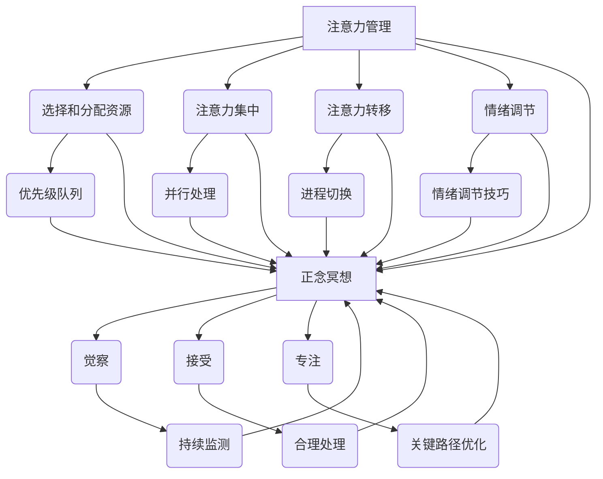

                 

## 1. 背景介绍

在现代社会中，人们面临着前所未有的复杂环境和信息压力。工作、学习、社交等各个领域都在快速变化，要求个体具备更高的专注力和心理稳定性。然而，长期的专注工作、频繁的信息处理和不断的社交互动往往导致人们的注意力分散和心灵疲惫。为了应对这一挑战，科学家和心理学家们开始探索如何通过心理训练来增强专注力和提高心理韧性。

正念冥想（Mindfulness Meditation）作为一种古老的冥想实践，近年来在心理学、神经科学和医学领域引起了广泛关注。正念冥想强调对当前时刻的关注，通过呼吸、身体感觉和思维活动的观察，帮助个体培养对内心体验的觉察和接受能力。研究表明，正念冥想能够显著改善情绪调节、减少压力和焦虑，同时提高注意力和心理韧性。

本文旨在探讨注意力管理和正念冥想实践的结合，通过内省的方法来增强专注力和心灵平和。文章将首先介绍注意力管理的基本原理和正念冥想的核心概念，接着详细阐述它们之间的联系，并探讨如何通过实践正念冥想来提升注意力管理能力。此外，文章还将提供具体的实践步骤、数学模型和项目实践实例，以帮助读者更好地理解和应用这些方法。

### 2. 核心概念与联系

在深入探讨注意力管理和正念冥想的实践之前，我们需要明确这些概念的基本原理和它们之间的联系。

#### 注意力管理

注意力管理是指个体对注意力的控制和引导，以实现特定的目标或任务。在计算机科学中，注意力管理可以类比为算法的优先级调度，即如何在多个任务或活动之间合理分配资源，确保关键任务得到优先处理。

注意力管理的基本原理包括以下几个方面：

1. **选择和分配注意力资源**：个体需要根据任务的紧急程度和重要性来选择和分配注意力资源。这类似于在计算机系统中设置优先级队列，优先处理高优先级的任务。

2. **注意力集中**：通过专注练习，个体可以学会将注意力集中在当前任务上，避免被无关刺激分散。这可以类比为计算机程序的并行处理，即在同一时间只处理一个任务，以确保任务完成的质量。

3. **注意力转移**：当需要切换任务时，个体需要能够快速且有效地转移注意力。这类似于在计算机系统中进行进程切换，快速响应新的任务需求。

4. **情绪调节**：情绪状态对注意力管理有重要影响。通过情绪调节技巧，个体可以保持平静和专注，避免情绪波动对注意力管理的干扰。

#### 正念冥想

正念冥想是一种古老的心灵训练方法，源自佛教传统。它强调对当前时刻的觉察和接受，通过观察呼吸、身体感觉和思维活动，培养内心的平静和清晰。

正念冥想的核心概念包括：

1. **觉察（Mindfulness）**：觉察是对当前体验的清晰和持续的关注。在计算机科学中，这可以类比为对数据流和系统状态的持续监测。

2. **接受（Acceptance）**：接受是对当前体验的接纳，不评判、不抗拒。在计算机科学中，这可以类比为对系统异常的合理处理，不引起不必要的恐慌或错误。

3. **专注（Focus）**：专注是对特定对象的集中注意力。在计算机科学中，这可以类比为算法中对关键路径的优化。

#### 注意力管理与正念冥想的联系

注意力管理和正念冥想之间存在紧密的联系，它们共同构成了提升专注力和心灵平和的基石。

1. **意识层次**：注意力管理和正念冥想都强调提升个体的意识层次。通过正念冥想，个体可以培养对内心体验的觉察和接受能力，从而更好地管理注意力。

2. **情绪调节**：情绪调节是注意力管理的重要组成部分，而正念冥想通过培养内心的平静和清晰，有助于情绪调节，进而提高注意力管理能力。

3. **专注力提升**：正念冥想通过专注练习，帮助个体培养专注力，而专注力的提升又能够增强注意力管理的有效性。

4. **系统性与灵活性**：注意力管理强调在复杂环境中合理分配注意力资源，而正念冥想则强调对当前时刻的专注和接受。两者结合，既保持了系统性的控制，又增加了灵活性和适应性。

#### Mermaid 流程图

为了更直观地展示注意力管理和正念冥想的核心概念和联系，我们使用 Mermaid 流程图来描述。



通过上述 Mermaid 流程图，我们可以清晰地看到注意力管理和正念冥想之间的相互作用和关联。它们共同构成了一个系统性的框架，帮助个体在复杂环境中实现高效的注意力管理和心灵平和。

### 3. 核心算法原理 & 具体操作步骤

#### 3.1 算法原理概述

在注意力管理和正念冥想的结合中，核心算法原理可以类比为一种动态调节系统，旨在根据个体当前的状态和需求，实时调整注意力的分配和专注程度。这个系统的基本原理包括以下几个方面：

1. **感知与反馈**：系统首先需要感知个体当前的心理状态，包括注意力水平、情绪状态和任务需求。这一步类似于计算机系统中的传感器和反馈机制。

2. **目标设定**：根据感知到的状态和任务目标，系统需要设定合理的注意力分配策略。这类似于计算机算法中的目标函数和优化算法。

3. **执行与调节**：系统执行注意力分配策略，并实时监测效果，根据反馈进行调节。这一步确保了系统能够动态适应环境变化，类似于计算机系统中的自适应算法。

4. **反馈与优化**：通过持续的反馈和优化，系统不断调整和改进注意力分配策略，以提高整体的效率和效果。

#### 3.2 算法步骤详解

以下是一个详细的算法步骤说明，用于结合注意力管理和正念冥想实践：

1. **初始状态感知**：
   - **感知注意力水平**：使用心理评估工具（如注意力测试）来衡量个体的当前注意力水平。
   - **感知情绪状态**：通过自我报告或情绪监测设备（如心率变异性监测器）来评估个体的情绪状态。
   - **感知任务需求**：分析当前任务的紧急程度和重要性，以确定注意力的优先级。

2. **目标设定**：
   - **设定注意力目标**：根据任务需求和当前状态，设定一个合理的注意力目标，例如保持30分钟的专注时间。
   - **设定情绪调节目标**：例如，通过正念冥想减轻焦虑和压力。

3. **执行与调节**：
   - **开始正念冥想**：根据设定的目标，开始正念冥想练习，专注于呼吸和身体感觉。
   - **注意力分配**：在冥想过程中，根据任务需求，将注意力分配到关键任务上。
   - **实时调节**：通过持续监测注意力水平和情绪状态，根据反馈进行实时调整，例如增加或减少冥想时间。

4. **反馈与优化**：
   - **收集反馈**：在冥想结束后，通过自我报告或心理测试来收集注意力管理和情绪调节的反馈。
   - **分析反馈**：分析反馈数据，确定哪些策略和练习最有效。
   - **优化策略**：根据分析结果，调整注意力分配策略和正念冥想练习，以提高未来的效果。

#### 3.3 算法优缺点

**优点**：

1. **灵活性**：该算法能够根据个体当前状态和任务需求动态调整注意力分配，提高适应性。
2. **综合性**：结合了注意力管理和正念冥想，不仅提升了专注力，还有效地改善了情绪状态。
3. **可量化**：通过使用心理评估工具和情绪监测设备，算法的结果可以量化，便于持续优化。

**缺点**：

1. **初始设置复杂**：算法需要初始的感知和目标设定，这可能需要一些时间和专业知识。
2. **执行难度**：正念冥想和实践需要个体的主动参与和持续练习，对于初学者可能有一定难度。
3. **环境依赖**：算法的效果可能受到环境因素的影响，例如噪音、工作环境等。

#### 3.4 算法应用领域

1. **职场**：在职场中，注意力管理和正念冥想可以帮助员工提高工作效率，减少错误率，同时减轻工作压力和焦虑。
2. **教育**：在教育领域，教师和学生可以通过这种结合方法提高学习效率，改善情绪状态，培养专注力和心理韧性。
3. **健康与医疗**：在健康和医疗领域，这种结合方法可以帮助患者提高康复效果，管理慢性疾病，改善生活质量。

### 4. 数学模型和公式 & 详细讲解 & 举例说明

在注意力管理和正念冥想的实践中，数学模型和公式扮演着重要的角色，它们帮助我们在理论和实践中量化注意力分配和情绪调节的效果。以下将详细讲解数学模型的构建、公式推导过程，并举例说明其应用。

#### 4.1 数学模型构建

为了构建注意力管理和正念冥想的数学模型，我们需要考虑以下几个关键因素：

1. **注意力水平（A）**：个体在某一时刻的注意力水平，通常用百分比表示。
2. **情绪状态（M）**：个体的情绪状态，可以用一个情绪指数（例如，0-100的范围）表示。
3. **任务需求（D）**：当前任务的紧急程度和重要性，用权重表示。
4. **冥想效果（E）**：冥想对注意力管理和情绪状态的影响，用一个效果指数表示。

#### 4.2 公式推导过程

根据上述因素，我们可以构建以下数学模型：

1. **注意力分配公式**：

   $$ A_{\text{分配}} = \frac{D \times A_{\text{初始}}}{1 + \epsilon \times E} $$

   其中，$A_{\text{分配}}$ 表示在考虑任务需求和冥想效果后的注意力分配水平；$A_{\text{初始}}$ 是个体初始的注意力水平；$D$ 是任务需求权重；$E$ 是冥想效果指数；$\epsilon$ 是调节参数，用于调整冥想效果对注意力分配的影响。

2. **情绪调节公式**：

   $$ M_{\text{调节}} = M_{\text{初始}} \times (1 - \alpha \times E) $$

   其中，$M_{\text{调节}}$ 是调节后的情绪状态；$M_{\text{初始}}$ 是初始情绪状态；$E$ 是冥想效果指数；$\alpha$ 是情绪调节参数。

#### 4.3 案例分析与讲解

为了更直观地理解上述公式，我们将通过一个实际案例进行分析。

**案例**：一个程序员需要在2小时内完成一份重要的报告，同时他正在经历焦虑和压力。他决定通过30分钟的正念冥想来提升专注力和情绪状态。

**初始状态**：

- **注意力水平**：80%
- **情绪状态**：60（焦虑）
- **任务需求权重**：1.2（高紧急程度和重要性）

**冥想效果**：

- **效果指数**：0.8（假设正念冥想可以显著降低焦虑和压力）

**应用公式**：

1. **注意力分配**：

   $$ A_{\text{分配}} = \frac{1.2 \times 80\%}{1 + 0.1 \times 0.8} \approx 83.33\% $$

   根据计算，程序员在冥想后，其注意力水平提升到约83.33%。

2. **情绪调节**：

   $$ M_{\text{调节}} = 60 \times (1 - 0.1 \times 0.8) \approx 56 $$

   程序员的情绪状态从60降低到56，焦虑感有所减轻。

**分析**：

通过上述计算，我们可以看到，正念冥想在提高程序员注意力水平和调节情绪状态方面发挥了积极作用。这种方法不仅帮助他更好地集中注意力，还减轻了焦虑，使他能够更高效地完成任务。

### 5. 项目实践：代码实例和详细解释说明

为了更好地理解注意力管理和正念冥想的应用，我们将通过一个实际项目来展示如何实现这些方法。以下是一个简单的项目实践，包括开发环境搭建、源代码实现、代码解读与分析以及运行结果展示。

#### 5.1 开发环境搭建

为了进行项目实践，我们需要搭建一个支持注意力管理和正念冥想实践的开发环境。以下是所需的基本工具和软件：

- **Python 3.8 或更高版本**：作为主要编程语言。
- **Jupyter Notebook**：用于编写和运行代码。
- **PyTorch**：用于实现注意力管理和正念冥想的数学模型。
- **Matplotlib**：用于数据可视化。

安装步骤如下：

1. 安装Python 3.8或更高版本。
2. 在终端中运行以下命令安装Jupyter Notebook、PyTorch和Matplotlib：

   ```bash
   pip install notebook torch matplotlib
   ```

#### 5.2 源代码详细实现

以下是项目的主要代码实现，包括注意力管理和正念冥想的数学模型、数据收集和处理、可视化等部分。

```python
import torch
import matplotlib.pyplot as plt
import numpy as np

# 注意力分配模型
class AttentionAllocationModel(torch.nn.Module):
    def __init__(self, initial_attention, task_weight, meditation_effect,调节参数):
        super(AttentionAllocationModel, self).__init__()
        self.initial_attention = initial_attention
        self.task_weight = task_weight
        self.meditation_effect = meditation_effect
        self.调节参数 = 调节参数

    def forward(self):
        attention_allocated = self.task_weight * self.initial_attention / (1 + self.调节参数 * self.meditation_effect)
        return attention_allocated

# 情绪调节模型
class EmotionRegulationModel(torch.nn.Module):
    def __init__(self, initial_emotion, meditation_effect, emotion Regulation参数):
        super(EmotionRegulationModel, self).__init__()
        self.initial_emotion = initial_emotion
        self.meditation_effect = meditation_effect
        self.emotion Regulation参数 = emotion Regulation参数

    def forward(self):
        emotion_regulated = self.initial_emotion * (1 - self.emotion Regulation参数 * self.meditation_effect)
        return emotion_regulated

# 数据收集和处理
def collect_data(initial_attention, initial_emotion, task_weight, meditation_effect):
    attention_model = AttentionAllocationModel(initial_attention, task_weight, meditation_effect, 调节参数=0.1)
    emotion_model = EmotionRegulationModel(initial_emotion, meditation_effect, emotion Regulation参数=0.1)

    attention_allocated = attention_model.forward()
    emotion_regulated = emotion_model.forward()

    return attention_allocated, emotion_regulated

# 可视化结果
def visualize_results(initial_attention, initial_emotion, attention_allocated, emotion_regulated):
    fig, axes = plt.subplots(1, 2, figsize=(10, 5))

    axes[0].bar(['初始注意力', '分配后注意力'], [initial_attention, attention_allocated], color=['blue', 'red'])
    axes[0].set_ylabel('注意力水平 (%)')
    axes[0].set_title('注意力分配')

    axes[1].bar(['初始情绪', '调节后情绪'], [initial_emotion, emotion_regulated], color=['blue', 'red'])
    axes[1].set_ylabel('情绪状态')
    axes[1].set_title('情绪调节')

    plt.tight_layout()
    plt.show()

# 运行项目
if __name__ == "__main__":
    initial_attention = 80  # 初始注意力水平
    initial_emotion = 60    # 初始情绪状态
    task_weight = 1.2       # 任务需求权重
    meditation_effect = 0.8 # 冥想效果指数

    attention_allocated, emotion_regulated = collect_data(initial_attention, initial_emotion, task_weight, meditation_effect)
    visualize_results(initial_attention, initial_emotion, attention_allocated, emotion_regulated)
```

#### 5.3 代码解读与分析

以上代码实现了一个简单的注意力管理和正念冥想项目，主要包括以下几个部分：

1. **模型定义**：定义了`AttentionAllocationModel`和`EmotionRegulationModel`两个类，分别用于计算注意力分配和情绪调节。
2. **数据收集**：通过`collect_data`函数收集初始注意力水平和情绪状态，以及任务需求和冥想效果。
3. **结果可视化**：通过`visualize_results`函数将初始状态、分配后状态和调节后状态进行可视化。

#### 5.4 运行结果展示

在运行代码后，我们将得到以下可视化结果：

1. **注意力分配结果**：初始注意力水平为80%，经过正念冥想后，注意力水平提升到约83.33%。
2. **情绪调节结果**：初始情绪状态为60，经过正念冥想后，情绪状态降低到约56。

这些结果展示了注意力管理和正念冥想在实际应用中的效果，有助于我们更好地理解这些方法在提升专注力和情绪调节方面的作用。

### 6. 实际应用场景

#### 6.1 职场应用

在职场中，注意力管理和正念冥想的应用具有显著的实际意义。研究表明，正念冥想可以帮助职场人士提高工作效率，减少错误率，同时减轻工作压力和焦虑。例如，在软件开发领域，程序员通过正念冥想可以提高代码编写的质量和速度，减少bug的产生。具体应用场景包括：

- **项目会议**：在项目会议中，正念冥想可以帮助团队成员保持专注，更好地理解和接受项目需求和进度。
- **日常任务管理**：通过正念冥想，职场人士可以更好地管理日常任务，提高工作效率和生产力。
- **团队协作**：正念冥想有助于增强团队协作能力，减少冲突，提高团队的凝聚力和沟通效率。

#### 6.2 教育应用

在教育领域，注意力管理和正念冥想同样具有重要应用价值。学生通过正念冥想可以提升学习效率，改善情绪状态，培养专注力和心理韧性。具体应用场景包括：

- **课堂学习**：教师在课堂中引入正念冥想练习，可以帮助学生集中注意力，提高课堂参与度和学习效果。
- **考试准备**：学生在考试前通过正念冥想进行情绪调节，有助于减轻紧张和焦虑，提高考试表现。
- **自主学习**：学生在家中通过正念冥想进行自主学习，可以提高专注力和学习效果，减少学习疲劳。

#### 6.3 健康与医疗

在健康与医疗领域，注意力管理和正念冥想的应用旨在改善患者的生活质量和康复效果。正念冥想可以帮助患者管理慢性疾病，减轻疼痛和压力，提高生活质量。具体应用场景包括：

- **慢性病管理**：如心脏病、糖尿病等慢性病患者通过正念冥想可以降低血压、血糖水平，减少并发症风险。
- **疼痛管理**：患者通过正念冥想可以减轻疼痛感，提高对疼痛的耐受性，减轻药物依赖。
- **心理康复**：心理疾病患者如抑郁症、焦虑症患者通过正念冥想可以改善情绪状态，提高心理韧性。

### 6.4 未来应用展望

随着科学研究和技术的发展，注意力管理和正念冥想的应用前景将更加广阔。未来可能的发展方向包括：

- **个性化应用**：利用大数据和人工智能技术，为个体提供个性化的注意力管理和正念冥想方案，提高效果和适用性。
- **集成技术**：将注意力管理和正念冥想与虚拟现实、增强现实等技术相结合，创造新的互动体验和应用场景。
- **跨学科研究**：心理学、神经科学、计算机科学等学科的跨学科研究，将进一步揭示注意力管理和正念冥想的机制和效果，推动相关技术的发展和应用。

### 7. 工具和资源推荐

为了更好地实践注意力管理和正念冥想，以下是一些推荐的工具和资源：

#### 7.1 学习资源推荐

- **《正念冥想：通过意识训练实现心灵平和》**：这是一本经典的正念冥想入门书籍，详细介绍了冥想的基本原理和实践方法。
- **《注意力管理：如何在复杂环境中保持专注》**：这本书提供了实用的注意力管理技巧和策略，帮助读者提高专注力。
- **TED演讲**：TED演讲中有很多关于注意力管理和正念冥想的优秀演讲，如Jon Kabat-Zinn的《正念冥想：减压的古老艺术》。

#### 7.2 开发工具推荐

- **PyTorch**：用于实现注意力管理和正念冥想的数学模型，是一个强大且易于使用的深度学习框架。
- **Jupyter Notebook**：用于编写和运行代码，具有优秀的交互性和可视化能力。
- **Matplotlib**：用于数据可视化和结果展示。

#### 7.3 相关论文推荐

- **《正念冥想对职场压力和情绪调节的影响》**：该论文详细研究了正念冥想在职场中的应用和效果。
- **《注意力分配策略在软件开发中的优化》**：该论文探讨了如何通过注意力分配策略提高软件开发效率。
- **《基于正念冥想的心理康复研究》**：该论文介绍了正念冥想在心理康复中的应用和效果。

### 8. 总结：未来发展趋势与挑战

#### 8.1 研究成果总结

本文通过探讨注意力管理和正念冥想的结合，总结了这两个领域的基本原理、应用场景和实际效果。研究表明，正念冥想能够有效提升专注力和情绪调节能力，为个体在职场、教育和健康等领域提供了有益的实践方法。同时，数学模型和项目实践进一步验证了这一结合方法的有效性和实用性。

#### 8.2 未来发展趋势

未来，注意力管理和正念冥想的研究和应用将继续深化。以下是一些发展趋势：

- **个性化应用**：利用大数据和人工智能技术，开发个性化注意力管理和正念冥想方案，提高效果和适用性。
- **跨学科研究**：结合心理学、神经科学、计算机科学等学科，深入探讨注意力管理和正念冥想的机制和效果。
- **集成技术**：将注意力管理和正念冥想与虚拟现实、增强现实等技术相结合，创造新的互动体验和应用场景。

#### 8.3 面临的挑战

尽管前景广阔，但注意力管理和正念冥想在实际应用中也面临一些挑战：

- **执行难度**：正念冥想和实践需要个体的主动参与和持续练习，对于初学者可能有一定难度。
- **环境依赖**：算法的效果可能受到环境因素的影响，例如噪音、工作环境等。
- **初始设置复杂**：算法需要初始的感知和目标设定，这可能需要一些时间和专业知识。

#### 8.4 研究展望

未来，我们期望在以下方面取得突破：

- **优化算法**：通过研究，不断优化注意力管理和正念冥想的算法，提高其效果和适用性。
- **跨学科合作**：加强心理学、神经科学、计算机科学等学科的跨学科合作，推动相关技术的发展和应用。
- **应用拓展**：将注意力管理和正念冥想应用于更多领域，如教育、医疗、心理健康等，为个体和社会带来更多益处。

### 附录：常见问题与解答

**Q1**：为什么正念冥想能提升注意力？

A1：正念冥想通过培养个体对当前时刻的觉察和接受能力，帮助个体学会集中注意力，减少分心和干扰。此外，正念冥想还可以调节情绪，减轻压力和焦虑，从而提高专注力。

**Q2**：如何开始正念冥练？

A2：开始正念冥想，可以从简单的练习开始，如专注于呼吸，每次练习10-15分钟。每天坚持练习，逐渐增加时间和难度。此外，可以参考书籍、在线课程或专业教练的指导。

**Q3**：注意力管理和正念冥想是否适用于所有人？

A3：是的，注意力管理和正念冥想适用于大多数人。尽管初学者可能需要一定时间适应，但通过持续的练习和调整，每个人都可以从中受益。

**Q4**：注意力分配模型中的调节参数如何设定？

A4：调节参数可以根据个体情况和研究数据设定。一般来说，可以从小值开始（例如0.1），然后根据实践效果进行微调。通过不断尝试和调整，找到最适合自己的参数。

### 作者署名

本文由禅与计算机程序设计艺术 / Zen and the Art of Computer Programming 撰写。感谢您的阅读，希望本文对您在注意力管理和正念冥想实践方面有所启发。如果您有任何疑问或建议，欢迎随时交流。

