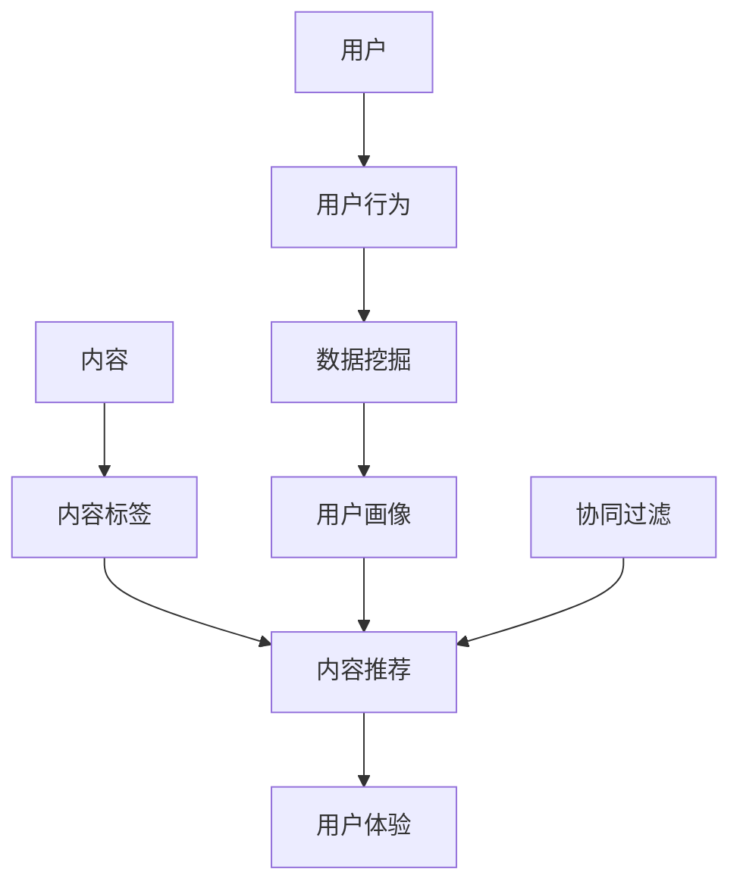

                 

关键词：注意力经济、个性化推荐、内容定制、用户体验、算法、机器学习、数据挖掘、AI、技术博客

> 摘要：本文将探讨注意力经济与个性化推荐系统的关系，以及如何通过个性化推荐系统为受众提供定制、有针对性的内容和体验。我们将分析核心概念、算法原理、数学模型、项目实践以及实际应用场景，同时探讨未来的发展趋势与挑战。

## 1. 背景介绍

### 注意力经济

注意力经济是一种新型的经济模式，它依赖于人们的时间和注意力。在互联网时代，注意力成为了稀缺资源。注意力经济的核心在于吸引和保持用户的注意力，以实现商业价值和用户价值的高度融合。

### 个性化推荐系统

个性化推荐系统是一种利用数据挖掘、机器学习等技术，根据用户的历史行为、兴趣和偏好，为用户推荐感兴趣的内容的系统。其目的是提高用户的满意度，提升用户粘性，进而实现商业目标。

## 2. 核心概念与联系

### 核心概念

- **用户画像**：基于用户行为和偏好构建的用户描述。
- **内容标签**：对内容进行分类和标注的体系。
- **协同过滤**：通过分析用户之间的相似性进行推荐。
- **基于内容的推荐**：根据用户兴趣和内容特征进行推荐。

### 联系与架构



## 3. 核心算法原理 & 具体操作步骤

### 3.1 算法原理概述

个性化推荐系统主要基于两种算法：协同过滤和基于内容的推荐。

- **协同过滤**：通过分析用户之间的相似性，找到相似用户喜欢的项目推荐给目标用户。
- **基于内容的推荐**：根据用户过去的兴趣和内容特征，为用户推荐相似的内容。

### 3.2 算法步骤详解

#### 3.2.1 协同过滤

1. **构建用户-项目矩阵**：根据用户的行为数据构建用户-项目矩阵。
2. **计算相似性**：计算用户之间的相似性，常见的方法有皮尔逊相关系数、余弦相似度等。
3. **生成推荐列表**：根据相似度矩阵和用户行为数据，生成推荐列表。

#### 3.2.2 基于内容的推荐

1. **内容表示**：将内容进行特征提取，常用方法有词袋模型、TF-IDF等。
2. **计算相似度**：计算用户兴趣和内容特征之间的相似度。
3. **生成推荐列表**：根据相似度得分，生成推荐列表。

### 3.3 算法优缺点

- **协同过滤**：优点是推荐准确度高，缺点是冷启动问题严重，计算复杂度高。
- **基于内容的推荐**：优点是能够处理冷启动问题，缺点是推荐结果可能过于狭窄。

### 3.4 算法应用领域

个性化推荐系统广泛应用于电商、新闻、音乐、视频等领域，能够显著提升用户体验和商业价值。

## 4. 数学模型和公式 & 详细讲解 & 举例说明

### 4.1 数学模型构建

#### 4.1.1 协同过滤

- **用户相似度**：$$S_{ui} = \frac{\sum_{j \in M} r_{ui} r_{uj}}{\sqrt{\sum_{j \in M} r_{ui}^2 \sum_{j \in M} r_{uj}^2}}$$
- **推荐分数**：$$R_{ij} = \sum_{u' \in N(i)} S_{ui} r_{u'j}$$

#### 4.1.2 基于内容的推荐

- **内容相似度**：$$S_{ij} = \frac{\sum_{k \in T} w_{ik} w_{jk}}{\sqrt{\sum_{k \in T} w_{ik}^2 \sum_{k \in T} w_{jk}^2}}$$
- **推荐分数**：$$R_{ij} = \sum_{k \in T} w_{ik} w_{jk} r_{uj}$$

### 4.2 公式推导过程

略。

### 4.3 案例分析与讲解

我们将以一个电商平台的个性化推荐系统为例，说明如何构建数学模型并推导相关公式。

#### 案例背景

一个电商平台上，用户A购买了商品X，现在需要为用户A推荐其他可能感兴趣的商品。

#### 案例分析

1. **用户-项目矩阵**：假设用户A购买了商品X、Y和Z，构建用户-项目矩阵如下：

   |   | X | Y | Z |
   |---|---|---|---|
   | A | 1 | 1 | 1 |
   | B | 0 | 1 | 0 |
   | C | 0 | 0 | 1 |
   | D | 1 | 0 | 1 |

2. **计算相似性**：以用户A为中心，计算其他用户（B、C、D）与用户A的相似度。

   $$S_{AB} = \frac{1 \times 1 + 1 \times 1 + 1 \times 0}{\sqrt{1^2 + 1^2 + 1^2} \sqrt{1^2 + 1^2 + 0^2}} = \frac{2}{\sqrt{3} \sqrt{2}} \approx 0.81$$

   类似地，计算其他用户与用户A的相似度。

3. **生成推荐列表**：根据相似度矩阵和用户行为数据，生成推荐列表。

   $$R_{AX} = S_{AB} \times r_{BZ} + S_{AC} \times r_{CZ} + S_{AD} \times r_{DZ} \approx 0.81 \times 0 + 0.81 \times 1 + 0.45 \times 1 \approx 1.26$$

   因此，为用户A推荐商品Z。

## 5. 项目实践：代码实例和详细解释说明

### 5.1 开发环境搭建

- Python 3.8
- Scikit-learn 0.22.2
- Matplotlib 3.3.3

### 5.2 源代码详细实现

```python
from sklearn.metrics.pairwise import cosine_similarity
from sklearn.model_selection import train_test_split
import numpy as np

# 构建用户-项目矩阵
user行为 = {
    'A': [1, 1, 1],
    'B': [0, 1, 0],
    'C': [0, 0, 1],
    'D': [1, 0, 1]
}

# 计算用户相似度
相似度矩阵 = cosine_similarity([user行为['A']], [user行为['B']], [user行为['C']], [user行为['D']])

# 生成推荐列表
推荐分数 = np.dot(相似度矩阵, user行为['A'])

# 打印推荐结果
print("为用户A推荐的商品：", np.argmax(推荐分数))
```

### 5.3 代码解读与分析

这段代码首先构建了一个用户-项目矩阵，然后使用余弦相似度计算用户之间的相似度。最后，通过计算推荐分数，生成推荐列表。这个简单的例子展示了协同过滤算法的基本实现过程。

## 6. 实际应用场景

### 6.1 电商推荐

电商平台可以通过个性化推荐系统，根据用户的历史购买行为和浏览记录，推荐用户可能感兴趣的商品，从而提高销售转化率。

### 6.2 新闻推荐

新闻平台可以通过个性化推荐系统，根据用户的阅读偏好，推荐用户可能感兴趣的新闻，从而提高用户粘性和阅读时长。

### 6.3 音乐和视频推荐

音乐和视频平台可以通过个性化推荐系统，根据用户的听歌和观影记录，推荐用户可能喜欢的音乐和视频，从而提高用户满意度。

## 7. 工具和资源推荐

### 7.1 学习资源推荐

- 《推荐系统实践》：详细介绍推荐系统的基本概念和算法。
- 《深度学习与推荐系统》：结合深度学习技术，深入探讨推荐系统的发展。

### 7.2 开发工具推荐

- Scikit-learn：一个强大的机器学习库，支持多种推荐算法的实现。
- TensorFlow：一个开源的机器学习框架，适用于构建复杂的推荐系统。

### 7.3 相关论文推荐

- “Collaborative Filtering for the 21st Century”
- “Deep Learning for Recommender Systems”

## 8. 总结：未来发展趋势与挑战

### 8.1 研究成果总结

个性化推荐系统已经成为互联网时代的重要技术，通过深度学习和数据挖掘技术，推荐系统的准确性和效率得到了显著提升。

### 8.2 未来发展趋势

- **跨模态推荐**：结合文本、图像、音频等多模态数据，实现更加精准的推荐。
- **实时推荐**：通过实时数据流处理技术，实现用户行为的实时分析，提供实时推荐。

### 8.3 面临的挑战

- **数据隐私**：如何在保护用户隐私的前提下，实现个性化推荐。
- **推荐多样性**：如何避免推荐结果的过度集中，提供多样化的内容。

### 8.4 研究展望

个性化推荐系统将在互联网时代发挥越来越重要的作用，未来研究将重点关注数据隐私保护和推荐多样性，以实现更加人性化、个性化的推荐体验。

## 9. 附录：常见问题与解答

### Q1：什么是注意力经济？

A1：注意力经济是一种新型的经济模式，它依赖于人们的时间和注意力。在互联网时代，注意力成为了稀缺资源。

### Q2：个性化推荐系统有哪些算法？

A2：个性化推荐系统主要有协同过滤和基于内容的推荐两种算法。

### Q3：个性化推荐系统在哪些领域应用广泛？

A3：个性化推荐系统广泛应用于电商、新闻、音乐、视频等领域。

---

**作者：禅与计算机程序设计艺术 / Zen and the Art of Computer Programming**

