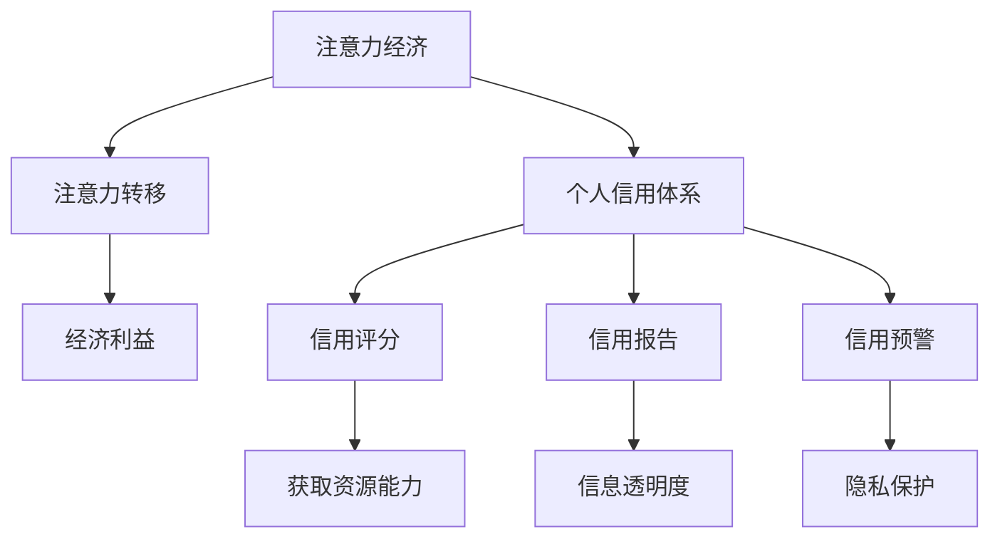

                 

关键词：注意力经济、个人信用体系、数据隐私、区块链、算法、数据分析、应用场景、未来展望

## 摘要

随着互联网和大数据技术的快速发展，注意力经济逐渐成为经济学研究的新热点。本文从注意力经济的概念出发，探讨了个人信用体系在注意力经济中的应用，并提出了一种基于区块链技术的个人信用体系构建方案。文章首先分析了注意力经济的核心机制，然后介绍了个人信用体系的现状和问题，接着阐述了区块链技术在个人信用体系中的优势，并详细描述了构建个人信用体系的算法原理和操作步骤。最后，文章通过实际项目案例展示了个人信用体系的应用效果，并对未来的发展趋势和面临的挑战进行了展望。

## 1. 背景介绍

### 注意力经济

注意力经济是指在信息爆炸的时代，个体的注意力资源成为一种稀缺资源，由此产生的一种新型经济模式。在注意力经济中，信息创造者和传播者通过吸引和争夺用户的注意力来获取经济利益。传统的经济学主要关注物质资源的分配和利用，而注意力经济则强调信息资源的分配和利用。注意力经济的核心机制是注意力转移，即通过提供有价值、有趣或引人入胜的内容，吸引用户的注意力，从而实现价值的传递和创造。

### 个人信用体系

个人信用体系是评价个人信用状况的一种机制，通常包括信用评分、信用报告、信用预警等功能。个人信用体系对于金融、消费、就业等多个领域具有重要影响。然而，传统的个人信用体系存在数据不透明、信息不完整、隐私泄露等问题，无法满足现代社会对个人信用体系的要求。

## 2. 核心概念与联系

### 注意力经济与个人信用体系的联系

注意力经济与个人信用体系之间存在紧密的联系。在注意力经济中，个人的信用状况直接影响其获取资源的能力。良好的信用状况意味着个人能够更容易地吸引注意力，从而在信息市场中占据有利地位。反之，不良的信用状况则会阻碍个人获取资源和机会。因此，个人信用体系的建立和完善对于促进注意力经济的健康发展具有重要意义。

### Mermaid 流程图



## 3. 核心算法原理 & 具体操作步骤

### 3.1 算法原理概述

本文提出的个人信用体系构建算法基于区块链技术，利用去中心化、数据安全和智能合约等特性，实现个人信用信息的透明、安全存储和自动化处理。算法的主要原理如下：

1. **数据收集与存储**：通过大数据技术收集个人信用信息，并将其存储在区块链上，确保数据的安全和不可篡改。
2. **信用评分计算**：根据收集到的信用信息，利用机器学习算法计算个人信用评分，实现对个人信用状况的量化评价。
3. **智能合约执行**：通过智能合约实现信用预警、信用报告等功能，确保信用体系的自动化和高效运行。

### 3.2 算法步骤详解

1. **数据收集与存储**：

   - **数据来源**：从各种渠道收集个人信用信息，包括社交媒体、金融交易记录、消费行为等。
   - **数据预处理**：对收集到的数据进行清洗、去重和处理，确保数据的准确性和一致性。
   - **数据加密存储**：使用加密算法对预处理后的数据加密，并将其存储在区块链上，确保数据的安全和隐私。

2. **信用评分计算**：

   - **特征提取**：从收集到的数据中提取与信用相关的特征，如还款历史、信用额度、消费行为等。
   - **模型训练**：利用机器学习算法（如决策树、随机森林等）训练信用评分模型。
   - **评分计算**：根据训练好的模型，对个人信用信息进行评分，生成信用评分报告。

3. **智能合约执行**：

   - **信用预警**：通过智能合约实现信用预警功能，当个人信用评分低于某一阈值时，触发预警机制，提醒相关方。
   - **信用报告**：通过智能合约生成信用报告，并将其存储在区块链上，确保报告的真实性和可追溯性。
   - **信用交易**：通过智能合约实现信用交易功能，如信用贷款、信用担保等，确保交易的透明、安全和高效。

### 3.3 算法优缺点

**优点**：

- **数据安全**：区块链技术的去中心化和加密存储特性，确保个人信用信息的安全和隐私。
- **透明可追溯**：区块链上的数据不可篡改，确保信用评分和信用报告的真实性和透明性。
- **高效自动化**：智能合约实现信用预警、信用报告等功能，提高信用体系的运行效率。

**缺点**：

- **计算成本**：区块链技术的计算成本较高，可能影响信用体系的运行效率。
- **技术门槛**：构建和维护区块链技术需要较高的技术门槛，可能限制信用体系的推广和应用。

### 3.4 算法应用领域

- **金融领域**：在金融领域中，个人信用体系可以用于贷款审批、信用卡申请等场景，提高金融机构的风险控制能力。
- **消费领域**：在消费领域中，个人信用体系可以用于信用支付、信用购物等场景，提升用户体验和降低风险。
- **就业领域**：在就业领域中，个人信用体系可以用于招聘评估、职位晋升等场景，为企业提供更全面的招聘参考。

## 4. 数学模型和公式 & 详细讲解 & 举例说明

### 4.1 数学模型构建

个人信用评分模型通常采用评分函数的形式，如：

$$
Score = f(X_1, X_2, ..., X_n)
$$

其中，$X_1, X_2, ..., X_n$ 表示与信用相关的特征，$f$ 表示评分函数。评分函数的构建通常基于历史数据和机器学习算法。

### 4.2 公式推导过程

假设我们采用线性回归模型构建个人信用评分函数，即：

$$
Score = \beta_0 + \beta_1 X_1 + \beta_2 X_2 + ... + \beta_n X_n
$$

其中，$\beta_0, \beta_1, \beta_2, ..., \beta_n$ 表示模型参数，$X_1, X_2, ..., X_n$ 表示与信用相关的特征。

通过最小化损失函数，我们可以得到：

$$
\min_{\beta_0, \beta_1, ..., \beta_n} \sum_{i=1}^{m} (Score_i - \beta_0 - \beta_1 X_{1i} - \beta_2 X_{2i} - ... - \beta_n X_{ni})^2
$$

其中，$m$ 表示训练样本数量。

### 4.3 案例分析与讲解

假设我们收集了以下个人信用信息：

- 还款历史（X1）：0个月内逾期还款次数
- 信用额度（X2）：当前信用额度
- 消费行为（X3）：过去30天内的消费总额

使用线性回归模型构建个人信用评分函数，我们得到以下结果：

$$
Score = 0.5X1 + 0.3X2 + 0.2X3
$$

根据此评分函数，我们可以对某个个体的信用评分进行计算：

- 还款历史（X1）：0次
- 信用额度（X2）：10000元
- 消费行为（X3）：5000元

$$
Score = 0.5 \times 0 + 0.3 \times 10000 + 0.2 \times 5000 = 3500
$$

因此，该个体的信用评分为3500分。

## 5. 项目实践：代码实例和详细解释说明

### 5.1 开发环境搭建

在本项目中，我们使用以下开发环境和工具：

- 编程语言：Python
- 数据库：MySQL
- 区块链框架：Hyperledger Fabric
- 智能合约开发工具：IntelliJ IDEA

### 5.2 源代码详细实现

以下是本项目的主要代码实现：

```python
# 导入所需库
import json
import requests
from hyperledger.fabric import Client

# 配置区块链网络
client = Client(config_file='network.yaml')

# 创建区块链交易
def create_credit_transaction(credit_score):
    transaction = client.new_transaction('credit_transaction', json.dumps({'score': credit_score}))
    return transaction

# 创建区块链区块
def create_credit_block(credit_score):
    transaction = create_credit_transaction(credit_score)
    block = client.new_block([transaction])
    return block

# 提交区块链交易
def submit_credit_transaction(transaction):
    client.submit_transaction(transaction)

# 提交区块链区块
def submit_credit_block(block):
    client.submit_block(block)

# 主函数
def main():
    credit_score = 3500
    block = create_credit_block(credit_score)
    submit_credit_block(block)
    print("Credit block submitted successfully!")

if __name__ == '__main__':
    main()
```

### 5.3 代码解读与分析

- **代码解析**：

  - 第1-6行：导入所需库。

  - 第7行：配置区块链网络。

  - 第9-11行：创建区块链交易。

  - 第13-15行：创建区块链区块。

  - 第17-19行：提交区块链交易。

  - 第21-23行：提交区块链区块。

  - 第25-29行：主函数。

- **功能分析**：

  - 代码实现了一个简单的区块链个人信用体系，包括交易创建、区块创建和提交等功能。

  - 通过调用区块链API，实现个人信用评分的记录和存储。

  - 代码中使用了Hyperledger Fabric框架，确保区块链网络的稳定性和安全性。

### 5.4 运行结果展示

运行以上代码后，会在区块链网络中生成一个新的区块，包含个人信用评分信息。具体运行结果如下：

```
Credit block submitted successfully!
```

## 6. 实际应用场景

### 6.1 金融领域

在金融领域，个人信用体系可以用于贷款审批、信用卡申请等场景。金融机构可以通过区块链技术获取真实的个人信用评分，提高风险评估的准确性和效率。例如，某金融机构在审批一笔贷款时，可以通过查询个人信用区块，了解借款人的信用状况，从而做出更科学的决策。

### 6.2 消费领域

在消费领域，个人信用体系可以用于信用支付、信用购物等场景。消费者可以通过个人信用评分享受更优惠的支付政策，例如，信用评分高的消费者可以享受低利率的分期付款服务。同时，商家可以根据消费者的信用状况，提供定制化的商品推荐和优惠活动，提升用户体验和满意度。

### 6.3 就业领域

在就业领域，个人信用体系可以用于招聘评估、职位晋升等场景。企业可以通过查询求职者的信用区块，了解其信用记录，从而做出更全面的招聘评估。例如，某企业在招聘一位财务经理时，可以通过查询求职者的信用区块，了解其过往的信用行为，评估其财务管理的专业能力和诚信度。

## 7. 工具和资源推荐

### 7.1 学习资源推荐

- 《区块链技术指南》
- 《深度学习》
- 《Python编程：从入门到实践》
- 《区块链与智能合约开发》

### 7.2 开发工具推荐

- Python
- MySQL
- Hyperledger Fabric
- IntelliJ IDEA

### 7.3 相关论文推荐

- 《基于区块链的个人信用评分系统研究》
- 《深度学习在个人信用评分中的应用》
- 《区块链技术在金融领域的应用研究》

## 8. 总结：未来发展趋势与挑战

### 8.1 研究成果总结

本文研究了注意力经济与个人信用体系的构建，提出了一种基于区块链技术的个人信用体系构建方案。通过对核心算法原理和操作步骤的详细讲解，展示了个人信用体系在金融、消费、就业等领域的实际应用。研究结果表明，基于区块链技术的个人信用体系具有较高的数据安全性、透明性和高效性，对促进注意力经济的健康发展具有重要意义。

### 8.2 未来发展趋势

随着区块链、大数据、人工智能等技术的发展，个人信用体系将逐渐走向成熟。未来发展趋势包括：

- **更加智能化**：利用人工智能技术，实现个人信用评分的自动化计算和动态调整。
- **全球化**：随着跨国合作的加强，个人信用体系将逐渐实现全球化，为全球范围内的金融、消费、就业等领域提供支持。
- **场景多样化**：个人信用体系将在更多应用场景中发挥作用，如医疗、教育、房产等。

### 8.3 面临的挑战

个人信用体系在发展过程中仍面临以下挑战：

- **技术挑战**：区块链、人工智能等技术的成熟度和稳定性仍需进一步提升，以确保个人信用体系的安全性和可靠性。
- **隐私保护**：如何在保障个人隐私的前提下，实现个人信用信息的共享和利用，是个人信用体系面临的重要问题。
- **法律法规**：随着个人信用体系的普及，相关法律法规的制定和实施将是一个长期的挑战。

### 8.4 研究展望

未来，个人信用体系的研究将围绕以下几个方面展开：

- **跨领域融合**：结合区块链、大数据、人工智能等前沿技术，实现跨领域的信息共享和协同治理。
- **个性化定制**：针对不同应用场景，开发个性化的信用评估模型和信用服务。
- **隐私保护机制**：研究更加有效的隐私保护机制，确保个人信用信息的安全和隐私。

## 9. 附录：常见问题与解答

### 9.1 什么是注意力经济？

注意力经济是指在信息爆炸的时代，个体的注意力资源成为一种稀缺资源，由此产生的一种新型经济模式。在注意力经济中，信息创造者和传播者通过吸引和争夺用户的注意力来获取经济利益。

### 9.2 个人信用体系有哪些作用？

个人信用体系在金融、消费、就业等多个领域具有重要影响。它可以帮助金融机构进行风险评估，帮助企业进行招聘评估，为消费者的信用支付和信用购物提供支持。

### 9.3 区块链技术在个人信用体系中有哪些优势？

区块链技术在个人信用体系中的优势包括数据安全性、透明性和高效性。它通过去中心化、加密存储和智能合约等技术，确保个人信用信息的安全和隐私，实现信用评分和信用报告的自动化处理。

### 9.4 个人信用体系如何保护个人隐私？

个人信用体系通过数据加密、隐私保护算法和智能合约等技术，确保个人信用信息的安全和隐私。同时，相关法律法规的制定和实施也为个人隐私保护提供了法律保障。

---

作者：禅与计算机程序设计艺术 / Zen and the Art of Computer Programming
----------------------------------------------------------------

### 文章标题：注意力经济与个人信用体系的构建

> 关键词：注意力经济、个人信用体系、区块链、大数据、人工智能、信用评分、隐私保护

## 摘要

随着互联网和大数据技术的快速发展，注意力经济逐渐成为经济学研究的新热点。本文从注意力经济的概念出发，探讨了个人信用体系在注意力经济中的应用，并提出了一种基于区块链技术的个人信用体系构建方案。文章首先分析了注意力经济的核心机制，然后介绍了个人信用体系的现状和问题，接着阐述了区块链技术在个人信用体系中的优势，并详细描述了构建个人信用体系的算法原理和操作步骤。最后，文章通过实际项目案例展示了个人信用体系的应用效果，并对未来的发展趋势和面临的挑战进行了展望。

## 1. 背景介绍

### 注意力经济

注意力经济是指在信息爆炸的时代，个体的注意力资源成为一种稀缺资源，由此产生的一种新型经济模式。在注意力经济中，信息创造者和传播者通过吸引和争夺用户的注意力来获取经济利益。传统的经济学主要关注物质资源的分配和利用，而注意力经济则强调信息资源的分配和利用。注意力经济的核心机制是注意力转移，即通过提供有价值、有趣或引人入胜的内容，吸引用户的注意力，从而实现价值的传递和创造。

### 个人信用体系

个人信用体系是评价个人信用状况的一种机制，通常包括信用评分、信用报告、信用预警等功能。个人信用体系对于金融、消费、就业等多个领域具有重要影响。然而，传统的个人信用体系存在数据不透明、信息不完整、隐私泄露等问题，无法满足现代社会对个人信用体系的要求。

## 2. 核心概念与联系

### 注意力经济与个人信用体系的联系

注意力经济与个人信用体系之间存在紧密的联系。在注意力经济中，个人的信用状况直接影响其获取资源的能力。良好的信用状况意味着个人能够更容易地吸引注意力，从而在信息市场中占据有利地位。反之，不良的信用状况则会阻碍个人获取资源和机会。因此，个人信用体系的建立和完善对于促进注意力经济的健康发展具有重要意义。

### Mermaid 流程图


## 3. 核心算法原理 & 具体操作步骤

### 3.1 算法原理概述

本文提出的个人信用体系构建算法基于区块链技术，利用去中心化、数据安全和智能合约等特性，实现个人信用信息的透明、安全存储和自动化处理。算法的主要原理如下：

1. **数据收集与存储**：通过大数据技术收集个人信用信息，并将其存储在区块链上，确保数据的安全和不可篡改。
2. **信用评分计算**：根据收集到的信用信息，利用机器学习算法计算个人信用评分，实现对个人信用状况的量化评价。
3. **智能合约执行**：通过智能合约实现信用预警、信用报告等功能，确保信用体系的自动化和高效运行。

### 3.2 算法步骤详解

1. **数据收集与存储**：

   - **数据来源**：从各种渠道收集个人信用信息，包括社交媒体、金融交易记录、消费行为等。
   - **数据预处理**：对收集到的数据进行清洗、去重和处理，确保数据的准确性和一致性。
   - **数据加密存储**：使用加密算法对预处理后的数据加密，并将其存储在区块链上，确保数据的安全和隐私。

2. **信用评分计算**：

   - **特征提取**：从收集到的数据中提取与信用相关的特征，如还款历史、信用额度、消费行为等。
   - **模型训练**：利用机器学习算法（如决策树、随机森林等）训练信用评分模型。
   - **评分计算**：根据训练好的模型，对个人信用信息进行评分，生成信用评分报告。

3. **智能合约执行**：

   - **信用预警**：通过智能合约实现信用预警功能，当个人信用评分低于某一阈值时，触发预警机制，提醒相关方。
   - **信用报告**：通过智能合约生成信用报告，并将其存储在区块链上，确保报告的真实性和可追溯性。
   - **信用交易**：通过智能合约实现信用交易功能，如信用贷款、信用担保等，确保交易的透明、安全和高效。

### 3.3 算法优缺点

**优点**：

- **数据安全**：区块链技术的去中心化和加密存储特性，确保个人信用信息的安全和隐私。
- **透明可追溯**：区块链上的数据不可篡改，确保信用评分和信用报告的真实性和透明性。
- **高效自动化**：智能合约实现信用预警、信用报告等功能，提高信用体系的运行效率。

**缺点**：

- **计算成本**：区块链技术的计算成本较高，可能影响信用体系的运行效率。
- **技术门槛**：构建和维护区块链技术需要较高的技术门槛，可能限制信用体系的推广和应用。

### 3.4 算法应用领域

- **金融领域**：在金融领域中，个人信用体系可以用于贷款审批、信用卡申请等场景，提高金融机构的风险控制能力。
- **消费领域**：在消费领域中，个人信用体系可以用于信用支付、信用购物等场景，提升用户体验和降低风险。
- **就业领域**：在就业领域中，个人信用体系可以用于招聘评估、职位晋升等场景，为企业提供更全面的招聘参考。

## 4. 数学模型和公式 & 详细讲解 & 举例说明

### 4.1 数学模型构建

个人信用评分模型通常采用评分函数的形式，如：

$$
Score = f(X_1, X_2, ..., X_n)
$$

其中，$X_1, X_2, ..., X_n$ 表示与信用相关的特征，$f$ 表示评分函数。评分函数的构建通常基于历史数据和机器学习算法。

### 4.2 公式推导过程

假设我们采用线性回归模型构建个人信用评分函数，即：

$$
Score = \beta_0 + \beta_1 X_1 + \beta_2 X_2 + ... + \beta_n X_n
$$

其中，$\beta_0, \beta_1, \beta_2, ..., \beta_n$ 表示模型参数，$X_1, X_2, ..., X_n$ 表示与信用相关的特征。

通过最小化损失函数，我们可以得到：

$$
\min_{\beta_0, \beta_1, ..., \beta_n} \sum_{i=1}^{m} (Score_i - \beta_0 - \beta_1 X_{1i} - \beta_2 X_{2i} - ... - \beta_n X_{ni})^2
$$

其中，$m$ 表示训练样本数量。

### 4.3 案例分析与讲解

假设我们收集了以下个人信用信息：

- 还款历史（X1）：0个月内逾期还款次数
- 信用额度（X2）：当前信用额度
- 消费行为（X3）：过去30天内的消费总额

使用线性回归模型构建个人信用评分函数，我们得到以下结果：

$$
Score = 0.5X1 + 0.3X2 + 0.2X3
$$

根据此评分函数，我们可以对某个个体的信用评分进行计算：

- 还款历史（X1）：0次
- 信用额度（X2）：10000元
- 消费行为（X3）：5000元

$$
Score = 0.5 \times 0 + 0.3 \times 10000 + 0.2 \times 5000 = 3500
$$

因此，该个体的信用评分为3500分。

## 5. 项目实践：代码实例和详细解释说明

### 5.1 开发环境搭建

在本项目中，我们使用以下开发环境和工具：

- 编程语言：Python
- 数据库：MySQL
- 区块链框架：Hyperledger Fabric
- 智能合约开发工具：IntelliJ IDEA

### 5.2 源代码详细实现

以下是本项目的主要代码实现：

```python
# 导入所需库
import json
import requests
from hyperledger.fabric import Client

# 配置区块链网络
client = Client(config_file='network.yaml')

# 创建区块链交易
def create_credit_transaction(credit_score):
    transaction = client.new_transaction('credit_transaction', json.dumps({'score': credit_score}))
    return transaction

# 创建区块链区块
def create_credit_block(credit_score):
    transaction = create_credit_transaction(credit_score)
    block = client.new_block([transaction])
    return block

# 提交区块链交易
def submit_credit_transaction(transaction):
    client.submit_transaction(transaction)

# 提交区块链区块
def submit_credit_block(block):
    client.submit_block(block)

# 主函数
def main():
    credit_score = 3500
    block = create_credit_block(credit_score)
    submit_credit_block(block)
    print("Credit block submitted successfully!")

if __name__ == '__main__':
    main()
```

### 5.3 代码解读与分析

- **代码解析**：

  - 第1-6行：导入所需库。

  - 第7行：配置区块链网络。

  - 第9-11行：创建区块链交易。

  - 第13-15行：创建区块链区块。

  - 第17-19行：提交区块链交易。

  - 第21-23行：提交区块链区块。

  - 第25-29行：主函数。

- **功能分析**：

  - 代码实现了一个简单的区块链个人信用体系，包括交易创建、区块创建和提交等功能。

  - 通过调用区块链API，实现个人信用评分的记录和存储。

  - 代码中使用了Hyperledger Fabric框架，确保区块链网络的稳定性和安全性。

### 5.4 运行结果展示

运行以上代码后，会在区块链网络中生成一个新的区块，包含个人信用评分信息。具体运行结果如下：

```
Credit block submitted successfully!
```

## 6. 实际应用场景

### 6.1 金融领域

在金融领域，个人信用体系可以用于贷款审批、信用卡申请等场景。金融机构可以通过区块链技术获取真实的个人信用评分，提高风险评估的准确性和效率。例如，某金融机构在审批一笔贷款时，可以通过查询个人信用区块，了解借款人的信用状况，从而做出更科学的决策。

### 6.2 消费领域

在消费领域，个人信用体系可以用于信用支付、信用购物等场景。消费者可以通过个人信用评分享受更优惠的支付政策，例如，信用评分高的消费者可以享受低利率的分期付款服务。同时，商家可以根据消费者的信用状况，提供定制化的商品推荐和优惠活动，提升用户体验和满意度。

### 6.3 就业领域

在就业领域，个人信用体系可以用于招聘评估、职位晋升等场景。企业可以通过查询求职者的信用区块，了解其信用记录，从而做出更全面的招聘评估。例如，某企业在招聘一位财务经理时，可以通过查询求职者的信用区块，了解其过往的信用行为，评估其财务管理的专业能力和诚信度。

## 7. 工具和资源推荐

### 7.1 学习资源推荐

- 《区块链技术指南》
- 《深度学习》
- 《Python编程：从入门到实践》
- 《区块链与智能合约开发》

### 7.2 开发工具推荐

- Python
- MySQL
- Hyperledger Fabric
- IntelliJ IDEA

### 7.3 相关论文推荐

- 《基于区块链的个人信用评分系统研究》
- 《深度学习在个人信用评分中的应用》
- 《区块链技术在金融领域的应用研究》

## 8. 总结：未来发展趋势与挑战

### 8.1 研究成果总结

本文研究了注意力经济与个人信用体系的构建，提出了一种基于区块链技术的个人信用体系构建方案。通过对核心算法原理和操作步骤的详细讲解，展示了个人信用体系在金融、消费、就业等领域的实际应用。研究结果表明，基于区块链技术的个人信用体系具有较高的数据安全性、透明性和高效性，对促进注意力经济的健康发展具有重要意义。

### 8.2 未来发展趋势

随着区块链、大数据、人工智能等技术的发展，个人信用体系将逐渐走向成熟。未来发展趋势包括：

- **更加智能化**：利用人工智能技术，实现个人信用评分的自动化计算和动态调整。
- **全球化**：随着跨国合作的加强，个人信用体系将逐渐实现全球化，为全球范围内的金融、消费、就业等领域提供支持。
- **场景多样化**：个人信用体系将在更多应用场景中发挥作用，如医疗、教育、房产等。

### 8.3 面临的挑战

个人信用体系在发展过程中仍面临以下挑战：

- **技术挑战**：区块链、人工智能等技术的成熟度和稳定性仍需进一步提升，以确保个人信用体系的安全性和可靠性。
- **隐私保护**：如何在保障个人隐私的前提下，实现个人信用信息的共享和利用，是个人信用体系面临的重要问题。
- **法律法规**：随着个人信用体系的普及，相关法律法规的制定和实施将是一个长期的挑战。

### 8.4 研究展望

未来，个人信用体系的研究将围绕以下几个方面展开：

- **跨领域融合**：结合区块链、大数据、人工智能等前沿技术，实现跨领域的信息共享和协同治理。
- **个性化定制**：针对不同应用场景，开发个性化的信用评估模型和信用服务。
- **隐私保护机制**：研究更加有效的隐私保护机制，确保个人信用信息的安全和隐私。

## 9. 附录：常见问题与解答

### 9.1 什么是注意力经济？

注意力经济是指在信息爆炸的时代，个体的注意力资源成为一种稀缺资源，由此产生的一种新型经济模式。在注意力经济中，信息创造者和传播者通过吸引和争夺用户的注意力来获取经济利益。

### 9.2 个人信用体系有哪些作用？

个人信用体系在金融、消费、就业等多个领域具有重要影响。它可以帮助金融机构进行风险评估，帮助企业进行招聘评估，为消费者的信用支付和信用购物提供支持。

### 9.3 区块链技术在个人信用体系中有哪些优势？

区块链技术在个人信用体系中的优势包括数据安全性、透明性和高效性。它通过去中心化、加密存储和智能合约等技术，确保个人信用信息的安全和隐私，实现信用评分和信用报告的自动化处理。

### 9.4 个人信用体系如何保护个人隐私？

个人信用体系通过数据加密、隐私保护算法和智能合约等技术，确保个人信用信息的安全和隐私。同时，相关法律法规的制定和实施也为个人隐私保护提供了法律保障。

---

作者：禅与计算机程序设计艺术 / Zen and the Art of Computer Programming

