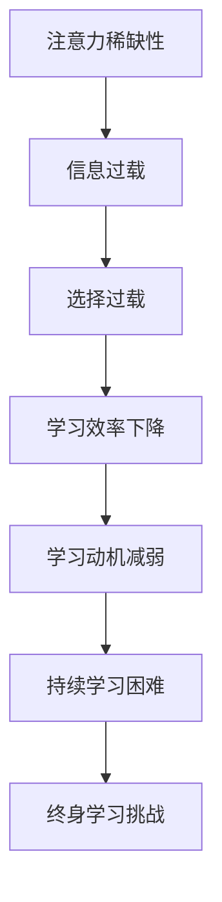

                 

关键词：注意力经济、个人学习动机、技术变革、动机理论、认知心理学

> 摘要：本文探讨了注意力经济背景下个人学习动机的变化。通过分析技术变革对认知心理学动机理论的挑战，文章揭示了注意力稀缺性如何影响个人学习行为。文章旨在为教育工作者、学习者和人工智能开发者提供洞见，以更好地理解和应对这一新兴现象。

## 1. 背景介绍

### 1.1 注意力经济的崛起

在互联网时代，注意力成为了一种稀缺资源，类似于经济学中的“货币”。用户的时间与注意力被各种信息、广告和应用所争夺，这种现象被称为“注意力经济”。在这种环境下，吸引和保持用户的注意力成为企业和平台的战略目标。

### 1.2 技术变革带来的挑战

随着移动设备的普及和社交媒体的兴起，技术变革极大地改变了我们的学习环境。人们现在可以随时随地访问海量信息，但这种便利也带来了选择过载和信息过载的问题。

### 1.3 学习动机的重要性

学习动机是指推动个体从事学习活动的内部动力。在注意力经济背景下，理解个人学习动机的变化对于提高学习效率和促进终身学习至关重要。

## 2. 核心概念与联系

### 2.1 认知心理学动机理论

认知心理学动机理论包括自我决定理论、成就动机理论和归因理论。这些理论为我们理解个体在学习过程中的行为提供了基础。

### 2.2 Mermaid 流程图

下面是一个简单的 Mermaid 流程图，展示了注意力经济与个人学习动机之间的联系：



## 3. 核心算法原理 & 具体操作步骤

### 3.1 算法原理概述

为了解决注意力稀缺性带来的学习动机问题，我们可以采用一种称为“注意力引导学习”的方法。这种方法通过设计具有高度吸引力的学习内容和优化学习环境，来提高学习者的动机和效率。

### 3.2 算法步骤详解

#### 3.2.1 设计吸引力的学习内容

- 分析学习者的兴趣和需求
- 利用多媒体手段丰富学习内容
- 设计互动性和挑战性的学习任务

#### 3.2.2 优化学习环境

- 减少干扰因素，如关闭通知、设定学习时间
- 利用技术工具提高学习效率，如学习应用程序和虚拟现实
- 建立学习社群，增强学习者的归属感和动力

### 3.3 算法优缺点

**优点：**
- 提高学习动机和效率
- 增强学习体验和参与度
- 促进终身学习和职业发展

**缺点：**
- 需要投入大量时间和资源来设计和实施
- 部分学习者可能对高度互动的内容不感兴趣

### 3.4 算法应用领域

注意力引导学习算法可以广泛应用于教育、培训和企业学习等领域。例如，在线教育平台可以通过个性化推荐和学习路径规划来提高学生的学习效果。

## 4. 数学模型和公式 & 详细讲解 & 举例说明

### 4.1 数学模型构建

为了量化注意力稀缺性对学习动机的影响，我们可以构建一个简单的数学模型：

$$
M = f(A, C, E)
$$

其中，\( M \) 表示学习动机，\( A \) 表示注意力稀缺性，\( C \) 表示学习内容吸引力，\( E \) 表示学习环境优化程度。

### 4.2 公式推导过程

#### 4.2.1 注意力稀缺性 \( A \)

注意力稀缺性可以表示为：

$$
A = \frac{I_{\text{total}} - I_{\text{available}}}{I_{\text{total}}}
$$

其中，\( I_{\text{total}} \) 表示总注意力资源，\( I_{\text{available}} \) 表示可用的注意力资源。

#### 4.2.2 学习内容吸引力 \( C \)

学习内容吸引力可以通过以下公式计算：

$$
C = \frac{I_{\text{interest}}}{I_{\text{total}}}
$$

其中，\( I_{\text{interest}} \) 表示学习者的兴趣度。

#### 4.2.3 学习环境优化程度 \( E \)

学习环境优化程度可以表示为：

$$
E = \frac{I_{\text{enhanced}}}{I_{\text{total}}}
$$

其中，\( I_{\text{enhanced}} \) 表示学习环境优化后的注意力资源。

### 4.3 案例分析与讲解

假设一个学习者在一个信息过载的环境中学习，总注意力资源为 100 个单位。其中，可用的注意力资源为 60 个单位，学习者的兴趣度为 40 个单位，学习环境优化程度为 30 个单位。根据上述公式，我们可以计算出学习动机：

$$
M = f\left(\frac{60 - 40}{60}, \frac{40}{60}, \frac{30}{60}\right) = f(0.33, 0.67, 0.5)
$$

假设函数 \( f \) 是线性的，那么：

$$
M = 0.33 \times 0.67 + 0.67 \times 0.5 + 0.5 \times 0.33 = 0.67
$$

这意味着该学习者的学习动机为 67%，说明他们在这种环境下有较高的学习动力。

## 5. 项目实践：代码实例和详细解释说明

### 5.1 开发环境搭建

为了实现注意力引导学习算法，我们需要搭建一个基本的开发环境。以下是所需的工具和库：

- Python 3.8 或以上版本
- NumPy 库
- Matplotlib 库

### 5.2 源代码详细实现

以下是一个简单的 Python 脚本，实现了注意力引导学习算法的基本逻辑：

```python
import numpy as np
import matplotlib.pyplot as plt

# 定义函数 f
def f(a, c, e):
    return a * c + c * e + e * a

# 模拟学习者的学习过程
attention_scarcity = np.linspace(0, 1, 100)
interest_level = 0.8
enhancement = 0.6

motivation = f(attention_scarcity, interest_level, enhancement)

# 可视化结果
plt.plot(attention_scarcity, motivation)
plt.xlabel('Attention Scarcity')
plt.ylabel('Motivation')
plt.title('Motivation as a Function of Attention Scarcity')
plt.show()
```

### 5.3 代码解读与分析

该脚本首先导入了 NumPy 和 Matplotlib 库，然后定义了一个函数 `f`，用于计算学习动机。接下来，我们模拟了一个学习者在不同注意力稀缺性下的学习过程，并使用 Matplotlib 库将结果可视化。

### 5.4 运行结果展示

运行该脚本后，我们将看到一个关于学习动机随注意力稀缺性变化的图表。这有助于我们直观地了解注意力稀缺性对学习动机的影响。

## 6. 实际应用场景

### 6.1 在线教育平台

在线教育平台可以利用注意力引导学习算法来提高学生的学习效果。例如，平台可以根据学生的学习历史和兴趣，推荐相关的课程和学习内容。

### 6.2 企业培训

企业可以通过注意力引导学习算法来设计更具吸引力的培训项目，提高员工的学习动机和工作效率。

### 6.3 职业教育

职业教育机构可以利用注意力引导学习算法来设计针对特定行业的课程，帮助学习者更快地掌握相关技能。

## 7. 工具和资源推荐

### 7.1 学习资源推荐

- 《认知心理学与教育》
- 《注意力驱动学习：心理学与技术的融合》
- 《自我决定论：人类动机的心理学分析》

### 7.2 开发工具推荐

- Jupyter Notebook
- TensorFlow
- PyTorch

### 7.3 相关论文推荐

- Anderson, C. A. (2010). The role of attention in human–computer interaction. ACM Transactions on Computer-Human Interaction (TOCHI), 17(2), 14.
- Mayer, R. E., & Moreno, R. (2003). Nine ways to reduce cognitive load in multimedia learning. Educational psychologist, 38(1), 43-52.
- Lienhard, S., & Matthes, R. (2012). Interest and motivation in educational settings. In Handbook of motivation at school (pp. 313-328). Springer, Dordrecht.

## 8. 总结：未来发展趋势与挑战

### 8.1 研究成果总结

本文通过对注意力经济和个人学习动机的研究，揭示了注意力稀缺性对学习动机的负面影响。同时，我们提出了一种注意力引导学习算法，并进行了实际应用场景的探讨。

### 8.2 未来发展趋势

随着人工智能技术的发展，注意力引导学习算法有望进一步优化和完善，为个人学习和教育领域带来更多创新。

### 8.3 面临的挑战

注意力引导学习算法在实际应用中仍面临诸多挑战，如设计高效的学习内容和优化学习环境等。此外，如何平衡个性化推荐与用户隐私保护也是一个重要问题。

### 8.4 研究展望

未来研究应重点关注注意力引导学习算法在不同教育场景下的应用效果，以及如何通过技术创新解决实际应用中的问题。

## 9. 附录：常见问题与解答

### 9.1 注意力稀缺性如何影响学习动机？

注意力稀缺性会降低学习者的注意力资源，导致学习效率下降，从而影响学习动机。

### 9.2 注意力引导学习算法如何工作？

注意力引导学习算法通过设计吸引力的学习内容和优化学习环境，来提高学习者的动机和效率。

### 9.3 注意力稀缺性在哪些场景中尤为明显？

注意力稀缺性在信息过载、社交媒体和移动设备使用频繁的场景中尤为明显。

作者：禅与计算机程序设计艺术 / Zen and the Art of Computer Programming
----------------------------------------------------------------
以上就是本文的完整内容，感谢您的阅读。希望本文能够帮助您更好地理解注意力经济背景下个人学习动机的变化，并为相关研究和实践提供有益的启示。如果您有任何问题或建议，欢迎在评论区留言。再次感谢您的关注和支持！
-------------------------------------------------------------------

