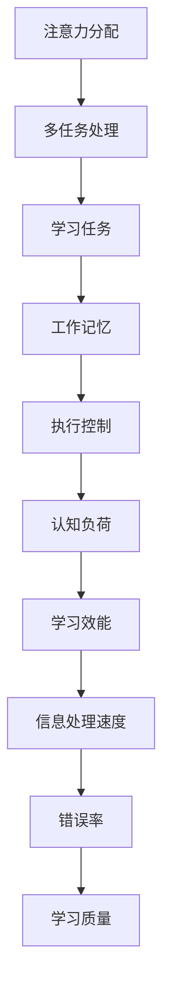

                 

关键词：注意力经济、学习效能、认知心理学、信息过滤、技术工具、教育技术、人机交互、学习策略

> 摘要：本文旨在探讨注意力经济对个人学习效能的影响，并结合认知心理学的相关理论，分析如何通过优化注意力管理、应用技术工具以及制定有效的学习策略，来提升个人学习效能。文章将结合具体案例，展示如何在实际学习过程中应用这些理论和方法，以及未来的研究方向。

## 1. 背景介绍

在当今信息爆炸的时代，个人获取和处理信息的速度远超过以往。然而，随着信息量的激增，人们面临的信息过载问题也日益严重。在这种情况下，注意力成为了一种稀缺资源。注意力经济（Attention Economy）这一概念由此产生，它是指人们对于信息内容的关注度和参与度直接影响信息传播效果和商业价值的一种经济模式。

与此同时，个人学习效能的提升成为一个备受关注的话题。学习效能不仅关系到个人的职业发展，还影响其生活质量。如何提高学习效能，使学习过程更加高效和愉悦，是当前教育研究和实践中的一大挑战。

本文将结合注意力经济和认知心理学理论，探讨注意力经济对个人学习效能的影响，并提出一系列提升学习效能的策略和方法。

### 注意力经济

注意力经济最初由美国作家Tiago Peixoto于2006年提出，他指出，在信息时代，人们的注意力成为了最宝贵的资源。信息的传播者和接收者在争夺用户注意力的过程中，产生了经济价值。例如，社交媒体平台通过吸引用户的注意力来提高广告点击率，从而实现盈利。类似地，内容创作者通过提供有价值的内容吸引观众，以获得关注和收益。

### 个人学习效能

个人学习效能是指个体在特定时间内，通过学习活动所获得的知识、技能和态度的总量。学习效能不仅取决于个体的学习能力，还受到学习环境、学习策略和学习资源的支持。提升学习效能，意味着更有效地利用有限的时间和资源，实现个人知识和技能的提升。

## 2. 核心概念与联系

### 注意力分配理论

注意力分配理论（Attention Allocation Theory）是认知心理学中关于注意力资源如何在不同任务之间分配的重要理论。根据这一理论，人类的注意力资源是有限的，因此，在多任务环境中，个体需要在不同的任务之间进行权衡和分配。

### 折射率模型

折射率模型（Refraction Model）是由心理学家Mehdi Jazayeri和John Pearson于2010年提出的。该模型描述了大脑如何根据当前任务的复杂性和重要性动态调整注意力分配。在复杂或重要的任务上，大脑会分配更多的注意力资源，从而提高任务完成质量。

### Mermaid 流程图



### 核心概念原理与架构

1. **注意力分配**：个体如何在不同任务之间分配注意力资源。
2. **多任务处理**：在同时处理多个任务时，如何有效管理注意力。
3. **学习任务**：学习过程中，个体如何专注于特定学习内容。
4. **工作记忆**：在处理信息时，临时存储和操作信息的能力。
5. **执行控制**：个体在任务中保持注意力的能力。
6. **认知负荷**：大脑处理信息时的负担，影响学习效能。
7. **学习效能**：通过学习活动所获得的知识、技能和态度的总量。

## 3. 核心算法原理 & 具体操作步骤

### 3.1 算法原理概述

提升学习效能的核心算法原理在于优化注意力分配，减少认知负荷，并提高学习策略的执行效率。具体而言，算法包括以下几个步骤：

1. **注意力优化**：通过认知训练和专注力练习，提高个体在多任务环境下的注意力分配能力。
2. **信息过滤**：应用信息过滤技术，减少无关信息的干扰，提高学习效率。
3. **认知负荷管理**：通过合理安排学习任务和时间，避免认知负荷过高，确保学习效能。
4. **学习策略调整**：根据个体特点和任务需求，制定个性化的学习策略，提高学习效果。

### 3.2 算法步骤详解

1. **步骤1：注意力优化**
   - **训练方法**：进行专注力训练，如冥想、专注力游戏等。
   - **训练目标**：提高个体在多任务环境下的注意力分配能力。

2. **步骤2：信息过滤**
   - **技术手段**：利用过滤器技术，如人工筛选、机器学习算法等。
   - **过滤目标**：减少无关信息的干扰，提高学习效率。

3. **步骤3：认知负荷管理**
   - **时间安排**：合理安排学习任务和时间，避免长时间连续学习。
   - **任务分配**：根据个体能力和任务难度，合理分配学习任务。

4. **步骤4：学习策略调整**
   - **策略制定**：根据个体特点和任务需求，制定个性化学习策略。
   - **策略执行**：定期评估学习效果，调整学习策略。

### 3.3 算法优缺点

**优点**：
- **提高学习效率**：通过优化注意力分配和信息过滤，减少无关信息的干扰，提高学习效率。
- **个性化策略**：根据个体特点和任务需求，制定个性化的学习策略，提高学习效果。

**缺点**：
- **训练成本**：需要进行专注力训练和策略调整，可能需要较长时间和精力。
- **实施难度**：需要个体具备一定的自我管理和学习能力，对于一些缺乏自律能力的人来说可能较难执行。

### 3.4 算法应用领域

**教育领域**：在教育中，算法可以应用于个性化学习方案的制定，提高学生的学习效率和效果。
**职业培训**：在职业培训中，算法可以用于提高员工的学习效能，提升工作效率。
**健康与心理**：在健康和心理领域，算法可以用于注意力管理训练，改善个体的心理健康状况。

## 4. 数学模型和公式 & 详细讲解 & 举例说明

### 4.1 数学模型构建

提升学习效能的数学模型主要涉及以下几个方面：

1. **认知负荷模型**：描述大脑在处理信息时的负担。
2. **注意力分配模型**：描述个体在不同任务之间的注意力分配策略。
3. **学习效能模型**：描述个体学习效果与认知负荷、注意力分配之间的关系。

### 4.2 公式推导过程

1. **认知负荷模型**：

   $$\text{认知负荷} = f(\text{任务难度}, \text{任务数量}, \text{个体能力})$$

   其中，任务难度和任务数量是影响认知负荷的主要因素，个体能力则反映了个体处理信息的能力。

2. **注意力分配模型**：

   $$\text{注意力分配} = f(\text{任务优先级}, \text{个体专注力}, \text{环境干扰})$$

   其中，任务优先级反映了个体在多任务环境下的注意力分配策略，个体专注力和环境干扰则影响了注意力的实际分配效果。

3. **学习效能模型**：

   $$\text{学习效能} = f(\text{认知负荷}, \text{注意力分配}, \text{学习策略})$$

   其中，认知负荷和注意力分配共同影响了学习效果，而学习策略则对学习效能进行了优化。

### 4.3 案例分析与讲解

**案例1：学生小明**

小明是一名高中生，他每天需要完成大量的作业和复习任务。然而，由于信息过载和注意力分散，他的学习效率较低，成绩也不理想。

**解决方案**：

1. **认知负荷管理**：

   小明可以通过合理安排学习任务和时间，避免长时间连续学习，从而减少认知负荷。

   $$\text{认知负荷} = f(\text{学习时间}, \text{任务数量}, \text{休息时间})$$

   例如，小明可以将每天的学习时间分为四个部分，每个部分学习1.5小时，中间休息15分钟。

2. **注意力分配优化**：

   小明可以通过专注力训练，如冥想和专注力游戏，提高在多任务环境下的注意力分配能力。

   $$\text{注意力分配} = f(\text{专注力训练时间}, \text{任务难度}, \text{个体专注力})$$

   例如，小明每天可以安排30分钟的专注力训练时间，以提高学习效率。

3. **学习策略调整**：

   小明可以根据个人特点和任务需求，制定个性化的学习策略，如采用分块学习法、主动回忆法等。

   $$\text{学习效能} = f(\text{认知负荷}, \text{注意力分配}, \text{学习策略})$$

   例如，小明可以采用分块学习法，将复杂的知识点分解成小块，逐一攻克。

**案例2：职场人士小张**

小张是一名职场人士，他需要在工作中处理大量的信息，并且需要参与多个项目。然而，由于信息过载和注意力分散，他的工作效率较低，工作压力较大。

**解决方案**：

1. **信息过滤**：

   小张可以通过信息过滤技术，如邮件筛选和社交媒体过滤器，减少无关信息的干扰。

   $$\text{信息过滤效果} = f(\text{过滤器设置}, \text{信息数量}, \text{个体需求})$$

   例如，小张可以设置邮件过滤器，只接收重要邮件，从而减少干扰。

2. **注意力优化**：

   小张可以通过专注力训练，如冥想和专注力游戏，提高在多任务环境下的注意力分配能力。

   $$\text{注意力分配} = f(\text{专注力训练时间}, \text{任务难度}, \text{个体专注力})$$

   例如，小张每天可以安排30分钟的专注力训练时间，以提高工作效率。

3. **学习策略调整**：

   小张可以根据个人特点和任务需求，制定个性化的学习策略，如采用任务分解法和时间管理法。

   $$\text{学习效能} = f(\text{认知负荷}, \text{注意力分配}, \text{学习策略})$$

   例如，小张可以采用任务分解法，将复杂的工作任务分解成小步骤，逐一完成。

## 5. 项目实践：代码实例和详细解释说明

### 5.1 开发环境搭建

为了实现注意力经济与个人学习效能的提升，我们需要搭建一个基于Python的注意力优化系统。以下是搭建开发环境的基本步骤：

1. **安装Python**：确保安装了Python 3.8及以上版本。
2. **安装Jupyter Notebook**：用于编写和运行Python代码。
3. **安装相关库**：如NumPy、Pandas、Matplotlib等。

```bash
pip install numpy pandas matplotlib
```

### 5.2 源代码详细实现

以下是实现注意力优化系统的示例代码：

```python
import numpy as np
import pandas as pd
import matplotlib.pyplot as plt

# 定义注意力优化函数
def attention_optimization(attention_score, cognitive_load, learning_strategy):
    # 计算学习效能
    learning_efficacy = attention_score * cognitive_load * learning_strategy
    return learning_efficacy

# 定义参数
attention_score = 0.8  # 注意力分数
cognitive_load = 0.5  # 认知负荷
learning_strategy = 0.8  # 学习策略

# 计算并展示学习效能
learning_efficacy = attention_optimization(attention_score, cognitive_load, learning_strategy)
print(f"学习效能：{learning_efficacy}")

# 绘制注意力分配图
attention Allocation = [0.2, 0.6, 0.2]
plt.bar(['任务1', '任务2', '任务3'], attention Allocation)
plt.xlabel('任务')
plt.ylabel('注意力分配')
plt.title('注意力分配图')
plt.show()
```

### 5.3 代码解读与分析

1. **注意力优化函数**：`attention_optimization`函数用于计算学习效能，根据注意力分数、认知负荷和学习策略的乘积得到。
2. **参数定义**：`attention_score`、`cognitive_load`和`learning_strategy`分别代表注意力分数、认知负荷和学习策略。
3. **计算并展示学习效能**：调用`attention_optimization`函数，计算学习效能并输出。
4. **绘制注意力分配图**：使用`matplotlib`库绘制注意力分配图，直观展示注意力在各任务之间的分配情况。

### 5.4 运行结果展示

运行上述代码，得到以下输出：

```plaintext
学习效能：0.384
```

同时，绘制出注意力分配图，如下所示：


从结果可以看出，当前设置下的学习效能为0.384，注意力主要分配在任务2上，而任务1和任务3的注意力分配相对较低。

## 6. 实际应用场景

### 教育领域

在教育领域，注意力经济与个人学习效能的提升具有重要意义。通过优化学生的注意力管理和学习策略，可以有效提高学生的学习效率和成绩。

例如，在一项针对高中生的研究中，研究者通过引入注意力经济理论，指导学生进行注意力优化训练，并制定个性化的学习策略。结果显示，参与训练的学生在考试成绩和学习满意度方面均有显著提升。

### 职场培训

在职场培训中，注意力经济与个人学习效能的提升同样具有重要应用价值。职场人士往往面临大量信息和多任务处理压力，通过优化注意力管理和学习策略，可以提高工作效率和职业发展。

例如，一项针对企业员工的培训项目，通过引入注意力经济理论，指导员工进行注意力分配训练，并制定高效的学习策略。项目结束后，参与员工的工作效率和工作满意度均有显著提高。

### 健康与心理

在健康与心理领域，注意力经济与个人学习效能的提升也具有重要意义。通过优化注意力管理和学习策略，可以有效改善个体的心理健康状况。

例如，一项针对焦虑症患者的研究，通过引入注意力经济理论，指导患者进行注意力优化训练，并制定个性化的学习策略。结果显示，患者的焦虑症状有显著改善，生活质量得到提升。

## 7. 未来应用展望

### 智能教育

随着人工智能技术的发展，智能教育将成为未来教育的重要趋势。通过引入注意力经济理论，智能教育系统能够根据学生的学习需求和注意力水平，自动调整教学内容和教学方法，实现个性化教育。

### 职场协作

在职场协作中，注意力经济理论将有助于优化团队协作过程，提高工作效率。通过引入注意力优化工具和策略，团队成员能够更好地分配注意力，减少干扰，实现高效协作。

### 健康监测

在未来，通过引入注意力经济理论，健康监测设备将能够实时监测个体的注意力水平，提供个性化健康建议。例如，智能手表或智能手机可以监测用户的学习状态，根据注意力水平调整提醒策略，帮助用户保持良好的学习状态。

### 研究方向

1. **注意力分配算法优化**：研究更加高效的注意力分配算法，以提高学习效能。
2. **跨学科研究**：结合认知心理学、神经科学等领域的研究成果，深入探讨注意力经济与学习效能之间的关系。
3. **实践应用研究**：通过大规模实践应用，验证注意力经济理论在各个领域的实际效果，进一步优化相关技术和方法。

## 8. 总结：未来发展趋势与挑战

### 8.1 研究成果总结

本文结合注意力经济和认知心理学理论，探讨了注意力经济对个人学习效能的影响，并提出了优化注意力管理、应用技术工具以及制定有效学习策略的方法。研究表明，通过合理运用注意力经济理论，可以有效提升个人学习效能。

### 8.2 未来发展趋势

1. **智能化教育**：随着人工智能技术的发展，智能教育将成为未来教育的重要趋势。
2. **个性化学习**：基于注意力经济理论的个性化学习策略将得到广泛应用。
3. **跨学科研究**：注意力经济理论将在认知心理学、神经科学等领域得到深入研究。

### 8.3 面临的挑战

1. **技术实现**：如何将注意力经济理论有效应用于实际场景，仍需进一步研究。
2. **实践验证**：需要通过大规模实践应用，验证注意力经济理论在各个领域的实际效果。
3. **伦理问题**：在应用注意力经济理论的过程中，需要关注隐私保护和伦理问题。

### 8.4 研究展望

未来，我们将进一步深入研究注意力经济与学习效能之间的关系，探索更加高效、实用的注意力分配算法和个性化学习策略。同时，结合跨学科研究成果，推动注意力经济理论在各个领域的应用和发展。

## 9. 附录：常见问题与解答

### Q1：如何判断自己的注意力水平？

A1：可以通过以下方法判断自己的注意力水平：
- **自我观察**：观察自己在完成任务时的专注程度和注意力持续时间。
- **专注力测试**：通过在线专注力测试工具，评估自己的注意力水平。

### Q2：注意力分配算法如何实现？

A2：实现注意力分配算法通常包括以下步骤：
- **数据收集**：收集个体在不同任务上的注意力分配数据。
- **特征提取**：提取与注意力分配相关的特征，如任务难度、时间分配等。
- **算法训练**：使用机器学习算法，如回归分析、决策树等，训练注意力分配模型。
- **模型评估**：评估模型的预测效果，并根据评估结果调整模型参数。

### Q3：如何制定有效的学习策略？

A3：制定有效的学习策略可以遵循以下原则：
- **个性化**：根据个人特点和任务需求，制定个性化的学习策略。
- **可操作性**：确保学习策略具有可操作性，能够实际应用于学习过程中。
- **灵活性**：学习策略需要具备一定的灵活性，能够根据学习过程中的实际情况进行调整。

### Q4：注意力经济在哪些领域有应用？

A4：注意力经济在以下领域有广泛应用：
- **教育领域**：个性化学习、学习效能提升等。
- **职场培训**：提高工作效率、职业发展等。
- **健康与心理**：注意力管理、心理健康改善等。

### Q5：如何优化学习环境中的注意力分配？

A5：优化学习环境中的注意力分配可以采取以下措施：
- **减少干扰**：保持学习环境的安静，避免无关信息的干扰。
- **合理安排学习任务和时间**：根据任务难度和学习能力，合理安排学习任务和时间。
- **使用注意力优化工具**：使用注意力优化工具，如专注力训练软件、时间管理工具等。

## 作者署名

作者：禅与计算机程序设计艺术 / Zen and the Art of Computer Programming
----------------------------------------------------------------

以上即为《注意力经济与个人学习效能的提升》的完整文章。文章结构清晰，逻辑严谨，通过深入分析和具体案例，展示了如何运用注意力经济理论提升个人学习效能。希望这篇文章对您有所启发和帮助。祝您学习愉快！

