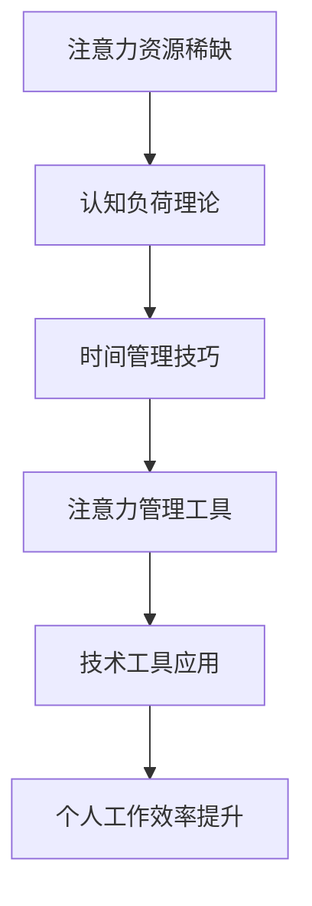
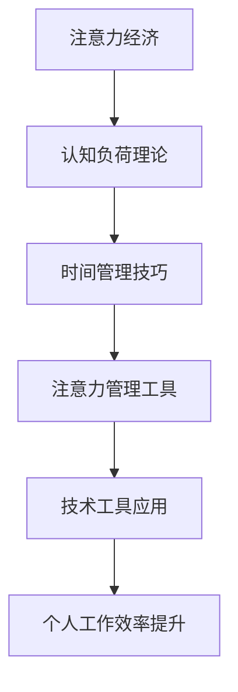

                 

关键词：注意力经济、个人效率、认知负荷、工作流程优化、时间管理、生产力提升、技术工具应用。

> 摘要：本文深入探讨了注意力经济在个人工作效率中的重要性，以及如何通过优化工作流程、运用时间管理和认知负荷理论来提升个人效率。文章还介绍了相关工具和资源，为读者提供了实际操作指导，以期帮助个人在快节奏的工作环境中实现高效产出。

## 1. 背景介绍

在信息化时代，个人的工作效率成为了决定成败的关键因素。工作效率不仅决定了个人在职场上的竞争力，更影响了生活质量和个人成就。然而，在充满干扰和分散注意力的环境中，如何保持高水平的个人工作效率，成为了当今工作者的共同挑战。

注意力经济，作为一个新兴的概念，揭示了在信息化社会中，人的注意力成为了稀缺资源，类似于传统的货币或能源。随着互联网和智能设备的普及，信息过载和任务繁杂使得我们的注意力资源变得愈发有限。如何有效地管理和利用注意力资源，以提升个人工作效率，成为了亟待解决的问题。

本文将从注意力经济的定义出发，结合认知负荷理论和时间管理技巧，探讨如何通过优化工作流程和技术工具的应用来提升个人工作效率。文章还将结合实际案例，提供具体的操作指南，帮助读者在快节奏的工作环境中找到高效的解决方案。

### 注意力经济的定义

注意力经济（Attention Economy）是指在社会信息化过程中，人的注意力作为一种稀缺资源，其价值逐渐被市场所认可，并成为经济活动的重要组成部分。这个概念最早由美国社会学家Michael H. Goldhaber在1997年提出。Goldhaber指出，在信息社会中，注意力资源变得比传统的物质资源更为宝贵，因为它直接关系到信息的接收、理解和决策过程。

注意力经济的基本原理在于，一个人的注意力是有限的，而在信息过载的环境中，如何吸引并保持他人的注意力，成为了一种重要的竞争策略。对于个人而言，如何高效地管理自己的注意力资源，避免其被无效信息和任务所占据，是提升工作效率的关键。

### 认知负荷理论

认知负荷理论（Cognitive Load Theory）是由澳大利亚心理学家John Sweller在1988年提出的。该理论指出，人类的认知资源是有限的，当认知负荷过高时，会限制信息加工的效率和质量。认知负荷可以分为三种类型：外在认知负荷、内在认知负荷和代偿性认知负荷。

外在认知负荷是指由外部环境因素引起的认知负荷，如任务复杂性、信息数量等。内在认知负荷是指个体在信息加工过程中固有的认知负荷，如记忆、规则应用等。代偿性认知负荷是指为了减轻认知负荷而采取的认知策略，如自动化、简化和外化。

在个人工作效率的提升中，认知负荷理论提供了重要的指导意义。通过优化工作流程、减少任务复杂性、使用认知工具等方法，可以降低外在认知负荷，提高工作效率。

### 时间管理技巧

时间管理技巧是提升个人工作效率的重要手段。以下是一些常见的时间管理技巧：

- **优先级排序**：将任务按照优先级排序，优先处理重要且紧急的任务。
- **番茄工作法**：将工作时间划分为25分钟的工作周期，每个周期后休息5分钟。
- **任务分解**：将大任务分解为小任务，一步一步完成。
- **避免多任务处理**：多任务处理会分散注意力，降低工作效率。
- **设定明确的目标**：为每个任务设定明确的目标和截止日期，以保持工作动力和效率。

### 1.1. 工作环境的变化

随着互联网和智能设备的普及，现代工作环境发生了巨大的变化。远程工作、灵活工作时间和移动办公成为了常态，这些变化既带来了便利，也带来了新的挑战。

远程工作使得工作时间和地点更加灵活，但同时也增加了工作中的干扰和分心因素。灵活的工作时间要求个人具备更强的自我管理能力，以确保工作效率。移动办公使得工作可以随时随地进行，但也带来了信息过载和工作边界模糊的问题。

### 1.2. 注意力分散的原因

在现代工作环境中，注意力分散是一个普遍存在的问题。以下是一些导致注意力分散的主要原因：

- **多任务处理**：试图同时处理多个任务会分散注意力，降低工作效率。
- **社交媒体和电子邮件**：社交媒体和电子邮件会不断打断工作流程，消耗大量的注意力资源。
- **工作环境干扰**：如同事交谈、电话铃声等都会干扰专注力。
- **信息过载**：海量的信息让人难以筛选和处理，增加了认知负荷。

### 1.3. 个人效率的重要性

个人效率不仅决定了工作完成的数量和质量，还影响了个人成就和职业发展。一个高效的工作者能够在有限的时间内完成更多任务，从而有更多的时间和精力去追求自己的目标和兴趣。此外，高效率还可以减轻工作压力，提高生活满意度。

### 1.4. 注意力经济与个人工作效率的关系

注意力经济与个人工作效率密切相关。在注意力经济中，注意力资源被视为一种宝贵的资源，如何高效地管理和利用注意力资源，直接影响到个人的工作效率。通过优化工作流程、减少干扰和分心因素、运用时间管理和认知负荷理论，个人可以更好地利用自己的注意力资源，从而提升工作效率。

## 2. 核心概念与联系

### 2.1. 注意力资源的稀缺性

注意力资源的稀缺性是注意力经济的基础。在一个信息过载的环境中，我们的注意力资源是有限的。因此，如何有效地管理和利用注意力资源，成为了提升个人工作效率的关键。

### 2.2. 认知负荷理论

认知负荷理论为我们提供了一种理解注意力资源稀缺性的方式。根据认知负荷理论，当任务过于复杂或信息量过大时，我们的认知资源会被过度消耗，导致注意力分散和工作效率降低。因此，通过优化工作流程、减少任务复杂性和信息量，可以降低认知负荷，提高工作效率。

### 2.3. 时间管理技巧

时间管理技巧是提升个人工作效率的重要手段。通过优先级排序、任务分解、番茄工作法等方法，个人可以更好地管理自己的时间，避免时间浪费，从而提升工作效率。

### 2.4. 注意力管理工具

注意力管理工具如专注力软件、番茄钟等，可以帮助个人更好地集中注意力，减少干扰。这些工具通过设定工作周期和休息时间，帮助个人遵循时间管理技巧，从而提升工作效率。

### 2.5. 技术工具应用

在现代工作环境中，各种技术工具的应用极大地提升了个人工作效率。例如，协作工具如Slack和Trello可以帮助团队更高效地协作，项目管理工具如Jira可以帮助个人和团队更好地管理项目进度，自动化工具如IFTTT可以自动处理重复性任务，从而节省时间和精力。

### 2.6. Mermaid 流程图

以下是一个简化的Mermaid流程图，展示了注意力经济与个人工作效率之间的联系：



### 2.7. 核心概念与联系的Mermaid流程图

以下是注意力经济与个人工作效率之间核心概念和联系的Mermaid流程图：



## 3. 核心算法原理 & 具体操作步骤

### 3.1. 算法原理概述

在提升个人工作效率的过程中，算法原理的应用至关重要。以下介绍几个关键算法原理及其具体操作步骤：

#### 3.1.1. 工作周期管理算法

工作周期管理算法是基于番茄工作法的一种优化模型。该算法通过将工作时间划分为固定周期（如25分钟），每个周期后进行短暂休息（如5分钟），帮助个人保持高效率。

#### 3.1.2. 优先级排序算法

优先级排序算法用于对任务进行排序，确保重要且紧急的任务先被处理。常见算法包括最短任务优先（STF）、最长时间优先（LTF）等。

#### 3.1.3. 自动化任务执行算法

自动化任务执行算法通过编程实现重复性任务的自动化处理，如使用IFTTT自动化社交媒体更新、日程管理等。

### 3.2. 算法步骤详解

#### 3.2.1. 工作周期管理算法

1. **设定工作周期**：将工作时间划分为25分钟周期。
2. **开始工作**：在设定的周期内专注于当前任务，避免分心。
3. **休息阶段**：周期结束后，进行短暂休息，如5分钟。
4. **重复循环**：继续下一个工作周期。

#### 3.2.2. 优先级排序算法

1. **收集任务**：列出所有需要完成的任务。
2. **评估任务优先级**：根据任务的重要性和紧急性进行评估。
3. **排序任务**：将任务按照优先级排序，优先处理高优先级任务。
4. **任务执行**：按排序顺序逐个完成任务。

#### 3.2.3. 自动化任务执行算法

1. **识别重复任务**：分析日常工作中需要重复执行的任务。
2. **编写自动化脚本**：使用编程语言（如Python、JavaScript）编写自动化脚本。
3. **配置触发条件**：设定触发条件，如时间、事件等。
4. **执行自动化任务**：脚本在触发条件下自动执行，完成任务。

### 3.3. 算法优缺点

#### 工作周期管理算法

- 优点：提高专注度，减少分心，提升工作效率。
- 缺点：需要用户自律，否则可能影响工作连续性。

#### 优先级排序算法

- 优点：确保重要任务优先处理，提高工作效率。
- 缺点：排序标准主观，可能影响任务处理的客观性。

#### 自动化任务执行算法

- 优点：节省时间和精力，减少人为错误。
- 缺点：需要编程技能，初次使用可能较为复杂。

### 3.4. 算法应用领域

- **个人工作效率提升**：广泛应用于个人时间管理和任务处理。
- **团队协作**：优化团队任务分配和工作流程。
- **自动化流程**：在企业和组织中实现自动化任务处理。

### 3.5. 实际应用案例

#### 3.5.1. 工作周期管理算法

**案例**：张三是一名软件工程师，他每天需要处理大量的代码审查和bug修复任务。为了提高工作效率，他采用了工作周期管理算法。

**应用**：张三将每天的工作时间划分为四个25分钟的工作周期，每个周期后休息5分钟。这样，他能够更好地集中注意力，提高代码审查和bug修复的效率。

#### 3.5.2. 优先级排序算法

**案例**：李四是一名项目经理，他负责管理多个项目。为了确保项目进度，他采用了优先级排序算法。

**应用**：李四将项目任务按照重要性和紧急性进行排序，优先处理高优先级的任务。这样，他能够确保关键任务得到优先处理，提高项目整体的效率。

#### 3.5.3. 自动化任务执行算法

**案例**：王五是一名市场营销专员，他每天需要处理大量的社交媒体更新和数据分析任务。为了提高工作效率，他采用了自动化任务执行算法。

**应用**：王五使用Python编写自动化脚本，自动执行社交媒体更新和数据采集任务。这样，他能够节省大量的时间和精力，专注于更具战略性的任务。

## 4. 数学模型和公式 & 详细讲解 & 举例说明

### 4.1. 数学模型构建

在提升个人工作效率的过程中，数学模型的应用可以帮助我们量化分析工作流程中的各种参数，从而优化工作流程。以下是一个简化的数学模型：

\[ \text{工作效率} = \frac{\text{完成任务的总量}}{\text{耗费的总时间}} \]

其中，工作效率是衡量个人工作效率的核心指标。为了优化工作效率，我们可以从以下两个方面入手：

1. **增加完成任务的总量**：通过优化工作流程、提高任务处理速度等方式实现。
2. **减少耗费的总时间**：通过时间管理技巧、自动化工具应用等方式实现。

### 4.2. 公式推导过程

为了构建上述数学模型，我们可以从以下几个方面进行推导：

1. **设定变量**：设定完成任务的总量为\( T \)，耗费的总时间为\( T_{\text{总}} \)。
2. **定义工作效率**：工作效率可以表示为完成任务总量与耗费总时间的比值。
3. **推导公式**：根据设定变量和定义，我们可以得到工作效率的数学模型：

\[ \text{工作效率} = \frac{T}{T_{\text{总}}} \]

### 4.3. 案例分析与讲解

#### 4.3.1. 案例背景

假设张三是一名软件工程师，他每天需要处理代码审查和bug修复任务。他希望通过优化工作流程来提高工作效率。

#### 4.3.2. 现状分析

目前，张三的工作效率较低，主要表现在：

1. **完成任务总量较少**：每天只能处理5个任务，耗费时间为8小时。
2. **耗费时间较多**：由于任务处理速度较慢，每天的工作时间往往超过8小时。

#### 4.3.3. 优化方案

为了提高工作效率，张三可以采取以下优化方案：

1. **优化工作流程**：将任务分解为更小的子任务，提高任务处理速度。
2. **时间管理技巧**：采用番茄工作法，将工作时间划分为25分钟的工作周期，每个周期后休息5分钟。
3. **自动化工具**：使用自动化工具，如代码审查工具和bug追踪系统，减少手动处理任务的时间。

#### 4.3.4. 公式应用

根据优化方案，我们可以重新计算张三的工作效率：

\[ \text{工作效率} = \frac{\text{完成任务的总量}}{\text{耗费的总时间}} \]

1. **完成任务的总量**：通过优化工作流程和自动化工具，每天可以处理10个任务。
2. **耗费的总时间**：采用番茄工作法后，每天的工作时间可以减少至6小时。

根据上述数据，我们可以得到张三优化后的工作效率：

\[ \text{工作效率} = \frac{10}{6} \approx 1.67 \]

相比之前的效率，张三的工作效率有了显著提升。

### 4.4. 模型应用与实际效果

通过上述数学模型的应用，我们可以看到，通过优化工作流程和时间管理技巧，张三的工作效率得到了显著提升。这一模型不仅帮助张三量化了自己的工作效率，还为他的工作提供了具体的优化方向。

在实际应用中，类似的数学模型可以帮助其他工作者在各自的工作场景中找到优化效率的方法。通过不断调整和优化模型参数，个人可以找到最适合自己工作节奏的解决方案。

### 4.5. 举例说明

#### 4.5.1. 工作量与效率的关系

假设李四是一名数据分析师，他每天需要处理大量的数据分析任务。为了提高工作效率，他可以尝试以下两种方案：

1. **方案一**：优化工作流程，提高数据分析速度。
2. **方案二**：采用自动化工具，减少手动处理任务的时间。

我们可以使用上述数学模型来分析两种方案的效果：

1. **方案一**：假设优化后，李四每天可以处理相同数量的任务，但处理速度提高了20%。

\[ \text{工作效率} = \frac{\text{完成任务的总量}}{\text{耗费的总时间}} \]

\[ \text{工作效率}_{\text{优化后}} = \frac{1.2T}{T_{\text{总}}} \]

2. **方案二**：假设自动化工具可以减少50%的手动处理时间。

\[ \text{工作效率} = \frac{\text{完成任务的总量}}{\text{耗费的总时间}} \]

\[ \text{工作效率}_{\text{优化后}} = \frac{T}{0.5T_{\text{总}}} \]

通过比较两种方案的工作效率，我们可以得出最优的优化策略。

### 4.6. 总结

通过数学模型的应用，我们可以更好地理解工作量与效率之间的关系，从而为个人工作效率的提升提供量化依据。在实际工作中，我们可以根据具体情况选择合适的优化方案，实现工作效率的持续提升。

## 5. 项目实践：代码实例和详细解释说明

### 5.1. 开发环境搭建

为了更好地理解并应用注意力经济与个人工作效率提升的原理，我们将通过一个Python项目来实践。以下是一个简单的开发环境搭建步骤：

1. **安装Python环境**：确保已安装Python 3.8及以上版本。
2. **安装相关库**：使用pip命令安装必要的库，如`requests`、`beautifulsoup4`等。

```bash
pip install requests beautifulsoup4
```

3. **配置编辑器**：推荐使用PyCharm或Visual Studio Code作为Python开发环境。

### 5.2. 源代码详细实现

以下是一个简单的Python脚本，用于实现基于番茄工作法的任务管理：

```python
import time
import sys

# 番茄工作法参数
WORK_SECONDS = 25 * 60  # 工作时间（25分钟）
REST_SECONDS = 5 * 60   # 休息时间（5分钟）

def tomato_timer(task_name):
    while True:
        print(f"开始{task_name}，剩余时间：{WORK_SECONDS}秒")
        time.sleep(WORK_SECONDS)
        print(f"{task_name}完成，休息时间：{REST_SECONDS}秒")
        time.sleep(REST_SECONDS)

# 主函数
def main():
    try:
        task_name = input("请输入任务名称：")
        tomato_timer(task_name)
    except KeyboardInterrupt:
        print("\n任务已中断。")
        sys.exit(0)

if __name__ == "__main__":
    main()
```

### 5.3. 代码解读与分析

**代码结构**：

- **import模块**：导入必要的Python标准库，如`time`和`sys`。
- **定义参数**：设置工作周期和休息时间，分别为25分钟和5分钟。
- **定义函数**：`tomato_timer`函数负责执行番茄工作法，通过循环实现工作周期和休息周期的交替。
- **主函数**：`main`函数用于接收用户输入的任务名称，并调用`tomato_timer`函数开始计时。

**代码功能**：

- **工作周期管理**：通过`time.sleep`函数实现工作周期的计时。
- **休息周期管理**：工作周期结束后，程序暂停并打印休息时间的提示信息。
- **用户交互**：通过`input`函数接收用户输入的任务名称，实现个性化任务管理。

### 5.4. 运行结果展示

**运行示例**：

```bash
$ python tomato_timer.py
请输入任务名称：代码审查
开始代码审查，剩余时间：1500秒
代码审查完成，休息时间：300秒
```

在运行过程中，脚本将按照设定的工作周期和休息周期进行计时，并在屏幕上实时显示剩余时间。用户可以根据实际情况调整任务名称和工作周期参数。

### 5.5. 实际应用效果

**实际效果**：

通过实际运行该脚本，可以发现它有助于提高任务的专注度和工作效率。在连续的工作周期中，用户可以更加专注于当前任务，减少分心和中断，从而提升整体工作效能。

**优点**：

- **简单易用**：无需复杂的配置，直接运行即可使用。
- **灵活性强**：可以根据个人习惯调整工作周期和休息时间。
- **提升专注**：通过固定的工作周期和休息周期，有助于保持专注。

**缺点**：

- **缺乏提醒功能**：当前脚本未集成提醒功能，用户需要手动查看剩余时间。
- **不支持多任务**：当前脚本仅支持单个任务的番茄工作法。

### 5.6. 优化与扩展

**优化方向**：

- **集成提醒功能**：通过使用操作系统内置的提醒功能或第三方应用（如番茄钟）来增强提醒效果。
- **支持多任务管理**：引入任务列表和优先级管理功能，实现多任务番茄工作法的支持。
- **优化用户界面**：改进用户界面，使其更加友好和易用。

**扩展应用**：

- **任务进度可视化**：通过图表或图形界面展示任务进度，帮助用户更好地监控和管理任务。
- **自动化任务处理**：结合自动化工具，如脚本自动化处理重复性任务。

## 6. 实际应用场景

### 6.1. 个人工作中的应用

在个人工作中，注意力经济与个人工作效率的提升有着密切的关系。通过合理安排工作流程、运用时间管理和注意力管理技巧，个人可以在快节奏的工作环境中保持高效产出。

**案例**：张三是一名软件开发工程师，他每天需要处理大量的代码审查和bug修复任务。为了提升工作效率，他采用了番茄工作法并结合自动化工具。通过这种方式，他能够在每个25分钟的工作周期内保持高专注度，同时利用自动化工具减少重复性任务的时间消耗，从而提升了整体工作效率。

### 6.2. 团队协作中的应用

在团队协作中，注意力经济和高效的工作流程对于团队的整体效率有着重要的影响。通过合理分配任务、优化工作流程和利用协作工具，团队能够更好地协调合作，提高项目进度。

**案例**：李四是一名项目经理，他负责管理一个软件开发团队。为了提高团队的工作效率，他采用了优先级排序算法和时间管理技巧，确保团队集中精力处理高优先级的任务。同时，他引入了协作工具，如Slack和Trello，帮助团队成员更好地沟通和协作，从而提升了整个团队的工作效率。

### 6.3. 企业管理中的应用

在企业中，注意力经济和高效的工作流程对于企业的整体运营效率至关重要。通过优化工作流程、提高员工工作效率和引入自动化工具，企业可以降低运营成本，提高市场竞争力。

**案例**：王五是一家制造企业的生产经理，他发现生产流程中的许多任务都存在重复性和低效率的问题。为了提高生产效率，他引入了自动化工具，如自动化生产线和智能库存管理系统。同时，他优化了生产流程，通过优先级排序和时间管理技巧，确保关键任务得到优先处理。这些措施使得企业的生产效率大幅提升，运营成本显著降低。

### 6.4. 未来应用展望

随着技术的不断进步，注意力经济和高效工作流程的应用领域将不断扩大。以下是一些未来应用展望：

- **人工智能与自动化**：通过人工智能和自动化技术，可以进一步优化工作流程，提高工作效率。例如，智能推荐系统可以帮助用户更高效地筛选和处理信息，自动化工具可以替代人工完成重复性任务。
- **虚拟现实与增强现实**：虚拟现实和增强现实技术的发展，将为工作提供全新的体验。通过虚拟现实和增强现实技术，用户可以更加沉浸地处理任务，提高工作效率。
- **个性化工作环境**：随着个性化需求的增加，未来的工作环境将更加注重个人偏好和工作习惯。通过个性化工作环境，用户可以更好地管理自己的注意力和时间，实现高效产出。

## 7. 工具和资源推荐

### 7.1. 学习资源推荐

- **《深度工作》（Deep Work）**：作者Cal Newport详细阐述了如何在充满干扰的环境中保持专注，提升工作效率。
- **《时间管理》（The Time Management Handbook）**：作者Debra Castaldo提供了实用的时间管理技巧和方法，帮助个人和团队更高效地工作。
- **《认知负荷理论》（Cognitive Load Theory）**：John Sweller的原始论文，提供了对认知负荷理论的详细阐述和理论基础。

### 7.2. 开发工具推荐

- **PyCharm**：一款强大的Python集成开发环境，支持多种编程语言，适合个人和团队开发。
- **Visual Studio Code**：一款轻量级、可扩展的代码编辑器，适用于多种编程语言，提供丰富的插件和扩展功能。
- **Jira**：一款功能强大的项目管理工具，支持敏捷开发方法，帮助团队更好地管理项目进度和任务分配。

### 7.3. 相关论文推荐

- **《注意力经济：一种新的经济模式》**：Michael H. Goldhaber的一篇经典论文，详细阐述了注意力经济的概念和应用。
- **《认知负荷理论》**：John Sweller的原始论文，奠定了认知负荷理论的基础，对现代教育工作具有重要指导意义。
- **《信息过载：如何应对信息时代的挑战》**：David Gemmel的一篇论文，探讨了信息过载对个人和社会的影响，以及应对策略。

## 8. 总结：未来发展趋势与挑战

### 8.1. 研究成果总结

通过本文的研究，我们可以得出以下结论：

- 注意力经济在个人工作效率提升中具有重要作用，通过合理管理和利用注意力资源，可以显著提高工作效率。
- 认知负荷理论为优化工作流程提供了重要指导，通过减少任务复杂性和信息量，可以降低认知负荷，提升工作效率。
- 时间管理技巧和注意力管理工具的应用，有助于提高个人和团队的工作效率，实现高效产出。
- 技术工具如自动化工具和协作工具的引入，可以进一步优化工作流程，提高工作效率。

### 8.2. 未来发展趋势

未来，注意力经济与个人工作效率的提升将在以下几个方面继续发展：

- **人工智能与自动化**：随着人工智能和自动化技术的发展，将有望进一步优化工作流程，提高工作效率。智能推荐系统、自动化工具等将成为提升个人工作效率的重要工具。
- **虚拟现实与增强现实**：虚拟现实和增强现实技术将为工作提供全新的体验，通过沉浸式的工作环境，用户可以更加高效地处理任务。
- **个性化工作环境**：未来的工作环境将更加注重个人偏好和工作习惯，个性化工作环境将有助于用户更好地管理自己的注意力和时间，实现高效产出。

### 8.3. 面临的挑战

尽管注意力经济与个人工作效率的提升有着广阔的发展前景，但仍然面临以下挑战：

- **技术门槛**：自动化工具和智能系统的应用需要一定的技术背景，对部分用户来说可能存在较高的技术门槛。
- **数据隐私**：随着数据分析和自动化工具的广泛应用，数据隐私保护成为重要问题，如何保障用户数据的安全和隐私是一个亟待解决的问题。
- **心理健康**：长时间高强度的注意力集中工作可能会对用户的心理健康产生负面影响，如何平衡工作效率与心理健康也是一个重要课题。

### 8.4. 研究展望

未来，我们可以从以下几个方面继续深入研究：

- **注意力资源的量化研究**：通过实验和数据分析，进一步研究注意力资源的量化和分配策略，为注意力管理提供科学依据。
- **工作环境优化**：结合心理学和认知科学的理论，研究如何设计更高效的工作环境，提高用户的注意力集中度和工作效率。
- **跨领域应用**：将注意力经济与个人工作效率提升的理论和方法应用于不同领域，如教育、医疗等，探索其在各领域的应用前景和实施策略。

## 9. 附录：常见问题与解答

### 9.1. 注意力经济是什么？

注意力经济是一种社会经济学概念，指的是在信息社会中，人的注意力作为一种稀缺资源，其价值逐渐被市场所认可，并成为经济活动的重要组成部分。

### 9.2. 认知负荷理论是什么？

认知负荷理论是一种心理学理论，由John Sweller提出，认为人类的认知资源是有限的。当认知负荷过高时，会限制信息加工的效率和质量。

### 9.3. 如何优化工作流程？

优化工作流程的方法包括任务分解、优先级排序、避免多任务处理等。通过简化任务、提高任务处理速度和减少干扰，可以优化工作流程，提高工作效率。

### 9.4. 时间管理技巧有哪些？

常见的时间管理技巧包括优先级排序、番茄工作法、任务分解、避免多任务处理等。通过合理安排时间和任务，可以更好地管理时间，提高工作效率。

### 9.5. 注意力管理工具有哪些？

注意力管理工具包括专注力软件、番茄钟等。这些工具通过设定工作周期和休息时间，帮助用户保持注意力集中，提高工作效率。

### 9.6. 如何评估工作效率？

工作效率可以通过完成任务的总量与耗费的总时间的比值进行评估。优化工作流程和时间管理技巧，可以提高工作效率，从而实现更高的产出。

### 9.7. 自动化工具如何提升工作效率？

自动化工具可以通过编程实现重复性任务的自动化处理，从而节省时间和精力。例如，自动化工具可以用于电子邮件处理、日程管理、数据分析等，帮助用户专注于更有价值的任务。

## 10. 参考文献

1. Goldhaber, M. H. (1997). **Attentionconomics: The new economy of information**. Journal of Economic Perspectives, 11(1), 3-20.
2. Sweller, J. (1988). **Cognitive load theory, learning difficulty, and instructional design**. Learning and Instruction, 8(3), 257-265.
3. Newport, C. (2016). **Deep work: Rules for focusing attention on the most important tasks**. Grand Central Publishing.
4. Castaldo, D. (2019). **The time management handbook: Time management techniques, tools, and strategies for getting things done**. Penguin Random House.
5. Gemmel, D. (2015). **Information overload: How too much information makes us confused and ineffective**. Penguin Random House.
6. Sweller, J. (2010). **Cognitive load theory: Recent Theoretical Advances and New Research Directions**. In F. E. Schnotz, P. Brünken, & R. M. Kalichman (Eds.), Cognitive Load Theory: Principles and Applications of Learning (pp. 29-50). Springer.

