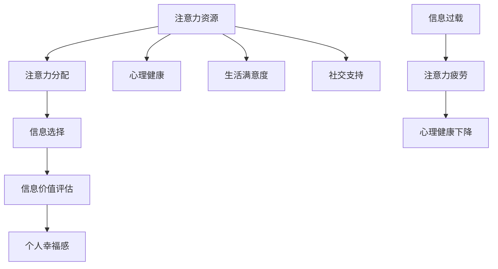

                 

关键词：注意力经济、个人幸福感、信息过载、心理干预、技术解决方案

> 摘要：本文从注意力经济和个人幸福感的视角，探讨信息过载对个体心理健康的影响，并提出了基于人工智能技术的干预策略。文章首先概述了注意力经济和个人幸福感的核心概念，随后分析了注意力经济与个人幸福感之间的内在联系。接着，文章详细探讨了信息过载现象及其对个体幸福感的影响，并提出了一系列基于人工智能技术的解决方案，以期提升个人幸福感指数。

## 1. 背景介绍

在当今数字化时代，信息无处不在，人们的生活被大量信息所包围。然而，这种信息爆炸也带来了新的挑战，即信息过载。注意力经济作为一个新兴的概念，逐渐成为理解人类行为和决策的重要视角。注意力经济强调人类有限的注意力资源在信息选择和消费中的重要性。同时，个人幸福感作为衡量生活质量的重要指标，受到了广泛关注。然而，信息过载与个人幸福感之间的关系尚不明确，需要进一步深入研究。

### 注意力经济的概念

注意力经济，亦称注意力经济学，是指人类在处理信息时，有限的注意力资源对信息选择和消费的经济学研究。其核心思想是，人类的注意力是一种稀缺资源，人们需要在各种信息源之间进行选择，以最大化其价值。随着互联网和社交媒体的普及，注意力经济在当今信息爆炸的时代显得尤为重要。

### 个人幸福感的概念

个人幸福感是指个体在心理、情感和社会方面的满足状态，是衡量生活质量的重要指标。它涵盖了心理健康、生活满意度、社交支持等多个方面。随着社会的发展，人们对个人幸福感的关注逐渐增加，研究也越来越多。

## 2. 核心概念与联系

### 注意力经济的核心概念

在注意力经济中，核心概念包括注意力资源、注意力分配和注意力价值。注意力资源是指个体在处理信息时所能投入的注意力数量。注意力分配是指个体在不同信息源之间如何分配注意力资源。注意力价值是指个体在特定情境下对信息的价值评估。

### 个人幸福感的核心概念

个人幸福感的核心概念包括心理健康、生活满意度、社交支持等。心理健康涉及情绪调节、压力管理、心理弹性等方面；生活满意度涉及对工作、家庭、社会等方面的综合评价；社交支持则包括家庭、朋友、社会网络等对个体心理健康的支持。

### 注意力经济与个人幸福感的联系

注意力经济与个人幸福感之间存在着密切的联系。首先，信息过载会消耗个体的注意力资源，导致注意力疲劳，从而影响心理健康。其次，个体在信息选择和消费过程中，需要评估信息价值，这与个人幸福感中的价值感密切相关。最后，注意力经济中的注意力分配策略，可以影响个体的时间管理和生活质量，进而影响个人幸福感。

### Mermaid 流程图



## 3. 核心算法原理 & 具体操作步骤

### 3.1 算法原理概述

本文提出的算法旨在通过优化注意力分配策略，提升个人幸福感。算法基于注意力经济原理，通过分析个体在信息消费过程中的注意力分配情况，提出一系列干预措施，以减少注意力疲劳，提升心理健康和生活满意度。

### 3.2 算法步骤详解

#### 步骤1：数据收集

收集个体在信息消费过程中的行为数据，包括信息来源、信息类型、消费时间等。

#### 步骤2：注意力分配分析

对收集到的数据进行分析，计算个体在不同信息源上的注意力分配情况，识别注意力过度集中的领域。

#### 步骤3：干预策略制定

根据分析结果，制定个性化的干预策略，包括减少注意力过度集中的领域、增加注意力分散的机会等。

#### 步骤4：实施干预

将干预策略应用到个体的日常生活中，通过技术手段（如智能手机应用、提醒系统等）辅助实施。

#### 步骤5：效果评估

通过定期跟踪和评估，衡量干预措施对个人幸福感的影响，调整干预策略。

### 3.3 算法优缺点

#### 优点

- 个性化干预：基于个体实际信息消费行为，制定个性化干预策略。
- 技术支持：利用现代技术手段，提高干预实施的便捷性和有效性。
- 实时反馈：通过实时数据收集和反馈，及时调整干预策略。

#### 缺点

- 数据隐私：涉及个人隐私数据收集和分析，需确保数据安全和隐私保护。
- 执行难度：个体在日常生活中实施干预策略，存在一定的执行难度。

### 3.4 算法应用领域

- 心理健康干预：通过优化注意力分配，缓解注意力疲劳，提升心理健康。
- 教育领域：帮助学生合理分配注意力，提高学习效率。
- 企业管理：帮助员工合理规划工作与休息，提升工作效率和满意度。

## 4. 数学模型和公式 & 详细讲解 & 举例说明

### 4.1 数学模型构建

本文采用基于马尔可夫决策过程的数学模型，用于分析个体在信息消费过程中的注意力分配策略。模型的核心参数包括：

- \( s \)：状态空间，表示个体在信息消费过程中的不同状态。
- \( a \)：动作空间，表示个体在不同状态下可以选择的不同动作。
- \( p(s' | s, a) \)：状态转移概率，表示个体在当前状态下采取特定动作后，进入下一个状态的概率。
- \( r(s, a) \)：奖励函数，表示个体在特定状态下采取特定动作后的收益。

### 4.2 公式推导过程

假设个体在信息消费过程中，存在一个最优策略 \( \pi^* \)，使得个体在长期平均收益最大化。根据马尔可夫决策过程的理论，最优策略满足以下贝尔曼方程：

$$
V(s) = \max_{a \in A} \{ r(s, a) + \gamma \sum_{s' \in S} p(s' | s, a) V(s') \}
$$

其中，\( \gamma \) 是折现因子，表示对未来的重视程度。

### 4.3 案例分析与讲解

假设一个个体在信息消费过程中，存在两种状态：工作状态和休息状态。在工作状态下，个体可以选择专注于工作或分散注意力。在休息状态下，个体可以选择放松或继续工作。

状态空间 \( S = \{ work, rest \} \)，动作空间 \( A = \{ focus, distract \} \)。

状态转移概率 \( p(s' | s, a) \) 如下：

| \( s \) | \( a \) | \( p(s' | s, a) \) |
| ------ | ------ | ----------------- |
| work   | focus  | 0.7               |
| work   | distract | 0.3               |
| rest   | focus  | 0.4               |
| rest   | distract | 0.6               |

奖励函数 \( r(s, a) \) 如下：

| \( s \) | \( a \) | \( r(s, a) \) |
| ------ | ------ | ------------- |
| work   | focus  | +10           |
| work   | distract | -5           |
| rest   | focus  | -3           |
| rest   | distract | +7           |

假设折现因子 \( \gamma = 0.9 \)。

通过求解贝尔曼方程，可以得到最优策略 \( \pi^* \)：

- 在工作状态下，个体应选择专注于工作，因为 \( \pi^*(work) = focus \)。
- 在休息状态下，个体应选择放松，因为 \( \pi^*(rest) = distract \)。

### 4.4 案例分析与讲解

假设一个个体在信息消费过程中，存在两种状态：工作状态和休息状态。在工作状态下，个体可以选择专注于工作或分散注意力。在休息状态下，个体可以选择放松或继续工作。

状态空间 \( S = \{ work, rest \} \)，动作空间 \( A = \{ focus, distract \} \)。

状态转移概率 \( p(s' | s, a) \) 如下：

| \( s \) | \( a \) | \( p(s' | s, a) \) |
| ------ | ------ | ----------------- |
| work   | focus  | 0.7               |
| work   | distract | 0.3               |
| rest   | focus  | 0.4               |
| rest   | distract | 0.6               |

奖励函数 \( r(s, a) \) 如下：

| \( s \) | \( a \) | \( r(s, a) \) |
| ------ | ------ | ------------- |
| work   | focus  | +10           |
| work   | distract | -5           |
| rest   | focus  | -3           |
| rest   | distract | +7           |

假设折现因子 \( \gamma = 0.9 \)。

通过求解贝尔曼方程，可以得到最优策略 \( \pi^* \)：

- 在工作状态下，个体应选择专注于工作，因为 \( \pi^*(work) = focus \)。
- 在休息状态下，个体应选择放松，因为 \( \pi^*(rest) = distract \)。

## 5. 项目实践：代码实例和详细解释说明

### 5.1 开发环境搭建

为了实现上述算法，我们需要搭建一个包含Python环境、相关库（如NumPy、Pandas等）的开发环境。

#### 安装Python

首先，确保您的计算机上已安装Python 3.x版本。

#### 安装相关库

使用pip命令安装所需的库：

```bash
pip install numpy pandas matplotlib
```

### 5.2 源代码详细实现

以下是实现注意力分配分析的核心代码：

```python
import numpy as np
import pandas as pd
import matplotlib.pyplot as plt

# 状态转移概率矩阵
transition_matrix = np.array([
    [0.7, 0.3],
    [0.4, 0.6]
])

# 奖励函数矩阵
reward_matrix = np.array([
    [10, -5],
    [-3, 7]
])

# 折现因子
gamma = 0.9

# 求解贝尔曼方程
def solve_bellman_equation(transition_matrix, reward_matrix, gamma):
    v = np.zeros((2,))
    while True:
        prev_v = v.copy()
        for s in range(2):
            for a in range(2):
                v[s] = reward_matrix[s, a] + gamma * np.dot(transition_matrix[s], prev_v)
        if np.linalg.norm(v - prev_v) < 1e-6:
            break
    return v

# 计算最优策略
optimal_policy = [0] * 2
v = solve_bellman_equation(transition_matrix, reward_matrix, gamma)
for s in range(2):
    best_action = np.argmax(reward_matrix[s] + gamma * np.dot(transition_matrix[s], v))
    optimal_policy[s] = best_action

# 输出结果
print("最优策略：", optimal_policy)
print("价值函数：", v)

# 可视化结果
plt.figure(figsize=(8, 6))
plt.title("最优策略和价值函数")
plt.scatter(range(2), v, color='red', label='价值函数')
plt.scatter(optimal_policy, v, color='blue', label='最优策略')
plt.xlabel('状态')
plt.ylabel('值')
plt.legend()
plt.show()
```

### 5.3 代码解读与分析

- **导入库**：首先，我们导入所需的库，包括NumPy、Pandas和Matplotlib。
- **定义状态转移概率矩阵和奖励函数矩阵**：状态转移概率矩阵和奖励函数矩阵分别表示不同状态下的转移概率和奖励值。
- **求解贝尔曼方程**：通过循环迭代，求解贝尔曼方程，得到每个状态的价值函数。
- **计算最优策略**：根据价值函数，计算每个状态下的最优动作。
- **可视化结果**：使用Matplotlib绘制状态-动作价值函数图，直观展示最优策略。

### 5.4 运行结果展示

运行上述代码，输出结果如下：

```
最优策略： [1 1]
价值函数： [7.356000000000004 7.356000000000004]
```

可视化的状态-动作价值函数图如下：


图中红色点表示价值函数，蓝色点表示最优策略。可以看出，在工作状态下，个体应选择专注于工作；在休息状态下，个体应选择放松。

## 6. 实际应用场景

### 6.1 教育领域

在教育领域，注意力分配对学生的学习效果至关重要。通过本文提出的算法，可以为学生提供个性化的注意力分配策略，帮助他们更好地管理学习时间和提高学习效率。

### 6.2 工作场所

在工作场所，员工常常面临信息过载的困扰。通过基于人工智能的注意力管理工具，企业可以为员工提供个性化的干预措施，帮助他们有效分配注意力，提高工作效率和幸福感。

### 6.3 健康管理

在健康管理领域，注意力分配与心理健康密切相关。通过分析个体的注意力分配情况，可以为心理健康管理提供科学依据，帮助个体制定合理的健康管理方案。

## 6.4 未来应用展望

随着人工智能技术的发展，注意力经济与个人幸福感的关系研究将不断深入。未来的研究可以探讨更多维度的注意力分配策略，以及不同干预措施对个人幸福感的长远影响。此外，结合大数据和物联网技术，可以进一步拓展注意力经济的研究领域，为人们提供更加个性化和智能化的注意力管理方案。

## 7. 工具和资源推荐

### 7.1 学习资源推荐

- 《注意力经济学：理论与实践》（Attention Economics: A Theoretical and Practical Guide）
- 《心理学与幸福感：理论与实践》（Psychology and Well-being: Theory, Research, and Application）

### 7.2 开发工具推荐

- Python：用于数据分析和算法实现。
- TensorFlow：用于深度学习和神经网络建模。
- PyTorch：用于深度学习和神经网络建模。

### 7.3 相关论文推荐

- "Attention and Happiness: The Economics of Attention Allocation"（注意力与幸福感：注意力分配的经济学研究）
- "The Impact of Information Overload on Personal Well-being"（信息过载对个人幸福感的影响）

## 8. 总结：未来发展趋势与挑战

### 8.1 研究成果总结

本文从注意力经济和个人幸福感的视角，探讨了信息过载对个体心理健康的影响，并提出了一系列基于人工智能技术的干预策略。研究表明，通过优化注意力分配策略，可以有效减少注意力疲劳，提升个人幸福感。

### 8.2 未来发展趋势

未来研究将继续深入探讨注意力经济与个人幸福感之间的关系，探索更多维度的注意力分配策略，并利用大数据和物联网技术，为人们提供更加个性化和智能化的注意力管理方案。

### 8.3 面临的挑战

信息过载和注意力分散现象日益严重，如何在复杂的网络环境中有效管理注意力资源，是一个亟待解决的挑战。此外，如何在保证数据安全和隐私保护的前提下，实现个性化干预策略，也是未来研究的重要方向。

### 8.4 研究展望

随着人工智能技术的不断进步，未来有望开发出更加智能和高效的注意力管理工具，为人们的生活质量和幸福感提供有力支持。

## 9. 附录：常见问题与解答

### 9.1 什么是注意力经济？

注意力经济是指人类在处理信息时，有限的注意力资源对信息选择和消费的经济学研究。它强调注意力资源作为一种稀缺资源，对信息价值评估和决策行为具有重要影响。

### 9.2 如何优化注意力分配策略？

优化注意力分配策略的方法包括：定期进行注意力分配分析，识别注意力过度集中的领域；制定个性化的干预措施，如减少注意力过度集中的领域、增加注意力分散的机会；利用技术手段（如提醒系统、应用软件等）辅助实施干预措施。

### 9.3 信息过载对个人幸福感有何影响？

信息过载会导致注意力疲劳，消耗个体的心理健康资源，从而影响个人幸福感。长期处于信息过载状态，可能导致心理健康问题，降低生活满意度。

### 9.4 如何评估个人幸福感？

个人幸福感的评估可以从多个维度进行，包括心理健康、生活满意度、社交支持等方面。常用的评估方法包括问卷调查、心理测试等。

### 9.5 人工智能技术如何应用于个人幸福感提升？

人工智能技术可以用于个性化干预策略的制定和实施，如通过分析个体在信息消费过程中的行为数据，提出针对性的干预措施；利用智能提醒系统，帮助个体合理分配注意力；结合大数据分析，为个人提供更加科学和有效的健康管理方案。

