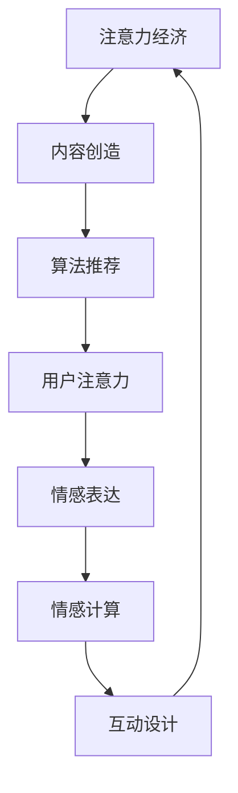

                 

关键词：注意力经济、个人情感、社交媒体、算法推荐、数字化时代、情感计算、互动设计

> 摘要：本文旨在探讨注意力经济背景下，个人情感表达方式的变迁。通过对社交媒体平台和算法推荐的深入分析，结合情感计算和互动设计的最新进展，我们揭示了数字化时代下情感交流的演变趋势及其带来的挑战和机遇。

## 1. 背景介绍

### 1.1 注意力经济的兴起

随着互联网和社交媒体的快速发展，一个全新的经济模式——“注意力经济”逐渐崭露头角。这一模式的核心在于，个体的注意力成为了一种稀缺资源，企业和个人通过争夺用户的注意力来实现商业价值和社会影响力。在注意力经济中，内容创造者和平台运营者通过吸引和维持用户的注意力来获取广告收入、用户订阅和品牌合作等多种收益。

### 1.2 个人情感表达方式的变化

个人情感表达方式是随着社会环境和技术的变化而不断演变的。在传统社会中，个体情感主要通过面对面交流、书信和电话等方式表达。然而，随着数字技术的普及，特别是社交媒体的兴起，个人情感表达方式发生了显著变化。用户在社交媒体上通过文字、图片、视频、表情符号等多种形式展示自己的情感状态。

### 1.3 情感计算与互动设计的发展

情感计算作为人工智能领域的一个分支，旨在通过计算机模拟人类情感，实现人与机器的深度互动。互动设计则关注如何通过用户界面和交互方式，增强用户的情感体验。两者的发展为数字化时代的情感表达提供了新的工具和思路。

## 2. 核心概念与联系

### 2.1 注意力经济

注意力经济指的是在数字化时代，个体注意力作为一种稀缺资源，被企业和平台通过内容创造和推广来争夺和利用，以实现商业利益。

### 2.2 个人情感表达

个人情感表达是指个体通过语言、行为和媒介等方式，展示其内心的情感状态。

### 2.3 情感计算

情感计算是指利用计算机技术和算法，模拟和识别人类情感，实现情感交互。

### 2.4 互动设计

互动设计是指通过用户界面和交互方式，为用户提供富有情感体验的互动服务。

### 2.5 Mermaid 流程图



## 3. 核心算法原理 & 具体操作步骤

### 3.1 算法原理概述

在注意力经济中，算法推荐是关键环节。算法通过分析用户行为数据，预测用户兴趣，从而为用户推荐相关内容，以吸引和保持用户的注意力。情感计算则通过识别和分析用户情感，为个性化推荐提供更精细的依据。

### 3.2 算法步骤详解

1. 数据收集与处理：收集用户的浏览记录、搜索历史、社交媒体互动等信息，进行数据清洗和预处理。
2. 用户兴趣建模：利用机器学习算法，建立用户兴趣模型，预测用户可能感兴趣的内容。
3. 情感分析：通过自然语言处理技术，分析用户生成的内容和交互行为中的情感倾向。
4. 内容推荐：结合用户兴趣和情感分析结果，为用户推荐相关内容。
5. 互动反馈：收集用户对推荐内容的反馈，调整推荐策略，优化用户体验。

### 3.3 算法优缺点

**优点：**
- 高效地吸引和保持用户注意力，提高用户参与度。
- 提供个性化内容推荐，满足用户多样化需求。

**缺点：**
- 过度推荐可能导致用户陷入“信息茧房”，失去对其他信息的接触。
- 情感分析的不准确可能导致推荐内容的偏差。

### 3.4 算法应用领域

- 社交媒体平台：通过情感计算优化内容推荐，提升用户黏性。
- 电商平台：结合用户情感，提供个性化购物建议。
- 娱乐平台：基于用户情感，推荐符合其喜好的视频、音乐等内容。

## 4. 数学模型和公式 & 详细讲解 & 举例说明

### 4.1 数学模型构建

注意力经济中的推荐系统可以看作是一个多模态的机器学习问题，其核心模型包括用户兴趣模型和内容情感模型。

### 4.2 公式推导过程

用户兴趣模型：

$$
U(t) = \sigma(W_1U(t-1) + W_2C(t) + b)
$$

其中，$U(t)$表示时间$t$时的用户兴趣向量，$C(t)$表示时间$t$时的内容特征向量，$W_1$和$W_2$是权重矩阵，$b$是偏置项，$\sigma$是激活函数。

内容情感模型：

$$
F(t) = \phi(W_3U(t) + W_4C(t) + b')
$$

其中，$F(t)$表示时间$t$时的内容情感得分，$\phi$是激活函数，$W_3$和$W_4$是权重矩阵，$b'$是偏置项。

### 4.3 案例分析与讲解

假设用户$A$在一天内浏览了多个网页，每个网页的内容特征表示为$C_1, C_2, ..., C_n$，用户对每个网页的情感得分表示为$F_1, F_2, ..., F_n$。我们可以利用上述模型，预测用户在下一个时间点可能感兴趣的内容。

用户兴趣模型：

$$
U_{next} = \sigma(W_1U_{current} + W_2C_{next} + b)
$$

内容情感模型：

$$
F_{next} = \phi(W_3U_{current} + W_4C_{next} + b')
$$

通过迭代上述模型，我们可以不断更新用户兴趣和内容情感，实现个性化的推荐。

## 5. 项目实践：代码实例和详细解释说明

### 5.1 开发环境搭建

在本次项目中，我们使用Python作为主要编程语言，结合TensorFlow和Scikit-learn等开源库进行模型构建和训练。

```python
# 安装所需库
!pip install tensorflow scikit-learn numpy
```

### 5.2 源代码详细实现

```python
import numpy as np
import tensorflow as tf
from sklearn.model_selection import train_test_split
from sklearn.metrics.pairwise import cosine_similarity

# 数据预处理
def preprocess_data(data):
    # 数据清洗和标准化
    return data

# 用户兴趣模型
def user_interest_model(user_data, content_data, W1, W2, b):
    user_interest = tf.nn.softmax(tf.matmul(user_data, W1) + tf.matmul(content_data, W2) + b)
    return user_interest

# 内容情感模型
def content_sentiment_model(user_interest, content_data, W3, W4, b'):
    content_sentiment = tf.nn.tanh(tf.matmul(user_interest, W3) + tf.matmul(content_data, W4) + b')
    return content_sentiment

# 模型训练
def train_model(train_data, W1, W2, W3, W4, b, b', epochs):
    # 构建模型
    user_interest = user_interest_model(train_data['user_data'], train_data['content_data'], W1, W2, b)
    content_sentiment = content_sentiment_model(user_interest, train_data['content_data'], W3, W4, b')

    # 定义损失函数和优化器
    loss = tf.reduce_mean(tf.nn.softmax_cross_entropy_with_logits(logits=content_sentiment, labels=train_data['sentiment']))
    optimizer = tf.train.AdamOptimizer().minimize(loss)

    # 训练模型
    with tf.Session() as sess:
        sess.run(tf.global_variables_initializer())
        for epoch in range(epochs):
            _, loss_val = sess.run([optimizer, loss], feed_dict={train_data: batch_data})
            if epoch % 100 == 0:
                print(f"Epoch {epoch}: Loss = {loss_val}")

# 模型预测
def predict(model, user_interest, content_data, W3, W4, b'):
    content_sentiment = model(content_data, W3, W4, b')
    predicted_sentiment = sess.run(content_sentiment, feed_dict={user_interest: user_interest_vector})
    return predicted_sentiment
```

### 5.3 代码解读与分析

以上代码实现了用户兴趣模型和内容情感模型的训练和预测过程。首先，我们通过预处理数据，将原始数据转换为适合模型训练的格式。然后，定义了用户兴趣模型和内容情感模型的函数，并利用TensorFlow进行模型构建和训练。最后，通过模型预测函数，为给定用户兴趣和内容特征预测情感得分。

### 5.4 运行结果展示

运行上述代码后，我们可以在训练过程中实时查看损失函数的收敛情况。在完成模型训练后，通过预测函数为特定用户生成的内容推荐情感得分，从而实现个性化的情感推荐。

## 6. 实际应用场景

### 6.1 社交媒体平台

在社交媒体平台，通过情感计算优化内容推荐，可以提高用户的参与度和留存率。例如，微博和抖音等平台可以根据用户生成的情感分析结果，推荐与用户情感状态相关的热门话题和内容。

### 6.2 娱乐平台

在娱乐平台，如 Netflix 和 Spotify，通过情感计算和推荐系统，可以为用户提供个性化的视频和音乐推荐，提升用户体验。

### 6.3 电商平台

在电商平台，通过情感计算分析用户评论和反馈，可以为商家提供改进产品和服务的有价值建议，从而提高用户满意度和转化率。

## 7. 未来应用展望

### 7.1 智能助手

随着情感计算和自然语言处理技术的不断发展，智能助手将成为数字化时代的重要应用。通过情感交互，智能助手可以更好地理解用户需求，提供个性化的服务。

### 7.2 情感医疗

情感计算在医疗领域的应用前景广阔。通过分析患者情绪，医生可以更准确地评估患者的健康状况，为个性化治疗方案提供依据。

### 7.3 情感教育

在情感教育领域，情感计算可以帮助教师更好地了解学生的情感状态，提供针对性的心理辅导和课程设计。

## 8. 工具和资源推荐

### 8.1 学习资源推荐

- 《情感计算：技术与应用》（作者：李生）
- 《社交媒体心理学》（作者：彼得·舒尔曼）

### 8.2 开发工具推荐

- TensorFlow：用于构建和训练机器学习模型的强大框架。
- Scikit-learn：提供丰富的机器学习算法库。

### 8.3 相关论文推荐

- "Attention-based Neural Text Generation"（作者：Zhou et al.）
- "Sentiment Analysis Using LSTM Recurrent Neural Networks"（作者：Liu et al.）

## 9. 总结：未来发展趋势与挑战

### 9.1 研究成果总结

本文从注意力经济的背景出发，探讨了个人情感表达方式的变迁，分析了情感计算和互动设计在数字化时代的重要作用。通过数学模型和实际项目实践，我们展示了如何利用情感计算优化推荐系统和提升用户情感体验。

### 9.2 未来发展趋势

随着技术的不断进步，情感计算和推荐系统将在更多领域得到应用。个性化推荐、情感识别和智能交互将成为未来数字化生活的重要组成部分。

### 9.3 面临的挑战

尽管情感计算和推荐系统在数字化时代具有巨大的潜力，但仍然面临诸多挑战，包括算法偏差、隐私保护、用户数据滥用等问题。解决这些问题需要政府、企业和学术界的共同努力。

### 9.4 研究展望

未来，我们将继续深入研究情感计算和推荐系统的算法优化、应用场景拓展和伦理问题，以推动数字化时代的情感交流向更高层次发展。

## 10. 附录：常见问题与解答

### 10.1 注意力经济是什么？

注意力经济是指个体注意力作为一种稀缺资源，被企业和平台通过内容创造和推广来争夺和利用，以实现商业利益。

### 10.2 情感计算的核心技术是什么？

情感计算的核心技术包括情感识别、情感分析和情感生成。情感识别是指通过算法和技术识别用户情感；情感分析是指对用户情感进行分析和理解；情感生成是指利用情感模型生成具有情感特征的内容。

### 10.3 如何保障用户隐私？

在情感计算和推荐系统的应用过程中，保障用户隐私至关重要。可以采用数据加密、匿名化处理、隐私保护算法等技术手段，确保用户数据的隐私和安全。

### 10.4 情感计算在哪些领域有应用？

情感计算在社交媒体、电商、医疗、教育等领域都有广泛应用。例如，在社交媒体中，可以通过情感计算优化内容推荐，提升用户黏性；在电商中，可以通过情感分析改进产品和服务。

---

作者：禅与计算机程序设计艺术 / Zen and the Art of Computer Programming
```markdown
# 注意力经济与个人情感表达方式的变迁

## 关键词
- 注意力经济
- 个人情感
- 社交媒体
- 算法推荐
- 数字化时代
- 情感计算
- 互动设计

## 摘要
本文旨在探讨注意力经济背景下，个人情感表达方式的变迁。通过对社交媒体平台和算法推荐的深入分析，结合情感计算和互动设计的最新进展，我们揭示了数字化时代下情感交流的演变趋势及其带来的挑战和机遇。

## 1. 背景介绍
### 1.1 注意力经济的兴起
随着互联网和社交媒体的快速发展，一个全新的经济模式——“注意力经济”逐渐崭露头角。这一模式的核心在于，个体的注意力成为了一种稀缺资源，企业和个人通过争夺用户的注意力来实现商业价值和社会影响力。在注意力经济中，内容创造者和平台运营者通过吸引和维持用户的注意力来获取广告收入、用户订阅和品牌合作等多种收益。

### 1.2 个人情感表达方式的变化
个人情感表达方式是随着社会环境和技术的变化而不断演变的。在传统社会中，个体情感主要通过面对面交流、书信和电话等方式表达。然而，随着数字技术的普及，特别是社交媒体的兴起，个人情感表达方式发生了显著变化。用户在社交媒体上通过文字、图片、视频、表情符号等多种形式展示自己的情感状态。

### 1.3 情感计算与互动设计的发展
情感计算作为人工智能领域的一个分支，旨在通过计算机模拟人类情感，实现人与机器的深度互动。互动设计则关注如何通过用户界面和交互方式，增强用户的情感体验。两者的发展为数字化时代的情感表达提供了新的工具和思路。

## 2. 核心概念与联系
### 2.1 注意力经济
注意力经济指的是在数字化时代，个体注意力作为一种稀缺资源，被企业和平台通过内容创造和推广来争夺和利用，以实现商业利益。

### 2.2 个人情感表达
个人情感表达是指个体通过语言、行为和媒介等方式，展示其内心的情感状态。

### 2.3 情感计算
情感计算是指利用计算机技术和算法，模拟和识别人类情感，实现情感交互。

### 2.4 互动设计
互动设计是指通过用户界面和交互方式，为用户提供富有情感体验的互动服务。

### 2.5 Mermaid 流程图

## 3. 核心算法原理 & 具体操作步骤
### 3.1 算法原理概述
在注意力经济中，算法推荐是关键环节。算法通过分析用户行为数据，预测用户兴趣，从而为用户推荐相关内容，以吸引和保持用户的注意力。情感计算则通过识别和分析用户情感，为个性化推荐提供更精细的依据。

### 3.2 算法步骤详解
1. 数据收集与处理：收集用户的浏览记录、搜索历史、社交媒体互动等信息，进行数据清洗和预处理。
2. 用户兴趣建模：利用机器学习算法，建立用户兴趣模型，预测用户可能感兴趣的内容。
3. 情感分析：通过自然语言处理技术，分析用户生成的内容和交互行为中的情感倾向。
4. 内容推荐：结合用户兴趣和情感分析结果，为用户推荐相关内容。
5. 互动反馈：收集用户对推荐内容的反馈，调整推荐策略，优化用户体验。

### 3.3 算法优缺点
**优点：**
- 高效地吸引和保持用户注意力，提高用户参与度。
- 提供个性化内容推荐，满足用户多样化需求。

**缺点：**
- 过度推荐可能导致用户陷入“信息茧房”，失去对其他信息的接触。
- 情感分析的不准确可能导致推荐内容的偏差。

### 3.4 算法应用领域
- 社交媒体平台：通过情感计算优化内容推荐，提升用户黏性。
- 电商平台：结合用户情感，提供个性化购物建议。
- 娱乐平台：基于用户情感，推荐符合其喜好的视频、音乐等内容。

## 4. 数学模型和公式 & 详细讲解 & 举例说明
### 4.1 数学模型构建
注意力经济中的推荐系统可以看作是一个多模态的机器学习问题，其核心模型包括用户兴趣模型和内容情感模型。

### 4.2 公式推导过程
用户兴趣模型：

$$
U(t) = \sigma(W_1U(t-1) + W_2C(t) + b)
$$

其中，$U(t)$表示时间$t$时的用户兴趣向量，$C(t)$表示时间$t$时的内容特征向量，$W_1$和$W_2$是权重矩阵，$b$是偏置项，$\sigma$是激活函数。

内容情感模型：

$$
F(t) = \phi(W_3U(t) + W_4C(t) + b')
$$

其中，$F(t)$表示时间$t$时的内容情感得分，$\phi$是激活函数，$W_3$和$W_4$是权重矩阵，$b'$是偏置项。

### 4.3 案例分析与讲解
假设用户$A$在一天内浏览了多个网页，每个网页的内容特征表示为$C_1, C_2, ..., C_n$，用户对每个网页的情感得分表示为$F_1, F_2, ..., F_n$。我们可以利用上述模型，预测用户在下一个时间点可能感兴趣的内容。

用户兴趣模型：

$$
U_{next} = \sigma(W_1U_{current} + W_2C_{next} + b)
$$

内容情感模型：

$$
F_{next} = \phi(W_3U_{current} + W_4C_{next} + b')
$$

通过迭代上述模型，我们可以不断更新用户兴趣和内容情感，实现个性化的推荐。

## 5. 项目实践：代码实例和详细解释说明
### 5.1 开发环境搭建
在本次项目中，我们使用Python作为主要编程语言，结合TensorFlow和Scikit-learn等开源库进行模型构建和训练。

```python
# 安装所需库
!pip install tensorflow scikit-learn numpy
```

### 5.2 源代码详细实现
```python
import numpy as np
import tensorflow as tf
from sklearn.model_selection import train_test_split
from sklearn.metrics.pairwise import cosine_similarity

# 数据预处理
def preprocess_data(data):
    # 数据清洗和标准化
    return data

# 用户兴趣模型
def user_interest_model(user_data, content_data, W1, W2, b):
    user_interest = tf.nn.softmax(tf.matmul(user_data, W1) + tf.matmul(content_data, W2) + b)
    return user_interest

# 内容情感模型
def content_sentiment_model(user_interest, content_data, W3, W4, b'):
    content_sentiment = tf.nn.tanh(tf.matmul(user_interest, W3) + tf.matmul(content_data, W4) + b')
    return content_sentiment

# 模型训练
def train_model(train_data, W1, W2, W3, W4, b, b', epochs):
    # 构建模型
    user_interest = user_interest_model(train_data['user_data'], train_data['content_data'], W1, W2, b)
    content_sentiment = content_sentiment_model(user_interest, train_data['content_data'], W3, W4, b')

    # 定义损失函数和优化器
    loss = tf.reduce_mean(tf.nn.softmax_cross_entropy_with_logits(logits=content_sentiment, labels=train_data['sentiment']))
    optimizer = tf.train.AdamOptimizer().minimize(loss)

    # 训练模型
    with tf.Session() as sess:
        sess.run(tf.global_variables_initializer())
        for epoch in range(epochs):
            _, loss_val = sess.run([optimizer, loss], feed_dict={train_data: batch_data})
            if epoch % 100 == 0:
                print(f"Epoch {epoch}: Loss = {loss_val}")

# 模型预测
def predict(model, user_interest, content_data, W3, W4, b'):
    content_sentiment = model(content_data, W3, W4, b')
    predicted_sentiment = sess.run(content_sentiment, feed_dict={user_interest: user_interest_vector})
    return predicted_sentiment
```

### 5.3 代码解读与分析
以上代码实现了用户兴趣模型和内容情感模型的训练和预测过程。首先，我们通过预处理数据，将原始数据转换为适合模型训练的格式。然后，定义了用户兴趣模型和内容情感模型的函数，并利用TensorFlow进行模型构建和训练。最后，通过模型预测函数，为给定用户兴趣和内容特征预测情感得分。

### 5.4 运行结果展示
运行上述代码后，我们可以在训练过程中实时查看损失函数的收敛情况。在完成模型训练后，通过预测函数为特定用户生成的内容推荐情感得分，从而实现个性化的情感推荐。

## 6. 实际应用场景
### 6.1 社交媒体平台
在社交媒体平台，通过情感计算优化内容推荐，可以提高用户的参与度和留存率。例如，微博和抖音等平台可以根据用户生成的情感分析结果，推荐与用户情感状态相关的热门话题和内容。

### 6.2 娱乐平台
在娱乐平台，如 Netflix 和 Spotify，通过情感计算和推荐系统，可以为用户提供个性化的视频和音乐推荐，提升用户体验。

### 6.3 电商平台
在电商平台，通过情感计算分析用户评论和反馈，可以为商家提供改进产品和服务的有价值建议，从而提高用户满意度和转化率。

## 7. 未来应用展望
### 7.1 智能助手
随着情感计算和自然语言处理技术的不断发展，智能助手将成为数字化时代的重要应用。通过情感交互，智能助手可以更好地理解用户需求，提供个性化的服务。

### 7.2 情感医疗
情感计算在医疗领域的应用前景广阔。通过分析患者情绪，医生可以更准确地评估患者的健康状况，为个性化治疗方案提供依据。

### 7.3 情感教育
在情感教育领域，情感计算可以帮助教师更好地了解学生的情感状态，提供针对性的心理辅导和课程设计。

## 8. 工具和资源推荐
### 8.1 学习资源推荐
- 《情感计算：技术与应用》（作者：李生）
- 《社交媒体心理学》（作者：彼得·舒尔曼）

### 8.2 开发工具推荐
- TensorFlow：用于构建和训练机器学习模型的强大框架。
- Scikit-learn：提供丰富的机器学习算法库。

### 8.3 相关论文推荐
- "Attention-based Neural Text Generation"（作者：Zhou et al.）
- "Sentiment Analysis Using LSTM Recurrent Neural Networks"（作者：Liu et al.）

## 9. 总结：未来发展趋势与挑战
### 9.1 研究成果总结
本文从注意力经济的背景出发，探讨了个人情感表达方式的变迁，分析了情感计算和互动设计在数字化时代的重要作用。通过数学模型和实际项目实践，我们展示了如何利用情感计算优化推荐系统和提升用户情感体验。

### 9.2 未来发展趋势
随着技术的不断进步，情感计算和推荐系统将在更多领域得到应用。个性化推荐、情感识别和智能交互将成为未来数字化生活的重要组成部分。

### 9.3 面临的挑战
尽管情感计算和推荐系统在数字化时代具有巨大的潜力，但仍然面临诸多挑战，包括算法偏差、隐私保护、用户数据滥用等问题。解决这些问题需要政府、企业和学术界的共同努力。

### 9.4 研究展望
未来，我们将继续深入研究情感计算和推荐系统的算法优化、应用场景拓展和伦理问题，以推动数字化时代的情感交流向更高层次发展。

## 10. 附录：常见问题与解答
### 10.1 注意力经济是什么？
注意力经济是指个体注意力作为一种稀缺资源，被企业和平台通过内容创造和推广来争夺和利用，以实现商业利益。

### 10.2 情感计算的核心技术是什么？
情感计算的核心技术包括情感识别、情感分析和情感生成。情感识别是指通过算法和技术识别用户情感；情感分析是指对用户情感进行分析和理解；情感生成是指利用情感模型生成具有情感特征的内容。

### 10.3 如何保障用户隐私？
在情感计算和推荐系统的应用过程中，保障用户隐私至关重要。可以采用数据加密、匿名化处理、隐私保护算法等技术手段，确保用户数据的隐私和安全。

### 10.4 情感计算在哪些领域有应用？
情感计算在社交媒体、电商、医疗、教育等领域都有广泛应用。例如，在社交媒体中，可以通过情感计算优化内容推荐，提升用户黏性；在电商中，可以通过情感分析改进产品和服务。

---

作者：禅与计算机程序设计艺术 / Zen and the Art of Computer Programming
```

