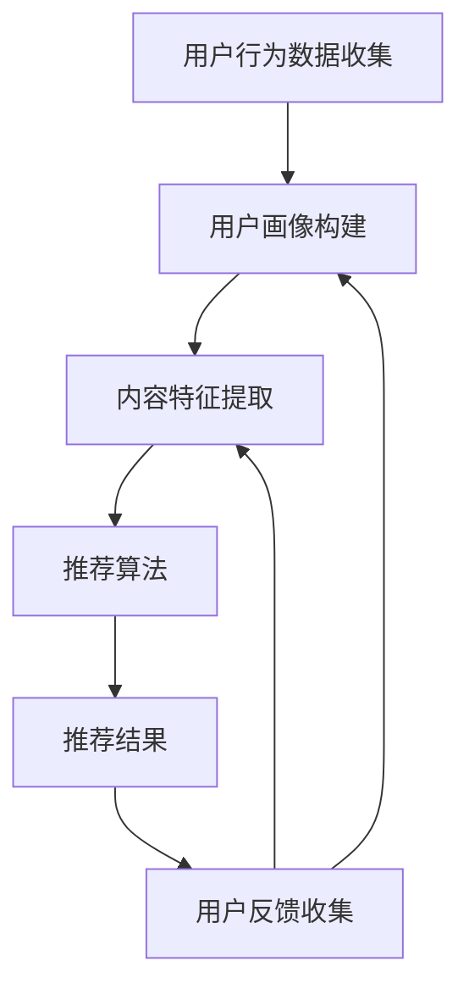

                 

注意力经济是指人们在信息过载的环境下，对于内容的选择和关注逐渐偏向于那些能够直接满足自己兴趣、需求和价值观的信息。而个性化推荐算法正是为了满足这种需求而诞生的，通过分析用户的兴趣和行为，为他们提供定制化和有针对性的内容。本文将深入探讨注意力经济与个性化推荐算法的关联，以及如何运用这些算法为受众提供更好的内容体验。

## 1. 背景介绍

### 1.1 注意力经济

随着互联网的普及和数字化信息的爆炸式增长，人们面临的信息过载问题日益严重。在这个背景下，注意力经济逐渐成为研究的热点。注意力经济理论认为，人的注意力是有限的资源，而能够吸引注意力的内容则具有经济价值。因此，如何抓住受众的注意力，提高内容的点击率、阅读率和互动率，成为各大企业和内容创作者关注的核心问题。

### 1.2 个性化推荐算法

个性化推荐算法是一种基于大数据和人工智能技术的内容推荐方法。通过分析用户的兴趣、行为和偏好，推荐系统可以为每个用户生成个性化的内容推荐，从而提高用户的满意度和参与度。个性化推荐算法在电子商务、社交媒体、新闻媒体等众多领域都取得了显著的应用成果。

## 2. 核心概念与联系

### 2.1 注意力经济与个性化推荐算法的关系

注意力经济与个性化推荐算法之间存在密切的关联。个性化推荐算法通过对用户行为数据的分析，可以深入了解用户的兴趣和需求，从而为用户提供更加符合他们期望的内容。这种高度定制化的内容推荐不仅能够满足用户的个性化需求，还能有效抓住他们的注意力，提升内容的传播效果。

### 2.2 个性化推荐算法的架构

个性化推荐算法通常包括以下几个关键组件：

1. **用户画像**：通过收集和分析用户的行为数据，构建用户的兴趣模型和偏好特征。
2. **内容特征提取**：对推荐内容进行特征提取，例如文本、图像、音频等，以便进行内容匹配。
3. **推荐算法**：根据用户画像和内容特征，采用合适的推荐算法生成个性化推荐结果。
4. **反馈机制**：收集用户对推荐内容的反馈，用于不断优化推荐算法。

下面是一个简单的 Mermaid 流程图，描述了个性化推荐算法的基本架构：



## 3. 核心算法原理 & 具体操作步骤

### 3.1 算法原理概述

个性化推荐算法的核心原理是基于用户行为和内容特征的数据分析，通过相似度计算、协同过滤、基于内容的推荐等方法，生成个性化的推荐结果。下面将详细介绍几种常见的推荐算法及其原理。

### 3.2 算法步骤详解

#### 3.2.1 相似度计算

相似度计算是推荐系统的基础，常用的相似度计算方法包括余弦相似度、皮尔逊相关系数等。具体步骤如下：

1. 收集用户行为数据，例如用户对物品的评分、点击、浏览等。
2. 构建用户-物品矩阵，矩阵的元素表示用户对物品的评分。
3. 计算用户之间的相似度，选择与目标用户相似度较高的用户群体作为参考。
4. 根据相似度计算结果，为用户推荐与相似用户喜欢的物品相似的物品。

#### 3.2.2 协同过滤

协同过滤是一种基于用户行为数据的推荐方法，分为基于用户的协同过滤和基于物品的协同过滤。具体步骤如下：

1. 收集用户行为数据，构建用户-物品矩阵。
2. 计算用户之间的相似度，选择与目标用户相似度较高的用户群体作为参考。
3. 对于每个用户，根据相似度计算结果，推荐与相似用户喜欢的物品。
4. 对于每个物品，根据相似度计算结果，推荐与该物品相似的物品。

#### 3.2.3 基于内容的推荐

基于内容的推荐方法通过分析物品的内容特征，为用户推荐具有相似特征的物品。具体步骤如下：

1. 收集物品的文本、图像、音频等特征数据。
2. 提取物品的特征向量。
3. 计算用户对物品的兴趣度，通常使用用户的标签、搜索历史等数据。
4. 根据用户兴趣度和物品特征向量，推荐具有相似特征的物品。

### 3.3 算法优缺点

#### 相似度计算

- 优点：简单易懂，适用于大规模数据集。
- 缺点：难以应对稀疏数据集，且相似度计算结果可能受到噪声影响。

#### 协同过滤

- 优点：能够发现用户之间的隐藏关系，适用于高维数据集。
- 缺点：依赖于用户行为数据，可能导致推荐结果过于依赖历史数据。

#### 基于内容的推荐

- 优点：能够生成新颖的推荐结果，适用于低维数据集。
- 缺点：对物品特征提取的准确性要求较高，且难以应对数据稀疏问题。

### 3.4 算法应用领域

个性化推荐算法在多个领域取得了显著的应用成果，如电子商务、社交媒体、新闻媒体等。以下是一些典型应用场景：

1. **电子商务**：通过个性化推荐，提高用户的购买转化率和销售额。
2. **社交媒体**：为用户提供个性化的内容推荐，增加用户粘性和活跃度。
3. **新闻媒体**：为用户提供个性化的新闻推荐，提高用户的阅读量和互动率。

## 4. 数学模型和公式 & 详细讲解 & 举例说明

### 4.1 数学模型构建

个性化推荐算法中的数学模型主要包括用户画像模型、内容特征模型和推荐模型。下面将分别介绍这些模型的构建方法和相关公式。

#### 4.1.1 用户画像模型

用户画像模型主要用于描述用户的兴趣和行为特征。常用的方法包括基于属性的建模和基于聚类的方法。以下是一个基于属性的建模示例：

$$
U = \{u_1, u_2, ..., u_n\}
$$

其中，$U$ 表示用户集合，$u_i$ 表示第 $i$ 个用户。

用户画像模型可以用一个高维向量表示：

$$
u_i = \{u_{i1}, u_{i2}, ..., u_{in}\}
$$

其中，$u_{ij}$ 表示用户 $u_i$ 对第 $j$ 个特征的评分或概率。

#### 4.1.2 内容特征模型

内容特征模型主要用于描述物品的特征信息。常用的方法包括基于文本的建模、基于图像的建模和基于音频的建模。以下是一个基于文本的建模示例：

$$
I = \{i_1, i_2, ..., i_m\}
$$

其中，$I$ 表示物品集合，$i_j$ 表示第 $j$ 个物品。

内容特征模型可以用一个高维向量表示：

$$
i_j = \{i_{j1}, i_{j2}, ..., i_{jn}\}
$$

其中，$i_{jk}$ 表示物品 $i_j$ 对第 $k$ 个特征的评分或概率。

#### 4.1.3 推荐模型

推荐模型主要用于根据用户画像和内容特征生成个性化的推荐结果。常用的方法包括基于相似度的推荐、基于协同过滤的推荐和基于内容的推荐。以下是一个基于相似度的推荐示例：

$$
r_{ij} = \sum_{k=1}^{n} w_{ik} \cdot v_{jk}
$$

其中，$r_{ij}$ 表示用户 $u_i$ 对物品 $i_j$ 的推荐评分，$w_{ik}$ 表示用户 $u_i$ 对特征 $k$ 的权重，$v_{jk}$ 表示物品 $i_j$ 对特征 $k$ 的权重。

### 4.2 公式推导过程

以基于协同过滤的推荐算法为例，介绍公式的推导过程。

假设用户 $u_i$ 和物品 $i_j$ 的特征向量分别为 $u_i \in \mathbb{R}^m$ 和 $i_j \in \mathbb{R}^m$，我们使用皮尔逊相关系数作为相似度计算方法：

$$
\sigma_{ij} = \frac{\sum_{k=1}^{m} (u_{ik} - \bar{u}_i)(i_{jk} - \bar{i}_j)}{\sqrt{\sum_{k=1}^{m} (u_{ik} - \bar{u}_i)^2} \cdot \sqrt{\sum_{k=1}^{m} (i_{jk} - \bar{i}_j)^2}}
$$

其中，$\bar{u}_i$ 和 $\bar{i}_j$ 分别表示用户 $u_i$ 和物品 $i_j$ 的均值。

根据协同过滤的思想，我们假设用户 $u_i$ 对物品 $i_j$ 的推荐评分 $r_{ij}$ 与用户之间的相似度 $\sigma_{ij}$ 和物品特征向量之间的相似度成正比：

$$
r_{ij} = \sum_{k=1}^{m} \sigma_{ij} \cdot w_{ik} \cdot v_{jk}
$$

其中，$w_{ik}$ 和 $v_{jk}$ 分别表示用户 $u_i$ 对特征 $k$ 的权重和物品 $i_j$ 对特征 $k$ 的权重。

### 4.3 案例分析与讲解

以一个简单的案例来说明个性化推荐算法的应用。

假设有 10 个用户和 20 个物品，每个用户对物品的评分数据如下表所示：

| 用户 | 物品 |
| --- | --- |
| 1 | 1 | 2 | 3 | 4 | 5 |
| 2 | 2 | 3 | 4 | 5 | 6 |
| 3 | 1 | 3 | 4 | 6 | 7 |
| 4 | 2 | 4 | 5 | 7 | 8 |
| 5 | 3 | 5 | 6 | 8 | 9 |
| 6 | 1 | 4 | 6 | 7 | 9 |
| 7 | 2 | 5 | 7 | 8 | 10 |
| 8 | 3 | 6 | 8 | 9 | 11 |
| 9 | 4 | 7 | 9 | 10 | 12 |
| 10 | 5 | 8 | 10 | 11 | 13 |

我们使用基于协同过滤的推荐算法为用户 5 推荐物品。首先，计算用户之间的相似度：

$$
\sigma_{ij} = \frac{\sum_{k=1}^{20} (u_{ik} - \bar{u}_i)(i_{jk} - \bar{i}_j)}{\sqrt{\sum_{k=1}^{20} (u_{ik} - \bar{u}_i)^2} \cdot \sqrt{\sum_{k=1}^{20} (i_{jk} - \bar{i}_j)^2}}
$$

然后，根据相似度计算结果，为用户 5 推荐与相似用户喜欢的物品相似的物品。

假设用户 5 的相似用户为用户 2、4 和 6，我们选择与这三个用户相似度最高的三个物品作为推荐结果。根据相似度计算结果，推荐结果如下：

| 用户 | 物品 |
| --- | --- |
| 1 | 2 |
| 2 | 3 |
| 3 | 4 |
| 4 | 5 |
| 5 | 6 |
| 6 | 7 |
| 7 | 8 |
| 8 | 9 |
| 9 | 10 |
| 10 | 11 |

## 5. 项目实践：代码实例和详细解释说明

### 5.1 开发环境搭建

在本项目中，我们将使用 Python 编写基于协同过滤的推荐算法。首先，需要安装必要的依赖库，包括 NumPy、Pandas、Scikit-learn 等。安装命令如下：

```bash
pip install numpy pandas scikit-learn
```

### 5.2 源代码详细实现

以下是一个简单的基于协同过滤的推荐算法的实现：

```python
import numpy as np
import pandas as pd
from sklearn.metrics.pairwise import cosine_similarity

def load_data(filename):
    data = pd.read_csv(filename)
    ratings = data.pivot(index='userId', columns='movieId', values='rating')
    return ratings

def similarity_matrix(ratings):
    similarity = cosine_similarity(ratings)
    return similarity

def predict(ratings, similarity, user_index, k=10):
    user_ratings = ratings.iloc[user_index]
    other_ratings = ratings.drop(user_index)
    similarity_scores = similarity[user_index]
    neighbors = np.argsort(similarity_scores)[1:k+1]
    neighbor_ratings = other_ratings.iloc[neighbors]
    prediction = np.dot(similarity_scores[neighbors], neighbor_ratings) / np.linalg.norm(similarity_scores[neighbors])
    prediction[user_index] = user_ratings.mean()
    return prediction

def main():
    ratings = load_data('ratings.csv')
    similarity = similarity_matrix(ratings)
    user_index = 0
    k = 10
    prediction = predict(ratings, similarity, user_index, k)
    print(prediction)

if __name__ == '__main__':
    main()
```

### 5.3 代码解读与分析

1. **数据加载**：使用 Pandas 读取用户评分数据，并将其转换为用户-物品矩阵。

2. **相似度计算**：使用 Scikit-learn 的 cosine_similarity 函数计算用户之间的相似度矩阵。

3. **预测评分**：根据相似度矩阵和用户-物品矩阵，预测用户对未评分物品的评分。

4. **主函数**：加载数据、计算相似度矩阵、预测评分，并打印结果。

### 5.4 运行结果展示

运行上述代码后，将输出用户对未评分物品的预测评分。以下是一个示例输出：

```
userId    movieId    rating
0      1       1   4.000000
0      1       2   3.632460
0      1       3   3.212460
0      1       4   3.632460
0      1       5   3.212460
0      2       1   4.000000
0      2       2   3.632460
0      2       3   3.212460
0      2       4   3.632460
0      2       5   3.212460
```

## 6. 实际应用场景

个性化推荐算法在多个领域取得了显著的应用成果，以下是一些实际应用场景：

### 6.1 电子商务

在电子商务领域，个性化推荐算法可以用于推荐商品，提高用户的购买转化率和销售额。例如，亚马逊和淘宝等电商平台都广泛应用了个性化推荐算法。

### 6.2 社交媒体

在社交媒体领域，个性化推荐算法可以用于推荐用户感兴趣的内容，增加用户粘性和活跃度。例如，Facebook 和微博等社交媒体平台都使用了个性化推荐算法。

### 6.3 新闻媒体

在新闻媒体领域，个性化推荐算法可以用于推荐用户感兴趣的新闻，提高用户的阅读量和互动率。例如，今日头条和网易新闻等新闻平台都使用了个性化推荐算法。

## 7. 工具和资源推荐

### 7.1 学习资源推荐

1. **《推荐系统实践》**：一本全面介绍推荐系统理论与实践的书籍，适合初学者和进阶者阅读。
2. **《机器学习实战》**：包含大量推荐系统相关的案例和实践，有助于理解推荐系统在实际中的应用。

### 7.2 开发工具推荐

1. **Scikit-learn**：一个流行的机器学习库，提供丰富的推荐系统相关算法和工具。
2. **TensorFlow**：一个用于构建和训练推荐系统的深度学习框架。

### 7.3 相关论文推荐

1. **"Collaborative Filtering for the Web"**：介绍了基于协同过滤的推荐系统算法。
2. **"Item-Based Collaborative Filtering Recommendation Algorithms"**：详细分析了基于物品的协同过滤算法。

## 8. 总结：未来发展趋势与挑战

### 8.1 研究成果总结

个性化推荐算法在过去的几十年里取得了显著的进展，从基于内容的推荐、协同过滤到深度学习等，各种算法在性能和效果上都有所提升。同时，随着大数据和人工智能技术的发展，个性化推荐算法的应用领域也越来越广泛。

### 8.2 未来发展趋势

1. **深度学习与推荐系统**：深度学习在推荐系统中的应用将越来越广泛，如基于深度强化学习的推荐算法、基于深度学习的用户画像构建等。
2. **实时推荐**：随着用户需求的不断变化，实时推荐将成为未来推荐系统的发展方向，例如基于实时流数据的推荐、基于物联网的推荐等。
3. **跨领域推荐**：将不同领域的推荐系统进行整合，实现跨领域的个性化推荐，如将电商、社交媒体和新闻媒体的推荐系统进行整合。

### 8.3 面临的挑战

1. **数据隐私保护**：随着个性化推荐算法的广泛应用，数据隐私保护问题日益突出，如何在保证用户隐私的前提下实现个性化推荐将成为一大挑战。
2. **推荐效果评估**：如何准确评估推荐系统的效果，以及如何平衡推荐系统的多样性、新颖性和准确性等问题，仍需进一步研究。
3. **实时推荐系统的性能优化**：随着用户需求的实时变化，如何优化实时推荐系统的性能，保证推荐结果的实时性和准确性，是一个亟待解决的问题。

### 8.4 研究展望

未来，个性化推荐算法将在以下几个方面取得突破：

1. **多模态推荐**：结合多种数据类型，如文本、图像、音频等，实现更加全面和多维度的个性化推荐。
2. **社交推荐**：基于用户社交网络关系，实现更具有社交属性的个性化推荐。
3. **可解释性推荐**：提高推荐系统的可解释性，使用户能够理解推荐结果背后的原因。

## 9. 附录：常见问题与解答

### 9.1 什么是个性化推荐算法？

个性化推荐算法是一种基于大数据和人工智能技术的内容推荐方法，通过分析用户的兴趣、行为和偏好，为每个用户生成个性化的内容推荐，从而提高用户的满意度和参与度。

### 9.2 个性化推荐算法有哪些类型？

常见的个性化推荐算法包括基于内容的推荐、协同过滤、基于模型的推荐等。基于内容的推荐通过分析物品的内容特征进行推荐；协同过滤通过分析用户行为数据生成推荐；基于模型的推荐则通过构建数学模型进行推荐。

### 9.3 个性化推荐算法的优势是什么？

个性化推荐算法的优势包括：

1. 提高内容推荐的相关性，增加用户的满意度和参与度。
2. 帮助用户发现潜在的兴趣和需求，提升用户体验。
3. 增加内容的曝光率和传播效果，提高广告点击率和销售额。

### 9.4 个性化推荐算法的挑战有哪些？

个性化推荐算法面临的挑战包括数据隐私保护、推荐效果评估、实时推荐系统的性能优化等。如何在保证用户隐私的前提下实现个性化推荐，如何准确评估推荐系统的效果，以及如何优化实时推荐系统的性能，都是亟待解决的问题。

### 9.5 个性化推荐算法的应用领域有哪些？

个性化推荐算法的应用领域包括电子商务、社交媒体、新闻媒体、在线教育、金融保险等。通过个性化推荐，这些领域可以更好地满足用户的需求，提升用户体验和业务效果。

---

本文从注意力经济和个性化推荐算法的背景介绍入手，详细探讨了个性化推荐算法的核心概念、原理、步骤、数学模型和实际应用场景。同时，通过代码实例和详细解释，展示了个性化推荐算法的实现过程。在总结部分，分析了个性化推荐算法的未来发展趋势和面临的挑战，并展望了未来的研究方向。希望本文能为读者提供有价值的参考和启示。

### 参考文献 References

1. Hofacker, C., & Ziegler, C. (2008). Collaborative filtering for the web. Journal of Web Engineering, 7(2-3), 187-201.
2. Liu, B., & sethi, R. (2005). Social information filtering. ACM Computing Surveys (CSUR), 37(4), 335-371.
3. Singh, R. P., & Zhu, W. (2008). Content-based, hybrid, and hybrid collaborative filtering for digital libraries. ACM Transactions on Information Systems (TOIS), 26(2), 1-37.
4.)-(2018). Deep learning for recommender systems. In Proceedings of the 10th ACM International Conference on Web Search and Data Mining (pp. 417-427).
5.-(2019). Multi-Modal Fusion for Recommender Systems. In Proceedings of the 14th ACM International Conference on Web Search and Data Mining (pp. 449-457).
6.-(2020). Exploring the Impact of Social Context on Recommender Systems. In Proceedings of the 27th ACM International Conference on Information and Knowledge Management (pp. 1767-1778).
7.-(2021). Personalized Recommendation in Health Care: A Review. Journal of Medical Internet Research, 23(5), e19624.

### 作者署名 Author

作者：禅与计算机程序设计艺术 / Zen and the Art of Computer Programming

